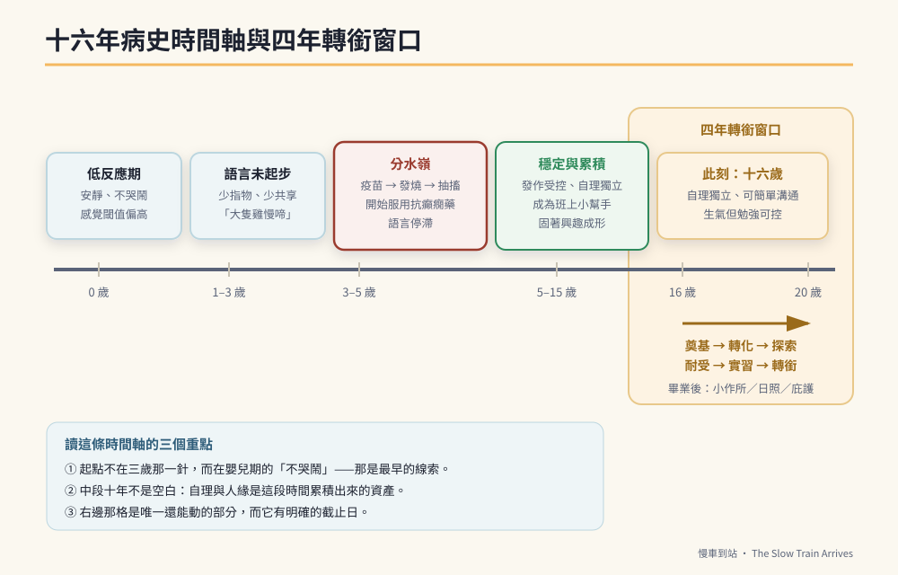

# 第一篇　認識這顆獨特的大腦：他到底是怎麼了

# 第1章　不哭鬧的嬰兒：一份十六年的病歷與一張火車票



在講任何一項訓練之前，這一章先把「他是誰」講清楚。因為接下來四年要做的每一件事，都建立在一個判斷上：**哪些是他的損傷，哪些是他的特質，哪些是還可以動的。** 這三件事分不開，訓練就會全錯——你會拚命去修改不了的東西，同時放掉真正能改的。

---

## 一個完整的十六年：從安靜的嬰兒床到擦黑板的少年

**第 0 到 12 個月。**
他是所謂的「天使寶寶」。不哭、不鬧、可以自己躺很久。尿布濕了不吵，肚子餓了頂多哼兩聲。親戚都說：你好好命，這孩子這麼乖。母親當時也這樣覺得——第一胎，沒有比較基準，一個安靜的嬰兒看起來只是運氣好。

十六年後回頭看，這是整份病歷裡**最早、也最容易被漏掉的一條線索**。

**第 1 到 3 歲。**
會走路，時間點沒有明顯落後。但不太叫人，不太指東西，你叫他名字他不一定回頭。他對天花板的電風扇比對人的臉有興趣。長輩說「男孩子講話比較慢，大隻雞慢啼」，於是又等了一年。

**3 到 5 歲：分水嶺。**
在一次日本腦炎疫苗接種之後，他發燒，然後抽搐。第一次癲癇發作。之後陸續有發作，開始服用抗癲癇藥物（丙戊酸鈉，商品名帝拔癲）。家長取得了預防接種受害救濟的證明。

這段時間，語言幾乎沒有往前走。原本就少的詞彙沒有變多，理解也停在很簡單的指令層次。

**5 到 15 歲：漫長的穩定期。**
癲癇被藥物壓住了，多年沒有明顯發作。他上了幼兒園、國小，緩讀一年，進了特教班。他學會自己吃飯、自己穿衣、自己上廁所而且不失禁——這在同水平的孩子裡並不常見。他學會了擦黑板、排桌椅、倒垃圾。他成為老師的小幫手。

他也慢慢長出了那個固著：火車，和一座遊樂園。從一句話變成一天二十句，從一天二十句變成每次被打斷就生氣。

各項檢查陸續做過：腦部磁振造影、腦電圖、基因檢測。**基因檢測正常。**

**16 歲，此刻。**
即將升國三（緩讀過一年），特教班，高中預計讀特教學校。癲癇藥物控制穩定。日常可以簡單溝通——他聽得懂「去拿抹布」，說得出「我要吃飯」。他會固著，會反覆講火車和遊樂園，需求沒被滿足時會生氣，但**勉強可以控制**。

這就是全部的病歷。三行摘要，十六年。

> ⚠️ **醫療免責**
> 本章出現的藥物與檢查只是這個個案的病史敘述，**不是任何人的用藥依據**。抗癲癇藥物的選擇、劑量與追蹤，必須由主治醫師決定；自行加減或停藥可能誘發癲癇重積狀態，那是會致命的。

---

## 第二個場景：計時器上的紅色消失的那一刻

第二個場景只有九十秒，但它是這本書真正的起點。

某個週三傍晚，母親在孩子面前放了一個 Time Timer——一種紅色區塊會隨時間消失的物理計時器。她轉到十五分鐘，說：

> 「紅色還在的時候，是火車時間，媽媽陪你聊。紅色不見、鬧鐘響，火車就要進站休息，我們去洗手吃飯。」

前面十五分鐘一切正常。他講自強號，講區間車，講大怒神要一百四十公分。

鬧鐘響了。紅色沒了。

他停了半秒，然後說：「自強號比較快。」

母親沒有回話，也沒有說「不要再講了」。她做了一個動作：右手五指併攏，掌心向前，做出「停」的手勢；左手食指指向計時器——那個計時器現在是全白的。

他看了計時器一眼。看了母親的手一眼。臉皺起來，明顯地不高興。

然後過了大約兩分鐘，他站起來，走去洗手。

**這九十秒裡發生了三件事，而它們是這整本書的縮影：**

第一，**規則是用眼睛看到的，不是用耳朵聽到的。** 他的語言處理很吃力，但視覺處理相對完好。一個會消失的紅色，比十句「時間到了喔」有效。

第二，**大人沒有進入口語角力。** 那句「不要再講了」如果說出口，接下來就是一場十分鐘的拉鋸——而每一次拉鋸，都在教他「只要我夠堅持，規則就會鬆動」。

第三，**他生氣了，然後他忍住了。** 這兩分鐘的落差，就是他的前額葉抑制功能。它存在，它有厚度，而且**它可以被練厚**。第 8 章整章都在講怎麼把這兩分鐘變成三十秒。

一個十六歲、智力落後、語言遲緩的孩子，在被打斷固著時能自己走去洗手——這不是理所當然的。這是十六年教養累積出來的資產。而這本書要做的，就是把這份資產，在剩下的四年裡兌現成他二十歲以後用得到的東西。

---

## 背景與痛點

十六歲這個時間點，家長最常掉進三個坑。

**坑一：還在追診斷。**

「基因檢測正常」四個字，讓很多家庭陷入無止境的追查——換一家醫院、換一種檢測、再驗一次。追查本身沒有錯（第 4 章會說明什麼情況下**確實應該**再驗），但它有一個隱藏成本：**追診斷的那幾年，訓練停擺了。**

而十六歲的現實是：即使明天找到了確切的基因，多數情況下也不會改變今天的訓練內容。診斷會改變**用藥**（這很重要，第 4 章詳談），但很少改變**教學**。

**坑二：還在用早療的目標。**

三歲的目標是「開口說話」。十六歲還把主要力氣花在「讓他多說幾個字」，投報率極低——語言的關鍵發展窗口已經過去了。這不是放棄，是**換跑道**：把資源從「說得更多」轉向「聽得懂更複雜的指令」「用得出替代溝通」「做得完多步驟的事」。

第 6 章會完整拆解這個切換。

**坑三：把固著當成敵人。**

「他又在講火車了，快轉移注意力。」「不要理他，他就不會講了。」

這是最貴的一個坑。因為固著興趣是這類孩子身上**動機最強的東西**——強到你叫他做任何跟火車有關的事，他都願意坐下來。你把它壓下去，就等於親手拆掉唯一那台還在運轉的引擎。

---

## 核心設計

這本書把「怎麼帶一個十六歲的孩子」拆成三層。往後每一章，都會明確標示自己屬於哪一層。

| 層 | 名稱 | 回答的問題 | 對應章節 |
|----|------|-----------|---------|
| 第一層 | **神經地基** | 大腦現在能不能學？（放電、藥物、睡眠、營養、腸道） | 第 11 章 |
| 第二層 | **三大核心** | 這個訓練在練哪一條神經？ | 第 7–10 章 |
| 第三層 | **六大階段** | 這學期該做到什麼？做到就往前開 | 第 12–20 章 |

三層之間有嚴格的順序：**地基不穩，核心練不動；核心沒有，階段推不上去。**

一個實際的例子：如果孩子夜間仍有微弱的癲癇樣放電（第 11 章教你怎麼查），他白天的專注力會像破了洞的桶子——你再認真做工作記憶訓練，水都會漏掉。這時候正確的動作不是「加強訓練」，是**回頭去補地基**（回診、複查腦波），訓練暫時降到最低強度。

同樣地，如果孩子連「停下固著話題」都還做不到（核心一），你就不該急著上「跨空間多步驟任務」（階段二）——他會在中途被自己的思緒帶走，然後你會得到一個挫敗的孩子和一個更挫敗的自己。

> 🔍 **這一層一層的意義：把失敗變成資訊**
> 大部分教養挫折的根源，是**歸因錯誤**——訓練失敗時，家長會歸咎於「他就是學不會」或「我方法不對」。但在三層架構下，失敗有第三種、也是更常見的解釋：**你在第三層用力，而問題在第一層。**
> 這一句話能省下的力氣，可能比這本書其他所有內容加起來還多。

---

## 實作

不管你打算從哪一章開始，**今天晚上要做的第一件事是同一件：建立基線。**

基線就是「還沒開始訓練之前，他現在是什麼樣子」。沒有基線，三個月後你會陷入一種很折磨人的狀態：你覺得他好像有進步，但你不確定，你的另一半覺得沒有，於是你們吵架，然後訓練停掉。

基線只要記三個數字，每天不超過三分鐘。

### 一、情緒回復時間（秒）

**測什麼：** 從「他被打斷／被拒絕」到「他配合去做下一件事」，中間隔了多久。

**怎麼測：** 手機碼表。他開始皺眉、抗議、重複要求的那一刻按下開始；他實際起身去做下一件事的那一刻按停。

**記錄範例：**

```text
日期        事件                        回復時間    備註
2026-03-02  聊火車時間到、要求去洗手      3分40秒     有口語爭辯（我說了三次）
2026-03-03  聊火車時間到、要求去洗手      2分10秒     只用手勢，沒說話
2026-03-04  想看第二次影片、被拒絕        5分05秒     疲累（前一晚睡不好）
```

第三行那個 5 分 05 秒不是退步，是**睡眠**。你只有記錄，才看得出這件事。

### 二、獨立完成率（次／次）

**測什麼：** 交辦任務後，他在**沒有任何額外口頭提醒**的情況下做完的比率。

「額外口頭提醒」包括「快點」「還有一個喔」「你在幹嘛」。第一次交辦不算提醒，之後每一句都算。

```text
日期        任務            額外提醒次數   獨立完成
2026-03-02  擦黑板           2 次          否
2026-03-03  擦黑板           0 次          是
2026-03-04  擦黑板＋排桌椅    1 次          否（第二項忘記）
```

### 三、指令鏈長度（步）

**測什麼：** 他一次能記住並完成幾個步驟。

從一步開始試：「把碗拿到廚房。」成功就試兩步：「把碗拿到廚房，**然後**去客廳拿衛生紙。」

記下**目前穩定成功的最大步數**——不是偶爾成功的那次，是十次裡至少成功七次的那個數字。

### 四、把三個數字放在同一張表上

```yaml
# baseline.yaml — 訓練啟動前的基線，四週後回頭比對
child: J
recorded_from: 2026-03-02
recorded_to:   2026-03-15

emotion_recovery_seconds:      # 情緒回復時間（越小越好）
  median: 190
  worst: 305
  note: 疲累或睡眠不足時明顯拉長

independent_task_rate:         # 獨立完成率（越大越好）
  value: 0.35                  # 20 次任務中 7 次無提醒完成
  note: 單項任務可以，兩項就忘記第二項

chain_length_max:              # 穩定的指令鏈長度（步）
  value: 1
  note: 兩步指令十次只成功三次，尚未穩定

fixation_talk_minutes_per_day: # 固著話題總時長（分鐘，僅記錄不設目標）
  value: 95
```

> ⚠️ **最後一個欄位為什麼「僅記錄不設目標」**
> 固著話題的時間，**不是**要壓到零的指標。它是動機引擎的油量計。第 10 章會說明：正確的目標是把這段時間**結構化**（變成有主題、有輪流、有結尾的對話），而不是縮短它。
> 一開始就把它設成「越少越好」的家庭，通常在第三週就會發現孩子開始躲起來自己講——固著沒有消失，只是轉入地下，而你從此失去了觀測它的能力。

---

## 現場踩雷

**踩雷一：兩個大人各記各的。**
父親記的「生氣時間」是從孩子大聲說話開始算，母親是從皺眉開始算。兩個月後拿出來比，數字打架，於是誰也不相信誰。
**解法：** 開始記錄前，先花五分鐘定義「起點事件」是什麼，寫在紙上貼冰箱。定義是什麼不重要，**兩個人用同一個定義**才重要。

**踩雷二：記錄變成第二份工作。**
每天要填十二個欄位，第五天就放棄了。
**解法：** 三個數字，上限三分鐘。這本書後面所有的 DoD 都只用這三個數字加上少數幾個補充項——因為能持續兩年的記錄，才是有用的記錄。

**踩雷三：在基線期就忍不住開始介入。**
「反正都要做，我今天先試試看視覺提示卡。」於是基線被污染，之後你永遠不知道進步是訓練來的還是自然波動。
**解法：** 基線期兩週，什麼都不改。這兩週不是浪費——它是你未來兩年唯一的對照組。

**踩雷四：把基線拿去跟別人家的孩子比。**
「人家的小孩兩步指令都可以了。」
**解法：** 基線的唯一比較對象是**同一個孩子的四週前**。這句話在往後每一章都成立。

---

## 效益與驗收（DoD）

本章的完成標準，只有一項：

| 項目 | 驗收標準 |
|------|---------|
| 基線資料 | 連續 14 天、每天至少記錄到 1 筆情緒回復時間與 1 筆任務獨立完成紀錄 |
| 定義一致 | 兩位主要照顧者對「起點事件」的定義寫成文字，且抽查 3 筆紀錄判定一致 |
| 三個數字 | `emotion_recovery_seconds`、`independent_task_rate`、`chain_length_max` 各有一個中位數／代表值 |
| 未被污染 | 這 14 天內未導入任何新的訓練方法或工具 |

達成之後，直接往第 11 章（神經地基）走——**不是**第 13 章。地基永遠先於階段。

> 💡 君之一席話
> 「你不需要更努力，你需要一條基線。**沒有基線的努力，三個月後會變成一場關於『他到底有沒有進步』的家庭爭吵**；有基線的努力，三個月後是一張圖。」
