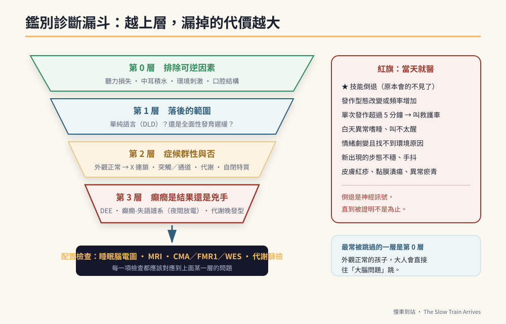

# 第3章　鑑別診斷的漏斗：當四個特徵同時出現



## 背景與痛點

「男孩、外觀完全正常、語言遲緩、智力落後、三到五歲出現癲癇。」

這五個條件湊在一起的時候，家長會遇到一個特殊的困境：**每一位專業人員都只回答自己那一塊，而沒有人把整張圖拼給你看。**

耳鼻喉科說聽力沒問題。復健科說要做語言治療。小兒神經科說癲癇先控制住。遺傳科說可以考慮做檢測。特教老師說先辦鑑定安置。每一句都對，但你回到家仍然不知道：**這五個特徵到底是一件事，還是五件事？**

這一章給你那張圖。它是一個漏斗——從最外層「可逆的、可治療的、最不該漏掉的」開始，一層一層往內收。

> ⚠️ **醫療免責**
> 本章是**理解框架**，不是診斷流程，更不能拿來自我診斷或推翻醫師判斷。每一層該做哪些檢查、什麼時候做、要不要做，都由醫師依孩子的實際狀況決定。這一章的用途是：讓你在門診時聽得懂、問得出、也記得住。

---

## 核心設計：四層漏斗

漏斗的順序不是隨便排的。它按照一個原則：**越上層，漏掉的代價越大。**

| 層 | 問題 | 為什麼放在這一層 | 主要工具 |
|----|------|----------------|---------|
| **第 0 層** | 是不是「聽不到、所以不會說」？ | 可完全矯正，漏掉等於白費數年訓練 | 聽力檢查、中耳評估 |
| **第 1 層** | 是**單純語言**落後，還是**全面**落後？ | 決定訓練是「單科」還是「整體」 | 兒童發展聯合評估 |
| **第 2 層** | 是症候群性，還是非症候群性？ | 決定要不要往全身系統排查 | 理學檢查、外觀特徵、家族史 |
| **第 3 層** | 癲癇是**結果**，還是**兇手**？ | 決定治療是否需要更積極 | 睡眠腦電圖、腦部影像、基因、代謝 |

---

## 實作

### 第 0 層：先把「物理與環境」排除掉

這一層看起來最基礎，卻是最常被跳過的一層——因為孩子的外觀正常，大人會直覺往「大腦問題」跳。

| 要排除的 | 為什麼 | 怎麼查 |
|---------|--------|--------|
| 聽力損失、中耳積水 | 聽損兒童外觀完全正常；反覆中耳積水會造成間歇性的傳導性聽損，孩子聽到的是一段一段的語音 | 純音聽力檢查、耳聲傳射、鼓室圖 |
| 環境刺激不足 | 主要照顧者極少對話、長時間 3C、多語混雜輸入 | 誠實回顧一日作息，不必羞愧，只需誠實 |
| 口腔動作結構問題 | 舌繫帶、腭裂等會影響構音（但不影響理解） | 口腔理學檢查 |

**這一層的關鍵提問是：「他是聽不到、聽不清，還是聽到了但解不開？」** 三種的處理完全不同。

### 第 1 層：單純語言落後，還是全面落後？

| | 發展性語言障礙（DLD／SLI） | 全面性發育遲緩 |
|---|---|---|
| 智力（非語文） | 正常範圍 | 落後 |
| 生活自理 | 符合年齡 | 落後 |
| 語言 | 明顯落後 | 落後（與整體一致） |
| 訓練重點 | 語言治療為主軸 | **認知、注意力、動作先行**，語言隨後 |

這一層決定了訓練的重心。**如果是全面性落後，只做語言治療的投報率會很低**——因為孩子不是「有想法說不出來」，而是連要表達的那個想法都還沒成形。此時職能治療（注意力、手眼協調）與認知訓練必須同步進行，語言才推得動。

本書的個案屬於後者：智力與語言雙重落後，而生活自理反而發展得很好。這個組合本身就是重要資訊——**它說明訓練是有效的，只是過去主要作用在自理，而非語言。**

### 第 2 層：症候群性，還是非症候群性？

「外觀完全正常」是本書個案最重要的一條線索。它把診斷可能性收斂了一大半。

在遺傳性智能障礙合併癲癇的個案中，相當比例（常見估計約六到七成）**外觀完全正常**——五官端正、骨骼正常、身材比例正常。這一群被稱為**非症候群性**：突變只微觀地影響大腦突觸或離子通道，不影響外形發育。

外觀正常時，臨床上會優先考慮的方向：

**A. 男性特有的 X 染色體連鎖疾病**
男性只有一條 X 染色體，該染色體上的關鍵基因一旦突變就直接發病。

- **脆折 X 症候群（FMR1）**：男性遺傳性智力與語言落後**最常見**的原因。幼兒期外觀往往完全正常（長臉、大耳等特徵多在青春期後才明顯），常合併過動、眼神接觸差、語言重複。**這是男童幾乎必查的一項。**
- **ARX**：影響 GABA 神經元發育，表現為智力落後合併嚴重語言障礙，外觀無異常。
- **KDM5C**：明顯認知障礙與表達性言語喪失，外觀正常。

**B. 突觸與離子通道的新發突變**
`SYNGAP1`、`GRIN2B`、`SLC6A1` 這一群。典型軌跡是：幼兒期中重度智力與語言遲緩 → **3 至 5 歲爆發癲癇** → 青春期後癲癇逐漸較好控制，但認知與語言障礙留下來。

這條軌跡與本書個案高度吻合。

**C. 隱性代謝疾病**
出生時完全正常，隨毒素累積逐步侵蝕。這一群單獨在第 4 章處理，因為**其中有極少數是可以治療的**。

**D. 自閉症類群（ASD）**
外觀正常，核心在社交溝通障礙與重複刻板行為。它不是上面三者的替代選項——**它可以與上面任何一項並存**，而且在本書個案身上，自閉特質確實與神經損傷同時存在（見第 5 章）。

### 第 3 層：癲癇是結果，還是兇手？

這是整個漏斗最關鍵、也最容易被誤解的一層。

三到五歲這個時間點不是巧合。它是大腦神經網絡快速複雜化的階段，也是許多離子通道與突觸基因異常「爆發」的高峰期。臨床上會沿三個方向排查：

**方向一：發育性及癲癇性腦病（DEE）**
基因異常同時造成發育遲緩與癲癇——癲癇和遲緩是**同一個原因的兩個結果**，而不是誰造成誰。

**方向二：癲癇-失語症譜系**
以蘭道-克萊夫納症候群（LKS）為代表。孩子在發病前語言可能大致正常或僅輕微遲緩，之後出現**聽覺失認**——聽力完全正常，卻突然像聽不懂人話一樣，語言能力急速倒退。

這一群的關鍵在於：**放電多半發生在睡眠中**（睡眠期癲癇電狀態，CSWS）。白天二十到三十分鐘的常規腦電圖，經常抓不到。

**方向三：代謝性疾病的晚發型**
三歲前毒素累積未達飽和，只表現為「太乖、不哭、輕微遲緩」；三歲後重創皮質，開始頻繁發作與全面退化。這一群見第 4 章。

> 🔍 **這一層真正的重點，不是分類，是「有沒有在偷走東西」**
> 癲癇性腦病最惡劣的地方，不是發作本身——發作看得見，你會送醫。真正的傷害來自**持續性的異常放電，尤其是夜間的**。它像白蟻一樣，安靜地吃掉孩子原本具備的專注力、記憶與語言。
> 你看到的不是抽搐，是「他最近怎麼變得特別暴躁」「原本會的怎麼忘了」。

### 紅旗清單：出現任何一項，當天就醫

```text
【技能倒退】★ 最重要的一條
  □ 原本會叫的稱呼不叫了
  □ 原本聽得懂的指令聽不懂了
  □ 原本會自己做的事（如廁、進食）退回需要協助
  □ 原本會說的詞不見了

【發作型態改變】
  □ 發作形式和以前不一樣（例如從失神變成全身僵直）
  □ 發作頻率明顯增加
  □ 單次發作超過 5 分鐘，或連續發作之間意識沒有恢復  → 叫救護車

【行為與意識】
  □ 白天異常嗜睡、叫不太醒
  □ 情緒突然變得極度暴躁或過動，且找不到環境原因
  □ 新出現的步態不穩、手抖、視力抱怨

【藥物相關】
  □ 異常大量掉髮、持續嘔吐、皮膚出現紅疹或黏膜潰瘍
  □ 身上出現不明原因的瘀青或牙齦出血
```

最後兩項與抗癲癇藥物的已知不良反應有關（皮膚黏膜反應、血液與肝功能影響），一旦出現應立即聯繫主治醫師，**不要自行停藥**——突然停用抗癲癇藥物可能誘發癲癇重積狀態。

### 檢查配置對照表

| 檢查 | 主要回答的問題 | 什麼情況下特別必要 |
|------|--------------|-----------------|
| 純音聽力／鼓室圖 | 是不是聽不到 | 任何語言遲緩，**第一步** |
| 兒童發展聯合評估 | 落後是全面還是單科 | 學齡前必做；學齡後每次重新安置前 |
| 染色體晶片（CMA） | 有沒有較大片段的重複／缺失 | 智能障礙合併多重異常 |
| FMR1（脆折 X） | 男性最常見的遺傳性智能障礙 | **男童幾乎必查** |
| 全外顯子定序（WES） | 單點突變 | 上述皆正常、且結果可能影響用藥時 |
| **睡眠腦電圖** | 夜間是否仍在放電 | **懷疑退化、注意力惡化、情緒異常時** |
| 腦部磁振造影（MRI） | 結構異常（如局灶性皮質發育不良） | 難治型癲癇；一般 MRI 正常不代表沒有 |
| 代謝篩檢（血、尿） | 可治療的代謝異常 | 見第 4 章 |

**表中最值得多說一句的是睡眠腦電圖。** 常規腦電圖與睡眠腦電圖不是同一件事，前者正常不代表後者正常。當孩子出現「不明原因的注意力惡化、情緒暴躁、學習停滯」時，**問醫師一句「需不需要安排睡眠腦電圖」，是這一章最實用的一句話。**

---

## 現場踩雷

**踩雷一：跳過第 0 層。**
孩子外觀正常又聰明伶俐，大人直接往「發展問題」跳，結果兩年後才發現是反覆中耳積水。這種案例並不罕見，而它是這個漏斗裡唯一**完全可矯正**的一層。

**踩雷二：把自閉特質當成「另一個診斷」，於是二選一。**
「他到底是自閉症還是智能障礙？」——這個問句本身有問題。兩者可以並存，而且在神經發育障礙裡並存是常態。教學上也不需要二選一：自閉特質決定**怎麼教**（結構化、視覺化、可預測），認知落後決定**教到哪**（難度與步驟數）。

**踩雷三：常規腦電圖正常就放心。**
如第 3 層所述。真正該問的是「這次做的是哪一種腦電圖、有沒有涵蓋睡眠期」。

**踩雷四：把「發育倒退」當成叛逆或懶惰。**
青春期的孩子退步，大人的第一直覺常是行為問題。但在有癲癇病史的孩子身上，**倒退是神經訊號，直到被證明不是為止**。順序不能反過來。

**踩雷五：漏斗跑完就不再回頭。**
漏斗不是一次性的。孩子每一次出現「說不出原因的退步」，都應該從第 0 層重新走一遍——聽力可能後天變化，放電可能重新出現，藥物濃度可能因體重成長而相對不足。

---

## 效益與驗收（DoD）

| 項目 | 驗收標準 |
|------|---------|
| 第 0 層已排除 | 一年內有正式聽力檢查紀錄，結果正常或已處置 |
| 落後範圍已界定 | 手上有一份發展評估報告，能說出是全面落後或單科落後 |
| 男童必查已完成 | 已做過 FMR1（脆折 X）檢測，或醫師明確表示不需要並說明理由 |
| 放電狀態已確認 | 知道最近一次腦電圖是**何時、哪一種**（常規／睡眠），以及結論 |
| 紅旗已張貼 | 上方紅旗清單印出來貼在冰箱或家庭群組置頂 |
| 認知一致 | 主要照顧者都同意：**技能倒退＝醫療事件，不是行為問題** |

最後一項是這一章最重要的產出。它未必會用到；但需要用到的那一天，它會決定反應速度是當天還是三個月後。

> 💡 君之一席話
> 「診斷這件事，家長最常犯的錯不是查得不夠，是**查得太集中在最下面那一層**。你為了那個還沒找到的基因跑遍全台，而最上面那層——他這半年到底聽不聽得清楚——已經兩年沒有人量過了。」
