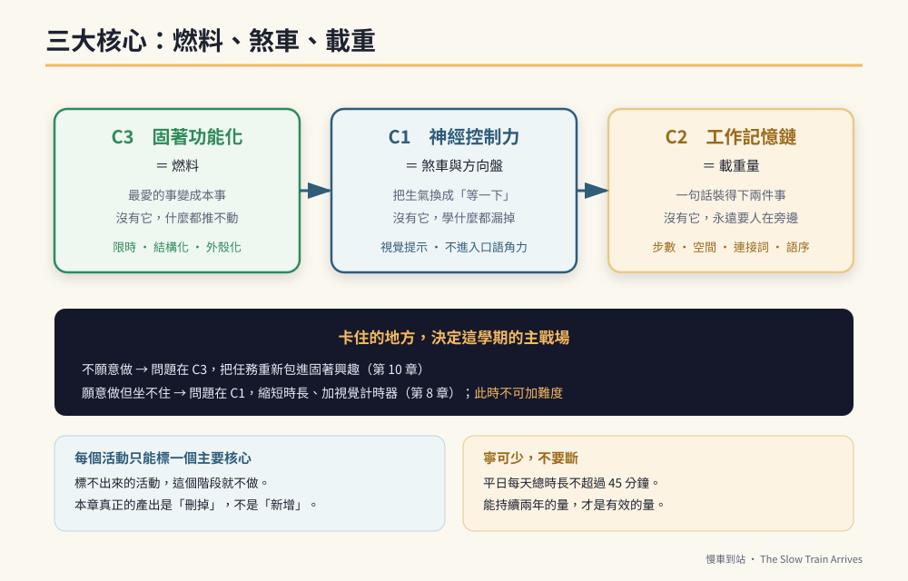

# 第二篇　三大核心：所有訓練共用的三條主軸

# 第7章　三核心總覽：每個活動都要能回答「這在練哪一條」



## 背景與痛點

打開任何一本特教手冊或療育網站，你會看到一份很長的活動清單：串珠、拼圖、剪紙、感統、桌遊、社交故事、視覺提示、代幣制、結構化教學……

每一項都有道理。問題是，**它們之間沒有主軸。**

沒有主軸會發生兩件事。

**第一，資源被平均分掉。** 你今天做串珠、明天做拼圖、後天做社交故事，每一項都做了一點，每一項都沒有做到能產生變化的強度。半年後回頭看，孩子還在原地，而你已經累壞了。

**第二，你無法判斷該停哪一項。** 因為每一項看起來都有用，你不敢停，於是清單只會越來越長。

這一章要給的就是那個主軸。它把所有訓練收斂成三條核心，並要求**每一個活動都必須能明確標註自己屬於哪一條**。標不出來的活動，不是不好，是**這個階段不做**。

---

## 核心設計：三條核心與它們的分工

| 核心 | 名稱 | 練的是 | 沒有它會怎樣 |
|------|------|--------|-------------|
| **C1** | **神經控制力**（抑制控制） | 「不要現在做」的能力：等待、停止、忍住 | 學什麼都學不進去，因為坐不住、被自己的念頭帶走 |
| **C2** | **工作記憶鏈** | 「同時記住並依序執行」的能力 | 只能做單一指令，永遠需要人在旁邊提醒 |
| **C3** | **固著功能化** | 把最強動機接到有用的事情上 | 有能力但沒有動機，訓練變成拉鋸戰 |

三者不是並列的。它們有明確的分工，用一台車來說明最清楚：

- **C1 是煞車與方向盤。** 沒有煞車，車速再快也只會撞牆。
- **C2 是載重量。** 決定這台車一趟能運幾件貨。
- **C3 是燃料。** 沒有油，前面兩者都是靜止的。

> 🔍 **為什麼是這三條，而不是「語言」「認知」「社交」**
> 因為後面那三個是**領域**，不是**機轉**。「加強語言」這句話沒有辦法轉成明天早上的動作，而「今天要練 C2，把指令從一步升到兩步」可以。
> 更重要的是：C1、C2、C3 是**跨領域的**。同一條核心的進步，會同時出現在語言、認知、社交與工作表現上。而分領域訓練的做法，會讓你在語言課練的東西，到了職場現場一項都用不上。

### 三者的先後順序

順序是有的，而且不能亂。

```text
C3（燃料）─→ 讓他願意坐下來
     │
     ▼
C1（煞車）─→ 讓他坐得住、停得下來
     │
     ▼
C2（載重）─→ 在坐得住的前提下，逐步加重
```

實務上的意思是：

- 如果孩子**不願意做**：問題在 C3。硬推無效，該做的是把任務重新包裝進他的固著興趣裡（第 10 章）。
- 如果孩子**願意做但坐不住、做到一半跑掉**：問題在 C1。此時提高任務難度只會更糟，應該先縮短單次時長、加上視覺計時器（第 8 章）。
- 如果孩子**坐得住但記不住第二步**：問題在 C2，而這是唯一應該「加難度」的情況（第 9 章）。

**大部分的訓練挫折，來自於在 C1 還沒穩的時候就去推 C2。**

### 三者各自的可測量指標

這本書的每一項訓練，最後都會回到這三個數字（就是第 1 章的基線）：

| 核心 | 指標 | 怎麼測 | 進步的樣子 |
|------|------|--------|-----------|
| C1 | `emotion_recovery_seconds` | 被打斷到配合下一件事的秒數 | 數字變小 |
| C1 | `wait_tolerance_seconds` | 能安靜等待的最長時間 | 數字變大 |
| C2 | `chain_length_max` | 穩定完成的指令步數 | 1 → 2 → 3 |
| C2 | `independent_task_rate` | 無額外提醒完成的比率 | 比率變大 |
| C3 | `fixation_talk_minutes` | 固著話題總時長 | **不追求變小**，追求「在時間框內」 |
| C3 | `fixation_structured_ratio` | 固著話題中「有組織敘述」的比率 | 比率變大 |

最後兩項需要特別說明。C3 的目標**不是**消滅固著話題，而是讓它：（一）發生在約定的時間框裡，（二）從無目的碎念變成有結構的敘述。一個每天講九十分鐘火車、但都發生在約定時段、而且講得有頭有尾的孩子，比一個被壓到只講十分鐘、卻整天焦慮的孩子，狀態好得多。

---

## 實作

### 一、活動標註卡：每個訓練都要填一張

在把任何一項活動排進行事曆之前，先填這張卡。填不出來的欄位，就是這個活動的問題所在。

```yaml
# activity-card.yaml — 每個訓練活動一張
name: 火車聯結任務檢核卡          # 活動名稱
core: C1                          # 主要核心：C1 / C2 / C3（只能填一個）
core_secondary: [C3]              # 次要核心（可空）

what_it_trains: |                 # 練哪一條神經（用白話寫，不要寫「提升能力」）
  看到視覺提示 → 自主啟動 → 不依賴口頭催促完成
  對應的是「外部提醒」轉「內部啟動」的那一步

how_to_check:                     # 怎麼檢核（必須是可觀察、可計數的）
  metric: independent_task_rate
  target: ">= 0.7"
  window: 連續兩週

dose:                             # 強度（頻率 × 單次時長）
  frequency: 每上學日 1 次
  duration_min: 10

stop_rule: |                      # 什麼情況停止或降階（★ 最常被漏掉的欄位）
  連續 3 天出現抗拒或情緒升高 → 降階：任務從 3 格減為 2 格
  連續 2 週達標 → 升階：加入第 4 格，或改為跨空間任務

owner: [家長, 特教老師]           # 誰執行（兩邊要一致）
```

**`stop_rule` 是這張卡最重要的一欄。** 沒有停損規則的訓練，會在孩子明明已經在抗拒的時候還繼續推——而那正是「訓練變成創傷」的標準路徑。

### 二、三核心快篩：你的孩子現在卡在哪一條

各題以最近兩週的實際狀況作答，勾「是」得 1 分。

```text
【C1　神經控制力】
  □ 被打斷固著話題時，能在 2 分鐘內配合下一件事
  □ 能在沒有 3C 的情況下安靜等待 5 分鐘以上
  □ 被拒絕時，抗議停留在口語層次（不摔、不打、不自傷）
  □ 有「先做完再玩」的概念，不需要每次重新談判
  □ 大人只用手勢就能制止，不必進入口語爭辯
  → C1 得分：___ / 5

【C2　工作記憶鏈】
  □ 能完成兩步驟指令（含「然後」）
  □ 能完成跨空間任務（去另一個房間拿東西再回來）
  □ 中途被打斷後，能自己回到原本的任務
  □ 能看著檢核表連續完成 3 項，不需額外提醒
  □ 能處理「在 A 之前先做 B」這種逆向語序
  → C2 得分：___ / 5

【C3　固著功能化】
  □ 固著話題發生在約定的時間框內
  □ 能在引導下把固著內容講成有頭有尾的敘述
  □ 願意做「包了固著外殼」的學習任務（如火車票價數學）
  □ 固著興趣曾成功用於安撫焦慮（如就醫、陌生環境）
  □ 曾用固著興趣與同儕產生正向互動（分享、交換）
  → C3 得分：___ / 5
```

**怎麼讀分數：**

| 狀況 | 這學期的主戰場 |
|------|--------------|
| C3 ≤ 2 | **先做 C3**（第 10 章）。動機沒接上，其他都推不動 |
| C3 ≥ 3 且 C1 ≤ 2 | **主攻 C1**（第 8 章）。C2 維持現狀不加難度 |
| C1 ≥ 3 且 C2 ≤ 2 | **主攻 C2**（第 9 章）。這是加難度的正確時機 |
| 三項皆 ≥ 3 | 進入第三篇的階段訓練，並開始累積職場模擬（第 16 章） |

### 三、一週配置範例

以「C1 為主戰場」的週配置為例。重點不是排得滿，是**每天都有、而且每次都短**。

| 時段 | 活動 | 核心 | 時長 |
|------|------|------|------|
| 每天早上出門前 | 自理視覺圖卡（自己看、自己執行） | C1 | 3 分 |
| 每上學日在校 | 小幫手任務檢核卡 | C1 + C2 | 10 分 |
| 每天放學後 | 固著時間（計時器 15 分，結構化引導） | C3 | 15 分 |
| 每天晚餐前 | 家事一項（有固定順序的） | C2 | 10 分 |
| 每週二、四 | 火車主題數學教材 2 組 | C2 + C3 | 15 分 |
| 每週六 | 社區實地（車站、超商）一次 | C1 + C2 + C3 | 60 分 |

一週總計約 3 小時，其中平日每天不到 40 分鐘。

> 💡 **為什麼刻意排得這麼少**
> 因為**能持續兩年的量，才是有效的量**。一份排滿六小時的完美課表，通常在第三週崩潰，接著全家進入「都不做了」的狀態——而那比一開始就少排要糟得多。
> 這本書所有的強度設計都遵守同一條原則：**寧可少，不要斷。**

---

## 現場踩雷

**踩雷一：一個活動標了三個核心。**
「這個遊戲三種都有練到！」——通常代表三種都練得很淺。標註卡限制只能填一個主要核心，就是為了逼出取捨。

**踩雷二：拿別的孩子的配置直接套。**
同齡、同診斷的兩個孩子，可能一個卡在 C1、一個卡在 C3，該做的事完全相反。快篩表存在的理由就是這個。

**踩雷三：把「他今天心情好」當成進步。**
單次表現受睡眠、天氣、身體狀況影響極大。**只看兩週的移動趨勢**，不看單日。

**踩雷四：三條核心同時推。**
每學期只有一個主戰場。其他兩條維持現有強度、不加難度——維持本身就是有價值的。

**踩雷五：忘了 C3 是燃料，不是獎勵。**
「你把作業寫完，就給你看火車影片」——這是把固著當成**外部酬賞**。它短期有效，但長期會讓孩子把學習與「不喜歡的事」綁在一起。
第 10 章會說明兩者的差別：**外殼式**（把火車變成教材本身）遠優於**酬賞式**（做完才給火車）。

---

## 效益與驗收（DoD）

| 項目 | 驗收標準 |
|------|---------|
| 快篩已完成 | 三條核心各有一個 0–5 的分數，且兩位照顧者分開作答後比對過 |
| 主戰場已確定 | 這學期只有**一個**主戰場，並寫下來 |
| 活動已標註 | 目前在做的每一項訓練，都有一張活動標註卡，含 `stop_rule` |
| 已做減法 | 至少**停掉或暫緩一項**標不出核心的活動 |
| 配置已落地 | 一週配置表貼在冰箱，平日每天總時長不超過 45 分鐘 |
| 指標已對接 | 三個核心指標與第 1 章的基線欄位對得上 |

第四項「已做減法」是本章的靈魂。這一章真正的產出不是新增訓練，而是**刪掉那些你一直不敢停的**。

> 💡 君之一席話
> 「家長最容易累死自己的，不是做得太少，是**做得太散**。三條核心的意義不在於教你多做什麼，而在於給你一個理直氣壯的理由，去停掉那些看起來很有用、但這個階段用不上的事。」
