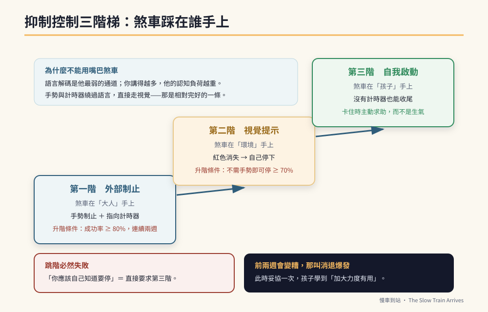

# 第8章　核心一　神經控制力：把生氣換成「等一下」



## 背景與痛點

晚餐前的十五分鐘，同一場戲每天上演。

「時間到了，去洗手。」
「自強號比較快。」
「我知道，先去洗手。」
「自強號比較快，區間車比較慢。」
「**不要再講火車了！**」
「……（音量提高）自強號比較快！」

十分鐘後，大人筋疲力盡，孩子情緒崩潰，晚餐冷了。而明天同一時間，同一場戲會重來一次。

這種消耗有一個明確的名字：**口語角力**。它的殺傷力不在於單次，而在於它每天都發生，一年三百六十五次，把家庭的耐心存量一點一點抽乾。

而它有一個很殘酷的性質：**每一次角力，都在訓練孩子的反面能力。**

如果一場拉鋸最後是大人妥協（「好啦好啦再講五分鐘」），孩子的大腦學到的是：只要我夠堅持，規則就會鬆動。如果最後是大人爆發（吼、罰、強制），孩子學到的是：規則是靠情緒強度決定的，誰大聲誰贏。

兩種結局都在把 C1 往反方向練。

---

## 核心設計

### 一、抑制控制不是「乖」，是一段可測量的延遲

先把概念定義清楚，因為定義錯了，訓練就會錯。

**神經控制力（抑制控制）＝ 從「想要做某件事」到「實際停下來配合」之間，那段延遲的長度。**

它不是「聽話」，也不是「脾氣好」。它是一個**時間量**，而時間量可以被測量、被訓練、被看到進步。

第 1 章記錄的 `emotion_recovery_seconds` 就是它。一個孩子從五分鐘進步到兩分鐘，不是「他今天心情比較好」，是抑制迴路真的被練厚了。

### 二、三階梯：從外部制止到自我啟動

抑制控制的訓練有嚴格的階梯順序，跳階必然失敗。

| 階 | 誰在踩煞車 | 現場長什麼樣 | 進到下一階的條件 |
|----|-----------|-------------|----------------|
| **第一階　外部制止** | 大人 | 大人用手勢制止，孩子在提示下停下 | 連續兩週，手勢制止的成功率 ≥ 80% |
| **第二階　視覺提示** | 環境 | 計時器紅色消失，孩子看到後自己停 | 連續兩週，不需要大人手勢即可停下 ≥ 70% |
| **第三階　自我啟動** | 孩子 | 沒有計時器也能自己收尾；卡住時主動求助 | 能在陌生環境中維持 |

多數家庭的錯誤，是想直接從「什麼都沒有」跳到第三階——「你應該自己知道要停」。孩子做不到，於是大人加重語氣，於是回到口語角力。

**正確的路徑是先把煞車放到外面（大人與環境），再一階一階交回孩子手上。**

### 三、為什麼不能用嘴巴煞車

這一點必須從神經學說起，因為它違反直覺。

當孩子正在固著思考時，他的大腦處於一種高度佔用的狀態。此時你對他說一長串話——「你看時間都到了，我們約定好的對不對，你這樣媽媽很累」——你以為你在說理，但在他的處理系統裡，這是**又一批需要解碼的語音輸入**。

而語言解碼正是他最弱的一環。

結果是：你的話不但沒有幫他踩煞車，反而**加重了他的認知負荷**，讓他更難從固著中抽離。他表現出來的是更執拗、音量更高——大人解讀成「他在頂嘴」，於是再加碼。

**視覺提示則走完全不同的通道。** 一個手勢、一個變白的計時器，繞過語言解碼，直接進入視覺處理——而視覺處理，通常是這類孩子相對完好的能力。

> 🔍 **一句話總結這個機轉**
> 你用他最弱的通道去要求他做最難的事，然後怪他做不到。
> 換一條通道，同一件事會突然變得可能。

### 四、消退爆發：前兩週一定會變糟

這是這一章最重要、也最常導致中途放棄的一段。

當你開始實施結構（計時器、代幣、手勢制止），前一到兩週，孩子的抗拒與生氣頻率**通常會上升，而不是下降**。

這在行為科學上叫**消退爆發**：原本有效的行為（一直講、一直吵）忽然不管用了，大腦的第一反應不是放棄，而是「加大力度再試一次」。

**這個階段的表現，恰恰證明介入生效了。** 而它也是決定成敗的分水嶺：

- 如果大人在這時妥協一次，孩子學到的是「加大力度有用」——固著行為會比介入前更嚴重，而且更難處理。
- 如果大人撐過去，通常在第二到第四週會看到明顯下降。

所以在開始之前，家裡兩位大人要先講好一句話：**「前兩週會變糟，那是正常的，我們不改規則。」**

---

## 實作

### 一、視覺計時器五步驟 SOP

```text
【步驟 1】事前預告（在情緒平穩時，不是在他已經開始講的時候）
  「等一下回家，我們有 15 分鐘火車時間，媽媽陪你聊。
   紅色不見、鬧鐘響，火車就進站休息，我們去洗手吃飯。」
  → 說完，兩人打勾勾。這個動作是儀式，儀式會被記住。

【步驟 2】啟動（把轉計時器的動作交給他）
  讓孩子自己把計時器轉到 15 分鐘。
  → 自己轉，比大人轉，接受度高很多。

【步驟 3】陪伴（這 15 分鐘要真的陪）
  大人放下手機，認真聽，並依第 10 章的方法引導成有結構的敘述。
  → 這一段是他這一天最重要的時光，不要一邊滑手機一邊敷衍。

【步驟 4】收尾提示（在剩 2 分鐘時給一次預告）
  「還有一點點紅色，等一下火車要進站囉。」
  → 只說一次。不要在最後 30 秒倒數，那會製造焦慮。

【步驟 5】結束（★ 一個字都不要說）
  鬧鐘響。大人站起來，右手五指併攏、掌心向前，做出「停」的手勢；
  另一手食指指向已經全白的計時器。
  維持動作，眼神中立，不說話。
  他若繼續講 → 重複同一個動作，不加碼、不解釋、不生氣。
  他若起身 → 立刻給予具體讚美：「你自己停下來了，很厲害。」
```

第五步的難度全在大人身上。**一句「不要再講了」，就會把整套 SOP 打回口語角力。**

### 二、預告法：把突然變成可預期

自閉特質的大腦最怕的不是規則，是**沒有預告的變化**。同一件事，有預告和沒預告，情緒反應可以差好幾倍。

```text
【三層預告結構】

事前一天：  「明天下午我們要去看醫生，看完醫生才去買便當。」
出發前：    「我們現在出門，先看醫生，然後買便當。」（同時給他看圖卡）
現場轉換前：「醫生看完了，接下來去買便當。」

★ 關鍵：預告的內容與實際發生的順序必須完全一致。
  一次「說好了卻沒做到」，會讓往後十次預告失效。
```

### 三、定格站姿：給他一個「卡住時」的動作

這是本書最實用的一招之一，而且它同時服務 C1 與未來的職場。

孩子在卡住、被打斷、不會做的時候，需要一個**替代動作**——因為沒有替代動作時，大腦預設的輸出就是生氣。

```text
【定格站姿三步驟】（在家練到自動化，之後帶到學校與職場）

1. 雙手在肚臍前方交疊放好
2. 原地深吸一口氣
3. 看著對方，唸出制式台詞：

   卡住時 →「請老師（媽媽）教我，謝謝。」
   太累時 →「我太累了，我想休息一下。」
   做完時 →「報告老師，我做好了，請檢查。」

★ 這三句話要練到不用想。練法：每天在小幫手任務中製造 1 次
  「故意讓他卡住」的情境，讓他用台詞解決，成功就大力稱讚。
```

為什麼這一招重要？因為在未來的職業評估與職場現場，**「卡住時的反應」比「做得多快」更決定去留**。一個會說「請教我」的人，主管可以帶；一個卡住就僵住、跺腳的人，主管會判定為情緒風險。

第 27 章會完整說明這個評分邏輯。

### 四、抗干擾訓練（進階，C1 分數 ≥ 3 再做）

小作所與庇護工場的現場是吵的：機器聲、人聲、廣播、旁邊的人走來走去。在安靜書桌前練出來的專注力，到那裡會全部歸零。

```text
【抗干擾練習：每週 2 次，每次 15–20 分鐘】

1. 讓孩子進行一項重複性作業（折衣服、分裝文具、剪紙條）
2. 用視覺計時器設定 15 分鐘
3. 在第 8–10 分鐘時，大人「故意」製造干擾：
     - 在旁邊播放火車聲或他喜歡的音樂
     - 走過去把他的一件工具拿走
     - 忽然說「這個先別做，改做另一個」
4. 目標：他不轉頭、手不停，持續 2–3 分鐘
   或者：他啟動定格站姿，用台詞回應，而不是生氣

5. 成功 → 立刻具體稱讚（「有火車聲音你也沒有停下來，很棒」）
   失敗 → 不責備，降低干擾強度，下次再來
```

> ⚠️ **這一項有明確的禁止事項**
> 干擾訓練的目的是建立耐受，不是製造挫折。**不可以**在孩子已經疲累、生病、或當天情緒不佳時做；**不可以**連續干擾（一次練習只做一次干擾）；**不可以**在他成功耐受後還繼續加碼——那會把「忍耐」與「被欺負」連結起來，得不償失。

### 五、記錄與升級

```yaml
# c1-progress.yaml — 每週回顧一次
week: 2026-W12
core: C1

emotion_recovery_seconds:
  median: 145               # 上週 190 → 本週 145
  samples: 9

gesture_stop_success_rate: 0.78   # 手勢制止成功率（第一階指標）
self_stop_rate: 0.33              # 不需手勢即自行停下（第二階指標）
scripted_help_requests: 4         # 本週主動使用制式台詞求助的次數

ladder_stage: 1                   # 目前在第一階
promotion_check: |
  第一階指標連續兩週 >= 0.8 才升第二階
  本週 0.78，未達標，維持第一階，不加難度

notes: |
  週三、週四明顯較差，兩天都晚睡（超過 23:30）。
  → 睡眠是 C1 的地基，見第 11 章。
```

---

## 現場踩雷

**踩雷一：第一週看到變糟就放棄。**
這是消退爆發。放棄的代價不是回到原點，是比原點更差——因為孩子剛學會「加大力度有用」。

**踩雷二：兩個大人不一致。**
爸爸堅持規則，媽媽心軟通融（或反過來）。結果是孩子學會**選人下手**，而且家庭內部產生裂痕。
**解法：** 規則寫在紙上，貼冰箱。任何一方要改規則，必須是在孩子不在場時討論後一起改。

**踩雷三：用制止手勢當處罰。**
手勢是**中性的訊號**，不是憤怒的表達。如果大人做手勢時是咬牙切齒的，孩子接收到的是情緒，不是規則——而情緒會引發情緒。
**練法：** 大人自己先對著鏡子練到能面無表情地做出這個手勢。

**踩雷四：在孩子已經爆發後才開始講規則。**
情緒爆發時，前額葉基本上是離線的。此時說什麼都進不去。
**正確順序：** 先降溫（安靜、減少刺激、不對話），完全平靜後再回到規則——而且是簡短的一句，不是檢討大會。

**踩雷五：把 C1 的退步歸因於態度。**
睡眠不足、生病、天氣、環境改變、藥物調整，都會讓 C1 明顯退步。**先查生理，再談行為**——這是第 11 章存在的理由。

**踩雷六：進步了就撤掉工具。**
「他現在都可以自己停了，計時器可以收起來了吧？」——通常兩週後就打回原形。
**正確做法：** 工具的撤除要**漸進**（從每天用 → 只在轉換時段用 → 只在陌生環境用），而且退步時要能立刻放回去，不視為失敗。

---

## 效益與驗收（DoD）

| 項目 | 驗收標準 |
|------|---------|
| 計時器上線 | 五步驟 SOP 連續實施滿 4 週，且第 5 步「一個字都不說」做到 ≥ 80% |
| 情緒回復時間 | 中位數較基線**下降 30% 以上**，或穩定進入 2 分鐘內 |
| 手勢制止 | 成功率連續兩週 ≥ 80%（第一階達成） |
| 制式台詞 | 三句台詞中至少 1 句能在**沒有提示**的情況下自發使用，每週 ≥ 3 次 |
| 大人一致 | 規則成文貼出；最近兩週內沒有發生任何一次「當場妥協」 |
| 消退爆發已渡過 | 曾出現第 1–2 週惡化並撐過，之後有下降趨勢（若沒出現，也要記錄下來） |

> 💡 君之一席話
> 「你以為你在跟他講道理，其實你在用他最弱的那條線路，要求他做最難的事。**把嘴巴閉上，把手指向計時器**——那不是冷漠，那是你能給他最溫柔的一種幫忙。」
