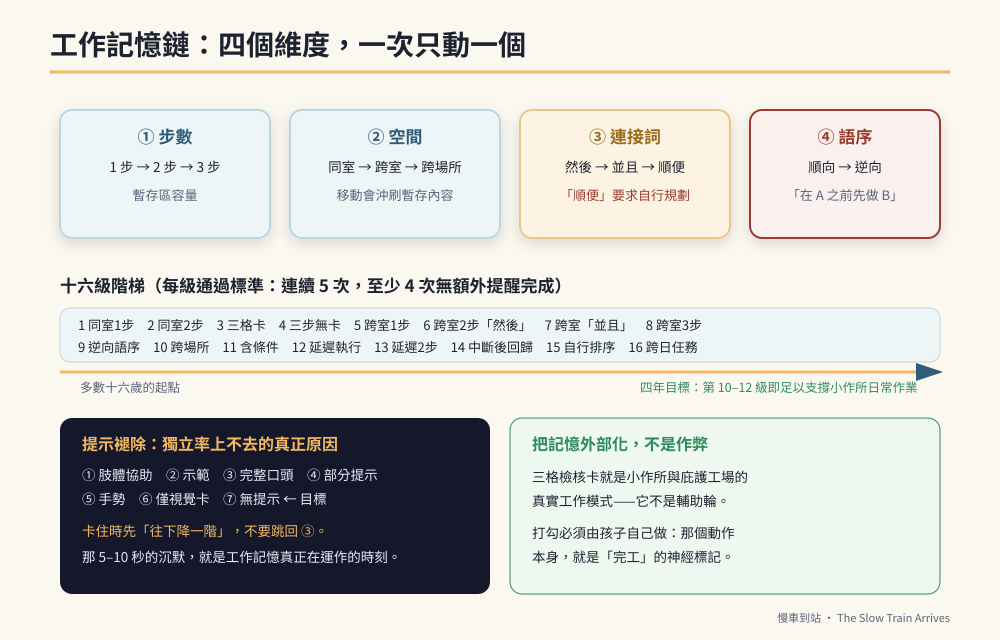

# 第9章　核心二　工作記憶鏈：一句話裡裝得下兩件事



## 背景與痛點

「幫媽媽把碗拿到廚房。」——他做得到。

「幫媽媽把碗拿到廚房，**然後順便**把客廳的衛生紙拿過來。」——他把碗放進廚房，然後站在那裡，或者直接回房間了。

大人接下來會做的事，幾乎是本能：走過去，說「衛生紙呢？我剛剛不是說要拿衛生紙？」

這句話裡有兩個問題。

**第一，他不是忘了，是根本沒有裝進去。** 工作記憶像是大腦裡的一塊暫存區，容量有限。當「碗」「廚房」「拿過去」佔滿之後，「衛生紙」這一項在他開始移動的那一刻就掉出去了。這不是態度問題，是容量問題。

**第二，那句提醒讓這次訓練歸零。** 因為他最後確實拿到了衛生紙——在大人提醒之下。而大腦記住的是：不用記，反正媽媽會再說一次。

工作記憶鏈是這本書裡**最直接對應未來職場能力**的一條核心。小作所的組長不會只交辦一件事，庇護工場的流程不會只有一個步驟。**能不能記住兩件事並依序完成，是「需要有人全程盯著」與「可以放手交辦」之間的那條線。**

---

## 核心設計

### 一、四個難度維度（不要一次動兩個）

工作記憶鏈的難度不是只有「幾步」。它有四個獨立的維度，而訓練的鐵律是：**一次只提高一個維度。**

| 維度 | 從 | 到 | 為什麼難 |
|------|-----|-----|---------|
| **① 步數** | 1 步 | 2 步 → 3 步 | 暫存區容量 |
| **② 空間** | 同一個房間 | 跨房間 → 跨樓層 → 跨場所 | 移動本身會沖刷暫存內容 |
| **③ 連接詞** | 無 | 「然後」→「並且」→「順便」 | 每個連接詞的語意負荷不同 |
| **④ 語序** | 順向（先說先做的） | **逆向**（「在 A 之前先做 B」） | 需要先解碼、再重排順序 |

同時提高兩個維度（例如「跨樓層」＋「三步」），失敗率會急遽上升，而失敗的經驗會讓孩子開始迴避交辦任務——那是最不划算的一種倒退。

> 🔍 **為什麼「順便」是最難的那個詞**
> 「然後」是明確的時間序：做完 A，做 B。
> 「並且」是並列：A 和 B 都要做。
> 而「**順便**」預設了一個孩子多半沒有的能力：**在移動路徑上自行判斷何時插入第二個任務**。它不只要求記住，還要求規劃。
> 所以「順便」不是第三個同義詞，它是一個**明顯更高的階級**。很多家長無意間第一次就用了它，然後得到一個看起來「不聽話」的孩子。

### 二、十六級升級階梯

把四個維度組合成一條可以照著走的路。每一級的通過標準都是：**連續五次交辦，至少四次無額外提醒完成。**

| 級 | 內容 | 範例 |
|----|------|------|
| 1 | 同室・1 步 | 「把碗放到水槽。」 |
| 2 | 同室・2 步・「然後」 | 「把碗放到水槽，然後把抹布掛好。」 |
| 3 | 同室・3 步・視覺卡輔助 | 三格檢核卡：擦桌子 ▢ 收碗 ▢ 關燈 ▢ |
| 4 | 同室・3 步・無卡 | 同上，但不給卡 |
| 5 | 跨室・1 步 | 「去客廳拿衛生紙過來。」 |
| 6 | 跨室・2 步・「然後」 | 「把碗拿到廚房，然後去客廳拿衛生紙。」 |
| 7 | 跨室・2 步・「並且」 | 「把聯絡簿交給老師，並且把抹布帶回來。」 |
| 8 | 跨室・3 步 | 三個地點、三件事 |
| 9 | 跨室・2 步・**逆向語序** | 「**在拿抹布之前**，先把本子交給老師。」 |
| 10 | 跨場所・2 步 | 「去超商買牛奶，然後把發票拿回來給我。」 |
| 11 | 跨場所・2 步・含條件 | 「如果沒有鮮奶，就買豆漿。」 |
| 12 | 延遲執行・1 步 | 「等一下吃完飯，去把垃圾拿出去。」（間隔 15 分鐘） |
| 13 | 延遲執行・2 步 | 同上，兩件事 |
| 14 | 中斷後回歸 | 執行到一半被打斷，能自己回到原任務 |
| 15 | 自行規劃順序 | 「這三件事今天做完，順序你自己決定。」 |
| 16 | 跨日任務 | 「明天早上出門前，記得帶回條給老師。」 |

多數十六歲的孩子起點在第 1–3 級之間。**四年走到第 10–12 級，就足以支撐小作所的日常作業。**

### 三、提示褪除：獨立率上不去的真正原因

「他做得到啊，只是我要在旁邊提醒。」——這句話裡藏著整條核心最大的陷阱。

行為訓練上，「提示」是有層級的。訓練的目標不是「讓他完成」，而是**逐層拿掉提示**：

```text
提示強度   由強到弱
  ①  肢體協助（手把手帶著做）
  ②  示範（大人先做一次給他看）
  ③  口頭完整指令（「把碗拿到廚房，然後拿衛生紙」）
  ④  口頭部分提示（「碗放好了，接下來呢？」）
  ⑤  手勢提示（指一下客廳的方向）
  ⑥  視覺提示（檢核卡、圖卡）
  ⑦  無提示（自主啟動）   ← 目標
```

大人最常犯的錯，是**在孩子卡住的三秒內就跳回 ③**。而正確的做法是**先往下降一階**：

```text
他卡住了（站在廚房不動）
  ↓ 等 5–10 秒（★ 這幾秒最難忍，但它是訓練的核心）
  ↓ 仍不動 → 給 ⑤ 手勢提示（指客廳）
  ↓ 仍不動 → 給 ④ 部分提示（「還有一個東西喔」）
  ↓ 仍不動 → 給 ③ 完整指令，並記下：本次為完整提示
```

**那五到十秒的沉默，是工作記憶真正被使用的時刻。** 大人一開口，那段運算就被取消了。

---

## 實作

### 一、交辦腳本（每天兩次，一次不超過三分鐘）

```text
【步驟 1】取得注意力（★ 不要對著背影說話）
  走到他面前，等他眼神看向你。必要時輕聲叫名字，等 2 秒。

【步驟 2】下達指令（短、慢、名詞清楚）
  「碗拿到廚房，然後拿衛生紙。」
  ✗ 不要說：「你可以順便幫媽媽把那個衛生紙拿一下嗎，
             就是客廳那個，然後碗也要記得拿去廚房喔。」
  → 一句指令 ≤ 12 個字，名詞放在句尾（最後聽到的最容易留住）。

【步驟 3】覆誦（★ 這一步讓成功率大幅提高）
  「你說一次。」
  他：「碗、廚房、衛生紙。」
  → 不必說出完整句子，能覆誦關鍵名詞就算通過。
  → 覆誦的動作把「聽覺輸入」轉成「自己的語音輸出」，
    這在記憶上是完全不同的一件事。

【步驟 4】放手（大人轉身去做自己的事）
  不要站在旁邊看。被盯著會讓他改成看你的臉色，而不是用自己的記憶。

【步驟 5】結果處理
  完成 → 具體稱讚：「兩件事都做到了，很厲害。」（不要只說「好棒」）
  卡住 → 走褪除階梯（見上），並記錄本次用到的提示層級
```

### 二、視覺檢核卡：把暫存區搬到卡片上

工作記憶容量不足時，最有效的補償不是「多練記憶」，是**把記憶外部化**。這也是所有小作所與庇護工場的標準作業方式——**這一招不是輔助輪，它就是職場現場的真實工作模式。**

```text
【火車聯結任務卡】（A4 護貝，魔鬼氈可換圖卡）

  ┌──────────┬──────────┬──────────┐
  │ 車廂 1    │ 車廂 2    │ 車廂 3    │
  │ [圖] 擦黑板│ [圖] 排桌椅│ [圖] 倒垃圾│
  │    ▢      │    ▢      │    ▢      │
  └──────────┴──────────┴──────────┘
        ↑ 完成一項，自己用彩色筆打一個勾

【三個設計要點】
  1. 圖卡用「實物照片」，不要用線條插圖或純文字
     → 視覺辨識速度差很多
  2. 打勾必須由孩子自己做，大人不能代打
     → 打勾這個動作本身，就是「完工」的神經標記
  3. 全部打完才交還卡片，換取下一件事（下課／點心／火車時間）
     → 卡片是憑證，不是提醒
```

### 三、逆向語序訓練（第 9 級，難度陡增）

```text
【三階段練法】

階段 A（配圖卡）：
  桌上放兩張圖卡，依實際執行順序由左至右排好。
  「在拿抹布之前，先把本子交給老師。」
  → 請他把圖卡「按照要做的順序」排一次，再去執行。

階段 B（口語 + 覆誦）：
  同一句話，不給圖卡，但要求覆誦：「先做什麼？再做什麼？」

階段 C（純口語）：
  直接執行。

★ 逆向語序卡住是正常的，不代表退步。
  它刺激的是語意重排能力，是這條核心裡最高階的一項。
```

### 四、記錄

```yaml
# c2-progress.yaml
week: 2026-W12
core: C2

chain_length_max: 2          # 目前穩定的步數
current_level: 6             # 十六級階梯的第幾級
level_pass_rate: 0.6         # 本級連續 5 次中成功 3 次 → 未達標（需 4/5）

prompt_level_used:           # 本週各層級提示使用次數（越往 ⑦ 越好）
  full_verbal: 4             # ③ 完整口頭
  partial_verbal: 3          # ④ 部分提示
  gesture: 5                 # ⑤ 手勢
  visual_only: 6             # ⑥ 僅視覺卡
  none: 2                    # ⑦ 無提示

independent_task_rate: 0.44  # 上週 0.35

notes: |
  「順便」這個詞出現時失敗率明顯較高 → 本週起全面改用「然後」。
  跨室任務在放學後（較疲累）成功率低 → 移到早上做。
```

最後那兩行是這份記錄真正的價值：**它把「他做不到」變成「在什麼條件下做不到」**，而後者是可以調整的。

---

## 現場踩雷

**踩雷一：用提醒把任務救回來。**
救回來的是那一次的家事，賠掉的是那一次的訓練。**如果今天的目的是讓事情完成，就直接自己做**（那完全沒問題）；如果今天的目的是訓練，就要忍住不提醒。**先決定今天是哪一種，不要兩者都想要。**

**踩雷二：一次提高兩個維度。**
「跨樓層＋三步」是經典的失敗組合。四個維度，一次動一個。

**踩雷三：把「忘記」解讀成「不聽話」。**
在這條核心上，這是最傷人的一種誤解。孩子沒有拒絕你，他只是暫存區滿了。**用「幾步」來描述問題，而不是用「態度」。**

**踩雷四：任務內容沒有意義。**
「把這疊紙從左邊搬到右邊，再搬回來」——這種為練而練的任務，孩子很快就會抗拒，因為大腦知道它沒有結果。
**所有工作記憶訓練都應該內建在真實家務或小幫手任務裡**，讓完成有真實的後果（桌子真的乾淨了、老師真的收到了）。

**踩雷五：只在家裡練。**
在家練到第 8 級，到了學校還是第 2 級——因為情境沒有類化。**同一級的任務要在至少兩個場域（家、學校）各練過**，才算真的通過。這需要與老師同步，第 34 章提供溝通備忘錄的範本。

**踩雷六：站在旁邊看。**
被注視時，孩子會改用「讀大人表情」來完成任務，而不是用記憶。訓練必須有一段「大人不在視線內」的時間。

---

## 效益與驗收（DoD）

| 項目 | 驗收標準 |
|------|---------|
| 階梯定位 | 明確知道目前在十六級的第幾級，並有連續 5 次的通過紀錄 |
| 覆誦已內化 | 交辦時孩子能主動覆誦關鍵名詞，或在一次提示下覆誦，達 ≥ 70% |
| 提示已褪除 | 「無提示 + 僅視覺卡」的比率較四週前提高，且「完整口頭」比率下降 |
| 獨立完成率 | `independent_task_rate` 較基線提高 ≥ 0.15 |
| 檢核卡上線 | 三格任務卡實際使用滿四週，打勾由孩子自己完成 |
| 跨場域 | 至少一級的任務同時在家庭與學校達標 |
| 記錄可讀 | 週記錄中含「在什麼條件下失敗」的觀察，而非只有成功／失敗 |

> 💡 君之一席話
> 「他站在廚房不動的那五秒鐘，是你最想開口的五秒鐘，也是他大腦唯一在鍛鍊的五秒鐘。**你每提醒一次，就替他做完一次；替他做完一百次，他就永遠停在一步。**」
