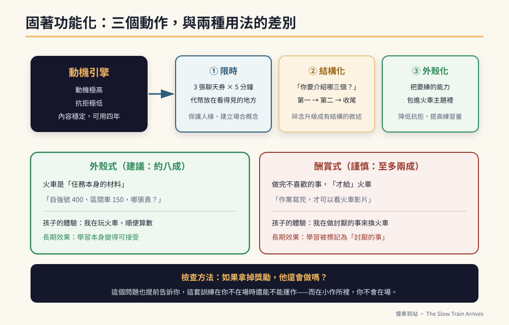

# 第10章　核心三　固著功能化：火車不是症狀，是動機引擎



## 背景與痛點

有兩種家長。

**第一種**帶著孩子去親戚聚會，孩子開始講火車。第三次的時候，親戚的表情變了。第五次的時候，家長打斷他：「好了好了，不要再說了。」孩子沉默，或者生氣。回家的路上，家長很累，而且有一種說不出口的難堪。

**第二種**在同一個場合，對親戚說：「他很懂火車喔，你問他自強號和區間車差在哪裡。」孩子講了三分鐘，親戚說「哇你好厲害」，孩子笑了。

同一個孩子，同一個固著，兩種完全不同的社會結果。

差別不在於固著的強度，而在於**它有沒有被裝進一個有用的形狀裡**。

而這件事有急迫性。固著在小學階段，同學多半會包容；到了高職和成年，包容度會急速下降。一個一直重複同一個話題的成年人，很快會被邊緣化——**他最大的資產（人緣）會被他最強的特質（固著）吃掉。**

這一章要做的，就是在那件事發生之前，把固著改裝成三樣東西：**邊界、結構、外殼。**

---

## 核心設計

### 一、為什麼固著是引擎，而不是垃圾

從訓練的角度看，固著興趣有三個極稀有的性質：

| 性質 | 意義 |
|------|------|
| **動機極高** | 不需要外部酬賞，他自己就會投入 |
| **抗拒極低** | 包上這層殼，同樣的任務他願意坐下來做 |
| **內容穩定** | 不像一般孩子的興趣兩週就換一個，它可以用四年 |

在一個「什麼都推不動」的訓練現場，這三個性質加起來，是唯一還在運轉的引擎。

而更關鍵的是：**你沒有辦法創造它。** 你可以設計課程、可以買教材、可以請治療師，但你無法讓一個孩子突然對某件事產生這種強度的興趣。它是天生的，它已經在那裡了。

把它壓掉，是這條路上最貴的一個決定。

### 二、三個動作：限時、結構化、外殼化

處理固著不是「壓抑 vs 放任」的二選一。它是三個獨立的動作，可以同時進行。

| 動作 | 做什麼 | 解決什麼 | 對應章節 |
|------|--------|---------|---------|
| **① 限時** | 給固著明確的時間框與代幣 | 保護人緣、建立場合概念 | 本章 + 第 8 章 |
| **② 結構化** | 把碎念升級成有頭有尾的敘述 | 實質提升口語組織能力 | 本章 |
| **③ 外殼化** | 把要練的能力包進火車主題裡 | 降低抗拒、提高練習量 | 本章 + 第四篇 |

三者的順序建議是 ① → ③ → ②：先有邊界（否則什麼都談不了），再用外殼把訓練量做起來，最後才慢慢提高敘述的結構要求。

### 三、外殼式 vs 酬賞式：一個必須講清楚的區別

這是本章最重要的一段，因為兩者看起來很像，效果卻相反。

| | **外殼式**（建議） | **酬賞式**（謹慎使用） |
|---|---|---|
| 做法 | 把火車變成**任務本身的材料** | 做完不喜歡的事，**才給**火車 |
| 例子 | 「自強號 400、區間車 150，哪個貴？」 | 「作業寫完，才可以看火車影片」 |
| 孩子的體驗 | 我在玩火車，順便算數 | 我在做討厭的事，為了換火車 |
| 長期效果 | 學習本身變得可接受 | 學習被標記為「討厭的事」 |
| 對固著的影響 | 固著被擴充、被賦予功能 | 固著被強化成唯一的價值來源 |

**外殼式不是不能用酬賞，而是酬賞不該是主要機制。** 一個健康的配置大約是：八成的訓練用外殼式包裝，兩成可以用固著時間當作完成後的正常獎勵（因為現實生活本來就有「做完事才休息」的結構）。

> 🔍 **一個檢查方法**
> 問自己一句：**「如果拿掉獎勵，他還會做嗎？」**
> 外殼式的答案通常是「會，因為那本來就是火車」；酬賞式的答案通常是「不會」。
> 這個問題也能提前告訴你，這套訓練在你不在場的時候還能不能運作——而在小作所裡，你不會在場。

---

## 實作

### 一、對話代幣制：把邊界變成看得見的東西

```text
【家庭版】
  每天發 3 張「火車聊天券」（護貝小卡，可以印火車圖案）。
  規則：
    · 一張券 = 5 分鐘，且必須「交出券」才開始
    · 券用完了，今天的火車時間就結束（★ 不通融、不預支）
    · 未使用的券不累積到明天（避免囤積造成的談判）
    · 大人在券的時間內必須「真的陪」——放下手機、認真聽

【學校版】（請老師協助，第 34 章有給老師的備忘錄範本）
  每天 3 張券，且限定在下課時間、對方同意時使用。
  非約定時間他提起 → 老師溫和堅定地說：
    「現在不是火車時間，請把券收好。」
  → 這句話要固定、每次一樣。不同的說法會被大腦當成不同的規則。

【代幣的位置很重要】
  券要放在他看得到的地方（磁鐵吸在白板上、或掛在書包側邊）。
  非使用時段他想講時，大人一個字都不用說，只要用手指向那些券。
  → 看到實體代幣，比聽到一句拒絕，接受度高很多。
```

> ⚠️ **代幣制的三個禁止**
> **不可以**把券當處罰工具沒收（「你不乖，扣一張券」）——那會把它從結構變成懲罰，孩子會開始防衛。
> **不可以**在他情緒好的時候多給——規則的價值來自不變。
> **不可以**在他快要爆發時提前給——那是在教「情緒可以換券」。

### 二、結構化：把碎念升級成敘述

限時之後，那十五分鐘要拿來做什麼？不是被動聽完，而是**引導他把內容組織起來**。

```text
【引導四問】（每次火車時間用其中 1–2 個，不要全部用）

① 數量框架：「你今天要介紹幾個？我們講三個好不好？」
   → 給大腦一個容器。有容器，內容才會被排序。

② 序數提示：「第一個是什麼？」「那第二個呢？」
   → 序數是敘述結構最便宜的鷹架。

③ 比較框架：「自強號和區間車，哪裡不一樣？」
   → 比較會逼出屬性描述（快／慢、貴／便宜、停幾站）。

④ 收尾提示：「所以你最喜歡的是哪一個？為什麼？」
   → 訓練「結論」這個概念，這是敘述能力的高階項目。

【評分：什麼叫「有結構」】
  0 分：單句重複（「自強號比較快」× N 次）
  1 分：能列出 2 個以上不同的內容
  2 分：內容有順序（第一、第二）
  3 分：有開頭、有內容、有結尾（「我講完了」）

  → 記錄每次的分數，計算 fixation_structured_ratio
    （得 2 分以上的次數 ÷ 總次數）
```

**這一段的價值容易被低估。** 對一個口語表達受限的孩子來說，「把一件事講成三點」是很高階的語言能力——而他願意在火車主題上做這件事，卻不願意在任何其他主題上做。**這是唯一的入口。**

### 三、外殼化四步驟：把任何能力包進火車

```text
【步驟 1】先寫出你真正要練的能力（不要寫「數學」，要寫具體動作）
  例：「能從兩個數字中指出比較大的那一個」

【步驟 2】在固著主題裡找一個「天然含有」這個能力的場景
  例：票價、車速、車廂數、身高限制、時刻、月台號碼

【步驟 3】用真實素材，不要用自製的假素材
  例：真的去印一張台鐵票價表，不要自己畫兩個框寫數字
  → 真實素材有兩個好處：動機更高，而且能力可以直接類化到現場

【步驟 4】設計一句「他能聽懂的互動台詞」，且台詞裡要有角色
  例：「維修長！今天我們要出車。150 和 400，哪一張票比較貴？」
  → 角色稱號（維修長、站長、小幫手）會大幅提高配合度，
    因為它把「被要求」轉換成「扮演」。
```

第四篇整篇就是這四個步驟的十組完整示範。

### 四、社會化：從自我封閉到社交資產

固著功能化的最後一哩路，是讓它變成**與人連結的媒介**，而不是隔開人的牆。

```text
【三個可以立刻做的做法】

① 「一張照片」規則
   每週准許他帶一張自己選的火車照片到學校，
   在下課時給同學看，並練習一句固定台詞：
     「這是我最喜歡的自強號，給你看。」
   → 重點是「給你看」而不是「聽我講」——前者是雙向的。

② 「你呢？」的輪流練習
   在家庭火車時間裡，大人也講一件自己的事（30 秒就好），
   然後教他問一句：「你呢？」
   → 輪流是社交對話的最小單位，而它可以在最舒服的主題上練。

③ 專家角色
   在親戚、鄰居面前，主動把他介紹成「這方面他很懂」，
   並給對方一個具體問題（「你問他自強號跟區間車差在哪」）。
   → 這一招同時修復了大人的社交尷尬與孩子的自我價值。
```

### 五、意外的用途：固著是最好的鎮定工具

在陌生、焦慮、疼痛的場合——抽血、看牙醫、換新環境、實習第一天——固著興趣是**現成的、免費的、隨身攜帶的**安撫工具。

```text
【就醫版腳本】
  候診時：「等一下醫生看完，我們去看火車。」（明確的獎勵在等待之後）
  進診間：讓他手上握著火車玩具或火車卡片
  抽血時：「你數，這班車有幾節車廂？」（把注意力導向可預測的內容）
  結束後：立刻兌現承諾（★ 一次不兌現，往後全部失效）
```

第 4 章的急診卡上有一欄「溝通提示」，寫的就是這件事。**當你把它寫給急診醫護時，你不只是在幫孩子，你也在幫那位素昧平生、需要在三十秒內安撫一個陌生青少年的人。**

---

## 現場踩雷

**踩雷一：把固著壓到地下。**
高壓禁止的結果通常不是消失，是轉入私下——孩子躲起來自己講。表面上安靜了，實際上你**失去了觀測與引導的管道**，而固著本身一點也沒少。

**踩雷二：無限奉陪。**
另一個極端。因為心疼、因為內疚，於是不設任何邊界。結果是人緣被消耗、場合概念沒有建立，而且到了機構裡沒有人有義務陪他講九十分鐘。

**踩雷三：外殼用到爛。**
所有東西都是火車，連續三個月，孩子開始厭倦——固著興趣也會疲乏。
**解法：** 保留一到兩成的「素面任務」（沒有包裝的一般任務），並在固著主題內部做變化（火車→鐵道→車站→時刻表→售票→月台廣播）。

**踩雷四：拿走他的固著當處罰。**
「你不聽話，這禮拜不准講火車。」——這會把引擎當成人質。短期可能有效，長期會讓他把固著藏起來，並且讓大人變成威脅來源。

**踩雷五：只有媽媽會用這一套。**
爸爸覺得「幹嘛陪他講那些有的沒的」，老師覺得「這樣會不會太寵」。結果孩子在不同人面前有不同規則，而規則不一致正是焦慮的來源。
**解法：** 第 34 章的備忘錄範本，就是為了解決這一件事。

---

## 效益與驗收（DoD）

| 項目 | 驗收標準 |
|------|---------|
| 邊界已建立 | 代幣制實施滿 4 週；非約定時段的固著發話，能以「指向代幣」處理 ≥ 70% |
| 時間框穩定 | 固著話題有 ≥ 80% 發生在約定時段內（總時長不設上限） |
| 結構化 | `fixation_structured_ratio` ≥ 0.5（一半以上的火車時間能講到 2 分以上） |
| 外殼化已上線 | 至少 3 項訓練任務已改成火車主題外殼，並實際使用 |
| 社交化 | 「一張照片」或「你呢？」至少一項實施滿 4 週，且有 ≥ 3 次正向同儕回應 |
| 鎮定工具 | 至少一次在陌生或醫療場合成功使用固著興趣安撫 |
| 沒有被當人質 | 最近 4 週內，沒有把「不准講火車」當成處罰使用過 |

> 💡 君之一席話
> 「別人看到的是一個一直在講火車的孩子；你要看到的是**一台已經發動、而且只認得一種燃料的引擎**。你的工作不是熄火，是接上傳動軸。」
