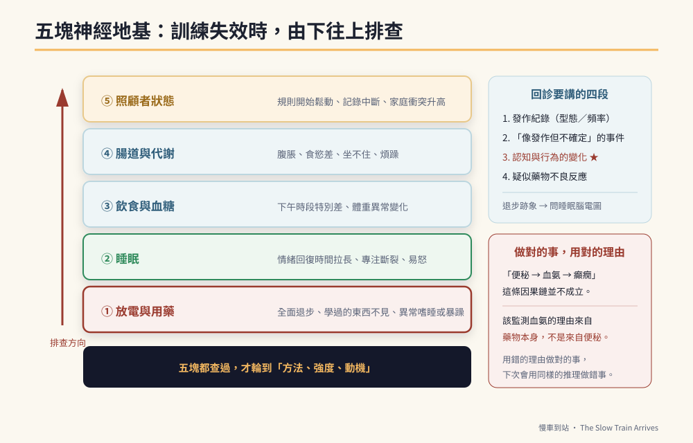

# 第11章　神經地基：放電、睡眠、飲食、腸道與照顧者



## 背景與痛點

一位母親在第六週寫下這句話：

> 「這禮拜整個垮掉。計時器不管用了，任務卡也不理，一整週都在生氣。我是不是做錯了？」

翻開她的紀錄，答案在最後一欄的備註裡：那一週孩子連續五天都在十一點半以後才睡。

**這一章要建立的是一個習慣：訓練出問題時，先查地基，再檢討方法。**

因為在神經發育障礙的孩子身上，行為表現對生理狀態的敏感度，遠高於一般人。同一個孩子，睡飽和沒睡飽，可以像兩個人。而大人如果先檢討方法，會做兩件錯事：把有效的方法改掉，以及把生理問題誤讀成態度問題。

> ⚠️ **醫療免責**
> 本章涉及用藥追蹤、劑量、飲食調整與檢查安排，**全部屬於醫療決策，一律由主治醫師決定**。本章的用途只有一個：讓你知道回診時該主動說什麼、該問什麼。
> **絕對不要**依據本章自行停藥、調藥、改變飲食療法或增減營養補充品。抗癲癇藥物突然停用可能誘發癲癇重積狀態，那是會致命的。

---

## 核心設計：五塊地基與排查順序

```text
訓練失效時的排查順序（由下往上）

  ⑤ 照顧者狀態    ← 最常被忽略，卻決定一切能否持續
  ④ 腸道與代謝
  ③ 飲食與血糖
  ② 睡眠
  ① 放電與用藥    ← 最優先排除
  ─────────────────────
  然後才是：方法、強度、動機
```

順序的理由：越下層，越可能造成**全面性**的表現下滑；而越下層的問題，也越不可能靠調整教學方法解決。

| 地基 | 沒顧好的表現 | 誰負責 |
|------|-------------|--------|
| ① 放電與用藥 | 全面退步、學過的東西不見、白天嗜睡或異常暴躁 | 醫師（家長負責觀察與回報） |
| ② 睡眠 | 情緒回復時間拉長、專注力斷裂、易怒 | 家庭 |
| ③ 飲食與血糖 | 下午時段表現特別差、體重異常變化 | 家庭（＋營養師） |
| ④ 腸道 | 腹脹不適、食慾差、坐不住、情緒煩躁 | 家庭（＋醫師） |
| ⑤ 照顧者 | 規則開始鬆動、記錄中斷、家庭衝突升高 | 家庭與支持系統 |

---

## 實作

### 一、地基①：放電與用藥

**這一塊你能做的只有兩件事：正確地觀察，以及完整地回報。**

```text
【每次回診前，準備這四段資訊】

1. 發作紀錄
   有／無發作？型態是否與以往相同？頻率？持續多久？
   （★ 用手機錄影對醫師判讀極有幫助，若能在安全前提下拍攝）

2. 「像發作但不確定」的事件
   短暫失神、忽然停頓、眼神空掉幾秒、忽然的抽動——
   這些容易被當成發呆或分心，但它們可能是發作。記下時間與情境。

3. 認知與行為的變化（★ 最重要，也最容易漏報）
   這三個月有沒有：原本會的東西不見了？注意力明顯變差？
   情緒突然變得暴躁？學習停滯？
   → 若有，主動問醫師：「需不需要安排睡眠腦電圖？」
     常規腦電圖與睡眠腦電圖不是同一件事，前者正常不代表後者正常。

4. 疑似藥物不良反應
   見下方觀察表。
```

**藥物不良反應觀察表**（依實際用藥不同，請向醫師確認要觀察哪些）：

```text
【每月記錄一次】
  體重：____ kg      （體重明顯變化值得主動提出，可能與代謝與劑量有關）
  食慾：□正常 □明顯增加 □明顯減少
  掉髮：□無 □比以前多
  手部細微顫抖：□無 □偶爾 □明顯
  白天嗜睡：□無 □偶爾 □明顯
  情緒與活力：□穩定 □明顯低落 □明顯躁動

【立刻聯繫醫師（不要等下次回診）】
  □ 皮膚紅疹，尤其合併發燒或黏膜（口腔、眼睛）潰瘍
  □ 持續嘔吐、食慾全失、明顯倦怠或意識改變
  □ 不明原因的瘀青、牙齦出血、傷口不易止血
  □ 眼白或皮膚變黃
```

> 🔍 **一個容易被以訛傳訛的因果鏈，值得說清楚**
> 網路上有一種說法：「長期便秘 → 毒素吸收 → 血氨升高 → 加劇疲勞與癲癇風險。」
> 這條鏈在一般人身上並不成立——健康的肝臟能有效代謝腸道產生的氨。它成立的前提是嚴重肝功能異常（肝性腦病），那是另一回事。
> **但「監測血氨」這件事本身，在某些用藥情況下確實有臨床意義**——某些抗癲癇藥物（特別是丙戊酸類）**本身**就可能造成血中氨值升高，臨床上表現為嗜睡、意識混亂、嘔吐或認知變差。
> 所以正確的說法是：**該監測的理由來自藥物，不是來自便秘。** 要不要驗、多久驗一次，由醫師決定。
> 這個例子值得記住，因為它示範了本書的一條原則：**做對的事，但用對的理由。** 用錯的理由做對的事，下一次你會用同樣的錯誤推理，做出錯的事。

### 二、地基②：睡眠

睡眠是唯一一塊「家庭可以完全控制、而且見效最快」的地基。

```text
【睡眠日誌：兩週，每天 30 秒】
  就寢時間 ____ ／ 實際入睡約 ____ ／ 起床 ____
  夜間醒來 ___ 次
  睡前 1 小時有無螢幕 □有 □無
  隔天狀態 □好 □普通 □差

【常見且可處理的四件事】
  1. 固定起床時間比固定就寢時間更有效
     → 起床時間穩定，生理時鐘才會穩定。假日也不要差超過 1 小時。
  2. 睡前 60 分鐘無螢幕
     → 若困難，先從 30 分鐘開始，並用「視覺計時器」執行（第 8 章）。
  3. 睡前流程固定且視覺化
     → 洗澡 → 刷牙 → 換衣服 → 一段火車時間 → 關燈。做成圖卡貼牆上。
  4. 白天有足夠的身體活動
     → 這一項對睡眠品質的影響，通常比家長預期的大。

【要告訴醫師的睡眠訊號】
  □ 打鼾嚴重、睡眠中呼吸暫停、睡醒仍疲倦（可能需評估睡眠呼吸問題）
  □ 睡眠中反覆的抽動、異常姿勢、大量流口水（★ 可能是夜間發作）
  □ 長期入睡困難或早醒
```

**睡眠與 C1 的關係，在記錄上會非常明顯。** 把睡眠日誌與情緒回復時間畫在同一條時間軸上，多數家庭在兩週內就能看到相關性——而那張圖，是說服另一半（以及說服自己）的最好工具。

### 三、地基③：飲食與血糖

這一塊網路資訊最多，也最需要標明證據等級。

| 建議 | 證據等級 | 誠實的說法 |
|------|---------|-----------|
| 避免大量咖啡因（能量飲料、濃茶、咖啡、含咖啡因飲料） | 中 | 咖啡因與癲癇的關係尚無定論，但大量攝取會影響睡眠品質，**而睡眠不足與發作風險的關聯是明確的**。避免大量攝取是合理的謹慎，理由主要來自睡眠。 |
| 避免血糖劇烈波動（含糖手搖飲、大量精緻糖） | 中 | 「精緻糖直接引發神經元過度興奮」是**過度的宣稱**。但血糖劇烈起伏會影響情緒穩定與注意力，這在行為紀錄上通常看得出來。 |
| 低 GI 主食（糙米、地瓜取代白飯） | 中 | 對餐後精神穩定度有幫助；對體重管理也有幫助（部分用藥可能伴隨食慾增加）。 |
| 足量蛋白質與規律三餐 | 高 | 規律進食本身就是穩定因素；不要長時間空腹（見第 4 章）。 |
| Omega-3（深海魚或補充劑） | **低到中** | 研究結果不一致。**吃魚作為均衡飲食的一部分是合理的**；把高劑量補充劑當成認知治療則缺乏足夠證據。**任何補充劑都要先問醫師**，因為部分補充劑可能影響凝血或與藥物交互作用。 |
| 生酮飲食 | 高（**僅限特定適應症**） | 對 GLUT1 缺乏症與部分難治型癲癇是正式治療，需醫師處方與營養師監控。**沒有適應症時自行執行只有風險。** |

> 💡 **一句話總結飲食這一段**
> 這裡沒有魔法食物。真正有效的是三件無聊的事：**規律三餐、不要大量含糖飲料、睡得夠。** 你在網路上花三小時研究的補充劑，效果多半比不上把睡覺時間提前一小時。

### 四、地基④：腸道

有些孩子在嬰幼兒期就有嚴重便秘史（例如出生後數週內出現長時間不排便）。**這在當下是需要立即就醫評估的訊號**——先天性巨結腸症、甲狀腺功能低下等都可能以此表現，而其中有些是可以處理的。

至於多年後回頭做因果歸因，要謹慎：早期便秘史**可以是**神經系統整體差異的一條線索，但單憑它無法確立任何診斷。它真正的用途是**現在式的**——如果孩子的腸道神經反應本來就偏慢、對便意的感覺偏遲鈍，那麼往後幾十年的便秘管理，就必須是主動的，而不是等他喊不舒服。

```text
【定時排便制約：對付「感覺不到便意」】
  每天固定時間（早餐後 或 晚餐後 20–30 分鐘，利用胃結腸反射），
  不論有沒有便意，都用視覺圖卡引導他坐上馬桶 5–10 分鐘。

  要點：
  · 腳要踩得到地（矮凳墊腳，膝蓋略高於髖部，姿勢比出力重要）
  · 時間到就結束，不要求「一定要解出來」
  · 不要給 3C 打發時間（會延長久坐，且注意力離開身體訊號）
  · 用打勾卡記錄「有沒有坐滿 5 分鐘」，而不是記錄「有沒有解出來」
    → 可控的行為才適合當訓練目標

【每日基本盤】
  · 水分：規律分次喝，不要集中在一個時段
  · 纖維：蔬菜、水果、全穀；增加纖維時**必須同步增加水分**，
    否則反而更硬
  · 活動量：散步、走路上下學、家事——腸道蠕動需要身體動起來

【腸道紅旗：出現任一項，就醫】
  □ 超過 3–4 天完全未排便，且合併腹脹、嘔吐或食慾全失
  □ 血便、黑便
  □ 明顯腹痛或腹部摸起來硬脹
  □ 體重下降
  ★ 任何軟便劑、浣腸、益生菌的使用，請先問醫師或藥師。
```

### 五、地基⑤：照顧者

這一塊被放在最後，但它決定其他四塊能不能持續。

現實是這樣的：這本書裡的每一項訓練，都需要一個**情緒穩定、能忍住不說話、能在孩子爆發時保持中立**的大人。而一個連續三個月每天只睡五小時、沒有任何喘息時間的照顧者，做不到這些——不是不願意，是生理上做不到。

```text
【照顧者自檢（每月一次，誠實作答）】
  □ 最近兩週，我平均每天睡不到 6 小時
  □ 最近兩週，我曾經對孩子大吼或失控
  □ 最近一個月，我沒有任何一段完全屬於自己的時間（≥ 2 小時）
  □ 我很久沒有跟朋友見面或講電話了
  □ 我覺得只有我一個人在做這些事
  □ 我最近常常覺得沒有希望

  勾到 3 項以上 → 這個月的第一優先不是加強訓練，是找喘息。
  勾到「沒有希望」→ 請與醫療或心理專業人員談談。
  照顧者的憂鬱是常見的，而且是可以處理的。

【可以找的資源】（詳見附錄 B）
  · 各縣市社會局的「身心障礙者臨時及短期照顧」（喘息服務）
  · 家長團體與同儕支持團體
  · 學校輔導室、社工
  · 若情緒困擾持續，身心科或心理諮商
```

**訓練強度的設計，必須以「照顧者能持續」為上限。** 一份需要完美父母才能執行的計畫，不是好計畫——它只是把失敗的責任轉嫁給家庭。

---

## 現場踩雷

**踩雷一：孩子退步時先改教學方法。**
順序錯了。先查睡眠、先查身體、先查有沒有生理事件，再談方法。

**踩雷二：把地基當成「等有空再處理」。**
地基不是背景，它是變數。一週的睡眠混亂，可以抹掉一個月的訓練成果。

**踩雷三：自行加減補充品。**
「反正是保健食品，應該沒關係」——補充品可能與藥物交互作用、可能影響凝血、可能干擾檢驗數值。**先問醫師或藥師**。

**踩雷四：把便秘當小事。**
腹脹不適的孩子坐不住、易怒、食慾差，而這些會被歸因成行為問題。**排便紀錄是最便宜的行為問題排查工具之一。**

**踩雷五：照顧者硬撐。**
硬撐的結局通常不是「終於撐過去」，是某一天突然全部停擺——而停擺造成的退步，遠大於少做幾週訓練。

---

## 效益與驗收（DoD）

| 項目 | 驗收標準 |
|------|---------|
| 回診四段資訊 | 每次回診前完成四段資訊整理，並實際交給醫師 |
| 放電狀態明確 | 知道最近一次腦電圖的時間與類型；若有退步跡象，已主動詢問睡眠腦電圖 |
| 不良反應監測 | 每月一次觀察表；「立刻聯繫醫師」清單已張貼 |
| 睡眠可視化 | 完成 2 週睡眠日誌，並與情緒回復時間對照過 |
| 睡眠已改善 | 固定起床時間；睡前 30–60 分鐘無螢幕，達成率 ≥ 70% |
| 飲食基本盤 | 規律三餐、無日常含糖飲料；補充品皆經醫師確認 |
| 腸道管理 | 定時如廁制約實施滿 4 週；排便紀錄可查；紅旗清單已張貼 |
| 照顧者 | 完成自檢；若達 3 項以上，已實際聯繫至少一項喘息或支持資源 |

> 💡 君之一席話
> 「你在第六週覺得方法失效了，其實是他連續五天十一點半才睡。**在這條路上，最有效的『教材』常常不是教材——是一張床、一頓飯、和一個沒有崩潰的大人。**」
