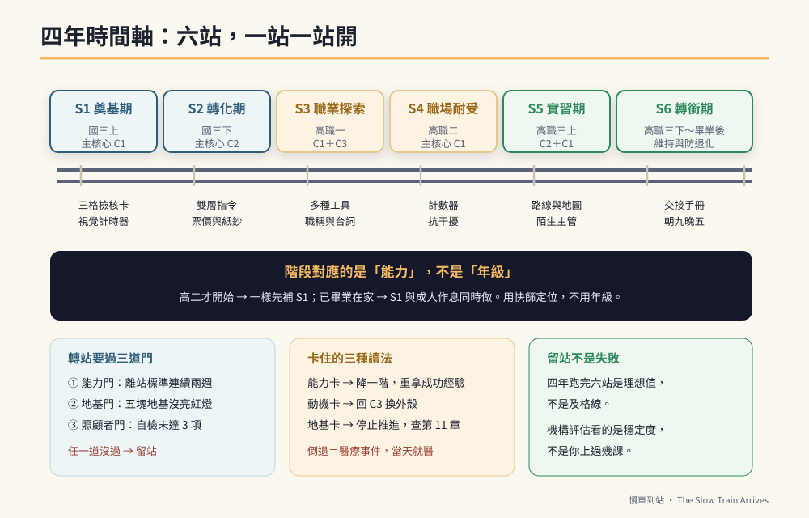

# 第三篇　六大階段：四年，一站一站開

# 第12章　四年時間軸：六階段總覽與轉階段的判準



## 背景與痛點

第二篇給了三條核心。但核心是「練什麼」，不是「什麼時候練」。

沒有時間軸會發生一件很典型的事：**家長把四年的內容壓在第一個學期做完。**

國三上學期就開始練通勤、練代工、練面試台詞、練找零、練抗干擾——因為每一項看起來都很重要，而且截止日在四年後，所以「越早開始越好」。

結果是三個月後全家崩潰。孩子開始抗拒，家長開始懷疑方法，然後整套計畫停擺。而真正該在國三上學期打好的地基（視覺化紀律、情緒回復時間），一項都沒有做穩。

時間軸的功能，不是催你快，而是**允許你這學期只做這幾件事**。

---

## 核心設計：六階段一覽

| 階段 | 對應學期 | 主題 | 主核心 | 代表動作 | 離站標準（摘要） |
|------|---------|------|--------|---------|----------------|
| **S1 奠基期** | 國三上 | 穩定地基，建立視覺化工作紀律 | C1 | 三格檢核卡、視覺計時器 | 情緒回復 ≤ 2 分；看卡完成 2 項 |
| **S2 轉化期** | 國三下 | 工作記憶多鏈化＋功能性數學 | C2 | 雙層指令、火車票價教材 | 穩定完成 2 步指令；認得基本面額 |
| **S3 職業探索期** | 高職一 | 工具多元減敏＋社交腳本 | C1＋C3 | 多種工具操作、制式台詞 | 3 種工具可操作；崗位穩定 20 分 |
| **S4 職場耐受期** | 高職二 | 產量、抗干擾、疲勞時求助 | C1 | 計數器、抗干擾訓練 | 干擾下持續 25 分；合格率 90% |
| **S5 實習期** | 高職三上 | 陌生環境、通勤、職評 | C2＋C1 | 路線圖、職場台詞 | 陌生主管 2–3 步指令達 80% |
| **S6 轉銜期** | 高職三下～畢業後 | 機構銜接、成人作息 | 全部 | 交接手冊、朝九晚五 | 報到後 3 個月穩定留任 |

### 三個設計原則

**原則一：階段對應的是「能力」，不是「年級」。**

上表的學期只是參考。真正決定要不要往下一站開的，是**離站標準**（第 20 章有完整版）。

- 孩子年紀比較小（例如國一）→ 一樣從 S1 開始，只是每一站可以待久一點；
- 孩子已經高二了才拿到這本書 → **不要跳到 S4**。先用第 7 章的快篩定位，該補 S1 就補 S1。地基沒補，S4 一定失敗。
- 孩子已經畢業在家 → 從 S1 開始，並直接把 S6 的「成人作息」拉到現在做（見第 18 章）。

**原則二：一次只有一個主戰場。**

每個階段只主推一條核心，其他兩條**維持現有強度、不加難度**。這不是保守，是因為同時推兩條的結果通常是兩條都退。

**原則三：每個階段都有醫療檢核點。**

環境改變（新學校、新環境、實習）是壓力事件，而壓力與疲勞是常見的發作誘因。**每次階段轉換前，都要有一次回診。**

> ⚠️ **醫療免責**
> 「階段轉換前回診」是建議的節奏，實際的追蹤頻率、檢查項目與任何劑量調整，一律由主治醫師決定。本書不提供也不建議任何自行的用藥判斷。

---

## 實作

### 一、四年行事曆：每學期的四個固定動作

不管在哪一階段，每學期都做這四件事。它們構成了整套計畫的節奏。

```text
【學期初】
  □ 回診一次（帶第 11 章的「回診四段資訊」）
  □ IEP 或親師會議：把這學期的 1 個主戰場講清楚，並要求列入紀錄
  □ 用第 7 章快篩重新定位，確認主戰場沒有跑掉
  □ 更新一週配置表（平日每天 ≤ 45 分鐘）

【學期中（每 4 週）】
  □ 檢視三個指標的移動趨勢（不看單日）
  □ 依 stop_rule 決定：升階 / 維持 / 降階
  □ 拍 3 張「能力證據」照片存進資料夾

【學期末】
  □ 對照離站標準，決定要不要進下一階段
  □ 更新能力證據資料夾（第 6 章）
  □ 與老師確認下學期銜接事項

【每年一次】
  □ 檢視身心障礙證明效期與重新鑑定時程
  □ 檢視畢業後去向的清單與候補狀況（S3 起每年至少參訪 1 家機構）
```

### 二、階段轉換的三道門

要從一站開到下一站，必須同時通過三道門。**任何一道沒過，就留在原站——留站不是失敗。**

```text
【門 1】能力門：離站標準達成，且連續兩週穩定
  → 「有一次做到」不算。連續兩週的移動趨勢才算。

【門 2】地基門：五塊地基沒有亮紅燈
  → 睡眠混亂、剛換藥、剛生完病、腸道不適 → 全部先留站。

【門 3】照顧者門：主要照顧者的自檢沒有勾到 3 項以上
  → 照顧者撐不住時推進度，是這條路上最常見的翻車原因。
```

### 三、卡住了怎麼辦：三種卡法與三種處置

| 卡法 | 現場的樣子 | 處置 |
|------|-----------|------|
| **能力卡** | 練了六週，指標完全沒動 | 把任務**降一階**，重新拿到成功經驗；並檢查是不是一次動了兩個維度（第 9 章） |
| **動機卡** | 做得到，但開始抗拒、逃避 | 回到 C3（第 10 章）：重新包裝外殼，或降低單次時長；**不要用處罰處理動機問題** |
| **地基卡** | 忽然全面退步，各項都變差 | 停止推進，回第 11 章排查；若有技能倒退，當天就醫 |

> 🔍 **一個能救很多家庭的觀念**
> 「這一站待了一年半」不是失敗。**四年跑完六站是理想值，不是及格線。**
> 一個在 S2 待了兩年、但把兩步指令練到在任何場合都穩的孩子，比一個六站都跑過、但每一站都只是「大概會」的孩子，畢業時的實際能力高得多。
> 機構評估看的是**穩定度**，不是你上過幾課。

### 四、如果你現在才開始，而時間不夠

不同起點的建議配置：

```text
【還有 4 年（國三上）】
  照 S1 → S6 走。這是設計時的標準路徑。

【還有 2 年（高職二）】
  優先序：S1 地基（壓縮到一學期）→ S4 耐受 → S5 實習 → S6 轉銜
  可以放掉：S2 的完整數學教材（只做 M02 付錢、M06 餘額兩組）
  不可以放掉：S1 的視覺化紀律。它是所有後面階段的前提。

【只剩 1 年（高職三）】
  優先序：S1 濃縮版（4 週）→ S5 實習所需 → S6 轉銜
  重點全部押在三件事：
    ① 制式台詞（請教我／我想休息／我做好了）
    ② 看檢核表獨立完成 3 項
    ③ 通勤路線與安全規範
  這三件事是機構收案最看重的，其他都可以之後再補。

【已經畢業在家】
  最優先：建立「朝九晚五」的結構化作息（第 18 章）。
  沒有結構的在家生活，退化速度比多數家長預期的快。
  同時：S1 地基 + 資源排隊同時進行。
```

---

## 現場踩雷

**踩雷一：把六個階段當成六門課，同時開課。**
四年計畫變成四個月計畫，然後崩潰。**一次一站。**

**踩雷二：用年級決定階段。**
「他都高二了，應該做 S4 了吧」——如果 C1 還沒穩，S4 的抗干擾訓練只會製造挫折。**用快篩定位，不用年級。**

**踩雷三：留站等於退步。**
留站是正常的。真正該擔心的不是留站，是「明明沒過還硬推」。

**踩雷四：階段轉換時沒有回診。**
新環境是壓力事件。轉換前的一次回診，是最便宜的保險。

**踩雷五：只看孩子，不看照顧者。**
第三道門存在的理由。**照顧者垮掉，全部歸零。**

**踩雷六：畢業前一年才開始想去哪裡。**
S3（高職一）就要開始參訪與排隊。第 6 章的資源清單，不是等到 S6 才拿出來用。

---

## 效益與驗收（DoD）

| 項目 | 驗收標準 |
|------|---------|
| 目前站別已確定 | 用第 7 章快篩定位，明確知道現在在哪一站，並寫下來 |
| 本學期主戰場唯一 | 這學期只有一個主戰場，其他兩條核心維持不加難度 |
| 行事曆已建立 | 學期初、每 4 週、學期末的固定動作已排入行事曆 |
| 三道門已認知 | 兩位照顧者都知道「留站不是失敗」，且知道三道門的內容 |
| 醫療節奏已對齊 | 階段轉換前的回診已預約或已排入計畫 |
| 起點已對應 | 依剩餘年限選定配置（4 年／2 年／1 年／已畢業） |

> 💡 君之一席話
> 「你不是在趕四年的進度，你是在**確保每一站都真的停穩了才開走**。慢車之所以會到站，不是因為它開得快，是因為它每一站都有停。」
