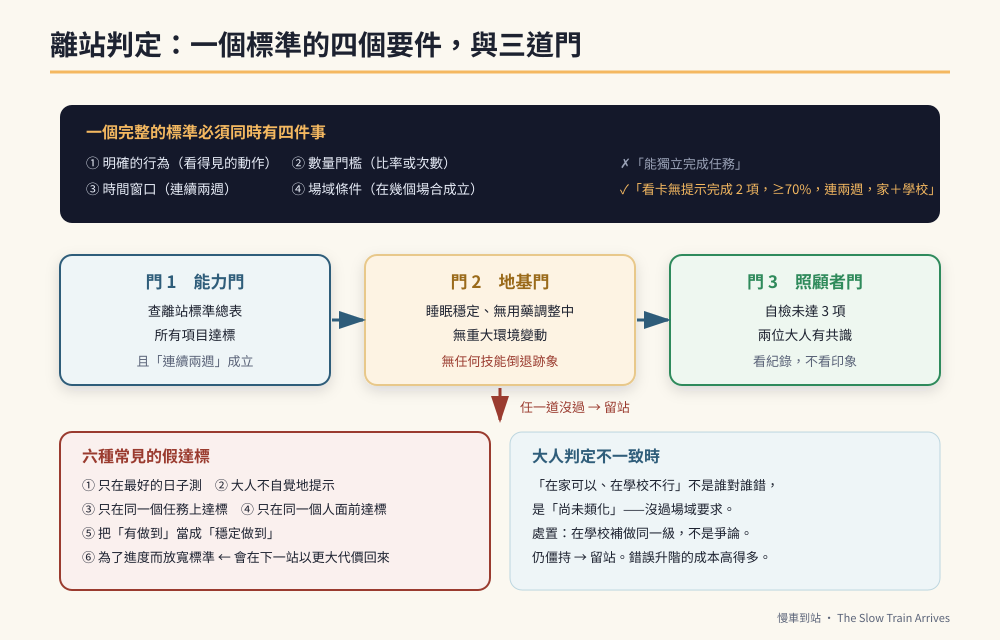

# 第20章　離站標準：怎麼知道可以往下一站開



## 背景與痛點

「他這樣算不算會了？」

這個問題在特教家庭裡，一年會出現幾百次。而它之所以難回答，是因為多數家庭用的判準是**印象**：

- 「他昨天做得很好」——那是單次表現。
- 「他現在都可以了」——「都」是幾次？在哪些場合？
- 「老師說他進步很多」——進步多少？從哪裡到哪裡？

印象式判準會造成兩種錯誤，而且兩種都很貴：

**高估。** 在熟悉情境下的偶爾成功，被當成「會了」，於是推到下一站。三個月後全面崩盤，家長開始懷疑整套方法。

**低估。** 明明已經穩定達標，但家長總覺得「還不夠好」，於是原地踏步一年。孩子失去的是四年裡的四分之一。

這一章提供的，是把「算不算會了」變成一個**可以查表回答**的問題。

---

## 核心設計：一個標準的四個要件

在這本書裡，任何一項「達標」都必須同時滿足四件事。少一件都不算。

| 要件 | 意思 | 為什麼 |
|------|------|--------|
| **① 明確的行為** | 描述的是看得見的動作，不是狀態或態度 | 「他比較穩定了」無法驗收；「連續完成兩項不需提醒」可以 |
| **② 數量門檻** | 有比率或次數 | 「常常可以」是幾成？ |
| **③ 時間窗口** | 連續兩週（或指定期間） | 排除單次表現與心情因素 |
| **④ 場域條件** | 在幾個場合成立 | 只在家成立的能力，機構用不到 |

一個完整的標準長這樣：

```text
✗ 壞的寫法：「能獨立完成任務。」
✓ 好的寫法：「看著三格檢核卡，在無額外口頭提醒的情況下
             連續完成 2 項以上，達成率 ≥ 70%，
             連續兩週，且在家庭與學校**兩個場域**皆成立。」
```

**這個寫法有一個額外的好處：它可以直接抄進 IEP。** 特教老師最需要的就是這種「可評量的目標敘述」，而多數家長寫不出來。你把它寫好，會議上的討論品質會完全不同（第 34 章）。

---

## 實作

### 一、六站離站標準總表

| 站 | 核心指標 | 門檻 | 場域要求 |
|----|---------|------|---------|
| **S1** | 情緒回復時間 | 中位數 ≤ 2 分，或較基線 ↓30% | 家 |
| | 看卡無提示完成 | ≥ 2 項，達成率 ≥ 70% | 家（學校佳） |
| | 手勢制止成功率 | ≥ 80% | 家 |
| | 打勾自主 | 100% 由孩子自己完成 | 全場域 |
| **S2** | 指令鏈 | 穩定通過第 6 級（跨室 2 步「然後」） | 家 + 學校 |
| | 覆誦 | ≥ 70% | 家 + 學校 |
| | 金錢辨識 | 三種面額指認正確；「哪張才夠」≥ 80% | 家 + 一次真實消費 |
| | 公共安全 | 連續 3 次車站練習無安全事件 | 社區 |
| **S3** | 生氣頻率 | 每週 ≤ 2 次，且無失控行為 | 學校 |
| | 工具 | ≥ 3 種可獨立操作；單一工具專注 ≥ 15 分 | 家 + 學校 |
| | 崗位穩定 | ≥ 20 分鐘無需叮囑 | 學校 |
| | 職場台詞 | ≥ 2 句可無提示自發使用，每週 ≥ 3 次 | 家 + 學校 |
| **S4** | 抗干擾 | 干擾下持續 ≥ 25 分鐘 | 家 + 學校 |
| | 良率 | 40 分鐘作業合格率 ≥ 90%，後段無明顯下滑 | 學校 |
| | 求助句 | **無提示**下疲勞時使用，每週 ≥ 2 次 | 家 + 學校 |
| **S5** | 陌生指令 | 陌生主管 2–3 步指令成功率 ≥ 80% | 實習現場 |
| | 固著抑制 | 工作時段主動提起次數為零，連續兩週 | 實習現場 |
| | 通勤 | 達梯度 3 以上，或已確立替代方案 | 社區 |
| | 交通安全 | 100%，無安全事件 | 社區 |
| **S6** | 留任 | 每日在崗 ≥ 4 小時，錯誤率在容許範圍 | 機構 |
| | 變動調適 | 預告或計時器介入後 3 分鐘內平復 | 機構 |
| | 交接 | 七頁手冊已當面交付並說明 | — |

### 二、判定流程：三道門

```text
【門 1】能力門
  查上表。所有項目都達標，且「連續兩週」成立。
  → 任一項未達 → 留站。

【門 2】地基門（第 11 章）
  □ 最近四週睡眠大致穩定
  □ 沒有正在調整用藥、剛生完病、剛經歷重大環境變動
  □ 沒有任何技能倒退的跡象
  → 任一項亮紅燈 → 留站，先處理地基。

【門 3】照顧者門
  □ 主要照顧者自檢未達 3 項
  □ 兩位照顧者對「現在可以往下一站」有共識
  → 未過 → 留站，先找喘息與支持。
```

### 三、當大人的判定不一致

這件事一定會發生：媽媽覺得可以了，爸爸覺得還早；家長覺得可以了，老師覺得在學校根本沒看到。

**這不是誰對誰錯的問題，通常是「場域不同」。**

```text
【處理流程】
  1. 先確認雙方看到的是不是同一件事
     → 把標準唸出來（含數量、時間窗口、場域），逐項對答案

  2. 如果雙方的觀察真的不同 → 那是資訊，不是爭執
     「在家可以、在學校不行」= 尚未類化 = 沒過門 3 的場域要求
     → 正確處置是**在學校補做同一級**，而不是爭論誰說了算

  3. 用紀錄，不用印象
     → 各自記兩週，拿數字出來比。
       這是為什麼第 1 章要求「兩人先對定義」。

  4. 如果仍然僵持 → 留站
     留站的成本遠低於錯誤升階的成本。
```

### 四、不要作弊：六種常見的假達標

```text
① 只在最好的日子測
   → 標準寫的是「達成率」，不是「最佳表現」。全部都要記。

② 大人不自覺地提示
   → 眼神、手指方向、清喉嚨、站的位置——都是提示。
     檢查方法：請第三個人在旁邊看一次，或錄影回放。

③ 只在同一個任務上達標
   → 「擦黑板」練了三個月當然會。換一個任務再測一次。

④ 只在同一個人面前達標
   → 換一個大人交辦，成功率通常會掉。那個掉下來的部分
     才是真實水準。

⑤ 把「有做到」當成「穩定做到」
   → 連續兩週。不是兩次。

⑥ 為了進度而放寬標準
   → 這是最危險的一種，因為它會在下一站以更大的代價回來。
```

### 五、記錄範本

```yaml
# stage-gate.yaml — 每次判定填一份，存檔
stage_from: S2
stage_to: S3
review_date: 2026-06-28
reviewers: [家長A, 家長B, 特教老師]

gate_1_ability:
  chain_level_6:      {value: "5次中4次", pass: true,  domains: [家, 學校]}
  echo_rate:          {value: 0.75,      pass: true,  domains: [家, 學校]}
  money_recognition:  {value: 0.85,      pass: true,  domains: [家, 超商]}
  public_safety:      {value: "3次無事件", pass: true, domains: [社區]}
  result: PASS

gate_2_foundation:
  sleep_stable_4w: true
  no_med_change: true
  no_regression: true
  result: PASS

gate_3_caregiver:
  self_check_flags: 1
  consensus: true
  result: PASS

decision: 進入 S3
notes: |
  金錢項目在超商實測時，找零仍需完全提示 → 列為 S3 期間的加值項目，
  不影響本次離站（S2 的標準只要求「哪張才夠」）。
next_review: 2026-09-30
```

**最後那個 `notes` 欄位是這份表格的靈魂：** 它記下了「達標但還不漂亮」的部分，讓它不會在升階後被遺忘。

---

## 現場踩雷

**踩雷一：把 DoD 當成考試。**
它不是考試，是**紅綠燈**。紅燈的意思是「先不要開」，不是「你考壞了」。這個語氣差別，孩子聽得出來。

**踩雷二：在孩子面前討論他有沒有達標。**
他聽得懂的比你想的多。**判定會議在他不在場時開。**

**踩雷三：只用達標與否，不看趨勢。**
即使沒過門，只要三個指標都在往好的方向動，那就是有效的訓練。**趨勢比門檻更早告訴你方法對不對。**

**踩雷四：沒有 review_date。**
「等他準備好」永遠不會到。**排一個固定的檢視日**（例如每學期末），時間到就拿表出來對。

**踩雷五：把標準訂得比孩子的現實高。**
如果連續三次檢視都沒過，而且指標也沒在動——那不是孩子的問題，是**標準訂錯了或方法選錯了**。此時該調整的是計畫，不是孩子。

---

## 效益與驗收（DoD）

| 項目 | 驗收標準 |
|------|---------|
| 標準已成文 | 目前這一站的離站標準，逐項寫下來並貼出 |
| 四要件齊全 | 每項標準都含行為、數量、時間窗口、場域 |
| 檢視日已排 | 下一次判定日期已排入行事曆 |
| 記錄已建立 | 使用 `stage-gate.yaml` 或等效表格，每次判定留檔 |
| 多方參與 | 判定至少有兩位大人參與，且看的是紀錄不是印象 |
| 已寫進 IEP | 至少一項標準已用可評量的敘述寫進 IEP 或親師會議紀錄 |

> 💡 君之一席話
> 「『他這樣算不算會了』這個問題之所以難，是因為你在問一個**沒有定義的問題**。定義寫下來的那一天，它會變成一個十秒鐘就能回答的問題——而你會發現，你其實一直都知道答案。」
