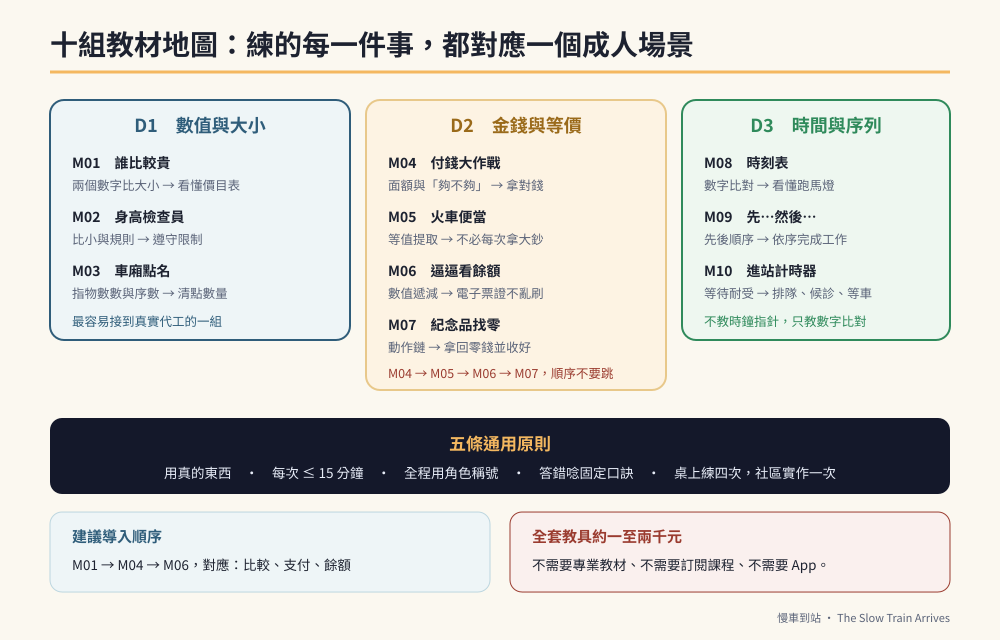

# 第四篇　教材與工具箱：今天晚上就能用的東西

# 第21章　十組教材總覽：三個維度與一張地圖



## 背景與痛點

一個十六歲、認知落後的孩子，數學該怎麼教？

**不要教數學。教他二十五歲那年會用到的那幾件事。**

九九乘法表、應用題、分數——這些對他沒有用，而且他學不會，學不會的挫折還會傷害動機。但下面這幾件事，他一輩子都會用到：

- 兩個價格，哪個比較貴？
- 我手上這張錢，夠不夠付？
- 刷完卡，錢是變多還是變少？
- 找回來的零錢，要收好。
- 時刻表上寫的那班車，是不是我要搭的？
- 還要等五分鐘，我要坐著等。

這六件事，就是這一篇的全部內容。它們被拆成**十組教材**，每一組都包在火車與遊樂園的外殼裡，每一組都有逐字台詞、量化檢核，以及「他中途開始碎念時該怎麼辦」的處理腳本。

---

## 核心設計

### 一、三個維度、十組教材

| 維度 | 教材 | 練什麼 | 對應的成人生活場景 |
|------|------|--------|-----------------|
| **D1　數值與大小** | M01 誰比較貴 | 兩個數字比大小 | 買東西時選便宜的；看懂價目表 |
| | M02 身高檢查員 | 數字比小、規則限制 | 遵守限制（身高、重量、人數） |
| | M03 車廂點名 | 指物數數、序數 | 清點數量、第幾個、最後一個 |
| **D2　金錢與等價** | M04 付錢大作戰 | 面額辨識、「夠不夠」 | 拿對錢付款 |
| | M05 火車便當 | 等值提取（剛好） | 不必每次都拿大鈔 |
| | M06 逼逼看餘額 | 數值遞減、消費因果 | 電子票證不會亂刷 |
| | M07 紀念品找零 | 找零的動作鏈 | 拿回零錢並收好 |
| **D3　時間與序列** | M08 時刻表 | 時間與事件的錨定 | 看班次、準時出門 |
| | M09 先…然後… | 先後順序 | 依序完成多步驟工作 |
| | M10 進站計時器 | 等待耐受 | 排隊、候診、等車 |

**三個維度的難度是遞增的，但它們可以並行。** 建議的導入順序是：M01 → M04 → M06 →（其餘依需要）。這三組對應的是社區生活最常出現的三種情境：比較、支付、餘額。

### 二、每一組教材的共同結構

這一篇的每一組教材都用同一個五段結構寫成。你可以照著做，也可以用它來設計自己的教材（第 10 章的外殼化四步驟）。

```text
① 教具與場景部署
   要準備什麼、擺在哪裡、誰扮演誰

② 三部曲互動腳本（★ 逐字台詞）
   第一步：引導與辨識
   第二步：核心決策（這一步是真正要練的東西）
   第三步：收尾動作（把行為練成完整的鏈）

③ 量化檢核
   兩個指標 + 一個過關標準

④ 固著過載的處理
   他一定會在中途開始碎念。這一段告訴你怎麼接。

⑤ 常見錯誤與變化型
```

### 三、五條通用原則（每一組教材都適用）

**原則一：用真的東西。**

真鈔票、真票價表、真的悠遊卡、真的刷卡畫面。不要用玩具鈔或自己畫的假素材。理由有兩個：真實素材的觸感、顏色與細節提供的辨識線索完全不同；更重要的是，**用真的東西練，能力才會直接類化到現場**。

**原則二：每次不超過 15 分鐘，一次挑 2–3 組。**

時間到就停，**即使他還想繼續**。見好就收是為了保護動機——這是這一篇裡最容易被忽略、也最會影響長期成效的一條。

**原則三：全程用角色稱號。**

「維修長」「站長」「安全檢查員」。角色把「被要求」變成「扮演」，而扮演的抗拒成本低得多。角色名一旦定了，家裡和學校都用同一個。

**原則四：答錯不責罵，用制約口訣。**

每一組教材都有一句固定的口訣（例如「一百元太小了，買不到門票，我們要拿藍色的一千元」）。答錯時，不責備、不解釋一長串，就唸那句口訣，然後引導他重來一次。

**原則五：桌上練四次，就要有一次真實情境。**

這是類化的最低比例。桌上版練得再好，沒有在超商、車站真的做過一次，都不算數。

### 四、教具總清單（一次備齊，四年夠用）

```text
【錢】
  □ 真鈔：1000 元 × 1、500 元 × 1、100 元 × 5
  □ 硬幣：50 元 × 2、10 元 × 5、5 元 × 5、1 元 × 10
  □ 一個他自己的錢包（有拉鍊或扣環，能真的收零錢）
  □ 悠遊卡或一卡通（貼上他喜歡的貼紙）

【印刷品】（可自行列印或手寫字卡，護貝）
  □ 台鐵票價表（真實的，挑他常搭的區間）
  □ 遊樂園門票價目表（全票／學生票／優待票）
  □ 簡化的時刻表（3–5 個班次即可）
  □ 便當／商品價格卡
  □ 設施身高限制卡

【工具】
  □ 視覺計時器（紅色區塊會消失的那種）
  □ 護貝機與護貝膜（★ 會用很多年，值得買）
  □ 魔鬼氈、可擦拭彩色筆
  □ 按壓計數器
  □ A4 與 A6 空白卡紙

【記錄】
  □ 一本筆記本或一張月曆，記兩個指標就好
```

> 💡 **關於預算**
> 全部加起來大約一千到兩千元台幣（不含真鈔本身，那些是循環使用的）。這一篇不需要任何專業教具、不需要任何訂閱課程、不需要任何 App。
> **如果有人告訴你需要買一套幾萬元的教材才能做這些事，那不是真的。**

---

## 實作：一週配置範例

以 S2（轉化期）為例：

| 日 | 教材 | 時長 | 地點 |
|----|------|------|------|
| 一 | M01 誰比較貴 + M03 車廂點名 | 12 分 | 家（餐桌） |
| 二 | M04 付錢大作戰 | 10 分 | 家（客廳） |
| 三 | 休息（只做小幫手任務） | — | — |
| 四 | M04 + M05 火車便當 | 12 分 | 家 |
| 五 | M08 時刻表 | 10 分 | 家 |
| 六 | **真實情境**：搭一次車 + 超商買一樣東西 | 60–90 分 | 車站、超商 |
| 日 | 休息（火車日） | — | — |

**週六那一格是整週的重點。** 前面五天都是為了那一次真實情境做準備。

---

## 現場踩雷

**踩雷一：把十組教材當成十堂課，排進課表跑完。**
它們不是進度，是工具箱。**這學期用得到哪三組，就做哪三組。**

**踩雷二：用玩具鈔。**
省下來的兩千元，換來的是無法類化的能力。

**踩雷三：做到他厭倦。**
外殼會失效。一旦「火車」開始與「被考試」連結，你就失去了這本書最重要的資產。

**踩雷四：只在家做。**
桌上專家、現場文盲，是這一篇最常見的失敗模式。

**踩雷五：把教材當成親子時光的全部。**
每天 15 分鐘教材，之後還有 15 分鐘純粹的火車時間——**那一段不上課、不考試、不引導，就是陪他講**。兩者不能互相取代。

---

## 效益與驗收（DoD）

| 項目 | 驗收標準 |
|------|---------|
| 教具已備齊 | 上方清單全部就位，錢包裡有真的零錢 |
| 角色已命名 | 有一個固定的角色稱號，家庭與學校一致 |
| 已選定組數 | 這學期只導入 2–3 組，並寫下來 |
| 時長受控 | 每次 ≤ 15 分鐘，實際執行四週未超時 |
| 有真實情境 | 每四次桌上練習，至少有一次社區實地 |
| 有記錄 | 每組教材的兩個指標都有記錄，可回顧趨勢 |

> 💡 君之一席話
> 「他不需要會算數學，他需要**在便利商店結帳時不會被騙、也不會慌**。這兩件事聽起來很像，但只有後者能靠十五分鐘的火車票價練出來。」
