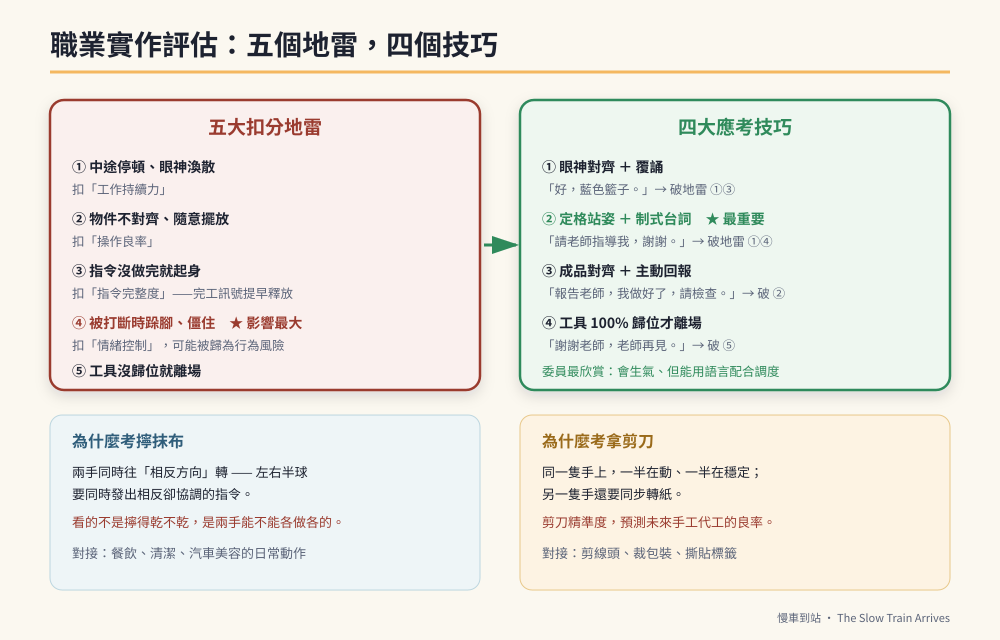

# 第27章　面試評估：為什麼考的是剪刀和抹布



## 背景與痛點

家長第一次聽到高職適性安置或職業評估的內容時，反應通常是困惑：

「怎麼考折抹布？」「拿剪刀剪紙這種東西也要考？」「不是應該考認字或算術嗎？」

這個困惑來自一個誤解：**以為評估要找的是「比較聰明的孩子」。**

不是。評估委員手上拿的是一張**工作人格與操作良率檢核表**。他們要判斷的是：

- 這個孩子坐得住嗎？
- 他聽得懂交辦嗎？
- 他做出來的東西合不合格？
- 出狀況的時候，他會怎樣？

這四個問題，決定了他適合去哪裡、能不能被支持、機構願不願意收。而它們**都不需要智力測驗**——用一條抹布和一把剪刀，二十分鐘就能看得相當清楚。

這一章要做兩件事：解釋那些考題到底在看什麼，以及告訴你怎麼在家裡練。

---

## 核心設計

### 一、為什麼是「擰抹布」

擰乾一條抹布，看起來只是力氣。在動作發展上，它是一個相當複雜的**雙側反向協調**動作：

| 要求 | 神經層面在看什麼 |
|------|----------------|
| 兩手同時往**相反方向**轉 | 左右半球必須同時發出相反、但協調的動作指令 |
| 前臂的旋前與旋後 | 前臂旋轉肌群與腕關節的成熟度 |
| 持續施力而不放掉 | 握力的耐力，而不只是瞬間力量 |

**關鍵在於「反向」。** 早期有腦部損傷或發展落後的孩子，常出現**聯帶動作**——兩隻手只能做同方向的動作，一隻手在轉，另一隻手不由自主地跟著轉同一邊。

所以委員看的不是「擰得乾不乾」，是**兩隻手能不能各做各的**。

而它對接的職場非常直接：特教高職的餐飲、清潔、汽車美容科，每天都要擦拭、刷洗、旋轉瓶蓋。**能擰乾抹布 ≒ 具備基礎清潔工作的耐受力。**

### 二、為什麼是「拿剪刀」

剪刀在特教與職能治療領域，是公認的高階手部動作指標。它同時考三件事：

```text
① 手指的分工（橈側 / 尺側分化）
   拇指、食指、中指（橈側）負責開合剪刀
   無名指、小指（尺側）在下方穩定支撐
   → 同一隻手上，一半在動、一半在穩定，
     這種分工需要相當精細的動作控制

② 雙手不對稱協作
   慣用手控制剪刀開合
   非慣用手必須「同步轉動紙張」
   → 兩隻手做的是完全不同的工作

③ 手眼協調與視覺追蹤
   眼睛要盯著線，手要跟著線走
```

它對接的職場同樣直接：小作所的代工——剪線頭、裁包裝、撕貼標籤——**剪刀的精準度，相當程度預測了未來手工代工的良率。**

> 🔍 **一個常被誇大的說法，值得校準**
> 有一種說法是「手部精細動作區與語言區（布洛卡區）高度重疊，所以練手就能練語言」。
> 較保守的說法是：手部動作的皮質代表區與部分語言相關區域在額葉**相鄰**，而動作與語言系統在演化與發展上可能有關聯——這是研究中的假說，不是可以直接推論到「練剪刀能改善說話」的結論。
> **練手部動作的理由已經夠充分了**（職場直接需要、可觀察、可進步），不需要再附加一個可能不成立的語言效益。本書的原則：做對的事，用對的理由（第 11 章）。

### 三、四大考題

| 考題 | 現場的樣子 | 在看什麼 |
|------|-----------|---------|
| **① 基本資料與自理** | 「你叫什麼名字？」「你會自己上廁所嗎？」「把外套脫下來掛好，等一下自己穿上」 | 口語表達、自理獨立度 |
| **② 職業實作** | 抹布折四分之一並擦乾淨；10 個袋子各裝一個積木、封口貼標籤，限時 3–5 分鐘 | 手部動作、良率、工作耐受 |
| **③ 指令理解** | 「先去後面籃子拿一個藍色夾子，然後夾在桌上的綠色抹布上」 | 工作記憶鏈、跨空間執行 |
| **④ 情緒控制** | 專注時故意製造噪音；做得正好時忽然說「這個先不要做，改做這個」 | 抗干擾、認知彈性、挫折忍受 |

**第 ① 題是多數孩子的必勝題**（如果自理獨立），第 ④ 題是差距最大的一題。

---

## 實作

### 一、五大扣分地雷

```text
【地雷一】中途停頓、眼神渙散　→ 扣「工作持續力」
  現場：做到一半停下手，看天花板，或開始碎念火車，
        需要委員提醒「繼續做」。
  居家對策：抗干擾訓練（第 16 章）＋ 定格站姿。

【地雷二】物件不對齊、隨意擺放　→ 扣「操作良率」
  現場：抹布邊角沒對齊就扔進籃子；
        成品沒有整齊排放。
  居家對策：所有練習都加一句「要對齊」，
            並在收尾時檢查一次。

【地雷三】指令沒做完就起身　→ 扣「指令完整度」
  現場：三步驟指令做了前兩步（拿袋子、裝積木），
        還沒貼標籤就轉身要走——大腦提早釋放「完工訊號」。
  居家對策：覆誦（第 9 章）＋ 三格檢核卡的打勾習慣。

【地雷四】被打斷時跺腳、僵住　→ 扣「情緒控制」
  現場：委員為了測抗壓，故意在他做得順的時候喊停、換任務。
  後果：被歸類為「情緒行為風險」，這一項的影響最大。
  居家對策：定格站姿 + 台詞（見下）。

【地雷五】工具沒歸位就離場　→ 扣「生活自理」
  現場：剪刀、標籤紙散一桌，起身就走。
  居家對策：每一次練習的最後一步都是「工具歸位」，
            養成到不用想。
```

### 二、四大應考技巧

```text
【技巧一】眼神對齊 + 覆誦（破地雷一、三）
  委員下達指令後，教他：
    先不要動 → 眼睛看著委員 2 秒 → 用力點頭 →
    大聲覆誦核心名詞
  例：委員說「把抹布折好放進藍色籃子」
      他說：「好，藍色籃子。」

  → 這個動作在委員眼中的訊號是：
    聽覺工作記憶好、有職場禮貌、可指導。

【技巧二】定格站姿 + 制式台詞（破地雷一、四）★ 最重要
  遇到不會做、卡住、或被突然打斷時：
    雙手在肚臍前交疊 → 深吸一口氣 → 看著對方說：
      「請老師指導我，謝謝。」
      或「好，沒關係，我換做這一個。」

  → 用標準社交語言，把想生氣的衝動整個覆蓋掉。
    委員最欣賞的不是不會生氣的孩子，
    是「會生氣但能用語言配合調度」的孩子。

【技巧三】成品對齊 + 主動回報（破地雷二）
  每做好一個成品，雙手筆直、對齊排放。
  全部做完，主動走向委員說：
    「報告老師，我做好了，請檢查。」

  → 主動回報是庇護工場高階員工的特質。

【技巧四】工具 100% 歸位才離場（破地雷五）
  離場前：剪刀放回工具盒 → 垃圾丟掉 → 椅子靠攏 →
          「謝謝老師，老師再見。」
```

### 三、居家練習：剪刀與抹布的分級

```text
【擰抹布　四級】
  L1  雙手抓住抹布，用「壓」的擠水（★ 這是起點，不是失敗）
  L2  雙手抓住，一手固定、一手轉
  L3  雙手反向轉，但幅度小
  L4  雙手反向轉且能擰乾（滴水明顯減少）

  練法：不要空練。給他真的要擦的東西——
        擦窗戶、擦桌子、擦車。有結果的工作才練得久。
  外殼：「維修長，車窗要擦乾淨，火車才漂亮。」

【剪刀　五級】
  L1  能開合剪刀，剪斷紙條（不要求路徑）
  L2  沿著粗直線剪（線寬 1 公分）
  L3  沿著細直線剪（線寬 3 公釐）
  L4  沿著曲線剪
  L5  剪出形狀（方形、圓形）

  練法：把要剪的東西做成「鐵軌」——
        「維修長要剪一段鐵軌給火車走。」
        剪下來的紙條真的貼在紙上排成軌道。
  ★ 非慣用手要「轉紙」，不是把紙壓死不動。
    這一點要特別引導：「另一隻手要幫忙轉紙。」

【安全】
  · 從安全剪刀（圓頭）開始
  · 剪刀不用時一定歸位（同時是地雷五的練習）
  · 全程有大人在場
```

### 四、能力現況說明表：優勢特質那一欄怎麼寫

報名安置或申請服務時，通常要填一份能力現況說明。**「優勢特質」那一欄是家長唯一能主動出手的地方**，而多數人寫得太抽象（「個性乖巧」「很聽話」）。

好的寫法有三個要素：**病史一句帶過、功能寫具體、把固著寫成可管理的**。

```text
【範本】（依實際狀況替換方括號內容）

  「[孩子] 因幼兒期神經事件引發癲癇，目前於 [科別] 規則追蹤，
   藥物控制穩定多年，未再發作。常規基因檢測未發現致病變異。

   生活自理完全獨立：可自行進食、穿脫衣物、如廁且無失禁。

   在國中特教班人緣良好，利他動機強，長期擔任教師的班務小幫手，
   可獨立完成擦黑板、排桌椅、收發簿本等連續 [2–3] 項任務。

   對 [火車與遊樂園] 有固著興趣，但已建立視覺結構化的工作紀律：
   使用視覺檢核表可自主完成任務、使用視覺計時器可自我結束話題。

   面對挫折或任務變更時，具備自我控制能力，
   可在提示下以口語配合調度，未出現攻擊或自傷行為。

   適合高職階段的職業技能培訓與結構化工作環境。」
```

> ⚠️ **醫療免責**
> 上述說明表涉及診斷與用藥的敘述，**應以主治醫師開立的診斷證明與病歷摘要為準**。家長填寫時可引用醫師的用語，但不應自行下診斷結論或描述藥物療效。任何用藥資訊都必須與醫師確認後再書寫。

**這段文字的作用是：讓委員在還沒見到孩子之前，就先把他歸類到「高配合度、可投入實作」那一類。** 第一印象一旦建立，現場的小失誤就不會被放大。

### 五、考前一週的模擬

```text
【每天 20 分鐘，連續 5 天】
  1. 陌生大人（請親戚或朋友幫忙）擔任「委員」
     ★ 這一項最重要——熟人面前做得到不代表陌生人面前做得到
  2. 完整跑一次四大考題
  3. 至少製造 1 次干擾與 1 次任務變更
  4. 錄影，回放時只看三件事：
     · 有沒有中途停頓
     · 成品有沒有對齊
     · 被打斷時的反應
```

---

## 現場踩雷

**踩雷一：家長在現場搶答。**
「他會啦，他在家都會」——委員評的是孩子，不是你。**該說的寫在書面資料裡。**

**踩雷二：只練技術，不練「卡住怎麼辦」。**
現場一定會出現沒練過的題目。**技巧二那句台詞，價值高於任何一項技術。**

**踩雷三：練到孩子厭惡。**
考前一週每天二十分鐘就夠。練到他一看到剪刀就跑，是本末倒置。

**踩雷四：把「會生氣」當成必須隱藏的缺點。**
不必隱藏。**「會生氣但能自我控制、能用語言配合」本身就是加分項**——委員看過太多完全無法自控的孩子。

**踩雷五：說明表寫得太謙虛或太誇大。**
太謙虛（「他什麼都不會」）會讓孩子被安置到不適合的高支持組別；太誇大（「他都可以獨立」）會讓他到現場後被要求做不到的事。**寫具體的事實。**

**踩雷六：忘了工具歸位。**
最容易補、也最容易被忘記的一項。**把它練成離場的固定動作。**

---

## 效益與驗收（DoD）

| 項目 | 標準 |
|------|------|
| 擰抹布 | 達 L3 以上（雙手能反向轉） |
| 剪刀 | 達 L2 以上（能沿粗直線剪），非慣用手會轉紙 |
| 覆誦 | 陌生大人交辦時，能點頭並覆誦關鍵名詞 ≥ 70% |
| 定格台詞 | 卡住或被打斷時，能使用台詞而非情緒反應 ≥ 70% |
| 對齊與回報 | 成品對齊擺放；完成後主動回報 ≥ 80% |
| 工具歸位 | 每次練習結束都自主歸位，達 ≥ 90% |
| 陌生人測試 | 已在陌生大人面前完整跑過模擬 ≥ 3 次 |
| 說明表 | 優勢特質欄已用具體功能敘述寫成，並經醫師確認醫療用語 |

> 💡 君之一席話
> 「他們考的不是他多聰明，是**他壞掉的時候會怎樣**。一個做得慢但卡住會舉手的人，比一個做得快但一被打斷就僵住的人，在任何一間工場都活得久。」
