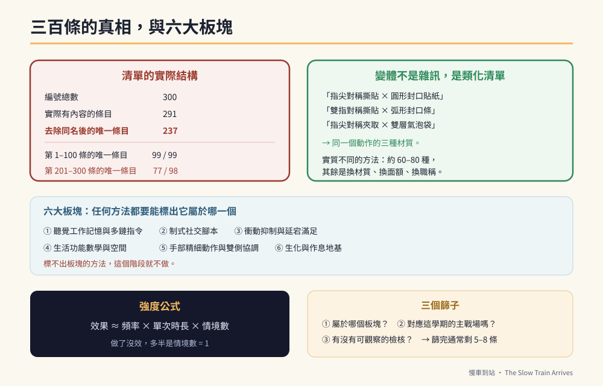

# 第五篇　轉銜與永續：往前看，也往回看

# 第28章　方法學總則：一份三百條的清單，該怎麼用



## 背景與痛點

整理這本書時，手上有一份「系統性提升語言與認知能力的三百種方法」——分段擴充、逐次累加而成的長清單。

而收到這樣一份清單的家長，通常會經歷三個階段：

1. **興奮**——三百種！終於有一套完整的東西了。
2. **癱瘓**——三百種要從哪一種開始？做完要幾年？
3. **放棄**——存進手機的備忘錄裡，再也沒有打開。

這一章要做的，是把那份清單變成**可用的東西**。而第一步，是先誠實地說清楚：**那三百條，實際上有多少是不同的。**

---

## 核心設計

### 一、先講真話：三百條裡有多少種方法

把清單逐條抽出、編號比對，得到這組數字：

| 項目 | 數量 |
|------|------|
| 編號總數 | 300 |
| 實際有內容的條目 | 291（有 9 個編號在生成過程中遺失） |
| **去除完全同名後的唯一條目** | **237** |
| 第 1–100 條中的唯一條目 | 99 / 99 |
| 第 201–300 條中的唯一條目 | **77 / 98** |

而如果進一步看內容，**唯一條目的數字仍然是高估的**。清單後段大量出現的是同一個方法的換裝版本：

```text
· 「小作所包裝：高精度『指尖對稱撕貼』與圓形封口貼紙防皺對齊」
  「小作所包裝：高精度『雙指對稱撕貼』與弧形封口條防皺對齊」
  「小作所包裝：高精度『指尖對稱夾取』與雙層氣泡袋防皺對齊」
  → 同一件事：用手指對稱地把東西貼平／夾平。換的只是材質。

· 「金融數學：百元鈔與五十元硬幣的兩位數混合點數」
  「金融數學：五百元鈔與五十元、五元硬幣的三位數混合點數換算」
  「金融數學：一千元鈔與五十元、五元硬幣的四位數混合點數驗算」
  → 同一件事：用不同面額組合算錢。換的只是數字。

· 「利他增強：擔任小作所『環境安全安檢員』的職場使命感」
  「利他增強：擔任小作所『薪資袋條碼核對長』的最高階社會角色轉換」
  「利他增強：擔任小作所『飲水機濾心更換日期核對長』…」
  → 同一件事：給他一個有名字的職務。換的只是職稱。
```

**實質不同的方法，大約在六十到八十種之間。** 其餘的是變體。

> 🔍 **為什麼會這樣，以及為什麼這不是壞事**
> 任何一份「再多給一些」、分十幾次逐段擴充出來的長清單，到後段都會開始產生變體。這是清單這種格式的必然結果，不是誰的疏失。
> 而關鍵的認知轉換是：**那些變體不是雜訊，它們正好就是「類化練習」的素材。**
> 第 20 章講過，一項能力只在一種材質、一個面額、一個情境下成立，是不算數的。而清單後段那些「換材質、換面額、換職稱」的變體，恰恰就是把同一個方法推到不同情境的具體清單。
> **不要把它讀成「三百件要做的事」，要把它讀成「六十個方法 × 每個方法的變體清單」。**

### 二、六大板塊：所有方法的歸屬

不論清單有多長，所有方法都落在六個板塊裡。這六個板塊也就是第二篇三核心的展開版。

| 板塊 | 練什麼 | 對應核心 | 詳見 |
|------|--------|---------|------|
| **① 聽覺工作記憶與多鏈指令** | 擴充能同時處理的指令量 | C2 | 第 9、29 章 |
| **② 制式社交腳本** | 把即興社交換成可執行的劇本 | C3 + C1 | 第 15、29 章 |
| **③ 衝動抑制與延宕滿足** | 等待、停止、忍住 | C1 | 第 8、32 章 |
| **④ 生活功能數學與空間** | 錢、時間、路線、數量 | C2 | 第四篇、第 30 章 |
| **⑤ 手部精細動作與雙側協調** | 剪、擰、貼、夾、裝 | 動作 | 第 27、31 章 |
| **⑥ 生化與作息地基** | 睡眠、飲食、水分、腸道、回診 | 地基 | 第 11、32 章 |

**任何一個新方法，如果你標不出它屬於哪一個板塊，就先不要做。** 這與第 7 章的活動標註卡是同一條規則。

### 三、強度公式：為什麼「做過」不等於「有練到」

一個方法有沒有效，取決於三個乘數：

```text
        效果 ≈ 頻率 × 單次時長 × 情境數

  頻率      每週幾次？（每週一次，通常不足以產生變化）
  單次時長  每次幾分鐘？（超過負荷反而倒扣）
  情境數    在幾個不同的場合／材質／對象上練過？
```

大部分「做了沒效」的情況，問題出在**情境數 = 1**。

在家練了三百次，在學校從來沒做過；用紅色抹布練了三百次，換一條藍色的就不會了。**乘積裡有一項是 1，總分就上不去。**

這也是為什麼本書每一章的 DoD 都寫著場域要求。

### 四、選方法的三個篩子

面對一份長清單，用這三個問題篩：

```text
【篩子一】它屬於哪一個板塊？
  → 標不出來 → 丟掉

【篩子二】它對應這學期的主戰場嗎？（第 7 章的快篩）
  → 不對應 → 放進「以後」的清單，不是現在

【篩子三】它有沒有可觀察的檢核？
  → 「提升專注力」不算；「干擾下持續 25 分鐘」算
  → 沒有檢核 → 改寫成有檢核的版本，或丟掉

★ 三個篩子過完，一份 300 條的清單通常會剩下 5–8 條。
  那 5–8 條，就是你這學期真正要做的事。
```

---

## 實作

### 一、把清單當成「變體產生器」

這是本章最實用的一段。當你已經在做某一個方法，而它開始穩定時，**不要換方法，換變體**。

```text
【範例：M07 找零（第 25 章）已經穩定】

  ✗ 錯誤做法：去清單裡找下一個沒做過的方法
  ✓ 正確做法：同一個方法，換四個維度

    換面額：500 買 450 → 1000 買 850 → 500 買 380
    換場所：家裡 → 便利商店 → 傳統市場 → 郵局
    換對象：媽媽 → 爸爸 → 陌生店員
    換型態：實體找零 → 電子支付明細 → 自動售票機找零

  → 這四行，就涵蓋了原始清單裡十幾條「不同編號」的方法。
```

**變體的順序建議：先換材質／數字，再換場所，最後換對象。** 換對象是最難的一步，因為那才是真正的類化。

### 二、把方法寫成可執行的樣子

清單上的條目通常是名稱，不是做法。把它轉成可執行的形式，用第 7 章的活動標註卡：

```yaml
# 從清單條目 → 可執行的方法
source: "第 45 條　六福村安全廣播：關鍵字提取密碼戰"

板塊: ①聽覺工作記憶
核心: C2

做法: |
  家長扮演廣播員，用平穩語氣唸一句含 4–5 個名詞的句子：
    「本班開往六福村的自強號即將進站，
      請大怒神、海盜船、蒸汽火車注意安全。」
  唸完立刻問：「第一個念到的設施是哪一個？最後一個是什麼車？」

檢核:
  指標: 4–5 個名詞中正確提取第一個與最後一個
  目標: 10 次中 ≥ 7 次
  情境數: 家（安靜）→ 家（有背景音）→ 學校

強度:
  頻率: 每週 3 次
  時長: 5 分鐘

stop_rule: |
  連續 3 次全錯 → 名詞數降到 3 個
  連續兩週達標 → 加入背景音干擾（進到第 2 個情境）
```

### 三、飲食與補充品類條目的處理原則

原始清單裡有相當多條目屬於板塊⑥，而且集中在營養補充：魚油、色胺酸、維生素 B6、輔酶 Q10、鎂、多酚、每日固定飲水量……

這一類條目**必須另外處理**，理由在第 11 章已經說明過：

```text
【可以直接做的（低風險、證據合理）】
  · 規律三餐，不長時間空腹
  · 拿掉日常含糖飲料
  · 主食改低 GI（糙米、地瓜）
  · 均衡飲食中包含深海魚、深綠色蔬菜、堅果
  · 規律分次補充水分

【必須先問醫師或藥師的】
  · 任何補充劑（魚油、B 群、鎂、輔酶 Q10…）
  · 任何特殊飲食療法（生酮、限制蛋白質…）
  · 任何「每日固定 ○○○○ c.c.」的水分目標
    → 個別需求差異大，且某些狀況下需要限制

【本書不採用的說法】
  · 「反式脂肪會降低神經元對藥物的敏感度」
  · 「高蛋白粉會讓血氨升高，加劇固著焦慮」
  · 「補充某某營養素能減少生氣頻率」
  → 這些推論在現有證據下都太強。第 11 章有完整說明。
```

> ⚠️ **醫療免責**
> 補充劑並非「反正吃了沒壞處」。部分補充劑會影響凝血、干擾檢驗數值，或與抗癲癇藥物產生交互作用。**任何補充品與飲食療法，都要先與主治醫師或藥師確認。** 本書不提供任何劑量建議。

### 四、四章清單的讀法

接下來四章，是這 237 條去重後的完整清單，按板塊重新歸類：

| 章 | 類別 | 條目數 |
|----|------|-------|
| 第 29 章 | **語言與溝通**（板塊 ①②） | 21 |
| 第 30 章 | **認知、金錢與時間**（板塊 ④） | 79 |
| 第 31 章 | **動作、工作與職場**（板塊 ⑤ + 職場情境） | 84 |
| 第 32 章 | **情緒、社交、安全與地基**（板塊 ③⑥） | 53 |

每一章的結構是：**先挑出該類的「母模式」（實質不同的核心方法）深入寫，再附上完整清單當索引。**

**清單是拿來查的，不是拿來做完的。**

---

## 現場踩雷

**踩雷一：從第 1 條做到第 300 條。**
清單不是課程。它沒有順序，也不需要做完。

**踩雷二：因為「還有 290 條沒做」而焦慮。**
去重後的實質方法約六十到八十種，而其中對你孩子這學期有意義的，通常不超過八種。

**踩雷三：一個方法還沒穩就換下一個。**
穩定之前換方法，會讓每一項都停在「大概會」。**先換變體，不換方法。**

**踩雷四：把補充劑清單當成可以自己執行的部分。**
這是整份清單裡風險最高的一類。

**踩雷五：只做前面簡單的，跳過需要出門的。**
清單裡真正難、也真正有價值的，都是需要在社區、在陌生人面前做的那些。**情境數是那個乘數。**

---

## 效益與驗收（DoD）

| 項目 | 驗收標準 |
|------|---------|
| 認知已校正 | 知道「三百條」的實際結構（237 唯一、後段多為變體） |
| 已篩選 | 用三個篩子篩過，這學期的清單 ≤ 8 條，並寫下來 |
| 已可執行 | 每一條都改寫成含做法、檢核、強度、`stop_rule` 的形式 |
| 情境數 ≥ 2 | 每一條至少規劃了兩個不同的情境／材質／對象 |
| 變體優先 | 已穩定的方法，是用「換變體」而不是「換方法」來推進 |
| 補充品已確認 | 所有營養類條目都經過醫師或藥師確認，或暫緩 |

> 💡 君之一席話
> 「三百這個數字讓人安心，但它也讓人癱瘓。**真相是六十幾種方法，加上大量的換裝**——而當你看懂這件事，那份讓你焦慮的清單，會變成一份讓你安心的工具箱。」
