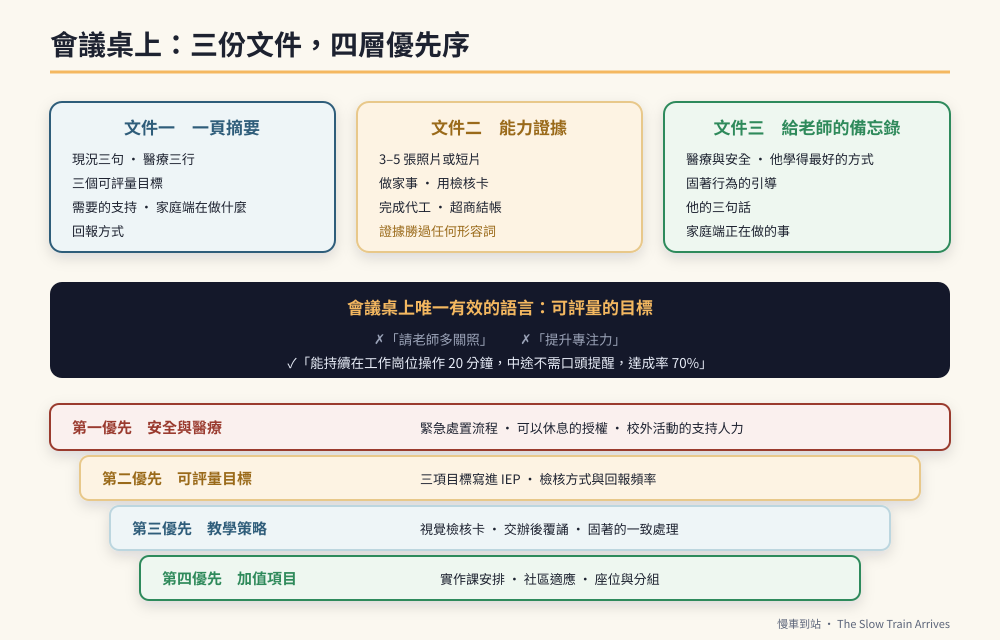

# 第34章　說服體系：IEP、鑑輔會，與把資源要到手



## 背景與痛點

會議室裡坐著七個人：特教老師、導師、行政、輔導、治療師、家長，有時還有校外委員。時間四十分鐘，要談的事有十件。

而家長坐在那裡，帶著三個劣勢：

**資訊劣勢。** 別人講的是安置類型、服務時數、鑑定基準、轉銜通報；而你只知道你的孩子。

**時間劣勢。** 你有很多話想說，但輪到你的時候只剩五分鐘，而且前面已經有人講了三十分鐘的行政流程。

**情緒劣勢。** 談的是你的孩子。任何一句「他這方面比較弱」都會刺到你，而你一旦情緒上來，接下來的話就沒有人聽得進去。

這一章要做的，是把這三個劣勢逐一補上。核心只有一句話：

> 💡 **會議桌上唯一有效的語言，是「可評量的目標」與「具體的支持需求」。**
> 「請老師多關照」不會變成任何一項服務；
> 「他需要每天一張三格視覺檢核表，並在交辦後由老師要求覆誦」會。

---

## 核心設計

### 一、三種會議，三種目標

| 會議 | 誰召開 | 你要拿到什麼 |
|------|--------|-------------|
| **IEP 會議**（每學期） | 學校特教團隊 | 寫進紀錄的**可評量目標** + 具體支持策略 |
| **鑑定與安置**（升學前） | 縣市鑑輔會 | 適合的安置類型與**支持等級** |
| **轉銜會議**（畢業前） | 學校 + 校外單位 | 銜接的**單位、時程與交接內容** |

三者的共同點：**紀錄比口頭承諾重要。** 會議上講得再好，沒有寫進紀錄的，換一個老師就消失了。

> ⚠️ **醫療免責**
> 會議中涉及診斷、用藥與醫療處置的敘述，**應以醫師開立的診斷證明與病歷摘要為準**。家長可以引用醫師的用語與書面資料，但不應自行下診斷結論、描述藥物療效或承諾醫療效果。

### 二、會議前要準備的三份文件

**文件一：一頁摘要（給所有人）**

```text
【一頁摘要的六個區塊】

  ① 現況（三句話）
     自理：可獨立完成 ___、___、___
     溝通：可理解 ___ 步驟指令；表達以 ___ 為主
     情緒：___ 情況下會生氣，目前可在 ___ 提示下自我調節

  ② 醫療（三行，且以醫師書面為準）
     診斷 / 目前追蹤科別 / 需要學校知道的緊急處置

  ③ 這學期的三個目標（★ 可評量，見下一節）

  ④ 需要學校提供的支持（★ 具體到可以執行）

  ⑤ 家庭端正在做什麼（讓對方知道你不是只在要求）

  ⑥ 聯絡方式與回報方式（希望多久收到一次回饋、用什麼形式）
```

**文件二：能力證據**（第 6 章開始累積的資料夾）

三到五張照片或短影片：他在做家事、使用檢核卡、完成代工、在超商結帳。**證據在會議桌上的說服力，遠超過任何形容詞。**

**文件三：給老師的備忘錄**（見下方完整範本）

### 三、可評量目標怎麼寫

這是本章最實用的技能。第 20 章的四要件（行為、數量、時間窗口、場域）直接用在這裡。

| ✗ 常見寫法 | ✓ 可評量寫法 |
|-----------|-------------|
| 提升專注力 | 在班級實作課中，能持續在工作崗位操作 **20 分鐘**，中途不需口頭提醒，達成率 **70%** |
| 加強語言表達 | 能在卡住時使用「請老師教我」求助，**每週 ≥ 3 次**，無需提示 |
| 改善情緒 | 固著話題被中斷時，能在 **2 分鐘內**配合下一活動，**連續兩週**達成率 70% |
| 培養獨立性 | 依三格視覺檢核表**連續完成 2 項**班務，中途無額外口頭提醒，達成率 70% |
| 增進人際 | 每週 **1 次**在下課時間以固定腳本與同儕分享（「這是我最喜歡的 ___，給你看」） |

**寫成這樣有三個好處：** 老師知道要做什麼、期末可以驗收、而且它本身就是你的訓練計畫——**家庭與學校做的是同一件事。**

---

## 實作

### 一、給老師的親師溝通備忘錄（完整範本）

開學第一週傳給老師，或在 IEP 會議上遞出紙本。**方括號請自行替換。**

```text
老師您好：

我是 【孩子姓名】 的家長。非常感謝老師與學校過去的照顧，
讓他學會了良好的生活自理，還能在班上當老師的小幫手、
擁有好人緣。這對我們家長來說是很大的安慰。

以下提供孩子的醫療狀況、行為引導方式，以及本學期的學習期望，
供老師教學與 IEP 參考。

────────────────────────────────
一、醫療與安全（重要）

  · 診斷與用藥：【依醫師診斷證明填寫】
    目前於 【科別】 規則追蹤，狀況穩定。
  · 若在校出現 【失神／異常疲倦／抽搐等，依醫師說明填寫】，
    請第一時間聯繫家長：【電話】
  · 【若有】緊急處置說明與診斷證明影本，隨函附上。
  · 請避免讓他過度勞累；疲倦時允許他休息。

────────────────────────────────
二、他學得最好的方式（★ 最實用的一段）

  1. 視覺優於口語
     交辦任務時，請給他一張三格視覺檢核卡（我們家裡在用同一套），
     讓他自己打勾。相較於口頭交代，他的獨立完成率明顯較高。

  2. 交辦後請他覆誦
     說完任務後加一句「你說一次」，他能覆誦關鍵名詞就代表有記住。
     這一步能大幅降低他做到一半忘記的情況。

  3. 卡住時請等 5–10 秒
     他需要一點時間提取。若立刻再說一次，他會改成等待提醒，
     反而更慢。等一下不行的話，用手勢指方向通常就夠了。

  4. 一次一到兩件事
     他目前穩定的是 【一／兩】 步驟指令。三步驟仍在練習中。

────────────────────────────────
三、固著行為的引導（他喜歡 【火車／遊樂園】）

  · 我們在家使用「聊天券」：一天 3 張，一張 5 分鐘，
    交出券才能聊。若學校方便，同一套做法會更一致。
  · 非約定時間他提起時，建議溫和但固定地說：
    「現在不是 ___ 時間，請把券收好。」
    （同一句話、每次一樣，他比較容易接受）
  · 他碎念時，請盡量不要進入口語爭辯——用手勢（五指併攏向前）
    並指向檢核表，通常兩分鐘內可以收回。
  · 他焦慮或不安時，這個主題反而是最好的安撫工具。

────────────────────────────────
四、他的三句話（請告訴同學與其他老師）

  「請老師教我，謝謝。」＝ 他卡住了
  「我太累了，我想休息一下。」＝ 請讓他休息（他說了通常是真的累）
  「報告老師，我做好了，請檢查。」＝ 他完成了

────────────────────────────────
五、本學期的期望（可評量的三項）

  1. 【依上一節的寫法填寫】
  2. 【…】
  3. 【…】

────────────────────────────────
六、家庭端正在做的事

  · 每日 【15】 分鐘功能性數學（火車票價、金錢辨識）
  · 每日家事產線 【30】 分鐘
  · 每週 【1】 次社區實地（車站／超商）

再次感謝老師的耐心。若有任何狀況，請隨時與我聯繫。

【家長姓名】 敬上
【聯絡電話】
```

### 二、提案的優先順序

會議時間有限，你不可能全部要到。**先想清楚哪三項是必要的，其餘列為「有的話很好」。**

```text
【第一優先：安全與醫療】（一定要爭取）
  · 緊急處置流程與聯絡方式寫進紀錄
  · 疲倦時可以休息的明確授權
  · 校外教學、實作課的支持人力

【第二優先：可評量的目標】（一定要爭取）
  · 三項目標寫進 IEP
  · 檢核方式與回報頻率講清楚

【第三優先：教學策略】（盡量爭取）
  · 視覺檢核卡的使用
  · 交辦後覆誦
  · 固著行為的一致處理方式

【第四優先：加值項目】（有就好）
  · 特定的實作課安排
  · 額外的社區適應活動
  · 特定的座位或分組安排
```

### 三、被拒絕的時候

會遇到的。常見的三種情況與回應方式：

```text
【情況一】「我們人力不夠。」
  → 不要爭論人力，改問：
    「那在現有人力下，哪一項是做得到的？」
    → 把一個大要求拆成一個小要求，先拿到一項，
      並且**寫進紀錄**。下學期從這一項延伸。

【情況二】「其他孩子也需要，不能只針對他。」
  → 「這個方法對其他孩子可能也有用，
      需要的話我可以提供我們在家用的版本。」
    → 把「特殊待遇」轉成「可共用的工具」。

【情況三】「他這方面就是比較弱，不用太勉強。」
  → 這句話最傷人，但它通常不是惡意，是經驗判斷。
    回應方式：拿出證據。
    「他在家裡的紀錄是這樣（拿出照片／紀錄），
      所以我想試試看在學校能不能也做到。
      如果一個學期後沒有進展，我們再調整目標。」
    → 用「試一個學期」降低對方的承諾成本。

★ 通用原則：不要在會議上贏。
  你要的是往後幾年的合作，不是這四十分鐘的勝負。
```

### 四、四年的關鍵時程

```text
【國三上】
  □ IEP 會議：提出高職安置方向，並列入紀錄
  □ 留意各縣市的適性輔導安置簡章時程
  □ 配合完成能力評估與模擬施測

【國三下】
  □ 參與安置報名與分發
  □ 寒暑假回診，取得最新診斷證明備用

【高職一、二】
  □ 支持他參與各項實作課；觀察哪一類動手能力最好
  □ 每年參訪 1 家機構
  □ 持續累積能力證據

【高職三】
  □ 職業重建相關評估與媒合流程
  □ 主動表達畢業後希望銜接的方向
  □ 提早參觀並登記候補
  □ 畢業前的轉銜會議與交接手冊（第 18 章）
```

---

## 現場踩雷

**踩雷一：帶著情緒去開會。**
會議前十分鐘，把要說的三件事寫在紙上。**照著唸，比臨場發揮安全。**

**踩雷二：只講困難，不講他會什麼。**
只講困難的家長，會讓孩子被安置到支持等級過高的組別。**優勢與需求要一起講。**

**踩雷三：要求太多。**
一次要十項，通常一項都拿不到。**三項，寫進紀錄。**

**踩雷四：口頭承諾就滿意。**
「我們會多注意他」——換一個老師就沒了。**寫進會議紀錄。**

**踩雷五：把老師當對手。**
絕大多數特教老師是這條路上最理解你的人。**他們的限制通常是資源，不是意願。**

**踩雷六：資料太厚。**
三十頁的資料沒有人看。**一頁摘要 + 三張照片 + 一份備忘錄，就夠了。**

---

## 效益與驗收（DoD）

| 項目 | 標準 |
|------|------|
| 一頁摘要 | 已完成六區塊，並在最近一次會議實際使用 |
| 可評量目標 | 三項目標皆含行為、數量、時間窗口、場域 |
| 已入紀錄 | 至少 2 項目標與 1 項支持策略寫進 IEP 或會議紀錄 |
| 備忘錄 | 已交給導師與特教老師，並口頭說明過一次 |
| 能力證據 | 資料夾中有 ≥ 10 張照片／短片，涵蓋 ≥ 3 種能力 |
| 回報機制 | 已約定回報頻率與形式（聯絡簿、LINE、每月一次…） |
| 時程掌握 | 知道下一個關鍵時間點是什麼、什麼時候 |

> 💡 君之一席話
> 「你在那張桌子上唯一的優勢，是**你比任何人都了解他**。但了解不會自動變成資源——**它要先被翻譯成一句可以驗收的話，才會變成寫在紀錄上的一行字。**」
