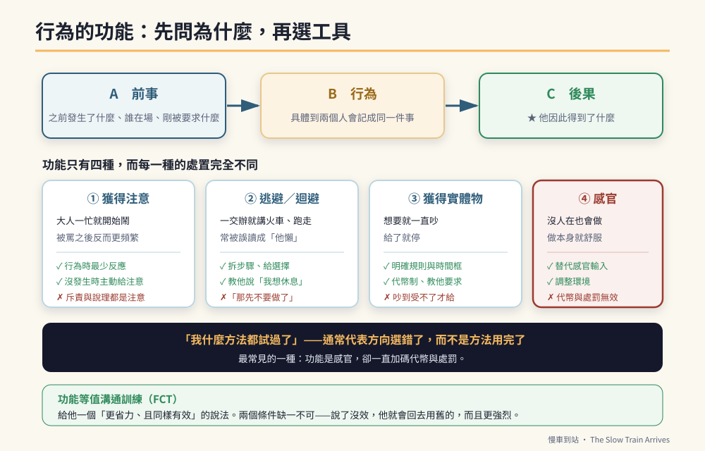

# 第六篇　專業補強：特教現場的六件事

# 第35章　行為的功能：先問為什麼，再談怎麼辦



## 背景與痛點

前面三十四章給了一整箱工具：視覺計時器、代幣制、手勢制止、檢核卡、提示褪除。

現在要說一件可能會讓你有點不舒服的事：**那些工具，如果用在錯的行為功能上，會全部無效——而且有些會讓事情變得更糟。**

舉一個真實會發生的情況。

一個孩子在實作課中反覆離開座位。老師用了代幣制：坐滿十分鐘給一張貼紙。兩週後，離座次數不減反增。

老師的結論通常是「代幣制對他沒用」。但真正的原因可能是：**他離座的目的，本來就不是為了得到東西——他是為了離開那個太吵的教室。** 對一個想逃走的人，你給他貼紙，他當然不理你；而每一次他離座、老師走過來勸他，他都成功地離開了工作幾分鐘——**你其實在增強他離座。**

這一章要補的，是這本書前面缺的最重要的一塊：**在選工具之前，先判斷這個行為在替他做什麼。**

在特教與行為介入領域，這件事叫**功能性行為評估**（Functional Behavior Assessment, FBA）。它不是新潮的技術，它是這個領域的地基——而台灣的特殊教育法規在處理情緒行為問題時，也要求以行為功能為基礎擬定介入方案。

---

## 核心設計

### 一、所有行為都有功能，而功能只有四種

行為不是隨機的。一個持續發生的行為，一定在為他取得某樣東西。行為科學把它歸為四類：

| 功能 | 他在取得什麼 | 現場長什麼樣 | 常見誤判 |
|------|-------------|-------------|---------|
| **① 獲得注意** | 別人的反應（正向或負向都算） | 大人一忙就開始鬧；被罵之後反而更頻繁 | 「他就是欠罵」 |
| **② 逃避／迴避** | 離開一個要求、任務或情境 | 一交辦就開始講火車、跑走、抱怨不舒服 | 「他懶」「他挑食」 |
| **③ 獲得實體物或活動** | 一樣東西、一個活動 | 想要就一直吵，給了就停 | 「他被寵壞了」 |
| **④ 感官／自動增強** | 身體本身的感覺回饋 | 沒有人在旁邊也會做；做了本身就舒服 | 「他故意的」 |

**這四種功能的處置方式完全不同。** 更麻煩的是：**同一個外觀的行為，功能可能不一樣**；而**同一個行為，也可能有多重功能**（在家裡是為了逃避、在學校是為了注意）。

### 二、關鍵的一句話：功能不是動機，是後果

家長最常問的是「他為什麼要這樣？」，然後給出一個心理層面的答案：他想引起注意、他在報復、他覺得無聊。

但功能性評估問的不是**他心裡想什麼**——那個誰都無法確定。它問的是：

> **這個行為發生之後，環境給了他什麼？**

而環境給的那個東西，就是讓這個行為持續下去的原因。這不需要讀心術，**只需要記錄**。

### 三、ABC 三聯式

記錄的方式是三欄。這是特教現場最基本、也最有用的一張表。

```text
  A（Antecedent 前事）  →  B（Behavior 行為）  →  C（Consequence 後果）
  行為之前發生了什麼        他實際做了什麼          之後環境怎麼回應
```

三欄裡，**大人最容易記錯的是 A，最容易漏掉的是 C**。

- **A 常常被寫成「沒有原因，突然就」**——那通常代表觀察者沒看到，而不是真的沒有前事。要寫的是：當下在做什麼、誰在場、剛剛被要求了什麼、環境有什麼變化。
- **C 常常被寫成「我罵他」**——但關鍵不是你做了什麼，是**他因此得到了什麼**。你罵他 → 他得到了你的注意；你說「好吧那先不要做」→ 他成功逃避了任務。

### 四、依功能選策略

這是這一章最實用的一張表。前面各章的工具，在這裡各就各位：

| 功能 | 該做的 | **不該做的**（會讓行為惡化） | 本書對應章 |
|------|--------|---------------------------|-----------|
| **① 注意** | 行為發生時給予最少反應；在他**沒有**出現該行為時主動給注意；教他用適當方式要求注意 | 大聲斥責、長篇說理（那全都是注意） | 8、37 |
| **② 逃避** | 降低任務難度、拆步驟、給選擇權、教他用語言要求休息；**任務仍要完成**（哪怕只完成一步） | 「好啦你不要做了」——那是在教他鬧就能逃 | 16、36 |
| **③ 實體物** | 明確的規則與時間框、代幣制、教他用適當方式要求 | 吵到你受不了才給——那是在教他吵久一點 | 10、37 |
| **④ 感官** | 提供功能等值的替代感官輸入、調整環境、安排規律的感官活動時段 | 代幣、處罰、說理——**這些對感官功能幾乎完全無效** | 11、38 |

> 🔍 **為什麼第 ④ 種特別重要**
> 感官／自動增強的行為，**增強來自他的身體本身，不來自環境**。你能控制的所有後果（給貼紙、不給貼紙、罵他、不理他），對這種行為都構不成影響。
> 這是「所有方法都試過，就是沒用」最常見的一個原因。而正確的處理不是加強介入，是**換一個方向**：這個感覺他需要，那我們找一個可以接受的方式讓他得到。

### 五、功能等值溝通訓練（FCT）

這是行為介入裡效果最穩、也最人道的一項技術，而它的邏輯只有一句話：

> **問題行為是一種溝通。要讓它消失，就給他一個更省力、且同樣有效的說法。**

「更省力」與「同樣有效」兩個條件缺一不可：

- 如果新的說法比較費力（要說一整句話 vs 只要尖叫一聲），他會繼續用舊的；
- 如果新的說法沒有效（他說「我想休息」你說「再做十個」），他會回去用舊的，而且更強烈。

**這正是第 8、16 章那三句台詞的專業名稱。** 而現在你知道它們為什麼有效、以及在什麼條件下會失效。

| 問題行為 | 功能 | 功能等值的替代 |
|---------|------|--------------|
| 交辦時開始碎念、拖延 | 逃避 | 「我需要幫忙／太難了」 |
| 做到一半離座 | 逃避（疲勞） | 「我太累了，我想休息一下」 |
| 一直重複問同一件事 | 注意 | 教他一個要求注意的方式（拍拍手臂＋「媽媽，你看」） |
| 拿不到東西就大聲 | 實體物 | 「我要 ___，請給我」＋ 明確的規則（現在／等一下） |

---

## 實作

### 一、ABC 記錄表

連續記錄兩週。**只記那一個你最想處理的行為**，不要一次記三種。

```text
【ABC 記錄　行為定義：__________________________】
（行為定義要具體到「兩個人分別記錄會記成同一件事」，
  例如：✗「情緒不好」　✓「音量提高、重複同一句話三次以上」）

日期 時間  A 前事              B 行為          C 後果            持續
──────────────────────────────────────────────────────────────
3/02 16:20 剛被要求收玩具      重複說火車 6 次  我說「等一下再   4 分
                              音量提高          聊」，然後幫他
                                                收了玩具
3/03 10:05 實作課，隔壁組很吵   離座走到窗邊    老師走過去帶回   6 分
                                                座位，聊了兩句
3/03 19:40 沒有人跟他說話      重複說火車      我回應了三次     8 分
           （我在講電話）
```

**記滿兩週之後，把 C 欄從頭讀一遍。** 你會看到一個重複出現的模式——那就是功能。

上面這三筆的模式很清楚：**第一筆是逃避（成功免除收玩具）、第二筆是逃避＋注意、第三筆是注意。**

### 二、寫出功能假設

用這個句型，寫成一句話：

```text
【功能假設句型】
  當 ______（前事）發生時，
  他會 ______（行為），
  以獲得／逃避 ______（功能），
  因此這個行為持續發生。

【範例】
  當「被要求結束喜歡的活動」時，
  他會「重複同一句話並提高音量」，
  以「逃避活動結束、並延長活動時間」，
  因此這個行為持續發生。
```

寫成這樣有三個好處：它可以被驗證（下一節）、它可以直接寫進 IEP 的行為介入方案、而且它**把責任從孩子身上移到情境上**——「他故意的」變成「這個情境在教他這樣做」。

### 三、驗證假設（不要跳過這一步）

假設就是假設。驗證的方法不是做實驗，是**改一件事，看行為變不變**：

```text
【驗證方式：改前事，看行為】
  假設是「逃避活動結束」→ 那就在結束前加一次預告（第 8 章），
  觀察兩週。行為明顯減少 = 假設大致成立。

  假設是「獲得注意」→ 那就在他「沒有」出現該行為的時段，
  每 10 分鐘主動去給他 30 秒的注意，觀察兩週。

  假設是「感官」→ 那就在同一時段提供替代的感官活動，
  觀察行為有沒有轉移。

★ 如果改了兩週完全沒動，那是資訊：功能假設可能猜錯了，
  回到 ABC 記錄重看一次。
```

### 四、把它接回前面的章節

現在回頭看第二、三篇，會看到不同的東西：

| 前面的做法 | 它其實在處理什麼功能 | 什麼情況下它會無效 |
|-----------|-------------------|-----------------|
| 視覺計時器 + 手勢（第 8 章） | 逃避（逃避「活動結束」）＋ 注意 | 若功能是感官，計時器無效 |
| 對話代幣制（第 10 章） | 實體物／活動 | 若功能是逃避任務，代幣無效 |
| 求助台詞（第 8、16 章） | **FCT** — 給逃避一個合法出口 | 若說了沒被回應，立刻失效 |
| 抗干擾訓練（第 16 章） | 建立對「不舒服刺激」的耐受 | 若他的離座是感官需求，這會變成折磨 |
| 三格檢核卡（第 13 章） | 降低任務的認知負荷 → 減少逃避動機 | 若任務本身太難，卡片救不了 |

> 💡 **這張表的意思**
> 這本書前面的策略沒有錯，但它們預設了一組功能：**逃避與獲得**。
> 那組預設對多數「固著被打斷就生氣」的情境成立——但不是全部。
> 而當它不成立時，你需要的不是更用力，是**先做兩週的 ABC 記錄**。

---

## 現場踩雷

**踩雷一：跳過 A，只記 B。**
「他今天又鬧了三次」——這種紀錄無法產生任何結論。**沒有前事與後果，行為就只是一個孤立的事件。**

**踩雷二：把功能寫成心理動機。**
「他是想報復我」「他覺得我偏心弟弟」——這些無法驗證，也無法轉成行動。**功能要寫成「他得到了什麼」。**

**踩雷三：C 欄寫大人做了什麼，而不是他得到了什麼。**
「我罵了他」→ 應該寫成「他得到了 3 分鐘的一對一注意」。這兩句是同一件事，但只有後者能讓你看懂發生了什麼。

**踩雷四：一次記三個行為。**
記不完，而且會互相混淆。**一次一個，兩週。**

**踩雷五：行為定義不具體。**
「情緒失控」——媽媽記的和老師記的不是同一件事，資料就廢了。定義要能通過「兩個人分別記，會記成同一件事」的測試（第 1 章的老原則）。

**踩雷六：功能是感官，卻一直加碼代幣與處罰。**
這是最容易造成傷害的一種踩雷。**「所有方法都試過就是沒用」，通常意味著功能猜錯了，而不是他無藥可救。**

**踩雷七：找到功能就以為問題解決了。**
功能評估只是第一步。它告訴你**該往哪個方向使力**，接下來才是第 36、37 章的技術。

---

## 效益與驗收（DoD）

| 項目 | 驗收標準 |
|------|---------|
| 行為定義 | 目標行為有具體定義，且兩位記錄者抽查 3 筆判定一致 |
| ABC 記錄 | 連續 14 天、至少 10 筆完整的 A／B／C 三欄紀錄 |
| 功能假設 | 已用句型寫成一句話，並記錄在案 |
| 假設已驗證 | 依假設改變一項前事或後果，觀察滿兩週並記錄結果 |
| 策略對齊 | 目前使用的介入策略，與判定的功能對得上（用上方對照表檢查） |
| 已納入 FCT | 針對該功能，教了一個更省力且同樣有效的替代說法 |
| 替代說法有效 | 他使用替代說法時，**每一次**都得到了預期的結果 |

最後一項是全章最重要的一條。**FCT 沒有「這次先不要」的空間**——一次跳票，整套就失效。

> 💡 君之一席話
> 「『我什麼方法都試過了』這句話，通常不代表方法用完了，**而是代表方向從一開始就選錯了**。花兩週記三欄字，比再試十種方法有用得多。」
