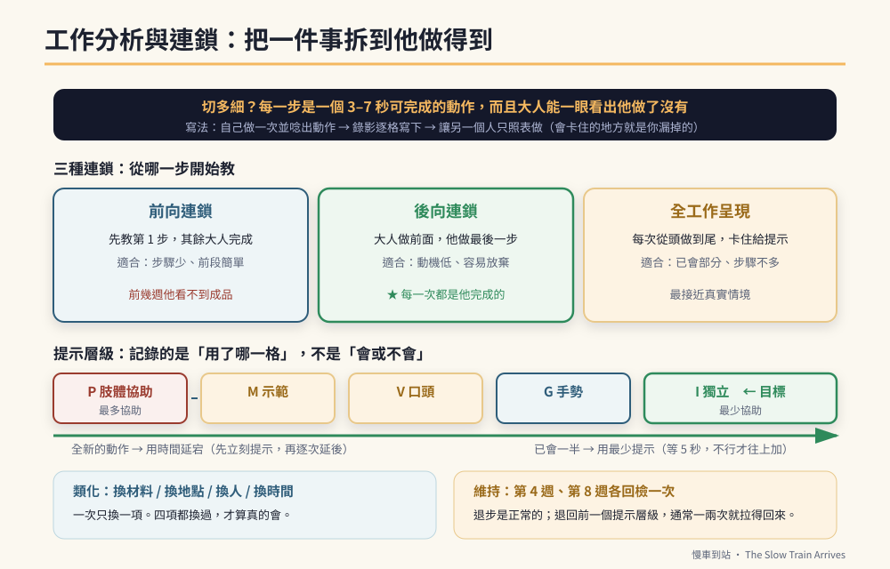

# 第36章　工作分析與連鎖：把一件事拆到他做得到



## 背景與痛點

「他學不會折衣服。」

這句話在特教現場出現時，有九成的情況真正的意思是：**「折衣服」對他來說不是一件事，是十一件事，而我們一直把它當成一件事在教。**

這一章補的是本書前面最大的技術缺口。第 9 章的十六級階梯處理的是「一次記得住幾件事」（工作記憶）；但一個**多步驟技能**（折衣服、洗碗、包裝代工、泡麵、刷牙）要怎麼教，前面沒有講。

而那正是特教與職能訓練最核心的方法：**工作分析**（Task Analysis, TA）與**連鎖**（Chaining）。

小作所與庇護工場的每一份 SOP 圖卡，背後都是一份工作分析。你在第 13 章做的三格檢核卡，是它的簡化版。這一章給的是完整版。

---

## 核心設計

### 一、工作分析：把技能切成他做得到的步驟

工作分析就是把一個技能，拆成一連串**可觀察、可獨立完成、順序固定**的小步驟。

**切多細？** 有一個實用的判準：

> **每一步應該是一個 3–7 秒可以完成的動作，而且大人能一眼看出他做了沒有。**

太粗（「把衣服折好」）→ 他卡住時你不知道卡在哪。
太細（「右手拇指移動兩公分」）→ 步驟表變成三十行，沒有人用得起來。

**怎麼寫？** 不要憑空想，用這三步：

```text
【寫一份工作分析的三個步驟】
  ① 自己做一次，一邊做一邊唸出每個動作
  ② 用手機錄影，回放時暫停，逐格寫下來
  ③ 讓另一個人「只照著你的表做」，看他會不會卡住
     → 會卡住的地方，就是你漏掉的步驟

★ 第 ③ 步最容易被跳過，也最有價值。
  你以為的「理所當然」，對他從來不是理所當然。
```

### 二、三種連鎖：從哪一步開始教

有了步驟表之後，教學有三種順序，各有適用時機。

| 方式 | 怎麼做 | 適合什麼情況 | 心理效果 |
|------|--------|-------------|---------|
| **前向連鎖**（Forward） | 先教第 1 步，做完由大人完成其餘；第 1 步穩了再加第 2 步 | 步驟少、前面的步驟比較簡單 | 一開始就有參與感 |
| **後向連鎖**（Backward） | 大人做完前面全部，**只讓他做最後一步**；穩了再往前加一步 | 學習動機低、容易半途放棄、需要成就感 | **每一次都是他完成的** |
| **全工作呈現**（Total Task） | 每次都從頭做到尾，卡住的步驟給提示 | 已有部分步驟會做、步驟不多 | 最接近真實情境 |

> 🔍 **後向連鎖為什麼常常是最好的選擇**
> 因為它讓「完成」這件事，永遠掛在他手上。
> 一個孩子折衣服，前面十步是媽媽折的，最後那一下由他壓平——衣服折好了，是他折的。他看到了成品，得到了完成的感覺。
> 反過來，前向連鎖的前幾週，他做完第一步之後就被接手，**他從來沒看過成品**。
> 對於學習挫折累積很多、或動機偏低的孩子，**後向連鎖經常是唯一推得動的方式。**

### 三、最少提示法與時間延宕

第 9 章講過提示層級（肢體 → 示範 → 口頭 → 手勢 → 視覺 → 無提示）。在工作分析裡，它有兩種標準用法：

**（一）最少提示法（Least-to-Most）**

```text
每一步，都從最少的提示開始，不行才往上加：
  等 5 秒 → 沒動作 → 手勢提示 → 等 5 秒 → 沒動作 → 口頭提示
  → 等 5 秒 → 沒動作 → 示範 → 沒動作 → 肢體協助

★ 適合：已經會一部分、需要練獨立的技能
★ 缺點：中間會出現較多錯誤與等待
```

**（二）時間延宕法（Time Delay）**

```text
一開始每一步都立刻給提示（0 秒延宕），做對就增強；
熟悉之後，把提示往後延：
  第 1–3 次：立刻提示
  第 4–6 次：等 2 秒再提示
  第 7–9 次：等 4 秒再提示
  之後：等 5 秒

★ 適合：全新的技能、容易因為錯誤而挫折的孩子
★ 優點：錯誤少、學習曲線平順
★ 這是教「動作型技能」最常用的一種方式
```

**選哪一種？** 一個實用的原則：**全新的動作用時間延宕，已經會一半的用最少提示。**

### 四、資料怎麼記

工作分析的資料記錄，記的不是「會／不會」，而是**每一步用到的提示層級**。

```text
【工作分析資料表　技能：折毛巾】
步驟                          3/02  3/03  3/04  3/05  3/06
1 拿起毛巾放在桌上             I     I     I     I     I
2 攤平（四角展開）             G     G     I     I     I
3 左邊對齊右邊                 V     G     G     G     I
4 壓平中線                     M     V     G     G     G
5 下緣對齊上緣                 P     M     V     V     G
6 壓平                         P     P     M     V     V
7 放進籃子                     I     I     I     I     I
獨立完成步數                   2     2     3     3     4

代號：I 獨立　G 手勢　V 口頭　M 示範　P 肢體協助
```

**這張表的價值：** 你會看到「進步」長什麼樣子——**不是從不會變成會，而是提示從 P 一格一格降到 I**。這種進步在「會／不會」的記錄方式下是完全看不見的，而看不見的進步，家長撐不了三個月。

### 五、類化與維持：別讓它只在那條毛巾上成立

一個技能練到獨立之後，還有兩件事沒完成。這是特教實務裡最常被忽略、卻決定成敗的一段。

```text
【類化（Generalization）：換了條件還會嗎】
  換材料：換一條不同大小、材質、顏色的毛巾
  換地點：從餐桌換到洗衣間、換到學校
  換人：從媽媽在旁換成爸爸、換成老師
  換時間：從晚上七點換成早上
  ★ 一次只換一項。四項都換過，才算真的會。

【維持（Maintenance）：兩個月後還會嗎】
  技能達到獨立之後，不要立刻停止。
  改成每週檢查一次，連續四週；再改成每月一次。
  ★ 退步是正常的。發現退步就回到前一個提示層級，
    通常一兩次就能拉回來。
```

> 💡 **一個很值得知道的策略：多重範例訓練**
> 不要等到練到完美才開始類化。**從第一天就用兩三種不同的毛巾、在兩個不同的地方教**——這叫多重範例訓練，它能大幅提高類化的成功率。
> 代價是初期學得比較慢；回報是他學會的是「折毛巾」，而不是「折那條藍色的毛巾」。

---

## 實作：四份現成的工作分析

拿去直接用，或當成你自己寫的範本。

### TA-1　折毛巾（家事／代工基礎）

```text
1 拿起毛巾放在桌上
2 攤平，四角展開
3 左邊對齊右邊
4 壓平中線
5 下緣對齊上緣
6 壓平
7 放進籃子（同一方向）
建議：後向連鎖（從第 7 步開始）
```

### TA-2　裝袋代工（小作所最常見的作業）

```text
1 從左邊料盒拿一個袋子
2 袋口撐開
3 從右邊料盒拿 __ 個物件（數量固定）
4 放進袋子
5 壓出空氣
6 對折袋口
7 貼上封口貼紙（對齊邊緣）
8 放進成品籃（同一方向排列）
9 每完成 10 個，按一下計數器
建議：全工作呈現 + 時間延宕；第 3 步的數量從 1 個起步
對接：第 16 章的產量與良率、第 31 章的撕貼動作
```

### TA-3　洗自己的碗

```text
1 把碗端到水槽
2 倒掉剩菜
3 開水（先冷後溫）
4 擠洗碗精在菜瓜布上（壓 1 下）
5 內側刷一圈
6 外側刷一圈
7 沖水，直到不滑
8 放進瀝水架（開口朝下）
9 關水
10 擦手
建議：後向連鎖；第 3、9 步（開關水）優先教，因為它涉及安全
```

### TA-4　自己泡一杯飲品（生活自理 + 安全）

```text
1 拿出杯子
2 拿出茶包／沖泡包
3 撕開包裝，倒進杯子
4 拿保溫壺（★ 熱水安全：先確認壺蓋鎖好）
5 倒水到杯身的線（杯子上貼一條膠帶當水位線）
6 放回保溫壺
7 攪拌 5 圈
8 等計時器響（3 分鐘）才拿起來喝
9 用完把杯子放到水槽
建議：前向連鎖；第 4–5 步務必先在冷水下練熟再換熱水
★ 第 5 步的「膠帶水位線」是這份 TA 的關鍵：
  把一個抽象判斷（倒多少）換成一個視覺標記。
```

**注意第 8 步。** 它把第 26 章的等待耐受（M10）內建進了一個真實技能裡——**這才是這些工具最好的用法：不是額外的練習，是嵌在生活裡。**

---

## 現場踩雷

**踩雷一：步驟太大。**
「洗碗」寫成三步（拿碗、洗、放好），他每次都卡在同一個地方，而你不知道是哪一個地方。

**踩雷二：每次的提示層級不一致。**
今天媽媽用手把手，明天爸爸只用口頭——資料就廢了，孩子也會混亂。**兩個人要先對好用哪一套（最少提示 or 時間延宕）。**

**踩雷三：只記「會／不會」。**
這樣記，前三個月的紀錄全部是「不會」，然後你會放棄。**記提示層級，你才看得到進步。**

**踩雷四：練到獨立就結束。**
沒有類化 = 只會在那條毛巾上；沒有維持 = 兩個月後歸零。

**踩雷五：全部用前向連鎖。**
對動機低、容易放棄的孩子，前向連鎖的前幾週是純粹的挫折累積。**後向連鎖經常是那個「終於推得動」的差別。**

**踩雷六：選了一個他其實不需要的技能。**
教一個技能之前先問：**這件事對他二十五歲的生活有沒有用？** 若沒有，那個時間應該花在別的地方（第 6 章的功能性認知）。

**踩雷七：安全步驟混在一般步驟裡教。**
熱水、刀具、電器、瓦斯——這些步驟要**單獨先教到穩**，再放回完整流程。安全步驟不適用「允許錯誤學習」。

---

## 效益與驗收（DoD）

| 項目 | 驗收標準 |
|------|---------|
| 有 TA | 目標技能已寫成工作分析，每步 3–7 秒且可觀察 |
| 通過旁人測試 | 另一個人只照表做，能完成且不卡住 |
| 連鎖方式已選 | 明確選定前向／後向／全工作，並寫下理由 |
| 提示法一致 | 兩位教學者使用同一套提示法，抽查 3 次一致 |
| 資料可讀 | 記錄的是每步的提示層級，且能看出提示逐步下降 |
| 獨立步數上升 | 四週內獨立完成步數增加 ≥ 2 步（或已全部獨立） |
| 已類化 | 材料、地點、人、時間至少各換過一項並仍成立 |
| 已維持 | 達獨立後，第 4 週與第 8 週各檢查一次仍成立 |
| 安全步驟 | 涉及熱水／刀具／電器的步驟已單獨教到穩定 |

> 💡 君之一席話
> 「『他學不會』這句話，十次有九次的意思是『我沒有把它切開』。**一件他做不到的事，拆成七件他做得到的事——這不是降低標準，這就是教學本身。**」
