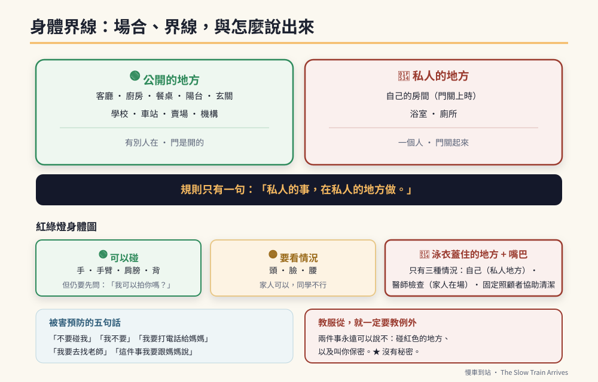

# 第38章　青春期與身體界線：最該教、也最常被迴避的一課



## 背景與痛點

這一章在特教現場有一個共同的處境：**每個人都知道要教，每個人都希望是別人來教。**

家長覺得學校應該教，學校覺得那是家庭的事，治療師說這超出我的範圍。而在所有人互相等待的期間，事情已經在發生了——只是沒有人談。

必須先說清楚三件事，否則這一章讀不下去。

**第一，青春期的身體發展不會因為認知落後而延後。** 他的荷爾蒙、體型、性衝動，都會按照生理時鐘走。認知落後影響的是**理解與判斷**，不是發育。

**第二，迴避不教的代價，全部由孩子承擔。** 沒有教過場合概念的孩子，會在客廳、在教室、在公車上做出私人的行為——然後被當成問題行為處理、被通報、被貼上標籤。**他不是不懂規矩，是從來沒有人告訴他規矩是什麼。**

**第三，這個族群是性侵害的高風險群。** 原因很具體：溝通表達受限（說不出發生了什麼）、社會判斷力弱（分不出善意與惡意）、被訓練成聽話（習慣服從指令）、以及照顧者眾多（生活中有大量的身體接觸是被允許的）。**一個從來沒學過「哪些觸碰不可以」的孩子，沒有任何防線。**

這一章不談道德，只談三件事：**場合、界線、與怎麼說出來。**

---

## 核心設計：三個層次

| 層次 | 教什麼 | 核心問句 |
|------|--------|---------|
| **① 我的身體** | 身體是我的；哪些部位是私人的；私人的事在私人的地方做 | 「這件事可以在哪裡做？」 |
| **② 別人的身體** | 別人的身體不是我的；碰之前要問；被拒絕要停 | 「他說可以嗎？」 |
| **③ 場合** | 同一件事，在不同地方是不同的結果 | 「這裡是公開的還是私人的？」 |

**第 ③ 層是這三層裡最實用、也最容易教會的一層。** 因為它不需要抽象的道德理解，只需要視覺化的分類——而那正是他擅長的（第 8 章）。

### 一、把「私人」變成看得見的東西

抽象的「隱私」他學不會。但**「哪個房間」他學得會**。

```text
【家裡的場合圖】（做成一張圖，貼在他看得到的地方）

  🟢 公開的地方（有別人在、門是開的）
     客廳 · 廚房 · 餐桌 · 陽台 · 玄關

  🔴 私人的地方（一個人、門關起來）
     自己的房間（門關上時）· 浴室 · 廁所

  【規則，只有一句】
    「私人的事，在私人的地方做。」
```

同一套圖要延伸到外面：**學校、車站、賣場、機構——全部是綠色。**

### 二、紅綠燈身體圖

```text
【身體的三種區域】（用一張人形圖，塗上顏色）

  🟢 綠色（可以碰）：手、手臂、肩膀、背
     → 但仍然要先問：「我可以拍你的肩膀嗎？」

  🟡 黃色（要看情況）：頭、臉、腰
     → 家人可以，同學不行；醫師檢查時可以

  🔴 紅色（泳衣蓋住的地方 + 嘴巴）
     → 只有三種情況：
        ① 自己（在私人的地方）
        ② 醫師檢查（而且要有家人在場）
        ③ 需要協助清潔時，由固定的照顧者

★ 「泳衣蓋住的地方」是這個領域公認最好用的一個說法：
  它具體、可視覺化，而且不需要解剖學名詞。
```

---

## 實作

### 一、自慰行為：導向，不是禁止

這是最常被處理錯誤的一件事，而錯誤的處理會造成長期後果。

```text
【要先建立的認知】
  · 自慰是青春期正常的發展行為，不是問題行為，不是道德問題
  · 需要教的**不是不可以**，而是**在哪裡可以、怎麼做才安全**
  · 用羞辱、處罰、恐嚇處理，會造成三種後果：
      ① 行為轉入更隱密但更不安全的場合
      ② 他學到「我的身體是壞的」
      ③ 未來遭遇侵害時，他更不敢說

【正確的處理：三步驟】

  第一步　當場，最少語言、不責備
    平靜地說一句固定的話，然後帶他移動：
      「這是私人的事。我們去房間，把門關起來。」
    ★ 不要驚呼、不要在其他人面前處理、不要事後開檢討會。

  第二步　事後（在他平靜時），教場合
    拿出場合圖：
      「這件事，在這裡（指紅色區域）可以。
       在這裡（指綠色區域）不可以。」
    重複幾次，就像教任何一個場合規則一樣。

  第三步　教衛生與安全
    · 之後要洗手
    · 不要用會受傷的方式（若已出現，需請教醫師或治療師）
    · 不在別人面前、不對著別人

【什麼情況要尋求專業協助】
  □ 出現自傷或造成身體損傷的方式
  □ 頻率高到影響日常作息與學習
  □ 在被明確教過場合之後，仍持續在公開場合發生
  □ 伴隨明顯的焦慮、強迫特質
  → 請諮詢兒童青少年精神科、復健科或行為治療專業。
     這時候要做的是第 35 章的功能評估——
     有些看起來像性行為的動作，功能其實是**感官調節或焦慮緩解**，
     那需要完全不同的處理方式。
```

### 二、被害預防：五句話，和三個可以說的人

```text
【五句話】（練到不用想，就像第 8 章的求助台詞）

  1.「不要碰我。」
  2.「我不要。」
  3.「我要打電話給媽媽。」
  4.「我要去找老師。」
  5.「這件事我要跟媽媽說。」

【三個可以說的人】（寫在卡片上，放書包）
  ① ______（家長）　電話 ______
  ② ______（老師／就服員）　電話 ______
  ③ ______（另一位信任的成人）　電話 ______

【三條規則，用他聽得懂的話】

  規則一：紅色的地方，只有醫師檢查的時候可以看、可以碰，
         而且**媽媽（或爸爸）要在旁邊**。

  規則二：**沒有秘密。**
         如果有人叫你「不要跟媽媽說」，那你一定要跟媽媽說。
         ★ 這一條最重要。加害者最常用的手法就是要求保密，
           而一個被教「要聽話」的孩子非常容易照做。

  規則三：任何人叫你做你不想做的事，你可以說「我不要」。
         **就算他是大人、老師、醫生、或你認識的人。**
```

> ⚠️ **關於規則三，必須說的一段話**
> 這條規則會與我們平常教的「要聽話、要配合、要當小幫手」直接衝突。而那個衝突是真的，不能假裝不存在。
> 處理方式是**明確地畫出例外**：「聽話是對的，但是有兩件事你永遠可以說不——碰你紅色的地方，和叫你保密。」
> 一個從小被訓練成完全服從的孩子，是最沒有防線的。**教他服從的同時，必須教他這個例外。**

### 三、加害預防：他也可能是越界的那一方

這一段同樣重要，而且更常被忽略。

一個熱情、社交動機強、缺乏界線概念的青少年，很容易做出被誤解為騷擾的行為：擁抱不熟的人、摸別人的頭髮、盯著看、反覆靠近同一個人、跟著人走。

**他沒有惡意——但後果不會因此不同。**

```text
【要教的三件事】

  ① 碰之前要問
     固定腳本：「我可以拍你的肩膀嗎？」
     → 對方說可以才碰；對方沒有回答 = 不可以。

  ② 被拒絕要停，而且不生氣
     腳本：「好，那我不碰。」
     → 這需要練習，因為它同時是 C1 的訓練（第 8 章）。

  ③ 距離
     用一個具體的量：「一隻手臂那麼遠。」
     練法：實際伸手比，站到剛好碰不到的位置。

【要特別留意的高風險情境】
  □ 對某位同學／同事表現出過度的關注（每天找、一直看、跟著走）
  □ 用他的固著主題強迫別人聽（第 10 章的邊界問題在這裡會放大）
  □ 誤解友善為特殊關係
  → 這些都要早期介入，用第 31 章的社交自控腳本處理，
    而不是等到有人正式反映。
```

### 四、生理自理：用工作分析教（接第 36 章）

```text
【TA-5　男性青春期的日常清潔】
  1 洗澡時，用清水清潔私處（不用刺激性肥皂）
  2 內褲每天換
  3 換下的內褲放進洗衣籃（不放地上、不藏起來）
  4 有污漬的內褲直接放洗衣籃 —— ★ 這件事要明講
  5 洗完澡把浴室的東西歸位

【夢遺 / 遺精的正常化】（在它發生之前就要說）
  「這是長大的正常現象，每個男生都會。
   床單濕了不是你的錯，也不是尿床。
   把內褲和床單放進洗衣籃就好，可以告訴媽媽，
   也可以不說。」
  ★ 事前說過一次，可以省下事後的恐慌與羞恥。

【若為女性：月經照顧】
  這是一份完整的工作分析（更換、包裝、丟棄、清潔、記錄週期），
  需要同性別照顧者實地教學，並依認知程度決定支持等級。
  ★ 用第 36 章的方法拆步驟；週期記錄可用第 26 章的視覺月曆。
  ★ 經痛、經前情緒變化與癲癇的關係（部分女性在月經前後
    發作閾值會改變），**應主動向主治醫師提出**。
```

### 五、就醫時的身體檢查：事前減敏

```text
【就醫前的三步驟】
  ① 預告（第 8 章）：「醫生要看你的肚子，媽媽會在旁邊。」
  ② 演練：在家用同樣的姿勢躺一次，讓他知道會發生什麼
  ③ 現場：家長在場；每一個動作前請醫護說一句
     「我現在要摸你的肚子，可以嗎？」

★ 第 ③ 點也在教他一件事：**即使是醫師，也要先問。**
  這與規則一、規則三是一致的，不會互相矛盾。
```

### 六、手機與網路

```text
【三條規則】
  ① 不加不認識的人
  ② 不傳自己的照片給別人（尤其是沒有穿衣服的）
  ③ 有人跟你要照片、跟你說「不要告訴別人」→ 立刻給爸媽看

【家長端】
  · 定期一起看他的手機（用「我們一起看」而不是「我要檢查」）
  · 開啟裝置的家長監護功能
  · 一起約定使用時段（用第 8 章的計時器）

★ 這一段的重點與規則二完全一樣：**沒有秘密。**
```

---

## 誰來教，以及怎麼開始

```text
【原則】
  · 同性別的照顧者優先教身體自理
  · 家庭與學校要用同一套說法（把場合圖與五句話影印給老師）
  · 一次教一件事，用他熟悉的方式：視覺圖、固定腳本、重複

【第一週只做兩件事】
  ① 貼出場合圖（公開／私人）
  ② 練「不要碰我」和「我不要」這兩句

【什麼時候找專業】
  · 學校輔導室、特教老師（多數學校有性別平等教育資源）
  · 心理師、行為治療師
  · 若涉及疑似侵害 → 立即聯繫學校與相關保護專線，
    並保留紀錄。★ 不要先自己查證。
```

---

## 現場踩雷

**踩雷一：迴避不教。**
最常見，也是代價最高的一種。**沒教過的規則，他不會自己長出來。**

**踩雷二：只教「不可以」，不教「可以在哪裡」。**
禁止而沒有出口，行為只會轉到更隱密、更不安全的地方。

**踩雷三：用羞辱或恐嚇處理。**
短期有效，長期造成三個後果（見上）。其中最嚴重的是：**未來他遭遇侵害時，會不敢說。**

**踩雷四：教服從，卻沒教例外。**
「要聽大人的話」＋沒有例外＝沒有防線。

**踩雷五：在公開場合處理。**
當場只做兩件事：最少語言、移動到私人空間。**教學在事後、在平靜時、在私下。**

**踩雷六：假設他不會有性需求。**
「他心智像小孩」——心智年齡不影響生理發育。這個假設會讓所有預備都不會發生。

**踩雷七：只做被害預防，不做加害預防。**
兩邊都要。而且加害預防往往更早需要——因為熱情越界比被侵害更早出現。

---

## 效益與驗收（DoD）

| 項目 | 驗收標準 |
|------|---------|
| 場合圖 | 公開／私人場合圖已張貼，孩子能正確指認 ≥ 80% |
| 身體圖 | 紅綠燈身體圖已教過，能指出「紅色的地方」 |
| 五句話 | 五句話中至少 3 句能在角色扮演中說出 |
| 三個人 | 卡片已製作並放在書包／皮夾；他能說出至少 2 個名字 |
| 沒有秘密 | 「有人叫你保密就要告訴媽媽」已教過並演練 ≥ 3 次 |
| 例外已建立 | 他知道「聽話」有兩個例外（紅色區域、保密要求） |
| 加害預防 | 「我可以碰你嗎」與「一隻手臂的距離」已練習 |
| 生理自理 | 清潔流程已寫成工作分析並在執行；換洗規則已明講 |
| 就醫預備 | 最近一次身體檢查有做預告與演練 |
| 學校同步 | 場合圖與五句話已提供給導師或特教老師 |
| 網路 | 三條網路規則已約定；家長監護已設定 |

> 💡 君之一席話
> 「我們花十六年教他聽話、配合、當個小幫手——**然後在他最需要說『不』的那一刻，他手上沒有那個字。** 這一章要補的，就是把那個字放回他手裡，而且要在需要用到之前。」
