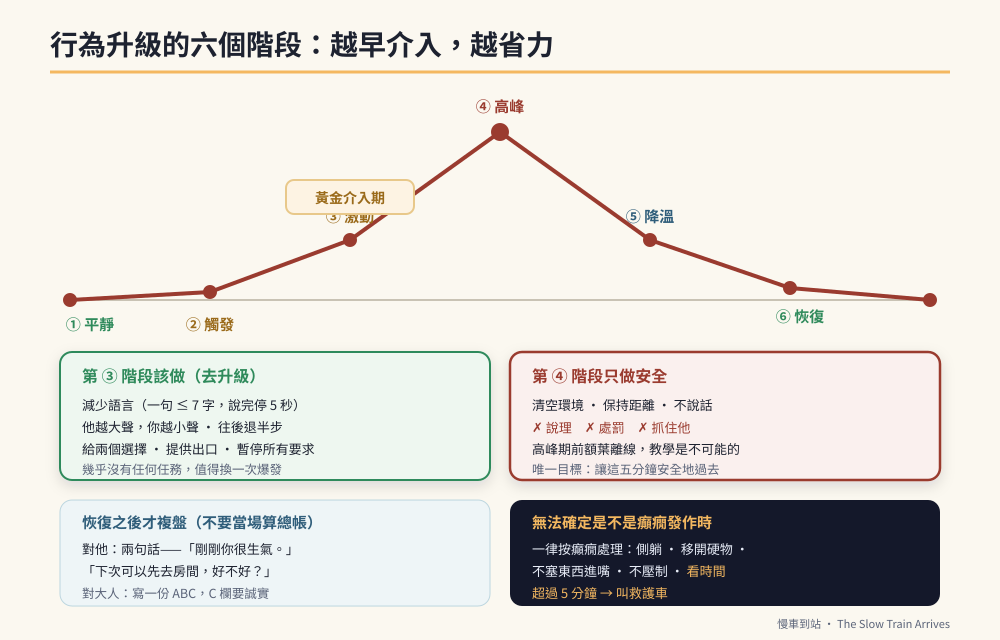

# 第39章　危機處理：當「勉強可控」失守的那一天



## 背景與痛點

這整本書建立在一個前提上：**他會生氣，但勉強控制得住。**

那是這個孩子最珍貴的資產之一，也是所有訓練得以進行的基礎。但它不是保證。

累積的疲勞、環境的劇變、身體的不適、一次沒有預告的改變、或只是青春期荷爾蒙的一個壞日子——**總會有一天，那個「勉強」失守。**

而那一天會發生什麼，取決於一件事：**家裡的大人有沒有事先想過。**

沒有想過的人，會在現場做出三件事：提高音量、講道理、抓住他。這三件事全部都會讓情況升級。

這一章要做的，是給你一份在那一刻能用的東西。它不需要你臨場冷靜——它只需要你**事先讀過一次**。

> ⚠️ **醫療免責**
> 本章討論的是**行為危機**的預防與處理。它不能取代任何醫療處置。
> 若出現疑似癲癇發作、意識改變、抽搐、或任何無法確定是否為醫療事件的狀況，**一律先按醫療處理**（見本章第五節與第 3 章紅旗）。任何緊急用藥的使用與劑量，必須事先由主治醫師書面交代，家長不可自行決定。

---

## 核心設計：行為升級的六個階段

行為危機不是一瞬間發生的。它有一條可預測的曲線，而**越早介入，需要的力氣越小**。

| 階段 | 他的樣子 | 大人該做 | **絕對不要做** |
|------|---------|---------|--------------|
| **① 平靜** | 正常狀態 | 預防：作息、預告、地基（第 11 章） | — |
| **② 觸發** | 遇到壓力事件（被打斷、變動、噪音、疲勞） | 移除或降低觸發源；提早給預告 | 忽略、假裝沒事 |
| **③ 激動** | 音量提高、重複同一句、來回走動、坐不住 | **這是黃金介入期**：減少語言、給空間、給選擇 | 講道理、下更多指令 |
| **④ 高峰** | 失控：大吼、摔東西、攻擊、自傷 | **只做安全**：清空環境、保持距離、不說話 | 說理、處罰、抓住他 |
| **⑤ 降溫** | 強度下降、開始喘、安靜下來 | 保持安靜的陪伴；不提剛才的事 | 「你看你剛剛」 |
| **⑥ 恢復** | 回到平靜，可能疲憊或愧疚 | 給水、給休息；**之後**才複盤 | 立刻算總帳 |

> 🔍 **整條曲線最關鍵的一個判斷**
> **在第 ④ 階段（高峰期），教學是不可能的。**
> 前額葉在那個狀態下基本上是離線的。你說的每一句話都不會進去，而任何要求都會延長高峰。
> 所以高峰期的唯一目標是：**讓這幾分鐘安全地過去。** 不是贏，不是糾正，不是讓他認錯——只是安全。

---

## 實作

### 一、預防：把力氣花在第 ①② 階段

危機處理最有效的部分，全部發生在危機之前。

```text
【降低基準壓力】
  □ 睡眠（第 11 章）—— 睡不足的日子，訓練強度自動減半
  □ 身體不適：頭痛、牙痛、便秘、生理期——先排除
  □ 環境：噪音、人多、光線、溫度
  □ 飢餓：長時間空腹（第 4 章）
  □ 預告：所有變動提前說（第 8 章的三層預告）

【建立他的「個人化前兆清單」】★ 這是本章最實用的一件事
  觀察 2–4 週，記下他在爆發前 5–15 分鐘會出現什麼：

  □ 重複同一句話的頻率增加        □ 音量比平常高
  □ 來回走動 / 抖腳 / 坐不住      □ 咬手 / 抓頭髮 / 摳手指
  □ 臉紅、呼吸變快                □ 忽然安靜、眼神不看人
  □ 反覆確認同一件事              □ 開始翻找特定物品
  □ 其他：________________________

★ 這份清單一旦建立，多數危機可以在第 ③ 階段就被攔下來。
  把它影印給老師、就服員、以及會單獨照顧他的親人。
```

### 二、第 ③ 階段：去升級的六個技巧

這是黃金介入期。做對了，曲線會在這裡轉回去。

```text
【1】減少語言
  一句話 ≤ 7 個字，說完停 5 秒。
  ✗「你怎麼又這樣，我剛剛不是說過了嗎，你要冷靜下來」
  ✓「我知道。」（停）「我們去那邊。」

【2】降低音量與語速
  他越大聲，你越小聲。這比提高音量有效得多。

【3】給空間
  往後退半步。不要正面站、不要圍著他、不要擋門。
  站在他的側前方，比正對面壓迫感低。

【4】給選擇（兩個，都可以接受）
  「你要先喝水，還是先去房間？」
  → 選擇會把控制感還給他，而失控感正是升級的燃料。

【5】提供出口，而不是要求
  ✗「你冷靜一點！」（這是要求，而且他做不到）
  ✓「我們去外面走一下。」（這是出口）

【6】暫停所有要求
  這時候的任何指令都會加壓。
  未完成的任務可以晚點回來——**幾乎沒有任何任務值得換一次爆發。**
```

### 三、第 ④ 階段：高峰期只做安全

```text
【三件事，只有三件】
  ① 環境安全：把周圍的硬物、尖銳物、熱的東西移開；
              請其他人（尤其是弟妹）離開現場
  ② 保持距離：站在他伸手碰不到的地方，但看得見他
  ③ 不說話：不下指令、不說理、不喊他名字要求他停

【關於身體約束】★ 必讀
  · 身體約束有明確的受傷與窒息風險，且在法規與機構規範上
    有嚴格限制。
  · **只有在他即將傷害自己或他人、且沒有其他方式時**，
    才由受過訓練的人執行。
  · 家長沒有受過訓練 → 優先做的是「移開環境、拉開距離、
    請求協助」，不是壓制。
  · 若孩子的體型已接近或超過成人，家長更不應嘗試壓制——
    受傷的通常是雙方。

【什麼時候打電話求助】
  □ 他或別人已經受傷、或即將受傷而你無法阻止
  □ 你自己已經無法安全處理
  □ 出現疑似癲癇發作或意識改變 → 見第五節
  → 打給：另一位家人 / 學校 / 119
```

### 四、第 ⑤⑥ 階段：降溫與複盤

```text
【降溫期（他開始安靜）】
  · 保持在附近，但不主動說話
  · 不要問「你為什麼要這樣」
  · 可以遞水、遞毛巾——動作比語言好

【恢復期（回到平靜）】
  · 給休息時間（通常需要 20–60 分鐘）
  · 不要立刻回到原本的任務
  · **不要在這時候算總帳**

【複盤：至少等到當天稍晚，或隔天】
  用兩句話就好，不要開檢討大會：
    「剛剛你很生氣。」（描述，不評價）
    「下次生氣的時候，我們可以先去房間，好不好？」
  → 給一個具體的替代行為，而不是要求「下次不要生氣」。

【大人的複盤（★ 這一段比孩子的複盤重要）】
  當晚或隔天，用 ABC 記錄（第 35 章）把整件事寫下來：
    A 前事：那之前發生了什麼？前兆出現在幾分鐘前？
    B 行為：實際發生了什麼？持續多久？
    C 後果：最後怎麼結束的？他因此得到了什麼？

  ★ C 欄要誠實。如果結局是「所以那件事就不用做了」，
    那你剛剛增強了一次爆發（第 35、37 章）——
    這不是要你自責，是要你知道下一次該怎麼安排。
```

### 五、與癲癇發作的區分

這一節對有癲癇病史的孩子特別重要，而且必須非常明確。

```text
【偏向行為危機的特徵】
  · 有明確的前事（被拒絕、被打斷、環境變動）
  · 過程中有目標導向的行為（去拿特定的東西、避開特定的人）
  · 對環境有反應（你移動，他的視線會跟）
  · 結束後能溝通、記得發生的事

【偏向癲癇發作的特徵】
  · 沒有明顯前事，突然發生
  · 意識改變、叫不回應
  · 刻板、重複、無目的的動作
  · 眼神固定或上吊、口吐白沫、失禁
  · 結束後意識混亂、極度疲倦、完全不記得

【★ 無法確定的時候，一律按癲癇處理】
  · 讓他側躺，移開周圍硬物
  · 不要塞任何東西進嘴巴
  · 不要壓制肢體
  · 看時間（★ 這是最重要的一件事）
  · 超過 5 分鐘，或連續發作之間意識沒有恢復 → 叫救護車
  · 若能安全拍攝，錄影對醫師判讀極有幫助

【事先要備好的】
  · 醫師書面交代的緊急處置流程（若有緊急用藥，含使用時機）
  · 第 4 章的急診卡（皮夾、書包各一張）
  · 學校 / 機構已收到同一份流程
```

### 六、給學校與機構的一頁

```text
【危機處理一頁摘要　—— 影印給導師、特教老師、就服員】

  他的前兆是：______________________________________
  （出現這些時，請提早介入）

  有效的做法：
    · 減少說話，一句話不超過 7 個字
    · 給兩個選擇，不要下指令
    · 讓他去 ______（指定的安靜地點）
    · 拿 ______（他的安撫物 / 主題卡片）給他

  無效或會惡化的做法：
    · 大聲說話、多人圍上來、擋住去路
    · 講道理、要求他道歉、當場處罰

  什麼時候打電話給我：______________________________
  緊急聯絡：______________  醫療處置流程：見附件
```

---

## 現場踩雷

**踩雷一：在高峰期講道理。**
最常見。前額葉離線時，語言是加壓，不是幫助。

**踩雷二：在恢復期算總帳。**
「你看你剛剛做了什麼」——會直接把剛降下來的曲線再推上去，而且他學到的是「冷靜下來會被罵」。

**踩雷三：家長試圖壓制。**
風險高、常造成雙方受傷，而且會破壞信任。**移開環境、拉開距離、請求協助。**

**踩雷四：事後不複盤。**
複盤是唯一能讓下一次變少的動作。而多數家庭在事件結束後只想趕快忘掉。

**踩雷五：讓爆發成功。**
「好啦好啦不用做了」——如果每次爆發都能免除任務，爆發會變成他最有效的溝通方式（第 35 章）。
**正確做法：等他平靜後，回來完成一個**最小版本**的任務**（哪怕只做一步），然後結束。

**踩雷六：沒有事先寫下前兆清單。**
臨場才想，來不及。

**踩雷七：把每一次失控都當成退步。**
在青春期、環境轉換期、身體不適時，失控會變多。**那是狀態，不是能力的倒退**——但如果同時出現「原本會的東西不見了」，那是紅旗，見第 3 章。

---

## 效益與驗收（DoD）

| 項目 | 驗收標準 |
|------|---------|
| 前兆清單 | 觀察 2–4 週後完成，且已影印給學校／機構 |
| 六階段已認知 | 兩位照顧者都知道「高峰期只做安全，不教學」 |
| 去升級技巧 | 最近一次第 ③ 階段時，實際使用了減少語言與給選擇 |
| 安全計畫 | 已寫下「哪裡是安全地點、誰來支援、什麼時候打電話」 |
| 未使用壓制 | 最近三個月未由未受訓者執行身體約束 |
| 醫療區分 | 兩位照顧者都能說出行為危機與癲癇發作的區分要點 |
| 緊急流程 | 醫師書面的緊急處置流程已備妥，學校／機構各有一份 |
| 複盤 | 最近一次事件後有完成 ABC 記錄，含誠實的 C 欄 |
| 一頁摘要 | 危機處理一頁已交給導師或就服員 |

> 💡 君之一席話
> 「那一刻你唯一的工作，不是讓他認錯，也不是把事情做完——**是讓接下來這五分鐘安全地過去。** 而你能為那五分鐘做的準備，全部都在前面那幾天。」
