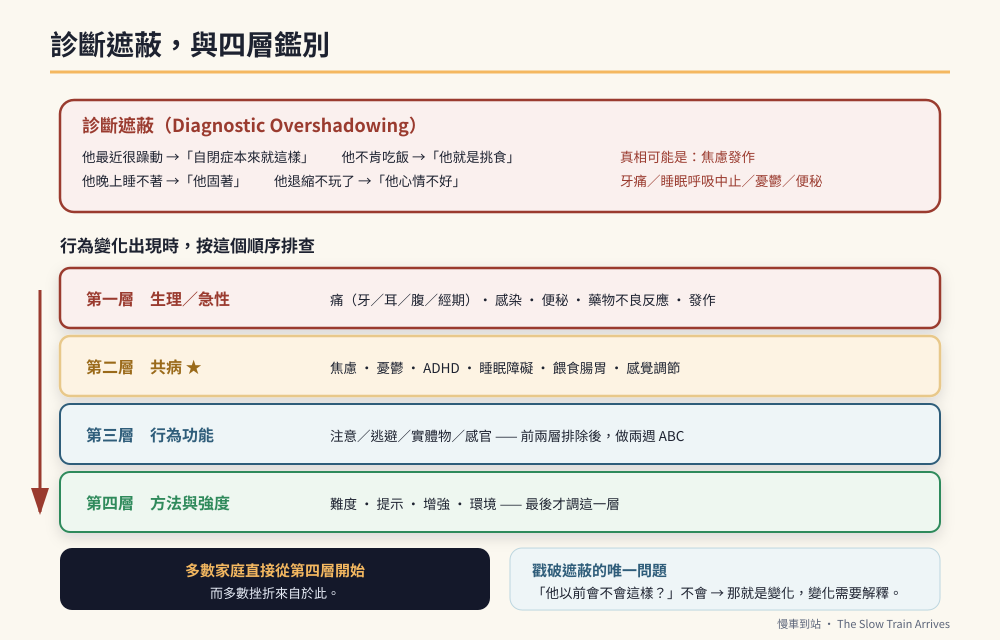

# 第八篇　更複雜的情況：不在主線上的那些家庭

# 第46章　共病：當「怎麼做都沒用」有第二個原因



## 背景與痛點

第 35 章說過：「所有方法都試過就是沒用」，通常代表**行為功能判斷錯了**。

那句話是對的，但它不完整。因為還有第三種可能，而且它在實務上非常常見：

> **他身上有第二個問題，而那個問題從來沒有被診斷。**

一個十六歲的孩子，如果同時有未被辨識的焦慮症、注意力缺損、憂鬱、或睡眠呼吸中止，那麼你在第 35 章做的功能評估會得到一堆互相矛盾的資料——因為每一天的他，其實不是同一個大腦狀態。

而這件事有一個專有名稱，它是本章最重要的一個詞：

### 診斷遮蔽（Diagnostic Overshadowing）

**一旦一個人有了智能障礙或自閉症的診斷，他往後的每一個症狀，都容易被歸因到那個診斷上。**

- 他最近很躁動 → 「自閉症本來就這樣」
- 他不肯吃飯 → 「他就是挑食」
- 他晚上睡不著 → 「他固著」
- 他退縮、不玩了 → 「他心情不好」
- 他一直摸肚子 → 「刻板行為」

而真相可能是：焦慮發作、牙痛、睡眠呼吸中止、憂鬱、便秘。

**診斷遮蔽是這個族群健康照護裡最大的系統性風險**，因為它讓可治療的問題長年不被治療。而最容易被遮蔽的，正好是最痛苦的那幾種：疼痛、焦慮、憂鬱。

> ⚠️ **醫療免責**
> 本章列出的是**就醫時該提出的觀察**，不是診斷準則，更不是自我診斷工具。共病的診斷需要精神科／小兒神經科／復健科等專業評估；此族群的診斷本身就困難（表達受限、症狀非典型），更不可能靠一份清單完成。
> 任何用藥的開始、調整或停止，一律由醫師決定。**特別提醒：這個族群常見多重用藥，任何新增藥物都應與現有用藥一併評估交互作用。**

---

## 核心設計：四層鑑別

行為變化出現時，按這個順序排查。第 11 章的五塊地基是第一層，這一章把第二層補上。

```text
第一層　生理／急性
  痛（牙、耳、腹、經期）· 感染 · 便秘 · 藥物不良反應 · 發作
  → 最先排除，因為最快、最可逆、代價最大（第 11、44 章）

第二層　共病 ★ 本章
  焦慮 · 憂鬱 · ADHD · 睡眠障礙 · 餵食與腸胃 · 感覺調節（第 47 章）
  → 需要專業評估，時間尺度以「數週到數月的改變」為線索

第三層　行為功能
  注意／逃避／實體物／感官（第 35 章）
  → 前兩層排除後，做兩週 ABC

第四層　方法與強度
  難度、提示、增強、環境（第 36、37 章）
  → 最後才調這一層
```

**多數家庭直接從第四層開始，而多數挫折來自於此。**

---

## 六類共病：在這個族群長什麼樣

關鍵不在於認識這些診斷，而在於認識它們在**表達受限的人身上**的樣子——那與教科書上的描述經常不同。

### 一、焦慮

| 一般人的樣子 | 在這個族群的樣子 |
|---|---|
| 說「我很緊張」 | **固著行為暴增**、反覆確認、拒絕出門 |
| 擔憂、反芻思考 | 睡不著、易怒、攻擊或自傷增加 |
| 迴避特定情境 | 對「改變」的耐受度突然下降 |
| 心悸、手抖 | 腹痛、頻尿、想吐（身體化） |

**最關鍵的線索：** 固著與反覆確認**忽然變多**，而環境沒有明顯變化。第 42 章情境 15（校外教學前反覆問十七次）就是焦慮的典型表現——而它非常容易被讀成「他很番」。

### 二、憂鬱

這一項最容易被遮蔽，因為在認知障礙者身上，憂鬱**不長成悲傷的樣子**。

```text
【該注意的訊號】
  □ 原本喜歡的事物失去興趣（★ 最重要的一條）
    —— 他不想聊火車了、不想去車站了
  □ 技能退化：原本會做的事變得不會、不肯做
  □ 易怒、攻擊行為增加（憂鬱在此族群常表現為易怒）
  □ 食慾與體重改變
  □ 睡眠改變（早醒或睡不飽）
  □ 動作變慢、表情變少、社交退縮
  □ 新出現的自傷

★ 「他不想講火車了」在這本書的脈絡裡是一個大紅旗——
  那是動機引擎熄火，而不是固著改善。
```

**常見的觸發事件：** 畢業、換機構、換就服員、失去某位重要的人、失去某個角色（第 45 章情境 47）。

### 三、注意力缺損／過動（ADHD）

在此族群相當常見，但常被歸入「他就是智能障礙」。

```text
【與智能障礙本身的區分線索】
  · 注意力問題與難度不成比例
    —— 連他很有興趣、很簡單的事也撐不到 5 分鐘
  · 衝動：話說完之前就衝出去、危險行為
  · 坐不住的程度在**所有情境**都一樣（不只是難的任務）
  · 家族史

【為什麼值得辨識】
  ADHD 是**可處置**的（行為介入＋必要時藥物）。
  未辨識的 ADHD 會讓第 9 章的工作記憶訓練、
  第 16 章的抗干擾訓練事倍功半——
  你以為在練耐受，其實在練一個沒有煞車的引擎。
```

### 四、睡眠障礙

第 11 章講了睡眠衛生，這裡講的是**需要醫療處置的那一類**。

```text
【要主動告訴醫師的】
  □ 打鼾嚴重、睡眠中呼吸停頓、白天嗜睡
    → 可能是睡眠呼吸中止（在低張力、肥胖、扁桃腺肥大者更常見）
  □ 睡眠中反覆抽動、異常姿勢、大量流口水
    → ★ 可能是夜間發作，不是睡不好
  □ 睡眠時相明顯延後（怎麼調都是凌晨才睡著）
  □ 睡眠品質差且已排除環境因素

【為什麼重要】
  睡眠呼吸中止會直接造成白天嗜睡、注意力差、易怒——
  而這三項會被完整地誤讀成「行為問題」或「退步」。
```

### 五、餵食與腸胃

```text
□ 極度挑食（食物種類 < 20 種、拒絕整類質地）
  → 常與感覺調節有關（第 47 章），也可能是吞嚥或胃食道逆流
□ 異食（吃非食物的東西）→ 需要評估，含缺鐵等生理因素
□ 反覆嘔吐、進食後不適、夜間咳嗽 → 胃食道逆流
□ 便秘（第 11、44 章）
□ 體重過重或過輕

★ 進食問題在這個族群常被當成「習慣」，
  但它經常有生理基礎，而且會直接影響營養與用藥吸收。
```

### 六、感覺調節

單獨在第 47 章處理。

---

## 實作

### 一、共病篩檢清單（家長版）

**這不是診斷工具，是就醫時的提問清單。** 勾到任何一項，就在下次回診時提出。

```text
【變化的時間尺度是關鍵】
  幾小時到幾天的變化 → 先想第一層（痛、感染、發作）
  數週到數月的變化   → 想第二層（共病）
  以年為單位的緩慢變化 → 想發展、老化或環境（附錄E）

【焦慮】
  □ 固著或反覆確認忽然變多，但環境沒變
  □ 對改變的耐受度明顯下降
  □ 新出現的拒絕出門、拒絕某個場所
  □ 反覆腹痛／頻尿／想吐，檢查無異常

【憂鬱】
  □ 對原本最喜歡的事失去興趣 ★
  □ 技能退化（同時請對照第 3 章紅旗：這也可能是神經事件）
  □ 易怒、攻擊或自傷增加
  □ 食慾、體重、睡眠改變
  □ 近期有失落事件（畢業、換機構、失去重要的人）

【ADHD】
  □ 連他有興趣的事也撐不到 5 分鐘
  □ 衝動行為（衝出去、搶東西、危險動作）
  □ 所有情境都坐不住，不分難易

【睡眠】
  □ 打鼾嚴重／呼吸停頓／白天嗜睡
  □ 睡眠中反覆抽動或異常姿勢 ★
  □ 怎麼調都是凌晨才睡著

【餵食與腸胃】
  □ 食物種類極少、拒絕整類質地
  □ 反覆嘔吐、進食後不適、夜間咳嗽
  □ 吃非食物的東西
  □ 排便異常（第 11 章）
```

### 二、回診時怎麼說

共病評估最大的障礙是**時間**與**表達**。用這個結構，三十秒講完重點：

```text
【三句話結構】
  1. 什麼變了：「他這兩個月，原本每天講火車，現在完全不講了。」
  2. 時間尺度：「大概從換機構之後開始，兩個月，沒有好轉。」
  3. 已排除什麼：「牙齒看過了、排便正常、睡眠時間沒變、
                  藥沒有調整過。」

  → 然後直接問：「這樣需不需要評估情緒方面的問題？」

★ 第 3 句是關鍵。它讓醫師知道你已經排除了第一層，
  對話可以直接從第二層開始。
```

### 三、如果醫師說「他就是這樣」

這句話會遇到，而它通常不是敷衍，是**診斷遮蔽的日常版本**。

```text
【有效的回應方式】
  不要爭辯診斷，改成描述「變化」：
    「我知道他本來就有這些特質。
     但這件事是這兩個月才出現的，而且和他以前不一樣。
     以前他不會這樣。」

  → 「變化」比「症狀」有說服力，因為變化排除了「他本來就這樣」。

【還可以做的】
  · 帶影片（行為的前後對比）
  · 帶紀錄（第 1 章的三個指標、ABC）
  · 請學校或機構寫一段觀察（第三方的描述份量不同）
  · 詢問轉介：這個族群的情緒與行為評估，
    部分醫院有身心障礙者的專門門診或團隊
```

### 四、用藥的四個提醒

```text
① 這個族群常見多重用藥。新增任何藥物前，
   請醫師一併檢視現有用藥的交互作用。

② 部分精神科用藥可能影響癲癇發作閾值——
   有癲癇病史者，這件事必須主動提出。

③ 行為介入與藥物不是二選一。
   多數情況下，藥物處理的是「讓他能學」的狀態，
   而學什麼仍然要靠第 36、37 章。

④ 開始新藥後，用第 1 章的三個指標記錄兩週。
   ★ 你是唯一能提供「用藥後行為變化」資料的人。
```

---

## 現場踩雷

**踩雷一：診斷遮蔽。**
把所有變化都歸因到原診斷。**判準很簡單：他以前會不會這樣？如果不會，那就是變化，變化需要解釋。**

**踩雷二：把憂鬱當固著改善。**
「他最近比較安靜，不太講火車了，是不是進步了？」——**在這本書的脈絡裡，那是紅旗。**

**踩雷三：把焦慮當番。**
反覆確認、拒絕出門、固著暴增——這些是焦慮最常見的外顯，而處罰它們會讓焦慮惡化。

**踩雷四：跳過第一層。**
情緒與行為的變化，最常見的原因仍然是**痛**。牙痛、耳朵發炎、便秘、經期不適——這四項要先排除。

**踩雷五：認為「反正他有智能障礙，治療也沒用」。**
焦慮、憂鬱、ADHD、睡眠呼吸中止在這個族群同樣**可以治療**，而治療後行為表現的改善經常超乎預期。

**踩雷六：自行判讀並要求特定藥物。**
帶觀察去，不要帶結論去（第 32 章的同一條原則）。

---

## 效益與驗收（DoD）

| 項目 | 驗收標準 |
|------|---------|
| 認識診斷遮蔽 | 兩位照顧者都能說出「他以前會不會這樣」這個判準 |
| 四層鑑別已內化 | 行為變化時，能依「生理 → 共病 → 功能 → 方法」排查 |
| 篩檢清單已用 | 完成一次共病篩檢，勾選項目已在回診時提出 |
| 三句話 | 能用「什麼變了／時間尺度／已排除什麼」向醫師描述 |
| 紅旗區分 | 知道「技能退化」同時可能是神經事件（第 3 章）與憂鬱，兩者都要就醫 |
| 用藥安全 | 若已新增精神科用藥，已確認與癲癇及現有用藥的交互作用 |
| 有記錄 | 新藥開始後兩週的三個指標記錄完成 |

> 💡 君之一席話
> 「『他就是這樣』這五個字，會讓一個可以治療的痛苦，變成一個沒有人處理的日常。**唯一能戳破它的問題只有一個：他以前會不會這樣？**」
