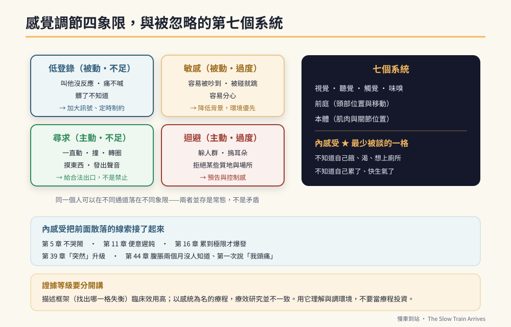

# 第47章　感官：看不見的那個維度



## 背景與痛點

同一間實作教室，對你來說是「有點吵」，對他來說可能是「有人在耳邊敲鐵板」。

這一章要補的，是全書一直繞著走、卻沒有正面處理的一個維度：**他接收到的世界，和你接收到的不是同一個。**

它為什麼重要，可以用前面章節的三個未解之處來說明：

- 第 16 章：他在家能專注三十分鐘，在教室五分鐘就撐不住——你以為是專注力，可能是**聽覺負荷**。
- 第 35 章：功能是「感官」的行為，代幣與處罰完全無效——但書中只說了「找替代」，沒說怎麼找。
- 第 5 章：嬰兒期「不哭不鬧」的感覺低反應，十六年後仍然存在——**他到現在還是不知道自己餓了、要上廁所、快生氣了。**

第三點是這一章的核心，而它有一個名字，多數家長從來沒聽過：**內感受**。

> 💡 **先講證據等級**
> 感覺調節的**描述性框架**（辨識一個人在哪些通道上過度反應或反應不足）在職能治療與特教實務中被廣泛使用，臨床效用高。
> 但**以感覺統合為名的療程**，其療效研究結果並不一致——這一點第 33 章已經標註過。
> 本章的立場：**用它來理解與調整環境（證據較穩），不要把它當成治療課程來投資（證據不足）。**

---

## 核心設計

### 一、七種感覺系統

前五種大家都知道，後兩種才是關鍵。

| 系統 | 接收什麼 | 失調時的樣子 |
|------|---------|-------------|
| 視覺 | 光、動態、顏色 | 怕日光燈閃爍、盯著旋轉物、在雜亂環境找不到東西 |
| 聽覺 | 聲音 | 摀耳朵、對特定聲音極度反應、吵雜中無法聽指令 |
| 觸覺 | 碰觸、質地 | 討厭衣服標籤、不喜歡被輕觸、卻喜歡用力擁抱 |
| 味嗅 | 味道、氣味 | 極度挑食、對某些氣味反應強烈 |
| **前庭** | 頭部位置與移動 | 一直搖晃／轉圈，或極度害怕腳離地、怕電梯 |
| **本體** | 肌肉與關節的位置 | 動作笨拙、力道控制差、喜歡推拉重物、撞人 |
| **內感受** | **身體內部訊號** | **不知道自己餓、渴、想上廁所、累、生氣** |

### 二、內感受：這本書一直在講、卻沒有命名的那一塊

把前面散落的線索接起來：

```text
第 5 章　嬰兒期不哭鬧、尿布濕了不吵
第 11 章　對便意的感覺遲鈍，需要「定時排便制約」
第 16 章　累到極限才發脾氣，因為不知道自己累了
第 39 章　情緒升級到第 ④ 階段才被發現，因為他察覺不到自己在生氣
第 44 章　情境 35（腹脹兩個月沒人知道）、情境 40（第一次說「我頭痛」）

→ 全部都是同一件事：**內部訊號傳得慢、傳得弱、或解讀不出來。**
```

這解釋了一個長年的困惑：**為什麼他總是「突然」爆發？**

因為對他而言，那可能真的是突然的。一般人會經歷「有點煩 → 越來越煩 → 快受不了 → 爆發」的漸進，而內感受弱的人可能直接從「還好」跳到「爆發」——中間那幾格他讀不到。

**這也意味著：第 16 章的「疲勞求助」與第 39 章的「早期前兆」，本質上是在教內感受。**

```text
【內感受訓練：三個可以做的】

① 命名身體訊號（把內在狀態外顯化）
   在他明顯有生理狀態時，替他說出來：
     「你的手在抖，你可能累了。」
     「你一直摸肚子，是不是想上廁所？」
   → 大人先做「翻譯」，他才可能學會自己讀。

② 身體檢查三問（接第 19 章的疲勞自我偵測）
   固定在工作 25 分鐘時問一次：
     「手會不會抖？眼睛會不會酸？想不想坐下？」
   → 三個有一個 → 舉手說「我想休息一下」。

③ 情緒溫度計（0–3 級，配圖示）
   平靜 / 有點煩 / 很煩 / 受不了
   在他平靜時教，在第 ② 階段用（第 39 章）。
   → 目標不是讓他描述情緒，是讓他**在爆發前指出一個數字**。
```

### 三、四象限：他是哪一種

同一個人可以在不同通道上落在不同象限——這是最常被誤解的一點。

| | **反應不足** | **反應過度** |
|---|---|---|
| **被動（不主動調節）** | **低登錄**：叫他沒反應、痛不喊、髒了不知道 | **敏感**：容易被吵到、被碰到就跳起來、分心 |
| **主動（會去調節）** | **尋求**：一直動、撞、轉圈、摸東西、大聲 | **迴避**：躲人群、摀耳朵、拒絕某些質地與場所 |

```text
【怎麼用這張表】
  · 低登錄 → 需要「加大訊號」：更明確的提示、更強的對比、
    定時制約（不能等他自己感覺到）
  · 尋求   → 需要「合法出口」：規律的感官活動時段，
    而不是禁止（第 35 章的替代感官輸入）
  · 敏感   → 需要「降低背景」：環境調整優先於訓練
  · 迴避   → 需要「可預測與控制感」：預告、給他一個離開的方式

★ 本書主線的個案在多數通道上偏「低登錄」（第 5 章），
  但在聽覺上可能偏敏感（第 42 章情境 16）。
  **兩者並存是常態，不是矛盾。**
```

---

## 實作

### 一、感官剖析觀察表（兩週）

不需要專業工具，觀察並勾選即可。**目的是找出「哪一個通道、哪一個方向」，不是分類他。**

```text
【視覺】
  □ 在明亮或閃爍的燈下不舒服　□ 喜歡盯著旋轉／閃爍的東西
  □ 在雜亂的桌面找不到東西　　□ 對特定顏色或圖案強烈偏好

【聽覺】
  □ 對特定聲音摀耳朵（吸塵器、烘手機、警報）
  □ 在吵雜環境聽不懂指令　　　□ 自己會製造聲音（哼、敲、學聲音）

【觸覺】
  □ 討厭標籤、某些布料、剪指甲、洗頭
  □ 不喜歡被輕觸，但喜歡用力抱　□ 喜歡摸特定質地

【味嗅】
  □ 食物種類極少　□ 拒絕整類質地（濕、糊、脆）
  □ 對氣味反應強烈（廁所、油煙、香水）

【前庭】
  □ 一直搖晃、轉圈、跑跳　□ 怕腳離地、怕電梯、怕溜滑梯
  □ 坐不住，需要一直動

【本體】
  □ 力道控制差（太用力／太輕）　□ 喜歡推拉重物、鑽被子
  □ 動作笨拙、常撞到東西

【內感受】★ 最容易被忽略
  □ 不說餓、不說渴　　□ 不知道要上廁所，或忍到最後一刻
  □ 累到極限才爆發　　□ 痛不喊、生病不說
  □ 情緒像「突然」發生，沒有漸進

→ 每一項勾選後，標註方向：不足（↓）或過度（↑）
```

### 二、環境適配清單（比訓練更快見效）

**這一段是本章投報率最高的部分。** 環境調整不需要孩子改變任何事，而且當天就能做。

```text
【家】
  □ 固定的低刺激角落（他可以自己去的地方）
  □ 睡前降低照明與噪音
  □ 收納視覺化但不雜亂（開放層架反而更亂 → 用有蓋收納）
  □ 衣物：剪掉標籤、選他能接受的材質（這不是寵，是降負荷）

【教室／機構】（寫進 IEP 或交接手冊）
  □ 座位遠離噪音源（門、走廊、機器）
  □ 允許使用降噪耳罩或耳塞（需與老師討論規則）
  □ 給一個「可以去冷靜」的指定位置
  □ 工作區視覺單純（一次只放當前任務的材料）
  □ 轉換時段給預告（第 8 章）

【職場】
  □ 固定工位、固定路線
  □ 高噪音時段的替代任務
  □ 明確的休息時機（不是「累了再說」——他讀不到，見內感受）

★ 這些調整不是特權，是**讓他能工作的條件**。
  就像近視的人需要眼鏡——沒有人會說那是特殊待遇。
```

### 三、感官活動時段（給「尋求」型）

```text
【原則】
  · 規律安排，不是等他失控才用
  · 放在需要專注之前（例如：作業前 10 分鐘的大動作活動）
  · 選他真的喜歡、且安全的形式

【常見的形式】
  本體覺（多數人接受度最高）：推牆、提重物、搬椅子、
      鑽被子、按摩球、咀嚼有嚼勁的食物
  前庭：盪鞦韆、旋轉（★ 有癲癇病史者，
      任何劇烈或長時間的前庭刺激應先問醫師）
  觸覺：捏黏土、豆子箱、深壓（用被子包）

⚠️ 誠實標註：這一類安排在實務上被廣泛使用，家長回饋常是正面的，
   但研究證據不一致。**可以做，不要當成主要投資，也不要付高價
   購買「療程」**——多數形式在家就能做（第 33 章的同一立場）。
```

### 四、把感官接回前面的章節

| 前面的困難 | 感官視角的重新解讀 | 該做的 |
|---|---|---|
| 教室待不住（第 42 章情境 16） | 聽覺敏感 + 視覺雜亂 | 環境調整優先於抗干擾訓練 |
| 電梯一直按按鈕（第 43 章情境 27） | 尋求（視覺 + 觸覺回饋） | 替代物（計數器） |
| 極度挑食 | 味嗅／觸覺敏感 | 質地漸進、與餵食專業合作 |
| 累到爆發（第 16 章） | 內感受不足 | 定時檢查 + 身體三問 |
| 便意遲鈍（第 11 章） | 內感受不足 | 定時制約，不等感覺 |
| 「突然」爆發（第 39 章） | 內感受不足 | 前兆清單由**大人**建立，不靠他自述 |

**這張表的意思是：** 第 47 章不是新增一堆訓練，而是替前面的困難**換一副眼鏡**。有些原本要靠訓練解決的，換上這副眼鏡後會發現——調環境更快。

---

## 現場踩雷

**踩雷一：把感官需求當成問題行為處罰。**
搖晃、摸東西、哼聲、撞——這些若是尋求行為，處罰只會壓抑而不會消失，而且會增加焦慮。

**踩雷二：花大錢買感統療程。**
證據不一致。**先做環境調整（免費、當天見效），再談其他。**

**踩雷三：只看外顯的五感，忽略內感受。**
內感受是這一章最重要的一格，也是最少被談的一格——而它直接連著疲勞、疼痛、情緒、如廁。

**踩雷四：把環境調整當成寵溺。**
耳罩、座位、固定路線——這些是**工作條件**，不是特權。而且它們通常比訓練更省力、更快見效。

**踩雷五：貼標籤而不行動。**
「他是感覺尋求型」——然後呢？剖析的目的是**找出要調哪一格**，不是分類他。

**踩雷六：前庭活動不問醫師。**
有癲癇病史者，劇烈或長時間的旋轉、跳躍等活動應先確認。

---

## 效益與驗收（DoD）

| 項目 | 驗收標準 |
|------|---------|
| 剖析完成 | 七個系統的觀察表完成，並標註不足／過度 |
| 環境已調整 | 家庭與學校（或機構）各至少完成 2 項環境調整 |
| 內感受已命名 | 每天至少 1 次替他說出身體訊號（「你的手在抖，你可能累了」） |
| 身體三問 | 工作 25 分鐘的定時檢查已實施滿 4 週 |
| 情緒溫度計 | 0–3 級的圖示已製作，且在平靜時教過 ≥ 5 次 |
| 感官時段 | 若為尋求型，已安排規律的感官活動時段（而非危機時才用） |
| 未過度投資 | 沒有購買高價療程；優先做的是環境調整 |
| 已寫進文件 | 環境需求已寫進 IEP 或第 18 章的交接手冊 |

> 💡 君之一席話
> 「他不是突然爆發的。**是他和你，讀到的不是同一份訊號**——你看到的是十分鐘的漸進，他讀到的只有最後那一秒。」
