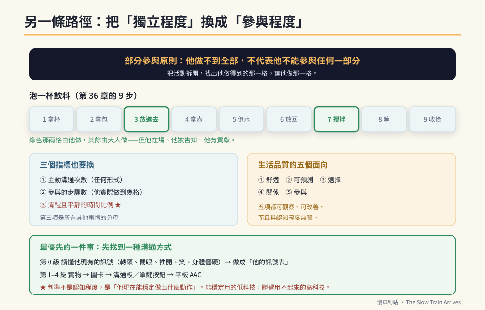

# 第48章　另一條路徑：重度、無口語與多重障礙



## 背景與痛點

這本書的主線，寫的是一個**條件相當好**的孩子。

生活自理完全獨立、能簡單溝通、情緒勉強可控、有明確且穩定的固著興趣、人緣好。附錄 C 已經誠實承認過：這樣的組合在特教族群裡屬於前段。

而現場的真實分布不是這樣。更多的家庭是這樣的：

- 完全無口語，或只有幾個發音；
- 自理需要大量協助，甚至全部依賴；
- 有嚴重的自傷或攻擊行為；
- 癲癇未受控，每週都有發作；
- 使用輪椅、管灌、或有其他醫療需求；
- 沒有明顯的、可以拿來當引擎的固著興趣。

如果你的孩子在這一群，前面四十七章讀起來會很刺——**它們預設的起點，你沒有。**

這一章要做的，是把整本書翻譯成另一條路徑。而翻譯的關鍵只有一個概念：

> **把「獨立程度」換成「參與程度」。**

---

## 核心設計

### 一、部分參與原則

這是重度障礙教育領域最重要的一條原則，而它推翻了一個很常見的預設：

> **「他做不到全部，不代表他不能參與任何一部分。」**

過去的做法是：他做不到，就由大人代勞，他在旁邊看（或不在場）。而部分參與原則說：**把活動拆開，找出他做得到的那一格，讓他做那一格。**

```text
【範例：泡一杯飲料（第 36 章的 TA-4，共 9 步）】

  主線版本：他自己做完 9 步
  部分參與：他做第 3 步（把茶包放進杯子）與第 7 步（攪拌）
           其餘由大人做，但他在場、他被告知、他有貢獻

【範例：家庭洗衣】
  他做不到分類與操作機器，但他可以：
    把衣服放進洗衣籃 · 按下開始鍵 · 把烘好的衣服拿給每個人

【範例：用餐】
  他無法自行進食，但他可以：
    用眼神或圖卡選今天要吃哪一道 · 把餐具放上桌 ·
    在餵食時自己握著杯子的一側
```

**為什麼這件事重要，而不只是「安慰」：**

- 參與本身會維持動作與認知功能（不用就會退）；
- 它創造了溝通機會（選擇、拒絕、要求）；
- 它給他一個角色，而角色是尊嚴的基礎；
- 對照顧者而言，它把「全部代勞」變成「一起做」——這在三十年的尺度上，差別很大。

### 二、六階段的替代版

主線的六階段以「獨立完成」為軸。替代版換一個軸：

| 站 | 主線目標（獨立） | **替代版目標（參與與溝通）** |
|----|----------------|---------------------------|
| **S1** | 看檢核卡完成 2 項 | 建立**可預測的一日結構**與**一種可用的溝通方式**（哪怕只是「是／不是」） |
| **S2** | 兩步指令、認面額 | 擴充**選擇的機會**：每天至少 10 次「你要 A 還是 B」 |
| **S3** | 三種工具、職場台詞 | 擴充**參與的活動種類**：每週有 3 種他能參與一格的家務或活動 |
| **S4** | 干擾下 25 分鐘 | 擴充**耐受的時間與情境**：能在有他人的環境中待多久、做多久 |
| **S5** | 陌生主管指令 80% | **場所的類化**：能在家以外的 2 個場所參與同樣的活動 |
| **S6** | 每日在崗 4 小時 | **銜接日間服務**：能穩定出席、有喜歡的活動、有人認得他 |

**三個指標也要換：**

```text
主線：情緒回復時間 · 獨立完成率 · 指令鏈長度
替代：
  ① 主動溝通次數（任何形式：眼神、手勢、圖卡、發聲、按鈕）
  ② 參與的步驟數（一個活動中他實際做到的格數）
  ③ 清醒且平靜的時間比例（★ 對醫療複雜個案，這是最重要的一項）
```

第三項需要解釋：對一個癲癇未控制、或有慢性疼痛、或睡眠嚴重不足的孩子來說，「今天有幾小時是清醒而且平靜的」比任何技能指標都重要——**因為那是所有其他事情的分母**。

### 三、生活品質作為目標

當獨立不是可達成的目標時，該用什麼取代？這個領域的共識是**生活品質**，而它可以被拆成可觀察的面向：

```text
① 舒適　　　　疼痛、姿勢、飢餓、如廁被適時處理
② 可預測　　　他知道接下來會發生什麼
③ 選擇　　　　他每天有機會決定一些事（哪怕只是二選一）
④ 關係　　　　有人認得他、叫他的名字、知道他喜歡什麼
⑤ 參與　　　　他有事可做，而且那件事有真實的結果

★ 這五項每一項都可以觀察、可以改善，
  而且**與認知程度無關**——最重度的孩子同樣適用。
```

---

## 實作

### 一、先找到一種溝通方式（最優先）

**沒有任何事比這件事更重要。** 一個無法表達「不要」「痛」「還要」的人，所有的行為問題都有可能是溝通問題。

```text
【AAC 的分級：從最低科技開始，不要跳級】

  第 0 級　讀懂他現有的訊號
    ★ 先做這一步：他現在已經在用什麼表達？
      轉頭、閉眼、推開、笑、發某個聲音、身體僵硬
    → 把它列成一張「他的訊號表」，讓所有照顧者用同一套解讀
      這一步不需要任何工具，而且立刻有效

  第 1 級　實物選擇
    拿出兩樣真實物品，讓他看／碰／拿。
    （對視覺障礙或認知極低者，實物比圖卡更容易）

  第 2 級　照片／圖卡
    從 2 張開始，不要一次給一整本

  第 3 級　溝通板（多格）／單鍵語音按鈕
    一個按鈕先只放一句最有用的話（「還要」或「不要」）

  第 4 級　平板 AAC 軟體
    ★ 需專業評估。不是越高科技越好——
      能穩定使用的低科技，勝過用不起來的高科技。

【選哪一級的判準】
  不是「他的認知程度」，是**他現在能穩定做出什麼動作**：
    能伸手拿 → 實物或圖卡
    只能眼神 → 眼神指向的雙選
    只能一個動作（按、揮手）→ 單鍵按鈕
```

### 二、溝通夥伴訓練：訓練環境，不是訓練他

這是重度個案最關鍵、卻最常被忽略的一步。

```text
【核心觀念】
  溝通是雙向的。若周圍的人不知道怎麼給他機會、
  不知道怎麼讀他的訊號、不等他反應——
  那麼他學會什麼都沒有用。

【溝通夥伴的五個動作】（訓練所有照顧者）
  ① 等　　　　說完後等 10–15 秒（★ 多數人只等 2 秒）
  ② 給選擇　　把「要不要吃」換成「要 A 還是 B」（拿出兩樣）
  ③ 讀訊號　　依「他的訊號表」回應，並說出來：「你看那個，你要那個對不對？」
  ④ 給後果　　他表達了，就給結果——一次沒效，訊號就會消失（FCT 的同一條鐵律）
  ⑤ 製造機會　刻意把東西放在他拿不到的地方、故意漏給一樣，
              讓他有理由表達（★ 這叫溝通誘發）

【最常見的錯誤】
  照顧者太熟練了——他還沒表達，需求就被滿足了。
  「我看他的表情就知道他要什麼」——這句話聽起來很溫暖，
  但它會讓他失去所有練習表達的機會。
```

### 三、行為問題：先假設它是溝通

```text
【重度個案的行為處理，順序與主線相同，但權重不同】

  第一層　痛與醫療（第 46 章）★ 權重最高
    無法表達疼痛的人，行為就是他唯一的表達。
    自傷、攻擊、拒食的突然出現，先當成醫療事件。
    特別檢查：牙齒、耳朵、便秘、經期、胃食道逆流、姿勢不適

  第二層　感官（第 47 章）
    低登錄與尋求在此族群更常見；環境調整優先

  第三層　溝通（本章）
    他想說什麼？給他一個更省力的方式（FCT）

  第四層　功能與方法（第 35–37 章）

★ 自傷行為若有立即傷害風險（撞頭、咬手至破皮），
  **不要自行處理**——需要跨專業團隊（醫療＋行為＋職能）介入。
  這是本書明確超出範圍的一項。
```

### 四、醫療複雜個案的調整

```text
【癲癇未控制】
  · 訓練強度以「發作後的恢復期」為準，不是以「好的那幾天」為準
  · 每一項活動都要有中斷後的續接方式
  · 三個指標中，「清醒且平靜的時間比例」是主指標
  · 學校與機構必須有書面的緊急處置流程（第 39 章）

【管灌／進食困難】
  · 進食時間本身就是溝通與參與的機會（選擇口味、按開始）
  · 口腔照護不能省（第 44 章情境 34 的 TA 仍適用，只是由大人執行）

【輪椅／姿勢擺位】
  · 姿勢不適是行為問題的常見隱形原因
  · 定時變換姿勢，並把「不舒服」的訊號列進他的訊號表

【多重用藥】
  · 第 46 章的四個提醒同樣適用，而且風險更高
```

### 五、路徑的終點：日間服務，而不是就業

```text
【現實的說法】
  主線的終點是小作所或庇護工場。
  這一條路徑的終點，多半是**身心障礙者日間照顧中心**——
  以生活自理維持、體能活動、休閒文娛為主。

  **那不是次一等的結果。** 它的目標本來就不同：
  不是產能，是**維持功能、社會參與與生活品質**。

【提前準備的事（與主線相同）】
  □ 提早參訪與登記（候補時間可能更長）
  □ 交接手冊（第 18 章）——重度個案的交接更關鍵，
    因為新照顧者無法從他口中得知任何事
  □ 「他的訊號表」必須附在手冊第一頁 ★
  □ 醫療流程、姿勢擺位、進食方式、過敏，全部書面化
```

---

## 現場踩雷

**踩雷一：拿主線的標準套用。**
用「獨立完成率」評估一個需要全面協助的孩子，只會得到一整年的零——而那會摧毀家長。**換指標，不是降低期待。**

**踩雷二：放棄溝通。**
「他聽不懂」「他不會表達」——這兩句話一旦成立，往後三十年他就沒有聲音了。**先從第 0 級開始：他現在已經在用什麼表達？**

**踩雷三：太熟練的照顧者。**
需求在表達之前就被滿足，是重度個案失去溝通機會的頭號原因。

**踩雷四：把自傷當行為問題直接處理。**
先當醫療事件；有立即傷害風險時，需要跨專業團隊，不是靠一本書。

**踩雷五：忽略姿勢與疼痛。**
不會喊痛的人，用行為喊痛。

**踩雷六：把日照中心當成失敗。**
目標不同而已。生活品質的五個面向，在日照中心同樣可以全部達成。

---

## 效益與驗收（DoD）

| 項目 | 驗收標準 |
|------|---------|
| 訊號表 | 完成「他的訊號表」，所有照顧者用同一套解讀 |
| 溝通方式 | 至少一種可穩定使用的表達方式（任何級別） |
| 主動溝通 | 每日主動溝通次數有記錄，且四週內呈上升趨勢 |
| 選擇機會 | 每天 ≥ 10 次二選一的機會 |
| 溝通夥伴 | 主要照顧者都做到「等 10–15 秒」與「刻意製造機會」 |
| 部分參與 | 每週 ≥ 3 個活動，他實際參與其中至少一格 |
| 醫療優先 | 行為變化時，先排除痛與醫療（第 46 章） |
| 生活品質 | 五個面向各有一項具體的觀察指標 |
| 交接就緒 | 交接手冊完成，且訊號表在第一頁 |

> 💡 君之一席話
> 「他做不到全部，不代表他不能做那一格。**而那一格——把茶包放進杯子的那三秒——就是他今天在這個家裡的位置。**」
