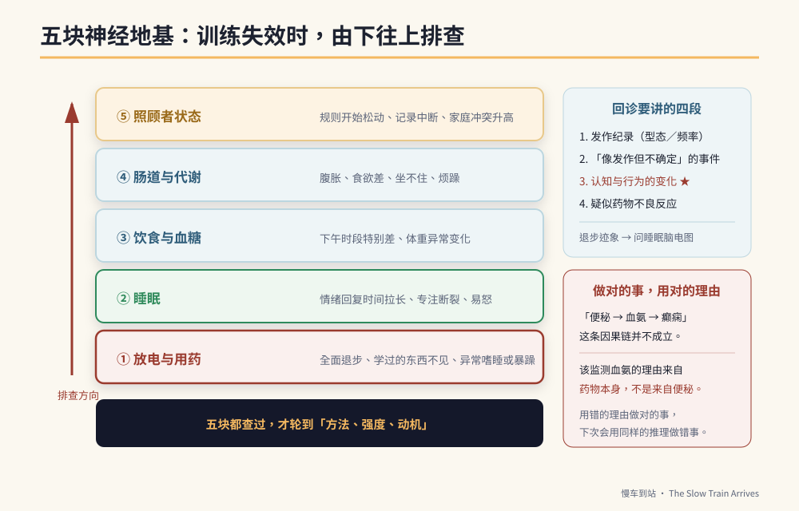

# 第11章　神经地基：放电、睡眠、饮食、肠道与照顾者



## 背景与痛点

一位母亲在第六周写下这句话：

> 「这礼拜整个垮掉。计时器不管用了，任务卡也不理，一整周都在生气。我是不是做错了？」

翻开她的纪录，答案在最后一栏的备注里：那一周孩子连续五天都在十一点半以后才睡。

**这一章要创建的是一个习惯：训练出问题时，先查地基，再检讨方法。**

因为在神经发育障碍的孩子身上，行为表现对生理状态的敏感度，远高于一般人。同一个孩子，睡饱和没睡饱，可以像两个人。而大人如果先检讨方法，会做两件错事：把有效的方法改掉，以及把生理问题误读成态度问题。

> ⚠️ **医疗免责**
> 本章涉及用药追踪、剂量、饮食调整与检查安排，**全部属于医疗决策，一律由主治医师决定**。本章的用途只有一个：让你知道回诊时该主动说什么、该问什么。
> **绝对不要**依据本章自行停药、调药、改变饮食疗法或增减营养补充品。抗癫痫药物突然停用可能诱发癫痫重积状态，那是会致命的。

---

## 核心设计：五块地基与排查顺序

```text
训练失效时的排查顺序（由下往上）

  ⑤ 照顾者状态    ← 最常被忽略，却决定一切能否持续
  ④ 肠道与代谢
  ③ 饮食与血糖
  ② 睡眠
  ① 放电与用药    ← 最优先排除
  ─────────────────────
  然后才是：方法、强度、动机
```

顺序的理由：越下层，越可能造成**全面性**的表现下滑；而越下层的问题，也越不可能靠调整教学方法解决。

| 地基 | 没顾好的表现 | 谁负责 |
|------|-------------|--------|
| ① 放电与用药 | 全面退步、学过的东西不见、白天嗜睡或异常暴躁 | 医师（家长负责观察与回报） |
| ② 睡眠 | 情绪回复时间拉长、专注力断裂、易怒 | 家庭 |
| ③ 饮食与血糖 | 下午时段表现特别差、体重异常变化 | 家庭（＋营养师） |
| ④ 肠道 | 腹胀不适、食欲差、坐不住、情绪烦躁 | 家庭（＋医师） |
| ⑤ 照顾者 | 规则开始松动、记录中断、家庭冲突升高 | 家庭与支持系统 |

---

## 实作

### 一、地基①：放电与用药

**这一块你能做的只有两件事：正确地观察，以及完整地回报。**

```text
【每次回诊前，准备这四段信息】

1. 发作纪录
   有／无发作？型态是否与以往相同？频率？持续多久？
   （★ 用手机录像对医师判读极有帮助，若能在安全前提下拍摄）

2. 「像发作但不确定」的事件
   短暂失神、忽然停顿、眼神空掉几秒、忽然的抽动——
   这些容易被当成发呆或分心，但它们可能是发作。记下时间与情境。

3. 认知与行为的变化（★ 最重要，也最容易漏报）
   这三个月有没有：原本会的东西不见了？注意力明显变差？
   情绪突然变得暴躁？学习停滞？
   → 若有，主动问医师：「需不需要安排睡眠脑电图？」
     常规脑电图与睡眠脑电图不是同一件事，前者正常不代表后者正常。

4. 疑似药物不良反应
   见下方观察表。
```

**药物不良反应观察表**（依实际用药不同，请向医师确认要观察哪些）：

```text
【每月记录一次】
  体重：____ kg      （体重明显变化值得主动提出，可能与代谢与剂量有关）
  食欲：□正常 □明显增加 □明显减少
  掉发：□无 □比以前多
  手部细微颤抖：□无 □偶尔 □明显
  白天嗜睡：□无 □偶尔 □明显
  情绪与活力：□稳定 □明显低落 □明显躁动

【立刻联系医师（不要等下次回诊）】
  □ 皮肤红疹，尤其合并发烧或黏膜（口腔、眼睛）溃疡
  □ 持续呕吐、食欲全失、明显倦怠或意识改变
  □ 不明原因的瘀青、牙龈出血、伤口不易止血
  □ 眼白或皮肤变黄
```

> 🔍 **一个容易被以讹传讹的因果链，值得说清楚**
> 网络上有一种说法：「长期便秘 → 毒素吸收 → 血氨升高 → 加剧疲劳与癫痫风险。」
> 这条链在一般人身上并不成立——健康的肝脏能有效代谢肠道产生的氨。它成立的前提是严重肝功能异常（肝性脑病），那是另一回事。
> **但「监测血氨」这件事本身，在某些用药情况下确实有临床意义**——某些抗癫痫药物（特别是丙戊酸类）**本身**就可能造成血中氨值升高，临床上表现为嗜睡、意识混乱、呕吐或认知变差。
> 所以正确的说法是：**该监测的理由来自药物，不是来自便秘。** 要不要验、多久验一次，由医师决定。
> 这个例子值得记住，因为它示范了本书的一条原则：**做对的事，但用对的理由。** 用错的理由做对的事，下一次你会用同样的错误推理，做出错的事。

### 二、地基②：睡眠

睡眠是唯一一块「家庭可以完全控制、而且见效最快」的地基。

```text
【睡眠日志：两周，每天 30 秒】
  就寝时间 ____ ／ 实际入睡约 ____ ／ 起床 ____
  夜间醒来 ___ 次
  睡前 1 小时有无屏幕 □有 □无
  隔天状态 □好 □普通 □差

【常见且可处理的四件事】
  1. 固定起床时间比固定就寝时间更有效
     → 起床时间稳定，生理时钟才会稳定。假日也不要差超过 1 小时。
  2. 睡前 60 分钟无屏幕
     → 若困难，先从 30 分钟开始，并用「视觉计时器」运行（第 8 章）。
  3. 睡前流程固定且可视化
     → 洗澡 → 刷牙 → 换衣服 → 一段火车时间 → 关灯。做成图卡贴墙上。
  4. 白天有足够的身体活动
     → 这一项对睡眠品质的影响，通常比家长预期的大。

【要告诉医师的睡眠信号】
  □ 打鼾严重、睡眠中呼吸暂停、睡醒仍疲倦（可能需评估睡眠呼吸问题）
  □ 睡眠中反复的抽动、异常姿势、大量流口水（★ 可能是夜间发作）
  □ 长期入睡困难或早醒
```

**睡眠与 C1 的关系，在记录上会非常明显。** 把睡眠日志与情绪回复时间画在同一条时间轴上，多数家庭在两周内就能看到相关性——而那张图，是说服另一半（以及说服自己）的最好工具。

### 三、地基③：饮食与血糖

这一块网络信息最多，也最需要标明证据等级。

| 建议 | 证据等级 | 诚实的说法 |
|------|---------|-----------|
| 避免大量咖啡因（能量饮料、浓茶、咖啡、含咖啡因饮料） | 中 | 咖啡因与癫痫的关系尚无定论，但大量摄取会影响睡眠品质，**而睡眠不足与发作风险的关联是明确的**。避免大量摄取是合理的谨慎，理由主要来自睡眠。 |
| 避免血糖剧烈波动（含糖手摇饮、大量精致糖） | 中 | 「精致糖直接引发神经元过度兴奋」是**过度的宣称**。但血糖剧烈起伏会影响情绪稳定与注意力，这在行为纪录上通常看得出来。 |
| 低 GI 主食（糙米、地瓜取代白饭） | 中 | 对餐后精神稳定度有帮助；对体重管理也有帮助（部分用药可能伴随食欲增加）。 |
| 足量蛋白质与规律三餐 | 高 | 规律进食本身就是稳定因素；不要长时间空腹（见第 4 章）。 |
| Omega-3（深海鱼或补充剂） | **低到中** | 研究结果不一致。**吃鱼作为均衡饮食的一部分是合理的**；把高剂量补充剂当成认知治疗则缺乏足够证据。**任何补充剂都要先问医师**，因为部分补充剂可能影响凝血或与药物交互作用。 |
| 生酮饮食 | 高（**仅限特定适应症**） | 对 GLUT1 缺乏症与部分难治型癫痫是正式治疗，需医师处方与营养师监控。**没有适应症时自行运行只有风险。** |

> 💡 **一句话总结饮食这一段**
> 这里没有魔法食物。真正有效的是三件无聊的事：**规律三餐、不要大量含糖饮料、睡得够。** 你在网络上花三小时研究的补充剂，效果多半比不上把睡觉时间提前一小时。

### 四、地基④：肠道

有些孩子在婴幼儿期就有严重便秘史（例如出生后数周内出现长时间不排便）。**这在当下是需要立即就医评估的信号**——先天性巨结肠症、甲状腺功能低下等都可能以此表现，而其中有些是可以处理的。

至于多年后回头做因果归因，要谨慎：早期便秘史**可以是**神经系统整体差异的一条线索，但单凭它无法确立任何诊断。它真正的用途是**现在式的**——如果孩子的肠道神经反应本来就偏慢、对便意的感觉偏迟钝，那么往后几十年的便秘管理，就必须是主动的，而不是等他喊不舒服。

```text
【定时排便制约：对付「感觉不到便意」】
  每天固定时间（早餐后 或 晚餐后 20–30 分钟，利用胃结肠反射），
  不论有没有便意，都用视觉图卡引导他坐上马桶 5–10 分钟。

  要点：
  · 脚要踩得到地（矮凳垫脚，膝盖略高于髋部，姿势比出力重要）
  · 时间到就结束，不要求「一定要解出来」
  · 不要给 3C 打发时间（会延长久坐，且注意力离开身体信号）
  · 用打勾卡记录「有没有坐满 5 分钟」，而不是记录「有没有解出来」
    → 可控的行为才适合当训练目标

【每日基本盘】
  · 水分：规律分次喝，不要集中在一个时段
  · 纤维：蔬菜、水果、全谷；增加纤维时**必须同步增加水分**，
    否则反而更硬
  · 活动量：散步、走路上下学、家事——肠道蠕动需要身体动起来

【肠道红旗：出现任一项，就医】
  □ 超过 3–4 天完全未排便，且合并腹胀、呕吐或食欲全失
  □ 血便、黑便
  □ 明显腹痛或腹部摸起来硬胀
  □ 体重下降
  ★ 任何软便剂、浣肠、益生菌的使用，请先问医师或药师。
```

### 五、地基⑤：照顾者

这一块被放在最后，但它决定其他四块能不能持续。

现实是这样的：这本书里的每一项训练，都需要一个**情绪稳定、能忍住不说话、能在孩子爆发时保持中立**的大人。而一个连续三个月每天只睡五小时、没有任何喘息时间的照顾者，做不到这些——不是不愿意，是生理上做不到。

```text
【照顾者自检（每月一次，诚实作答）】
  □ 最近两周，我平均每天睡不到 6 小时
  □ 最近两周，我曾经对孩子大吼或失控
  □ 最近一个月，我没有任何一段完全属于自己的时间（≥ 2 小时）
  □ 我很久没有跟朋友见面或讲电话了
  □ 我觉得只有我一个人在做这些事
  □ 我最近常常觉得没有希望

  勾到 3 项以上 → 这个月的第一优先不是加强训练，是找喘息。
  勾到「没有希望」→ 请与医疗或心理专业人员谈谈。
  照顾者的忧郁是常见的，而且是可以处理的。

【可以找的资源】（详见附录 B）
  · 各县市社会局的「身心障碍者临时及短期照顾」（喘息服务）
  · 家长团体与同侪支持团体
  · 学校辅导室、社工
  · 若情绪困扰持续，身心科或心理咨商
```

**训练强度的设计，必须以「照顾者能持续」为上限。** 一份需要完美父母才能运行的计划，不是好计划——它只是把失败的责任转嫁给家庭。

---

## 现场踩雷

**踩雷一：孩子退步时先改教学方法。**
顺序错了。先查睡眠、先查身体、先查有没有生理事件，再谈方法。

**踩雷二：把地基当成「等有空再处理」。**
地基不是背景，它是变量。一周的睡眠混乱，可以抹掉一个月的训练成果。

**踩雷三：自行加减补充品。**
「反正是保健食品，应该没关系」——补充品可能与药物交互作用、可能影响凝血、可能干扰检验数值。**先问医师或药师**。

**踩雷四：把便秘当小事。**
腹胀不适的孩子坐不住、易怒、食欲差，而这些会被归因成行为问题。**排便纪录是最便宜的行为问题排查工具之一。**

**踩雷五：照顾者硬撑。**
硬撑的结局通常不是「终于撑过去」，是某一天突然全部停摆——而停摆造成的退步，远大于少做几周训练。

---

## 效益与验收（DoD）

| 项目 | 验收标准 |
|------|---------|
| 回诊四段信息 | 每次回诊前完成四段信息整理，并实际交给医师 |
| 放电状态明确 | 知道最近一次脑电图的时间与类型；若有退步迹象，已主动询问睡眠脑电图 |
| 不良反应监测 | 每月一次观察表；「立刻联系医师」清单已张贴 |
| 睡眠可视化 | 完成 2 周睡眠日志，并与情绪回复时间对照过 |
| 睡眠已改善 | 固定起床时间；睡前 30–60 分钟无屏幕，达成率 ≥ 70% |
| 饮食基本盘 | 规律三餐、无日常含糖饮料；补充品皆经医师确认 |
| 肠道管理 | 定时如厕制约实施满 4 周；排便纪录可查；红旗清单已张贴 |
| 照顾者 | 完成自检；若达 3 项以上，已实际联系至少一项喘息或支持资源 |

> 💡 君之一席话
> 「你在第六周觉得方法失效了，其实是他连续五天十一点半才睡。**在这条路上，最有效的『教材』常常不是教材——是一张床、一顿饭、和一个没有崩溃的大人。**」
