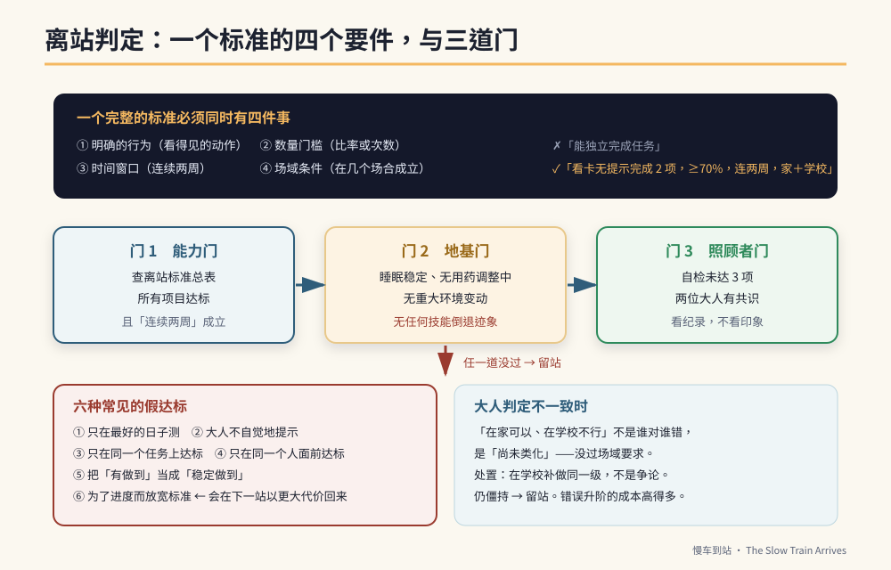

# 第20章　离站标准：怎么知道可以往下一站开



## 背景与痛点

「他这样算不算会了？」

这个问题在特教家庭里，一年会出现几百次。而它之所以难回答，是因为多数家庭用的判准是**印象**：

- 「他昨天做得很好」——那是单次表现。
- 「他现在都可以了」——「都」是几次？在哪些场合？
- 「老师说他进步很多」——进步多少？从哪里到哪里？

印象式判准会造成两种错误，而且两种都很贵：

**高估。** 在熟悉情境下的偶尔成功，被当成「会了」，于是推到下一站。三个月后全面崩盘，家长开始怀疑整套方法。

**低估。** 明明已经稳定达标，但家长总觉得「还不够好」，于是原地踏步一年。孩子失去的是四年里的四分之一。

这一章提供的，是把「算不算会了」变成一个**可以查表回答**的问题。

---

## 核心设计：一个标准的四个要件

在这本书里，任何一项「达标」都必须同时满足四件事。少一件都不算。

| 要件 | 意思 | 为什么 |
|------|------|--------|
| **① 明确的行为** | 描述的是看得见的动作，不是状态或态度 | 「他比较稳定了」无法验收；「连续完成两项不需提醒」可以 |
| **② 数量门槛** | 有比率或次数 | 「常常可以」是几成？ |
| **③ 时间窗口** | 连续两周（或指定期间） | 排除单次表现与心情因素 |
| **④ 场域条件** | 在几个场合成立 | 只在家成立的能力，机构用不到 |

一个完整的标准长这样：

```text
✗ 坏的写法：「能独立完成任务。」
✓ 好的写法：「看着三格检核卡，在无额外口头提醒的情况下
             连续完成 2 项以上，达成率 ≥ 70%，
             连续两周，且在家庭与学校**两个场域**皆成立。」
```

**这个写法有一个额外的好处：它可以直接抄进 IEP。** 特教老师最需要的就是这种「可评量的目标叙述」，而多数家长写不出来。你把它写好，会议上的讨论品质会完全不同（第 34 章）。

---

## 实作

### 一、六站离站标准总表

| 站 | 核心指针 | 门槛 | 场域要求 |
|----|---------|------|---------|
| **S1** | 情绪回复时间 | 中位数 ≤ 2 分，或较基线 ↓30% | 家 |
| | 看卡无提示完成 | ≥ 2 项，达成率 ≥ 70% | 家（学校佳） |
| | 手势制止成功率 | ≥ 80% | 家 |
| | 打勾自主 | 100% 由孩子自己完成 | 全场域 |
| **S2** | 指令链 | 稳定通过第 6 级（跨室 2 步「然后」） | 家 + 学校 |
| | 覆诵 | ≥ 70% | 家 + 学校 |
| | 金钱辨识 | 三种面额指认正确；「哪张才够」≥ 80% | 家 + 一次真实消费 |
| | 公共安全 | 连续 3 次车站练习无安全事件 | 社区 |
| **S3** | 生气频率 | 每周 ≤ 2 次，且无失控行为 | 学校 |
| | 工具 | ≥ 3 种可独立操作；单一工具专注 ≥ 15 分 | 家 + 学校 |
| | 岗位稳定 | ≥ 20 分钟无需叮嘱 | 学校 |
| | 职场台词 | ≥ 2 句可无提示自发使用，每周 ≥ 3 次 | 家 + 学校 |
| **S4** | 抗干扰 | 干扰下持续 ≥ 25 分钟 | 家 + 学校 |
| | 良率 | 40 分钟作业合格率 ≥ 90%，后段无明显下滑 | 学校 |
| | 求助句 | **无提示**下疲劳时使用，每周 ≥ 2 次 | 家 + 学校 |
| **S5** | 陌生指令 | 陌生主管 2–3 步指令成功率 ≥ 80% | 实习现场 |
| | 固着抑制 | 工作时段主动提起次数为零，连续两周 | 实习现场 |
| | 通勤 | 达梯度 3 以上，或已确立替代方案 | 社区 |
| | 交通安全 | 100%，无安全事件 | 社区 |
| **S6** | 留任 | 每日在岗 ≥ 4 小时，错误率在容许范围 | 机构 |
| | 变动调适 | 预告或计时器介入后 3 分钟内平复 | 机构 |
| | 交接 | 七页手册已当面交付并说明 | — |

### 二、判定流程：三道门

```text
【门 1】能力门
  查上表。所有项目都达标，且「连续两周」成立。
  → 任一项未达 → 留站。

【门 2】地基门（第 11 章）
  □ 最近四周睡眠大致稳定
  □ 没有正在调整用药、刚生完病、刚经历重大环境变动
  □ 没有任何技能倒退的迹象
  → 任一项亮红灯 → 留站，先处理地基。

【门 3】照顾者门
  □ 主要照顾者自检未达 3 项
  □ 两位照顾者对「现在可以往下一站」有共识
  → 未过 → 留站，先找喘息与支持。
```

### 三、当大人的判定不一致

这件事一定会发生：妈妈觉得可以了，爸爸觉得还早；家长觉得可以了，老师觉得在学校根本没看到。

**这不是谁对谁错的问题，通常是「场域不同」。**

```text
【处理流程】
  1. 先确认双方看到的是不是同一件事
     → 把标准念出来（含数量、时间窗口、场域），逐项对答案

  2. 如果双方的观察真的不同 → 那是信息，不是争执
     「在家可以、在学校不行」= 尚未类化 = 没过门 3 的场域要求
     → 正确处置是**在学校补做同一级**，而不是争论谁说了算

  3. 用纪录，不用印象
     → 各自记两周，拿数字出来比。
       这是为什么第 1 章要求「两人先对定义」。

  4. 如果仍然僵持 → 留站
     留站的成本远低于错误升阶的成本。
```

### 四、不要作弊：六种常见的假达标

```text
① 只在最好的日子测
   → 标准写的是「达成率」，不是「最佳表现」。全部都要记。

② 大人不自觉地提示
   → 眼神、手指方向、清喉咙、站的位置——都是提示。
     检查方法：请第三个人在旁边看一次，或录像回放。

③ 只在同一个任务上达标
   → 「擦黑板」练了三个月当然会。换一个任务再测一次。

④ 只在同一个人面前达标
   → 换一个大人交办，成功率通常会掉。那个掉下来的部分
     才是真实水准。

⑤ 把「有做到」当成「稳定做到」
   → 连续两周。不是两次。

⑥ 为了进度而放宽标准
   → 这是最危险的一种，因为它会在下一站以更大的代价回来。
```

### 五、记录范本

```yaml
# stage-gate.yaml — 每次判定填一份，存盘
stage_from: S2
stage_to: S3
review_date: 2026-06-28
reviewers: [家长A, 家长B, 特教老师]

gate_1_ability:
  chain_level_6:      {value: "5次中4次", pass: true,  domains: [家, 学校]}
  echo_rate:          {value: 0.75,      pass: true,  domains: [家, 学校]}
  money_recognition:  {value: 0.85,      pass: true,  domains: [家, 超商]}
  public_safety:      {value: "3次无事件", pass: true, domains: [社区]}
  result: PASS

gate_2_foundation:
  sleep_stable_4w: true
  no_med_change: true
  no_regression: true
  result: PASS

gate_3_caregiver:
  self_check_flags: 1
  consensus: true
  result: PASS

decision: 进入 S3
notes: |
  金钱项目在超商实测时，找零仍需完全提示 → 列为 S3 期间的加值项目，
  不影响本次离站（S2 的标准只要求「哪张才够」）。
next_review: 2026-09-30
```

**最后那个 `notes` 字段是这份表格的灵魂：** 它记下了「达标但还不漂亮」的部分，让它不会在升阶后被遗忘。

---

## 现场踩雷

**踩雷一：把 DoD 当成考试。**
它不是考试，是**红绿灯**。红灯的意思是「先不要开」，不是「你考坏了」。这个语气差别，孩子听得出来。

**踩雷二：在孩子面前讨论他有没有达标。**
他听得懂的比你想的多。**判定会议在他不在场时开。**

**踩雷三：只用达标与否，不看趋势。**
即使没过门，只要三个指针都在往好的方向动，那就是有效的训练。**趋势比门槛更早告诉你方法对不对。**

**踩雷四：没有 review_date。**
「等他准备好」永远不会到。**排一个固定的查看日**（例如每学期末），时间到就拿表出来对。

**踩雷五：把标准订得比孩子的现实高。**
如果连续三次查看都没过，而且指针也没在动——那不是孩子的问题，是**标准订错了或方法选错了**。此时该调整的是计划，不是孩子。

---

## 效益与验收（DoD）

| 项目 | 验收标准 |
|------|---------|
| 标准已成文 | 目前这一站的离站标准，逐项写下来并贴出 |
| 四要件齐全 | 每项标准都含行为、数量、时间窗口、场域 |
| 查看日已排 | 下一次判定日期已排入行事历 |
| 记录已创建 | 使用 `stage-gate.yaml` 或等效表格，每次判定留档 |
| 多方参与 | 判定至少有两位大人参与，且看的是纪录不是印象 |
| 已写进 IEP | 至少一项标准已用可评量的叙述写进 IEP 或亲师会议纪录 |

> 💡 君之一席话
> 「『他这样算不算会了』这个问题之所以难，是因为你在问一个**没有定义的问题**。定义写下来的那一天，它会变成一个十秒钟就能回答的问题——而你会发现，你其实一直都知道答案。」
