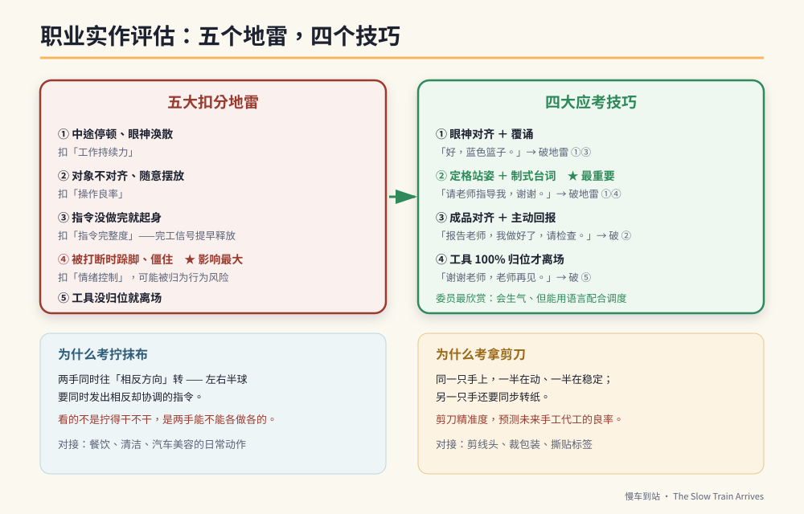

# 第27章　面试评估：为什么考的是剪刀和抹布



## 背景与痛点

家长第一次听到高职适性安置或职业评估的内容时，反应通常是困惑：

「怎么考折抹布？」「拿剪刀剪纸这种东西也要考？」「不是应该考认字或算术吗？」

这个困惑来自一个误解：**以为评估要找的是「比较聪明的孩子」。**

不是。评估委员手上拿的是一张**工作人格与操作良率检核表**。他们要判断的是：

- 这个孩子坐得住吗？
- 他听得懂交办吗？
- 他做出来的东西合不合格？
- 出状况的时候，他会怎样？

这四个问题，决定了他适合去哪里、能不能被支持、机构愿不愿意收。而它们**都不需要智力测验**——用一条抹布和一把剪刀，二十分钟就能看得相当清楚。

这一章要做两件事：解释那些考题到底在看什么，以及告诉你怎么在家里练。

---

## 核心设计

### 一、为什么是「拧抹布」

拧干一条抹布，看起来只是力气。在动作发展上，它是一个相当复杂的**双侧反向协调**动作：

| 要求 | 神经层面在看什么 |
|------|----------------|
| 两手同时往**相反方向**转 | 左右半球必须同时发出相反、但协调的动作指令 |
| 前臂的旋前与旋后 | 前臂旋转肌群与腕关节的成熟度 |
| 持续施力而不放掉 | 握力的耐力，而不只是瞬间力量 |

**关键在于「反向」。** 早期有脑部损伤或发展落后的孩子，常出现**联带动作**——两只手只能做同方向的动作，一只手在转，另一只手不由自主地跟着转同一边。

所以委员看的不是「拧得干不干」，是**两只手能不能各做各的**。

而它对接的职场非常直接：特教高职的餐饮、清洁、汽车美容科，每天都要擦拭、刷洗、旋转瓶盖。**能拧干抹布 ≒ 具备基础清洁工作的耐受力。**

### 二、为什么是「拿剪刀」

剪刀在特教与职能治疗领域，是公认的高端手部动作指针。它同时考三件事：

```text
① 手指的分工（桡侧 / 尺侧分化）
   拇指、食指、中指（桡侧）负责开合剪刀
   无名指、小指（尺侧）在下方稳定支撑
   → 同一只手上，一半在动、一半在稳定，
     这种分工需要相当精细的动作控制

② 双手不对称协作
   惯用手控制剪刀开合
   非惯用手必须「同步转动纸张」
   → 两只手做的是完全不同的工作

③ 手眼协调与视觉追踪
   眼睛要盯着线，手要跟着线走
```

它对接的职场同样直接：小作所的代工——剪线头、裁包装、撕贴标签——**剪刀的精准度，相当程度预测了未来手工代工的良率。**

> 🔍 **一个常被夸大的说法，值得校准**
> 有一种说法是「手部精细动作区与语言区（布洛卡区）高度重叠，所以练手就能练语言」。
> 较保守的说法是：手部动作的皮质代表区与部分语言相关区域在额叶**相邻**，而动作与语言系统在演化与发展上可能有关联——这是研究中的假说，不是可以直接推论到「练剪刀能改善说话」的结论。
> **练手部动作的理由已经够充分了**（职场直接需要、可观察、可进步），不需要再附加一个可能不成立的语言效益。本书的原则：做对的事，用对的理由（第 11 章）。

### 三、四大考题

| 考题 | 现场的样子 | 在看什么 |
|------|-----------|---------|
| **① 基本数据与自理** | 「你叫什么名字？」「你会自己上厕所吗？」「把外套脱下来挂好，等一下自己穿上」 | 口语表达、自理独立度 |
| **② 职业实作** | 抹布折四分之一并擦干净；10 个袋子各装一个积木、封口贴标签，限时 3–5 分钟 | 手部动作、良率、工作耐受 |
| **③ 指令理解** | 「先去后面篮子拿一个蓝色夹子，然后夹在桌上的绿色抹布上」 | 工作记忆链、跨空间运行 |
| **④ 情绪控制** | 专注时故意制造噪音；做得正好时忽然说「这个先不要做，改做这个」 | 抗干扰、认知弹性、挫折忍受 |

**第 ① 题是多数孩子的必胜题**（如果自理独立），第 ④ 题是差距最大的一题。

---

## 实作

### 一、五大扣分地雷

```text
【地雷一】中途停顿、眼神涣散　→ 扣「工作持续力」
  现场：做到一半停下手，看天花板，或开始碎念火车，
        需要委员提醒「继续做」。
  居家对策：抗干扰训练（第 16 章）＋ 定格站姿。

【地雷二】对象不对齐、随意摆放　→ 扣「操作良率」
  现场：抹布边角没对齐就扔进篮子；
        成品没有整齐排放。
  居家对策：所有练习都加一句「要对齐」，
            并在收尾时检查一次。

【地雷三】指令没做完就起身　→ 扣「指令完整度」
  现场：三步骤指令做了前两步（拿袋子、装积木），
        还没贴标签就转身要走——大脑提早释放「完工信号」。
  居家对策：覆诵（第 9 章）＋ 三格检核卡的打勾习惯。

【地雷四】被打断时跺脚、僵住　→ 扣「情绪控制」
  现场：委员为了测抗压，故意在他做得顺的时候喊停、换任务。
  后果：被归类为「情绪行为风险」，这一项的影响最大。
  居家对策：定格站姿 + 台词（见下）。

【地雷五】工具没归位就离场　→ 扣「生活自理」
  现场：剪刀、标签纸散一桌，起身就走。
  居家对策：每一次练习的最后一步都是「工具归位」，
            养成到不用想。
```

### 二、四大应考技巧

```text
【技巧一】眼神对齐 + 覆诵（破地雷一、三）
  委员下达指令后，教他：
    先不要动 → 眼睛看着委员 2 秒 → 用力点头 →
    大声覆诵核心名词
  例：委员说「把抹布折好放进蓝色篮子」
      他说：「好，蓝色篮子。」

  → 这个动作在委员眼中的信号是：
    听觉工作记忆好、有职场礼貌、可指导。

【技巧二】定格站姿 + 制式台词（破地雷一、四）★ 最重要
  遇到不会做、卡住、或被突然打断时：
    双手在肚脐前交叠 → 深吸一口气 → 看着对方说：
      「请老师指导我，谢谢。」
      或「好，没关系，我换做这一个。」

  → 用标准社交语言，把想生气的冲动整个覆盖掉。
    委员最欣赏的不是不会生气的孩子，
    是「会生气但能用语言配合调度」的孩子。

【技巧三】成品对齐 + 主动回报（破地雷二）
  每做好一个成品，双手笔直、对齐排放。
  全部做完，主动走向委员说：
    「报告老师，我做好了，请检查。」

  → 主动回报是庇护工场高端员工的特质。

【技巧四】工具 100% 归位才离场（破地雷五）
  离场前：剪刀放回工具盒 → 垃圾丢掉 → 椅子靠拢 →
          「谢谢老师，老师再见。」
```

### 三、居家练习：剪刀与抹布的分级

```text
【拧抹布　四级】
  L1  双手抓住抹布，用「压」的挤水（★ 这是起点，不是失败）
  L2  双手抓住，一手固定、一手转
  L3  双手反向转，但幅度小
  L4  双手反向转且能拧干（滴水明显减少）

  练法：不要空练。给他真的要擦的东西——
        擦窗户、擦桌子、擦车。有结果的工作才练得久。
  外壳：「维修长，车窗要擦干净，火车才漂亮。」

【剪刀　五级】
  L1  能开合剪刀，剪断纸条（不要求路径）
  L2  沿着粗直线剪（线宽 1 公分）
  L3  沿着细直线剪（线宽 3 公厘）
  L4  沿着曲线剪
  L5  剪出形状（方形、圆形）

  练法：把要剪的东西做成「铁轨」——
        「维修长要剪一段铁轨给火车走。」
        剪切来的纸条真的贴在纸上排成轨道。
  ★ 非惯用手要「转纸」，不是把纸压死不动。
    这一点要特别引导：「另一只手要帮忙转纸。」

【安全】
  · 从安全剪刀（圆头）开始
  · 剪刀不用时一定归位（同时是地雷五的练习）
  · 全程有大人在场
```

### 四、能力现况说明表：优势特质那一栏怎么写

报名安置或申请服务时，通常要填一份能力现况说明。**「优势特质」那一栏是家长唯一能主动出手的地方**，而多数人写得太抽象（「个性乖巧」「很听话」）。

好的写法有三个要素：**病史一句带过、功能写具体、把固着写成可管理的**。

```text
【范本】（依实际状况替换方括号内容）

  「[孩子] 因幼儿期神经事件引发癫痫，目前于 [科别] 规则追踪，
   药物控制稳定多年，未再发作。常规基因检测未发现致病变异。

   生活自理完全独立：可自行进食、穿脱衣物、如厕且无失禁。

   在国中特教班人缘良好，利他动机强，长期担任教师的班务小帮手，
   可独立完成擦黑板、排桌椅、收发簿本等连续 [2–3] 项任务。

   对 [火车与游乐园] 有固着兴趣，但已创建视觉结构化的工作纪律：
   使用视觉检核表可自主完成任务、使用视觉计时器可自我结束话题。

   面对挫折或任务变更时，具备自我控制能力，
   可在提示下以口语配合调度，未出现攻击或自伤行为。

   适合高职阶段的职业技能培训与结构化工作环境。」
```

> ⚠️ **医疗免责**
> 上述说明表涉及诊断与用药的叙述，**应以主治医师开立的诊断证明与病历摘要为准**。家长填写时可引用医师的用语，但不应自行下诊断结论或描述药物疗效。任何用药信息都必须与医师确认后再书写。

**这段文本的作用是：让委员在还没见到孩子之前，就先把他归类到「高配合度、可投入实作」那一类。** 第一印象一旦创建，现场的小失误就不会被放大。

### 五、考前一周的仿真

```text
【每天 20 分钟，连续 5 天】
  1. 陌生大人（请亲戚或朋友帮忙）担任「委员」
     ★ 这一项最重要——熟人面前做得到不代表陌生人面前做得到
  2. 完整跑一次四大考题
  3. 至少制造 1 次干扰与 1 次任务变更
  4. 录像，回放时只看三件事：
     · 有没有中途停顿
     · 成品有没有对齐
     · 被打断时的反应
```

---

## 现场踩雷

**踩雷一：家长在现场抢答。**
「他会啦，他在家都会」——委员评的是孩子，不是你。**该说的写在书面数据里。**

**踩雷二：只练技术，不练「卡住怎么办」。**
现场一定会出现没练过的题目。**技巧二那句台词，价值高于任何一项技术。**

**踩雷三：练到孩子厌恶。**
考前一周每天二十分钟就够。练到他一看到剪刀就跑，是本末倒置。

**踩雷四：把「会生气」当成必须隐藏的缺点。**
不必隐藏。**「会生气但能自我控制、能用语言配合」本身就是加分项**——委员看过太多完全无法自控的孩子。

**踩雷五：说明表写得太谦虚或太夸大。**
太谦虚（「他什么都不会」）会让孩子被安置到不适合的高支持组别；太夸大（「他都可以独立」）会让他到现场后被要求做不到的事。**写具体的事实。**

**踩雷六：忘了工具归位。**
最容易补、也最容易被忘记的一项。**把它练成离场的固定动作。**

---

## 效益与验收（DoD）

| 项目 | 标准 |
|------|------|
| 拧抹布 | 达 L3 以上（双手能反向转） |
| 剪刀 | 达 L2 以上（能沿粗直线剪），非惯用手会转纸 |
| 覆诵 | 陌生大人交办时，能点头并覆诵关键名词 ≥ 70% |
| 定格台词 | 卡住或被打断时，能使用台词而非情绪反应 ≥ 70% |
| 对齐与回报 | 成品对齐摆放；完成后主动回报 ≥ 80% |
| 工具归位 | 每次练习结束都自主归位，达 ≥ 90% |
| 陌生人测试 | 已在陌生大人面前完整跑过仿真 ≥ 3 次 |
| 说明表 | 优势特质栏已用具体功能叙述写成，并经医师确认医疗用语 |

> 💡 君之一席话
> 「他们考的不是他多聪明，是**他坏掉的时候会怎样**。一个做得慢但卡住会举手的人，比一个做得快但一被打断就僵住的人，在任何一间工场都活得久。」
