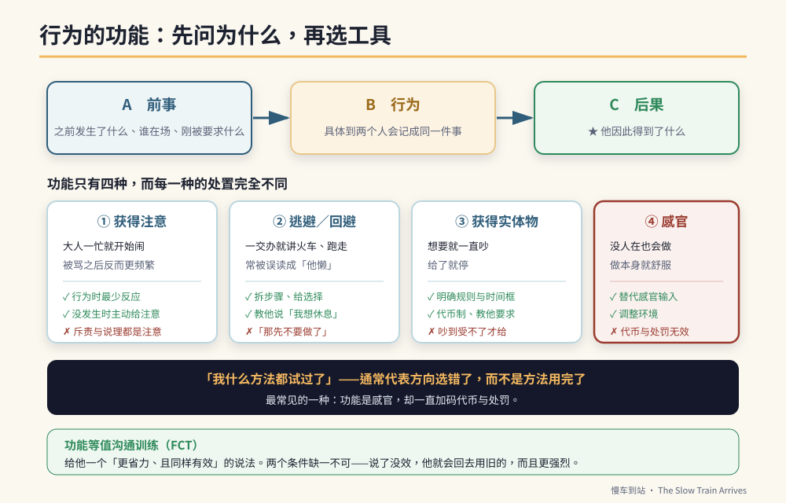

# 第六篇　专业补强：特教现场的六件事

# 第35章　行为的功能：先问为什么，再谈怎么办



## 背景与痛点

前面三十四章给了一整箱工具：视觉计时器、代币制、手势制止、检核卡、提示褪除。

现在要说一件可能会让你有点不舒服的事：**那些工具，如果用在错的行为功能上，会全部无效——而且有些会让事情变得更糟。**

举一个真实会发生的情况。

一个孩子在实作课中反复离开座位。老师用了代币制：坐满十分钟给一张贴纸。两周后，离座次数不减反增。

老师的结论通常是「代币制对他没用」。但真正的原因可能是：**他离座的目的，本来就不是为了得到东西——他是为了离开那个太吵的教室。** 对一个想逃走的人，你给他贴纸，他当然不理你；而每一次他离座、老师走过来劝他，他都成功地离开了工作几分钟——**你其实在增强他离座。**

这一章要补的，是这本书前面缺的最重要的一块：**在选工具之前，先判断这个行为在替他做什么。**

在特教与行为介入领域，这件事叫**功能性行为评估**（Functional Behavior Assessment, FBA）。它不是新潮的技术，它是这个领域的地基——而台湾的特殊教育法规在处理情绪行为问题时，也要求以行为功能为基础拟定介入方案。

---

## 核心设计

### 一、所有行为都有功能，而功能只有四种

行为不是随机的。一个持续发生的行为，一定在为他取得某样东西。行为科学把它归为四类：

| 功能 | 他在取得什么 | 现场长什么样 | 常见误判 |
|------|-------------|-------------|---------|
| **① 获得注意** | 别人的反应（正向或负向都算） | 大人一忙就开始闹；被骂之后反而更频繁 | 「他就是欠骂」 |
| **② 逃避／回避** | 离开一个要求、任务或情境 | 一交办就开始讲火车、跑走、抱怨不舒服 | 「他懒」「他挑食」 |
| **③ 获得实体物或活动** | 一样东西、一个活动 | 想要就一直吵，给了就停 | 「他被宠坏了」 |
| **④ 感官／自动增强** | 身体本身的感觉回馈 | 没有人在旁边也会做；做了本身就舒服 | 「他故意的」 |

**这四种功能的处置方式完全不同。** 更麻烦的是：**同一个外观的行为，功能可能不一样**；而**同一个行为，也可能有多重功能**（在家里是为了逃避、在学校是为了注意）。

### 二、关键的一句话：功能不是动机，是后果

家长最常问的是「他为什么要这样？」，然后给出一个心理层面的答案：他想引起注意、他在报复、他觉得无聊。

但功能性评估问的不是**他心里想什么**——那个谁都无法确定。它问的是：

> **这个行为发生之后，环境给了他什么？**

而环境给的那个东西，就是让这个行为持续下去的原因。这不需要读心术，**只需要记录**。

### 三、ABC 三联式

记录的方式是三栏。这是特教现场最基本、也最有用的一张表。

```text
  A（Antecedent 前事）  →  B（Behavior 行为）  →  C（Consequence 后果）
  行为之前发生了什么        他实际做了什么          之后环境怎么回应
```

三栏里，**大人最容易记错的是 A，最容易漏掉的是 C**。

- **A 常常被写成「没有原因，突然就」**——那通常代表观察者没看到，而不是真的没有前事。要写的是：当下在做什么、谁在场、刚刚被要求了什么、环境有什么变化。
- **C 常常被写成「我骂他」**——但关键不是你做了什么，是**他因此得到了什么**。你骂他 → 他得到了你的注意；你说「好吧那先不要做」→ 他成功逃避了任务。

### 四、依功能选策略

这是这一章最实用的一张表。前面各章的工具，在这里各就各位：

| 功能 | 该做的 | **不该做的**（会让行为恶化） | 本书对应章 |
|------|--------|---------------------------|-----------|
| **① 注意** | 行为发生时给予最少反应；在他**没有**出现该行为时主动给注意；教他用适当方式要求注意 | 大声斥责、长篇说理（那全都是注意） | 8、37 |
| **② 逃避** | 降低任务难度、拆步骤、给选择权、教他用语言要求休息；**任务仍要完成**（哪怕只完成一步） | 「好啦你不要做了」——那是在教他闹就能逃 | 16、36 |
| **③ 实体物** | 明确的规则与时间框、代币制、教他用适当方式要求 | 吵到你受不了才给——那是在教他吵久一点 | 10、37 |
| **④ 感官** | 提供功能等值的替代感官输入、调整环境、安排规律的感官活动时段 | 代币、处罚、说理——**这些对感官功能几乎完全无效** | 11、38 |

> 🔍 **为什么第 ④ 种特别重要**
> 感官／自动增强的行为，**增强来自他的身体本身，不来自环境**。你能控制的所有后果（给贴纸、不给贴纸、骂他、不理他），对这种行为都构不成影响。
> 这是「所有方法都试过，就是没用」最常见的一个原因。而正确的处理不是加强介入，是**换一个方向**：这个感觉他需要，那我们找一个可以接受的方式让他得到。

### 五、功能等值沟通训练（FCT）

这是行为介入里效果最稳、也最人道的一项技术，而它的逻辑只有一句话：

> **问题行为是一种沟通。要让它消失，就给他一个更省力、且同样有效的说法。**

「更省力」与「同样有效」两个条件缺一不可：

- 如果新的说法比较费力（要说一整句话 vs 只要尖叫一声），他会继续用旧的；
- 如果新的说法没有效（他说「我想休息」你说「再做十个」），他会回去用旧的，而且更强烈。

**这正是第 8、16 章那三句台词的专业名称。** 而现在你知道它们为什么有效、以及在什么条件下会失效。

| 问题行为 | 功能 | 功能等值的替代 |
|---------|------|--------------|
| 交办时开始碎念、拖延 | 逃避 | 「我需要帮忙／太难了」 |
| 做到一半离座 | 逃避（疲劳） | 「我太累了，我想休息一下」 |
| 一直重复问同一件事 | 注意 | 教他一个要求注意的方式（拍拍手臂＋「妈妈，你看」） |
| 拿不到东西就大声 | 实体物 | 「我要 ___，请给我」＋ 明确的规则（现在／等一下） |

---

## 实作

### 一、ABC 记录表

连续记录两周。**只记那一个你最想处理的行为**，不要一次记三种。

```text
【ABC 记录　行为定义：__________________________】
（行为定义要具体到「两个人分别记录会记成同一件事」，
  例如：✗「情绪不好」　✓「音量提高、重复同一句话三次以上」）

日期 时间  A 前事              B 行为          C 后果            持续
──────────────────────────────────────────────────────────────
3/02 16:20 刚被要求收玩具      重复说火车 6 次  我说「等一下再   4 分
                              音量提高          聊」，然后帮他
                                                收了玩具
3/03 10:05 实作课，隔壁组很吵   离座走到窗边    老师走过去带回   6 分
                                                座位，聊了两句
3/03 19:40 没有人跟他说话      重复说火车      我回应了三次     8 分
           （我在讲电话）
```

**记满两周之后，把 C 栏从头读一遍。** 你会看到一个重复出现的模式——那就是功能。

上面这三笔的模式很清楚：**第一笔是逃避（成功免除收玩具）、第二笔是逃避＋注意、第三笔是注意。**

### 二、写出功能假设

用这个句型，写成一句话：

```text
【功能假设句型】
  当 ______（前事）发生时，
  他会 ______（行为），
  以获得／逃避 ______（功能），
  因此这个行为持续发生。

【范例】
  当「被要求结束喜欢的活动」时，
  他会「重复同一句话并提高音量」，
  以「逃避活动结束、并延长活动时间」，
  因此这个行为持续发生。
```

写成这样有三个好处：它可以被验证（下一节）、它可以直接写进 IEP 的行为介入方案、而且它**把责任从孩子身上移到情境上**——「他故意的」变成「这个情境在教他这样做」。

### 三、验证假设（不要跳过这一步）

假设就是假设。验证的方法不是做实验，是**改一件事，看行为变不变**：

```text
【验证方式：改前事，看行为】
  假设是「逃避活动结束」→ 那就在结束前加一次预告（第 8 章），
  观察两周。行为明显减少 = 假设大致成立。

  假设是「获得注意」→ 那就在他「没有」出现该行为的时段，
  每 10 分钟主动去给他 30 秒的注意，观察两周。

  假设是「感官」→ 那就在同一时段提供替代的感官活动，
  观察行为有没有转移。

★ 如果改了两周完全没动，那是信息：功能假设可能猜错了，
  回到 ABC 记录重看一次。
```

### 四、把它接回前面的章节

现在回头看第二、三篇，会看到不同的东西：

| 前面的做法 | 它其实在处理什么功能 | 什么情况下它会无效 |
|-----------|-------------------|-----------------|
| 视觉计时器 + 手势（第 8 章） | 逃避（逃避「活动结束」）＋ 注意 | 若功能是感官，计时器无效 |
| 对话代币制（第 10 章） | 实体物／活动 | 若功能是逃避任务，代币无效 |
| 求助台词（第 8、16 章） | **FCT** — 给逃避一个合法出口 | 若说了没被回应，立刻失效 |
| 抗干扰训练（第 16 章） | 创建对「不舒服刺激」的耐受 | 若他的离座是感官需求，这会变成折磨 |
| 三格检核卡（第 13 章） | 降低任务的认知负荷 → 减少逃避动机 | 若任务本身太难，卡片救不了 |

> 💡 **这张表的意思**
> 这本书前面的策略没有错，但它们缺省了一组功能：**逃避与获得**。
> 那组缺省对多数「固着被打断就生气」的情境成立——但不是全部。
> 而当它不成立时，你需要的不是更用力，是**先做两周的 ABC 记录**。

---

## 现场踩雷

**踩雷一：跳过 A，只记 B。**
「他今天又闹了三次」——这种纪录无法产生任何结论。**没有前事与后果，行为就只是一个孤立的事件。**

**踩雷二：把功能写成心理动机。**
「他是想报复我」「他觉得我偏心弟弟」——这些无法验证，也无法转成行动。**功能要写成「他得到了什么」。**

**踩雷三：C 栏写大人做了什么，而不是他得到了什么。**
「我骂了他」→ 应该写成「他得到了 3 分钟的一对一注意」。这两句是同一件事，但只有后者能让你看懂发生了什么。

**踩雷四：一次记三个行为。**
记不完，而且会互相混淆。**一次一个，两周。**

**踩雷五：行为定义不具体。**
「情绪失控」——妈妈记的和老师记的不是同一件事，数据就废了。定义要能通过「两个人分别记，会记成同一件事」的测试（第 1 章的老原则）。

**踩雷六：功能是感官，却一直加码代币与处罚。**
这是最容易造成伤害的一种踩雷。**「所有方法都试过就是没用」，通常意味着功能猜错了，而不是他无药可救。**

**踩雷七：找到功能就以为问题解决了。**
功能评估只是第一步。它告诉你**该往哪个方向使力**，接下来才是第 36、37 章的技术。

---

## 效益与验收（DoD）

| 项目 | 验收标准 |
|------|---------|
| 行为定义 | 目标行为有具体定义，且两位记录者抽查 3 笔判定一致 |
| ABC 记录 | 连续 14 天、至少 10 笔完整的 A／B／C 三栏纪录 |
| 功能假设 | 已用句型写成一句话，并记录在案 |
| 假设已验证 | 依假设改变一项前事或后果，观察满两周并记录结果 |
| 策略对齐 | 目前使用的介入策略，与判定的功能对得上（用上方对照表检查） |
| 已纳入 FCT | 针对该功能，教了一个更省力且同样有效的替代说法 |
| 替代说法有效 | 他使用替代说法时，**每一次**都得到了预期的结果 |

最后一项是全章最重要的一条。**FCT 没有「这次先不要」的空间**——一次跳票，整套就失效。

> 💡 君之一席话
> 「『我什么方法都试过了』这句话，通常不代表方法用完了，**而是代表方向从一开始就选错了**。花两周记三栏字，比再试十种方法有用得多。」
