# 《慢车到站》
### ——把固着变成技能 —— 从神经地基到成人职场的四年培育蓝图

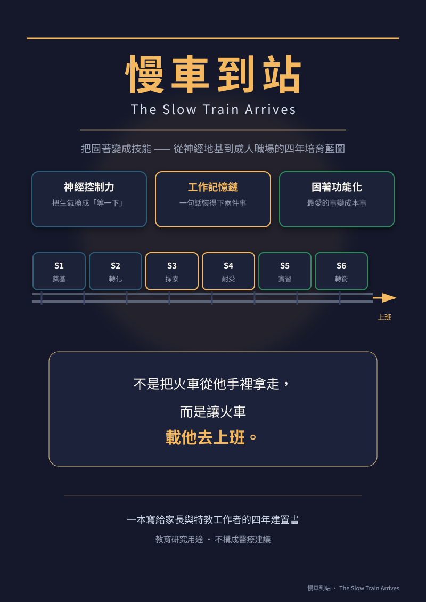

> 全书合并版。内容为「把固着变成技能」的完整培育设计，供家长与特教工作者参考；**不构成医疗建议**，用药与诊断请依主治医师。


---

## 目录

- 序：他只想讲火车，而我只剩四年

**第一篇　认识这颗独特的大脑：他到底是怎么了**

- 第1章　不哭闹的婴儿：一份十六年的病历与一张火车票
- 第2章　语言障碍的基因地图：五十个基因与它们说不出口的话
- 第3章　鉴别诊断的漏斗：当四个特征同时出现
- 第4章　可逆的那一小群：先天性代谢异常与「要不要再验一次」
- 第5章　疫苗、时序与因果：怎么看待「打完针之后才发生的事」
- 第6章　十六岁的定位：从开发期切换到转衔期

**第二篇　三大核心：所有训练共用的三条主轴**

- 第7章　三核心总览：每个活动都要能回答「这在练哪一条」
- 第8章　核心一　神经控制力：把生气换成「等一下」
- 第9章　核心二　工作记忆链：一句话里装得下两件事
- 第10章　核心三　固着功能化：火车不是症状，是动机引擎
- 第11章　神经地基：放电、睡眠、饮食、肠道与照顾者

**第三篇　六大阶段：四年，一站一站开**

- 第12章　四年时间轴：六阶段总览与转阶段的判准
- 第13章　阶段一　奠基期：把规则从嘴巴移到墙上
- 第14章　阶段二　转化期：一句话装两件事，一张票学会付钱
- 第15章　阶段三　职业探索期：从「小帮手」到「有职称的人」
- 第16章　阶段四　职场耐受期：吵、久、累的时候，还做得下去吗
- 第17章　阶段五　实习期：陌生的地方、陌生的主管、和一张自己画的地图
- 第18章　阶段六　转衔期：毕业之后，日子怎么过
- 第19章　可发展事项：达标之后，往上叠什么
- 第20章　离站标准：怎么知道可以往下一站开

**第四篇　教材与工具箱：今天晚上就能用的东西**

- 第21章　十组教材总览：三个维度与一张地图
- 第22章　M01–M03　大小与数量：谁比较贵、谁可以玩、有几节车厢
- 第23章　M04　付钱大作战：面额、够不够，与一个真实的钱包
- 第24章　M05・M06　刚好付对钱，与「逼一声，钱变少」
- 第25章　M07　纪念品找零：付大钞、拿零钱、收好
- 第26章　M08–M10　时刻表、先后顺序，与五分钟的红色
- 第27章　面试评估：为什么考的是剪刀和抹布

**第五篇　转衔与永续：往前看，也往回看**

- 第28章　方法学总则：一份三百条的清单，该怎么用
- 第29章　语言与沟通：十个母模式，与二十二条清单
- 第30章　认知、金钱与时间：一条难度阶梯，与七十六条清单
- 第31章　动作、工作与职场：八个母模式，与八十八条清单
- 第32章　情绪、社交、安全与地基：九个母模式，与五十一条清单
- 第33章　如果从头再来：给三岁家长的三十个方向
- 第34章　说服体系：IEP、鉴辅会，与把资源要到手

**第六篇　专业补强：特教现场的六件事**

- 第35章　行为的功能：先问为什么，再谈怎么办
- 第36章　工作分析与连锁：把一件事拆到他做得到
- 第37章　增强的技术：代币制之外，你需要知道的
- 第38章　青春期与身体界线：最该教、也最常被回避的一课
- 第39章　危机处理：当「勉强可控」失守的那一天
- 第40章　十八岁的法律断崖：监护、财产与医疗决定

**第七篇　情境百景：那件事发生的当下**

- 第41章　家庭日常十景
- 第42章　学校与班级十景
- 第43章　社区与交通十景
- 第44章　医疗与身体十景
- 第45章　职场与转衔十景

**第八篇　更复杂的情况：不在主在线的那些家庭**

- 第46章　共病：当「怎么做都没用」有第二个原因
- 第47章　感官：看不见的那个维度
- 第48章　另一条路径：重度、无口语与多重障碍
- 第49章　女儿：被忽略的那一半
- 附录A　速查索引
- 附录B　台湾资源与工具速查
- 附录C　现实校准：这本书不能做到的事
- 附录D　个案化附录：把这本书变成「他的」那一本
- 附录E　家庭与三十年：手足、照顾者，与老化
- 附录F　术语表
- 附录G　来源与延伸阅读


---


# 慢车到站　The Slow Train Arrives

## 序：他只想讲火车，而我只剩四年

晚餐桌上，今天是第四十七次。

「妈妈，自强号比较快，区间车比较慢。」「嗯。」「自强号比较快，区间车比较慢。」「嗯，你说过了。」「六福村有大怒神，大怒神要一百四十公分。」

十六岁的 J 坐在对面，汤匙握得很正确，饭粒没有掉出来，袜子是他自己穿的。他今天在学校擦了黑板、排了桌椅、把联系簿送去隔壁班——老师说他是最可靠的小帮手，同学都喜欢他。他不会打人，不会摔东西。你请他等一下，他会皱着眉头，很努力地等。

然后他会再说一次：「自强号比较快。」

你放下筷子，忽然意识到一件事：**明年他升国三，四年后他从高职毕业。那之后呢？**

---

### 这本书要解决的，是那个「那之后呢」

台湾的特殊教育，法定义务保障到高职毕业。那一年他十八岁、二十岁。学校的门在某一天会关上，而那扇门后面没有另一间教室——只有小作所的候补名单、庇护工场的评估表、日间照顾中心的排队，以及一个问句：**他能做什么？**

那个问句不是在毕业那天才问的。它从你读到这一页的今天就开始计时。

而你手上有什么？

你有一个孩子。他智力落后，语言迟缓，三到五岁爆发过癫痫、如今靠药物稳定多年。他的外观完全正常，基因检测报告写着「未发现致病变异」。他能自己吃饭、穿衣、上厕所，不失禁。他脾气好、人缘佳、乐于帮忙。他在被打断时会生气，但**勉强可以控制**。

还有——他每天只想讲两件事：火车，还有那座游乐园。

大部分的教养书会告诉你，固着是要「消除」的问题行为。这本书的立场正好相反：

> 💡 **全书的核心命题**
> 固着不是症状，是**动机引擎**。
> 不是把火车从他手里拿走，而是**让火车载他去上班**。

一个十六岁的孩子，你要他背九九乘法表，他学不会，也不肯学。但你把「自强号 400 元、区间车 150 元，哪一张比较贵」放在他面前，他会坐下来，会指，会念出声音——因为那是火车。同一道题目，换一层外壳，他从抗拒变成主动。

这就是这本书的全部方法论：**所有训练都包在他最爱的东西里，让抗拒成本降到最低；而包在里面的，是小作所、庇护工场、社区生活真正要考的那些能力。**

---

### 这本书是怎么写的

这本书是围绕一个十六岁男孩的实际处境写成的：从语言障碍的基因清单、鉴别诊断的漏斗，一路到「三大核心、六大阶段」的四年培育计划、十组火车主题的数学教材、三百种语言与认知提升法，最后到肠道与饮食这种没有人会写进教养书、却天天都要面对的事。

它经过三道工序：**拆开、查证、重排**——把散落在各处的作法整理成有顺序的阶段，补上运行细节、逐字台词与检核标准，写成一套**可以照着做、而且做完知道自己有没有做到**的东西。

过程中我删掉了两类内容：一类是无法验收的（「多陪伴他」「给他爱」——都对，但你明天早上不知道要做什么）；另一类是我查证后认为不该写进书里的（过度肯定的因果宣称、看起来精确但没有实证支撑的数字）。留下来的东西，我会标清楚哪些是**共识**、哪些是**推论**、哪些只是**这一家的经验**。附录 C 逐条列出了被删掉与被改写的部分。

> ⚠️ **医疗免责**
> 本书不是医疗建议。书中出现的药名、剂量原则、饮食调整与检查项目，只用于说明训练计划如何与医疗照护接轨。**任何用药、停药、调药、饮食疗法与检查安排，都必须由主治医师决定。** 书中的训练也不能取代语言治疗师、职能治疗师、心理师与特教教师的专业评估。
> 若孩子出现**技能倒退**（原本会的忽然不会了）、**发作型态改变**、**意识不清**或**新的神经症状**，那是医疗急症，请立刻就医，不要先翻书。

---

### 三个承诺，与三个不承诺

先把话说清楚，你才知道要不要往下读。

**这本书承诺：**

1. **每一项训练都告诉你「在练哪一条神经、怎么检核、几周看得到什么」。** 没有「持续进行即可」这种句子。
2. **每一章都给你可以直接念出口的台词。** 你不必自己翻译成孩子听得懂的话——逐字稿在书里。
3. **每一阶段都有离站标准（DoD）。** 你会知道什么时候可以往下一站开，而不是凭感觉。

**这本书不承诺：**

1. **不承诺提升智商。** 这套计划改变的是**功能**——他能自己做到什么、能撑多久、能不能求助。诊断不会消失，智力测验的数字也多半不会动。
2. **不承诺时程一定准。** 书里的四年时间轴是**起点**，不是标准。有些孩子在阶段二卡一年，有些孩子直接跳过阶段三。卡住不是失败，是信息——第 20 章教你怎么读这个信息。
3. **不承诺这套方法适用每个孩子。** 它是为「有语言与认知落后、有明确固着兴趣、生活自理已大致独立、情绪勉强可控」的青少年设计的。如果你的孩子还在完全无口语、或有严重自伤行为的阶段，第 28 章的方法学总则对你有用，但六阶段的时程请整组往后推，并先与治疗师讨论。

---

### 全书怎么读

| 篇 | 你会拿到 | 什么时候读 |
|----|---------|-----------|
| **第一篇　认识这颗独特的大脑**（`01`–`06`） | 病史怎么还原、语言障碍的基因地图、鉴别诊断的漏斗、可逆的那一小群、疫苗与因果、十六岁该切换的目标 | 想弄懂「他到底是怎么了」的时候 |
| **第二篇　三大核心**（`07`–`11`） | 贯穿全书的三条主轴，以及支撑它们的神经地基（药物、脑波、睡眠、饮食、肠道） | 开始做之前，一定要先读 |
| **第三篇　六大阶段**（`12`–`20`） | 四年时间轴：奠基 → 转化 → 职业探索 → 职场耐受 → 校外实习 → 社会转衔 | 决定「这学期做什么」的时候 |
| **第四篇　教材与工具箱**（`21`–`27`） | 十组火车主题数学教材、逐字交互台词、面试评估的真相 | 今天晚上就要用的时候 |
| **第五篇　转衔与永续**（`28`–`34`） | 方法学总则、三百种提升法、给三岁家长的三十个方向、怎么在 IEP 会议把资源要到手 | 想往前看，或想帮别人的时候 |
| **第六篇　专业补强**（`35`–`40`） | 行为功能评估、工作分析与连锁、增强的技术、青春期与身体界线、危机处理、十八岁的法律断崖 | 前五篇做过一轮之后；或当某件事「怎么做都没用」的时候 |
| **第七篇　情境百景**（`41`–`45`） | 五十个真实场景：家庭、学校、社区、医疗、职场。每景七段拆解 | **今天就发生了那件事的时候**——先查附录 A 的情境索引 |
| **第八篇　更复杂的情况**（`46`–`49`） | 共病与诊断屏蔽、感官与内感受、重度与无口语的另一条路径、女儿被忽略的那一半 | 当孩子不在主线的条件上；或当前面都做了仍然卡住 |
| **附录** | A 速查索引＋情境总索引 · B 资源 · **C 现实校准** · D 个案化 · **E 家庭与三十年** · F 术语表 · G 来源 | C 读完第二篇就翻；E 在你自己撑不住的那一天 |

如果你是**家长**，而且今天很累、只想知道明天早上做什么：直接跳到第 13 章（阶段一），把三个步骤做起来，其他之后再读。

如果**那件事今天刚发生**——他在超商门口不肯走、老师打电话来、他说了一句从来没说过的话——**翻到附录 A 的五十情境索引**，找到最像的那一景，直接读那三页。前面四十章可以之后再读。

如果你是**老师或治疗师**：最快能用的是第 7、20、35、36 章——三核心给你共同语言，DoD 给你可以写进 IEP 的目标叙述，第 35 章的功能评估与第 36 章的工作分析则是你本来就熟悉、但家长多半没有被教过的那两套方法。

如果你**刚拿到诊断、孩子还很小**：先读第 33 章。那一章是「如果从头再来，由三岁教起」的三十个方向——是这本书里唯一不需要你有四年时间的部分。

如果你的孩子**正在进入青春期**：第 38 章请不要跳过。它是这本书里最容易被回避、而回避的代价全部由孩子承担的一章。若是女儿，加上第 49 章。

如果你的孩子**不在主线的条件上**——无口语、需要大量协助、癫痫未控制、或没有可以当引擎的固着兴趣——**请先读第 48 章**。前面四十七章缺省的起点，你可能没有；第 48 章把整本书翻译成另一条路径：把「独立程度」换成「参与程度」。

如果**你自己快撑不住了**：附录 E。那一份的主词不是孩子，是你。

> 🔍 **第六篇为什么放在最后，而不是最前面**
> 因为它是**方法学**，而方法学在没有具体情境时很难读进去。
> 前五篇给的是一套可以直接运行的计划；第六篇解释那套计划背后的原理——包括它在什么情况下会失效。
> 如果你已经做过一轮、遇到「所有方法都试过就是没用」的时刻，那么第 35 章是你现在最需要的一章。

---

### 一件必须先说的事

这本书的主角在正文里叫 **J**。他是化名。

真实的孩子有名字、有学校、有主治医师、有一张身心障碍证明上的号码。这些东西不该进到一本会被别人看到的书里——所以主线章节一律去识别化，个案化的细节（实际用药、学校阶段、家庭时程表）收在**附录 D**，那是给这个家庭自己用的。

仓库里有一支 `scripts/check_book.py`，其中一项检查就是「主线章节不得出现可识别词」。这不是形式主义：孩子没有同意过这本书的出版，而他也还不具备同意的能力。在他能替自己决定之前，替他保留这件事，是写这本书的人唯一能做的补偿。

---

### 最后

十六年了。

你把一个在婴儿床上安静到让人不安的孩子，养成了一个会自己穿袜子、会帮老师擦黑板、被打断会生气但忍得住的少年。在特教这条路上，这已经是很前面的位置了——很多同龄孩子仍需要包尿布，很多家庭仍在处理每天的自伤与哭喊。

这本书不是要你再多做一点。它是要你把**已经做到的那些**，在剩下的四年里，换成他成年以后真的用得到的东西。

慢车开得慢。但慢车会到站。

> 💡 君之一席话
> 「早疗的黄金期已经过去了，这是实话；但**转衔的黄金期正在此刻**，这也是实话。你不能回到他三岁那年，你只能决定他二十岁那年站在哪里。」

---


# 第一篇　认识这颗独特的大脑：他到底是怎么了

# 第1章　不哭闹的婴儿：一份十六年的病历与一张火车票

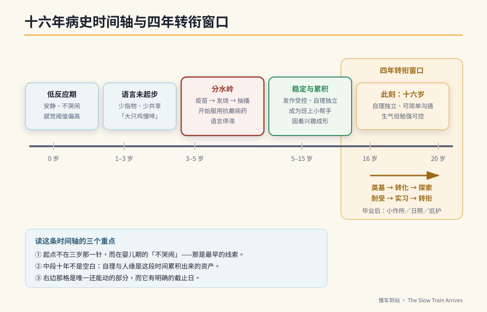

在讲任何一项训练之前，这一章先把「他是谁」讲清楚。因为接下来四年要做的每一件事，都创建在一个判断上：**哪些是他的损伤，哪些是他的特质，哪些是还可以动的。** 这三件事分不开，训练就会全错——你会拚命去修改不了的东西，同时放掉真正能改的。

---

## 一个完整的十六年：从安静的婴儿床到擦黑板的少年

**第 0 到 12 个月。**
他是所谓的「天使宝宝」。不哭、不闹、可以自己躺很久。尿布湿了不吵，肚子饿了顶多哼两声。亲戚都说：你好好命，这孩子这么乖。母亲当时也这样觉得——第一胎，没有比较基准，一个安静的婴儿看起来只是运气好。

十六年后回头看，这是整份病历里**最早、也最容易被漏掉的一条线索**。

**第 1 到 3 岁。**
会走路，时间点没有明显落后。但不太叫人，不太指东西，你叫他名字他不一定回头。他对天花板的电风扇比对人的脸有兴趣。长辈说「男孩子讲话比较慢，大只鸡慢啼」，于是又等了一年。

**3 到 5 岁：分水岭。**
在一次日本脑炎疫苗接种之后，他发烧，然后抽搐。第一次癫痫发作。之后陆续有发作，开始服用抗癫痫药物（丙戊酸钠，商品名帝拔癫）。家长取得了预防接种受害救济的证明。

这段时间，语言几乎没有往前走。原本就少的词汇没有变多，理解也停在很简单的指令层次。

**5 到 15 岁：漫长的稳定期。**
癫痫被药物压住了，多年没有明显发作。他上了幼儿园、国小，缓读一年，进了特教班。他学会自己吃饭、自己穿衣、自己上厕所而且不失禁——这在同水平的孩子里并不常见。他学会了擦黑板、排桌椅、倒垃圾。他成为老师的小帮手。

他也慢慢长出了那个固着：火车，和一座游乐园。从一句话变成一天二十句，从一天二十句变成每次被打断就生气。

各项检查陆续做过：脑部磁振造影、脑电图、基因检测。**基因检测正常。**

**16 岁，此刻。**
即将升国三（缓读过一年），特教班，高中预计读特教学校。癫痫药物控制稳定。日常可以简单沟通——他听得懂「去拿抹布」，说得出「我要吃饭」。他会固着，会反复讲火车和游乐园，需求没被满足时会生气，但**勉强可以控制**。

这就是全部的病历。三行摘要，十六年。

> ⚠️ **医疗免责**
> 本章出现的药物与检查只是这个个案的病史叙述，**不是任何人的用药依据**。抗癫痫药物的选择、剂量与追踪，必须由主治医师决定；自行加减或停药可能诱发癫痫重积状态，那是会致命的。

---

## 第二个场景：计时器上的红色消失的那一刻

第二个场景只有九十秒，但它是这本书真正的起点。

某个周三傍晚，母亲在孩子面前放了一个 Time Timer——一种红色区块会随时间消失的物理计时器。她转到十五分钟，说：

> 「红色还在的时候，是火车时间，妈妈陪你聊。红色不见、闹钟响，火车就要进站休息，我们去洗手吃饭。」

前面十五分钟一切正常。他讲自强号，讲区间车，讲大怒神要一百四十公分。

闹钟响了。红色没了。

他停了半秒，然后说：「自强号比较快。」

母亲没有回话，也没有说「不要再讲了」。她做了一个动作：右手五指并拢，掌心向前，做出「停」的手势；左手食指指向计时器——那个计时器现在是全白的。

他看了计时器一眼。看了母亲的手一眼。脸皱起来，明显地不高兴。

然后过了大约两分钟，他站起来，走去洗手。

**这九十秒里发生了三件事，而它们是这整本书的缩影：**

第一，**规则是用眼睛看到的，不是用耳朵听到的。** 他的语言处理很吃力，但视觉处理相对完好。一个会消失的红色，比十句「时间到了喔」有效。

第二，**大人没有进入口语角力。** 那句「不要再讲了」如果说出口，接下来就是一场十分钟的拉锯——而每一次拉锯，都在教他「只要我够坚持，规则就会松动」。

第三，**他生气了，然后他忍住了。** 这两分钟的落差，就是他的前额叶抑制功能。它存在，它有厚度，而且**它可以被练厚**。第 8 章整章都在讲怎么把这两分钟变成三十秒。

一个十六岁、智力落后、语言迟缓的孩子，在被打断固着时能自己走去洗手——这不是理所当然的。这是十六年教养累积出来的资产。而这本书要做的，就是把这份资产，在剩下的四年里兑现成他二十岁以后用得到的东西。

---

## 背景与痛点

十六岁这个时间点，家长最常掉进三个坑。

**坑一：还在追诊断。**

「基因检测正常」四个字，让很多家庭陷入无止境的追查——换一家医院、换一种检测、再验一次。追查本身没有错（第 4 章会说明什么情况下**确实应该**再验），但它有一个隐藏成本：**追诊断的那几年，训练停摆了。**

而十六岁的现实是：即使明天找到了确切的基因，多数情况下也不会改变今天的训练内容。诊断会改变**用药**（这很重要，第 4 章详谈），但很少改变**教学**。

**坑二：还在用早疗的目标。**

三岁的目标是「开口说话」。十六岁还把主要力气花在「让他多说几个字」，投报率极低——语言的关键发展窗口已经过去了。这不是放弃，是**换跑道**：把资源从「说得更多」转向「听得懂更复杂的指令」「用得出替代沟通」「做得完多步骤的事」。

第 6 章会完整拆解这个切换。

**坑三：把固着当成敌人。**

「他又在讲火车了，快转移注意力。」「不要理他，他就不会讲了。」

这是最贵的一个坑。因为固着兴趣是这类孩子身上**动机最强的东西**——强到你叫他做任何跟火车有关的事，他都愿意坐下来。你把它压下去，就等于亲手拆掉唯一那台还在运转的引擎。

---

## 核心设计

这本书把「怎么带一个十六岁的孩子」拆成三层。往后每一章，都会明确标示自己属于哪一层。

| 层 | 名称 | 回答的问题 | 对应章节 |
|----|------|-----------|---------|
| 第一层 | **神经地基** | 大脑现在能不能学？（放电、药物、睡眠、营养、肠道） | 第 11 章 |
| 第二层 | **三大核心** | 这个训练在练哪一条神经？ | 第 7–10 章 |
| 第三层 | **六大阶段** | 这学期该做到什么？做到就往前开 | 第 12–20 章 |

三层之间有严格的顺序：**地基不稳，核心练不动；核心没有，阶段推不上去。**

一个实际的例子：如果孩子夜间仍有微弱的癫痫样放电（第 11 章教你怎么查），他白天的专注力会像破了洞的桶子——你再认真做工作记忆训练，水都会漏掉。这时候正确的动作不是「加强训练」，是**回头去补地基**（回诊、复查脑波），训练暂时降到最低强度。

同样地，如果孩子连「停下固着话题」都还做不到（核心一），你就不该急着上「跨空间多步骤任务」（阶段二）——他会在中途被自己的思绪带走，然后你会得到一个挫败的孩子和一个更挫败的自己。

> 🔍 **这一层一层的意义：把失败变成信息**
> 大部分教养挫折的根源，是**归因错误**——训练失败时，家长会归咎于「他就是学不会」或「我方法不对」。但在三层架构下，失败有第三种、也是更常见的解释：**你在第三层用力，而问题在第一层。**
> 这一句话能省下的力气，可能比这本书其他所有内容加起来还多。

---

## 实作

不管你打算从哪一章开始，**今天晚上要做的第一件事是同一件：创建基线。**

基线就是「还没开始训练之前，他现在是什么样子」。没有基线，三个月后你会陷入一种很折磨人的状态：你觉得他好像有进步，但你不确定，你的另一半觉得没有，于是你们吵架，然后训练停掉。

基线只要记三个数字，每天不超过三分钟。

### 一、情绪回复时间（秒）

**测什么：** 从「他被打断／被拒绝」到「他配合去做下一件事」，中间隔了多久。

**怎么测：** 手机码表。他开始皱眉、抗议、重复要求的那一刻按下开始；他实际起身去做下一件事的那一刻按停。

**记录范例：**

```text
日期        事件                        回复时间    备注
2026-03-02  聊火车时间到、要求去洗手      3分40秒     有口语争辩（我说了三次）
2026-03-03  聊火车时间到、要求去洗手      2分10秒     只用手势，没说话
2026-03-04  想看第二次视频、被拒绝        5分05秒     疲累（前一晚睡不好）
```

第三行那个 5 分 05 秒不是退步，是**睡眠**。你只有记录，才看得出这件事。

### 二、独立完成率（次／次）

**测什么：** 交办任务后，他在**没有任何额外口头提醒**的情况下做完的比率。

「额外口头提醒」包括「快点」「还有一个喔」「你在干嘛」。第一次交办不算提醒，之后每一句都算。

```text
日期        任务            额外提醒次数   独立完成
2026-03-02  擦黑板           2 次          否
2026-03-03  擦黑板           0 次          是
2026-03-04  擦黑板＋排桌椅    1 次          否（第二项忘记）
```

### 三、指令链长度（步）

**测什么：** 他一次能记住并完成几个步骤。

从一步开始试：「把碗拿到厨房。」成功就试两步：「把碗拿到厨房，**然后**去客厅拿卫生纸。」

记下**目前稳定成功的最大步数**——不是偶尔成功的那次，是十次里至少成功七次的那个数字。

### 四、把三个数字放在同一张表上

```yaml
# baseline.yaml — 训练启动前的基线，四周后回头比对
child: J
recorded_from: 2026-03-02
recorded_to:   2026-03-15

emotion_recovery_seconds:      # 情绪回复时间（越小越好）
  median: 190
  worst: 305
  note: 疲累或睡眠不足时明显拉长

independent_task_rate:         # 独立完成率（越大越好）
  value: 0.35                  # 20 次任务中 7 次无提醒完成
  note: 单项任务可以，两项就忘记第二项

chain_length_max:              # 稳定的指令链长度（步）
  value: 1
  note: 两步指令十次只成功三次，尚未稳定

fixation_talk_minutes_per_day: # 固着话题总时长（分钟，仅记录不设目标）
  value: 95
```

> ⚠️ **最后一个字段为什么「仅记录不设目标」**
> 固着话题的时间，**不是**要压到零的指针。它是动机引擎的油量计。第 10 章会说明：正确的目标是把这段时间**结构化**（变成有主题、有轮流、有结尾的对话），而不是缩短它。
> 一开始就把它设成「越少越好」的家庭，通常在第三周就会发现孩子开始躲起来自己讲——固着没有消失，只是转入地下，而你从此失去了观测它的能力。

---

## 现场踩雷

**踩雷一：两个大人各记各的。**
父亲记的「生气时间」是从孩子大声说话开始算，母亲是从皱眉开始算。两个月后拿出来比，数字打架，于是谁也不相信谁。
**解法：** 开始记录前，先花五分钟定义「起点事件」是什么，写在纸上贴冰箱。定义是什么不重要，**两个人用同一个定义**才重要。

**踩雷二：记录变成第二份工作。**
每天要填十二个字段，第五天就放弃了。
**解法：** 三个数字，上限三分钟。这本书后面所有的 DoD 都只用这三个数字加上少数几个补充项——因为能持续两年的记录，才是有用的记录。

**踩雷三：在基线期就忍不住开始介入。**
「反正都要做，我今天先试试看视觉提示卡。」于是基线被污染，之后你永远不知道进步是训练来的还是自然波动。
**解法：** 基线期两周，什么都不改。这两周不是浪费——它是你未来两年唯一的对照组。

**踩雷四：把基线拿去跟别人家的孩子比。**
「人家的小孩两步指令都可以了。」
**解法：** 基线的唯一比较对象是**同一个孩子的四周前**。这句话在往后每一章都成立。

---

## 效益与验收（DoD）

本章的完成标准，只有一项：

| 项目 | 验收标准 |
|------|---------|
| 基线数据 | 连续 14 天、每天至少记录到 1 笔情绪回复时间与 1 笔任务独立完成纪录 |
| 定义一致 | 两位主要照顾者对「起点事件」的定义写成文本，且抽查 3 笔纪录判定一致 |
| 三个数字 | `emotion_recovery_seconds`、`independent_task_rate`、`chain_length_max` 各有一个中位数／代表值 |
| 未被污染 | 这 14 天内未导入任何新的训练方法或工具 |

达成之后，直接往第 11 章（神经地基）走——**不是**第 13 章。地基永远先于阶段。

> 💡 君之一席话
> 「你不需要更努力，你需要一条基线。**没有基线的努力，三个月后会变成一场关于『他到底有没有进步』的家庭争吵**；有基线的努力，三个月后是一张图。」

---


# 第2章　语言障碍的基因地图：五十个基因与它们说不出口的话

## 背景与痛点

拿到基因检测报告的那一天，家长通常会经历两种心情，而两种都不好受。

**第一种是「未发现致病变异」。** 你松一口气，然后在三分钟后开始不安：那到底是为什么？没有答案，就没有交代——对长辈没有交代，对自己更没有。有些家庭从此进入为期数年的追查，换医院、换检测、再验一次。

**第二种是报告上真的有一行英文缩写。** 你把它打进搜索框，跳出来的是一整页英文论文、一个你念不出来的症候群名字，以及某个病友社群里最严重的那几张照片。你花了一个晚上，得到的结论是「他这辈子完了」。

这一章要处理的就是这两种心情。它做三件事：

1. 把导致语言障碍的主要基因，按**机转**分成四群——因为同一群里的孩子，临床样貌与教学方向是相似的；
2. 说明每一群对**教学**到底有没有影响（多数没有，少数有，而那少数非常关键）；
3. 给你一份可以直接带去门诊的提问脚本。

> ⚠️ **医疗免责**
> 本章的基因清单是**科普层级的地图**，不是诊断工具，也不是检测项目清单。基因的临床意义判读（致病性分级、是否需要家族验证、要不要换药）必须由遗传专科或小儿神经科医师运行。**不要拿这一章去推翻或质疑医师的判读。**

---

## 核心设计

医学界并没有真正的「语言障碍基因排行榜」——没有哪个机构统计出「第 17 名是谁」。网络上流传的名次，多半是把文献出现频率当成盛行率。

真正有用的分类方式是**按机转分群**，因为机转决定了三件事：语言障碍长什么样、会不会合并癫痫、以及**训练时该从哪里切入**。

| 群 | 机转 | 典型语言样貌 | 癫痫风险 | 对教学的意涵 |
|----|------|-------------|---------|-------------|
| **第一群　核心语言与转录调控** | 直接影响语言相关的转录调控网络 | 理解明显优于表达；言语运动计划困难（CAS） | 低到中 | 主攻**动作性语言**与 AAC；不要死磕发音清晰度 |
| **第二群　染色质重塑（基因开关）** | 大脑发育期的基因开关失调 | 全面发育迟缓底下的语言落后；多数合并智能障碍 | 中 | 语言跟着**整体认知**走，先拉认知与注意力 |
| **第三群　突触与离子信道** | 神经元之间的信号传递异常 | 中重度智能障碍 + 语言失用；常无口语或仅单字 | **高**（3–5 岁为高峰） | **用药选择可能不同**；训练需配合放电控制 |
| **第四群　代谢、溶体与其他** | 酵素或运输功能缺陷、毒素累积 | 流畅度问题（口吃）或进行性退化 | 视疾病而定 | **少数可治疗**——见第 4 章 |

这四群里，只有第三群和第四群会**改变医疗处置**。第一群与第二群的意义主要在于：给家庭一个解释，以及提供预后的参考范围。

---

## 实作

### 一、四群基因对照表

以下是临床与研究文献中最常被提及的一批基因。**排列顺序代表的是文献能见度，不是严谨的盛行率名次。**

**第一群：核心语言与转录调控**

| 基因 | 相关表现 | 语言特征 |
|------|---------|---------|
| `FOXP2` | 首个被证实的语言相关基因 | 严重表达性语言障碍、童年言语失用症（CAS） |
| `CNTNAP2` | 受 FOXP2 调控；与特异性语言障碍、自闭特质相关 | 语言迟缓，社交沟通同时受影响 |
| `FOXP1` | 与 FOXP2 同家族 | 智能障碍合并显著语言缺陷 |
| `SETBP1` | SETBP1 单倍体不足症候群 | 核心症状即为严重表达性言语障碍 |
| `CHD3` | Snijders Blok-Campeau 症候群 | 全面发育迟缓、大头、低肌张力、明显语言障碍 |
| `CHD4` | 与 CHD3 同家族 | 多系统发育障碍合并语言落后 |
| `GRIN2A` | 癫痫-失语症谱系（含 LKS） | 语言运动障碍；**语言可能倒退** |

**第二群：染色质重塑与转录调控（发育期的基因开关）**

| 基因 | 相关症候群 | 语言特征 |
|------|-----------|---------|
| `EBF3` | HADD 症候群 | 低肌张力、发育迟缓、表达性语言严重滞后 |
| `BRPF1` | BRPF1 相关疾患 | 已被证实可表现为童年言语失用症 |
| `KDM5C` | X 染色体连锁智能障碍 | 严重言语困难，部分终生无口语 |
| `MEIS2` | MEIS2 相关疾患 | 常合并腭裂，早期语言发育障碍 |
| `HNRNPK` | Au-Kline 症候群 | 显著言语与智力发育迟缓 |
| `PHF21A` | Potocki-Shaffer 症候群 | 语言中枢发育不全 |
| `ADNP` | ADNP 症候群 | 理解力明显强于表达力 |
| `ANKRD11` | KBG 症候群 | 普遍存在严重语言发育迟缓 |
| `ARID1B` | Coffin-Siris 症候群 | 多数无口语或仅能发单字 |
| `SATB2` | SATB2 相关症候群 | 严重言语失用，几乎无法说话 |
| `DYRK1A` | DYRK1A 症候群 | 小头合并特定言语障碍 |
| `CTNNB1` | CTNNB1 神经发育障碍 | 严重言语与运动发育迟缓 |
| `PURA` | PURA 症候群 | 新生儿期低肌张力，后续严重言语障碍 |
| `EHMT1` | Kleefstra 症候群 | 严重表达性语言障碍 |
| `KAT6A` | KAT6A 症候群 | 开口说话极晚 |
| `CREBBP` / `EP300` | Rubinstein-Taybi 症候群 | 语言理解与表达皆显著障碍 |
| `KMT2D` / `KDM6A` | Kabuki（歌舞伎）症候群 | 中至重度语言发育障碍、构音困难 |
| `WDFY3` | 小头相关 | 语言发育迟缓 |
| `ZNF142` | 近年发现的候选基因 | 语言发育障碍 |

**第三群：突触与离子信道（本书个案最相关的一群）**

| 基因 | 相关表现 | 语言与癫痫特征 |
|------|---------|---------------|
| `SYNGAP1` | 突触可塑性异常 | 中重度智能障碍 + 语言失用；**3–5 岁为癫痫高峰** |
| `GRIN2B` | NMDA 受体次单元 | 严重智能障碍、癫痫、语言能力缺失 |
| `GRIN1` | 同属麸胺酸受体 | 神经发育性言语障碍 |
| `SLC6A1` | GABA 转运蛋白 | 早期语言迟缓，约 3 岁起肌阵挛／失神发作 |
| `SCN1A` | Dravet 症候群 | 频繁发作重创语言中枢；**某些抗癫痫药为禁忌** |
| `SCN2A` | 早期癫痫性脑病 | 后天语言功能倒退 |
| `SHANK3` | Phelan-McDermid 症候群 | 严重全面性语言丧失 |
| `MECP2` | 雷特氏症（主要为女性） | 早期语言能力倒退与丧失 |
| `FMR1` | 脆折 X 症候群 | **男性遗传性智能障碍最常见原因**；社交语言与口齿问题 |
| `UBE3A` / `GABRB3` | 天使症候群（Angelman） | 多数终生无口语，靠手势沟通 |
| `TSC1` / `TSC2` | 结节性硬化症 | 高比例合并自闭特质与言语迟缓 |
| `PTEN` | 大头合并自闭特质 | 严重语言发育迟缓 |
| `ATP2C2` | 钙离子运输 | 与**非症候群性**特异性语言障碍显著相关 |
| `CMIP` | 大脑信号传导 | 显著降低语言发育商数 |

**第四群：代谢、溶体与其他**

| 基因 | 相关表现 | 语言特征 |
|------|---------|---------|
| `GNPTAB` / `GNPTG` / `NAGPA` | 溶体酶靶向途径 | 与**家族性持续性口吃**核心相关 |
| `AP4M1` | 痉挛性截瘫 50 型 | 严重言语发育迟缓 |
| `DHX30` | DHX30 相关疾患 | 多数无语言能力 |
| `MAPT` | 遗传性额颞叶退化 | 成年／老年期进行性非流利性失语 |

> 🔍 **关于这份清单的三个诚实声明**
> 其一，它**不完整**。临床上与语言障碍相关的基因超过数百个，而且每年都在增加。
> 其二，某些名称在不同来源中**拼写不一致**（例如一份数据写作 `DIPC2C`，对应的可能是 `DIP2C`）。基因命名有正式的 HGNC 标准，**一律以你手上检测报告的原文为准**，不要用网络整理过的清单去纠正报告。
> 其三，**基因与症状不是一对一**。同一个基因的不同位点、不同变异型态，临床严重度可以差很多（医学上称为表现度变异）。看到基因名就去查最严重的个案照片，是这条路上最伤人的一种自我折磨。

### 二、怎么读一份基因报告

报告上真正该看的只有四个字段：

```text
【1】检测方法    → 决定了「没找到」代表什么
    CMA（染色体芯片）    只看得到较大片段的重复／缺失，看不到单点突变
    Panel（套组）        只验清单上的那些基因，清单外的一律「正常」
    WES（全外显子）      看蛋白质编码区的单点突变，约占全基因组 1–2%
    WGS（全基因组）      涵盖最广，含非编码区，判读难度也最高

【2】变异分级    → ACMG 五级，这是整份报告的重点
    Pathogenic（致病）              临床可据以行动
    Likely pathogenic（可能致病）    临床多半可据以行动
    VUS（意义未明）                 ★ 不是「有病」也不是「没事」，是「还不知道」
    Likely benign / Benign（良性）  无临床意义

【3】遗传模式    → de novo（新发）／体染色体显性／隐性／X 连锁
    de novo 意味着父母基因正常，再生一胎的复发风险接近一般大众

【4】未涵盖范围  → 报告最后那段小字，多数人不会看
    「本检测无法侦测…」后面那一串，才是「正常」二字的真正边界
```

**这四个字段里，最容易被误读的是 VUS（意义未明变异）。**

VUS 不代表「找到病因了」，也不代表「没事」。它代表数据库目前的证据不足以分级。VUS 有机会在几年后被重新分级——往致病走，或往良性走。这也是为什么「五年前验过、正常」的家庭，值得问医师一句：**「我这份报告需要重新判读吗？」** 数据库变了，同一份原始数据的结论可能就变了。

### 三、带去门诊的提问脚本

门诊时间很短。把问题写在纸上，照着念，效率高非常多。

```text
【基因结果的临床意义】
1. 我们这次做的是哪一种检测？它「没有涵盖」的是哪些范围？
2. 报告上有没有 VUS？如果有，未来需要重新判读吗？大约多久回头看一次？
3. 以孩子目前的表现，您认为还有必要做更进一步的检测（WES／WGS）吗？
   如果做了，最可能改变的是「用药」还是只是「知道原因」？

【和用药有关的部分】（★ 最重要）
4. 孩子目前的诊断或基因结果，有没有哪一类抗癫痫药物是应该避免的？
5. 如果未来需要调整药物，有没有「先验某个基因再决定」的必要？

【和训练有关的部分】
6. 以他现在的状况，语言训练的重点应该放在「说得更清楚」还是
   「听懂更复杂的指令＋用替代工具表达」？
7. 有没有哪些训练强度是您建议避免的（例如容易诱发疲劳或发作的）？
```

第 4 题与第 5 题是整份脚本的核心。**基因结果最实际的价值，往往不在于解答「为什么」，而在于避开一个错的药。**

---

## 现场踩雷

**踩雷一：把「基因检测正常」读成「没有神经问题」。**
常规检测的侦测范围有限。临床统计上，非症候群性智能障碍合并癫痫的个案，相当比例（一份常被引用的估计约四成）在常规检查下显示正常。正常代表「这次的方法没找到」，不代表「不存在」。

**踩雷二：拿基因名去对号入座最严重的个案。**
病友社群里分享得最多的，通常是状况最严重、最需要支持的家庭。这是社群的功能，不是母体的分布。你在社群里看到的分布，几乎必然比真实分布严重。

**踩雷三：为了「找到答案」而无限期延后训练。**
这是最贵的一种踩雷，因为它花掉的是时间，而时间是这件事情上唯一不可再生的资源。**诊断与训练必须并行**——第 1 章的基线今晚就可以开始记，不必等任何一份报告。

**踩雷四：拿检测结果去回推「是谁的错」。**
`de novo`（新发突变）意味着父母双方基因都正常，是生殖细胞拷贝时的随机错误。这条信息在家族压力大的家庭里，往往比任何一项医学结论都重要——**它应该被明确地说出口**，而不是躺在报告第三页。

---

## 效益与验收（DoD）

| 项目 | 验收标准 |
|------|---------|
| 报告理解 | 能说出自己孩子做过的检测方法、以及它「没涵盖」什么 |
| 分级判读 | 知道报告上有无 VUS；若有，已问过医师是否需要重新判读 |
| 用药安全 | **已向医师确认「有没有应避免的抗癫痫药物」**，并把答案写在健康手册上 |
| 训练不停摆 | 检测与判读期间，第 1 章的基线记录照常进行 |
| 心理界线 | 不再以基因名称为关键字浏览个案照片与预后讨论串 |

最后一项不是心灵鸡汤，它是**照顾者续航力**的一部分——第 11 章会说明，照顾者的睡眠与情绪，本身就是孩子神经地基的一环。

> 💡 君之一席话
> 「基因报告回答的是『为什么会这样』，但你明天早上要面对的问题是『那现在怎么办』。**这两个问题的答案有交集，但交集比你想像中小得多**——小到不值得为了前者，把后者停下四年。」

---


# 第3章　鉴别诊断的漏斗：当四个特征同时出现

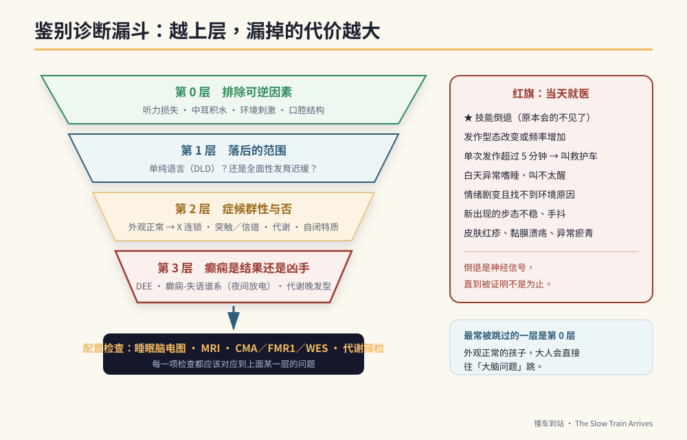

## 背景与痛点

「男孩、外观完全正常、语言迟缓、智力落后、三到五岁出现癫痫。」

这五个条件凑在一起的时候，家长会遇到一个特殊的困境：**每一位专业人员都只回答自己那一块，而没有人把整张图拼给你看。**

耳鼻喉科说听力没问题。复健科说要做语言治疗。小儿神经科说癫痫先控制住。遗传科说可以考虑做检测。特教老师说先办鉴定安置。每一句都对，但你回到家仍然不知道：**这五个特征到底是一件事，还是五件事？**

这一章给你那张图。它是一个漏斗——从最外层「可逆的、可治疗的、最不该漏掉的」开始，一层一层往内收。

> ⚠️ **医疗免责**
> 本章是**理解框架**，不是诊断流程，更不能拿来自我诊断或推翻医师判断。每一层该做哪些检查、什么时候做、要不要做，都由医师依孩子的实际状况决定。这一章的用途是：让你在门诊时听得懂、问得出、也记得住。

---

## 核心设计：四层漏斗

漏斗的顺序不是随便排的。它按照一个原则：**越上层，漏掉的代价越大。**

| 层 | 问题 | 为什么放在这一层 | 主要工具 |
|----|------|----------------|---------|
| **第 0 层** | 是不是「听不到、所以不会说」？ | 可完全矫正，漏掉等于白费数年训练 | 听力检查、中耳评估 |
| **第 1 层** | 是**单纯语言**落后，还是**全面**落后？ | 决定训练是「单科」还是「整体」 | 儿童发展联合评估 |
| **第 2 层** | 是症候群性，还是非症候群性？ | 决定要不要往全身系统排查 | 理学检查、外观特征、家族史 |
| **第 3 层** | 癫痫是**结果**，还是**凶手**？ | 决定治疗是否需要更积极 | 睡眠脑电图、脑部影像、基因、代谢 |

---

## 实作

### 第 0 层：先把「物理与环境」排除掉

这一层看起来最基础，却是最常被跳过的一层——因为孩子的外观正常，大人会直觉往「大脑问题」跳。

| 要排除的 | 为什么 | 怎么查 |
|---------|--------|--------|
| 听力损失、中耳积水 | 听损儿童外观完全正常；反复中耳积水会造成间歇性的传导性听损，孩子听到的是一段一段的语音 | 纯音听力检查、耳声传射、鼓室图 |
| 环境刺激不足 | 主要照顾者极少对话、长时间 3C、多语混杂输入 | 诚实回顾一日作息，不必羞愧，只需诚实 |
| 口腔动作结构问题 | 舌系带、腭裂等会影响构音（但不影响理解） | 口腔理学检查 |

**这一层的关键提问是：「他是听不到、听不清，还是听到了但解不开？」** 三种的处理完全不同。

### 第 1 层：单纯语言落后，还是全面落后？

| | 发展性语言障碍（DLD／SLI） | 全面性发育迟缓 |
|---|---|---|
| 智力（非语文） | 正常范围 | 落后 |
| 生活自理 | 符合年龄 | 落后 |
| 语言 | 明显落后 | 落后（与整体一致） |
| 训练重点 | 语言治疗为主轴 | **认知、注意力、动作先行**，语言随后 |

这一层决定了训练的重心。**如果是全面性落后，只做语言治疗的投报率会很低**——因为孩子不是「有想法说不出来」，而是连要表达的那个想法都还没成形。此时职能治疗（注意力、手眼协调）与认知训练必须同步进行，语言才推得动。

本书的个案属于后者：智力与语言双重落后，而生活自理反而发展得很好。这个组合本身就是重要信息——**它说明训练是有效的，只是过去主要作用在自理，而非语言。**

### 第 2 层：症候群性，还是非症候群性？

「外观完全正常」是本书个案最重要的一条线索。它把诊断可能性收敛了一大半。

在遗传性智能障碍合并癫痫的个案中，相当比例（常见估计约六到七成）**外观完全正常**——五官端正、骨骼正常、身材比例正常。这一群被称为**非症候群性**：突变只微观地影响大脑突触或离子信道，不影响外形发育。

外观正常时，临床上会优先考虑的方向：

**A. 男性特有的 X 染色体连锁疾病**
男性只有一条 X 染色体，该染色体上的关键基因一旦突变就直接发病。

- **脆折 X 症候群（FMR1）**：男性遗传性智力与语言落后**最常见**的原因。幼儿期外观往往完全正常（长脸、大耳等特征多在青春期后才明显），常合并过动、眼神接触差、语言重复。**这是男童几乎必查的一项。**
- **ARX**：影响 GABA 神经元发育，表现为智力落后合并严重语言障碍，外观无异常。
- **KDM5C**：明显认知障碍与表达性言语丧失，外观正常。

**B. 突触与离子信道的新发突变**
`SYNGAP1`、`GRIN2B`、`SLC6A1` 这一群。典型轨迹是：幼儿期中重度智力与语言迟缓 → **3 至 5 岁爆发癫痫** → 青春期后癫痫逐渐较好控制，但认知与语言障碍留下来。

这条轨迹与本书个案高度吻合。

**C. 隐性代谢疾病**
出生时完全正常，随毒素累积逐步侵蚀。这一群单独在第 4 章处理，因为**其中有极少数是可以治疗的**。

**D. 自闭症类群（ASD）**
外观正常，核心在社交沟通障碍与重复刻板行为。它不是上面三者的替代选项——**它可以与上面任何一项并存**，而且在本书个案身上，自闭特质确实与神经损伤同时存在（见第 5 章）。

### 第 3 层：癫痫是结果，还是凶手？

这是整个漏斗最关键、也最容易被误解的一层。

三到五岁这个时间点不是巧合。它是大脑神经网络快速复杂化的阶段，也是许多离子信道与突触基因异常「爆发」的高峰期。临床上会沿三个方向排查：

**方向一：发育性及癫痫性脑病（DEE）**
基因异常同时造成发育迟缓与癫痫——癫痫和迟缓是**同一个原因的两个结果**，而不是谁造成谁。

**方向二：癫痫-失语症谱系**
以兰道-克莱夫纳症候群（LKS）为代表。孩子在发病前语言可能大致正常或仅轻微迟缓，之后出现**听觉失认**——听力完全正常，却突然像听不懂人话一样，语言能力急速倒退。

这一群的关键在于：**放电多半发生在睡眠中**（睡眠期癫痫电状态，CSWS）。白天二十到三十分钟的常规脑电图，经常抓不到。

**方向三：代谢性疾病的晚发型**
三岁前毒素累积未达饱和，只表现为「太乖、不哭、轻微迟缓」；三岁后重创皮质，开始频繁发作与全面退化。这一群见第 4 章。

> 🔍 **这一层真正的重点，不是分类，是「有没有在偷走东西」**
> 癫痫性脑病最恶劣的地方，不是发作本身——发作看得见，你会送医。真正的伤害来自**持续性的异常放电，尤其是夜间的**。它像白蚁一样，安静地吃掉孩子原本具备的专注力、记忆与语言。
> 你看到的不是抽搐，是「他最近怎么变得特别暴躁」「原本会的怎么忘了」。

### 红旗清单：出现任何一项，当天就医

```text
【技能倒退】★ 最重要的一条
  □ 原本会叫的称呼不叫了
  □ 原本听得懂的指令听不懂了
  □ 原本会自己做的事（如厕、进食）退回需要协助
  □ 原本会说的词不见了

【发作型态改变】
  □ 发作形式和以前不一样（例如从失神变成全身僵直）
  □ 发作频率明显增加
  □ 单次发作超过 5 分钟，或连续发作之间意识没有恢复  → 叫救护车

【行为与意识】
  □ 白天异常嗜睡、叫不太醒
  □ 情绪突然变得极度暴躁或过动，且找不到环境原因
  □ 新出现的步态不稳、手抖、视力抱怨

【药物相关】
  □ 异常大量掉发、持续呕吐、皮肤出现红疹或黏膜溃疡
  □ 身上出现不明原因的瘀青或牙龈出血
```

最后两项与抗癫痫药物的已知不良反应有关（皮肤黏膜反应、血液与肝功能影响），一旦出现应立即联系主治医师，**不要自行停药**——突然停用抗癫痫药物可能诱发癫痫重积状态。

### 检查配置对照表

| 检查 | 主要回答的问题 | 什么情况下特别必要 |
|------|--------------|-----------------|
| 纯音听力／鼓室图 | 是不是听不到 | 任何语言迟缓，**第一步** |
| 儿童发展联合评估 | 落后是全面还是单科 | 学龄前必做；学龄后每次重新安置前 |
| 染色体芯片（CMA） | 有没有较大片段的重复／缺失 | 智能障碍合并多重异常 |
| FMR1（脆折 X） | 男性最常见的遗传性智能障碍 | **男童几乎必查** |
| 全外显子定序（WES） | 单点突变 | 上述皆正常、且结果可能影响用药时 |
| **睡眠脑电图** | 夜间是否仍在放电 | **怀疑退化、注意力恶化、情绪异常时** |
| 脑部磁振造影（MRI） | 结构异常（如局灶性皮质发育不良） | 难治型癫痫；一般 MRI 正常不代表没有 |
| 代谢筛检（血、尿） | 可治疗的代谢异常 | 见第 4 章 |

**表中最值得多说一句的是睡眠脑电图。** 常规脑电图与睡眠脑电图不是同一件事，前者正常不代表后者正常。当孩子出现「不明原因的注意力恶化、情绪暴躁、学习停滞」时，**问医师一句「需不需要安排睡眠脑电图」，是这一章最实用的一句话。**

---

## 现场踩雷

**踩雷一：跳过第 0 层。**
孩子外观正常又聪明伶俐，大人直接往「发展问题」跳，结果两年后才发现是反复中耳积水。这种案例并不罕见，而它是这个漏斗里唯一**完全可矫正**的一层。

**踩雷二：把自闭特质当成「另一个诊断」，于是二选一。**
「他到底是自闭症还是智能障碍？」——这个问句本身有问题。两者可以并存，而且在神经发育障碍里并存是常态。教学上也不需要二选一：自闭特质决定**怎么教**（结构化、可视化、可预测），认知落后决定**教到哪**（难度与步骤数）。

**踩雷三：常规脑电图正常就放心。**
如第 3 层所述。真正该问的是「这次做的是哪一种脑电图、有没有涵盖睡眠期」。

**踩雷四：把「发育倒退」当成叛逆或懒惰。**
青春期的孩子退步，大人的第一直觉常是行为问题。但在有癫痫病史的孩子身上，**倒退是神经信号，直到被证明不是为止**。顺序不能反过来。

**踩雷五：漏斗跑完就不再回头。**
漏斗不是一次性的。孩子每一次出现「说不出原因的退步」，都应该从第 0 层重新走一遍——听力可能后天变化，放电可能重新出现，药物浓度可能因体重成长而相对不足。

---

## 效益与验收（DoD）

| 项目 | 验收标准 |
|------|---------|
| 第 0 层已排除 | 一年内有正式听力检查纪录，结果正常或已处置 |
| 落后范围已界定 | 手上有一份发展评估报告，能说出是全面落后或单科落后 |
| 男童必查已完成 | 已做过 FMR1（脆折 X）检测，或医师明确表示不需要并说明理由 |
| 放电状态已确认 | 知道最近一次脑电图是**何时、哪一种**（常规／睡眠），以及结论 |
| 红旗已张贴 | 上方红旗清单印出来贴在冰箱或家庭群组置顶 |
| 认知一致 | 主要照顾者都同意：**技能倒退＝医疗事件，不是行为问题** |

最后一项是这一章最重要的产出。它未必会用到；但需要用到的那一天，它会决定反应速度是当天还是三个月后。

> 💡 君之一席话
> 「诊断这件事，家长最常犯的错不是查得不够，是**查得太集中在最下面那一层**。你为了那个还没找到的基因跑遍全台，而最上面那层——他这半年到底听不听得清楚——已经两年没有人量过了。」

---


# 第4章　可逆的那一小群：先天性代谢异常与「要不要再验一次」

## 背景与痛点

第 2 章讲了一件让人泄气的事：**大多数基因诊断不会改变今天的教学。**

这一章要讲那个例外。

在所有导致智力落后、语言迟缓与幼儿期癫痫的病因里，有一小群是**先天性代谢异常**（Inborn Errors of Metabolism, IEM）——身体缺少某个酵素、辅酶或运输蛋白，导致无法正常获取能量，或无法排出代谢废物，毒素在大脑累积。

这一群的比例不高。但它有两个性质，让它值得单独占一章：

1. **其中极少数是可以治疗的。** 不是「改善」，是换一种饮食或补一种维生素，癫痫就控制住了、认知就不再退化。
2. **错过的代价是不可逆的。** 大脑被毒素侵蚀的部分不会回来。

换句话说，这是整份鉴别诊断里**期望值最不对称**的一格：几率低，但漏掉的损失极大。

> ⚠️ **医疗免责**
> 本章提到的生酮饮食、大剂量维生素治疗、特殊配方奶粉、蛋白质限制，**全部都是处方级的医疗处置**，必须由小儿神经科或新陈代谢／遗传专科医师评估后运行，并在营养师监控下进行。
> **自行尝试生酮饮食是危险的**：它会影响抗癫痫药物的代谢、电解质与生长，在没有适应症的孩子身上做，只有风险没有好处。这一章的用途是「知道要问什么」，不是「知道要做什么」。

---

## 核心设计：四类代谢疾病与它们的破坏方式

| 类型 | 破坏方式 | 代表疾病 | 关键特征 |
|------|---------|---------|---------|
| **毒素累积型** | 无法代谢的中间产物在脑部累积 | 苯酮尿症（PKU）、枫糖尿症（MSUD）、甲基丙二酸血症、丙酸血症 | 出生时正常；**发烧或感染后急性恶化** |
| **能量供应型** | 大脑拿不到燃料 | 粒线体疾病（如 MELAS）、**GLUT1 缺乏症** | 外观完全正常；发烧／饥饿后爆发 |
| **辅酶依赖型** | 缺少合成神经传导物质的关键辅酶 | **维生素 B6 依赖性癫痫** | ★ 一般抗癫痫药物**完全无效** |
| **储积型** | 大分子在细胞内堆积 | 溶体储积症、黏多糖症早期 | 早期外观无异常，**进行性退化** |

这张表里有两格加了星号，因为它们是「治疗方式完全不同」的两个：

**GLUT1 缺乏症。** 大脑的葡萄糖运输车坏了——血糖正常，但糖进不去大脑。孩子外观完全正常，表现为发展迟缓与各式各样的癫痫。治疗不是抗癫痫药，而是**生酮饮食**：让身体改烧酮体，绕过坏掉的运输蛋白，直接喂饱大脑。适应对的个案，效果可以是戏剧性的。

**维生素 B6 依赖性癫痫。** 缺少的是合成神经传导物质的辅酶。这类癫痫用常规抗癫痫药物压不住，必须用**大剂量维生素 B6**。它罕见，但它是所有难治型癫痫评估中必须被想到的一项。

这两者的共同点是：**如果不去想，就永远不会被发现**——因为孩子外观正常，常规检查也可能正常。

---

## 实作

### 一、三道防线（各自的时间窗口不同）

| 防线 | 时机 | 做什么 | 能避免什么 |
|------|------|--------|-----------|
| **第一道** | 孕前／产前 | 夫妻双方带因者筛检；已知家族史者可考虑产前诊断或胚胎着床前检测 | 避免**下一胎**发病 |
| **第二道** | 出生 48 小时 | 新生儿筛检（足跟血、串联质谱仪，一次可筛数十种） | 在**大脑受损前**拦截 |
| **第三道** | 已发病 | 确诊病因 + 特殊医疗干预（饮食控制、辅酶补充、避免代谢危机） | 阻止**继续**退化 |

第二道防线的意义值得多说一句：这类疾病的宝宝**出生时外观完全正常**。若能在大脑受损前发现并立即介入，孩子长大后的智力与语言，可以与一般人无异。台湾的新生儿筛检涵盖率极高，这是这个社会做过最划算的一项公共卫生投资。

而对于已经十六岁的孩子，能做的只剩第三道防线。这也是下一节要回答的问题。

### 二、十六岁了，还要再验一次吗？

这是本章真正要回答的问题。答案不是「要」或「不要」，而是一组判准。

**倾向「值得再问一次医师」的信号：**

```text
□ 有过「发烧或感染之后，状况明显变差且没有完全回来」的经验
□ 曾经出现过原因不明的意识改变、呕吐、极度嗜睡
□ 生长曲线异常（过矮、过瘦、或青春期发育明显落后）
□ 有肌肉无力、运动耐受力特别差、容易极度疲倦的表现
□ 抗癫痫药物效果一直不理想，或需要不断加药
□ 有进行性退化：原本会的东西，这几年慢慢不见了
□ 新生儿筛检当年项目较少（早年的筛检涵盖范围比现在小）
□ 家族中有不明原因的婴幼儿早夭、或类似表现的近亲
```

**倾向「代谢疾病可能性低」的信号：**

```text
□ 癫痫已用单一药物稳定控制多年，未曾难治
□ 没有进行性退化——能力是「停滞」而非「消失」
□ 生活自理能力持续进步（毒素累积型多半反向：能力逐年减少）
□ 生长、体能、耐力大致正常
□ 新生儿筛检报告正常，且当年涵盖项目完整
```

本书的个案落在第二组：药物控制稳定多年、自理能力持续进步、无进行性退化。**代谢疾病的可能性因此偏低**——但「偏低」不等于「不必问」。**在下一次回诊时把上面第一组清单念一遍给医师听，成本是三分钟。**

### 三、无论有没有代谢疾病，这一条都要记住

代谢异常的孩子最怕两件事：**长时间饥饿**与**发烧感染**。两者都会触发身体的分解代谢压力，组织大量分解、释放毒素，可能引发急性恶化。

而这条原则的实用价值远超过代谢疾病本身——**任何有癫痫病史的孩子，生病时的照护原则都与之相通**：

```text
【孩子生病（发烧／肠胃炎／食欲差）时的家庭原则】

1. 不要长时间禁食
   即使没食欲，也要少量多次补充含糖的液体（运动饮料、稀释果汁、
   米汤）。禁食超过数小时而完全没有热量摄取，是最该避免的状态。

2. 呕吐到喝不下 → 就医，不要在家硬撑
   喝不下＋持续呕吐＝需要静脉输液的信号。

3. 发烧要积极处理
   发烧本身会降低癫痫发作阈值。退烧药的使用请事先问过医师，
   把答案写在健康手册上，不要在半夜临时决定。

4. 抗癫痫药不能因为呕吐就自己停掉
   吐掉药该不该补一次、怎么补，事先问医师并写下来。
   ★「生病时的用药处置」是每次回诊最值得花两分钟确认的事。

5. 准备一张「急诊卡」
   放皮夹与书包各一张，内容见下。
```

### 四、急诊卡

孩子在急诊室最大的风险，是接手的医师不认识他。一张卡片能解决大部分问题。

```text
┌─────────────────────────────────────────────┐
│ 【紧急医疗信息卡】                            │
│                                             │
│ 姓名／生日／血型                              │
│ 身心障碍证明：类别、等级、证号                 │
│                                             │
│ 诊断：                                       │
│   癫痫（发病年龄：__ 岁）                     │
│   智能障碍／发展迟缓                          │
│                                             │
│ 目前用药：                                    │
│   药名 ______ 剂量 ______ 服药时间 ______     │
│   （★ 请勿自行停用；停药可能诱发重积状态）      │
│                                             │
│ 已知过敏／禁忌药物：______                     │
│ 曾做过的检查：EEG（__年__月）MRI（__年__月）   │
│              基因检测（__年__月，结果：___）   │
│                                             │
│ 平常发作型态：______________                  │
│ 平常发作时长：约 __ 分钟                       │
│ 家属应叫救护车的判准：发作 > 5 分钟             │
│                                             │
│ 沟通提示：                                    │
│   听得懂简单指令，说话以短句／单词为主           │
│   焦虑时可用「火车」相关话题安抚                │
│   不喜欢突然被触碰，动作前请先说明               │
│                                             │
│ 主治医院／科别／医师：______                   │
│ 紧急联系人：______ 电话：______                │
└─────────────────────────────────────────────┘
```

最后那一段「沟通提示」是很多家庭不会想到、但急诊人员最感谢的一段。**它把固着兴趣变成了医疗现场的镇定工具**——这是本书核心命题在最意外的地方的一次应用。

### 五、带去门诊的提问脚本

```text
1. 以孩子目前的表现，还有没有必要排查先天性代谢异常？
   （如果医师认为不必，请问是根据哪些表现排除的？）

2. 他当年的新生儿筛检，涵盖了哪些项目？当年没筛到、
   而现在有在筛的项目里，有没有值得补做的？

3. 生病、发烧、吃不下的时候，我在家里该怎么处理？
   什么情况下必须直接送急诊？

4. 如果呕吐把药吐掉了，要不要补服？怎么补？

5. 退烧药我可以用哪一种？有没有要避开的？
```

把答案写在健康手册的第一页。**这五个问题的答案，在半夜三点的价值，远高于任何一份基因报告。**

---

## 现场踩雷

**踩雷一：看到「生酮饮食有奇效」就自己开始。**
生酮饮食是处方级治疗，需要营养师计算、定期抽血监控，并且会与抗癫痫药物交互作用。在没有适应症（如 GLUT1 缺乏症、部分难治型癫痫）的孩子身上运行，只有风险。

**踩雷二：把「代谢疾病可能性低」读成「不用管饮食」。**
两件事无关。第 11 章会说明，饮食对这类孩子的意义在别的地方——血糖稳定度、药物副作用管理、肠道与体重。

**踩雷三：生病时「让他休息、先不要吃」。**
这是最直觉、也最该避免的一个做法。发烧＋禁食＋抗癫痫药吐掉，是诱发发作的经典组合。

**踩雷四：急诊卡做好了，但放在家里抽屉。**
放皮夹、放书包、拍照存在两位照顾者的手机里、传一份到家庭群组并置顶。用不到最好，用到的时候通常没空回家拿。

---

## 效益与验收（DoD）

| 项目 | 验收标准 |
|------|---------|
| 代谢排查已定案 | 已向医师问过「还需不需要排查代谢异常」，并知道结论的依据 |
| 生病原则已成文 | 家中有一份「生病时怎么办」的书面原则，含退烧药与补药处置 |
| 急诊卡已就位 | 皮夹、书包各一张；两位照顾者手机各有一张照片 |
| 禁食风险已认知 | 主要照顾者都知道「长时间完全不进食」是需要避免的状态 |
| 未自行实施饮食疗法 | 没有在未经医嘱的情况下运行生酮或蛋白质限制 |

> 💡 君之一席话
> 「这一章的几率很低，低到你可能永远用不上。但**期望值不是只看几率，还要看漏掉的代价**——而在这一格里，漏掉的代价是一个大脑。用三分钟问一句，是这本书里投报率最高的三分钟。」

---


# 第5章　疫苗、时序与因果：怎么看待「打完针之后才发生的事」

## 背景与痛点

有些家庭的病历上有这样一行：癫痫首次发作，发生在某次疫苗接种之后。

而有些家庭手上还有一张纸——预防接种受害救济的审议结果。

这行字和这张纸，会在往后的十几年里，反复折磨一个人。**「如果当年没带他去打那一针，他是不是就好好的？」** 这个问句在孩子每一次退步、每一次被同学排挤、每一次深夜发作时，都会重新回来一次。

这一章不回避这个问题。它要做三件事：

1. 把「时序」与「因果」拆开——这是全章的骨干；
2. 说明一条线索（**发病之前就已经存在的早期征象**）如何改变整个因果图；
3. 给你一套向长辈、向医师、向鉴定委员、以及向自己解释这段病史的说法。

> ⚠️ **医疗免责**
> 本章讨论的是**单一个案的病史推论**，不是疫苗安全性的公卫结论。疫苗接种是否进行、如何进行，请依主治医师与现行预防接种建议。任何人不应以本章内容作为停打疫苗的依据——理由见本章「现场踩雷」第一项。

---

## 核心设计：三种因果模型

「打完针之后发生的事」，在逻辑上至少有三种可能。它们的临床意涵完全不同。

| 模型 | 说法 | 意涵 |
|------|------|------|
| **A　纯后天损伤** | 大脑本来完全健全，疫苗引发的免疫反应（如急性弥漫性脑脊髓炎 ADEM）造成损伤 | 损伤源自外部事件 |
| **B　纯巧合** | 大脑本就带有异常，三到五岁本来就是发作高峰期，疫苗只是刚好在那个时间点 | 疫苗无因果角色 |
| **C　触发模型** | 大脑本就带有微观的隐性异常，发烧与免疫反应扮演**催化剂**，把潜伏的问题提前引爆 | 两者都有份，但底子是先天的 |

三个模型看起来像是在争论责任归属，但它们真正的差别在**临床意义**：

- 如果是 A，那么理论上损伤有明确的起点与范围，且**下一胎完全不受影响**；
- 如果是 B 或 C，那么底层有一个尚未找到的神经体质问题，**这会影响用药选择、也影响遗传咨询**。

### 一条会改写整张图的线索

在本书的个案里，母亲在多年后补上了一句话：

> 「但有一件事——在打日本脑炎疫苗之前，其实就有点异常了：他不太哭闹。」

这句话的份量，比任何一份影像报告都大。

婴儿期「太乖、不哭闹」在民间是福气，在神经发育医学上却是一个需要注意的表现——**神经系统对外界刺激的反应过低**。它可能反映两件事：

**其一，早期的自闭特质。** 社交动机低的婴儿不需要靠哭闹来换取抱抱与注意；他们对天花板的电风扇、对转动的物体，比对人的脸更有兴趣，于是显得异常安静。

**其二，感觉输入的阈值较高。** 一般婴儿尿布湿、肚子饿、有轻微不适就会大哭；阈值高的孩子，这些信号传得慢、传得弱，他「勉强可以忍受」，于是不哭不闹。

而这条线索与孩子十六岁的样子完全接得上：**今天他对火车与游乐园的强烈固着，不是三到五岁突然长出来的，它是从婴儿床上那个安静的孩子一路长过来的。**

一旦这条线索成立，模型 A（纯后天损伤）的可能性就大幅下降——因为**在疫苗事件之前，神经系统就已经在表现差异了**。

### 一份「分配」，以及它的诚实边界

在早期的规划数据里，这个个案的病因曾被分配成这样的比例：先天隐性异常被触发约六成五、微观脑结构发育异常约两成、代谢异常约一成、纯疫苗引发的自体免疫脑炎不到半成。

> 🔍 **这些数字该怎么用**
> 这是一种**临床推论式的几率分配**，用来表达「哪一种解释比较合理」，而**不是**任何一份流行病学研究的统计结果。没有一份研究会告诉你某个孩子有 65% 的几率属于某类病因。
> 它的正确用法是**排序**：先天底子＋触发 ＞ 微观结构异常 ＞ 代谢 ＞ 纯疫苗损伤。它的错误用法是把「65%」写进任何一份正式文档。
> 这本书会在每一个出现数字的地方标明它的等级——这是附录 C 的核心原则之一。

### 那么那张救济证明，代表什么？

预防接种受害救济的审议，判断的是**「无法排除关联」**，并非科学上的因果证明。它的设计初衷是社会补偿：当一个人在接种后出现严重不良结果，而医学无法明确排除关联时，社会共同承担，而不是让这个家庭独自承担。

这是一个好制度，而它的逻辑与科学因果推论不同。

**所以那张纸的正确理解是：** 它证明这个家庭有权获得补偿与支持，它不证明「疫苗毁了这个孩子」。这两件事可以同时成立——而分清楚它们，是家长能为自己做的一件很重要的事。

---

## 实作

### 一、回头把早期线索补齐

多数家庭的病史时间轴是从「第一次发作」开始写的。但真正有用的时间轴，起点在更早。

拿一张纸，回想孩子三岁以前，逐项打勾（**没有的项目留白就好，这不是在找谁的错**）：

```text
【婴儿期（0–12 个月）】
  □ 异常安静、不太哭闹、可以自己躺很久
  □ 尿布湿／肚子饿不太表示
  □ 不太要求抱抱、不太黏人
  □ 对物品（风扇、轮子、光影）比对人脸更有兴趣
  □ 叫名字反应不稳定（但听力检查正常）
  □ 喂食困难、吸吮无力、或明显的低肌张力（软趴趴）
  □ 眼神接触少

【幼儿期（1–3 岁）】
  □ 不太用手指东西（指物分享）
  □ 少有「拿东西给你看」的动作
  □ 语言起步晚、或起步后停滞
  □ 对特定物品、路线、顺序特别坚持
  □ 对声音、触感、食物质地有明显偏好或抗拒
  □ 走路、跑跳等大动作明显落后

【疫苗／发烧事件之后】
  □ 发作型态、频率
  □ 事件后有没有「原本会的东西不见了」（★ 最关键）
  □ 情绪、睡眠、食欲的变化
```

第三段最后那一项是核心。**如果事件之后出现明确的「技能消失」，那是退化，临床意义完全不同**（见第 3 章红旗清单）；如果只是「原本就慢，之后更慢」，那更接近触发模型。

这张表填完，带去给主治医师看。它可能会改变医师对整段病史的理解——**而这件事，只有你做得到，因为只有你在场。**

### 二、四套说法

同一段病史，对不同对象要用不同说法。这不是虚伪，是沟通。

**（一）对医师（要精确、要时序）**

```text
「孩子在 X 岁 X 月接种 ___ 疫苗，接种后 ___ 小时／天出现发烧，
 体温最高 ___ 度，之后出现第一次抽搐，型态是 ___，持续约 ___ 分钟。
 事件之后，他的 ___ 能力有／没有明显改变。
 另外要补充的是：在这个事件之前，他就已经有 ___（早期线索）。」
```

最后那一句是重点。医师需要它来判断底层是否存在先天因素。

**（二）对长辈（要简短、要止血）**

```text
「医师说，他的大脑本来就有一点跟别人不一样，
 那一针比较像是把本来就会发生的事提早引出来。
 就算当年没打，发烧、感冒也可能引出来。
 这不是谁的错，我们现在把力气放在他往后四年要学的事情上。」
```

不要在长辈面前展开几率分配与模型比较。**在家族场合里，你的目标是让话题结束，不是让对方理解神经学。**

**（三）对鉴定委员／学校（要功能、不要悲情）**

```text
「他的病史是：早期即有神经发育差异，三到五岁期间因免疫事件诱发癫痫，
 目前药物控制稳定多年。**认知与语言的落后是既存且稳定的**，
 没有进行性退化。
 他目前的功能是：生活自理完全独立、可运行单步骤到双步骤指令、
 情绪可在提示下自我调节。
 我们申请的支持是：___（具体项目）。」
```

第 34 章会完整处理这个场合。这里先给出原则：**鉴定会议上，病史只是背景，功能才是主角。**

**（四）对自己**

这一段最难，所以放在最后。

如果那个「早期线索」成立——如果在那一针之前，孩子的神经系统就已经在走一条不同的路——那么有两件事同时为真：

**第一，你当年没有做错任何事。** 带孩子去接种是照着建议做的，而触发它的也可能是一场感冒、一次发烧、或大脑在那个年纪自然进行的神经修剪。

**第二，你这十六年做对的事情，比你以为的多。**

那个「不哭不闹」的低反应底子，本来可能长成一个封闭、退缩、难以接触的青少年。而现在他脾气好、人缘佳、想当小帮手、生气时忍得住。这不是疾病的自然病程——**这是十六年教养的结果**。

在同样程度的认知落后里，能同时做到「完全独立自理 + 情绪可控 + 有正向社交动机」的比例并不高。你不是把一个健全的孩子养坏了，你是把一个先天走岔了路的孩子，养到了很前面的位置。

---

## 现场踩雷

**踩雷一：把个案经验推广成公卫结论。**
这是最必须明说的一项。单一个案的不良结果，无论多么真实、多么沉重，**都不足以支撑「不要打疫苗」的结论**。严重神经后遗症在大规模接种中属于极罕见事件（常被引用的量级是百万分之一），而不接种所面对的疾病风险（日本脑炎的致死与致残率）远高于此。
一个家庭有权为自己的遭遇感到愤怒与哀伤。但把这份遭遇转成对其他家庭的建议，会让另一群孩子承担本可避免的风险。**你可以诚实地说「我们家发生了这件事」，同时说「这不代表你们家也会」。**

**踩雷二：把因果争论带进日常教养。**
有些家庭把大量时间投入在「证明是疫苗造成的」。这件事在法律与补偿的层面有意义，但在教养层面，它每一分钟都在排挤训练。**归因是过去式，训练是现在进行式。**

**踩雷三：因为内疚而不敢设限。**
这是最隐形的一种伤害。「他已经这么可怜了，就让他多讲一下火车吧」——内疚会让大人放弃结构，而放弃结构会让孩子失去他最需要的可预测性。**补偿孩子的方式是给他能力，不是给他纵容。**

**踩雷四：用「都是那一针害的」在孩子面前说。**
他听得懂的比你以为的多。一个从小听着「你本来是好好的」长大的孩子，会学到一种对自己的叙事：我是坏掉的版本。

---

## 效益与验收（DoD）

| 项目 | 验收标准 |
|------|---------|
| 早期线索已还原 | 完成上方三段清单，并在下次回诊时交给医师 |
| 时序已精确 | 能说出接种到发烧、发烧到首次发作的时间间隔与发作型态 |
| 退化与否已确认 | 明确知道事件后有无「技能消失」，并已告知医师 |
| 四套说法已备妥 | 对医师、长辈、鉴定场合各准备一段，并实际用过至少一次 |
| 因果与补偿已分离 | 能说出「救济证明是行政认定，不是科学因果证明」 |
| 内疚不再驱动决策 | 最近一个月内，没有因为「觉得亏欠」而放弃一次既定的规则 |

最后一项无法量化，但它是这一章唯一真正的目标。

> 💡 君之一席话
> 「时序不是因果，这句话在逻辑课上是常识，在一个母亲心里却要走十六年。**而走完之后，你会发现真正该问的问题从来不是『当年为什么』，是『剩下的四年怎么办』**——后面这个问题，还来得及。」

---


# 第6章　十六岁的定位：从开发期切换到转衔期

## 背景与痛点

十六岁，是一个没有人会提醒你的转折点。

三岁有早疗，六岁有入学鉴定，十二岁有国中安置——每一个关卡都有人通知你、有表格要填、有时程要跑。而十六岁什么都没有。你照常送他上学，照常回诊拿药，照常在晚餐桌上听他讲火车。

然后某一天，转衔老师会问你一句：「毕业以后有想过去哪里吗？」

**那时候通常只剩两年。**

这一章要做的事，是把这个问句提前四年问。并且说明：十六岁要换的不只是规划，而是**整套目标函数**。

---

## 核心设计：三个切换

### 切换一：目标从「说得更多」换成「沟通得成」

语言的关键发展窗口在学龄前。到了十六岁，把主力放在「让他多说几个字」，投报率会很低——不是零，是低到不值得当成主轴。

该接手的是**功能性沟通**：他能不能让别人知道他要什么、不要什么、痛在哪里、需要帮忙。

| | 开发期目标（3–10 岁） | 转衔期目标（15 岁后） |
|---|---|---|
| 语言 | 词汇量、句长、构音清晰度 | **表达得成**：能传达需求、拒绝、求助 |
| 工具 | 以口语为主 | 口语 **＋ 替代沟通（AAC）**：图卡、沟通板、平板 |
| 认知 | 概念、学科基础 | **功能性认知**：金钱、时间、安全、路线 |
| 行为 | 减少问题行为 | **自我调节**：能自己喊停、自己求助 |
| 主体 | 大人交办、大人提醒 | **自我启动**：看到提示卡就自己开始 |
| 场域 | 教室与家庭 | **社区、通勤、工作现场** |

> 🔍 **为什么「求助」被放在这么高的位置**
> 在庇护工场与小作所的现场，决定一个人能不能待下来的，往往不是他做得多快、多好，而是**出状况时他会不会说**。
> 一个会说「老师，我太累了，我想喝水休息」的人，主管可以管理；一个累了就直接发脾气、或直接坐在地上的人，主管管不了。
> 这一句话的训练，第 16 章会整章展开。它可能是这本书里投报率最高的一句台词。

### 切换二：从「消除固着」换成「驾驶固着」

开发期常见的目标是「减少刻板行为」。转衔期不同——**固着是这个阶段唯一还在全速运转的动机引擎**，把它拆掉，你就没有燃料了。

转衔期对固着的处理是三个动作，不是压抑：

1. **限时**：固着话题有明确的时间框（视觉计时器），时间内大人全力奉陪；
2. **结构化**：在时间框里把「无目的碎念」升级成「有组织的叙述」（第 10 章）；
3. **插件任务**：把要练的能力包进火车与游乐园的壳里（第四篇整篇）。

### 切换三：从「学校会安排」换成「你要开始排队」

这是最现实的一个切换。

台湾的特殊教育在法定上保障到高中职阶段。毕业之后，孩子进入的是**成人身心障碍服务**体系——而那是一个**需要提前申请、且经常需要候补**的体系。

| 去向 | 大致适合的样子 | 提前多久开始准备 |
|------|--------------|----------------|
| **社区日间作业设施（小作所）** | 能简单沟通、生活自理、情绪大致可控、可从事简单代工 | **两年以上**（常需排队） |
| **日间照顾中心** | 自理或认知较需协助，以生活自理、体能、休闲活动为主 | 两年以上 |
| **庇护工场** | 具一定作业能力与产能，可在支持下持续工作 | 需经评估媒合 |
| **支持性就业** | 能力较佳，可在一般职场由就业服务员陪同就业 | 需经职业评量 |

> ⚠️ **制度细节请以官方为准**
> 服务类型的名称、申请条件、评估工具与排队时间，各县市不同，且会随法规调整。这张表的用途是让你知道**有哪些方向、大概要提前多久**；实际流程请向学校的**转衔老师**与户籍地的**社会局／身心障碍福利科**确认。
> 一个实用的做法：把「毕业后的去向」这个问题，在**国三的第一次 IEP 会议**上就正式提出来，并要求记录在会议纪录里。

### 为什么十六岁仍然值得做

有些家长会问：都十六岁了，还有用吗？

有，但理由要说清楚，因为说错了会导致错误的期待。

**理由一：前额叶还在重塑。** 大脑的髓鞘化与突触修剪在青春期到二十岁出头仍在进行，尤其是负责计划、抑制与决策的前额叶区。这意味着**与冲动控制、工作记忆、行为组织有关的能力，仍在可塑期内**。

**理由二：这个阶段练的是「进程」，不是「概念」。** 打勾、按顺序、看提示卡运行——这些是进程性学习，依赖的是基底核与小脑的回路，与需要语意理解的概念学习不同。**进程性学习在认知障碍者身上通常保留得相对好**，这也是为什么结构化的工作训练，在这个族群身上效果特别明显。

**理由三：现在创建的习惯，会用三十年。** 二十岁之后，他所处的环境（小作所、日照中心、家庭）变动会减少。此刻固化下来的作息、规则与沟通方式，会成为往后很长一段时间的默认值。

> 💡 **必须诚实的一句**
> 这三个理由都不包含「智力会提升」。这套计划改变的是**功能**——他能自己做到什么、能撑多久、能不能求助。智力测验的数字多半不会动，诊断也不会消失。
> 如果你期待的是后者，这本书会让你失望；如果你要的是前者，那么四年足够改变很多事。

---

## 实作：转衔期的四条战线

四条线同时走，缺一条都会在毕业那年变成麻烦。

### 战线一：医疗（维持地基）

- 抗癫痫药物的长期追踪：定期回诊，依医嘱追踪肝功能、血液指针与血中药物浓度。
- 青春期体重变化：某些抗癫痫药物与食欲增加、体重上升有关；**体重的变动可能影响剂量与代谢**，这是回诊时值得主动提起的事。
- 睡眠品质与夜间状况：见第 11 章。
- **十六岁之后的诊断仍有两个实际价值**：其一，可能影响用药选择（某些基因型对特定药物是禁忌）；其二，为家族的生育规划提供依据。

> ⚠️ **医疗免责**
> 上述追踪项目、频率与任何剂量调整，一律由主治医师决定。本节只是提醒你在回诊时可以主动提出哪些观察，不是自行监测或调整的依据。

### 战线二：沟通（创建不依赖口语的表达管道）

如果十六岁仍有显著语言障碍，强求「开口说清楚」的效果有限。应同时创建**替代性沟通（AAC）**：

- 起步最低成本的版本：**六格图卡**（我要喝水／我要上厕所／我不舒服／我想休息／我做完了／我需要帮忙）。护贝，放在口袋或挂在书包。
- 高端版本：平板上的沟通软件（语音输出），或沟通板。
- 关键原则：**AAC 不会抑制口语发展**。这是这个领域最常见的误解之一；研究上，提供替代管道反而常伴随口语表达的增加，因为沟通成功的经验本身会提高沟通动机。

那六格图卡里最重要的是最后两格。「我做完了」让他能自己结束任务，「我需要帮忙」让他不必用发脾气来表达卡住。

### 战线三：功能性认知（把学科换成生活）

十六岁之后，**认知训练的内容应该从教科书移到生活场景**：

| 领域 | 开发期做的 | 转衔期改做的 |
|------|-----------|-------------|
| 数学 | 加减乘除、应用题 | 认钞、付钱、找零、余额、看时刻表（第四篇） |
| 语文 | 造句、阅读理解 | 读懂标示、看懂图标、填基本数据 |
| 社会 | 课本知识 | 过马路、搭车、问路、遇到陌生人怎么办 |
| 生活 | 自理项目 | 自理 **＋ 家务 ＋ 简单代工的手部作业** |

第 27 章会说明，为什么职业评估的现场考的是**拿剪刀、拧抹布**这种事——那不是随便选的。

### 战线四：资源（开始排队与建档）

```text
【国三（15–16 岁）要做的】
  □ 在 IEP 会议上正式提出「毕业后去向」议题，并要求列入纪录
  □ 认识学校的转衔老师，留下联系方式
  □ 确认身心障碍证明的效期与重新鉴定时程
  □ 开始搜集：住家附近有哪些小作所／日照／庇护工场（先列清单，不必决定）

【高职一、二年级要做的】
  □ 实地参访 2–3 家机构（多数机构可预约参观）
  □ 了解各机构的收案条件与候补状况
  □ 依需要完成相关评估与申请流程（请转衔老师与社工协助）
  □ 累积「可展示的能力证据」：作业照片、任务完成纪录、老师评语

【高职三年级要做的】
  □ 完成离校前的转衔通报与服务衔接
  □ 校外实习（若有）留下正式纪录
  □ 确认毕业后第一个月的实际去处，并预留备案
```

最后那句「预留备案」是经验之谈：**候补不会照着你的毕业日期排。** 准备一个过渡期方案（居家 + 定期社区活动 + 部分时间的机构），比赌一个名额安全。

---

## 现场踩雷

**踩雷一：把转衔当成「毕业前一年的事」。**
最好的机构名额通常在毕业前一年就满了。国三开始问，不算早。

**踩雷二：用「他还小」推迟成人技能。**
十六岁不小了。以剩余的教育年限计算，他学习「上班」这件事的时间，比多数人以为的少一半。

**踩雷三：把 AAC 当成「放弃说话」。**
这句话值得再说一次：提供替代管道不会抑制口语。真正抑制口语的是**沟通失败的累积**——讲了没人懂，久了就不讲了。

**踩雷四：只顾着练能力，没有累积证据。**
机构收案、职评、鉴定会议看的都是**证据**。从国三开始，每一项新学会的技能都拍一张照、记一行字。四年后你会有一本作品集，那本作品集在会议桌上的说服力，远超过任何形容词。

**踩雷五：把所有鸡蛋放在「小作所」一个篮子。**
先列清单、都去看、都留联系方式。决定可以晚，但**认识要早**。

---

## 效益与验收（DoD）

| 项目 | 验收标准 |
|------|---------|
| 目标已切换 | 能说出这学期的三个主要目标，且**没有一个**是「多说几个字」 |
| AAC 已上线 | 六格图卡制作完成并实际使用满两周，孩子至少主动使用过 5 次 |
| 求助句已开始练 | 「我需要帮忙／我想休息」已进入日常练习清单 |
| 转衔议题已入纪录 | 毕业后去向已在 IEP 或亲师会议上正式提出并被记录 |
| 资源清单已创建 | 住家 30 分钟车程内的机构清单完成，至少已参访 1 家 |
| 证据开始累积 | 创建一个文件夹（实体或手机图库），开始存放能力证据 |
| 医疗追踪稳定 | 知道下一次回诊日期，以及这次要主动提出的观察事项 |

> 💡 君之一席话
> 「三岁时你问的是『他什么时候会说话』；十六岁你该问的是『他二十五岁那天早上，会不会有一个地方等他去』。**这两个问题的准备时间都是四年，差别在于前一个已经过去了，后一个还在你手上。**」

---


# 第二篇　三大核心：所有训练共用的三条主轴

# 第7章　三核心总览：每个活动都要能回答「这在练哪一条」

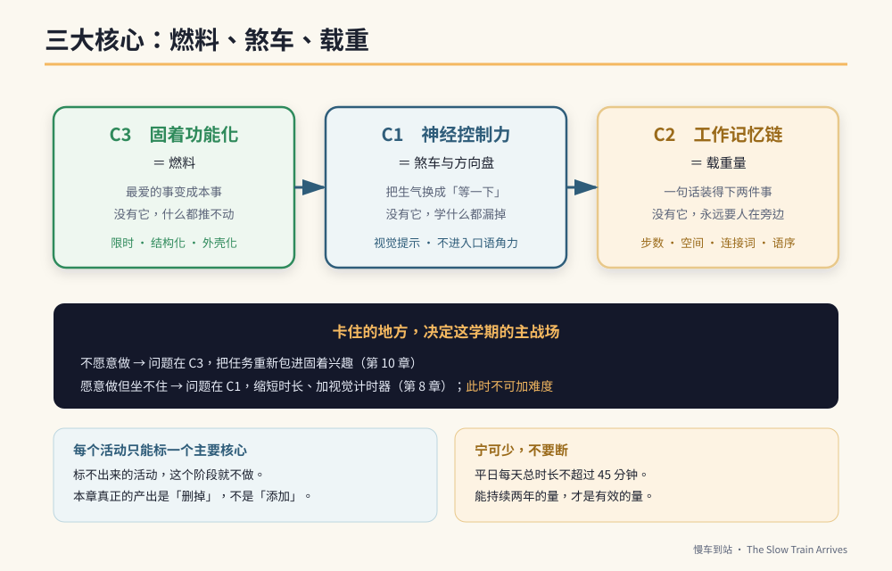

## 背景与痛点

打开任何一本特教手册或疗育网站，你会看到一份很长的活动清单：串珠、拼图、剪纸、感统、桌游、社交故事、视觉提示、代币制、结构化教学……

每一项都有道理。问题是，**它们之间没有主轴。**

没有主轴会发生两件事。

**第一，资源被平均分掉。** 你今天做串珠、明天做拼图、后天做社交故事，每一项都做了一点，每一项都没有做到能产生变化的强度。半年后回头看，孩子还在原地，而你已经累坏了。

**第二，你无法判断该停哪一项。** 因为每一项看起来都有用，你不敢停，于是清单只会越来越长。

这一章要给的就是那个主轴。它把所有训练收敛成三条核心，并要求**每一个活动都必须能明确标注自己属于哪一条**。标不出来的活动，不是不好，是**这个阶段不做**。

---

## 核心设计：三条核心与它们的分工

| 核心 | 名称 | 练的是 | 没有它会怎样 |
|------|------|--------|-------------|
| **C1** | **神经控制力**（抑制控制） | 「不要现在做」的能力：等待、停止、忍住 | 学什么都学不进去，因为坐不住、被自己的念头带走 |
| **C2** | **工作记忆链** | 「同时记住并依序运行」的能力 | 只能做单一指令，永远需要人在旁边提醒 |
| **C3** | **固着功能化** | 把最强动机接到有用的事情上 | 有能力但没有动机，训练变成拉锯战 |

三者不是并列的。它们有明确的分工，用一台车来说明最清楚：

- **C1 是煞车与方向盘。** 没有煞车，车速再快也只会撞墙。
- **C2 是载重量。** 决定这台车一趟能运几件货。
- **C3 是燃料。** 没有油，前面两者都是静止的。

> 🔍 **为什么是这三条，而不是「语言」「认知」「社交」**
> 因为后面那三个是**领域**，不是**机转**。「加强语言」这句话没有办法转成明天早上的动作，而「今天要练 C2，把指令从一步升到两步」可以。
> 更重要的是：C1、C2、C3 是**跨领域的**。同一条核心的进步，会同时出现在语言、认知、社交与工作表现上。而分领域训练的做法，会让你在语言课练的东西，到了职场现场一项都用不上。

### 三者的先后顺序

顺序是有的，而且不能乱。

```text
C3（燃料）─→ 让他愿意坐下来
     │
     ▼
C1（煞车）─→ 让他坐得住、停得下来
     │
     ▼
C2（载重）─→ 在坐得住的前提下，逐步加重
```

实务上的意思是：

- 如果孩子**不愿意做**：问题在 C3。硬推无效，该做的是把任务重新包装进他的固着兴趣里（第 10 章）。
- 如果孩子**愿意做但坐不住、做到一半跑掉**：问题在 C1。此时提高任务难度只会更糟，应该先缩短单次时长、加上视觉计时器（第 8 章）。
- 如果孩子**坐得住但记不住第二步**：问题在 C2，而这是唯一应该「加难度」的情况（第 9 章）。

**大部分的训练挫折，来自于在 C1 还没稳的时候就去推 C2。**

### 三者各自的可测量指针

这本书的每一项训练，最后都会回到这三个数字（就是第 1 章的基线）：

| 核心 | 指针 | 怎么测 | 进步的样子 |
|------|------|--------|-----------|
| C1 | `emotion_recovery_seconds` | 被打断到配合下一件事的秒数 | 数字变小 |
| C1 | `wait_tolerance_seconds` | 能安静等待的最长时间 | 数字变大 |
| C2 | `chain_length_max` | 稳定完成的指令步数 | 1 → 2 → 3 |
| C2 | `independent_task_rate` | 无额外提醒完成的比率 | 比率变大 |
| C3 | `fixation_talk_minutes` | 固着话题总时长 | **不追求变小**，追求「在时间框内」 |
| C3 | `fixation_structured_ratio` | 固着话题中「有组织叙述」的比率 | 比率变大 |

最后两项需要特别说明。C3 的目标**不是**消灭固着话题，而是让它：（一）发生在约定的时间框里，（二）从无目的碎念变成有结构的叙述。一个每天讲九十分钟火车、但都发生在约定时段、而且讲得有头有尾的孩子，比一个被压到只讲十分钟、却整天焦虑的孩子，状态好得多。

---

## 实作

### 一、活动标注卡：每个训练都要填一张

在把任何一项活动排进行事历之前，先填这张卡。填不出来的字段，就是这个活动的问题所在。

```yaml
# activity-card.yaml — 每个训练活动一张
name: 火车联结任务检核卡          # 活动名称
core: C1                          # 主要核心：C1 / C2 / C3（只能填一个）
core_secondary: [C3]              # 次要核心（可空）

what_it_trains: |                 # 练哪一条神经（用白话写，不要写「提升能力」）
  看到视觉提示 → 自主启动 → 不依赖口头催促完成
  对应的是「外部提醒」转「内部启动」的那一步

how_to_check:                     # 怎么检核（必须是可观察、可计数的）
  metric: independent_task_rate
  target: ">= 0.7"
  window: 连续两周

dose:                             # 强度（频率 × 单次时长）
  frequency: 每上学日 1 次
  duration_min: 10

stop_rule: |                      # 什么情况停止或降阶（★ 最常被漏掉的字段）
  连续 3 天出现抗拒或情绪升高 → 降阶：任务从 3 格减为 2 格
  连续 2 周达标 → 升阶：加入第 4 格，或改为跨空间任务

owner: [家长, 特教老师]           # 谁运行（两边要一致）
```

**`stop_rule` 是这张卡最重要的一栏。** 没有停损规则的训练，会在孩子明明已经在抗拒的时候还继续推——而那正是「训练变成创伤」的标准路径。

### 二、三核心快筛：你的孩子现在卡在哪一条

各题以最近两周的实际状况作答，勾「是」得 1 分。

```text
【C1　神经控制力】
  □ 被打断固着话题时，能在 2 分钟内配合下一件事
  □ 能在没有 3C 的情况下安静等待 5 分钟以上
  □ 被拒绝时，抗议停留在口语层次（不摔、不打、不自伤）
  □ 有「先做完再玩」的概念，不需要每次重新谈判
  □ 大人只用手势就能制止，不必进入口语争辩
  → C1 得分：___ / 5

【C2　工作记忆链】
  □ 能完成两步骤指令（含「然后」）
  □ 能完成跨空间任务（去另一个房间拿东西再回来）
  □ 中途被打断后，能自己回到原本的任务
  □ 能看着检核表连续完成 3 项，不需额外提醒
  □ 能处理「在 A 之前先做 B」这种逆向语序
  → C2 得分：___ / 5

【C3　固着功能化】
  □ 固着话题发生在约定的时间框内
  □ 能在引导下把固着内容讲成有头有尾的叙述
  □ 愿意做「包了固着外壳」的学习任务（如火车票价数学）
  □ 固着兴趣曾成功用于安抚焦虑（如就医、陌生环境）
  □ 曾用固着兴趣与同侪产生正向交互（分享、交换）
  → C3 得分：___ / 5
```

**怎么读分数：**

| 状况 | 这学期的主战场 |
|------|--------------|
| C3 ≤ 2 | **先做 C3**（第 10 章）。动机没接上，其他都推不动 |
| C3 ≥ 3 且 C1 ≤ 2 | **主攻 C1**（第 8 章）。C2 维持现状不加难度 |
| C1 ≥ 3 且 C2 ≤ 2 | **主攻 C2**（第 9 章）。这是加难度的正确时机 |
| 三项皆 ≥ 3 | 进入第三篇的阶段训练，并开始累积职场仿真（第 16 章） |

### 三、一周配置范例

以「C1 为主战场」的周配置为例。重点不是排得满，是**每天都有、而且每次都短**。

| 时段 | 活动 | 核心 | 时长 |
|------|------|------|------|
| 每天早上出门前 | 自理视觉图卡（自己看、自己运行） | C1 | 3 分 |
| 每上学日在校 | 小帮手任务检核卡 | C1 + C2 | 10 分 |
| 每天放学后 | 固着时间（计时器 15 分，结构化引导） | C3 | 15 分 |
| 每天晚餐前 | 家事一项（有固定顺序的） | C2 | 10 分 |
| 每周二、四 | 火车主题数学教材 2 组 | C2 + C3 | 15 分 |
| 每周六 | 社区实地（车站、超商）一次 | C1 + C2 + C3 | 60 分 |

一周总计约 3 小时，其中平日每天不到 40 分钟。

> 💡 **为什么刻意排得这么少**
> 因为**能持续两年的量，才是有效的量**。一份排满六小时的完美课表，通常在第三周崩溃，接着全家进入「都不做了」的状态——而那比一开始就少排要糟得多。
> 这本书所有的强度设计都遵守同一条原则：**宁可少，不要断。**

---

## 现场踩雷

**踩雷一：一个活动标了三个核心。**
「这个游戏三种都有练到！」——通常代表三种都练得很浅。标注卡限制只能填一个主要核心，就是为了逼出取舍。

**踩雷二：拿别的孩子的配置直接套。**
同龄、同诊断的两个孩子，可能一个卡在 C1、一个卡在 C3，该做的事完全相反。快筛表存在的理由就是这个。

**踩雷三：把「他今天心情好」当成进步。**
单次表现受睡眠、天气、身体状况影响极大。**只看两周的移动趋势**，不看单日。

**踩雷四：三条核心同时推。**
每学期只有一个主战场。其他两条维持现有强度、不加难度——维持本身就是有价值的。

**踩雷五：忘了 C3 是燃料，不是奖励。**
「你把作业写完，就给你看火车视频」——这是把固着当成**外部酬赏**。它短期有效，但长期会让孩子把学习与「不喜欢的事」绑在一起。
第 10 章会说明两者的差别：**外壳式**（把火车变成教材本身）远优于**酬赏式**（做完才给火车）。

---

## 效益与验收（DoD）

| 项目 | 验收标准 |
|------|---------|
| 快筛已完成 | 三条核心各有一个 0–5 的分数，且两位照顾者分开作答后比对过 |
| 主战场已确定 | 这学期只有**一个**主战场，并写下来 |
| 活动已标注 | 目前在做的每一项训练，都有一张活动标注卡，含 `stop_rule` |
| 已做减法 | 至少**停掉或暂缓一项**标不出核心的活动 |
| 配置已落地 | 一周配置表贴在冰箱，平日每天总时长不超过 45 分钟 |
| 指针已对接 | 三个核心指针与第 1 章的基线字段对得上 |

第四项「已做减法」是本章的灵魂。这一章真正的产出不是添加训练，而是**删掉那些你一直不敢停的**。

> 💡 君之一席话
> 「家长最容易累死自己的，不是做得太少，是**做得太散**。三条核心的意义不在于教你多做什么，而在于给你一个理直气壮的理由，去停掉那些看起来很有用、但这个阶段用不上的事。」

---


# 第8章　核心一　神经控制力：把生气换成「等一下」

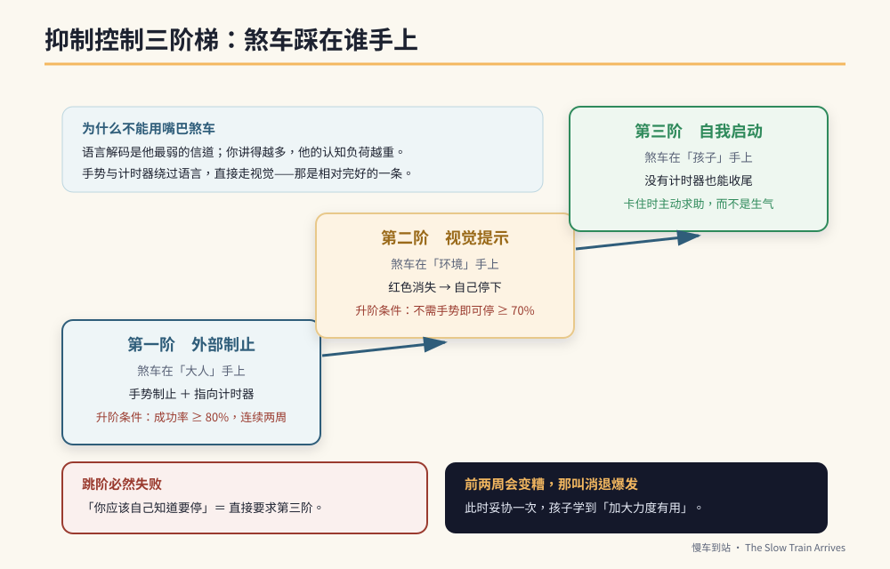

## 背景与痛点

晚餐前的十五分钟，同一场戏每天上演。

「时间到了，去洗手。」
「自强号比较快。」
「我知道，先去洗手。」
「自强号比较快，区间车比较慢。」
「**不要再讲火车了！**」
「……（音量提高）自强号比较快！」

十分钟后，大人筋疲力尽，孩子情绪崩溃，晚餐冷了。而明天同一时间，同一场戏会重来一次。

这种消耗有一个明确的名字：**口语角力**。它的杀伤力不在於单次，而在于它每天都发生，一年三百六十五次，把家庭的耐心存量一点一点抽干。

而它有一个很残酷的性质：**每一次角力，都在训练孩子的反面能力。**

如果一场拉锯最后是大人妥协（「好啦好啦再讲五分钟」），孩子的大脑学到的是：只要我够坚持，规则就会松动。如果最后是大人爆发（吼、罚、强制），孩子学到的是：规则是靠情绪强度决定的，谁大声谁赢。

两种结局都在把 C1 往反方向练。

---

## 核心设计

### 一、抑制控制不是「乖」，是一段可测量的延迟

先把概念定义清楚，因为定义错了，训练就会错。

**神经控制力（抑制控制）＝ 从「想要做某件事」到「实际停下来配合」之间，那段延迟的长度。**

它不是「听话」，也不是「脾气好」。它是一个**时间量**，而时间量可以被测量、被训练、被看到进步。

第 1 章记录的 `emotion_recovery_seconds` 就是它。一个孩子从五分钟进步到两分钟，不是「他今天心情比较好」，是抑制回路真的被练厚了。

### 二、三阶梯：从外部制止到自我启动

抑制控制的训练有严格的阶梯顺序，跳阶必然失败。

| 阶 | 谁在踩煞车 | 现场长什么样 | 进到下一阶的条件 |
|----|-----------|-------------|----------------|
| **第一阶　外部制止** | 大人 | 大人用手势制止，孩子在提示下停下 | 连续两周，手势制止的成功率 ≥ 80% |
| **第二阶　视觉提示** | 环境 | 计时器红色消失，孩子看到后自己停 | 连续两周，不需要大人手势即可停下 ≥ 70% |
| **第三阶　自我启动** | 孩子 | 没有计时器也能自己收尾；卡住时主动求助 | 能在陌生环境中维持 |

多数家庭的错误，是想直接从「什么都没有」跳到第三阶——「你应该自己知道要停」。孩子做不到，于是大人加重语气，于是回到口语角力。

**正确的路径是先把煞车放到外面（大人与环境），再一阶一阶交回孩子手上。**

### 三、为什么不能用嘴巴煞车

这一点必须从神经学说起，因为它违反直觉。

当孩子正在固着思考时，他的大脑处于一种高度占用的状态。此时你对他说一长串话——「你看时间都到了，我们约定好的对不对，你这样妈妈很累」——你以为你在说理，但在他的处理系统里，这是**又一批需要解码的语音输入**。

而语言解码正是他最弱的一环。

结果是：你的话不但没有帮他踩煞车，反而**加重了他的认知负荷**，让他更难从固着中抽离。他表现出来的是更执拗、音量更高——大人解读成「他在顶嘴」，于是再加码。

**视觉提示则走完全不同的信道。** 一个手势、一个变白的计时器，绕过语言解码，直接进入视觉处理——而视觉处理，通常是这类孩子相对完好的能力。

> 🔍 **一句话总结这个机转**
> 你用他最弱的信道去要求他做最难的事，然后怪他做不到。
> 换一条信道，同一件事会突然变得可能。

### 四、消退爆发：前两周一定会变糟

这是这一章最重要、也最常导致中途放弃的一段。

当你开始实施结构（计时器、代币、手势制止），前一到两周，孩子的抗拒与生气频率**通常会上升，而不是下降**。

这在行为科学上叫**消退爆发**：原本有效的行为（一直讲、一直吵）忽然不管用了，大脑的第一反应不是放弃，而是「加大力度再试一次」。

**这个阶段的表现，恰恰证明介入生效了。** 而它也是决定成败的分水岭：

- 如果大人在这时妥协一次，孩子学到的是「加大力度有用」——固着行为会比介入前更严重，而且更难处理。
- 如果大人撑过去，通常在第二到第四周会看到明显下降。

所以在开始之前，家里两位大人要先讲好一句话：**「前两周会变糟，那是正常的，我们不改规则。」**

---

## 实作

### 一、视觉计时器五步骤 SOP

```text
【步骤 1】事前预告（在情绪平稳时，不是在他已经开始讲的时候）
  「等一下回家，我们有 15 分钟火车时间，妈妈陪你聊。
   红色不见、闹钟响，火车就进站休息，我们去洗手吃饭。」
  → 说完，两人打勾勾。这个动作是仪式，仪式会被记住。

【步骤 2】启动（把转计时器的动作交给他）
  让孩子自己把计时器转到 15 分钟。
  → 自己转，比大人转，接受度高很多。

【步骤 3】陪伴（这 15 分钟要真的陪）
  大人放下手机，认真听，并依第 10 章的方法引导成有结构的叙述。
  → 这一段是他这一天最重要的时光，不要一边滑手机一边敷衍。

【步骤 4】收尾提示（在剩 2 分钟时给一次预告）
  「还有一点点红色，等一下火车要进站啰。」
  → 只说一次。不要在最后 30 秒倒数，那会制造焦虑。

【步骤 5】结束（★ 一个字都不要说）
  闹钟响。大人站起来，右手五指并拢、掌心向前，做出「停」的手势；
  另一手食指指向已经全白的计时器。
  维持动作，眼神中立，不说话。
  他若继续讲 → 重复同一个动作，不加码、不解释、不生气。
  他若起身 → 立刻给予具体赞美：「你自己停下来了，很厉害。」
```

第五步的难度全在大人身上。**一句「不要再讲了」，就会把整套 SOP 打回口语角力。**

### 二、预告法：把突然变成可预期

自闭特质的大脑最怕的不是规则，是**没有预告的变化**。同一件事，有预告和没预告，情绪反应可以差好几倍。

```text
【三层预告结构】

事前一天：  「明天下午我们要去看医生，看完医生才去买便当。」
出发前：    「我们现在出门，先看医生，然后买便当。」（同时给他看图卡）
现场转换前：「医生看完了，接下来去买便当。」

★ 关键：预告的内容与实际发生的顺序必须完全一致。
  一次「说好了却没做到」，会让往后十次预告失效。
```

### 三、定格站姿：给他一个「卡住时」的动作

这是本书最实用的一招之一，而且它同时服务 C1 与未来的职场。

孩子在卡住、被打断、不会做的时候，需要一个**替代动作**——因为没有替代动作时，大脑缺省的输出就是生气。

```text
【定格站姿三步骤】（在家练到自动化，之后带到学校与职场）

1. 双手在肚脐前方交叠放好
2. 原地深吸一口气
3. 看着对方，念出制式台词：

   卡住时 →「请老师（妈妈）教我，谢谢。」
   太累时 →「我太累了，我想休息一下。」
   做完时 →「报告老师，我做好了，请检查。」

★ 这三句话要练到不用想。练法：每天在小帮手任务中制造 1 次
  「故意让他卡住」的情境，让他用台词解决，成功就大力称赞。
```

为什么这一招重要？因为在未来的职业评估与职场现场，**「卡住时的反应」比「做得多快」更决定去留**。一个会说「请教我」的人，主管可以带；一个卡住就僵住、跺脚的人，主管会判定为情绪风险。

第 27 章会完整说明这个评分逻辑。

### 四、抗干扰训练（高端，C1 分数 ≥ 3 再做）

小作所与庇护工场的现场是吵的：机器声、人声、广播、旁边的人走来走去。在安静书桌前练出来的专注力，到那里会全部归零。

```text
【抗干扰练习：每周 2 次，每次 15–20 分钟】

1. 让孩子进行一项重复性作业（折衣服、分装文具、剪纸条）
2. 用视觉计时器设置 15 分钟
3. 在第 8–10 分钟时，大人「故意」制造干扰：
     - 在旁边播放火车声或他喜欢的音乐
     - 走过去把他的一件工具拿走
     - 忽然说「这个先别做，改做另一个」
4. 目标：他不转头、手不停，持续 2–3 分钟
   或者：他启动定格站姿，用台词回应，而不是生气

5. 成功 → 立刻具体称赞（「有火车声音你也没有停下来，很棒」）
   失败 → 不责备，降低干扰强度，下次再来
```

> ⚠️ **这一项有明确的禁止事项**
> 干扰训练的目的是创建耐受，不是制造挫折。**不可以**在孩子已经疲累、生病、或当天情绪不佳时做；**不可以**连续干扰（一次练习只做一次干扰）；**不可以**在他成功耐受后还继续加码——那会把「忍耐」与「被欺负」链接起来，得不偿失。

### 五、记录与升级

```yaml
# c1-progress.yaml — 每周回顾一次
week: 2026-W12
core: C1

emotion_recovery_seconds:
  median: 145               # 上周 190 → 本周 145
  samples: 9

gesture_stop_success_rate: 0.78   # 手势制止成功率（第一阶指针）
self_stop_rate: 0.33              # 不需手势即自行停下（第二阶指针）
scripted_help_requests: 4         # 本周主动使用制式台词求助的次数

ladder_stage: 1                   # 目前在第一阶
promotion_check: |
  第一阶指针连续两周 >= 0.8 才升第二阶
  本周 0.78，未达标，维持第一阶，不加难度

notes: |
  周三、周四明显较差，两天都晚睡（超过 23:30）。
  → 睡眠是 C1 的地基，见第 11 章。
```

---

## 现场踩雷

**踩雷一：第一周看到变糟就放弃。**
这是消退爆发。放弃的代价不是回到原点，是比原点更差——因为孩子刚学会「加大力度有用」。

**踩雷二：两个大人不一致。**
爸爸坚持规则，妈妈心软通融（或反过来）。结果是孩子学会**选人下手**，而且家庭内部产生裂痕。
**解法：** 规则写在纸上，贴冰箱。任何一方要改规则，必须是在孩子不在场时讨论后一起改。

**踩雷三：用制止手势当处罚。**
手势是**中性的信号**，不是愤怒的表达。如果大人做手势时是咬牙切齿的，孩子接收到的是情绪，不是规则——而情绪会引发情绪。
**练法：** 大人自己先对着镜子练到能面无表情地做出这个手势。

**踩雷四：在孩子已经爆发后才开始讲规则。**
情绪爆发时，前额叶基本上是脱机的。此时说什么都进不去。
**正确顺序：** 先降温（安静、减少刺激、不对话），完全平静后再回到规则——而且是简短的一句，不是检讨大会。

**踩雷五：把 C1 的退步归因于态度。**
睡眠不足、生病、天气、环境改变、药物调整，都会让 C1 明显退步。**先查生理，再谈行为**——这是第 11 章存在的理由。

**踩雷六：进步了就撤掉工具。**
「他现在都可以自己停了，计时器可以收起来了吧？」——通常两周后就打回原形。
**正确做法：** 工具的撤除要**渐进**（从每天用 → 只在转换时段用 → 只在陌生环境用），而且退步时要能立刻放回去，不视为失败。

---

## 效益与验收（DoD）

| 项目 | 验收标准 |
|------|---------|
| 计时器上线 | 五步骤 SOP 连续实施满 4 周，且第 5 步「一个字都不说」做到 ≥ 80% |
| 情绪回复时间 | 中位数较基线**下降 30% 以上**，或稳定进入 2 分钟内 |
| 手势制止 | 成功率连续两周 ≥ 80%（第一阶达成） |
| 制式台词 | 三句台词中至少 1 句能在**没有提示**的情况下自发使用，每周 ≥ 3 次 |
| 大人一致 | 规则成文贴出；最近两周内没有发生任何一次「当场妥协」 |
| 消退爆发已渡过 | 曾出现第 1–2 周恶化并撑过，之后有下降趋势（若没出现，也要记录下来） |

> 💡 君之一席话
> 「你以为你在跟他讲道理，其实你在用他最弱的那条线路，要求他做最难的事。**把嘴巴闭上，把手指向计时器**——那不是冷漠，那是你能给他最温柔的一种帮忙。」

---


# 第9章　核心二　工作记忆链：一句话里装得下两件事

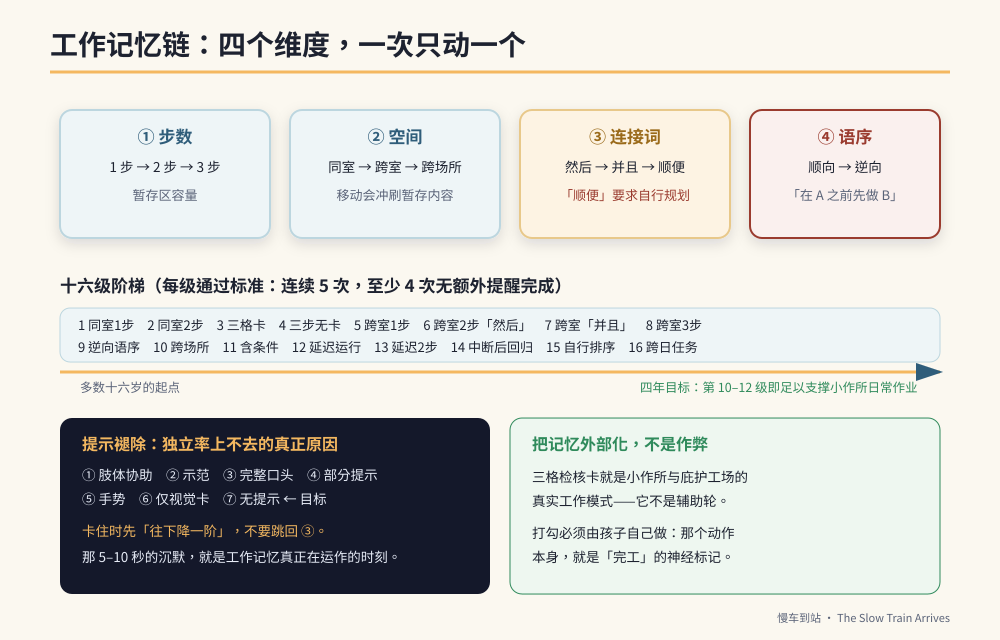

## 背景与痛点

「帮妈妈把碗拿到厨房。」——他做得到。

「帮妈妈把碗拿到厨房，**然后顺便**把客厅的卫生纸拿过来。」——他把碗放进厨房，然后站在那里，或者直接回房间了。

大人接下来会做的事，几乎是本能：走过去，说「卫生纸呢？我刚刚不是说要拿卫生纸？」

这句话里有两个问题。

**第一，他不是忘了，是根本没有装进去。** 工作记忆像是大脑里的一块暂存区，容量有限。当「碗」「厨房」「拿过去」占满之后，「卫生纸」这一项在他开始移动的那一刻就掉出去了。这不是态度问题，是容量问题。

**第二，那句提醒让这次训练归零。** 因为他最后确实拿到了卫生纸——在大人提醒之下。而大脑记住的是：不用记，反正妈妈会再说一次。

工作记忆链是这本书里**最直接对应未来职场能力**的一条核心。小作所的组长不会只交办一件事，庇护工场的流程不会只有一个步骤。**能不能记住两件事并依序完成，是「需要有人全程盯着」与「可以放手交办」之间的那条线。**

---

## 核心设计

### 一、四个难度维度（不要一次动两个）

工作记忆链的难度不是只有「几步」。它有四个独立的维度，而训练的铁律是：**一次只提高一个维度。**

| 维度 | 从 | 到 | 为什么难 |
|------|-----|-----|---------|
| **① 步数** | 1 步 | 2 步 → 3 步 | 暂存区容量 |
| **② 空间** | 同一个房间 | 跨房间 → 跨楼层 → 跨场所 | 移动本身会冲刷暂存内容 |
| **③ 连接词** | 无 | 「然后」→「并且」→「顺便」 | 每个连接词的语意负荷不同 |
| **④ 语序** | 顺向（先说先做的） | **逆向**（「在 A 之前先做 B」） | 需要先解码、再重排顺序 |

同时提高两个维度（例如「跨楼层」＋「三步」），失败率会急遽上升，而失败的经验会让孩子开始回避交办任务——那是最不划算的一种倒退。

> 🔍 **为什么「顺便」是最难的那个词**
> 「然后」是明确的时间序：做完 A，做 B。
> 「并且」是并列：A 和 B 都要做。
> 而「**顺便**」缺省了一个孩子多半没有的能力：**在移动路径上自行判断何时插入第二个任务**。它不只要求记住，还要求规划。
> 所以「顺便」不是第三个同义词，它是一个**明显更高的阶级**。很多家长无意间第一次就用了它，然后得到一个看起来「不听话」的孩子。

### 二、十六级升级阶梯

把四个维度组合成一条可以照着走的路。每一级的通过标准都是：**连续五次交办，至少四次无额外提醒完成。**

| 级 | 内容 | 范例 |
|----|------|------|
| 1 | 同室・1 步 | 「把碗放到水槽。」 |
| 2 | 同室・2 步・「然后」 | 「把碗放到水槽，然后把抹布挂好。」 |
| 3 | 同室・3 步・视觉卡辅助 | 三格检核卡：擦桌子 ▢ 收碗 ▢ 关灯 ▢ |
| 4 | 同室・3 步・无卡 | 同上，但不给卡 |
| 5 | 跨室・1 步 | 「去客厅拿卫生纸过来。」 |
| 6 | 跨室・2 步・「然后」 | 「把碗拿到厨房，然后去客厅拿卫生纸。」 |
| 7 | 跨室・2 步・「并且」 | 「把联系簿交给老师，并且把抹布带回来。」 |
| 8 | 跨室・3 步 | 三个地点、三件事 |
| 9 | 跨室・2 步・**逆向语序** | 「**在拿抹布之前**，先把本子交给老师。」 |
| 10 | 跨场所・2 步 | 「去超商买牛奶，然后把发票拿回来给我。」 |
| 11 | 跨场所・2 步・含条件 | 「如果没有鲜奶，就买豆浆。」 |
| 12 | 延迟运行・1 步 | 「等一下吃完饭，去把垃圾拿出去。」（间隔 15 分钟） |
| 13 | 延迟运行・2 步 | 同上，两件事 |
| 14 | 中断后回归 | 运行到一半被打断，能自己回到原任务 |
| 15 | 自行规划顺序 | 「这三件事今天做完，顺序你自己决定。」 |
| 16 | 跨日任务 | 「明天早上出门前，记得带回条给老师。」 |

多数十六岁的孩子起点在第 1–3 级之间。**四年走到第 10–12 级，就足以支撑小作所的日常作业。**

### 三、提示褪除：独立率上不去的真正原因

「他做得到啊，只是我要在旁边提醒。」——这句话里藏着整条核心最大的陷阱。

行为训练上，「提示」是有层级的。训练的目标不是「让他完成」，而是**逐层拿掉提示**：

```text
提示强度   由强到弱
  ①  肢体协助（手把手带着做）
  ②  示范（大人先做一次给他看）
  ③  口头完整指令（「把碗拿到厨房，然后拿卫生纸」）
  ④  口头部分提示（「碗放好了，接下来呢？」）
  ⑤  手势提示（指一下客厅的方向）
  ⑥  视觉提示（检核卡、图卡）
  ⑦  无提示（自主启动）   ← 目标
```

大人最常犯的错，是**在孩子卡住的三秒内就跳回 ③**。而正确的做法是**先往下降一阶**：

```text
他卡住了（站在厨房不动）
  ↓ 等 5–10 秒（★ 这几秒最难忍，但它是训练的核心）
  ↓ 仍不动 → 给 ⑤ 手势提示（指客厅）
  ↓ 仍不动 → 给 ④ 部分提示（「还有一个东西喔」）
  ↓ 仍不动 → 给 ③ 完整指令，并记下：本次为完整提示
```

**那五到十秒的沉默，是工作记忆真正被使用的时刻。** 大人一开口，那段运算就被取消了。

---

## 实作

### 一、交办脚本（每天两次，一次不超过三分钟）

```text
【步骤 1】取得注意力（★ 不要对着背影说话）
  走到他面前，等他眼神看向你。必要时轻声叫名字，等 2 秒。

【步骤 2】下达指令（短、慢、名词清楚）
  「碗拿到厨房，然后拿卫生纸。」
  ✗ 不要说：「你可以顺便帮妈妈把那个卫生纸拿一下吗，
             就是客厅那个，然后碗也要记得拿去厨房喔。」
  → 一句指令 ≤ 12 个字，名词放在句尾（最后听到的最容易留住）。

【步骤 3】覆诵（★ 这一步让成功率大幅提高）
  「你说一次。」
  他：「碗、厨房、卫生纸。」
  → 不必说出完整句子，能覆诵关键名词就算通过。
  → 覆诵的动作把「听觉输入」转成「自己的语音输出」，
    这在记忆上是完全不同的一件事。

【步骤 4】放手（大人转身去做自己的事）
  不要站在旁边看。被盯着会让他改成看你的脸色，而不是用自己的记忆。

【步骤 5】结果处理
  完成 → 具体称赞：「两件事都做到了，很厉害。」（不要只说「好棒」）
  卡住 → 走褪除阶梯（见上），并记录本次用到的提示层级
```

### 二、视觉检核卡：把暂存区搬到卡片上

工作记忆容量不足时，最有效的补偿不是「多练记忆」，是**把记忆外部化**。这也是所有小作所与庇护工场的标准作业方式——**这一招不是辅助轮，它就是职场现场的真实工作模式。**

```text
【火车联结任务卡】（A4 护贝，魔鬼毡可换图卡）

  ┌──────────┬──────────┬──────────┐
  │ 车厢 1    │ 车厢 2    │ 车厢 3    │
  │ [图] 擦黑板│ [图] 排桌椅│ [图] 倒垃圾│
  │    ▢      │    ▢      │    ▢      │
  └──────────┴──────────┴──────────┘
        ↑ 完成一项，自己用彩色笔打一个勾

【三个设计要点】
  1. 图卡用「实物照片」，不要用线条插图或纯文本
     → 视觉辨识速度差很多
  2. 打勾必须由孩子自己做，大人不能代打
     → 打勾这个动作本身，就是「完工」的神经标记
  3. 全部打完才交还卡片，换取下一件事（下课／点心／火车时间）
     → 卡片是凭证，不是提醒
```

### 三、逆向语序训练（第 9 级，难度陡增）

```text
【三阶段练法】

阶段 A（配图卡）：
  桌上放两张图卡，依实际运行顺序由左至右排好。
  「在拿抹布之前，先把本子交给老师。」
  → 请他把图卡「按照要做的顺序」排一次，再去运行。

阶段 B（口语 + 覆诵）：
  同一句话，不给图卡，但要求覆诵：「先做什么？再做什么？」

阶段 C（纯口语）：
  直接运行。

★ 逆向语序卡住是正常的，不代表退步。
  它刺激的是语意重排能力，是这条核心里最高端的一项。
```

### 四、记录

```yaml
# c2-progress.yaml
week: 2026-W12
core: C2

chain_length_max: 2          # 目前稳定的步数
current_level: 6             # 十六级阶梯的第几级
level_pass_rate: 0.6         # 本级连续 5 次中成功 3 次 → 未达标（需 4/5）

prompt_level_used:           # 本周各层级提示使用次数（越往 ⑦ 越好）
  full_verbal: 4             # ③ 完整口头
  partial_verbal: 3          # ④ 部分提示
  gesture: 5                 # ⑤ 手势
  visual_only: 6             # ⑥ 仅视觉卡
  none: 2                    # ⑦ 无提示

independent_task_rate: 0.44  # 上周 0.35

notes: |
  「顺便」这个词出现时失败率明显较高 → 本周起全面改用「然后」。
  跨室任务在放学后（较疲累）成功率低 → 移到早上做。
```

最后那两行是这份记录真正的价值：**它把「他做不到」变成「在什么条件下做不到」**，而后者是可以调整的。

---

## 现场踩雷

**踩雷一：用提醒把任务救回来。**
救回来的是那一次的家事，赔掉的是那一次的训练。**如果今天的目的是让事情完成，就直接自己做**（那完全没问题）；如果今天的目的是训练，就要忍住不提醒。**先决定今天是哪一种，不要两者都想要。**

**踩雷二：一次提高两个维度。**
「跨楼层＋三步」是经典的失败组合。四个维度，一次动一个。

**踩雷三：把「忘记」解读成「不听话」。**
在这条核心上，这是最伤人的一种误解。孩子没有拒绝你，他只是暂存区满了。**用「几步」来描述问题，而不是用「态度」。**

**踩雷四：任务内容没有意义。**
「把这叠纸从左边搬到右边，再搬回来」——这种为练而练的任务，孩子很快就会抗拒，因为大脑知道它没有结果。
**所有工作记忆训练都应该内置在真实家务或小帮手任务里**，让完成有真实的后果（桌子真的干净了、老师真的收到了）。

**踩雷五：只在家里练。**
在家练到第 8 级，到了学校还是第 2 级——因为情境没有类化。**同一级的任务要在至少两个场域（家、学校）各练过**，才算真的通过。这需要与老师同步，第 34 章提供沟通备忘录的范本。

**踩雷六：站在旁边看。**
被注视时，孩子会改用「读大人表情」来完成任务，而不是用记忆。训练必须有一段「大人不在视线内」的时间。

---

## 效益与验收（DoD）

| 项目 | 验收标准 |
|------|---------|
| 阶梯定位 | 明确知道目前在十六级的第几级，并有连续 5 次的通过纪录 |
| 覆诵已内化 | 交办时孩子能主动覆诵关键名词，或在一次提示下覆诵，达 ≥ 70% |
| 提示已褪除 | 「无提示 + 仅视觉卡」的比率较四周前提高，且「完整口头」比率下降 |
| 独立完成率 | `independent_task_rate` 较基线提高 ≥ 0.15 |
| 检核卡上线 | 三格任务卡实际使用满四周，打勾由孩子自己完成 |
| 跨场域 | 至少一级的任务同时在家庭与学校达标 |
| 记录可读 | 周记录中含「在什么条件下失败」的观察，而非只有成功／失败 |

> 💡 君之一席话
> 「他站在厨房不动的那五秒钟，是你最想开口的五秒钟，也是他大脑唯一在锻炼的五秒钟。**你每提醒一次，就替他做完一次；替他做完一百次，他就永远停在一步。**」

---


# 第10章　核心三　固着功能化：火车不是症状，是动机引擎

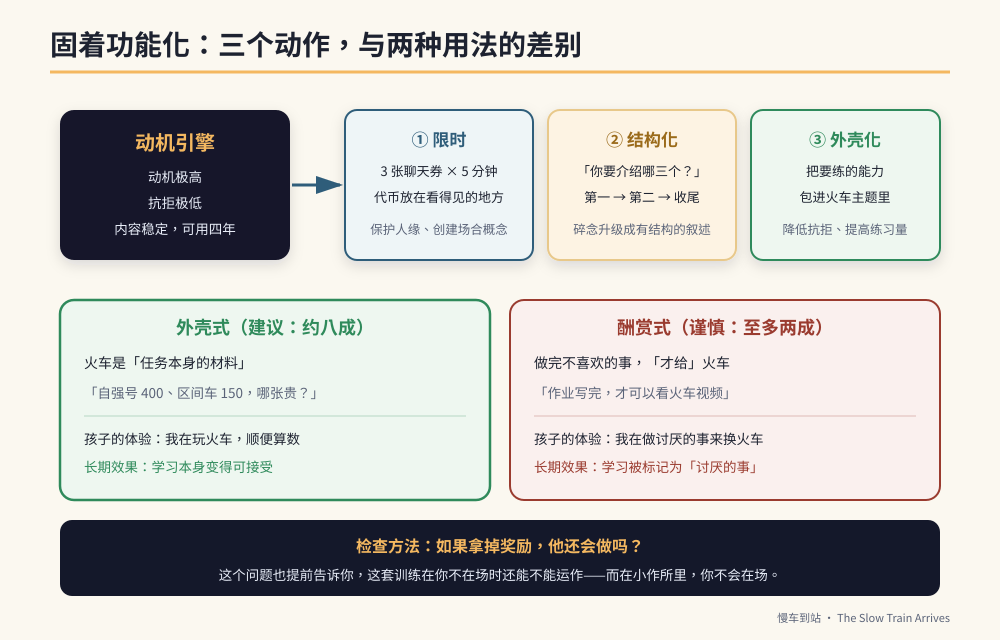

## 背景与痛点

有两种家长。

**第一种**带着孩子去亲戚聚会，孩子开始讲火车。第三次的时候，亲戚的表情变了。第五次的时候，家长打断他：「好了好了，不要再说了。」孩子沉默，或者生气。回家的路上，家长很累，而且有一种说不出口的难堪。

**第二种**在同一个场合，对亲戚说：「他很懂火车喔，你问他自强号和区间车差在哪里。」孩子讲了三分钟，亲戚说「哇你好厉害」，孩子笑了。

同一个孩子，同一个固着，两种完全不同的社会结果。

差别不在于固着的强度，而在于**它有没有被装进一个有用的形状里**。

而这件事有急迫性。固着在小学阶段，同学多半会包容；到了高职和成年，包容度会急速下降。一个一直重复同一个话题的成年人，很快会被边缘化——**他最大的资产（人缘）会被他最强的特质（固着）吃掉。**

这一章要做的，就是在那件事发生之前，把固着改装成三样东西：**边界、结构、外壳。**

---

## 核心设计

### 一、为什么固着是引擎，而不是垃圾

从训练的角度看，固着兴趣有三个极稀有的性质：

| 性质 | 意义 |
|------|------|
| **动机极高** | 不需要外部酬赏，他自己就会投入 |
| **抗拒极低** | 包上这层壳，同样的任务他愿意坐下来做 |
| **内容稳定** | 不像一般孩子的兴趣两周就换一个，它可以用四年 |

在一个「什么都推不动」的训练现场，这三个性质加起来，是唯一还在运转的引擎。

而更关键的是：**你没有办法创造它。** 你可以设计课程、可以买教材、可以请治疗师，但你无法让一个孩子突然对某件事产生这种强度的兴趣。它是天生的，它已经在那里了。

把它压掉，是这条路上最贵的一个决定。

### 二、三个动作：限时、结构化、外壳化

处理固着不是「压抑 vs 放任」的二选一。它是三个独立的动作，可以同时进行。

| 动作 | 做什么 | 解决什么 | 对应章节 |
|------|--------|---------|---------|
| **① 限时** | 给固着明确的时间框与代币 | 保护人缘、创建场合概念 | 本章 + 第 8 章 |
| **② 结构化** | 把碎念升级成有头有尾的叙述 | 实质提升口语组织能力 | 本章 |
| **③ 外壳化** | 把要练的能力包进火车主题里 | 降低抗拒、提高练习量 | 本章 + 第四篇 |

三者的顺序建议是 ① → ③ → ②：先有边界（否则什么都谈不了），再用外壳把训练量做起来，最后才慢慢提高叙述的结构要求。

### 三、外壳式 vs 酬赏式：一个必须讲清楚的区别

这是本章最重要的一段，因为两者看起来很像，效果却相反。

| | **外壳式**（建议） | **酬赏式**（谨慎使用） |
|---|---|---|
| 做法 | 把火车变成**任务本身的材料** | 做完不喜欢的事，**才给**火车 |
| 例子 | 「自强号 400、区间车 150，哪个贵？」 | 「作业写完，才可以看火车视频」 |
| 孩子的体验 | 我在玩火车，顺便算数 | 我在做讨厌的事，为了换火车 |
| 长期效果 | 学习本身变得可接受 | 学习被标记为「讨厌的事」 |
| 对固着的影响 | 固着被扩充、被赋予功能 | 固着被强化成唯一的价值来源 |

**外壳式不是不能用酬赏，而是酬赏不该是主要机制。** 一个健康的配置大约是：八成的训练用外壳式包装，两成可以用固着时间当作完成后的正常奖励（因为现实生活本来就有「做完事才休息」的结构）。

> 🔍 **一个检查方法**
> 问自己一句：**「如果拿掉奖励，他还会做吗？」**
> 外壳式的答案通常是「会，因为那本来就是火车」；酬赏式的答案通常是「不会」。
> 这个问题也能提前告诉你，这套训练在你不在场的时候还能不能运作——而在小作所里，你不会在场。

---

## 实作

### 一、对话代币制：把边界变成看得见的东西

```text
【家庭版】
  每天发 3 张「火车聊天券」（护贝小卡，可以印火车图案）。
  规则：
    · 一张券 = 5 分钟，且必须「交出券」才开始
    · 券用完了，今天的火车时间就结束（★ 不通融、不预支）
    · 未使用的券不累积到明天（避免囤积造成的谈判）
    · 大人在券的时间内必须「真的陪」——放下手机、认真听

【学校版】（请老师协助，第 34 章有给老师的备忘录范本）
  每天 3 张券，且限定在下课时间、对方同意时使用。
  非约定时间他提起 → 老师温和坚定地说：
    「现在不是火车时间，请把券收好。」
  → 这句话要固定、每次一样。不同的说法会被大脑当成不同的规则。

【代币的位置很重要】
  券要放在他看得到的地方（磁铁吸在白板上、或挂在书包侧边）。
  非使用时段他想讲时，大人一个字都不用说，只要用手指向那些券。
  → 看到实体代币，比听到一句拒绝，接受度高很多。
```

> ⚠️ **代币制的三个禁止**
> **不可以**把券当处罚工具没收（「你不乖，扣一张券」）——那会把它从结构变成惩罚，孩子会开始防卫。
> **不可以**在他情绪好的时候多给——规则的价值来自不变。
> **不可以**在他快要爆发时提前给——那是在教「情绪可以换券」。

### 二、结构化：把碎念升级成叙述

限时之后，那十五分钟要拿来做什么？不是被动听完，而是**引导他把内容组织起来**。

```text
【引导四问】（每次火车时间用其中 1–2 个，不要全部用）

① 数量框架：「你今天要介绍几个？我们讲三个好不好？」
   → 给大脑一个容器。有容器，内容才会被排序。

② 序数提示：「第一个是什么？」「那第二个呢？」
   → 序数是叙述结构最便宜的鹰架。

③ 比较框架：「自强号和区间车，哪里不一样？」
   → 比较会逼出属性描述（快／慢、贵／便宜、停几站）。

④ 收尾提示：「所以你最喜欢的是哪一个？为什么？」
   → 训练「结论」这个概念，这是叙述能力的高端项目。

【评分：什么叫「有结构」】
  0 分：单句重复（「自强号比较快」× N 次）
  1 分：能列出 2 个以上不同的内容
  2 分：内容有顺序（第一、第二）
  3 分：有开头、有内容、有结尾（「我讲完了」）

  → 记录每次的分数，计算 fixation_structured_ratio
    （得 2 分以上的次数 ÷ 总次数）
```

**这一段的价值容易被低估。** 对一个口语表达受限的孩子来说，「把一件事讲成三点」是很高端的语言能力——而他愿意在火车主题上做这件事，却不愿意在任何其他主题上做。**这是唯一的入口。**

### 三、外壳化四步骤：把任何能力包进火车

```text
【步骤 1】先写出你真正要练的能力（不要写「数学」，要写具体动作）
  例：「能从两个数字中指出比较大的那一个」

【步骤 2】在固着主题里找一个「天然含有」这个能力的场景
  例：票价、车速、车厢数、身高限制、时刻、月台号码

【步骤 3】用真实素材，不要用自制的假素材
  例：真的去印一张台铁票价表，不要自己画两个框写数字
  → 真实素材有两个好处：动机更高，而且能力可以直接类化到现场

【步骤 4】设计一句「他能听懂的交互台词」，且台词里要有角色
  例：「维修长！今天我们要出车。150 和 400，哪一张票比较贵？」
  → 角色称号（维修长、站长、小帮手）会大幅提高配合度，
    因为它把「被要求」转换成「扮演」。
```

第四篇整篇就是这四个步骤的十组完整示范。

### 四、社会化：从自我封闭到社交资产

固着功能化的最后一哩路，是让它变成**与人链接的媒介**，而不是隔开人的墙。

```text
【三个可以立刻做的做法】

① 「一张照片」规则
   每周准许他带一张自己选的火车照片到学校，
   在下课时给同学看，并练习一句固定台词：
     「这是我最喜欢的自强号，给你看。」
   → 重点是「给你看」而不是「听我讲」——前者是双向的。

② 「你呢？」的轮流练习
   在家庭火车时间里，大人也讲一件自己的事（30 秒就好），
   然后教他问一句：「你呢？」
   → 轮流是社交对话的最小单位，而它可以在最舒服的主题上练。

③ 专家角色
   在亲戚、邻居面前，主动把他介绍成「这方面他很懂」，
   并给对方一个具体问题（「你问他自强号跟区间车差在哪」）。
   → 这一招同时修复了大人的社交尴尬与孩子的自我价值。
```

### 五、意外的用途：固着是最好的镇定工具

在陌生、焦虑、疼痛的场合——抽血、看牙医、换新环境、实习第一天——固着兴趣是**现成的、免费的、随身携带的**安抚工具。

```text
【就医版脚本】
  候诊时：「等一下医生看完，我们去看火车。」（明确的奖励在等待之后）
  进诊间：让他手上握着火车玩具或火车卡片
  抽血时：「你数，这班车有几节车厢？」（把注意力导向可预测的内容）
  结束后：立刻兑现承诺（★ 一次不兑现，往后全部失效）
```

第 4 章的急诊卡上有一栏「沟通提示」，写的就是这件事。**当你把它写给急诊医护时，你不只是在帮孩子，你也在帮那位素昧平生、需要在三十秒内安抚一个陌生青少年的人。**

---

## 现场踩雷

**踩雷一：把固着压到地下。**
高压禁止的结果通常不是消失，是转入私下——孩子躲起来自己讲。表面上安静了，实际上你**失去了观测与引导的管道**，而固着本身一点也没少。

**踩雷二：无限奉陪。**
另一个极端。因为心疼、因为内疚，于是不设任何边界。结果是人缘被消耗、场合概念没有创建，而且到了机构里没有人有义务陪他讲九十分钟。

**踩雷三：外壳用到烂。**
所有东西都是火车，连续三个月，孩子开始厌倦——固着兴趣也会疲乏。
**解法：** 保留一到两成的「素面任务」（没有包装的一般任务），并在固着主题内部做变化（火车→铁道→车站→时刻表→售票→月台广播）。

**踩雷四：拿走他的固着当处罚。**
「你不听话，这礼拜不准讲火车。」——这会把引擎当成人质。短期可能有效，长期会让他把固着藏起来，并且让大人变成威胁来源。

**踩雷五：只有妈妈会用这一套。**
爸爸觉得「干嘛陪他讲那些有的没的」，老师觉得「这样会不会太宠」。结果孩子在不同人面前有不同规则，而规则不一致正是焦虑的来源。
**解法：** 第 34 章的备忘录范本，就是为了解决这一件事。

---

## 效益与验收（DoD）

| 项目 | 验收标准 |
|------|---------|
| 边界已创建 | 代币制实施满 4 周；非约定时段的固着发话，能以「指向代币」处理 ≥ 70% |
| 时间框稳定 | 固着话题有 ≥ 80% 发生在约定时段内（总时长不设上限） |
| 结构化 | `fixation_structured_ratio` ≥ 0.5（一半以上的火车时间能讲到 2 分以上） |
| 外壳化已上线 | 至少 3 项训练任务已改成火车主题外壳，并实际使用 |
| 社交化 | 「一张照片」或「你呢？」至少一项实施满 4 周，且有 ≥ 3 次正向同侪回应 |
| 镇定工具 | 至少一次在陌生或医疗场合成功使用固着兴趣安抚 |
| 没有被当人质 | 最近 4 周内，没有把「不准讲火车」当成处罚使用过 |

> 💡 君之一席话
> 「别人看到的是一个一直在讲火车的孩子；你要看到的是**一台已经发动、而且只认得一种燃料的引擎**。你的工作不是熄火，是接上传动轴。」

---


# 第11章　神经地基：放电、睡眠、饮食、肠道与照顾者


## 背景与痛点

一位母亲在第六周写下这句话：

> 「这礼拜整个垮掉。计时器不管用了，任务卡也不理，一整周都在生气。我是不是做错了？」

翻开她的纪录，答案在最后一栏的备注里：那一周孩子连续五天都在十一点半以后才睡。

**这一章要创建的是一个习惯：训练出问题时，先查地基，再检讨方法。**

因为在神经发育障碍的孩子身上，行为表现对生理状态的敏感度，远高于一般人。同一个孩子，睡饱和没睡饱，可以像两个人。而大人如果先检讨方法，会做两件错事：把有效的方法改掉，以及把生理问题误读成态度问题。

> ⚠️ **医疗免责**
> 本章涉及用药追踪、剂量、饮食调整与检查安排，**全部属于医疗决策，一律由主治医师决定**。本章的用途只有一个：让你知道回诊时该主动说什么、该问什么。
> **绝对不要**依据本章自行停药、调药、改变饮食疗法或增减营养补充品。抗癫痫药物突然停用可能诱发癫痫重积状态，那是会致命的。

---

## 核心设计：五块地基与排查顺序

```text
训练失效时的排查顺序（由下往上）

  ⑤ 照顾者状态    ← 最常被忽略，却决定一切能否持续
  ④ 肠道与代谢
  ③ 饮食与血糖
  ② 睡眠
  ① 放电与用药    ← 最优先排除
  ─────────────────────
  然后才是：方法、强度、动机
```

顺序的理由：越下层，越可能造成**全面性**的表现下滑；而越下层的问题，也越不可能靠调整教学方法解决。

| 地基 | 没顾好的表现 | 谁负责 |
|------|-------------|--------|
| ① 放电与用药 | 全面退步、学过的东西不见、白天嗜睡或异常暴躁 | 医师（家长负责观察与回报） |
| ② 睡眠 | 情绪回复时间拉长、专注力断裂、易怒 | 家庭 |
| ③ 饮食与血糖 | 下午时段表现特别差、体重异常变化 | 家庭（＋营养师） |
| ④ 肠道 | 腹胀不适、食欲差、坐不住、情绪烦躁 | 家庭（＋医师） |
| ⑤ 照顾者 | 规则开始松动、记录中断、家庭冲突升高 | 家庭与支持系统 |

---

## 实作

### 一、地基①：放电与用药

**这一块你能做的只有两件事：正确地观察，以及完整地回报。**

```text
【每次回诊前，准备这四段信息】

1. 发作纪录
   有／无发作？型态是否与以往相同？频率？持续多久？
   （★ 用手机录像对医师判读极有帮助，若能在安全前提下拍摄）

2. 「像发作但不确定」的事件
   短暂失神、忽然停顿、眼神空掉几秒、忽然的抽动——
   这些容易被当成发呆或分心，但它们可能是发作。记下时间与情境。

3. 认知与行为的变化（★ 最重要，也最容易漏报）
   这三个月有没有：原本会的东西不见了？注意力明显变差？
   情绪突然变得暴躁？学习停滞？
   → 若有，主动问医师：「需不需要安排睡眠脑电图？」
     常规脑电图与睡眠脑电图不是同一件事，前者正常不代表后者正常。

4. 疑似药物不良反应
   见下方观察表。
```

**药物不良反应观察表**（依实际用药不同，请向医师确认要观察哪些）：

```text
【每月记录一次】
  体重：____ kg      （体重明显变化值得主动提出，可能与代谢与剂量有关）
  食欲：□正常 □明显增加 □明显减少
  掉发：□无 □比以前多
  手部细微颤抖：□无 □偶尔 □明显
  白天嗜睡：□无 □偶尔 □明显
  情绪与活力：□稳定 □明显低落 □明显躁动

【立刻联系医师（不要等下次回诊）】
  □ 皮肤红疹，尤其合并发烧或黏膜（口腔、眼睛）溃疡
  □ 持续呕吐、食欲全失、明显倦怠或意识改变
  □ 不明原因的瘀青、牙龈出血、伤口不易止血
  □ 眼白或皮肤变黄
```

> 🔍 **一个容易被以讹传讹的因果链，值得说清楚**
> 网络上有一种说法：「长期便秘 → 毒素吸收 → 血氨升高 → 加剧疲劳与癫痫风险。」
> 这条链在一般人身上并不成立——健康的肝脏能有效代谢肠道产生的氨。它成立的前提是严重肝功能异常（肝性脑病），那是另一回事。
> **但「监测血氨」这件事本身，在某些用药情况下确实有临床意义**——某些抗癫痫药物（特别是丙戊酸类）**本身**就可能造成血中氨值升高，临床上表现为嗜睡、意识混乱、呕吐或认知变差。
> 所以正确的说法是：**该监测的理由来自药物，不是来自便秘。** 要不要验、多久验一次，由医师决定。
> 这个例子值得记住，因为它示范了本书的一条原则：**做对的事，但用对的理由。** 用错的理由做对的事，下一次你会用同样的错误推理，做出错的事。

### 二、地基②：睡眠

睡眠是唯一一块「家庭可以完全控制、而且见效最快」的地基。

```text
【睡眠日志：两周，每天 30 秒】
  就寝时间 ____ ／ 实际入睡约 ____ ／ 起床 ____
  夜间醒来 ___ 次
  睡前 1 小时有无屏幕 □有 □无
  隔天状态 □好 □普通 □差

【常见且可处理的四件事】
  1. 固定起床时间比固定就寝时间更有效
     → 起床时间稳定，生理时钟才会稳定。假日也不要差超过 1 小时。
  2. 睡前 60 分钟无屏幕
     → 若困难，先从 30 分钟开始，并用「视觉计时器」运行（第 8 章）。
  3. 睡前流程固定且可视化
     → 洗澡 → 刷牙 → 换衣服 → 一段火车时间 → 关灯。做成图卡贴墙上。
  4. 白天有足够的身体活动
     → 这一项对睡眠品质的影响，通常比家长预期的大。

【要告诉医师的睡眠信号】
  □ 打鼾严重、睡眠中呼吸暂停、睡醒仍疲倦（可能需评估睡眠呼吸问题）
  □ 睡眠中反复的抽动、异常姿势、大量流口水（★ 可能是夜间发作）
  □ 长期入睡困难或早醒
```

**睡眠与 C1 的关系，在记录上会非常明显。** 把睡眠日志与情绪回复时间画在同一条时间轴上，多数家庭在两周内就能看到相关性——而那张图，是说服另一半（以及说服自己）的最好工具。

### 三、地基③：饮食与血糖

这一块网络信息最多，也最需要标明证据等级。

| 建议 | 证据等级 | 诚实的说法 |
|------|---------|-----------|
| 避免大量咖啡因（能量饮料、浓茶、咖啡、含咖啡因饮料） | 中 | 咖啡因与癫痫的关系尚无定论，但大量摄取会影响睡眠品质，**而睡眠不足与发作风险的关联是明确的**。避免大量摄取是合理的谨慎，理由主要来自睡眠。 |
| 避免血糖剧烈波动（含糖手摇饮、大量精致糖） | 中 | 「精致糖直接引发神经元过度兴奋」是**过度的宣称**。但血糖剧烈起伏会影响情绪稳定与注意力，这在行为纪录上通常看得出来。 |
| 低 GI 主食（糙米、地瓜取代白饭） | 中 | 对餐后精神稳定度有帮助；对体重管理也有帮助（部分用药可能伴随食欲增加）。 |
| 足量蛋白质与规律三餐 | 高 | 规律进食本身就是稳定因素；不要长时间空腹（见第 4 章）。 |
| Omega-3（深海鱼或补充剂） | **低到中** | 研究结果不一致。**吃鱼作为均衡饮食的一部分是合理的**；把高剂量补充剂当成认知治疗则缺乏足够证据。**任何补充剂都要先问医师**，因为部分补充剂可能影响凝血或与药物交互作用。 |
| 生酮饮食 | 高（**仅限特定适应症**） | 对 GLUT1 缺乏症与部分难治型癫痫是正式治疗，需医师处方与营养师监控。**没有适应症时自行运行只有风险。** |

> 💡 **一句话总结饮食这一段**
> 这里没有魔法食物。真正有效的是三件无聊的事：**规律三餐、不要大量含糖饮料、睡得够。** 你在网络上花三小时研究的补充剂，效果多半比不上把睡觉时间提前一小时。

### 四、地基④：肠道

有些孩子在婴幼儿期就有严重便秘史（例如出生后数周内出现长时间不排便）。**这在当下是需要立即就医评估的信号**——先天性巨结肠症、甲状腺功能低下等都可能以此表现，而其中有些是可以处理的。

至于多年后回头做因果归因，要谨慎：早期便秘史**可以是**神经系统整体差异的一条线索，但单凭它无法确立任何诊断。它真正的用途是**现在式的**——如果孩子的肠道神经反应本来就偏慢、对便意的感觉偏迟钝，那么往后几十年的便秘管理，就必须是主动的，而不是等他喊不舒服。

```text
【定时排便制约：对付「感觉不到便意」】
  每天固定时间（早餐后 或 晚餐后 20–30 分钟，利用胃结肠反射），
  不论有没有便意，都用视觉图卡引导他坐上马桶 5–10 分钟。

  要点：
  · 脚要踩得到地（矮凳垫脚，膝盖略高于髋部，姿势比出力重要）
  · 时间到就结束，不要求「一定要解出来」
  · 不要给 3C 打发时间（会延长久坐，且注意力离开身体信号）
  · 用打勾卡记录「有没有坐满 5 分钟」，而不是记录「有没有解出来」
    → 可控的行为才适合当训练目标

【每日基本盘】
  · 水分：规律分次喝，不要集中在一个时段
  · 纤维：蔬菜、水果、全谷；增加纤维时**必须同步增加水分**，
    否则反而更硬
  · 活动量：散步、走路上下学、家事——肠道蠕动需要身体动起来

【肠道红旗：出现任一项，就医】
  □ 超过 3–4 天完全未排便，且合并腹胀、呕吐或食欲全失
  □ 血便、黑便
  □ 明显腹痛或腹部摸起来硬胀
  □ 体重下降
  ★ 任何软便剂、浣肠、益生菌的使用，请先问医师或药师。
```

### 五、地基⑤：照顾者

这一块被放在最后，但它决定其他四块能不能持续。

现实是这样的：这本书里的每一项训练，都需要一个**情绪稳定、能忍住不说话、能在孩子爆发时保持中立**的大人。而一个连续三个月每天只睡五小时、没有任何喘息时间的照顾者，做不到这些——不是不愿意，是生理上做不到。

```text
【照顾者自检（每月一次，诚实作答）】
  □ 最近两周，我平均每天睡不到 6 小时
  □ 最近两周，我曾经对孩子大吼或失控
  □ 最近一个月，我没有任何一段完全属于自己的时间（≥ 2 小时）
  □ 我很久没有跟朋友见面或讲电话了
  □ 我觉得只有我一个人在做这些事
  □ 我最近常常觉得没有希望

  勾到 3 项以上 → 这个月的第一优先不是加强训练，是找喘息。
  勾到「没有希望」→ 请与医疗或心理专业人员谈谈。
  照顾者的忧郁是常见的，而且是可以处理的。

【可以找的资源】（详见附录 B）
  · 各县市社会局的「身心障碍者临时及短期照顾」（喘息服务）
  · 家长团体与同侪支持团体
  · 学校辅导室、社工
  · 若情绪困扰持续，身心科或心理咨商
```

**训练强度的设计，必须以「照顾者能持续」为上限。** 一份需要完美父母才能运行的计划，不是好计划——它只是把失败的责任转嫁给家庭。

---

## 现场踩雷

**踩雷一：孩子退步时先改教学方法。**
顺序错了。先查睡眠、先查身体、先查有没有生理事件，再谈方法。

**踩雷二：把地基当成「等有空再处理」。**
地基不是背景，它是变量。一周的睡眠混乱，可以抹掉一个月的训练成果。

**踩雷三：自行加减补充品。**
「反正是保健食品，应该没关系」——补充品可能与药物交互作用、可能影响凝血、可能干扰检验数值。**先问医师或药师**。

**踩雷四：把便秘当小事。**
腹胀不适的孩子坐不住、易怒、食欲差，而这些会被归因成行为问题。**排便纪录是最便宜的行为问题排查工具之一。**

**踩雷五：照顾者硬撑。**
硬撑的结局通常不是「终于撑过去」，是某一天突然全部停摆——而停摆造成的退步，远大于少做几周训练。

---

## 效益与验收（DoD）

| 项目 | 验收标准 |
|------|---------|
| 回诊四段信息 | 每次回诊前完成四段信息整理，并实际交给医师 |
| 放电状态明确 | 知道最近一次脑电图的时间与类型；若有退步迹象，已主动询问睡眠脑电图 |
| 不良反应监测 | 每月一次观察表；「立刻联系医师」清单已张贴 |
| 睡眠可视化 | 完成 2 周睡眠日志，并与情绪回复时间对照过 |
| 睡眠已改善 | 固定起床时间；睡前 30–60 分钟无屏幕，达成率 ≥ 70% |
| 饮食基本盘 | 规律三餐、无日常含糖饮料；补充品皆经医师确认 |
| 肠道管理 | 定时如厕制约实施满 4 周；排便纪录可查；红旗清单已张贴 |
| 照顾者 | 完成自检；若达 3 项以上，已实际联系至少一项喘息或支持资源 |

> 💡 君之一席话
> 「你在第六周觉得方法失效了，其实是他连续五天十一点半才睡。**在这条路上，最有效的『教材』常常不是教材——是一张床、一顿饭、和一个没有崩溃的大人。**」

---


# 第三篇　六大阶段：四年，一站一站开

# 第12章　四年时间轴：六阶段总览与转阶段的判准

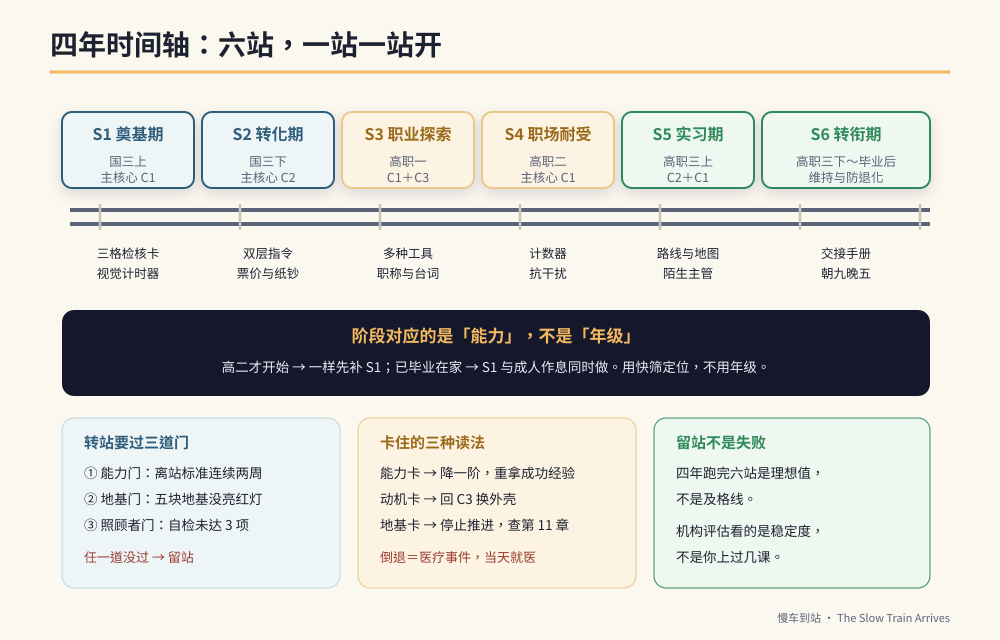

## 背景与痛点

第二篇给了三条核心。但核心是「练什么」，不是「什么时候练」。

没有时间轴会发生一件很典型的事：**家长把四年的内容压在第一个学期做完。**

国三上学期就开始练通勤、练代工、练面试台词、练找零、练抗干扰——因为每一项看起来都很重要，而且截止日在四年后，所以「越早开始越好」。

结果是三个月后全家崩溃。孩子开始抗拒，家长开始怀疑方法，然后整套计划停摆。而真正该在国三上学期打好的地基（可视化纪律、情绪回复时间），一项都没有做稳。

时间轴的功能，不是催你快，而是**允许你这学期只做这几件事**。

---

## 核心设计：六阶段一览

| 阶段 | 对应学期 | 主题 | 主核心 | 代表动作 | 离站标准（摘要） |
|------|---------|------|--------|---------|----------------|
| **S1 奠基期** | 国三上 | 稳定地基，创建可视化工作纪律 | C1 | 三格检核卡、视觉计时器 | 情绪回复 ≤ 2 分；看卡完成 2 项 |
| **S2 转化期** | 国三下 | 工作记忆多链化＋功能性数学 | C2 | 双层指令、火车票价教材 | 稳定完成 2 步指令；认得基本面额 |
| **S3 职业探索期** | 高职一 | 工具多元减敏＋社交脚本 | C1＋C3 | 多种工具操作、制式台词 | 3 种工具可操作；岗位稳定 20 分 |
| **S4 职场耐受期** | 高职二 | 产量、抗干扰、疲劳时求助 | C1 | 计数器、抗干扰训练 | 干扰下持续 25 分；合格率 90% |
| **S5 实习期** | 高职三上 | 陌生环境、通勤、职评 | C2＋C1 | 路线图、职场台词 | 陌生主管 2–3 步指令达 80% |
| **S6 转衔期** | 高职三下～毕业后 | 机构衔接、成人作息 | 全部 | 交接手册、朝九晚五 | 报到后 3 个月稳定留任 |

### 三个设计原则

**原则一：阶段对应的是「能力」，不是「年级」。**

上表的学期只是参考。真正决定要不要往下一站开的，是**离站标准**（第 20 章有完整版）。

- 孩子年纪比较小（例如国一）→ 一样从 S1 开始，只是每一站可以待久一点；
- 孩子已经高二了才拿到这本书 → **不要跳到 S4**。先用第 7 章的快筛定位，该补 S1 就补 S1。地基没补，S4 一定失败。
- 孩子已经毕业在家 → 从 S1 开始，并直接把 S6 的「成人作息」拉到现在做（见第 18 章）。

**原则二：一次只有一个主战场。**

每个阶段只主推一条核心，其他两条**维持现有强度、不加难度**。这不是保守，是因为同时推两条的结果通常是两条都退。

**原则三：每个阶段都有医疗检核点。**

环境改变（新学校、新环境、实习）是压力事件，而压力与疲劳是常见的发作诱因。**每次阶段转换前，都要有一次回诊。**

> ⚠️ **医疗免责**
> 「阶段转换前回诊」是建议的节奏，实际的追踪频率、检查项目与任何剂量调整，一律由主治医师决定。本书不提供也不建议任何自行的用药判断。

---

## 实作

### 一、四年行事历：每学期的四个固定动作

不管在哪一阶段，每学期都做这四件事。它们构成了整套计划的节奏。

```text
【学期初】
  □ 回诊一次（带第 11 章的「回诊四段信息」）
  □ IEP 或亲师会议：把这学期的 1 个主战场讲清楚，并要求列入纪录
  □ 用第 7 章快筛重新定位，确认主战场没有跑掉
  □ 更新一周配置表（平日每天 ≤ 45 分钟）

【学期中（每 4 周）】
  □ 查看三个指针的移动趋势（不看单日）
  □ 依 stop_rule 决定：升阶 / 维持 / 降阶
  □ 拍 3 张「能力证据」照片存进文件夹

【学期末】
  □ 对照离站标准，决定要不要进下一阶段
  □ 更新能力证据文件夹（第 6 章）
  □ 与老师确认下学期衔接事项

【每年一次】
  □ 查看身心障碍证明效期与重新鉴定时程
  □ 查看毕业后去向的清单与候补状况（S3 起每年至少参访 1 家机构）
```

### 二、阶段转换的三道门

要从一站开到下一站，必须同时通过三道门。**任何一道没过，就留在原站——留站不是失败。**

```text
【门 1】能力门：离站标准达成，且连续两周稳定
  → 「有一次做到」不算。连续两周的移动趋势才算。

【门 2】地基门：五块地基没有亮红灯
  → 睡眠混乱、刚换药、刚生完病、肠道不适 → 全部先留站。

【门 3】照顾者门：主要照顾者的自检没有勾到 3 项以上
  → 照顾者撑不住时推进度，是这条路上最常见的翻车原因。
```

### 三、卡住了怎么办：三种卡法与三种处置

| 卡法 | 现场的样子 | 处置 |
|------|-----------|------|
| **能力卡** | 练了六周，指针完全没动 | 把任务**降一阶**，重新拿到成功经验；并检查是不是一次动了两个维度（第 9 章） |
| **动机卡** | 做得到，但开始抗拒、逃避 | 回到 C3（第 10 章）：重新包装外壳，或降低单次时长；**不要用处罚处理动机问题** |
| **地基卡** | 忽然全面退步，各项都变差 | 停止推进，回第 11 章排查；若有技能倒退，当天就医 |

> 🔍 **一个能救很多家庭的观念**
> 「这一站待了一年半」不是失败。**四年跑完六站是理想值，不是及格线。**
> 一个在 S2 待了两年、但把两步指令练到在任何场合都稳的孩子，比一个六站都跑过、但每一站都只是「大概会」的孩子，毕业时的实际能力高得多。
> 机构评估看的是**稳定度**，不是你上过几课。

### 四、如果你现在才开始，而时间不够

不同起点的建议配置：

```text
【还有 4 年（国三上）】
  照 S1 → S6 走。这是设计时的标准路径。

【还有 2 年（高职二）】
  优先序：S1 地基（压缩到一学期）→ S4 耐受 → S5 实习 → S6 转衔
  可以放掉：S2 的完整数学教材（只做 M02 付钱、M06 余额两组）
  不可以放掉：S1 的可视化纪律。它是所有后面阶段的前提。

【只剩 1 年（高职三）】
  优先序：S1 浓缩版（4 周）→ S5 实习所需 → S6 转衔
  重点全部押在三件事：
    ① 制式台词（请教我／我想休息／我做好了）
    ② 看检核表独立完成 3 项
    ③ 通勤路线与安全规范
  这三件事是机构收案最看重的，其他都可以之后再补。

【已经毕业在家】
  最优先：创建「朝九晚五」的结构化作息（第 18 章）。
  没有结构的在家生活，退化速度比多数家长预期的快。
  同时：S1 地基 + 资源排队同时进行。
```

---

## 现场踩雷

**踩雷一：把六个阶段当成六门课，同时开课。**
四年计划变成四个月计划，然后崩溃。**一次一站。**

**踩雷二：用年级决定阶段。**
「他都高二了，应该做 S4 了吧」——如果 C1 还没稳，S4 的抗干扰训练只会制造挫折。**用快筛定位，不用年级。**

**踩雷三：留站等于退步。**
留站是正常的。真正该担心的不是留站，是「明明没过还硬推」。

**踩雷四：阶段转换时没有回诊。**
新环境是压力事件。转换前的一次回诊，是最便宜的保险。

**踩雷五：只看孩子，不看照顾者。**
第三道门存在的理由。**照顾者垮掉，全部归零。**

**踩雷六：毕业前一年才开始想去哪里。**
S3（高职一）就要开始参访与排队。第 6 章的资源清单，不是等到 S6 才拿出来用。

---

## 效益与验收（DoD）

| 项目 | 验收标准 |
|------|---------|
| 目前站别已确定 | 用第 7 章快筛定位，明确知道现在在哪一站，并写下来 |
| 本学期主战场唯一 | 这学期只有一个主战场，其他两条核心维持不加难度 |
| 行事历已创建 | 学期初、每 4 周、学期末的固定动作已排入行事历 |
| 三道门已认知 | 两位照顾者都知道「留站不是失败」，且知道三道门的内容 |
| 医疗节奏已对齐 | 阶段转换前的回诊已预约或已排入计划 |
| 起点已对应 | 依剩余年限选定配置（4 年／2 年／1 年／已毕业） |

> 💡 君之一席话
> 「你不是在赶四年的进度，你是在**确保每一站都真的停稳了才开走**。慢车之所以会到站，不是因为它开得快，是因为它每一站都有停。」

---


# 第13章　阶段一　奠基期：把规则从嘴巴移到墙上

**对应时程：** 国三上学期（或任何起点的第一个学期）
**主核心：** C1 神经控制力
**这一站要交出的东西：** 一张看得懂的检核卡、一个会消失的红色、一个闭得住嘴的大人

---

## 背景与痛点

奠基期的敌人只有一个：**口头催促**。

一天下来，一个孩子平均会听到多少句催促？「快一点」「你在干嘛」「不是说要去洗手吗」「还有一个没做」「我刚刚讲过了」。

这些句子每一句都合理，加起来却造成三个后果：

1. **孩子学会等提醒。** 既然总会有人再说一次，何必自己记？
2. **大人的声音变成背景噪音。** 讲太多次的话会失去信号价值。
3. **每一次催促都是一次人际摩擦。** 一天二十次，一年七千次。

奠基期做的事，是把规则从**大人的嘴巴**搬到**墙上、卡片上、计时器上**。

这一步的价值不只在家里。**台湾所有的小作所、庇护工场、日照中心，用的都是同一套模式：SOP 图卡、工作检核表、打勾、计数。** 一个现在就习惯「看卡工作」的孩子，四年后报到的第一天就已经会了。

---

## 核心设计：三个步骤

| 步骤 | 做什么 | 对应核心 |
|------|--------|---------|
| **① 地基维护** | 用药规律、睡眠、放电状态确认 | 地基（第 11 章） |
| **② 任务可视化** | 小帮手任务改成三格检核卡，取消口头催促 | C1 + C2 |
| **③ 固着物理隔离** | 视觉计时器 + 对话代币，给固着一个看得见的框 | C1 + C3 |

三步骤的顺序不能换：地基不稳，后面两步都会被生理状态淹没。

---

## 实作

### 步骤①：地基维护

```text
【开学第一个月要完成的三件事】
  1. 回诊一次，带第 11 章的「回诊四段信息」
  2. 创建固定的服药时间点，并与生活作息绑定
     （绑在固定事件上，比绑在时钟上更不容易忘：例如「早餐后」「洗澡后」）
  3. 创建睡眠日志两周，并把固定起床时间先稳住
```

> ⚠️ **医疗免责**
> 服药时间、剂量、能否随餐、忘记吃该不该补、以及要不要安排任何检查（含睡眠脑电图），**全部由主治医师决定**。本节只提醒你把「规律」这件事在家庭端做好，并在回诊时主动报告观察到的变化。抗癫痫药物不可自行停用或增减。

**规律为什么重要，值得说一句：** 药物浓度的稳定，仰赖服药时间的规律。这是家庭端唯一能贡献、而且贡献很大的一环——它不需要任何医疗知识，只需要一个闹钟和一个习惯。

### 步骤②：三格检核卡（本阶段的主角）

**制作规格：**

```text
【材料】A4 纸、护贝膜、魔鬼毡、可擦拭彩色笔、实物照片

【版面】
  ┌────────────┬────────────┬────────────┐
  │  车厢 1     │  车厢 2     │  车厢 3     │
  │ [实物照片]  │ [实物照片]  │ [实物照片]  │
  │  擦黑板     │  排桌椅     │  倒垃圾     │
  │    ▢       │    ▢       │    ▢       │
  └────────────┴────────────┴────────────┘
   ← 卡片底色用他喜欢的主题（火车／游乐园）

【五个设计要点】
  1. 用「实物照片」，不要用插图或纯文本
     → 拍下他学校里真正的那块黑板、那个垃圾桶
  2. 图卡用魔鬼毡，可以每天更换
     → 任务会变，卡片不用重做
  3. 只放三格。不要四格、不要五格
     → 三格是起点。做稳了再谈第四格（第 9 章第 3 级）
  4. 打勾由孩子自己做，大人不能代打
     → 打勾这个动作本身就是「完工」的神经标记
  5. 卡片是凭证：三格打完，交还卡片，换取下一件事
     → 下课、点心、火车时间
```

**现场流程（给老师与家长的同一套）：**

```text
1. 交办时：不说长句。把卡片和笔交到他手上，手指第一格。
   （可以说一句：「三个车厢，做完打勾。」）
2. 运行中：不催促。站远一点，或去做自己的事。
3. 卡住时：走第 9 章的提示褪除阶梯，先等 5–10 秒。
4. 完成时：他把卡片交回来 → 具体称赞：
   「三个都打勾了，你自己做完的。」
   （不要只说「好棒」；要说出他做了什么）
```

### 步骤③：固着的物理隔离

完整的 SOP 在第 8 章（视觉计时器五步骤）与第 10 章（对话代币制）。奠基期只要求做到最基本的版本：

```text
【最小可行版本】
  · 放学后有一段「火车时间」，用视觉计时器框起来（建议 15 分钟）
  · 开始前预告，结束时只用手势，不用嘴巴
  · 前两周会变糟（消退爆发），不改规则

【这一阶段还「不需要」做的】
  ✗ 不需要一天三张券的完整代币制（S2 再上）
  ✗ 不需要要求他把火车讲得有结构（S2 再上）
  ✗ 不需要学校端同步（能同步最好，但不是本阶段的门槛）
```

### 每周五的三个观察指针

```text
① 情绪回复时间
   从被打断到配合下一件事，中位数是几分钟？
   目标：从基线缩短 30%，或稳定进入 2 分钟内

② 无提示任务完成度
   看着检核卡，中途不需口头提醒，能连续完成几项？
   目标：稳定完成 2 项以上

③ 药物与身体观察
   体重、掉发、手抖、白天嗜睡（第 11 章的观察表）
   目标：有记录；异常时已联系医师
```

### 饮食：这一阶段只做两件事

第 11 章已经说明过各项建议的证据等级。奠基期不要一次改十件事，**只做这两件**：

```text
1. 拿掉日常含糖饮料（手摇饮、含糖汽水、含糖茶饮）
   → 改成水、无糖茶、鲜奶。这一项对情绪稳定的效益最直接。
2. 三餐规律，不要长时间空腹
   → 尤其是早餐。空腹的下午，行为纪录通常最难看。

（其他的——低 GI 主食、深海鱼、补充品——留到 S2 以后，
  或直接与营养师讨论。一次改太多，一项都撑不住。）
```

---

## 现场踩雷

**踩雷一：卡片做得很漂亮，但大人还是一直讲话。**
这是最常见的失败。**卡片不会取代催促，除非大人真的闭嘴。** 建议做法：前两周，家长自己也给自己一张纪录卡，记下「今天我催了几次」。

**踩雷二：一开始就四格、五格。**
三格。三格。三格。

**踩雷三：大人代替孩子打勾。**
「他忘记打了我帮他打」——那一格就白做了。

**踩雷四：任务是假的。**
「把这叠纸搬过去再搬回来」——没有真实结果的任务，孩子很快会知道。**用真的家事、真的班务。**

**踩雷五：消退爆发时放弃。**
第 8 章讲过，这里再说一次：前一到两周抗拒会上升，那是介入生效的信号。**这时候妥协一次，比从来没开始还糟。**

**踩雷六：把奠基期做成「什么都练」。**
这一站只有三件事。第 21 章的数学教材、第 16 章的抗干扰训练，**现在都不要碰**。

---

## 离站标准（DoD）

**全部达成且连续两周稳定，才进入 S2。**

| 项目 | 标准 |
|------|------|
| 情绪回复时间 | 中位数 ≤ 2 分钟，或较基线下降 ≥ 30% |
| 无提示完成 | 看检核卡连续完成 **2 项以上**，中途无口头提醒，达成率 ≥ 70% |
| 打勾自主 | 三格打勾 100% 由孩子自己完成 |
| 手势制止 | 成功率 ≥ 80%（第 8 章第一阶） |
| 大人一致 | 两位照顾者最近两周无「当场妥协」纪录；口头催促次数明显下降 |
| 地基 | 睡眠日志完成；固定起床时间达成率 ≥ 70%；已完成一次回诊 |
| 饮食 | 日常含糖饮料已移除；三餐规律 |

**没过就留站。** 留在 S1 半年，比带着松动的地基去 S2 好得多。

> 💡 君之一席话
> 「你以为奠基期在训练孩子看卡片，其实它在训练你**不要开口**。孩子那一关通常两周就过了，大人那一关要练两个月。」

---


# 第14章　阶段二　转化期：一句话装两件事，一张票学会付钱

**对应时程：** 国三下学期
**主核心：** C2 工作记忆链
**这一站要交出的东西：** 稳定的两步指令、认得出的纸钞面额、一次不出事的搭车

---

## 背景与痛点

奠基期把规则搬到墙上之后，会出现一个新问题：**天花板。**

孩子看着三格卡可以做完三件事，但那三件事都在同一个教室、都是他做过几百次的。你把任务换成「去隔壁班交东西，再把抹布带回来」，他做完第一件就回来了。

这不是退步，这是**容量到顶**。

同时，另一件事也开始逼近：**高职安置。** 国三下学期是安置作业的季节，而评估的内容不是学科，是「他能不能理解并完成复合指令」「他认不认得钱」「他在公共场所安不安全」。

转化期就是为了这两件事而存在的：**把容量往上推，把数学搬到真实世界。**

---

## 核心设计：三个步骤

| 步骤 | 做什么 | 对应核心 |
|------|--------|---------|
| **① 工作记忆多链化** | 从单一空间单步骤，推到跨空间双步骤 | C2 |
| **② 固着动机功能性数学化** | 用票价、门票、余额，创建数与钱的概念 | C2 + C3 |
| **③ 大众运输与社会规范** | 实地搭车，练安全与指令耐受 | C1 + C2 |

---

## 实作

### 步骤①：工作记忆多链化

完整方法在第 9 章。转化期的具体目标是**走到十六级阶梯的第 6–7 级**：

```text
【本阶段的推进路线】
  第 4 级 同室 3 步（无卡）
    ↓ 稳了
  第 5 级 跨室 1 步     「去客厅拿卫生纸过来。」
    ↓ 稳了
  第 6 级 跨室 2 步「然后」  「把碗拿到厨房，然后去客厅拿卫生纸。」
    ↓ 稳了
  第 7 级 跨室 2 步「并且」  「把联系簿交给老师，并且把抹布带回来。」

★ 每一级的通过标准：连续 5 次，至少 4 次无额外提醒完成。
★ 「顺便」这个词本阶段先不要用（见第 9 章）。
```

**学校端同步（请老师协助）：**

```text
建议请老师在交办小帮手任务时，改为双层指令：
  「请把这叠联系簿拿到隔壁班给 B 老师，并且把走廊的抹布拿回来。」

★ 关键：老师交办后也要「不追加提醒」，并在孩子卡住时
  先等 5–10 秒再给手势提示。
  第 34 章有可以直接传给老师的备忘录范本。
```

**覆诵是本阶段的核心技巧：**

```text
交办后固定加一句：「你说一次。」
他覆诵关键名词（「联系簿、B 老师、抹布」）就算通过。

这一个动作能明显提高成功率，而且它本身就是未来
职业评估的加分项——委员会看到一个「听完会确认」的人。
```

### 步骤②：功能性数学化（第四篇的入口）

这一阶段开始用火车与游乐园的真实素材教数与钱。**完整的十组教材在第四篇**，转化期只要求做到三组：

| 教材 | 练什么 | 章节 |
|------|--------|------|
| **M01 谁比较贵** | 两个数字比大小 | 第 22 章 |
| **M04 付钱大作战** | 面额辨识、「钱够不够」 | 第 23 章 |
| **M06 逼逼看余额** | 消费会让数字变小（因果） | 第 24 章 |

```text
【每日运行原则】
  · 晚饭后，挑 2 组，总共不超过 15 分钟
  · 时间到就停，即使他还想做（★ 见好就收，保留动机）
  · 用真实素材：真的票价表、真的纸钞、真的刷卡画面照片
  · 全程用角色称号（「维修长」「站长」）——扮演比要求有效
```

**为什么这三组排在最前面：** 它们对应的是机构与职评最常出现的三种现实情境——比较（哪个多）、支付（够不够）、余额（还剩多少）。**这三件事学会了，社区生活的安全网就有了一大半。**

### 步骤③：大众运输与社会规范

这一步把训练搬到室外。**它同时是 C1（在兴奋状态下守规则）与 C2（多步骤流程）的实战场。**

```text
【一次车站练习的完整流程】（周末，每次 60–90 分钟）

出发前（在家）：
  □ 看图卡预告今天的三个步骤：买票／刷卡 → 月台等车 → 上车坐好
  □ 明确声明规则：「在车站，火车只能用眼睛看，不能大声说。」
  □ 约定回程后有 15 分钟火车时间（把兴奋延后，而不是压抑）

现场：
  □ 让他自己刷卡进站（大人不代劳）
  □ 月台：黄线后方站好。★ 这是唯一不能妥协的安全规则
  □ 看跑马灯：问他「几点的车？在几号月台？」
  □ 车厢内：音量控制。太兴奋时 → 用手势，不用嘴巴

回程后：
  □ 兑现承诺的火车时间（★ 一次不兑现，往后预告全部失效）
  □ 记录：这次哪一段最难？下次先练那一段。
```

> ⚠️ **安全优先于训练**
> 月台、马路、闸门——这些场合的规则是**安全规则，不是训练项目**。孩子若在现场失控，正确的处理是**立刻离开现场**，回到安全的地方再处理情绪，而不是在月台上坚持完成流程。
> 训练可以下周再来，安全没有下周。

---

## 每周五的三个观察指针

```text
① 指令链长度与独立率
   目前稳定在第几级？连续 5 次的成功率？

② 金钱辨识
   能否指认 100／500／1000 元？
   能否回答「800 元的门票，要拿哪一张？」

③ 公共场所自律
   在车站／卖场，能否遵守安全规则、音量可控？
   （记录「需要手势介入几次」，而不是「有没有失控」）
```

---

## 现场踩雷

**踩雷一：直接跳到「顺便」。**
第 9 章讲过：「顺便」要求的是自行规划插入点，难度远高于「然后」。本阶段不用。

**踩雷二：同时提高步数与空间。**
「去三楼办公室拿三样东西」——两个维度一起动，失败率极高。

**踩雷三：孩子卡住时大人补一句。**
补回来的是这一次的家事，赔掉的是这一次的训练。**先决定今天是要「完成事情」还是「训练」。**

**踩雷四：数学教材做太久。**
15 分钟上限。做到他厌倦，比没做还糟——因为外壳会失效。

**踩雷五：用假钞票玩很久，却从不去真的买东西。**
桌上练得很好、到超商全部归零，是最常见的类化失败。**每练 4 次桌上版，就要有 1 次真实情境版。**

**踩雷六：在车站处理情绪。**
安全场合的原则是离场，不是坚持。

---

## 离站标准（DoD）

| 项目 | 标准 |
|------|------|
| 指令链 | 稳定通过**第 6 级**（跨室 2 步「然后」），连续 5 次至少 4 次无提醒完成 |
| 覆诵 | 交办后能主动或在一次提示下覆诵关键名词，达 ≥ 70% |
| 独立率 | `independent_task_rate` 较 S1 结束时再提高 ≥ 0.1 |
| 金钱 | 能正确指认 100／500／1000 元；能回答「哪一张才够付」达 ≥ 80% |
| 余额概念 | 能说出「刷卡之后钱会变少」或以手势表达数字变小 |
| 公共安全 | 车站练习连续 3 次，全程遵守黄线与闸门规则，无安全事件 |
| 学校同步 | 老师端已开始使用双层指令，且知道「不追加提醒」的原则 |
| 地基 | 学期内完成回诊；睡眠与饮食维持 S1 的水准 |

> 💡 君之一席话
> 「他学不会九九乘法表，但他学得会『八百元的门票要拿蓝色那张』。**前者是学科，后者是他二十五岁那年会用到的东西**——如果只能选一个，答案不难。」

---


# 第15章　阶段三　职业探索期：从「小帮手」到「有职称的人」

**对应时程：** 高职一年级
**主核心：** C1（新环境的情绪）＋ C3（角色转换）
**这一站要交出的东西：** 三种以上能操作的工具、三句能自动说出口的职场台词、一个他认同的职称

---

## 背景与痛点

高职一年级是四年里**环境变动最大**的一年。

新学校、新老师、新同学、新作息、新通勤路线。对一个依赖可预测性的孩子来说，这是一次全面性的地基松动——而它刚好发生在他好不容易把国三练稳之后。

家长最常在这一年遇到的两件事：

**第一，前三个月看起来全部退步。** 情绪回复时间拉长，检核卡不理，固着碎念变多。这通常不是能力退步，是**环境重载**。

**第二，他开始「太热心」。** 因为人缘好、乐于助人，他会跑去帮每一组、每一个人。而在一个特教班里，其他同学未必都能好好回应——有些孩子会推开他、拒绝他、甚至情绪反击。**这是他这一年最容易受伤的地方。**

职业探索期要做的，是**在环境变动中把角色立起来**：他不再只是「爱帮忙的同学」，他是有职称、有工作范围、有标准说法的人。

---

## 核心设计：三个步骤

| 步骤 | 做什么 | 对应核心 |
|------|--------|---------|
| **① 环境转换的压力管理** | 开学前回诊、老师交接、前三个月降低训练强度 | 地基 |
| **② 工具多元减敏** | 从一种工具扩到多种，创建操作耐受 | C2 + 动作 |
| **③ 角色化与社交脚本** | 给他一个职称与明确的工作边界，配上制式台词 | C3 + C1 |

---

## 实作

### 步骤①：环境转换的压力管理

```text
【开学前一个月】
  □ 回诊一次，并主动告知医师「即将转换学校环境」
  □ 准备一份给新学校的交接数据（第 34 章有范本），内容包含：
      · 医疗与紧急处置（发作型态、紧急联系、就医纪录）
      · 固着行为的引导方式（手势、计时器、代币）
      · 有效的教学方式（视觉卡、双层指令、覆诵）
      · 「他最擅长什么」（★ 一定要写这一段）
  □ 若可能，开学前带他实地走一次校园与通勤路线

【开学后前三个月：降强度，不加新项目】
  · 训练强度降到平常的 6–7 成
  · 不导入任何新工具、新教材、新规则
  · 维持原有的检核卡与计时器（★ 熟悉的工具在陌生环境中是定锚）
```

> ⚠️ **医疗免责**
> 环境压力、疲劳与睡眠不足是常见的发作诱发因子。若孩子在新环境出现**频繁眨眼、短暂失神、呼唤无反应、或任何疑似发作的表现**，请记录时间与情境并尽速回诊，由医师判断是否需要调整。任何用药调整都必须由医师决定，家长不可自行增减。

### 步骤②：工具多元减敏

高职的职业实作课会用到各种工具。而一个只用过抹布的孩子，第一次拿到喷雾瓶、刮刀、标签机时，可能会直接拒绝——**不是不会，是新的东西让他不安。**

```text
【居家工具减敏清单】（每两周引入一种，不要一次全上）

  □ 不同材质的抹布（棉、纤维、菜瓜布）→ 擦不同的东西
  □ 喷雾瓶 → 练「压三下」的定量控制
  □ 刮玻璃器 → 练「由上往下、不重叠」的路径
  □ 平板拖把 → 练「沿着磁砖线推」的直线控制
  □ 标签机 / 贴纸 → 练「贴正、贴在同一位置」
  □ 剪刀 → 练沿线剪、剪直线（见第 27 章：为什么考剪刀）
  □ 夹链袋 / 封口 → 练「装、压、封」的三步骤
  □ 按压计数器 → 练计数与完工回报

【每一种工具的引入流程】
  1. 大人先示范一次（不解说，只做）
  2. 用固着外壳给它一个名字：
     「火车进站了，维修长要用这条蓝色抹布擦车窗。」
  3. 让他做，允许做不好
  4. 完成后具体称赞：「你有沿着线推，没有歪掉。」
```

**目标不是熟练，是不排斥。** 这一阶段的检核标准是「能操作三种以上不同工具，且单一工具能专注操作 15–20 分钟」，不是「做得多好」。

### 步骤③：角色化与社交脚本（本阶段的主角）

**给他一个职称。**

这件事听起来像游戏，但它在这个阶段的效果非常明确：**职称会把「被要求」转换成「扮演」，而扮演的抗拒成本远低于服从。**

```text
【职称设计三原则】
  1. 从固着兴趣里取材（维修长、站长、安全检查员、清洁组长）
  2. 有明确的工作范围（★ 这是保护他的关键）
  3. 在家与学校用同一个职称

【工作边界：这一段是为了保护他】
  明确告诉他：
    「你今天是 A 组的清点长，你只要看好 A 组的工具。
     B 组有 B 老师会帮忙，你不用过去。」

  → 用物理边界（哪一组、哪一张桌子、哪一个篮子）
    而不是抽象规则（「不要太鸡婆」）。
  → 这能防止他因为过度热心而被同侪拒绝，
    进而引发他最难处理的那种挫折。
```

**三句职场台词（练到不用想）：**

```text
① 卡住时：「请老师教我，谢谢。」
② 太累时：「我太累了，我想休息一下。」
③ 完成时：「报告老师，我做好了，请检查。」

【练法】
  每天在实作或家事中，故意制造 1 次「卡住」的情境
  （给一个他不会的步骤、或把工具收起来），
  引导他使用台词，成功就大力称赞。

【高端：冲突时的台词】
  同组的人做错、或自己被打断时：
    「没关系，我们重新做。」
    「好，我们现在先工作。」
  → 用制式语言覆盖掉情绪反应。
    自闭特质的孩子不擅长即兴社交，但**非常擅长运行剧本**。
```

> 🔍 **为什么「剧本」对他有效，而「道理」没效**
> 即兴社交需要即时判读对方的情绪、推测意图、选择合适的回应——那是他最弱的一组能力。
> 而运行固定脚本用的是进程性记忆，那是他相对强的一组。
> **把社交变成 SOP，不是降低标准，是换一条他走得通的路。**

---

## 每周五的三个观察指针

```text
① 新环境的生气频率
   每周因固着被中断或人际挫折而生气的次数
   目标：开学三个月内稳定在每周 ≤ 2 次，且无摔东西／大喊

② 工具操作
   能正确握持并独立完成的工具种类数
   目标：≥ 3 种；单一工具专注 ≥ 15 分钟

③ 岗位稳定度
   不需旁人叮嘱，能待在工作岗位上的持续时间
   目标：≥ 20 分钟
```

---

## 现场踩雷

**踩雷一：开学就加强训练。**
新环境本身就是高负荷。前三个月加强，等于在他最脆弱的时候加压。**降强度，让他先活下来。**

**踩雷二：把前三个月的退步当成能力退步。**
先查地基、先看环境，再谈能力。若同时出现**技能倒退**（原本会的不见了），那是医疗事件，见第 3 章红旗。

**踩雷三：不设工作边界。**
「他热心是好事啊」——热心加上没有边界，等于一年里反复被拒绝。**边界是保护，不是限制。**

**踩雷四：职称只有家里在用。**
学校不知道、老师没配合，角色就立不起来。**开学交接数据里要写明这一项。**

**踩雷五：工具一次上太多。**
两周一种。八种工具就是四个月，刚好一个学期。

**踩雷六：台词只在家里练。**
一定要有学校版本。第 34 章的备忘录里包含这三句话，可以直接交给老师。

---

## 离站标准（DoD）

| 项目 | 标准 |
|------|------|
| 环境适应 | 开学三个月后，每周生气次数 ≤ 2 次，且无失控行为 |
| 工具 | 能正确操作 ≥ 3 种职场基本工具，单一工具专注 ≥ 15 分钟 |
| 岗位 | 不需叮嘱，稳定待在岗位 ≥ 20 分钟 |
| 台词 | 三句职场台词中至少 2 句能在无提示下自发使用，每周 ≥ 3 次 |
| 角色 | 家庭与学校使用同一职称；工作边界明确且孩子能说出「我负责哪一组」 |
| 协作 | 能与同侪共同完成一项 20 分钟的实作，过程中情绪不失控 |
| 资源 | 本学年已参访至少 1 家机构（小作所／庇护工场／日照） |
| 地基 | 开学前已回诊并交接；睡眠在新作息下重新稳定 |

> 💡 君之一席话
> 「他不是变得不听话，他是**同时要处理新学校、新同学、新路线，和一个没有人帮他翻译的世界**。这一年你要给他的不是更多训练，是一个职称、一张桌子、和一句『这一组是你的』。」

---


# 第16章　阶段四　职场耐受期：吵、久、累的时候，还做得下去吗

**对应时程：** 高职二年级
**主核心：** C1 神经控制力（抗干扰与疲劳管理）
**这一站要交出的东西：** 一段吵闹中仍然不停的手、一句累到极点时说得出口的求助

---

## 背景与痛点

到了高职二年级，多数家长会发现一件事：**孩子在家里表现很好，一到外面就不行。**

在家里，安静、熟悉、只有他和妈妈。他可以折衣服折三十分钟。

到了实作教室，二十个同学、机器声、老师的广播、隔壁组在吵架。他做了五分钟就擡头、发呆、开始讲火车。

这不是他懒，是**专注力的成立条件不同**。在无干扰环境中创建的专注，不会自动类化到有干扰的环境——而他未来要去的地方（小作所、庇护工场、任何一种职场）**全部都是有干扰的环境**。

还有第二件事：**疲劳。**

高二的实作课会拉长到连续一到两小时。在疲劳的后半段，孩子的抑制能力会掉下来——本来忍得住的，现在忍不住。而这时候如果没有替代方案，唯一的输出就是发脾气。

**职场耐受期要练的，就是这两件事：吵的时候不停，累的时候会说。**

---

## 核心设计：三个步骤

| 步骤 | 做什么 | 对应核心 |
|------|--------|---------|
| **① 产量概念** | 用计数器创建「做多少」的具体感 | C2 + C3 |
| **② 抗干扰训练** | 在受控的干扰下维持工作 | C1 |
| **③ 疲劳时的求助** | 把「累到发脾气」换成「累了会说」 | C1 |

---

## 实作

### 步骤①：产量概念与计数器

在此之前，任务的完成标准是「做完」。这一阶段开始，加入「做了多少」。

```text
【火车出厂计数器】
  一个实体按压计数器（文具店的计数器即可），粘贴他的主题贴纸。

  规则：
    · 每完成 N 个单位（10 个包装、5 张桌子、20 件衣服），
      他自己按一下计数器（★ 一定要自己按）
    · 累积到当日目标数量 → 换取休息时间或一张奖励贴纸
    · 目标数量由「他昨天实际做到的量」决定，不要凭空设置

【为什么要有实体计数器】
  · 可视化：抽象的「产量」变成看得见的数字
  · 触觉回馈：「按下去」那一声，本身就是完工的信号
  · 自主性：数字是他自己按出来的，不是大人记的
```

**家庭产线：每天 30–40 分钟**

```text
【居家代工的实作内容（挑一种，做稳再换）】
  · 全家衣物分类折叠（依人／依类别放进不同抽屉）
  · 采买回来的干货分装（固定数量装袋、封口）
  · 资源回收分类
  · 擦拭全家门把、开关、桌面（依固定路线）

【流程】
  1. 计时器设 30–40 分钟（比 S1 的时长加倍）
  2. 他站在或坐在固定的工作台前，连续作业
  3. 大人在旁计时、计量，但不聊天、不指导
  4. 时间到 → 品质自检 → 按计数器 → 工具归位 → 「下班」
```

### 步骤②：抗干扰训练（本阶段的主角）

完整原则在第 8 章。这里是高二版本的强度：

```text
【每周 2–3 次，每次 20–30 分钟】

  1. 进行重复性作业，计时器设 25 分钟
  2. 在第 10 分钟与第 20 分钟各制造一次干扰：
       · 播放他喜欢的火车音效或音乐
       · 旁边有人大声讲话
       · 忽然把某个工具拿走
       · 忽然说「这个先别做，改做另一个」
  3. 目标行为（择一即可）：
       · 不转头、手不停，持续 2–3 分钟
       · 或启动定格站姿 + 台词：「我现在要先把工作做完。」
  4. 成功 → 具体称赞
     失败 → 降低干扰强度，不责备

【禁止事项（再说一次）】
  ✗ 疲累、生病、情绪不佳的日子不做
  ✗ 一次练习不超过 2 次干扰
  ✗ 成功后不再加码
  → 目的是创建耐受，不是制造挫折。
```

### 步骤③：疲劳时的求助（这一节最重要）

**在庇护工场与小作所的现场，决定去留的往往不是产量，是「累的时候会怎样」。**

一个累了会说「我想休息」的人，主管可以安排；一个累了就僵住、跺脚、或直接离开岗位的人，主管会判定为风险。

```text
【疲劳求助的三步骤动作】（与第 8 章的定格站姿同一套）
  1. 双手在肚脐前方交叠
  2. 深吸一口气
  3. 说：「老师，我太累了，我想喝水休息。」

【怎么练：刻意制造疲劳点】
  · 在他工作到第 25–30 分钟（明显开始分心）时，
    大人主动提示一次：「你累了吗？累了要说什么？」
  · 他说出台词 → 立刻准许休息（★ 一定要真的准）
  · 重复两周后，改成不提示，等他自己说
  · 他自己说出来的第一次，要给非常明确的称赞：
    「你自己说你累了，很棒。休息五分钟。」

【★ 最关键的一条原则】
  他说了「我想休息」，就一定要让他休息。
  如果你回「再做十个就好」——这句台词就死了。
  下一次他不会说，他会直接发脾气。
```

### 疲劳管理：高墙式作息

高二的训练强度是四年里最高的。相对地，**放松也必须是刻意安排的**。

```text
【高墙式作息】
  · 放学回家后（例如 17:00 之后），不再进行任何学习或训练
  · 晚餐后进入放松模式：洗澡、听音乐、完全自由的火车时间
  · 就寝时间固定，睡眠不足的隔天，训练强度自动降半

【为什么要立这道墙】
  疲劳与睡眠不足是常见的发作诱发因子；而长期的过度训练，
  换来的通常不是进步，是抗拒与退步。
  这一站练的是耐受，不是耗竭——两者只差一线。
```

> ⚠️ **医疗免责**
> 若在高强度活动期间出现任何疑似发作的表现（短暂失神、抽动、意识改变）、异常的手部颤抖、或明显的白天嗜睡，**请记录并尽速回诊**。体能负荷与癫痫的关系、饮水量建议、以及任何用药调整，都应由主治医师评估。

---

## 每周五的三个观察指针

```text
① 抗干扰持续时间
   有噪音干扰下，手中工作不停顿的最长分钟数
   目标：≥ 25 分钟

② 产量与良率
   40 分钟作业期内的合格率（有没有因疲劳而后段品质下滑）
   目标：≥ 90%

③ 疲劳时的情绪控制
   工作到最后 10 分钟时被打断或换任务，能否接受调度
   目标：面露疲态但能配合，或主动使用求助台词
```

---

## 现场踩雷

**踩雷一：把抗干扰练成整人。**
干扰训练的目的是耐受，不是测试底线。**连续干扰、加码干扰、在他状态差时干扰——都会让「忍耐」与「被欺负」产生链接。**

**踩雷二：他说累，你说再一下。**
这是本章唯一一条「一次就毁掉」的规则。

**踩雷三：只练产量，不练良率。**
机构评估同时看两者，而且**良率通常更重要**——做得慢可以安排，做坏了要重工。

**踩雷四：晚上还在加课。**
高墙式作息不是偷懒，是保护。

**踩雷五：把疲劳的表现当成态度问题。**
后半段变差是生理现象。正确处理是缩短单次时长、增加休息点，而不是要求他「再撑一下」。

**踩雷六：忘了 S3 的台词。**
求助台词是 S3 创建、S4 大量使用的。如果 S3 没练起来，这一站要先回头补。

---

## 离站标准（DoD）

| 项目 | 标准 |
|------|------|
| 抗干扰 | 在干扰环境下持续工作 ≥ 25 分钟，连续两周稳定 |
| 产量与良率 | 40 分钟作业期，合格率 ≥ 90%，且后段无明显下滑 |
| 求助台词 | **能在无提示下**于疲劳时说出求助句，每周 ≥ 2 次 |
| 疲劳调度 | 工作末段被打断或换任务时，能接受调度，无失控 |
| 计数器 | 产量目标由孩子自己按计数器达成，连续四周 |
| 作息 | 高墙式作息落实 ≥ 80% 的日子；睡眠时数稳定 |
| 资源 | 已完成第 2 家机构参访；知道各家的收案条件 |

> 💡 君之一席话
> 「你以为职场要的是做得快，其实职场要的是**累的时候不会出事**。一句『我想休息』练得起来，比多做二十个包装值钱得多——前者他要用一辈子，后者明天就忘了。」

---


# 第17章　阶段五　实习期：陌生的地方、陌生的主管、和一张自己画的地图

**对应时程：** 高职三年级上学期
**主核心：** C2（陌生人的复合指令）＋ C1（环境重载）
**这一站要交出的东西：** 一条自己走得完的通勤路线、一张口袋里的地图、一份职评的好印象

---

## 背景与痛点

前四站都在**熟人环境**里完成：妈妈、特教老师、同班同学。

实习期第一次把他放到**没有人认识他**的地方。现场主管不知道他的固着、不知道他的手势、不知道他为什么忽然停下来。那里的噪音更大、规则更陌生、而且没有人会替他翻译。

同时，这一学期还有一件会影响往后十年的事：**职业重建评估。**

各县市劳工主管机关的职业重建个案管理师会入校评估，这份评估与后续的媒合，很大程度决定了毕业后他能去哪里。而评估看的是**真实现场的表现**，不是家长的说法。

**实习期的核心，是把「在熟人面前做得到」变成「在陌生人面前也做得到」。**

---

## 核心设计：三个步骤

| 步骤 | 做什么 | 对应核心 |
|------|--------|---------|
| **① 陌生环境的空间内化** | 把新场所画成地图，降低迷航焦虑 | C1 |
| **② 通勤独立性** | 把固着兴趣变成真正的交通能力 | C2 + C1 |
| **③ 职场脚本与评估准备** | 面对陌生主管的标准应对 | C1 + C3 |

---

## 实作

### 步骤①：一张口袋里的地图

陌生空间对这类孩子造成的焦虑，经常被大人低估。**他不是怕工作，他是不知道厕所在哪里。**

```text
【实习第一天要做的第一件事】
  陪他把实习场所的关键点画成一张小地图（A6，护贝，放口袋）：

    我的工作桌 → 洗手间 → 饮水机 → 休息区 → 主管在哪里

  · 用简单的线和方框，不需要精确
  · 每个点贴一张实际拍的照片更好
  · 明确告诉他：「不知道怎么办的时候，把它拿出来看。」

【第二张卡：紧急卡】
  正面：我的名字、实习单位、联系人电话
  背面：三句话
        「请老师教我，谢谢。」
        「我太累了，我想休息一下。」
        「我做好了，请检查。」
  → 他自己看得懂，别人也看得懂。
```

### 步骤②：通勤独立性（固着功能化的最高应用）

这一步是整本书里，**固着兴趣兑现得最彻底的一次**：那个讲了十几年火车的孩子，现在要真的搭火车去上班。

```text
【通勤训练的五个梯度】（每一梯至少 4 次成功再往下走）

  梯度 1  全程陪同，大人操作
  梯度 2  全程陪同，他操作（刷卡、看跑马灯、上下车）
  梯度 3  大人同车厢但保持距离，不介入
  梯度 4  大人在后方暗中观察（不同车厢／不同位置）
  梯度 5  独立通勤，大人在终点等（或以电话确认）

★ 梯度 5 是否运行，取决于路线的安全条件、孩子的判断力、
  以及当地环境。**这不是必须达成的目标**——很多成年身障者
  终生使用陪同或接送，那完全没有问题。
  能做到就是加分，做不到就用第 18 章的替代方案。

【通勤中的规则（★ 这一条每次都要重申）】
  「在车上，火车只能用眼睛看，不能大声说。」
  兴奋到失控时 → 手势，不用嘴巴。
  回到家再给他一段完整的火车时间作为出口。
```

> ⚠️ **安全高于一切**
> 通勤训练的每一个梯度，都必须以**安全**为前提评估：路线是否需要跨越危险路口、车站是否有无障碍与服务人员、孩子在突发状况（误点、改线、有人搭讪）下的反应如何。
> 若有任何疑虑，**停在较低的梯度就好**。独立通勤是选项，不是必须。

**突发状况的减敏演练：**

```text
【惊喜减敏】（每两周一次，在安全情境下）
  出发前忽然改变计划：
    「今天火车坏掉了，我们改搭公车。」
  引导他看路线图，并念出台词：
    「没关系，改搭公车也可以到。」

  → 目的是让「计划改变」变成一件练习过的事，
    而不是第一次发生就在实习现场。
```

### 步骤③：职场脚本与评估准备

```text
【陌生主管的四步应对】（把 S3 的台词升级为完整流程）

  1. 听指令：眼神看着对方，不要先动
  2. 覆诵：点头 + 大声覆诵核心名词
       主管：「把这箱货拿去 A 货架上架，然后把空箱拿去后面回收。」
       他：  「好，A 货架上架，空箱回收。」
  3. 运行：依序完成
  4. 回报：「报告，我做好了，请检查。」

★ 第 2 步是整套流程的关键。它做两件事：
  · 对他自己：把听觉输入转成语音输出，记得住
  · 对评估者：展现「听得懂、会确认」的工作人格
```

**实习期间的固着管理（比平常更严）：**

```text
· 工作时间内，主动提起火车／游乐园的次数目标为零
· 休息时间可以讲，但仍在时间框内
· 现场想讲时 → 使用第 8 章的手势，或自我提示台词：
  「我现在要先工作，下班再说。」

★ 这不是压抑，是场合概念。回家后的火车时间必须加长，
  作为一整天克制的出口——**克制必须有出口，否则会在周末爆炸。**
```

### 周末减压：这一站的隐藏必修

实习期最常见的问题不在平日，在周末。

孩子在周一到周五为了「勉强控制」耗尽了所有前额叶能量，到了周六会出现极度疲惫、易怒、疯狂碎念——家长常误以为是退步。

```text
【周末减压原则】
  · 周末两天不安排任何训练、不谈实习
  · 完全接纳他的碎念与疲惫（★ 这两天不运行代币制）
  · 可安排一次真正的火车小旅行，作为一周辛苦的兑现
  · 周日晚上确保充足睡眠，让下周的地基重新填满
```

---

## 每周的三个观察指针

```text
① 陌生环境指令理解率
   现场主管交办的 2–3 步复合指令，能否不经翻译正确运行
   目标：≥ 80%

② 工作时段的固着抑制
   工作时间内主动提起固着话题的次数
   目标：零（休息时间不计）

③ 交通与安全规范
   黄线、闸门、红绿灯的遵守
   目标：100%，且无任何冲动穿越或脱序
```

---

## 现场踩雷

**踩雷一：实习前没有交接。**
现场主管不知道他的状况，就无法提供合适的支持，也可能误读他的行为。**交接数据与紧急处置说明，必须在第一天之前送到现场。**

**踩雷二：把独立通勤当成必达目标。**
安全永远优先。**做不到就用接送或陪同**——这不影响机构收案，也不代表训练失败。

**踩雷三：周末继续加训。**
这是实习期最常见的翻车原因。**周末的功能是修复，不是加码。**

**踩雷四：只练工作，没练「不会的时候怎么办」。**
现场一定会遇到没教过的状况。**「请教我」这句话的价值，在这一站达到最高。**

**踩雷五：职评当天才第一次见到职管员。**
若有机会，在评估前先让孩子见过对方、或至少熟悉评估的场地与流程。**陌生度降低，表现就会接近真实水准。**

**踩雷六：家长在评估时抢着回答。**
评估的是孩子，不是家长。**该说的写在书面数据里，现场让孩子自己表现。**

---

## 离站标准（DoD）

| 项目 | 标准 |
|------|------|
| 空间内化 | 实习场所地图完成并实际使用；能自行找到厕所、饮水机、主管 |
| 陌生指令 | 陌生主管的 2–3 步指令运行成功率 ≥ 80% |
| 覆诵 | 面对陌生人交办时，能主动覆诵核心名词，达 ≥ 70% |
| 固着抑制 | 工作时段主动提起固着话题次数为零，连续两周 |
| 通勤 | 达到梯度 3 以上；或已确立可行的替代通勤方案 |
| 交通安全 | 100% 遵守安全规范，无安全事件 |
| 突发应变 | 至少完成 4 次惊喜减敏演练，能使用台词自我安抚 |
| 周末修复 | 周末减压原则落实；周一的状态未见持续恶化 |
| 制度 | 已完成职业重建评估相关流程；家长知道下一步的媒合方式 |

> 💡 君之一席话
> 「他讲了十六年火车，现在火车真的载他去上班了。**这一站不是在教他搭车，是在把他这辈子最没用的那个执着，兑现成他最有用的一项能力。**」

---


# 第18章　阶段六　转衔期：毕业之后，日子怎么过

**对应时程：** 高职三年级下学期至毕业后
**主核心：** 全部（维持与防退化）
**这一站要交出的东西：** 一本交接手册、一份朝九晚五的作息、一个不会在家烂掉的第一年

---

## 背景与痛点

毕业典礼结束的隔天早上七点半，会发生一件事：**没有人叫他起床。**

没有校车、没有作息表、没有老师、没有同学。如果机构的名额还在候补，那么接下来的日子就是：睡到中午、看电视、玩手机、吃饭、睡觉。

而这正是这条路上最大的一次崩塌。

特教家庭圈里有一个广为人知的现象：**毕业后在家的头半年，能力退得比过去六年练得还快。** 语言、自理、情绪控制、作息——都会退。不是因为他变懒，是因为**支撑这些能力的结构整组消失了**。

转衔期要对抗的就是这件事。它有两个战场：**把他送进机构**，以及**在他还没进去之前，家里自己撑出一套结构**。

---

## 核心设计：三个步骤

| 步骤 | 做什么 | 何时 |
|------|--------|------|
| **① 医疗转衔** | 从儿童科衔接到成人科，病历与用药完整交棒 | 毕业前半年 |
| **② 机构交接** | 把四年的方法整理成一本手册，交给就服员 | 毕业前 2 个月 |
| **③ 成人作息** | 创建朝九晚五的结构，无论有没有排到机构 | 毕业当周开始 |

---

## 实作

### 步骤①：医疗转衔

```text
【毕业前半年要办的事】
  □ 请原主治医师开立完整病历摘要，内容含：
      · 诊断、发病经过、目前用药与稳定状况
      · 过去的重要检查结果（EEG／MRI／基因）
      · 目前的追踪频率与监测项目
  □ 确认衔接的成人科别与院所（多数是成人神经内科）
  □ 更新身心障碍证明（确认效期与是否需重新鉴定）
  □ 更新第 4 章的急诊卡（换成成人版：新科别、新医师、新用药）
```

> ⚠️ **医疗免责**
> 医疗转衔的时机、衔接科别、追踪频率与任何用药调整，一律由医师决定。成年后身体代谢与体重可能改变，这是**回诊时值得主动提出的观察**，但剂量的任何变动都必须由医师运行。切勿自行增减或停用抗癫痫药物。

### 步骤②：机构交接手册（本阶段最有价值的产出）

四年下来，你手上累积的东西比任何评估报告都珍贵：**你知道什么方法对他有效。**

而这些知识如果没有交出去，新机构的就服员得再花半年重新摸索——而那半年，孩子可能已经被粘贴「情绪不稳」的标签了。

```text
【交接手册的七页】（A4 印出，护贝，交给就服员一份）

  第 1 页　他是谁
    · 名字、暱称、他喜欢被怎么叫（★ 职称要写上去）
    · 一句话介绍：「他是很愿意帮忙的人，人缘很好。」
    · 他最擅长什么（具体：擦拭、折叠、分类、清点）

  第 2 页　医疗与紧急处置
    · 诊断、用药、服药时间
    · 发作型态、平常持续多久、什么情况要叫救护车
    · 紧急联系人、主治医院与科别
    · 已知过敏与禁忌

  第 3 页　怎么交办事情给他（★ 最实用的一页）
    · 一次一到两件事，句子短，名词放句尾
    · 交办后请他覆诵：「你说一次。」
    · 给视觉检核卡，让他自己打勾
    · 他卡住时，先等 5–10 秒，再给手势提示
    · 不要连续口头催促（会失效，而且会让他更慢）

  第 4 页　他的固着，以及怎么处理
    · 他喜欢的主题是什么
    · 工作时间他会克制；休息时间可以聊
    · 他碎念时：五指并拢向前的手势 + 指向检核表
    · 不要跟他口头争辩（会拉长）
    · 焦虑时，这个主题反而是最好的安抚工具

  第 5 页　他的三句话
    · 「请老师教我，谢谢。」＝ 他卡住了
    · 「我太累了，我想休息一下。」＝ 请让他休息（★ 说了要真的准）
    · 「报告，我做好了，请检查。」＝ 他完工了
    → 请告诉他的新同事：这三句话是他的求救信号，不是客套。

  第 6 页　什么情况要打电话给家长
    · 疑似发作、意识改变
    · 连续两天以上明显的行为改变或退步
    · 他说了「我太累了」但休息后仍无法回到工作

  第 7 页　附件
    · 视觉检核卡样张（他熟悉的那一张）
    · 计时器与代币的使用说明
    · 一张他的照片（工作中的，不是证件照）
```

**这本手册要亲手交、当面讲一次。** 一份放在文件夹里没有人读的文档，不会保护任何人。

### 步骤③：成人作息（无论有没有排到机构）

```text
【朝九晚五的家庭版】

  07:30  起床（★ 固定，周末最多晚一小时）
  08:00  早餐、换上「工作服」（一件固定的围裙或外套，仪式感）
  08:30  出门／或在家开始「上班」
  09:00  第一段作业（30–40 分钟）
  09:40  休息
  10:00  第二段作业
  11:00  家务或社区活动（买东西、倒垃圾、散步）
  12:00  午餐
  13:00  休息时间（可以是他的火车时间）
  14:00  第三段作业或体能活动
  15:30  自由时间
  17:00  「下班」：工具归位、脱下工作服
  18:00  晚餐
  19:30  固定如厕时间（第 11 章）
  20:30  放松（洗澡、音乐、火车折页）
  22:00  就寝

【可视化的月历】
  客厅挂一张大月历：
    绿色 = 上班日（机构或家庭产线）
    红色 = 休息日（火车日）
    黄色 = 特殊安排（回诊、家庭活动）
  → 让「今天要做什么」永远看得见。
```

**如果还没排到机构，家庭产线就是他的工作。** 内容可以是：家务代工、社区采买、资源回收整理、协助家中长辈。**重点不是产值，是结构。**

### 报到后的前三个月：渐进与陪伴

```text
【交接期的渐进安排】（若机构允许）
  毕业前 1 个月：实地参观新机构 ≥ 3 次
                （认识就服员、看到自己的座位）
  第 1 周：半天制
  第 2 周：全天制，家长可在附近或休息区待命
  第 3 周起：正常出勤

【预期会发生的事：行为倒退】
  离开待了三年的学校、告别熟悉的老师，对固着特质强的孩子
  是巨大冲击。头一个月常会出现：
    · 固着话题暴增
    · 不愿出门
    · 生气频率上升
    · 睡眠变差

  这是**适应反应，不是失败**。处理方式：
    · 增加预告（「明天还是要去，去五个小时，然后回家」）
    · 维持家中的既有结构不变（★ 家里不要跟着乱）
    · 增加固着时间作为缓冲
    · 若持续超过 6–8 周未改善，与就服员、社工讨论调整
```

---

## 每月的三个观察指针

```text
① 独立工作留任
   能否看着机构的 SOP 图卡独立完成任务，不需就服员全程盯着
   目标：每日稳定在岗 ≥ 4 小时，错误率在机构容许范围内

② 社交延续
   是否融入新环境、是否延续「愿意帮忙」的特质
   目标：获得就服员或主管的正面回馈

③ 变动时的调适
   活动内容或交通突然变动时的反应
   目标：在预告或计时器介入后，3 分钟内平复并配合
```

---

## 现场踩雷

**踩雷一：毕业后「先休息一阵子」。**
这句话听起来合理，实际上是退化的起点。**结构要在毕业当周就接上**，哪怕只是家庭版。

**踩雷二：交接手册没有交、或交了没有讲。**
四年的知识就这样留在你脑子里，而新机构要重新试错。

**踩雷三：把头一个月的倒退当成「选错机构」。**
先给它六到八周。太早换机构，会让孩子重新经历一次适应期。

**踩雷四：家里的结构跟着机构一起乱。**
孩子在新环境已经不稳，如果家里的作息也跟着调来调去，他就没有任何定锚点了。**外面越乱，家里越要固定。**

**踩雷五：只准备一个去处。**
候补不会照毕业日期排。**准备一个过渡方案**（家庭产线 + 定期社区活动 + 部分时间的机构），比赌一个名额安全。

**踩雷六：家长全部放手。**
转衔不是交棒，是**并肩一段**。前三个月的密切联系，决定往后十年的稳定度。

---

## 离站标准（DoD）

| 项目 | 标准 |
|------|------|
| 医疗转衔 | 病历摘要已取得；成人科别已衔接；急诊卡已更新为成人版 |
| 交接手册 | 七页手册完成，**已当面交付并口头说明** |
| 作息 | 朝九晚五作息实施 ≥ 80% 的日子；视觉月历已上墙 |
| 报到 | 毕业后 1 个月内完成报到（或已启动明确的过渡方案） |
| 适应 | 报到后 3 个月内稳定留任，无重大人际冲突与医疗事件 |
| 求助句 | 三句话已交给机构，且孩子在新环境中至少使用过 1 次 |
| 家庭续航 | 照顾者自检未达 3 项；已使用过至少一次喘息或支持资源 |

> 💡 君之一席话
> 「你花四年练他，最后一步却是练你自己——**把手放开一点点，同时把手册递出去**。他要去的地方没有你，但那里可以有你写的七页纸。」

---


# 第19章　可发展事项：达标之后，往上叠什么

## 背景与痛点

每一站都有离站标准。但离站标准是**及格线**，不是天花板。

有些孩子会在某一站表现得比预期好——三格检核卡两周就稳了，两步指令一个月就通了。这时候家长通常会做两件事之一：

**第一种：立刻冲下一站。** 结果是地基还没有真正扎实（只是在熟悉情境下达标），到了下一站全面崩盘。

**第二种：原地维持。** 「反正还没到下学期」，于是三个月都在做同一件已经会的事。孩子开始无聊、开始敷衍，而那个「本来可以再往上一层」的窗口就这样过去了。

这一章给第三种选择：**在同一站的深度上加码。**

不是往前跑，是往下扎。而扎的方式有一个共通原则：

> 🔍 **加值原则**
> **永远在他展现优势的时候，悄悄塞进下一个难度；永远把新难度包在他最爱的东西里。**
> 他在做他擅长的事、情绪最好的时候，是接受新挑战成本最低的时刻。而等到他卡住、挫折、生气的时候才加码，那叫加压，不叫加值。

---

## 核心设计：加值 vs 升阶

| | 升阶（往前开一站） | 加值（在原站往下扎） |
|---|---|---|
| 什么时候做 | 离站标准全部达成且稳定两周 | 部分项目提早达标，但整体还没过门 |
| 动的是什么 | 换一组核心与主题 | 同一组能力的**广度**与**稳定度** |
| 风险 | 地基不稳会全面崩盘 | 低（因为在熟悉的范围内） |
| 效果 | 进度 | **类化**——同一件事在更多场合都成立 |

**加值追求的是类化，而类化是这条路上最被低估的一件事。**

一个孩子在家里、在妈妈面前能做到的事，不代表他在学校、在陌生人面前做得到。而机构评估的、未来人生用得到的，全部是后者。

---

## 实作：六站的加值清单

### S1 奠基期的加值

```text
【加值 1】从「任务卡」扩到「全屋视觉系统」
  目前：只有小帮手任务用检核卡
  加值：把家中的每一段例行进程都做成视觉图卡

    浴室：  上完厕所 → 冲水 → 洗手 → 擦干
    出门前：带钥匙 → 带悠游卡 → 带水壶 → 穿鞋
    睡前：  洗澡 → 刷牙 → 换衣服 → 火车时间 → 关灯

  神经效益：把「听指令」换成「看图标」，可以把口语理解的
  负荷整段省下来，留给更需要它的地方（情绪与人际）。

【加值 2】固着时间的「限时高密度输出」
  目前：15 分钟火车时间，大人听他讲
  加值：在同样的 15 分钟里，要求结构
    「你今天要介绍哪三个？第一个是什么？第二个呢？」
  神经效益：把无目的碎念，练成有组织的语音输出。
  这是他唯一会主动大量产出语言的场合——不用可惜。
```

### S2 转化期的加值

```text
【加值 1】逆向语序（十六级的第 9 级）
  目前：「把碗拿到厨房，然后拿卫生纸。」（顺向）
  加值：「在拿抹布之前，先把本子交给老师。」（逆向）
  做法：先用两张图卡让他「按照要做的顺序」排一次，再运行。
  神经效益：需要先解码再重排，是语意处理的高端操作。

【加值 2】从「钱够不够」到「钱会变少」
  目前：能认面额、知道哪张够付
  加值：找零与余额（第 24、25 章）
    「火车票 150，你给我 200，我要找你多少？」
    先不要求心算，要求的是动作链：
      付大钞 → 等找零 → 拿到零钱 → 放进钱包
  神经效益：把数字接到「会变化的量」，这是理财概念的起点。
```

### S3 职业探索期的加值

```text
【加值 1】力道控制谱
  目前：能操作三种以上工具
  加值：同一种工具的不同力道与路径
    · 喷雾瓶：压 1 下 / 压 3 下（定量）
    · 抹布：  轻擦玻璃 / 用力刷污渍（分级）
    · 拖把：  沿磁砖线推直线 / 转角收边（路径）
    · 剪刀：  沿粗线剪 / 沿细线剪 / 剪曲线（精度）
  神经效益：手部精细动作与大脑运动皮质的双向刺激；
  而职评现场考的，恰恰是这种「控制得住」的能力（第 27 章）。

【加值 2】职场客套语的自动化
  目前：三句求助台词
  加值：迎宾与交接的固定脚本
    有人进教室 → ① 看人 ② 微笑 ③ 说「请进」
    交东西给人 → 双手递出 + 「请拿」
    接受指正   → 「好，我改。」
  神经效益：他不擅长即兴社交，但非常擅长运行脚本。
  脚本越多，他在人群里越安全。
```

### S4 职场耐受期的加值

```text
【加值 1】选择性注意的分级
  目前：有干扰时能持续工作 25 分钟
  加值：把干扰分级，逐级提高
    第 1 级  背景音乐
    第 2 级  他喜欢的声音（火车音效）★ 最难的一种
    第 3 级  有人在旁边对话
    第 4 级  有人直接跟他说话（他要能说「等一下」）
    第 5 级  任务被临时更换
  神经效益：真实职场的干扰是混合的。分级练过，现场才有底。

【加值 2】疲劳的自我侦测
  目前：被提示时会说「我太累了」
  加值：在还没被提示前，自己察觉并说出来
    做法：教他一个身体信号的自我检查
      「手会不会抖？眼睛会不会酸？想不想坐下？」
      三个有一个 → 举手说「我想休息一下」
  神经效益：从「别人发现他累了」到「他自己知道」，
  这是自我调节的最高一阶。
```

### S5 实习期的加值

```text
【加值 1】认知弹性（面对计划变更）
  目前：能完成既定流程
  加值：计划被打断时的替代路径
    做法：每两周一次「惊喜减敏」，并教他一句总结台词：
      「没关系，改成 ___ 也可以。」
  神经效益：计划变更是自闭特质最恐惧的一件事，
  也是职场最常发生的一件事。练过，就不会是灾难。

【加值 2】自己画地图
  目前：大人帮他画实习场所的地图
  加值：换他来画
    到一个新地方，让他自己找出四个点并画下来：
      我的位置 / 厕所 / 喝水 / 找谁
  神经效益：从「被给予结构」到「自己创建结构」，
  这是他未来换工作、换机构时最需要的一项能力。
```

### S6 转衔期的加值

```text
【加值 1】用科技载具接手提醒
  目前：靠家人叫他、靠墙上的月历
  加值：智能手表／手机的定时震动提醒
    07:30 起床 / 08:00 出门 / 12:00 午餐 / 17:00 下班
  神经效益：把「依赖家人口头叮咛」转移到「客观的设备」。
  这不只是效率问题——它让他看起来、也感觉起来像个
  自己在管理生活的成年人。

【加值 2】固着兴趣的同侪社交化
  目前：固着已被限时、被结构化
  加值：让它成为社交资产
    每周五带一张自己选的火车照片，在休息时间给同事看，
    并说：「这是我最喜欢的自强号，送给你（给你看）。」
  神经效益：把「自我封闭的固着」转成「双向的成人社交」。
  在一个他可能待十年、二十年的地方，好人缘是最好的保护网。
```

---

## 现场踩雷

**踩雷一：把加值当成升阶。**
加值不会让你提早离站。离站标准还是那些，一项都不能少。

**踩雷二：在他卡住的时候加值。**
加值要在他表现好、情绪好的时候塞。卡住时该做的是降阶，不是加码。

**踩雷三：一次加两项。**
每站的两项加值，建议相隔至少四周。

**踩雷四：加值变成「再多做一点」。**
加值是**换一个角度做同一件事**，不是延长时间。时长上限不变。

**踩雷五：只在家里加值。**
加值的目的是类化。**只在家做的加值，等于没做。**

---

## 效益与验收（DoD）

| 项目 | 验收标准 |
|------|---------|
| 加值有节奏 | 每站至多同时进行 1 项加值，间隔 ≥ 4 周 |
| 时机正确 | 加值都是在孩子状态好、部分项目已提早达标时导入 |
| 有类化 | 每项加值都至少在**两个场域**（家 + 学校／社区）实施过 |
| 未挤压时长 | 平日每天训练总时长仍在 45 分钟以内 |
| 有记录 | 加值项目写进活动标注卡（第 7 章），含 `stop_rule` |

> 💡 君之一席话
> 「加值不是把油门踩深，是把轮胎换宽。**同一段路，走得稳比走得快值钱**——因为四年后真正决定他去哪里的，不是他学过多少，是他在陌生人面前还剩下多少。」

---


# 第20章　离站标准：怎么知道可以往下一站开


## 背景与痛点

「他这样算不算会了？」

这个问题在特教家庭里，一年会出现几百次。而它之所以难回答，是因为多数家庭用的判准是**印象**：

- 「他昨天做得很好」——那是单次表现。
- 「他现在都可以了」——「都」是几次？在哪些场合？
- 「老师说他进步很多」——进步多少？从哪里到哪里？

印象式判准会造成两种错误，而且两种都很贵：

**高估。** 在熟悉情境下的偶尔成功，被当成「会了」，于是推到下一站。三个月后全面崩盘，家长开始怀疑整套方法。

**低估。** 明明已经稳定达标，但家长总觉得「还不够好」，于是原地踏步一年。孩子失去的是四年里的四分之一。

这一章提供的，是把「算不算会了」变成一个**可以查表回答**的问题。

---

## 核心设计：一个标准的四个要件

在这本书里，任何一项「达标」都必须同时满足四件事。少一件都不算。

| 要件 | 意思 | 为什么 |
|------|------|--------|
| **① 明确的行为** | 描述的是看得见的动作，不是状态或态度 | 「他比较稳定了」无法验收；「连续完成两项不需提醒」可以 |
| **② 数量门槛** | 有比率或次数 | 「常常可以」是几成？ |
| **③ 时间窗口** | 连续两周（或指定期间） | 排除单次表现与心情因素 |
| **④ 场域条件** | 在几个场合成立 | 只在家成立的能力，机构用不到 |

一个完整的标准长这样：

```text
✗ 坏的写法：「能独立完成任务。」
✓ 好的写法：「看着三格检核卡，在无额外口头提醒的情况下
             连续完成 2 项以上，达成率 ≥ 70%，
             连续两周，且在家庭与学校**两个场域**皆成立。」
```

**这个写法有一个额外的好处：它可以直接抄进 IEP。** 特教老师最需要的就是这种「可评量的目标叙述」，而多数家长写不出来。你把它写好，会议上的讨论品质会完全不同（第 34 章）。

---

## 实作

### 一、六站离站标准总表

| 站 | 核心指针 | 门槛 | 场域要求 |
|----|---------|------|---------|
| **S1** | 情绪回复时间 | 中位数 ≤ 2 分，或较基线 ↓30% | 家 |
| | 看卡无提示完成 | ≥ 2 项，达成率 ≥ 70% | 家（学校佳） |
| | 手势制止成功率 | ≥ 80% | 家 |
| | 打勾自主 | 100% 由孩子自己完成 | 全场域 |
| **S2** | 指令链 | 稳定通过第 6 级（跨室 2 步「然后」） | 家 + 学校 |
| | 覆诵 | ≥ 70% | 家 + 学校 |
| | 金钱辨识 | 三种面额指认正确；「哪张才够」≥ 80% | 家 + 一次真实消费 |
| | 公共安全 | 连续 3 次车站练习无安全事件 | 社区 |
| **S3** | 生气频率 | 每周 ≤ 2 次，且无失控行为 | 学校 |
| | 工具 | ≥ 3 种可独立操作；单一工具专注 ≥ 15 分 | 家 + 学校 |
| | 岗位稳定 | ≥ 20 分钟无需叮嘱 | 学校 |
| | 职场台词 | ≥ 2 句可无提示自发使用，每周 ≥ 3 次 | 家 + 学校 |
| **S4** | 抗干扰 | 干扰下持续 ≥ 25 分钟 | 家 + 学校 |
| | 良率 | 40 分钟作业合格率 ≥ 90%，后段无明显下滑 | 学校 |
| | 求助句 | **无提示**下疲劳时使用，每周 ≥ 2 次 | 家 + 学校 |
| **S5** | 陌生指令 | 陌生主管 2–3 步指令成功率 ≥ 80% | 实习现场 |
| | 固着抑制 | 工作时段主动提起次数为零，连续两周 | 实习现场 |
| | 通勤 | 达梯度 3 以上，或已确立替代方案 | 社区 |
| | 交通安全 | 100%，无安全事件 | 社区 |
| **S6** | 留任 | 每日在岗 ≥ 4 小时，错误率在容许范围 | 机构 |
| | 变动调适 | 预告或计时器介入后 3 分钟内平复 | 机构 |
| | 交接 | 七页手册已当面交付并说明 | — |

### 二、判定流程：三道门

```text
【门 1】能力门
  查上表。所有项目都达标，且「连续两周」成立。
  → 任一项未达 → 留站。

【门 2】地基门（第 11 章）
  □ 最近四周睡眠大致稳定
  □ 没有正在调整用药、刚生完病、刚经历重大环境变动
  □ 没有任何技能倒退的迹象
  → 任一项亮红灯 → 留站，先处理地基。

【门 3】照顾者门
  □ 主要照顾者自检未达 3 项
  □ 两位照顾者对「现在可以往下一站」有共识
  → 未过 → 留站，先找喘息与支持。
```

### 三、当大人的判定不一致

这件事一定会发生：妈妈觉得可以了，爸爸觉得还早；家长觉得可以了，老师觉得在学校根本没看到。

**这不是谁对谁错的问题，通常是「场域不同」。**

```text
【处理流程】
  1. 先确认双方看到的是不是同一件事
     → 把标准念出来（含数量、时间窗口、场域），逐项对答案

  2. 如果双方的观察真的不同 → 那是信息，不是争执
     「在家可以、在学校不行」= 尚未类化 = 没过门 3 的场域要求
     → 正确处置是**在学校补做同一级**，而不是争论谁说了算

  3. 用纪录，不用印象
     → 各自记两周，拿数字出来比。
       这是为什么第 1 章要求「两人先对定义」。

  4. 如果仍然僵持 → 留站
     留站的成本远低于错误升阶的成本。
```

### 四、不要作弊：六种常见的假达标

```text
① 只在最好的日子测
   → 标准写的是「达成率」，不是「最佳表现」。全部都要记。

② 大人不自觉地提示
   → 眼神、手指方向、清喉咙、站的位置——都是提示。
     检查方法：请第三个人在旁边看一次，或录像回放。

③ 只在同一个任务上达标
   → 「擦黑板」练了三个月当然会。换一个任务再测一次。

④ 只在同一个人面前达标
   → 换一个大人交办，成功率通常会掉。那个掉下来的部分
     才是真实水准。

⑤ 把「有做到」当成「稳定做到」
   → 连续两周。不是两次。

⑥ 为了进度而放宽标准
   → 这是最危险的一种，因为它会在下一站以更大的代价回来。
```

### 五、记录范本

```yaml
# stage-gate.yaml — 每次判定填一份，存盘
stage_from: S2
stage_to: S3
review_date: 2026-06-28
reviewers: [家长A, 家长B, 特教老师]

gate_1_ability:
  chain_level_6:      {value: "5次中4次", pass: true,  domains: [家, 学校]}
  echo_rate:          {value: 0.75,      pass: true,  domains: [家, 学校]}
  money_recognition:  {value: 0.85,      pass: true,  domains: [家, 超商]}
  public_safety:      {value: "3次无事件", pass: true, domains: [社区]}
  result: PASS

gate_2_foundation:
  sleep_stable_4w: true
  no_med_change: true
  no_regression: true
  result: PASS

gate_3_caregiver:
  self_check_flags: 1
  consensus: true
  result: PASS

decision: 进入 S3
notes: |
  金钱项目在超商实测时，找零仍需完全提示 → 列为 S3 期间的加值项目，
  不影响本次离站（S2 的标准只要求「哪张才够」）。
next_review: 2026-09-30
```

**最后那个 `notes` 字段是这份表格的灵魂：** 它记下了「达标但还不漂亮」的部分，让它不会在升阶后被遗忘。

---

## 现场踩雷

**踩雷一：把 DoD 当成考试。**
它不是考试，是**红绿灯**。红灯的意思是「先不要开」，不是「你考坏了」。这个语气差别，孩子听得出来。

**踩雷二：在孩子面前讨论他有没有达标。**
他听得懂的比你想的多。**判定会议在他不在场时开。**

**踩雷三：只用达标与否，不看趋势。**
即使没过门，只要三个指针都在往好的方向动，那就是有效的训练。**趋势比门槛更早告诉你方法对不对。**

**踩雷四：没有 review_date。**
「等他准备好」永远不会到。**排一个固定的查看日**（例如每学期末），时间到就拿表出来对。

**踩雷五：把标准订得比孩子的现实高。**
如果连续三次查看都没过，而且指针也没在动——那不是孩子的问题，是**标准订错了或方法选错了**。此时该调整的是计划，不是孩子。

---

## 效益与验收（DoD）

| 项目 | 验收标准 |
|------|---------|
| 标准已成文 | 目前这一站的离站标准，逐项写下来并贴出 |
| 四要件齐全 | 每项标准都含行为、数量、时间窗口、场域 |
| 查看日已排 | 下一次判定日期已排入行事历 |
| 记录已创建 | 使用 `stage-gate.yaml` 或等效表格，每次判定留档 |
| 多方参与 | 判定至少有两位大人参与，且看的是纪录不是印象 |
| 已写进 IEP | 至少一项标准已用可评量的叙述写进 IEP 或亲师会议纪录 |

> 💡 君之一席话
> 「『他这样算不算会了』这个问题之所以难，是因为你在问一个**没有定义的问题**。定义写下来的那一天，它会变成一个十秒钟就能回答的问题——而你会发现，你其实一直都知道答案。」

---


# 第四篇　教材与工具箱：今天晚上就能用的东西

# 第21章　十组教材总览：三个维度与一张地图

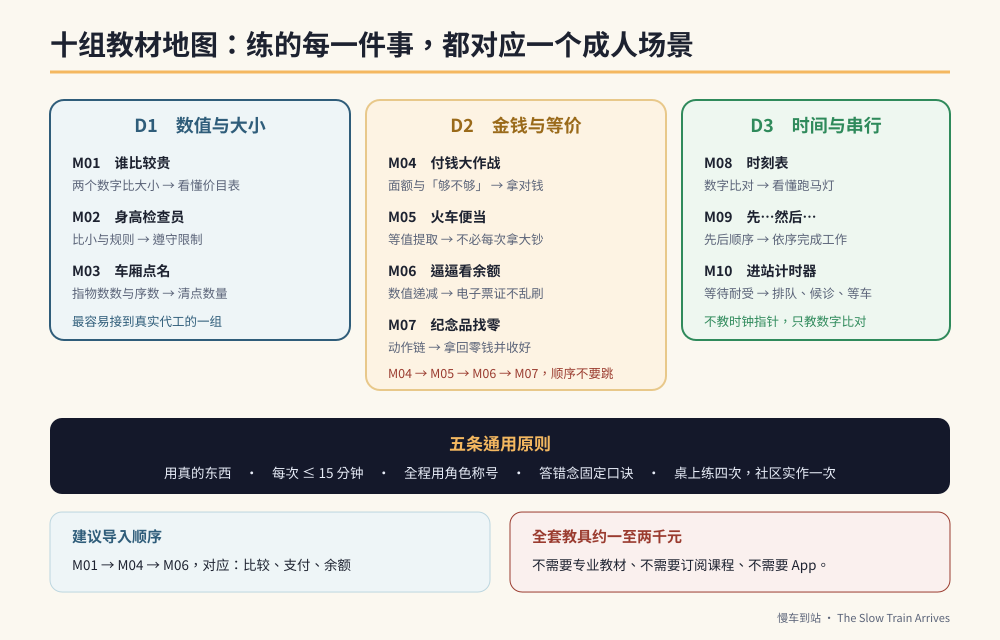

## 背景与痛点

一个十六岁、认知落后的孩子，数学该怎么教？

**不要教数学。教他二十五岁那年会用到的那几件事。**

九九乘法表、应用题、分数——这些对他没有用，而且他学不会，学不会的挫折还会伤害动机。但下面这几件事，他一辈子都会用到：

- 两个价格，哪个比较贵？
- 我手上这张钱，够不够付？
- 刷完卡，钱是变多还是变少？
- 找回来的零钱，要收好。
- 时刻表上写的那班车，是不是我要搭的？
- 还要等五分钟，我要坐着等。

这六件事，就是这一篇的全部内容。它们被拆成**十组教材**，每一组都包在火车与游乐园的外壳里，每一组都有逐字台词、量化检核，以及「他中途开始碎念时该怎么办」的处理脚本。

---

## 核心设计

### 一、三个维度、十组教材

| 维度 | 教材 | 练什么 | 对应的成人生活场景 |
|------|------|--------|-----------------|
| **D1　数值与大小** | M01 谁比较贵 | 两个数字比大小 | 买东西时选便宜的；看懂价目表 |
| | M02 身高检查员 | 数字比小、规则限制 | 遵守限制（身高、重量、人数） |
| | M03 车厢点名 | 指物数数、序数 | 清点数量、第几个、最后一个 |
| **D2　金钱与等价** | M04 付钱大作战 | 面额辨识、「够不够」 | 拿对钱付款 |
| | M05 火车便当 | 等值提取（刚好） | 不必每次都拿大钞 |
| | M06 逼逼看余额 | 数值递减、消费因果 | 电子票证不会乱刷 |
| | M07 纪念品找零 | 找零的动作链 | 拿回零钱并收好 |
| **D3　时间与串行** | M08 时刻表 | 时间与事件的锚定 | 看班次、准时出门 |
| | M09 先…然后… | 先后顺序 | 依序完成多步骤工作 |
| | M10 进站计时器 | 等待耐受 | 排队、候诊、等车 |

**三个维度的难度是递增的，但它们可以并行。** 建议的导入顺序是：M01 → M04 → M06 →（其余依需要）。这三组对应的是社区生活最常出现的三种情境：比较、支付、余额。

### 二、每一组教材的共同结构

这一篇的每一组教材都用同一个五段结构写成。你可以照着做，也可以用它来设计自己的教材（第 10 章的外壳化四步骤）。

```text
① 教具与场景部署
   要准备什么、摆在哪里、谁扮演谁

② 三部曲交互脚本（★ 逐字台词）
   第一步：引导与辨识
   第二步：核心决策（这一步是真正要练的东西）
   第三步：收尾动作（把行为练成完整的链）

③ 量化检核
   两个指针 + 一个过关标准

④ 固着重载的处理
   他一定会在中途开始碎念。这一段告诉你怎么接。

⑤ 常见错误与变化型
```

### 三、五条通用原则（每一组教材都适用）

**原则一：用真的东西。**

真钞票、真票价表、真的悠游卡、真的刷卡画面。不要用玩具钞或自己画的假素材。理由有两个：真实素材的触感、颜色与细节提供的辨识线索完全不同；更重要的是，**用真的东西练，能力才会直接类化到现场**。

**原则二：每次不超过 15 分钟，一次挑 2–3 组。**

时间到就停，**即使他还想继续**。见好就收是为了保护动机——这是这一篇里最容易被忽略、也最会影响长期成效的一条。

**原则三：全程用角色称号。**

「维修长」「站长」「安全检查员」。角色把「被要求」变成「扮演」，而扮演的抗拒成本低得多。角色名一旦定了，家里和学校都用同一个。

**原则四：答错不责骂，用制约口诀。**

每一组教材都有一句固定的口诀（例如「一百元太小了，买不到门票，我们要拿蓝色的一千元」）。答错时，不责备、不解释一长串，就念那句口诀，然后引导他重来一次。

**原则五：桌上练四次，就要有一次真实情境。**

这是类化的最低比例。桌上版练得再好，没有在超商、车站真的做过一次，都不算数。

### 四、教具总清单（一次备齐，四年够用）

```text
【钱】
  □ 真钞：1000 元 × 1、500 元 × 1、100 元 × 5
  □ 硬币：50 元 × 2、10 元 × 5、5 元 × 5、1 元 × 10
  □ 一个他自己的钱包（有拉链或扣环，能真的收零钱）
  □ 悠游卡或一卡通（粘贴他喜欢的贴纸）

【印刷品】（可自行打印或手写字卡，护贝）
  □ 台铁票价表（真实的，挑他常搭的区间）
  □ 游乐园门票价目表（全票／学生票／优待票）
  □ 简化的时刻表（3–5 个班次即可）
  □ 便当／商品价格卡
  □ 设施身高限制卡

【工具】
  □ 视觉计时器（红色区块会消失的那种）
  □ 护贝机与护贝膜（★ 会用很多年，值得买）
  □ 魔鬼毡、可擦拭彩色笔
  □ 按压计数器
  □ A4 与 A6 空白卡纸

【记录】
  □ 一本笔记本或一张月历，记两个指针就好
```

> 💡 **关于预算**
> 全部加起来大约一千到两千元台币（不含真钞本身，那些是循环使用的）。这一篇不需要任何专业教具、不需要任何订阅课程、不需要任何 App。
> **如果有人告诉你需要买一套几万元的教材才能做这些事，那不是真的。**

---

## 实作：一周配置范例

以 S2（转化期）为例：

| 日 | 教材 | 时长 | 地点 |
|----|------|------|------|
| 一 | M01 谁比较贵 + M03 车厢点名 | 12 分 | 家（餐桌） |
| 二 | M04 付钱大作战 | 10 分 | 家（客厅） |
| 三 | 休息（只做小帮手任务） | — | — |
| 四 | M04 + M05 火车便当 | 12 分 | 家 |
| 五 | M08 时刻表 | 10 分 | 家 |
| 六 | **真实情境**：搭一次车 + 超商买一样东西 | 60–90 分 | 车站、超商 |
| 日 | 休息（火车日） | — | — |

**周六那一格是整周的重点。** 前面五天都是为了那一次真实情境做准备。

---

## 现场踩雷

**踩雷一：把十组教材当成十堂课，排进课表跑完。**
它们不是进度，是工具箱。**这学期用得到哪三组，就做哪三组。**

**踩雷二：用玩具钞。**
省下来的两千元，换来的是无法类化的能力。

**踩雷三：做到他厌倦。**
外壳会失效。一旦「火车」开始与「被考试」链接，你就失去了这本书最重要的资产。

**踩雷四：只在家做。**
桌上专家、现场文盲，是这一篇最常见的失败模式。

**踩雷五：把教材当成亲子时光的全部。**
每天 15 分钟教材，之后还有 15 分钟纯粹的火车时间——**那一段不上课、不考试、不引导，就是陪他讲**。两者不能互相取代。

---

## 效益与验收（DoD）

| 项目 | 验收标准 |
|------|---------|
| 教具已备齐 | 上方清单全部就位，钱包里有真的零钱 |
| 角色已命名 | 有一个固定的角色称号，家庭与学校一致 |
| 已选定组数 | 这学期只导入 2–3 组，并写下来 |
| 时长受控 | 每次 ≤ 15 分钟，实际运行四周未超时 |
| 有真实情境 | 每四次桌上练习，至少有一次社区实地 |
| 有记录 | 每组教材的两个指针都有记录，可回顾趋势 |

> 💡 君之一席话
> 「他不需要会算数学，他需要**在便利商店结帐时不会被骗、也不会慌**。这两件事听起来很像，但只有后者能靠十五分钟的火车票价练出来。」

---


# 第22章　M01–M03　大小与数量：谁比较贵、谁可以玩、有几节车厢

**维度：** D1 数值与大小辨识
**对应核心：** C2（比较与计数）＋ C3（外壳）
**成人生活场景：** 买东西时看得懂价目表、遵守限制、清点数量

---

## 背景与痛点

「比大小」听起来是幼儿园的内容。但对一个认知落后的十六岁孩子来说，这件事在真实生活里的样子是：

- 便利商店有两种饭团，一个 35 元一个 55 元，他不知道哪个便宜；
- 游乐设施写着「身高 140 公分以上」，他不知道那跟他有没有关系；
- 老师说「拿五个袋子过来」，他抓了一把。

这三件事对应的是三种不同的能力：**比较、规则、计数**。这一章的三组教材，各练一种。

而它们的共同前提是：**用他认得的东西当素材。** 抽象的「35 和 55」他不想理，但「区间车 150、自强号 400」他愿意看——因为那是火车。

---

## M01　谁比较贵：两个数字比大小

### ① 教具与场景

```text
· 两张车票字卡（护贝）：
    「区间车　150 元」
    「自强号　400 元」
  背面粘贴对应的车种照片
· 场景：餐桌。家长坐对面，孩子扮演「维修长」
· 高端版：真的台铁票价表（他常搭的区间）
```

### ② 三部曲脚本

```text
【第一步　引导与辨识】
  家长：「维修长！今天我们要出车。你看，这是两张车票。
         一张是区间车 150 元，一张是自强号 400 元。」
  → 让他看两张卡，不急着问

【第二步　核心决策】★ 这一步是真正要练的
  家长：「150 和 400，哪一个数字比较大？哪一张车票比较贵？」
  期望反应：用手指出 400，并念出「四百」或「400」
  家长增强：「对！400 比 150 大，自强号比较贵。」

  ▸ 答错时的制约口诀（不责骂，念这句，然后重来）：
    「数字前面比较长的，就是比较大的。400 比 150 大。」
    ★ 若他还无法理解位数，改用具体对比：把 4 张百元钞
      和 1 张百元钞+5 十元硬币排出来，让他用「看得见的量」比较。

【第三步　收尾动作】
  家长：「那我们今天坐比较便宜的区间车，好不好？
         请维修长把区间车的票拿给我。」
  → 把「比较」接到一个实际的动作上，
    比较才不会停留在纸上的游戏。
```

### ③ 量化检核

```text
指针一　辨识速度：询问后 3 秒内正确指出的次数
指针二　自主命名：能念出数字（而不只是用手指）的次数

过关标准：连续两周，每 10 次测试中正确 8 次以上，
          且其中至少 5 次能念出数字。
```

### ④ 固着重载的处理

他一定会在中途开始讲自强号有多快。**不要说「不要再讲了」。**

```text
标准接法（三句话收回来）：
  1. 顺着讲一句：「对，自强号比较快。」
  2. 切回工作：「但是现在是售票时间，我们要先看价钱。」
  3. 给具体动作：「请维修长看这两个数字，哪一个比较大？」
```

### ⑤ 变化型

- 把车票换成便当、饮料、门票、玩具的价格
- 三个数字比大小（高端）
- 「哪一个最便宜」（最高级，比「比较」难一阶）

---

## M02　身高检查员：数字比小，与「规则」

### ① 教具与场景

```text
· 两张设施卡（护贝）：
    「大怒神　140 公分才可以玩」
    「旋转木马　110 公分就可以玩」
  粘贴对应的设施照片
· 一条卷尺或墙上的身高标记（★ 一定要有实体对照）
· 孩子扮演「安全检查员」
```

### ② 三部曲脚本

```text
【第一步】
  家长：「检查员！今天六福村要开园了，你要负责检查身高。
         大怒神要 140 公分，旋转木马要 110 公分。」

【第二步】★ 核心
  家长：「140 和 110，哪一个数字比较小？
         哪一个设施，比较矮的小朋友就可以玩？」
  期望反应：指出 110 / 旋转木马

  ▸ 高端（同一组教材的第二层）：
    量他自己的身高，写在卡片上。
    家长：「你 165 公分。165 比 140 大，所以你可以玩大怒神。」
    → 把规则接到他自己身上，这是「规则适用于我」的概念起点。

【第三步】
  家长：「那请检查员把可以玩的设施卡，放到绿色篮子里。」
  → 分类动作收尾
```

### ③ 量化检核

```text
指针一　比小正确率（注意：「比较小」比「比较大」难）
指针二　自我套用：能否判断「我可以／不可以玩」

过关标准：连续两周，10 次中 8 次正确，
          且能正确判断自己是否符合限制。
```

### ④ 固着重载的处理

这一组最容易失控——因为讲到游乐设施，他会直接进入「我要去玩」的模式。

```text
接法：
  「对，我们会去玩。但是检查员要先检查完，园区才能开门。
   检查完，我们就把去六福村的日子写在月历上。」
  → 把「我要去」转成「写在月历上」，
    给一个看得见的承诺，比口头安抚有效得多。
  ★ 写上去了就要做到。做不到的承诺会让所有预告失效。
```

### ⑤ 为什么这一组重要

「规则有数字，数字决定我可不可以」——这是社会规范最基础的形式。

它在成年后的样子是：**这台电梯载重多少、这个位置是不是博爱座、这个活动几岁可以参加、这份工作要求什么**。一个能理解「数字决定规则」的人，在社区里安全得多。

---

## M03　车厢点名：指物数数与序数

### ① 教具与场景

```text
· 5 辆玩具火车，或 5 张不同颜色的火车图卡（红蓝黄绿黑）
· 场景：桌上排成一列（★ 一定要排成一列，不要散放）
```

### ② 三部曲脚本

```text
【第一步】
  家长：「火车要进站了！请维修长帮忙点名。」

【第二步】★ 核心：三种问法，一次只问一种
  (a) 总数：「这里总共有几辆火车？」
      → ★ 必须「伸手指着数」，不可以只用眼睛扫
        （指物数数是计数能力的关键指针）
  (b) 序数：「第一辆是什么颜色？第三辆呢？」
  (c) 端点：「最后一辆是什么颜色？」

  ▸ 答错时：把手轻轻带着他的手指，一辆一辆点过去，
    边点边数。不用说「你数错了」。

【第三步】
  家长：「点名完成！请维修长把火车开进车库（收进盒子）。」
  → 收拾也是工作的一部分（第 27 章：工具归位是评分项）
```

### ③ 量化检核

```text
指针一　指物数数：是否用手指逐一点数（不是估算）
指针二　序数正确率：「第几个」的回答正确率

过关标准：5 个以内的总数正确率 ≥ 90%；
          第一／最后正确率 ≥ 80%；
          「第三个」这类中间序数正确率 ≥ 60%。
          （中间序数明显较难，标准订低是合理的）
```

### ④ 变化型（把它接到真实工作上）

```text
· 清点工具：「工具篮里有几支笔？」
· 清点成品：「你做好几个袋子了？」（接第 16 章的计数器）
· 排序：「把这五张卡片，从最便宜排到最贵。」（结合 M01）
· 家务：「拿五个碗到桌上。」（接第 9 章的指令链）
```

**M03 是十组里最容易接到真实工作的一组。** 小作所的代工几乎都涉及计数——「一袋装五个」「做满二十个回报」。这一组练稳，未来的工作内容会直接受益。

---

## 现场踩雷

**踩雷一：用抽象数字练。**
「35 和 55 哪个大」——他不想理。同样的题目换成票价，他会坐下来。

**踩雷二：「比较小」跳过不练。**
比大容易，比小难。而真实生活里「哪个比较便宜」用的是比小。

**踩雷三：不要求指物数数。**
用眼睛扫过去然后说一个数字，那是猜的。**手指要点到每一个对象**，这是计数能力真正的样子。

**踩雷四：教材做完就收，没接到动作。**
第三步的收尾动作不是装饰。**「比较完 → 拿出来 / 分类 / 收好」，能力才会变成行为。**

**踩雷五：承诺了去游乐园却没去。**
M02 最容易踩这个雷。**写上月历的就要做到**，否则往后所有的预告都会失效。

---

## 效益与验收（DoD）

| 项目 | 标准 |
|------|------|
| M01 | 10 次中 8 次正确；至少 5 次能念出数字 |
| M02 | 比小正确率 ≥ 80%；能判断「我可不可以」 |
| M03 | 5 以内总数 ≥ 90%；第一／最后 ≥ 80%；指物数数 100% |
| 真实情境 | 在便利商店或卖场，实际比较过两件商品的价格 ≥ 3 次 |
| 收尾动作 | 三组教材的第三步都有实际运行，不只是口头问答 |

> 💡 君之一席话
> 「你教的是『150 和 400 哪个大』，他学的是『我付得起哪一个』。**这两件事在纸上长得一样，在便利商店的柜台前完全不一样**——而只有后者，是他真的要用的那个。」

---


# 第23章　M04　付钱大作战：面额、够不够，与一个真实的钱包

**维度：** D2 金钱与等价交换
**对应核心：** C2（面额与比较）＋ C1（不被固着带走）
**成人生活场景：** 买东西时拿对钱，不会把整个钱包递出去

---

## 背景与痛点

在所有功能性数学里，**金钱是最直接影响安全的一项**。

一个不理解面额的成年人，在便利商店会做两件事之一：把整个钱包递给店员，或者拿出一张钱就走、不拿找零。前者有被占便宜的风险，后者是每天默默地损失。

而在职业重建评估与机构收案的评量里，**金钱概念几乎必考**。原因很简单：它直接关系到这个人能不能独立在社区生活。

M04 是这一组的第一课，而它只教一件事：**「哪一张才够付。」**

不是心算，不是找零，不是加总。就只是「够不够」。

---

## 实作

### ① 教具与场景部署

```text
【道具】
  □ 门票字卡：「六福村门票　800 元」
     背面粘贴他最喜欢的设施照片
  □ 真钞（★ 不用玩具钞）：
     1000 元（蓝色）× 1
     100 元（红色）× 3
  □ 他自己的钱包（要能真的打开、收东西、关起来）

【为什么一定要真钞】
  纸钞的触感、尺寸、颜色饱和度与防伪线，都是辨识线索。
  玩具钞把这些全部拿掉了，练出来的能力在柜台前不管用。
  （真钞在教材中是循环使用的，不会有损失。）

【场景】
  客厅桌子。左边放 1000 元，右边放三张 100 元。
  家长坐对面，扮演「售票员」；孩子扮演「要入园的游客」。
```

### ② 三部曲脚本（逐字）

```text
【第一步　引导与数字辨识】

  家长（微笑）：「维修长！今天天气很好，我们要去六福村玩！
                 你看，这是门票，上面写着 800 元。」

  家长：「请你看着桌上的钱。这边是蓝色的一千元，
         那边是红色的一百元。
         800 和 1000，哪一个数字比较大？」

  期望反应：手指向 1000，说出「一千」或「1000」
  增强：   「很好！1000 比 800 大。」

  ▸ 这一步用的是 M01 的能力。如果他在这里卡住，
    回去把 M01 练稳再回来——不要硬推。


【第二步　运行付钱决策】★ 这一步是本教材的核心

  家长（伸出手）：「那请你当游客买票。门票要 800 元。
                   你要拿哪一张钱给售票员，钱才够？」

  期望反应：拿起 1000 元，递给家长

  ▸ 拿错时（拿了 100 元、或拿了三张 100 元）：
    · 家长不责骂、不叹气
    · 伸出右手做「五指并拢向前」的制止手势，
      把 100 元轻轻推回去
    · 念制约口诀（每次一字不改）：
        「一百元太小了，买不到门票。
         我们要拿大张的蓝色一千元。」
    · 引导他重新拿一次
    · 成功了就当作成功，不要说「你刚刚拿错了喔」


【第三步　找零与收纳】★ 这一步把它练成完整的动作链

  家长（接过 1000 元，递出门票与两张 100 元）：
    「收你 1000 元。这是你的门票，找你 200 元。请收好。」

  期望反应：
    ① 接过门票
    ② 接过找零
    ③ 把找零放进自己的钱包
    ④ 把钱包关起来 / 拉上拉链

  增强：「太棒了！钱拿对了，零钱也收好了。
         现在检查员可以进去六福村工作了！」

  ▸ 第 ③ ④ 步比第 ② 步更重要。
    「拿到零钱会收好」这个动作，在真实世界里的价值
    高于任何一次正确的计算。
```

### ③ 量化检核

```text
【频率】每周 3 次角色扮演，每次不超过 5 分钟

指针一　自主辨识率
  定义：第一步询问「哪个数字大」时，3 秒内正确指出的次数

指针二　独立付钱成功率
  定义：第二步在不需口诀提示下，主动拿起 1000 元的次数

指针三　收纳完成率
  定义：找零后，主动把零钱放进钱包并关好的次数

【过关标准】
  连续两周，每 10 次测试：
    · 独立付钱成功率 ≥ 8 次（80%）
    · 收纳完成率 ≥ 8 次
  达标即代表这项功能性数学具备转衔实力。
```

### ④ 固着重载的处理

**这一组最容易失控**，因为门票卡上有他最爱的设施照片。

```text
【会发生什么】
  他拿到门票卡的瞬间，开始讲：
  「我要坐急流泛舟、我要看动物巴士、大怒神要 140 公分……」
  然后完全忘记要付钱。

  此时如果你说「不要讲了，先算钱」，
  他会因为被硬切而生气，接下来十分钟都在处理情绪。

【正确接法：顺一句，切回工作，给动作】
  1. 顺着讲一句：「对，六福村有动物巴士。」
  2. 用「上班／工作」切回来：
     「但是现在是售票员上班时间，我们要先付钱买票，
      才可以进去看巴士。」
  3. 给一个具体动作：
     「请你看着一千元，拿给售票员。」

【为什么「上班」这两个字有效】
  它把「你不要讲话」换成「我们现在在工作」——
  前者是禁止，后者是角色。
  对一个以「当小帮手」为荣的孩子来说，
  第二种说法几乎不会引发抗拒。
```

### ⑤ 变化型与高端

```text
【变化型 A：不同的商品】
  火车票 150 元 / 便当 100 元 / 饮料 35 元 / 纪念品 450 元
  → 商品换了，能力才会类化

【变化型 B：两张凑起来】（高端，S3 以后）
  「门票 800 元，你只有三张一百和一张五百，怎么付？」
  → 这是加总，难度高一阶，不急

【变化型 C：真实情境（★ 每四次桌上练习，一次这个）】
  带他去便利商店，买一样 100 元以内的东西。
  流程：拿商品 → 排队 → 递钱 → 接找零 → 放钱包 → 说谢谢
  ★ 第一次一定会慢、会卡。让后面的人先过，不要急。
```

---

## 现场踩雷

**踩雷一：用玩具钞。**
第 21 章讲过，这里再说一次：省下的钱，换来的是无法类化的能力。

**踩雷二：跳过收纳那一步。**
「找零他拿着就好」——这样练出来的孩子，找零会掉在柜台上、口袋里、地上。**收纳是动作链的最后一环，不能省。**

**踩雷三：他拿错时解释一长串。**
「你看喔，因为 100 比 800 小，所以……」——长句会加重负荷。**念口诀，重来一次就好。**

**踩雷四：口诀每次都不一样。**
「一百不够啦」「这张太小」「要拿大张的」——三种说法对他是三条规则。**固定一句，一字不改。**

**踩雷五：在真实柜台前急他。**
第一次带他去便利商店结帐，一定会慢。**你越急，他越慌，下次他就不想去了。** 挑人少的时段、挑他熟悉的店。

**踩雷六：只练「够不够」，就急着教找零计算。**
找零的**计算**（800 元给 1000 要找多少）难度远高于这一课。M07（第 25 章）处理的是找零的**动作**，不是计算。顺序不要颠倒。

---

## 效益与验收（DoD）

| 项目 | 标准 |
|------|------|
| 面额辨识 | 能正确指认 100／500／1000 元，正确率 ≥ 90% |
| 独立付钱 | 10 次中 ≥ 8 次主动拿对，不需口诀提示 |
| 收纳 | 10 次中 ≥ 8 次主动把找零放进钱包并关好 |
| 固着处理 | 中途碎念时，家长使用「顺一句→切回工作→给动作」处理，未进入口语角力 |
| 真实情境 | 已在便利商店或卖场完成 ≥ 3 次实际结帐 |
| 钱包 | 他有一个自己的钱包，且知道零钱要放进去 |

> 💡 君之一席话
> 「这一课不是在教他算术，是在教他**别把整个钱包递出去**。四年后你不在他身边的那些时刻，这一件小事会替你站在柜台前面。」

---


# 第24章　M05・M06　刚好付对钱，与「逼一声，钱变少」

**维度：** D2 金钱与等价交换
**对应核心：** C2（等值与递减）
**成人生活场景：** 不必每次都拿大钞；电子票证不会盲目乱刷

---

## 背景与痛点

M04 教会他「拿大张的才够」。而这件事有一个副作用：**他会开始每次都拿最大张的。**

买一瓶 25 元的饮料，递出一千元。买一个 35 元的饭团，递出一千元。店员的表情、后面排队的人、越来越多的零钱——这些他都不会注意到，但别人会。

M05 要处理的就是这件事：**刚好付对钱。**

而 M06 处理的是另一个更隐形的问题。实体钞票变少是看得见的；**悠游卡不是**。对一个高度依赖视觉线索的孩子来说，一张刷不完的卡片很容易被理解成「里面有无限的钱」。这个认知模糊如果没有处理，成年后在社区独立通勤时，会直接变成财务风险。

---

## M05　火车便当：刚好付对钱

### ① 教具与场景

```text
· 便当图卡：「台铁排骨便当　100 元」（粘贴便当照片）
· 真钞：100 元 × 5、500 元 × 2
  （★ 桌上要同时有「对的」和「不对的」选项，
    否则他只是把唯一的那张拿起来）
· 孩子扮演「肚子饿的维修长」
```

### ② 三部曲脚本

```text
【第一步　引导】
  家长：「维修长工作了一整天，肚子饿了。
         火车上有卖便当，一个 100 元。」

【第二步　等值提取】★ 核心
  家长：「请你从桌上拿『刚好一张』100 元的红色钞票给我。」

  期望反应：从五张百元中拿起**一张**，递出

  ▸ 两种典型错误，两种处理：
    (a) 拿了 500 元
        口诀：「五百太多了。便当是一百元，
                我们拿红色的一百元，刚刚好。」
    (b) 拿了两张以上 100 元
        口诀：「一个便当，一张一百元。刚刚好一张。」
        → 把「一个对一张」的对应说出来

【第三步　收尾】
  家长：「刚刚好！不用找钱。这是你的便当。」
  ★ 「不用找钱」这句话要每次都说——
    它是「刚好」这个概念唯一的具体证据。
```

### ③ 量化检核

```text
指针一　等值提取正确率：拿出刚好一张的次数
指针二　自我修正：拿错后，在念完口诀前自己换掉的次数
                （这一项出现，代表概念真的在形成）

过关标准：10 次中 ≥ 8 次正确；
          并在真实情境（超商买 100 元以内的东西）
          成功 ≥ 3 次。
```

### ④ 高端：面额组合（S3 以后再做）

```text
「便当 150 元。你有一张 100 和几个 50，怎么付？」
→ 这是加总，难度高一阶。
  在 M05 稳定之前不要导入——一次只练一件事。
```

---

## M06　逼逼看余额：数值递减与消费因果

### ① 教具与场景

```text
【道具】
  □ 他自己的悠游卡／一卡通，粘贴火车贴纸
     （可以正式命名为「维修长专属乘车卡」）
  □ 两张大字卡：
       绿框：「进站　余额 200 元」
       红框：「出站　余额 150 元」
  □ 手机：每次真实刷卡时，拍下闸门屏幕的余额画面

【场景】
  版本 A（家里）：走廊当作闸门，家长扮演站务员
  版本 B（真实）：他常去的车站或便利商店
  ★ 两个版本都要做。家里练流程，现场练类化。
```

### ② 三部曲脚本

```text
【第一步　进站：设置基础数值】
  家长：「维修长！今天我们要搭火车去巡逻。
         拿出你的乘车卡，进站，逼一声。」
  家长（指着卡片或屏幕）：
        「你看，进站的时候，卡片里有 200 元。」
  期望反应：刷卡，眼神看向数字「200」
  ★ 这一步的关键是「眼神有没有看数字」，不是有没有刷成功。

【第二步　出站：核心因果】★ 核心
  家长：「火车到站了，我们刷卡出站。逼一声！」
  家长（立刻指着数字）：「请看这里，变成 150 元了。」

  家长（核心提问）：
    「200 变成 150，数字是变大还是变小？
     卡片里的钱是变多还是变少？」

  期望反应：指着 150，说「变小」或「变少」

  ▸ 答错或没反应时：
    · 不责骂。轻拍肩膀，把两张卡片并排放，用手指依序点
    · 制约口诀（固定一句）：
        「搭火车，逼一声，卡片里的钱会变少。
         200 变成 150，钱变少了。」

【第三步　收尾：对象管理】
  家长：「答对了！因为坐火车付了 50 元，所以钱变少了。
         请把乘车卡放回皮夹里。」
  期望反应：把卡片放回固定的夹层，拉上拉链
  ★ 「放回固定位置」是这一步真正在练的东西——
    未来他每天通勤，卡片放哪里会决定他会不会弄丢。
```

### ③ 量化检核

```text
指针一　余额注目度
  定义：刷卡「逼」的那一瞬间，他的眼神有没有主动看向屏幕
        （而不是转头去看进站的火车）

指针二　递减认知正确率
  定义：问「钱变多还是变少」时，5 秒内不经提示答对的次数

过关标准：连续三周，在真实车站或超商刷卡时，
          主动注视屏幕并正确回答「变少」的成功率 ≥ 80%。
```

### ④ 固着与兴奋重载的处理

**这一组会遇到一个特殊状况：他会卡在闸门口。**

因为刷卡涉及闸门、声音、火车——三个他最兴奋的元素同时出现。他可能会反复学「逼、逼」的声音、着迷于闸门开合、不肯往前走。而被硬拉走时，会生气。

```text
【错误做法】
  大声说「你快点走！」
  → 在公共场所提高音量，会同时触发他的对立情绪
    与周围的注视，情况只会更糟。

【正确做法：用利他特质引导】
  身体保持中立，轻轻牵着他的手往前走，温和而坚定地说：

    「维修长，后面还有很多乘客要进站。
     为了安全，我们要往前走去月台等车。」

  → 把「催他走」转成「为了后面的人」。
    对一个利他动机强、以帮忙为荣的孩子，
    这句话启动的是他最强的那条回路，
    而不是他最脆弱的那条。

【回家后补一段】
  「今天你在闸门那边有往前走，做得很好。
   现在是火车时间，你可以讲。」
  → 现场克制，回家给出口。克制必须有出口。
```

### ⑤ 为什么这一组值得花三周

因为它是**成年后财务安全的第一道防线**。

一个不理解「刷卡会扣钱」的成年人，在便利商店可能会刷出一整张卡的余额；在自动贩卖机前可能会反复刷；在有人请他「帮忙刷一下」时，不会觉得有什么问题。

而理解了「逼一声，钱变少」的人，至少会问一句：「这样会扣多少？」

---

## 现场踩雷

**踩雷一：M05 桌上只放 100 元。**
只有一个选项，他当然拿对。**桌上一定要有干扰选项。**

**踩雷二：M06 只在家练，没去真实闸门。**
家里的走廊没有「逼」的声音、没有闸门、没有屏幕。**真实现场的刺激强度完全不同**，而类化必须在那里发生。

**踩雷三：刷卡时大人帮他拿卡。**
他要自己拿、自己刷、自己收。大人代劳的每一次，都是他少练的一次。

**踩雷四：在闸门口拉扯。**
公共场所的原则：**先离开，再处理**。不要在人流中间坚持教学。

**踩雷五：把「余额变少」讲成「钱不见了」。**
用词会影响理解。**「付了 50 元坐车，所以剩下 150」**——有代价、有交换，这才是正确的因果。

**踩雷六：M05 和 M06 同时导入。**
两组都是金钱，但一个是「等值」一个是「递减」。**先做 M05，稳了再做 M06。**

---

## 效益与验收（DoD）

| 项目 | 标准 |
|------|------|
| M05 等值提取 | 10 次中 ≥ 8 次拿出刚好的面额 |
| M05 真实情境 | 超商实际结帐，刚好付对 ≥ 3 次 |
| M06 余额注目 | 刷卡瞬间主动看屏幕，达 ≥ 80% |
| M06 递减认知 | 「钱变少」回答正确率 ≥ 80%，连续三周 |
| M06 对象管理 | 卡片每次都放回固定位置，达 ≥ 90% |
| 闸门行为 | 能在提示下往前走，未发生拉扯或滞留 ≥ 3 分钟的情况 |

> 💡 君之一席话
> 「实体的钱变少他看得见，卡片里的钱变少他看不见——而他未来的世界，会越来越没有实体的钱。**这一组教材真正在练的，是让他相信一件看不见的事。**」

---


# 第25章　M07　纪念品找零：付大钞、拿零钱、收好

**维度：** D2 金钱与等价交换
**对应核心：** C2（动作链）＋ C1（延宕满足）
**成人生活场景：** 买东西不会漏拿找零，不会在柜台前被占便宜

---

## 背景与痛点

在购物这件事上，认知落后的孩子脑中通常只有两条线：**递出钱**，和**拿到东西**。

中间那一步——**拿回找零**——经常整段消失。

而它消失的方式很典型：他右手接过商品的那一瞬间，大脑释放「任务完成」的信号，身体开始转身。找零还在店员手上，或者被放在柜台上，或者塞进口袋然后掉了。

一次五十元，一周两次，一年五千元。而更严重的是：**一个从不确认找零的人，在遇到不诚实的店家时，没有任何防线。**

M07 练的不是心算。它练的是一个**四步骤的动作链**：

```text
付钱 → 拿到东西 → 左手等零钱 → 放进钱包关好
                     ↑
              整条链里最容易断的一环
```

---

## 实作

### ① 教具与场景

```text
【道具】
  □ 一个他真的想要的东西（火车模型、玩偶、他喜欢的零食）
  □ 标价卡：「450 元」，字要大，贴在商品上
  □ 孩子的钱包里放 1 张 500 元
  □ 家长的「收银柜台」（一个盒子）里放 1 枚 50 元硬币

【为什么是 500 买 450】
  找零是「一枚 50 元硬币」——单一整数硬币。
  他不需要做任何扣减计算，只需要创建一个视觉图像的对应：
      付绿色的 500 → 拿回金色的 50
  等这个动作链固定之后，再谈数字。

【场景】
  家长在桌子一端摆商品，扮演「纪念品店店员」；
  孩子手拿钱包站在对面，扮演「结帐的客人」。
```

### ② 三部曲脚本（逐字）

```text
【第一步　标价辨识与付款】

  家长（双手拿着商品，微笑）：
    「欢迎光临！维修长今天工作辛苦了，想买这只老虎对不对？
     上面写着 450 元。」

  家长（伸手）：「请你打开钱包，拿一张 500 元付钱。」

  期望反应：主动打开钱包 → 抽出 500 元 → 递出


【第二步　双手防线】★ 本教材的核心，也是最难的一步

  家长接过 500 元。
  右手把商品递给孩子，**左手拿着 50 元硬币，但先不给**。

  ▸ 此时会发生什么：
    他右手接过商品的瞬间，准备转身。
    这不是不专心，是「任务完成」的信号被提早触发了。

  家长动作：
    左手把 50 元硬币伸到他**左手前方**，
    同时用身体与眼神温和地挡住他转身的动线。

  制约口诀（固定一句，一字不改）：
    「等一下，钱还没拿完。
     付五百，找五十。请左手拿亮晶晶的五十元。」

  期望反应：右手抱着商品，左手接过硬币

  ▸ 「左手」这个指定不是随便的：
    它让「拿商品」与「拿找零」变成两个分开的、
    看得见的动作，而不是混在一起的一团。


【第三步　硬币归位】

  家长（保持督导的眼神，不催）：
    「请把找回来的五十元，放进钱包里收好。」

  期望反应：右手夹着商品，左手（或双手配合）
            把硬币放进钱包 → 拉上拉链

  增强：「太棒了！东西买到了，五十元也收好了。
         维修长今天的金钱任务一百分。」
```

### ③ 量化检核

```text
【频率】每周 3 次（可利用点心时间仿真购物）

指针一　拿回零钱的「主动性」★ 最重要
  定义：接过商品后，**不经口诀提示**，左手主动伸出来等零钱的次数

指针二　零钱收纳的「完整度」
  定义：拿到硬币后，是随手放桌上／塞口袋，
        还是能放回钱包并关好

【过关标准】
  连续两周，10 次结帐中 ≥ 8 次：
    · 拿到商品的同时，左手自主等待零钱
    · 完成收纳与拉链动作
  达标即代表「购物三部曲」的动作链已经固化。
```

### ④ 情绪重载的处理：等待找零时的焦虑

**这一组会出现一个 M04、M05 都不会出现的状况：他会因为「等不到零钱」而生气。**

因为对他来说，交易的秩序被打断了。当店员（家长）动作慢、或故意把硬币拿在手上多停两秒，他的焦虑会迅速上升——面露不悦、原地跺脚、伸手去抢。

```text
【错误做法】
  「不可以生气！」
  → 他的生气来自「秩序被延迟」，那是固着特质的展现，
    不是无理取闹。用禁止的方式处理，只会升级。

【正确做法：把等待合理化】
  家长把 50 元推到他面前，同时做出「五指并拢向前」的手势，
  冷静地说：

    「维修长，收银机正在数钱。
     请你深呼吸，手放好，老板现在就把五十元交给你。」

  → 把「大人动作慢」解释成「机器正在运作」。
    他对「机械式的规律运作」包容度极高——
    他可以接受机器需要时间，但不容易接受人的随意。

  → 而这几秒钟的等待，本身就是一次
    **延宕满足**的前额叶练习。
```

### ⑤ 高端与真实情境

```text
【高端 A：找零的组合】（S3 以后）
  付 500 买 380 → 找 120（一张 100 + 一个 20）
  → 从单一硬币进到多枚组合。动作链不变，只是内容变复杂。

【高端 B：确认找零】（S4 以后，这是防卫能力的关键一步）
  教他在拿到找零后，做一个固定动作：
    看一眼硬币 → 说「谢谢」→ 收进钱包
  ★ 不要求他验算金额，只要求他「有看」。
    一个会低头看一眼的人，和一个从不看的人，
    在店家眼中是完全不同的两种客人。

【真实情境（★ 每四次桌上练习，一次这个）】
  带他去他熟悉的商店，买一样 200 元以内的东西，
  刻意用大钞付款，让找零一定会发生。
  流程全部由他做，大人只在他要转身时，
  用手势提醒（不用嘴巴）。
```

---

## 现场踩雷

**踩雷一：家长顺手帮他收零钱。**
「他手上拿着东西不方便，我帮他收」——这一收，整条链就断了。**宁可站着等他慢慢弄。**

**踩雷二：用一大堆零钱当找零。**
一开始就找 137 元（一张 100 + 一个 20 + 一个 10 + 一个 5 + 两个 1），他会直接放弃。**单一硬币起步。**

**踩雷三：故意测试他，把硬币拿太久。**
测试延宕满足是有价值的，但**不要在他已经接近临界的时候测**。而且测试要有上限——三到五秒，不是三十秒。

**踩雷四：把「不会算找零多少」当成失败。**
他不需要会算。**他需要会「等、拿、收」。** 计算是加分题，不是及格线。

**踩雷五：在真实柜台前替他说话。**
「他要买这个，这是五百」——你讲完了，他就没有练到。**让他自己递钱，你站在后面。**

**踩雷六：买的东西他不想要。**
这一组教材的动机全部来自那个商品。**用他真的想要的东西**，哪怕只是一包饼干。

---

## 效益与验收（DoD）

| 项目 | 标准 |
|------|------|
| 动作链 | 「付钱 → 拿商品 → 左手等零钱 → 收进钱包」四步完整，≥ 80% |
| 主动性 | 不经提示主动等零钱，10 次中 ≥ 8 次 |
| 收纳 | 找零收进钱包并关好，≥ 80% |
| 延宕满足 | 等待找零 3–5 秒时，能在提示下保持手放好，不抢不跺脚 |
| 真实情境 | 在真实商店完成含找零的结帐 ≥ 3 次，全程由他操作 |
| 确认动作 | （高端）拿到找零会低头看一眼并说谢谢 |

> 💡 君之一席话
> 「他不必算得出五百减四百五十等于多少。他只要记得**手还没收回来，交易就还没结束**——这一件事，会替他挡掉往后几十年里，那些不老实的柜台。」

---


# 第26章　M08–M10　时刻表、先后顺序，与五分钟的红色

**维度：** D3 时间串行与指令链
**对应核心：** C2（串行）＋ C1（等待耐受）
**成人生活场景：** 看得懂班次、依序完成工作、在月台上安静等车

---

## 背景与痛点

时间对这类孩子是最抽象的一件事。

「等一下」是多久？「快到了」是几分钟？「先做这个再做那个」为什么不能倒过来？

而时间又是成人生活最不可回避的骨架：上班要准时、火车有班次、休息有时限、排队要等。**一个无法处理时间的人，在社区里每一天都会遇到摩擦。**

这三组教材处理时间的三种样貌：

- **M08 时刻表**：时间是可以**比对**的数字（不是抽象概念）
- **M09 先…然后…**：事情有**顺序**，顺序不能换
- **M10 计时器**：等待是**有终点**的，而终点看得见

> 💡 **一个重要的取舍**
> 这一章**不教看时钟指针**。长针短针、几点几分、时针走一格是多久——这些对他的投报率极低。
> 改教的是**数字数字的比对**：时刻表上写 13:30，电子钟显示 13:30，两个数字一样，所以是这班车。
> 这不是降低标准，是换一条走得通的路。他未来要看的跑马灯、手机、电子钟，全部都是数字。

---

## M08　时刻表：数字比对与时间锚定

### ① 教具与场景

```text
□ 极简时刻表（自己打印，字要大，只放 3 班）：
      13:00　区间车
      13:30　自强号
      14:00　普悠玛
□ 一个只显示数字的电子钟（或平板／手机的时钟画面）
□ 视觉计时器
□ 场景：客厅。时刻表贴墙上，电子钟放桌上。
  家长扮演「站长」，孩子扮演「在月台巡逻的维修长」。
```

### ② 三部曲脚本

```text
【第一步　数字比对】
  家长（指着时刻表与电子钟）：
    「维修长！今天的巡逻任务开始。时刻表上有三班火车。
     你看电子钟，现在的数字是 13:30。」
  家长：「请你在时刻表上找一找，
         哪一个数字跟电子钟一样是 13:30？是哪一辆车要来了？」

  期望反应：手指精准指到 13:30，念出「13:30」与「自强号」
  增强：「没错！数字一样，自强号要来了。」

  ▸ 找不到时：把电子钟拿到时刻表旁边，
    让两个数字**物理上靠在一起**比对。
    不要用嘴巴解释，用位置解释。

【第二步　时间锚定与等待】★ 核心
  家长把电子钟调成 13:25：
    「哎呀，现在是 13:25。自强号要 13:30 才来。
     时间还没到——25 比 30 小。」

  家长转出 5 分钟的计时器：
    「火车还要 5 分钟。红色全部不见，火车就会来。
     请维修长在位子上坐好，手放好。」

  期望反应：看着红色消退，双手放腿上，安静坐着，不起身

【第三步　时间到，行为启动】
  计时器响，家长把电子钟调回 13:30：
    「你看，红色不见了，电子钟变成 13:30，自强号进站了！」

  期望反应：站起来，做出拿卡片、准备上车的动作
  增强：「时间比对很成功，等车的时候手放得很好。」
```

### ③ 量化检核

```text
指针一　数字比对率：3 秒内把电子钟的数字与时刻表连对的次数
指针二　无口语等待耐受：5 分钟内不需中途提醒，安静坐着的次数

过关标准：连续三周，10 次中 ≥ 8 次能指对时间，
          且能在 5 分钟的红色消退期内保持安静坐姿。
```

### ④ 等待焦虑的处理（本章最重要的一段）

**等待对他不是无聊，是焦虑。** 秩序被延迟会启动固着回路，于是他会在第二、三分钟开始碎念「自强号怎么还不来」，然后想起身、拍桌。

```text
【错误做法】
  「你就给我乖乖坐好！」→ 直接引爆。

【正确做法：把「等待」重组成「任务」】
  家长身体保持中立，做出「五指并拢向前」的手势，
  指着计时器，冷静地说：

    「维修长，你是站长的小帮手。
     现在火车还在轨道上跑，红色还没不见，
     这时候黄线后面很危险。
     请你手放好，陪站长一起顾着月台的安全。」

  → 「无聊的等待」变成「正在运行月台安全检查」。
    他的利他动机极强，一旦等待有了利他的意义，
    焦虑会明显下降。

  ★ 这一招在候诊室、排队、等公车时同样有效。
    把等待讲成一份工作，是这本书最泛用的一句话术。
```

---

## M09　先……然后……：顺序不能换

### ① 教具与脚本

```text
□ 两张设施／地点图卡（例如：动物巴士、急流泛舟）

【脚本】
  家长：「今天去六福村，我们要**先**坐动物巴士看狮子，
         **然后**才可以去玩急流泛舟。
         请用手指出来，我们第一个要去哪里？」

  期望反应：指出动物巴士（第一个）

【第二层：自己排顺序】
  把两张卡打乱，请他「按照要做的顺序」由左至右排好。
  → 从「回答」升级到「排列」，这一步难度高一阶。

【第三层：逆向语序】（对应第 9 章第 9 级）
  「在玩急流泛舟**之前**，要先坐动物巴士。」
  → 同样要求他排卡片。
    逆向语序卡住是正常的，那是最高端的一项。
```

### ② 接到真实工作

M09 不能只在卡片上做。它真正的用途是**多步骤工作的顺序**：

```text
· 洗米 → 放水 → 按开关
· 收碗 → 擦桌子 → 关灯
· 拿袋子 → 装东西 → 封口 → 贴标签
→ 全部做成图卡，让他排顺序，然后照着做。
  这就是小作所的 SOP 图卡（第 18 章的交接手册里有一份）。
```

### ③ 检核

```text
指针一　顺序回答正确率（「第一个是哪个」）
指针二　自主排列正确率（打乱后自己排）

过关标准：两步顺序 10 次中 ≥ 8 次；
          三步顺序 ≥ 6 次（三步明显较难，标准订低是合理的）。
```

---

## M10　进站计时器：等待是有终点的

M10 不是一个独立的活动，而是**把视觉计时器接到所有需要等待的场合**。

```text
【脚本】
  「火车还要 5 分钟才会来。
   妈妈把计时器转到红色 5 分钟。
   等红色全部不见、闹钟响，火车才会来。
   这段时间我们安静坐在椅子上等。」

【应用场合（全部都用同一套）】
  · 候诊室等叫号
  · 排队结帐
  · 等公车、等火车
  · 等饭煮好
  · 等大人讲完电话
  · 火车时间的结束（第 8 章）

【逐步撤除】
  第一阶段：实体计时器
  第二阶段：手机上的计时器 App
  第三阶段：手表的震动提醒
  第四阶段：口头预告 +「还有五分钟」（★ 不一定要走到这里）
```

### 检核

```text
指针　等待耐受长度：能在无 3C、无提醒下安静等待的最长分钟数

进程参考：3 分钟 → 5 分钟 → 10 分钟 → 15 分钟
（15 分钟足以应付大部分候诊与排队场合）
```

---

## 现场踩雷

**踩雷一：教看时钟指针。**
投报率极低。**数字数字比对，才是他真的要用的那个。**

**踩雷二：等待时给手机。**
给了手机，等待耐受就永远练不起来——他练的是滑手机，不是等待。**用计时器，不用屏幕。**

**踩雷三：时刻表放太多班次。**
一开始三班就好。真实的台铁时刻表密密麻麻，会直接淹没他。

**踩雷四：计时器响了却没发生任何事。**
「时间到了但火车还没来」——这会摧毁整个机制的信用。**仿真时，时间到就要真的进入下一步。**

**踩雷五：M09 只在卡片上做。**
顺序卡片练得很好、实际洗米还是乱来，是典型的未类化。**每一组顺序卡片，都要对应一件他真的会做的事。**

**踩雷六：把等待焦虑当成不听话。**
第四段讲的那句话术，比任何处罚都有效。**先给意义，再要求行为。**

---

## 效益与验收（DoD）

| 项目 | 标准 |
|------|------|
| M08 数字比对 | 3 秒内连对，10 次中 ≥ 8 次 |
| M08 等待耐受 | 5 分钟无提醒安静坐着，连续三周 ≥ 80% |
| M09 两步顺序 | 回答与排列各 ≥ 80% |
| M09 真实应用 | 至少 2 件真实家务已做成顺序图卡并实际使用 |
| M10 等待长度 | 无 3C 情况下能安静等待 ≥ 10 分钟 |
| M10 泛用 | 计时器已用在至少 3 种不同场合（候诊、排队、等车…） |
| 焦虑处理 | 等待焦虑出现时，使用「把等待变成任务」的话术，未进入冲突 |

> 💡 君之一席话
> 「他不是不会等，是**不知道等到什么时候**。一个看得见终点的五分钟，和一个没有终点的五分钟，对大脑来说是两种完全不同的东西——而你能给他的，就是把那个终点画出来。」

---


# 第27章　面试评估：为什么考的是剪刀和抹布


## 背景与痛点

家长第一次听到高职适性安置或职业评估的内容时，反应通常是困惑：

「怎么考折抹布？」「拿剪刀剪纸这种东西也要考？」「不是应该考认字或算术吗？」

这个困惑来自一个误解：**以为评估要找的是「比较聪明的孩子」。**

不是。评估委员手上拿的是一张**工作人格与操作良率检核表**。他们要判断的是：

- 这个孩子坐得住吗？
- 他听得懂交办吗？
- 他做出来的东西合不合格？
- 出状况的时候，他会怎样？

这四个问题，决定了他适合去哪里、能不能被支持、机构愿不愿意收。而它们**都不需要智力测验**——用一条抹布和一把剪刀，二十分钟就能看得相当清楚。

这一章要做两件事：解释那些考题到底在看什么，以及告诉你怎么在家里练。

---

## 核心设计

### 一、为什么是「拧抹布」

拧干一条抹布，看起来只是力气。在动作发展上，它是一个相当复杂的**双侧反向协调**动作：

| 要求 | 神经层面在看什么 |
|------|----------------|
| 两手同时往**相反方向**转 | 左右半球必须同时发出相反、但协调的动作指令 |
| 前臂的旋前与旋后 | 前臂旋转肌群与腕关节的成熟度 |
| 持续施力而不放掉 | 握力的耐力，而不只是瞬间力量 |

**关键在于「反向」。** 早期有脑部损伤或发展落后的孩子，常出现**联带动作**——两只手只能做同方向的动作，一只手在转，另一只手不由自主地跟着转同一边。

所以委员看的不是「拧得干不干」，是**两只手能不能各做各的**。

而它对接的职场非常直接：特教高职的餐饮、清洁、汽车美容科，每天都要擦拭、刷洗、旋转瓶盖。**能拧干抹布 ≒ 具备基础清洁工作的耐受力。**

### 二、为什么是「拿剪刀」

剪刀在特教与职能治疗领域，是公认的高端手部动作指针。它同时考三件事：

```text
① 手指的分工（桡侧 / 尺侧分化）
   拇指、食指、中指（桡侧）负责开合剪刀
   无名指、小指（尺侧）在下方稳定支撑
   → 同一只手上，一半在动、一半在稳定，
     这种分工需要相当精细的动作控制

② 双手不对称协作
   惯用手控制剪刀开合
   非惯用手必须「同步转动纸张」
   → 两只手做的是完全不同的工作

③ 手眼协调与视觉追踪
   眼睛要盯着线，手要跟着线走
```

它对接的职场同样直接：小作所的代工——剪线头、裁包装、撕贴标签——**剪刀的精准度，相当程度预测了未来手工代工的良率。**

> 🔍 **一个常被夸大的说法，值得校准**
> 有一种说法是「手部精细动作区与语言区（布洛卡区）高度重叠，所以练手就能练语言」。
> 较保守的说法是：手部动作的皮质代表区与部分语言相关区域在额叶**相邻**，而动作与语言系统在演化与发展上可能有关联——这是研究中的假说，不是可以直接推论到「练剪刀能改善说话」的结论。
> **练手部动作的理由已经够充分了**（职场直接需要、可观察、可进步），不需要再附加一个可能不成立的语言效益。本书的原则：做对的事，用对的理由（第 11 章）。

### 三、四大考题

| 考题 | 现场的样子 | 在看什么 |
|------|-----------|---------|
| **① 基本数据与自理** | 「你叫什么名字？」「你会自己上厕所吗？」「把外套脱下来挂好，等一下自己穿上」 | 口语表达、自理独立度 |
| **② 职业实作** | 抹布折四分之一并擦干净；10 个袋子各装一个积木、封口贴标签，限时 3–5 分钟 | 手部动作、良率、工作耐受 |
| **③ 指令理解** | 「先去后面篮子拿一个蓝色夹子，然后夹在桌上的绿色抹布上」 | 工作记忆链、跨空间运行 |
| **④ 情绪控制** | 专注时故意制造噪音；做得正好时忽然说「这个先不要做，改做这个」 | 抗干扰、认知弹性、挫折忍受 |

**第 ① 题是多数孩子的必胜题**（如果自理独立），第 ④ 题是差距最大的一题。

---

## 实作

### 一、五大扣分地雷

```text
【地雷一】中途停顿、眼神涣散　→ 扣「工作持续力」
  现场：做到一半停下手，看天花板，或开始碎念火车，
        需要委员提醒「继续做」。
  居家对策：抗干扰训练（第 16 章）＋ 定格站姿。

【地雷二】对象不对齐、随意摆放　→ 扣「操作良率」
  现场：抹布边角没对齐就扔进篮子；
        成品没有整齐排放。
  居家对策：所有练习都加一句「要对齐」，
            并在收尾时检查一次。

【地雷三】指令没做完就起身　→ 扣「指令完整度」
  现场：三步骤指令做了前两步（拿袋子、装积木），
        还没贴标签就转身要走——大脑提早释放「完工信号」。
  居家对策：覆诵（第 9 章）＋ 三格检核卡的打勾习惯。

【地雷四】被打断时跺脚、僵住　→ 扣「情绪控制」
  现场：委员为了测抗压，故意在他做得顺的时候喊停、换任务。
  后果：被归类为「情绪行为风险」，这一项的影响最大。
  居家对策：定格站姿 + 台词（见下）。

【地雷五】工具没归位就离场　→ 扣「生活自理」
  现场：剪刀、标签纸散一桌，起身就走。
  居家对策：每一次练习的最后一步都是「工具归位」，
            养成到不用想。
```

### 二、四大应考技巧

```text
【技巧一】眼神对齐 + 覆诵（破地雷一、三）
  委员下达指令后，教他：
    先不要动 → 眼睛看着委员 2 秒 → 用力点头 →
    大声覆诵核心名词
  例：委员说「把抹布折好放进蓝色篮子」
      他说：「好，蓝色篮子。」

  → 这个动作在委员眼中的信号是：
    听觉工作记忆好、有职场礼貌、可指导。

【技巧二】定格站姿 + 制式台词（破地雷一、四）★ 最重要
  遇到不会做、卡住、或被突然打断时：
    双手在肚脐前交叠 → 深吸一口气 → 看着对方说：
      「请老师指导我，谢谢。」
      或「好，没关系，我换做这一个。」

  → 用标准社交语言，把想生气的冲动整个覆盖掉。
    委员最欣赏的不是不会生气的孩子，
    是「会生气但能用语言配合调度」的孩子。

【技巧三】成品对齐 + 主动回报（破地雷二）
  每做好一个成品，双手笔直、对齐排放。
  全部做完，主动走向委员说：
    「报告老师，我做好了，请检查。」

  → 主动回报是庇护工场高端员工的特质。

【技巧四】工具 100% 归位才离场（破地雷五）
  离场前：剪刀放回工具盒 → 垃圾丢掉 → 椅子靠拢 →
          「谢谢老师，老师再见。」
```

### 三、居家练习：剪刀与抹布的分级

```text
【拧抹布　四级】
  L1  双手抓住抹布，用「压」的挤水（★ 这是起点，不是失败）
  L2  双手抓住，一手固定、一手转
  L3  双手反向转，但幅度小
  L4  双手反向转且能拧干（滴水明显减少）

  练法：不要空练。给他真的要擦的东西——
        擦窗户、擦桌子、擦车。有结果的工作才练得久。
  外壳：「维修长，车窗要擦干净，火车才漂亮。」

【剪刀　五级】
  L1  能开合剪刀，剪断纸条（不要求路径）
  L2  沿着粗直线剪（线宽 1 公分）
  L3  沿着细直线剪（线宽 3 公厘）
  L4  沿着曲线剪
  L5  剪出形状（方形、圆形）

  练法：把要剪的东西做成「铁轨」——
        「维修长要剪一段铁轨给火车走。」
        剪切来的纸条真的贴在纸上排成轨道。
  ★ 非惯用手要「转纸」，不是把纸压死不动。
    这一点要特别引导：「另一只手要帮忙转纸。」

【安全】
  · 从安全剪刀（圆头）开始
  · 剪刀不用时一定归位（同时是地雷五的练习）
  · 全程有大人在场
```

### 四、能力现况说明表：优势特质那一栏怎么写

报名安置或申请服务时，通常要填一份能力现况说明。**「优势特质」那一栏是家长唯一能主动出手的地方**，而多数人写得太抽象（「个性乖巧」「很听话」）。

好的写法有三个要素：**病史一句带过、功能写具体、把固着写成可管理的**。

```text
【范本】（依实际状况替换方括号内容）

  「[孩子] 因幼儿期神经事件引发癫痫，目前于 [科别] 规则追踪，
   药物控制稳定多年，未再发作。常规基因检测未发现致病变异。

   生活自理完全独立：可自行进食、穿脱衣物、如厕且无失禁。

   在国中特教班人缘良好，利他动机强，长期担任教师的班务小帮手，
   可独立完成擦黑板、排桌椅、收发簿本等连续 [2–3] 项任务。

   对 [火车与游乐园] 有固着兴趣，但已创建视觉结构化的工作纪律：
   使用视觉检核表可自主完成任务、使用视觉计时器可自我结束话题。

   面对挫折或任务变更时，具备自我控制能力，
   可在提示下以口语配合调度，未出现攻击或自伤行为。

   适合高职阶段的职业技能培训与结构化工作环境。」
```

> ⚠️ **医疗免责**
> 上述说明表涉及诊断与用药的叙述，**应以主治医师开立的诊断证明与病历摘要为准**。家长填写时可引用医师的用语，但不应自行下诊断结论或描述药物疗效。任何用药信息都必须与医师确认后再书写。

**这段文本的作用是：让委员在还没见到孩子之前，就先把他归类到「高配合度、可投入实作」那一类。** 第一印象一旦创建，现场的小失误就不会被放大。

### 五、考前一周的仿真

```text
【每天 20 分钟，连续 5 天】
  1. 陌生大人（请亲戚或朋友帮忙）担任「委员」
     ★ 这一项最重要——熟人面前做得到不代表陌生人面前做得到
  2. 完整跑一次四大考题
  3. 至少制造 1 次干扰与 1 次任务变更
  4. 录像，回放时只看三件事：
     · 有没有中途停顿
     · 成品有没有对齐
     · 被打断时的反应
```

---

## 现场踩雷

**踩雷一：家长在现场抢答。**
「他会啦，他在家都会」——委员评的是孩子，不是你。**该说的写在书面数据里。**

**踩雷二：只练技术，不练「卡住怎么办」。**
现场一定会出现没练过的题目。**技巧二那句台词，价值高于任何一项技术。**

**踩雷三：练到孩子厌恶。**
考前一周每天二十分钟就够。练到他一看到剪刀就跑，是本末倒置。

**踩雷四：把「会生气」当成必须隐藏的缺点。**
不必隐藏。**「会生气但能自我控制、能用语言配合」本身就是加分项**——委员看过太多完全无法自控的孩子。

**踩雷五：说明表写得太谦虚或太夸大。**
太谦虚（「他什么都不会」）会让孩子被安置到不适合的高支持组别；太夸大（「他都可以独立」）会让他到现场后被要求做不到的事。**写具体的事实。**

**踩雷六：忘了工具归位。**
最容易补、也最容易被忘记的一项。**把它练成离场的固定动作。**

---

## 效益与验收（DoD）

| 项目 | 标准 |
|------|------|
| 拧抹布 | 达 L3 以上（双手能反向转） |
| 剪刀 | 达 L2 以上（能沿粗直线剪），非惯用手会转纸 |
| 覆诵 | 陌生大人交办时，能点头并覆诵关键名词 ≥ 70% |
| 定格台词 | 卡住或被打断时，能使用台词而非情绪反应 ≥ 70% |
| 对齐与回报 | 成品对齐摆放；完成后主动回报 ≥ 80% |
| 工具归位 | 每次练习结束都自主归位，达 ≥ 90% |
| 陌生人测试 | 已在陌生大人面前完整跑过仿真 ≥ 3 次 |
| 说明表 | 优势特质栏已用具体功能叙述写成，并经医师确认医疗用语 |

> 💡 君之一席话
> 「他们考的不是他多聪明，是**他坏掉的时候会怎样**。一个做得慢但卡住会举手的人，比一个做得快但一被打断就僵住的人，在任何一间工场都活得久。」

---


# 第五篇　转衔与永续：往前看，也往回看

# 第28章　方法学总则：一份三百条的清单，该怎么用

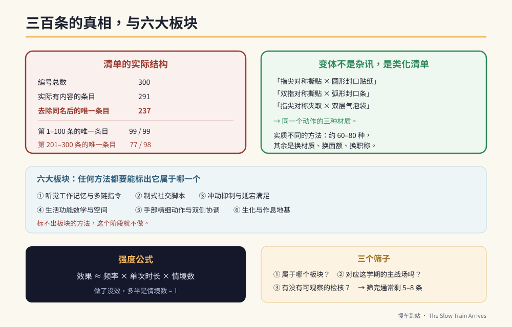

## 背景与痛点

整理这本书时，手上有一份「系统性提升语言与认知能力的三百种方法」——分段扩充、逐次累加而成的长清单。

而收到这样一份清单的家长，通常会经历三个阶段：

1. **兴奋**——三百种！终于有一套完整的东西了。
2. **瘫痪**——三百种要从哪一种开始？做完要几年？
3. **放弃**——存进手机的备忘录里，再也没有打开。

这一章要做的，是把那份清单变成**可用的东西**。而第一步，是先诚实地说清楚：**那三百条，实际上有多少是不同的。**

---

## 核心设计

### 一、先讲真话：三百条里有多少种方法

把清单逐条抽出、编号比对，得到这组数字：

| 项目 | 数量 |
|------|------|
| 编号总数 | 300 |
| 实际有内容的条目 | 291（有 9 个编号在生成过程中遗失） |
| **去除完全同名后的唯一条目** | **237** |
| 第 1–100 条中的唯一条目 | 99 / 99 |
| 第 201–300 条中的唯一条目 | **77 / 98** |

而如果进一步看内容，**唯一条目的数字仍然是高估的**。清单后段大量出现的是同一个方法的换装版本：

```text
· 「小作所包装：高精度『指尖对称撕贴』与圆形封口贴纸防皱对齐」
  「小作所包装：高精度『双指对称撕贴』与弧形封口条防皱对齐」
  「小作所包装：高精度『指尖对称夹取』与双层气泡袋防皱对齐」
  → 同一件事：用手指对称地把东西贴平／夹平。换的只是材质。

· 「金融数学：百元钞与五十元硬币的两位数混合点数」
  「金融数学：五百元钞与五十元、五元硬币的三位数混合点数换算」
  「金融数学：一千元钞与五十元、五元硬币的四位数混合点数验算」
  → 同一件事：用不同面额组合算钱。换的只是数字。

· 「利他增强：担任小作所『环境安全安检员』的职场使命感」
  「利他增强：担任小作所『薪资袋条码核对长』的最高端社会角色转换」
  「利他增强：担任小作所『饮水机滤心更换日期核对长』…」
  → 同一件事：给他一个有名字的职务。换的只是职称。
```

**实质不同的方法，大约在六十到八十种之间。** 其余的是变体。

> 🔍 **为什么会这样，以及为什么这不是坏事**
> 任何一份「再多给一些」、分十几次逐段扩充出来的长清单，到后段都会开始产生变体。这是清单这种格式的必然结果，不是谁的疏失。
> 而关键的认知转换是：**那些变体不是杂讯，它们正好就是「类化练习」的素材。**
> 第 20 章讲过，一项能力只在一种材质、一个面额、一个情境下成立，是不算数的。而清单后段那些「换材质、换面额、换职称」的变体，恰恰就是把同一个方法推到不同情境的具体清单。
> **不要把它读成「三百件要做的事」，要把它读成「六十个方法 × 每个方法的变体清单」。**

### 二、六大板块：所有方法的归属

不论清单有多长，所有方法都落在六个板块里。这六个板块也就是第二篇三核心的展开版。

| 板块 | 练什么 | 对应核心 | 详见 |
|------|--------|---------|------|
| **① 听觉工作记忆与多链指令** | 扩充能同时处理的指令量 | C2 | 第 9、29 章 |
| **② 制式社交脚本** | 把即兴社交换成可运行的剧本 | C3 + C1 | 第 15、29 章 |
| **③ 冲动抑制与延宕满足** | 等待、停止、忍住 | C1 | 第 8、32 章 |
| **④ 生活功能数学与空间** | 钱、时间、路线、数量 | C2 | 第四篇、第 30 章 |
| **⑤ 手部精细动作与双侧协调** | 剪、拧、贴、夹、装 | 动作 | 第 27、31 章 |
| **⑥ 生化与作息地基** | 睡眠、饮食、水分、肠道、回诊 | 地基 | 第 11、32 章 |

**任何一个新方法，如果你标不出它属于哪一个板块，就先不要做。** 这与第 7 章的活动标注卡是同一条规则。

### 三、强度公式：为什么「做过」不等于「有练到」

一个方法有没有效，取决于三个乘数：

```text
        效果 ≈ 频率 × 单次时长 × 情境数

  频率      每周几次？（每周一次，通常不足以产生变化）
  单次时长  每次几分钟？（超过负荷反而倒扣）
  情境数    在几个不同的场合／材质／对象上练过？
```

大部分「做了没效」的情况，问题出在**情境数 = 1**。

在家练了三百次，在学校从来没做过；用红色抹布练了三百次，换一条蓝色的就不会了。**乘积里有一项是 1，总分就上不去。**

这也是为什么本书每一章的 DoD 都写着场域要求。

### 四、选方法的三个筛子

面对一份长清单，用这三个问题筛：

```text
【筛子一】它属于哪一个板块？
  → 标不出来 → 丢掉

【筛子二】它对应这学期的主战场吗？（第 7 章的快筛）
  → 不对应 → 放进「以后」的清单，不是现在

【筛子三】它有没有可观察的检核？
  → 「提升专注力」不算；「干扰下持续 25 分钟」算
  → 没有检核 → 改写成有检核的版本，或丢掉

★ 三个筛子过完，一份 300 条的清单通常会剩下 5–8 条。
  那 5–8 条，就是你这学期真正要做的事。
```

---

## 实作

### 一、把清单当成「变体产生器」

这是本章最实用的一段。当你已经在做某一个方法，而它开始稳定时，**不要换方法，换变体**。

```text
【范例：M07 找零（第 25 章）已经稳定】

  ✗ 错误做法：去清单里找下一个没做过的方法
  ✓ 正确做法：同一个方法，换四个维度

    换面额：500 买 450 → 1000 买 850 → 500 买 380
    换场所：家里 → 便利商店 → 传统市场 → 邮局
    换对象：妈妈 → 爸爸 → 陌生店员
    换型态：实体找零 → 电子支付明细 → 自动售票机找零

  → 这四行，就涵盖了原始清单里十几条「不同编号」的方法。
```

**变体的顺序建议：先换材质／数字，再换场所，最后换对象。** 换对象是最难的一步，因为那才是真正的类化。

### 二、把方法写成可运行的样子

清单上的条目通常是名称，不是做法。把它转成可运行的形式，用第 7 章的活动标注卡：

```yaml
# 从清单条目 → 可运行的方法
source: "第 45 条　六福村安全广播：关键字提取密码战"

板块: ①听觉工作记忆
核心: C2

做法: |
  家长扮演广播员，用平稳语气念一句含 4–5 个名词的句子：
    「本班开往六福村的自强号即将进站，
      请大怒神、海盗船、蒸汽火车注意安全。」
  念完立刻问：「第一个念到的设施是哪一个？最后一个是什么车？」

检核:
  指针: 4–5 个名词中正确提取第一个与最后一个
  目标: 10 次中 ≥ 7 次
  情境数: 家（安静）→ 家（有背景音）→ 学校

强度:
  频率: 每周 3 次
  时长: 5 分钟

stop_rule: |
  连续 3 次全错 → 名词数降到 3 个
  连续两周达标 → 加入背景音干扰（进到第 2 个情境）
```

### 三、饮食与补充品类条目的处理原则

原始清单里有相当多条目属于板块⑥，而且集中在营养补充：鱼油、色胺酸、维生素 B6、辅酶 Q10、镁、多酚、每日固定饮水量……

这一类条目**必须另外处理**，理由在第 11 章已经说明过：

```text
【可以直接做的（低风险、证据合理）】
  · 规律三餐，不长时间空腹
  · 拿掉日常含糖饮料
  · 主食改低 GI（糙米、地瓜）
  · 均衡饮食中包含深海鱼、深绿色蔬菜、坚果
  · 规律分次补充水分

【必须先问医师或药师的】
  · 任何补充剂（鱼油、B 群、镁、辅酶 Q10…）
  · 任何特殊饮食疗法（生酮、限制蛋白质…）
  · 任何「每日固定 ○○○○ c.c.」的水分目标
    → 个别需求差异大，且某些状况下需要限制

【本书不采用的说法】
  · 「反式脂肪会降低神经元对药物的敏感度」
  · 「高蛋白粉会让血氨升高，加剧固着焦虑」
  · 「补充某某营养素能减少生气频率」
  → 这些推论在现有证据下都太强。第 11 章有完整说明。
```

> ⚠️ **医疗免责**
> 补充剂并非「反正吃了没坏处」。部分补充剂会影响凝血、干扰检验数值，或与抗癫痫药物产生交互作用。**任何补充品与饮食疗法，都要先与主治医师或药师确认。** 本书不提供任何剂量建议。

### 四、四章清单的读法

接下来四章，是这 237 条去重后的完整清单，按板块重新归类：

| 章 | 类别 | 条目数 |
|----|------|-------|
| 第 29 章 | **语言与沟通**（板块 ①②） | 21 |
| 第 30 章 | **认知、金钱与时间**（板块 ④） | 79 |
| 第 31 章 | **动作、工作与职场**（板块 ⑤ + 职场情境） | 84 |
| 第 32 章 | **情绪、社交、安全与地基**（板块 ③⑥） | 53 |

每一章的结构是：**先挑出该类的「母模式」（实质不同的核心方法）深入写，再附上完整清单当索引。**

**清单是拿来查的，不是拿来做完的。**

---

## 现场踩雷

**踩雷一：从第 1 条做到第 300 条。**
清单不是课程。它没有顺序，也不需要做完。

**踩雷二：因为「还有 290 条没做」而焦虑。**
去重后的实质方法约六十到八十种，而其中对你孩子这学期有意义的，通常不超过八种。

**踩雷三：一个方法还没稳就换下一个。**
稳定之前换方法，会让每一项都停在「大概会」。**先换变体，不换方法。**

**踩雷四：把补充剂清单当成可以自己运行的部分。**
这是整份清单里风险最高的一类。

**踩雷五：只做前面简单的，跳过需要出门的。**
清单里真正难、也真正有价值的，都是需要在社区、在陌生人面前做的那些。**情境数是那个乘数。**

---

## 效益与验收（DoD）

| 项目 | 验收标准 |
|------|---------|
| 认知已校正 | 知道「三百条」的实际结构（237 唯一、后段多为变体） |
| 已筛选 | 用三个筛子筛过，这学期的清单 ≤ 8 条，并写下来 |
| 已可运行 | 每一条都改写成含做法、检核、强度、`stop_rule` 的形式 |
| 情境数 ≥ 2 | 每一条至少规划了两个不同的情境／材质／对象 |
| 变体优先 | 已稳定的方法，是用「换变体」而不是「换方法」来推进 |
| 补充品已确认 | 所有营养类条目都经过医师或药师确认，或暂缓 |

> 💡 君之一席话
> 「三百这个数字让人安心，但它也让人瘫痪。**真相是六十几种方法，加上大量的换装**——而当你看懂这件事，那份让你焦虑的清单，会变成一份让你安心的工具箱。」

---


# 第29章　语言与沟通：十个母模式，与二十二条清单

**板块：** ① 听觉工作记忆与多链指令　② 制式社交脚本
**对应核心：** C2（理解量）＋ C3（表达动机）

---

## 背景与痛点

十六岁之后，语言训练最常见的错误是**继续追求「说得更多、说得更清楚」**。

第 6 章讲过为什么要换跑道。这一章讲换到哪里去：

| 旧目标 | 新目标 |
|--------|--------|
| 词汇量、句长、构音 | **听得懂更复杂的指令** |
| 自发性口语 | **在需要的时候说出关键的那一句** |
| 自然对话 | **可运行的社交剧本** |
| 只用嘴巴 | 口语 **＋ 替代沟通（AAC）** |

一句话：**输入端扩容，输出端标准化。**

---

## 核心设计：十个母模式

清单里的二十二条，可以收敛成十个实质不同的方法。以下每一个都附做法与检核。

### 母模式 1　多链指令（001、041）

```text
做法：交办任务时使用转折词链接两个空间或两个动作。
      「先去厨房拿抹布，然后去客厅擦桌子。」
      语速刻意放慢一倍；说完要求他点头再出发。
检核：连续 5 次交办，至少 4 次无额外提醒完成
升级：第 9 章的十六级阶梯
```

### 母模式 2　逆向语序（002、042）

```text
做法：故意把时间顺序倒过来说。
      「在擦黑板之前，先去办公室抱联系簿。」
      他的直觉会先做「先听到的那件事」——用眼神制止，
      引导他重新解码。
检核：两步逆向语序，10 次中 ≥ 6 次正确（这一项标准本就该低）
注意：卡住是正常的。这是语意处理的高端操作。
```

### 母模式 3　关键字提取（003、045）

```text
做法：家长扮演广播员，念一句含 4–5 个名词的句子，
      念完立刻问「第一个是什么？最后一个是什么？」
      「本班开往游乐园的自强号即将进站，
        请大怒神、海盗船、蒸汽火车注意安全。」
检核：4–5 个名词中，第一个与最后一个提取正确 ≥ 70%
情境升级：安静的家 → 有背景音 → 学校 → 真实广播
价值：这一项直接对应「在吵杂的工场里听懂组长交办」。
```

### 母模式 4　功能性描述提取（004、005）

```text
做法：不直接说物品名称，改用功能或特征描述。
      「请帮我拿『长长的、可以把地擦干净』的那个。」
      「请去教室后面，拿『蓝色、大的、塑料做的』篮子。」
检核：三特征描述的提取正确率 ≥ 70%
价值：真实职场的交办经常是描述式的
      （「拿那个大一点的箱子过来」），
      而不是他背过的名词。
```

### 母模式 5　因果接龙（006、043）

```text
做法：家长说上半句（原因），引导他接下半句（结果）。
      「因为今天下大雨……」→「所以火车开得比较慢。」
      「因为你这周在学校帮了很多忙……」→「所以周末可以出去玩。」
检核：10 次中能接出合理结果 ≥ 6 次
价值：把破碎的名词编成有逻辑的句子。
      它真正的用途是：遇到挫折时能说「因为……所以……」，
      而不是直接生气。
```

### 母模式 6　社交剧本三部曲（015、021、046）

```text
做法：把每一种常见社交场合，写成 1-2-3 的固定步骤。
      发东西给同学：
        ① 叫名字 → ② 双手递上 → ③「请拿，谢谢。」
      有人进教室：
        ① 看人 → ② 微笑 → ③「请进。」
      交东西给老师：
        ① 走到面前 → ② 双手递出 → ③「老师，这个给你。」
检核：每个剧本在无提示下完整运行 ≥ 70%
原则：他不擅长即兴社交，但非常擅长运行剧本。
      剧本越多，他在人群里越安全。
```

### 母模式 7　求助与情绪替代语言（047、065）★ 最重要

```text
做法：把「生气」替换成一句可以说出口的话。
      卡住 →「请老师教我，谢谢。」
      太累 →「我太累了，我想休息一下。」
      看不懂 →「我看不懂这个图卡，请你教我。」
      做完 →「报告，我做好了，请检查。」
练法：每天刻意制造 1 次「卡住」的情境，让他用台词解决。
      ★ 他说了要真的回应——说「我想休息」就要准他休息。
检核：无提示下自发使用 ≥ 每周 3 次
价值：这一组是全书投报率最高的语言训练。
      在机构现场，它直接决定他能不能被支持。
```

### 母模式 8　叙述结构化（024、026）

```text
做法：在他最有动机的主题上，要求结构。
      「你今天要介绍哪三个？第一个是什么？第二个呢？」
      「所以你最喜欢哪一个？为什么？」
检核：第 10 章的 fixation_structured_ratio ≥ 0.5
价值：这是他唯一会主动大量产出语言的场合。
      不在这里练叙述，就没有别的地方可以练。
```

### 母模式 9　覆诵与确认（061、063）

```text
做法：任何人交办任何事，他都要覆诵关键名词。
      「好，A 货架上架，空箱回收。」
情境升级：家长 → 老师 → 陌生大人 → 实习主管
检核：陌生人交办时能主动覆诵 ≥ 70%
价值：对他是记忆辅助，对评估者是「听得懂、会确认」的信号。
      两边都赚。
```

### 母模式 10　AAC 与界线语言（083、086、106）

```text
做法 A（AAC）：六格图卡或平板沟通软件，
      至少包含：我要喝水／我要上厕所／我不舒服／
      我想休息／我做完了／我需要帮忙
做法 B（隐私与界线）：教两句成人期必要的话——
      「这是我的东西。」
      「这件事不能跟别人说。」（隐私概念）
      「请等一下。」（面对同侪重复询问）
检核：AAC 每周主动使用 ≥ 5 次；界线语言能在情境中使用
提醒：提供 AAC **不会**抑制口语（第 6 章）。
```

---

## 完整清单（22 条）

清单是拿来查的，不是拿来做完的。每一条前面的编号，对应原始清单的条目序号。

| | |
|---|---|
| `001` 铁道双站指令法 | `002` 倒退噜语序解码 |
| `003` 火车广播密码战 | `004` 生活对象特征连连看 |
| `005` 三维度物品搜索 | `006` 句子接龙排档杆 |
| `015` 小帮手三步骤社交剧本 | `024` 游乐设施三段叙述 |
| `026` 时刻表问答字字拆解 | `027` 非口语眼神交会锚定 |
| `041` 餐饮备料三层指令链 | `043` 主题式因果关系接龙 |
| `045` 关键字提取密码战 | `047` 求助不生气：情绪替代语言 |
| `061` 陌生主管：指令覆诵与确认脚本 | `063` 跨情境名词迁移 |
| `065` 求助扩充：「我看不懂图卡」 | `083` 平板 AAC 点餐扩充 |
| `085` 午休菜单分类问答 | `086` 成人社交边界：隐私语言辨识 |
| `106` 面对同侪重复询问的标准台词 | `161` 误点广播：看板与语音二维比对 |

---

## 实作：一周配置范例

以「语言为次要战场」的配置（主战场在别处时）：

| 时机 | 做什么 | 时长 |
|------|--------|------|
| 每次交办任务时 | 母模式 1 + 9（多链指令 + 覆诵） | 0 分（内置在日常） |
| 每天晚餐时 | 母模式 5（因果接龙）2–3 回合 | 3 分 |
| 每天火车时间 | 母模式 8（叙述结构化） | 内置在 15 分钟里 |
| 每周 3 次 | 母模式 3（关键字提取） | 5 分 |
| 每天 1 次 | 母模式 7（刻意制造卡住） | 2 分 |

**注意这张表的特征：大部分是「内置在日常」，不是额外的课。** 语言训练最好的形式，就是把它藏在本来就要说的话里。

---

## 现场踩雷

**踩雷一：把语言训练排成一堂课。**
坐在桌前的「语言时间」效果远不如把它拆进一整天的交办与对话。

**踩雷二：要求他说完整句子。**
「要说『妈妈我想要喝水』，不可以只说『水』。」——在他能量有限时，完整句的要求会让他干脆不说。**先要功能，再要形式。**

**踩雷三：他说了求助句，大人没有回应。**
这会直接杀死母模式 7。**说了要有效，这是唯一的规则。**

**踩雷四：只练输出，不练输入。**
理解（输入）的扩容，比表达（输出）更能改变他的生活。**一个听得懂三步指令的人，比一个会说很多话但听不懂交办的人，好带得多。**

**踩雷五：纠正发音。**
十六岁之后，构音矫正的投报率极低，而纠正会直接打击表达动机。**听得懂就好。**

---

## 效益与验收（DoD）

| 项目 | 标准 |
|------|------|
| 多链指令 | 十六级阶梯达第 6 级以上 |
| 覆诵 | 陌生人交办时能主动覆诵 ≥ 70% |
| 求助语言 | 三句台词中 ≥ 2 句无提示自发使用，每周 ≥ 3 次 |
| 社交剧本 | 至少 3 个场合有固定剧本并能运行 ≥ 70% |
| 叙述结构 | 固着时间的结构化比率 ≥ 0.5 |
| AAC | 六格图卡或等效工具已上线，每周主动使用 ≥ 5 次 |
| 关键字提取 | 4–5 个名词的首末提取 ≥ 70%，且已在有干扰的情境练过 |

> 💡 君之一席话
> 「你花了十六年想让他多说几个字。接下来四年要换一件事：**让他在最需要的那一刻，说得出那一句。**『请教我』三个字，比一百个词汇有用。」

---


# 第30章　认知、金钱与时间：一条难度阶梯，与七十六条清单

**板块：** ④ 生活功能数学与空间
**对应核心：** C2

---

## 背景与痛点

这一类是清单里最庞大的一群，也是**变体最集中的一群**。

把它们摊开排序，会看到一件很清楚的事：

```text
「百元钞与五十元硬币的两位数混合点数」
「百元钞与十元硬币的两位数混合点数」
「五百元钞与五十元、五元硬币的三位数混合点数换算」
「五百元钞与十元、一元硬币的三位数混合点数精准找零验算」
「一千元钞与五十元、五元硬币的四位数混合点数精准找零验算」
「一千元钞与五十元、五元硬币的四位数混合点数精准找零防诈验算」
```

这六条有六个不同的编号。但它们不是六种方法——**它们是同一种方法的六个难度级距。**

而这正是这一章最有用的东西：**把那些变体重新排成一条阶梯。**

---

## 核心设计：金钱能力的十级阶梯

这是把清单里所有金钱类条目重新排序后得到的结果。**它比原始清单有用得多，因为它有顺序。**

| 级 | 内容 | 对应教材／条目 |
|----|------|--------------|
| 1 | 认得 100／500／1000 三种纸钞 | M04 · `010` |
| 2 | 判断「哪一张才够付」 | M04 · `011` |
| 3 | 等值提取：刚好一张 | M05 |
| 4 | 电子票证：刷卡后数字变小 | M06 · `008` |
| 5 | 找零的**动作链**（等、拿、收） | M07 · `009` `069` |
| 6 | 两位数混合：100 元 + 硬币 | `128` `148` |
| 7 | 三位数混合：500 元 + 两种硬币 | `168` `208` `228` `248` |
| 8 | 四位数混合：1000 元 + 两种硬币 | `268` `288` |
| 9 | 数字对帐：发票／明细／存折行条比对 | `183` `209` `223` `249` |
| 10 | 金融行政：开户、补发、预算控制 | `201` `281` `109` |

> 💡 **这条阶梯真正的用途**
> 大部分家庭不需要走到第 10 级。**走到第 5 级，社区生活的安全网就有了；走到第 7 级，多数消费场景可以独立完成。**
> 第 9、10 级属于「有支持就好」的范围——那是就服员、社工与家人的工作，不必强求他自己完成。
> **知道哪里可以停，和知道怎么往前走，一样重要。**

### 其他七个母模式

```text
【M-a　时间与日历】（012 013 039 059 079 119 243 299）
  数字时钟比对 → 视觉计时器等待 → 手表震动提醒 →
  月历标色（上班日／休息日）→ 天候变动时的行程重组
  ★ 不教时钟指针（第 26 章）

【M-b　空间与路线】（054 068 074 094 112 114 121 141 162 181）
  室内地图（我的位置／厕所／喝水／找谁）→
  路线图（家→机构）→ 跑马灯与月台号码 →
  转乘 → 地图 App 与实景对照 → 施工绕道
  ★ 起步是「自己画一张四个点的地图」（第 19 章）

【M-c　自助机台】（111 142 171 211 251 271 283 291）
  自助结帐机、售票机、加值机、闸门、磅秤、扫码
  共同结构：看屏幕 → 按对按键 → 放入／取出 → 确认数字
  ★ 每一台机器都用同一套四步骤教，不要每台重新教一次

【M-d　消费与服务场景】（101 122 221 222 241 242 261 282）
  便利商店 → 速食店 → 便当铺 → 邮局 → 医院挂号与领药
  共同结构：排队 → 说出需求 → 付款 → 收好东西 → 道谢
  ★ 医院那几条特别值得练：他一辈子都要回诊

【M-e　产量与计数】（032 049 103）
  计数器 → 良率自检 → 奖励金点数
  ★ 直接对接小作所的日常（第 16 章）

【M-f　诈骗与金钱防卫】（044 104 129 149 169 229 289）
  面对「陌生人推销点数卡」「找错钱」「余额不足」的固定脚本
  ★ 核心只有一句：「我要先问我妈妈（或组长）。」
    不必教他判断真假，教他「先问人」就够了

【M-g　对象分类与功能性思考】（033 068 113）
  依功能而非外形分类（「可以擦的东西」放一起）
  ★ 这是仓储、上架、整理类工作的基础
```

---

## 实作

### 一、金钱阶梯的推进节奏

```text
【每一级的通过标准】
  桌上版 10 次中 ≥ 8 次 ＋ 真实情境 ≥ 3 次成功

【推进速度参考】
  第 1–3 级：S2（国三下）一个学期
  第 4–5 级：S3（高职一）一个学期
  第 6–7 级：S4–S5（高职二、三）两个学期
  第 8 级以上：毕业后持续，有支持即可

★ 卡在第 5 级一年是完全正常的。
  第 5 级（找零动作链）本身就足以支撑社区生活。
```

### 二、把「机台」统一成四步骤

自助机台在清单里占了八条，但它们其实是同一套流程：

```text
【任何自助机台的四步骤】
  ① 看屏幕上的字或图
  ② 按下对应的按键
  ③ 放入（钱／卡／东西）或取出（票／找零／收据）
  ④ 确认屏幕的数字，收好东西

【教法】
  第一次：大人全程口述四步骤，他操作
  第二次：大人只说「第几步」
  第三次：大人只用手指
  第四次：他自己做，大人站在后面

★ 学会第一台，后面每一台都用同一套四步骤开场。
  这比每台机器重新教一次，省下的时间以年计。
```

### 三、诈骗防卫：只教一句话

清单里有七条关于金钱防卫的方法，每一条都设计了完整的辨识与应对脚本。但实务上有一个更简单、也更可靠的做法：

```text
【核心脚本：先问人】
  遇到任何以下情况：
    · 陌生人要他买东西、办卡、签名
    · 有人说「借我一下」「帮我付一下」
    · 找回来的钱跟他预期的不一样
    · 机器出现他看不懂的画面

  固定回答：「我要先问我妈妈（组长／老师）。」
  然后：离开现场，打电话。

【为什么不教他自己判断】
  判断真假需要的社会推理能力，是他最弱的一项，
  而且诈骗手法会不断变化。
  **「先问人」是一条不会过期的规则。**

【要配套的事】
  · 手机里有一键呼出的紧急联系人
  · 家人接到这种电话时，不能责备他「怎么这么笨」
    → 骂过一次，下次他就不打了
```

### 四、医院场景值得单独练

清单里有三条关于就医的（`221` `241` `261`）。它们容易被跳过，但**他一辈子都要回诊**。

```text
【就医三步骤】
  ① 挂号：拿出健保卡 → 说「我要看 ___ 科」→ 拿号码牌
  ② 候诊：看叫号屏幕（数字比对，接 M08）→ 安静等待（接 M10）
  ③ 领药：拿药袋 → 对餐号（早／中／晚）→ 收好

【练法】
  每次回诊时，把其中一步交给他做。一次只交一步。
  四年下来，三步都会了。
```

---

## 完整清单（76 条）

| | |
|---|---|
| `008` 乘车卡逼逼减算法 | `009` 大钞防卫战（找零动作） |
| `010` 百元钞视觉筛选器 | `011` 门票大比拼（比大小） |
| `012` 数字时间时钟对齐 | `013` 红色倒数延宕满足 |
| `032` 生产线计数器产量练习 | `033` 对象功能性非典型分类 |
| `039` 成人智能型载具时间管理 | `042` 逆向时间逻辑解码 |
| `044` 面对推销点数卡的诈骗防火墙脚本 | `049` 产量与良率自主检核 |
| `054` 陌生空间视觉地图内化法 | `059` 智能载具自动化时间管理 |
| `068` 仓储上架的三维度空间辨识 | `069` 找零硬币的重量感知 |
| `070` 自主通勤的票卡扣款金额连接 | `074` 抽象符号与实体空间的几何连接 |
| `079` 朝九晚五仿真：通勤日历部署 | `089` 悠游卡加值的数值底线认知 |
| `092` 推车负重移动与空间避障 | `094` 立体符号与实体逃生路线连接 |
| `101` 便利商店商品搜索与三步结帐 | `102` ATM 屏幕余额视觉比对 |
| `103` 作业奖励金的百元钞点数 | `104` 面对找错钱的申报脚本 |
| `108` 千元与百元的跨面额换算 | `109` 悠游卡加值的两段式预算控制 |
| `111` 条码扫描机与数字比对集成 | `112` 马路施工的空间地图动态绕道 |
| `114` 多层次符号与空间心理旋转 | `118` 定时提醒的水分补充计划 |
| `119` 全自动数字日历的角色锚定 | `121` 跨县市进站 LED 跑马灯比对 |
| `122` 速食店菜单照片与金额提取 | `123` 电子发票末三码对奖 |
| `128` 百元钞与五十元的两位数点数 | `129` 面对数字扣款的加值限制防线 |
| `141` 台铁与高铁跨运具转乘动线 | `142` 超商自助结帐三步自动化 |
| `143` 薪资单的扣款与实领金额比对 | `148` 百元钞与十元的混合点数 |
| `149` 卡片余额与整数限制防线 | `163` 劳退专户的提拨百分比对帐 |
| `168` 五百元与两种硬币的三位数点数 | `169` 存折登折与金额行条比对 |
| `171` 自动售票机按键比对与找零集成 | `182` 存款机钞票喂入与屏幕数值对齐 |
| `183` 劳保专户总资产与年资比对 | `201` 银行临柜开户的三步骤脚本 |
| `203` 定存与活存的资产总值对帐 | `208` 千元与两种硬币的三位数点数 |
| `209` 行动支付明细与发票金额比对 | `211` 自助加值机按键与纸钞喂入 |
| `221` 医院挂号：健保卡与号码牌比对 | `222` 邮局包裹条码比对与签收 |
| `223` 存折行条减算与薪资差额对帐 | `228` 五百元与硬币的三位数换算 |
| `229` 超商取货收据金额与纸钞比对 | `241` 医院领药：药袋餐号比对 |
| `242` 邮局便利箱材积与重量比对 | `243` 停班停课时的行事历弹性重组 |
| `248` 五百元与小额硬币的找零验算 | `249` 电子发票载具条码与云端对帐 |
| `251` 邮局自动标签机与找零集成 | `261` 医院抽血：排检单时间与诊号 |
| `268` 一千元与硬币的四位数找零验算 | `271` 闸门余额过低与退场储值集成 |
| `281` 金融卡遗失补发的四步骤申办 | `282` 车站便当铺：照片与金额等价提取 |
| `283` 超商 APP 点数与实体商品兑换 | `288` 一千元的四位数混合点数防诈验算 |
| `289` 行动支付多重条码的云端对帐 | `291` 闸门余额不足与自动退场储值 |
| `298` 定时震动提醒的水分补充 | `299` 数字语音日历的社会角色锚定 |

---

## 现场踩雷

**踩雷一：照编号顺序做。**
清单没有顺序，阶梯才有。**用本章的十级阶梯，不要用编号。**

**踩雷二：追求走到第 10 级。**
第 5 级就足以支撑社区生活。**知道可以停在哪里，是这一章最重要的一句话。**

**踩雷三：每一台机器重新教一次。**
四步骤通用。

**踩雷四：教他判断诈骗。**
教「先问人」。

**踩雷五：跳过就医场景。**
他一辈子都要回诊，而这是最容易在真实情境中练的一项——反正都要去。

**踩雷六：只在纸上练金钱。**
第 21 章的原则：桌上练四次，社区实作一次。

---

## 效益与验收（DoD）

| 项目 | 标准 |
|------|------|
| 金钱阶梯 | 明确知道目前在第几级，且该级有 10 次纪录 |
| 第 5 级 | 找零动作链（等、拿、收）达 ≥ 80%，并在真实商店成功 ≥ 3 次 |
| 机台 | 至少 2 种自助机台能以四步骤操作，且第 2 种明显比第 1 种快学会 |
| 时间 | 数字时钟比对 ≥ 80%；月历已上墙并使用中 |
| 空间 | 至少 1 张自己画的路线图，并实际使用过 |
| 防卫 | 「我要先问我妈妈」能在情境中说出；紧急联系人已设一键呼出 |
| 就医 | 挂号、候诊、领药三步中，至少 1 步由他独立完成 |

> 💡 君之一席话
> 「那六条看起来不一样的『混合点数换算』，其实是同一道题目的六个难度。**把清单排成阶梯的那一刻，三百条的焦虑就变成了十级的路线图**——而你只需要走到第五级，他就安全了。」

---


# 第31章　动作、工作与职场：八个母模式，与八十八条清单

**板块：** ⑤ 手部精细动作与双侧协调（＋职场情境）
**对应核心：** C1（耐受）＋ C2（流程）

---

## 背景与痛点

这一类条目最多——八十八条。但它的结构也最清楚，因为**变体最集中**。

把它们排在一起看：

```text
「报告组长，机器坏了」（产线异常）
「报告组长，贴纸不够了」（原料短缺）
「报告组长，这盒卡片压坏了」（品质瑕疵）
「报告组长，这盒贴纸湿掉了」（原料受潮）
「报告组长，这盒卡片印错了」（油墨晕开）
「报告组长，这袋凤梨酥漏气了」（封口不严）
「报告组长，这盒纸盒发霉了」（受潮发霉）
「报告组长，字印错了」（印刷错字）
```

八个编号，一个母模式：**发现异常，要说出来。**

```text
「担任奖励金发放助手」
「担任环境安全安检员」
「担任薪资袋条码核对长」
「担任交通车安全带检查员」
「担任打扫工具消毒长」
「担任急救箱效期核对长」
「担任餐具分类核对长」
「担任饮水机滤心日期核对长」
「担任成品良率验收长」
「担任黄线安全纠察队长」
```

十个编号，一个母模式：**给他一个有名字的职务。**

**这一章要做的，就是把八十八条收成八个。**

---

## 核心设计：八个母模式

### 母模式 1　手部精细动作五级

```text
【剪　五级】（第 27 章有完整说明）
  L1 剪断 → L2 沿粗线 → L3 沿细线 → L4 曲线 → L5 剪形状
  对应条目：018 029 051 071 091

【拧　四级】
  L1 用压的 → L2 一手固定一手转 → L3 反向小幅 → L4 反向拧干
  对应条目：017 090

【撕贴　四级】★ 清单里变体最多的一组
  L1 撕开 → L2 粘贴 → L3 贴平不起皱 → L4 对齐边缘
  变化维度：材质（纸／胶带／双面胶／气泡袋／防静电袋）、
            形状（直边／圆形／弧形）、对称性（双指／双手）
  对应条目：133 153 173 213 233 253

【夹取与分装　三级】
  L1 抓取 → L2 指腹捏取 → L3 精密捏取并对齐
  对应条目：052 073 093 113

【复合机具操作】（S4 以后，且需在有督导的环境）
  封口机、热压机、螺丝起子、打钉机、胶枪、剪线钳、杠杆机具
  对应条目：088 110 130 150 170 210 230 250 270
  ★ 这一组全部涉及安全，家中不宜自行练习。
    它们属于高职实作课与机构职场训练的范围。
```

> 💡 **关于「撕贴」六个编号的正确读法**
> 那六条不是六种方法，是**同一个动作的六种材质**。而材质正是类化的维度——第 28 章讲的变体产生器，在这里有最具体的例子。
> 做法：先把「撕、贴、贴平」在纸胶带上练稳，然后**只换材质**，其他不变。六种材质练完，这项能力才算真的成立。

### 母模式 2　工具多元减敏

```text
做法：每两周引入一种新工具（第 15 章有完整清单与流程）
原则：目标是「不排斥」，不是「熟练」
检核：能操作 ≥ 3 种工具，单一工具专注 ≥ 15 分钟
对应条目：031 053 072 111 131 151 231
```

### 母模式 3　产线耐受与抗干扰

```text
做法：家庭产线 30–40 分钟（第 16 章）
      ＋ 受控干扰（音乐、对话、拿走工具、更换任务）
进程：35 分钟 → 50 分钟（中间休息 10 分钟）→ 2 小时（含休息）
      ★ 2 小时是多数机构职评的参考门槛
检核：干扰下持续 ≥ 25 分钟；40 分钟作业良率 ≥ 90%
对应条目：048 062 081 099
```

### 母模式 4　职场回报：发现异常要说（8 条变体）

```text
【统一脚本】
  ① 停手（不要继续做坏的）
  ② 走到组长／老师面前
  ③ 说：「报告组长，___ 坏了 / 不够了 / 印错了。」
  ④ 等待指示

【练法：刻意制造异常】
  在家庭产线中，故意放入一个坏掉的、少一个的、印错的，
  等他发现。他发现了 → 大力称赞；没发现 → 下次做得更明显。

【为什么这一组值得单独练】
  在机构现场，「发现问题会说」与「发现问题继续做」
  是两种完全不同的员工。前者是资产，后者会造成整批报废。
  ★ 而且这一项几乎不需要认知能力，纯粹是习惯。

对应条目：105 125 145 165 185 205 225 245 265 285
```

### 母模式 5　利他角色：给他一个有名字的职务（10 条变体）

```text
【原理】
  他的利他动机极强、以帮忙为荣。把一件例行工作
  包装成「一个职务」，配合度会完全不同。

【职务设计三要件】
  ① 有名字（「○○核对长」「○○检查员」）
  ② 有明确范围（哪一区、哪一篮、哪几样）
  ③ 有可见的完成标记（打勾表、签名栏、计数器）

【可用的职务清单（家庭版）】
  · 餐具分类核对长（每餐后检查餐具是否归位）
  · 饮水机检查员（每周检查滤心日期）
  · 药品效期核对长（每月检查家用药箱效期）★ 需大人在旁
  · 安全带检查员（上车前检查全家安全带）
  · 资源回收分类长
  · 电器关闭检查员（睡前检查电源）

★ 一次只给一个职务，做稳了再加。
  职务太多会稀释它的荣誉感。

对应条目：067 107 127 147 167 187 207 227 247 267 287
```

### 母模式 6　社交自控与物权边界（7 条变体）

```text
【情境】同侪借东西、翻他的包包、拍他肩膀、反复问同一件事

【统一脚本（两句话）】
  护卫自己的东西：「这是我的，请你还我。」
  身体界线：      「请不要碰我，谢谢。」
  无法处理时：    「老师，我需要帮忙。」

【练法】
  在家由家人扮演「借东西的同学」，练习他说出这两句。
  ★ 重点不是把对方推开，是「用嘴巴处理」。

【要同时教的另一面】
  他也可能是「太热心而越界」的那一方（第 15 章）。
  同一组脚本要双向教：
    「这是他的东西，你要先问。」

对应条目：082 106 126 146 166 186 206 226 246 266 286
```

### 母模式 7　社会防卫：拒绝与离开（4 条变体）

```text
【情境】陌生人搭讪、推销、强行拉手、插队、肢体推挤

【统一脚本（三步）】
  ① 「我不要，谢谢。」（不需要解释理由）
  ② 转身离开，走向人多的地方或店员
  ③ 打电话给家人／组长

【★ 最重要的一条原则】
  不教他判断对方是好人还是坏人——那需要的社会推理
  能力是他最弱的一项。
  教他的是：**任何陌生人的任何要求，一律「先问人」。**
  （与第 30 章的诈骗防卫同一条规则）

对应条目：124 144 184 244 262
```

### 母模式 8　工作结构的外部化（白板、手册、地图）

```text
· 家中的视觉工作白板（周历 + 今日任务 + 工具篮）：099
· 陌生职场的路线地图：034
· 交接手册（第 18 章的七页）：080

【共同原理】
  把「应该记住的事」放到墙上、卡片上、手册上。
  这不是辅助轮——它就是小作所与庇护工场的标准工作模式。
```

---

## 完整清单（88 条）

| | |
|---|---|
| `007` 无声手势大风吹 | `014` 职场角色动机转换 |
| `016` 职场求助不生气脚本 | `017` 扭转拧抹布 |
| `018` 铁道工程师剪直线 | `021` 迎宾小帮手三部曲 |
| `023` 职场突发状况冷静声明 | `025` 职场拒绝干扰隔离术 |
| `029` 剪波浪线 | `030` 标签分类机 |
| `031` 清洁工具力道微调 | `034` 陌生职场地图内化 |
| `036` 实习日午餐配置 | `037` 加工食品的职场饮食原则 |
| `046` 三部曲社交自动化 | `048` 家庭产线 35 分钟耐受力 |
| `051` 手眼协调高端双侧剪纸 | `052` 标签机精密捏取与分类 |
| `053` 多元职业工具功能性归类 | `057` 加工食品与焦虑的隔离 |
| `060` 固着动机的同侪分享 | `062` 环境噪音减敏 |
| `067` 用「谢谢小帮手」化解话题固着 | `071` 包装代工的圆形剪裁 |
| `072` 喷枪与手腕扭力减敏 | `073` 高良率精细计数与装袋 |
| `080` 转衔会议：视觉工作手册交付 | `081` 2 小时长工时耐受训练 |
| `084` 话题收尾：进站停靠声明 | `087` 实习值日生的变故应变 |
| `088` 封口机与手腕扭力复合操作 | `090` 大范围轨道式抹布擦拭 |
| `091` 圆形剪纸与夹链袋密封 | `093` 储位管理的指腹对齐 |
| `098` 定时提醒的水分补充 | `099` 周历白板的视觉常规锚定 |
| `105` 完工回报语音自动化 | `107` 奖励金发放助手 |
| `110` 双手非对称物料组装 | `113` 指腹揉动分装与磅秤对齐 |
| `124` 面对肢体推挤的自保声明 | `125` 上车前的扣款数字主动回报 |
| `127` 黄线安全纠察队长 | `130` 电动螺丝起子与扭力回馈 |
| `131` 雷射雕刻机的图形对齐 | `133` 指尖对称撕贴（圆形封口） |
| `144` 面对插队的礼貌退让与求助 | `145` 回报：机器坏了 |
| `147` 环境安全安检员 | `150` 热压包装机与双手对称施力 |
| `151` 标签剥离机的精密捏取 | `153` 指尖双向撕贴（不对称封口） |
| `162` 地图实景导航与实体建筑比对 | `165` 回报：贴纸不够了 |
| `166` 面对借用工具的产权边界声明 | `167` 薪资袋条码核对长 |
| `170` 气动打钉机与定点下压 | `173` 双指对称撕贴（弧形封口） |
| `181` 地图指南针与真实路口对齐 | `184` 面对搭讪推销的拒绝与撤退 |
| `185` 回报：卡片压坏了 | `187` 交通车安全带检查员 |
| `202` 行动支付条码与指纹辨识 | `205` 回报：贴纸湿掉了 |
| `207` 打扫工具消毒长 | `210` 气动胶枪与定速拖曳 |
| `212` 雨天月台的收伞与重心下压 | `213` 指尖对称夹取（气泡袋） |
| `225` 回报：卡片印错了 | `227` 急救箱效期核对长 |
| `230` 气动剪线钳与定点下压 | `231` 自动磅秤机的重量比对 |
| `233` 指尖对称扯平（防静电袋） | `244` 面对强行拉手的拒绝与呼救 |
| `245` 回报：封口漏气了 | `246` 面对翻动包包的边界防卫 |
| `247` 餐具分类核对长 | `250` 杠杆压汁机与对称下压 |
| `253` 双手非对称拉平（双面胶） | `262` 包裹破损的瑕疵申报脚本 |
| `265` 回报：纸盒发霉了 | `266` 面对翻看卡片的边界防卫 |
| `267` 饮水机滤心日期核对长 | `269` 行动支付多重条码出示 |
| `270` 杠杆封箱机与非对称下压 | `285` 回报：字印错了 |
| `286` 面对拍打肩膀的身体边界 | `287` 成品良率最终验收长 |

---

## 现场踩雷

**踩雷一：在家练需要机具安全的项目。**
气动工具、热压机、打钉机、剪线钳——**这些属于有督导的职场训练环境**，不是家庭活动。家中的手部练习用剪刀、抹布、胶带、夹链袋就够。

**踩雷二：把八个回报变体当成八件事。**
一个脚本，八个情境。**练的是同一句话。**

**踩雷三：一次给三个职务。**
荣誉感会被稀释。一次一个。

**踩雷四：只教他保护自己，不教他尊重别人。**
物权边界是双向的。他也可能是越界的那一方。

**踩雷五：手部练习没有真实产出。**
剪空气、拧干净的抹布——没有结果的练习撑不久。**剪切来的东西要用，擦过的地方要真的脏。**

**踩雷六：跳过「发现异常要说」。**
这是这一章投报率最高的一项，而且它几乎不需要认知能力。

---

## 效益与验收（DoD）

| 项目 | 标准 |
|------|------|
| 剪 | 达 L2 以上，非惯用手会转纸 |
| 拧 | 达 L3 以上（双手能反向转） |
| 撕贴 | 在 ≥ 3 种材质上达成「贴平不起皱」 |
| 工具 | 能操作 ≥ 3 种，单一工具专注 ≥ 15 分钟 |
| 产线耐受 | 干扰下 ≥ 25 分钟；良率 ≥ 90% |
| 异常回报 | 刻意制造的异常，能发现并回报 ≥ 70% |
| 职务 | 有一个有名字的职务，运行满 4 周 |
| 边界语言 | 「这是我的」「请不要碰我」能在情境中说出 |
| 陌生人 | 「我不要，谢谢」＋ 离开 ＋ 打电话，三步能演练完成 |

> 💡 君之一席话
> 「八十八条看起来像八十八件事，其实是八件事的八十八种穿法。**而真正决定他能不能待在那间工场的，是其中最不起眼的一条：发现东西坏了，他会不会走过去说一声。**」

---


# 第32章　情绪、社交、安全与地基：九个母模式，与五十一条清单

**板块：** ③ 冲动抑制与延宕满足　⑥ 生化与作息地基
**对应核心：** C1 ＋ 地基

---

## 背景与痛点

这一类的变体现象最明显，而且**其中一群变体特别值得拿出来检讨**。

```text
「长期服用之血氨与骨质密度年度防御」
「长期服用之血氨与脂肪肝年度对抗生化防线」
「长期服用之血氨与凝血功能年度对抗生化防线」
「长期服用之血氨与心电图（ECG）年度对抗生化防线」
「长期服用之血氨与甲状腺功能年度对抗生化防线」
「长期服用之血氨、胰岛素抗性与脂肪肝全套代谢防御线」
「血氨与全血球计数的成人期精密监测」
「血小板与肝指数年度大追踪」
```

八个编号，看起来像八套严谨的医疗监测计划。但它们实际上是**同一件事的八种说法**：**定期回诊，做医师认为该做的检查。**

而更需要说清楚的是：**该验哪些项目、多久验一次，是医师依据用药与个别状况决定的，不是清单决定的。** 一份把八种检查项目排列组合的清单，看起来很专业，但它无法取代一次门诊——它甚至可能让家长带着一份「我要验这些」的名单去门诊，让对话变得困难。

**这一类条目的正确用法是：把它读成一句话——「不要漏掉回诊」。**

---

## 核心设计：九个母模式

### 母模式 1　代币与延宕满足

```text
做法：聊天券（第 10 章）＋ 视觉计时器（第 8 章）
检核：情绪回复时间；非约定时段能以指向代币处理 ≥ 70%
对应条目：013 022
```

### 母模式 2　惊喜减敏：计划变更的演练

```text
做法：在安全情境下，刻意制造「说好的事情改变了」。
      「今天火车停驶，我们改搭公车。」
      「本来要去的店关门了，我们换一家。」
      引导台词：「没关系，改成 ___ 也可以。」
频率：每两周 1 次，不要更密集
检核：4 次演练中，能使用台词自我安抚 ≥ 2 次
延伸：真实的停驶、停班停课、机构活动更改，
      都是免费的演练机会——事后复盘，不要浪费。
对应条目：028 050 087 243 263 284
```

### 母模式 3　人际减敏：别人的情绪与距离

```text
【情境】同侪尖叫、突然搭肩、过度热情推挤、陌生人大声问路

【统一脚本】
  ① 往后退一步（物理距离优先于言语）
  ② 「请等一下。」或「请不要碰我，谢谢。」
  ③ 若持续 → 走向老师／组长

【特别提醒：面对他人尖叫】
  在机构里，其他学员的情绪行为是常态。
  他需要的不是「忍受」，是**空间隔离**——
  教他「站起来，走到另一边」，这是合法且有效的自保。

对应条目：126 146 206 226 082
```

### 母模式 4　环境与天候安全（8 条变体 → 一件事）

```text
清单里有八条分别针对：大雨、强风、台风、大热天、
梅雨积水、地下道眩光、地下月台密闭、高架月台。

它们是同一件事：**在各种天候与环境下，站得稳、看得清、走得安全。**

【统一的四个要点】
  ① 站位：永远在黄线后方，远离边缘
  ② 重心：风大、地滑时，脚步放大、重心放低
  ③ 视线：眩光、反光时，先停下来看清楚再走
  ④ 装备：雨伞要收好（在人多处不撑伞）、
          帽子与雨具要能单手处理，不能占满双手

【练法】
  不要为此特地制造情境。**天气本来就会变**——
  下雨那天就练下雨的版本，台风前一天就练强风的版本。

对应条目：132 152 172 212 232 252 272 292
```

### 母模式 5　防灾：地震与火灾

```text
【地震】
  ① 蹲下 → ② 找掩护（桌下、承重墙边）→ ③ 抓稳
  ④ 摇完之后，跟着大人走，不要自己跑

【火灾警报】
  ① 停下手边的事 → ② 跟着老师／组长走
  ③ 不搭电梯 → ④ 低姿势前进

★ 重点是「跟着人走」，不是「自己判断」。
  在防灾这件事上，服从比理解更安全。

【练法】
  学校与机构的防灾演练，就是最好的练习。
  事前预告（「明天会有警报声，那是演习」）能大幅降低恐慌。

对应条目：164 204 224
```

### 母模式 6　医疗追踪（13 条变体 → 一句话）

```text
**「不要漏掉回诊，并在回诊时说出你观察到的变化。」**

【家庭端该做的】
  · 每次回诊前准备第 11 章的「四段信息」
  · 每月一次的用药观察表
  · 环境转换（新学校、实习、换机构）前主动回诊
  · 儿童科到成人科的转衔（第 18 章）

【家庭端不该做的】
  · 自行列出「我要验这些项目」的清单
  · 依据网络清单判断该不该加验
  · 因为某条清单提到某个检查，就要求医师安排

对应条目：035 055 075 076 095 096 115 155 175 235 255 275 295
```

> ⚠️ **医疗免责**
> 检查项目、追踪频率、任何剂量调整，一律由主治医师依实际状况决定。长期用药确实需要定期监测，但**监测什么、多久一次，是临床判断，不是清单能取代的**。家长的角色是：不缺席、带着观察纪录、如实报告。

### 母模式 7　饮食与营养（10 条 → 三句话）

```text
【可以直接做的】
  · 拿掉日常含糖饮料
  · 三餐规律，不长时间空腹
  · 主食低 GI；均衡饮食包含深海鱼、深绿色蔬菜、坚果

【要问过医师或药师的】
  · 任何补充剂（鱼油、B 群、镁、辅酶 Q10、色胺酸…）
  · 任何固定的每日饮水量目标（个别差异大）
  · 任何特殊饮食疗法

【本书不采用的宣称】
  · 「反式脂肪降低神经元对药物的敏感度」
  · 「加工食品的磷酸盐加剧固着焦虑」
  · 「补充色胺酸能稳定情绪、减少固着」
  → 方向未必错，但推论太强（第 11 章有完整说明）

对应条目：019 020 036 056 077 097 116 117 296 297
```

### 母模式 8　作息与放松

```text
· 高墙式作息：放学／下班后不再训练（第 16 章）
· 固定起床时间；睡前 30–60 分钟无屏幕
· 周末彻底减压，不谈工作、不运行代币制（第 17 章）
· 规律分次补水（量请问医师）

★ 这一组是所有母模式里最容易被牺牲的，
  也是牺牲之后最快看到后果的。

对应条目：038 058 078 098 118
```

### 母模式 9　长期社交网络（5 条 → 一件事）

```text
「一张照片」规则（第 10 章）的成人版：
  在机构里，每周固定一次，用他的固着兴趣与同侪交互。
    · 带一张照片给同事看
    · 分享一样小东西
    · 在休息时间讲三分钟他的主题

【为什么这一项要放在最后，但一点也不次要】
  他可能在同一个机构待十年、二十年。
  在那段时间里，保护他的不是能力，是**人缘**。
  一个有朋友的人，出状况时会有人帮他说话。

对应条目：040 060 100 120 300
```

---

## 完整清单（51 条）

| | |
|---|---|
| `019` 游离糖的日常减量 | `020` Omega-3 的饮食来源 |
| `022` 聊天券限量代币制 | `028` 惊喜减敏演练 |
| `035` 新环境转换前回诊 | `038` 夜间作息高墙隔离 |
| `040` 固着兴趣的同侪分享 | `050` 非预期变故的减敏演练 |
| `055` 环境转换前的用药追踪回诊 | `056` 高负荷日的午餐配置 |
| `058` 放学后的作息完全隔离 | `066` 非预期干扰的社交脚本 |
| `075` 儿童科到成人神经内科的转衔 | `076` 年度血液与肝功能追踪 |
| `077` 成人期膳食调配 | `078` 实习期间的定时补水 |
| `082` 「请借过」社交防御剧本 | `095` 每日服药时间的精准守护 |
| `096` 成人期的年度生化监测 | `097` 抗退化的低发炎膳食 |
| `100` 成人同侪友谊的固化 | `115` 年度监测（骨质相关） |
| `116` 神经髓鞘维护的膳食来源 | `117` 情绪相关营养素的日常来源 |
| `120` 职场同侪的分享会 | `126` 面对同侪尖叫的空间隔离 |
| `132` 月台安全盲区的减敏绕行 | `146` 面对搭肩的身体界线维护 |
| `152` 高架月台强风的重心下压 | `155` 年度监测（肝脏相关） |
| `164` 过马路绿灯转红的原地立定 | `172` 地下月台的密闭空间减敏 |
| `175` 年度监测（血液相关） | `186` 面对频繁借用的人际缓冲台词 |
| `204` 地震警报的就地掩护 | `206` 面对过度热情推挤的边界声明 |
| `212` 雨天月台的收伞与防滑 | `224` 火灾警报的疏散与定向 |
| `226` 面对大声问路的边界防卫 | `232` 大热天月台的防晒与防眩光 |
| `235` 年度监测（凝血相关） | `252` 台风前的强阵风站姿 |
| `255` 年度监测（心脏相关） | `263` 突发停驶的安全退场与转乘 |
| `272` 地下道积水的跨越站姿 | `275` 年度监测（甲状腺相关） |
| `284` 突发停驶的替代路线重组 | `292` 地下道眩光的跨越站姿 |
| `295` 成人期代谢的整体追踪 | `296` 成人期抗退化的膳食来源 |
| `297` 黄昏时段的情绪平稳点心 | `300` 职场分享会与终生人际保护网 |

---

## 现场踩雷

**踩雷一：把十三条医疗监测当成十三件要做的事。**
它是一件事：**回诊，并且说出你的观察。**

**踩雷二：带着清单去门诊要求检查。**
带观察纪录去，不要带检查清单去。前者帮助医师判断，后者妨碍判断。

**踩雷三：补充剂「反正吃了没坏处」。**
会有交互作用，会影响检验值。先问。

**踩雷四：为了练天候安全，特地在台风天出门。**
不需要。**天气会自己来。**

**踩雷五：防灾教他自己判断。**
教「跟着人走」。

**踩雷六：把社交网络当成「有空再说」。**
他在机构的十年二十年里，人缘是最强的保护。**它需要每周一次的维护，而不是等到出事才想起来。**

**踩雷七：周末继续训练。**
第 17 章讲过。这一项是本章所有母模式里，最常被违反、后果也最直接的一条。

---

## 效益与验收（DoD）

| 项目 | 标准 |
|------|------|
| 代币与计时器 | 实施满 4 周；非约定时段能以指向代币处理 ≥ 70% |
| 惊喜减敏 | 每两周 1 次；能使用「没关系，改成 ___ 也可以」 |
| 人际边界 | 「请等一下」「请不要碰我」能在情境中使用 |
| 天候安全 | 黄线后方、重心下压、收伞等要点在真实天候中做到 |
| 防灾 | 学校／机构演练中能跟着人走，不脱队 |
| 医疗 | 未漏回诊；每次带四段信息；环境转换前已回诊 |
| 饮食 | 无日常含糖饮料；补充品皆经确认 |
| 作息 | 高墙式作息 ≥ 80% 的日子；周末不训练 |
| 社交 | 每周 1 次固着兴趣的同侪分享，且有正向回应 |

> 💡 君之一席话
> 「八条写得很专业的『年度生化防线』，说穿了就是四个字：**不要缺诊**。而清单越华丽，越容易让人忘记那四个字——这就是为什么这本书要把它们拆开看。」

---


# 第33章　如果从头再来：给三岁家长的三十个方向

## 背景与痛点

这一章有两种读者，读法完全不同。

**如果你的孩子还小**（三到六岁，刚拿到诊断，或还在等诊断）——这一章是这本书里最直接对你有用的部分。**你有的东西是十六岁那一组没有的：时间，以及可塑性最高的那几年。**

**如果你的孩子已经十几岁**——这一章不是要让你后悔的。它有两个功能：第一，**当镜子**。你会在清单里看到很多项目，发现「这个他已经会了」「这个我们早就在做」——那不是巧合，那是你这十几年做对的事。第二，**当礼物**。你可以把它给还在起点的家庭。

> 💡 **一句必须先讲的话**
> 这三十个方向，是**合理的早疗方向**，不是有随机对照试验支持的疗程。它们多数来自临床实务与发展理论的共识，而共识不等于证明。
> 本章会逐项标注强度与风险。看到「强度：低」的项目，意思是「可以做，但不要把期待押在它身上」。

> ⚠️ **医疗免责**
> 本章涉及用药规律、检查安排与饮食，全部属于医疗决策，一律由主治医师决定。特别是「多久做一次脑电图」「要不要做基因检测」这类问题，**没有一个通用答案**——它取决于孩子的实际表现。本章的功能是让你知道门诊时可以问什么。

---

## 领域一　神经地基与癫痫防线（方向 1–10）

**核心目标：** 在生理层面保护刚受损的脑细胞，为认知与语言腾出发育空间。

| # | 方向 | 具体做法 | 强度 |
|---|------|---------|------|
| 1 | **服药规律化** | 把服药绑在固定事件上（早餐后、洗澡后），而不是靠记忆。用闹钟、药盒、双人确认 | **高** |
| 2 | **不长时间空腹＋减少精致糖** | 定时定量，主食以原型食物为主。生病时尤其不可长时间不进食（第 4 章） | 中 |
| 3 | **问清楚基因检测的策略** | 发病当下就与医师讨论：要不要做、做哪一种、结果可能如何影响用药 | **高** |
| 4 | **睡眠脑电图的追踪** | 特别在出现「学过的东西不见了」时主动询问。夜间放电抓不到就等于没查 | **高** |
| 5 | **感觉输入的调节** | 针对「反应过低」的孩子，给予规律的触觉与本体觉输入（洗澡时的刷洗、深压、拥抱） | 低到中 |
| 6 | **前庭与大动作** | 每天有翻滚、爬行、走直线、荡秋千、踩不平地面的时间 | 中 |
| 7 | **手指捏取** | 不急着写字。捏黏土、捡豆子、按喷雾瓶、夹夹子 | 中 |
| 8 | **双侧对称动作** | 双手拍掌、揉大面团、两手抱大球、双手推 | 中 |
| 9 | **夜间高墙作息** | 傍晚之后不再安排认知训练；固定就寝；睡前放松流程 | **高** |
| 10 | **规律补水** | 分次、少量、固定时机（起床、餐前、活动后）。**具体水量请问医师** | 中 |

> 🔍 **这一栏里被我改写过的部分**
> 早期草稿对这一群的描述比实际证据强得多：「连续 1000 天无放电」「分钟级的服药时钟」「在水中加微量电解质以提高药物穿透血脑屏障」。
> 这些说法的方向未必错（规律服药确实重要、补水确实重要），但精确度与机转是被夸大的。**规律服药的理由已经足够充分，不需要再加一个听起来很科学但站不住的解释。**

---

## 领域二　表达性语言与功能性沟通（方向 11–20）

**核心目标：** 不等口语自然出现，先把「能沟通」创建起来。

| # | 方向 | 具体做法 | 强度 |
|---|------|---------|------|
| 11 | **AAC／图卡提早导入** | 在墙上、桌上放需求图卡（水、厕所、饼干、帮忙）。他指图卡，就给回应。系统化的版本是 **PECS**（图片兑换沟通系统），可请语言治疗师评估 | **高** |
| 12 | **共同注意与眼神对齐** | 说话前先叫名字、等 2 秒眼神，再开口 | **高** |
| 13 | **两步骤指令链** | 「先拿鞋子，然后去门口站好。」从一开始就用转折词 | **高** |
| 14 | **实物 1 对 1 命名** | 用真的苹果教「苹果」，把物品拿到嘴边，慢速夸张发音 | **高** |
| 15 | **制式社交脚本** | 谢谢、你好、请帮忙 → 都做成「① 看人 ② 动作 ③ 说话」的三步骤 | **高** |
| 16 | **口部动作模仿** | 照镜子玩张嘴、噘嘴、吐舌的模仿游戏 | 中 |
| 17 | **因果句填空** | 「因为下雨了……」→ 引导接「所以不能出去玩」 | 中 |
| 18 | **音量的视觉手势** | 手掌平放＝小声，五指张开＝太大声。用手势，不用吼 | 中 |
| 19 | **逆向语序（四岁半后）** | 「在吃布丁之前，先去洗手。」 | 中 |
| 20 | **求助台词替代情绪** | 卡住时立刻引导说：「请帮忙／太难了／妈妈教我」 | **高** |

**这一组里，第 11 与第 20 是投报率最高的两项。**

第 11（AAC）之所以重要，是因为它解决的是**沟通失败的累积**——一个讲了没人懂、久了就不讲的孩子，会同时失去语言与动机。而第 20 是这整本书的核心：**用一句话取代一次爆发。**

> 💡 **给正在犹豫的家长**
> 「用图卡他会不会就不说话了？」——这是这个领域最常见的担忧，而现有的研究方向并不支持它。提供替代管道通常伴随口语表达的增加，因为**沟通成功的经验本身会提高沟通动机**。

---

## 领域三　认知运行功能与固着重组（方向 21–30）

**核心目标：** 不压抑固着，把它接到有用的地方——从三岁就开始。

| # | 方向 | 具体做法 | 强度 |
|---|------|---------|------|
| 21 | **视觉计时器** | 红色还在＝工作时间；红色不见＝喜欢的事的时间 | **高** |
| 22 | **功能性分类** | 「把『可以用来擦干净』的东西都捡出来」——依功能，不依外形 | 中 |
| 23 | **惊喜减敏** | 游戏中故意打断规律：「轨道被挡住了，火车可以绕道走。」 | 中 |
| 24 | **指物数数** | 手指必须碰到对象才数。不准用眼睛扫 | **高** |
| 25 | **刷卡的因果** | 四岁起，每次刷卡让他看屏幕：「逼一声，钱变少。」 | 中 |
| 26 | **购物三部曲** | 付钱 → 拿东西 → **左手等找零** → 收好 | **高** |
| 27 | **双手非对称工具** | 一手固定、一手操作（左手压住底座，右手用夹子贴贴纸） | 中 |
| 28 | **微型家事产线** | 三格图卡：擦桌子 → 拿碗 → 发筷子。四岁起就当值日生 | **高** |
| 29 | **家里的平面地图** | 把家画成简图，让他看着地图去房间拿东西 | 中 |
| 30 | **周历白板** | 每天粘贴昨天的格子，指着今天声明行程 | **高** |

---

## 实作：如果你手上有一个三岁的孩子

三十个方向不是三十件事。**第一年只要做六件。**

```text
【第一年的六件事】
  ① 服药规律 + 睡眠固定（方向 1、9）
  ② 图卡沟通上线（方向 11）
  ③ 说话前先叫名字、等眼神（方向 12）
  ④ 所有指令都用「先…然后…」（方向 13）
  ⑤ 卡住时教他说「请帮忙」（方向 20）
  ⑥ 视觉计时器（方向 21）

  → 这六件事涵盖了地基、沟通、抑制三大块，
    而且全部可以内置在日常，不需要额外课程。

【第二年再加】
  指物数数、微型家事产线、购物三部曲、周历白板

【什么时候都不要做的】
  · 同时做超过八件事
  · 为了做完清单而牺牲睡眠与亲子关系
  · 把任何一项当成「做了就会好」的保证
```

### 给十六岁家长：哪些现在做仍然有效

```text
【现在做仍然高效】
  1 服药规律　9 夜间高墙作息　11 AAC　13 指令链
  15 社交脚本　20 求助台词　21 视觉计时器
  24 指物数数　26 购物三部曲　28 家事产线　30 周历白板
  → 这 11 项，就是本书第二到第四篇的内容。
    也就是说：三岁该做的事，有超过三分之一在十六岁仍然有效。

【现在效益明显降低】
  14 实物命名　16 口部动作模仿　17 因果句填空（仍可做，但期待要调整）
  → 语言的关键发展窗口已经过去（第 6 章）

【现在应该用不同形式做】
  5 感觉输入 → 改成工具操作与体能活动
  6 前庭与大动作 → 改成散步、家务、通勤时的步行
  29 家里的地图 → 改成实习场所与通勤路线的地图（第 17 章）
```

---

## 现场踩雷

**踩雷一：把这一章读成「我当年做错了」。**
这份清单是用十六年后的后见之明整理出来的。**当年没有人告诉你这些，而你在没有清单的情况下，让一个孩子学会了自己吃饭、穿衣、上厕所、当小帮手。**

**踩雷二：三十个方向全部开跑。**
第一年六件。

**踩雷三：把「强度：低」的项目当成主力。**
感觉统合类的介入在实务上被广泛使用，但研究证据并不一致。**可以做，不要当成主要投资。**

**踩雷四：因为在做这些，就不去看医生。**
三十个方向里有四项（1、3、4、10）本质上是医疗决策，需要医师参与。

**踩雷五：把清单分享给别人时只给清单。**
清单没有「先做哪六件」，别人拿到会瘫痪。**给清单，也要给那六件。**

---

## 效益与验收（DoD）

给三岁孩子的家庭：

| 项目 | 标准 |
|------|------|
| 六件事已上线 | 第一年的六项全部实施满 8 周 |
| 沟通有管道 | 图卡或 AAC 已使用，孩子每天主动使用 ≥ 3 次 |
| 求助有台词 | 卡住时能被引导说出求助语，每周 ≥ 3 次 |
| 医疗有节奏 | 服药规律；已与医师讨论过检测与脑电图策略 |
| 作息稳定 | 固定就寝与起床；睡前有固定流程 |
| 没有超载 | 同时进行的项目 ≤ 8 项；家长自检未达 3 项 |

给十六岁孩子的家庭：

| 项目 | 标准 |
|------|------|
| 已当镜子 | 逐项对照，圈出「他已经做到的」——并数一数有几项 |
| 已取用 | 从「现在仍然高效」的 11 项中，确认自己正在做的有哪几项 |
| 已传递 | 若认识刚起步的家庭，把这一章连同「第一年六件事」给他们 |

> 💡 君之一席话
> 「这一章不是给你的后照镜，是给下一台车的头灯。**而你把手上那台车，在没有头灯的情况下开了十六年，还开到了这里**——那件事本身，比这三十个方向加起来都难。」

---


# 第34章　说服体系：IEP、鉴辅会，与把资源要到手

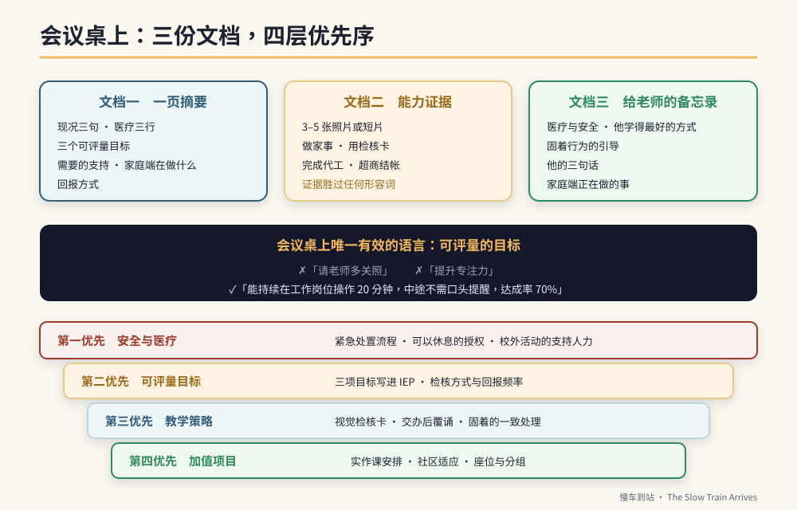

## 背景与痛点

会议室里坐着七个人：特教老师、导师、行政、辅导、治疗师、家长，有时还有校外委员。时间四十分钟，要谈的事有十件。

而家长坐在那里，带着三个劣势：

**信息劣势。** 别人讲的是安置类型、服务时数、鉴定基准、转衔通报；而你只知道你的孩子。

**时间劣势。** 你有很多话想说，但轮到你的时候只剩五分钟，而且前面已经有人讲了三十分钟的行政流程。

**情绪劣势。** 谈的是你的孩子。任何一句「他这方面比较弱」都会刺到你，而你一旦情绪上来，接下来的话就没有人听得进去。

这一章要做的，是把这三个劣势逐一补上。核心只有一句话：

> 💡 **会议桌上唯一有效的语言，是「可评量的目标」与「具体的支持需求」。**
> 「请老师多关照」不会变成任何一项服务；
> 「他需要每天一张三格视觉检核表，并在交办后由老师要求覆诵」会。

---

## 核心设计

### 一、三种会议，三种目标

| 会议 | 谁召开 | 你要拿到什么 |
|------|--------|-------------|
| **IEP 会议**（每学期） | 学校特教团队 | 写进纪录的**可评量目标** + 具体支持策略 |
| **鉴定与安置**（升学前） | 县市鉴辅会 | 适合的安置类型与**支持等级** |
| **转衔会议**（毕业前） | 学校 + 校外单位 | 衔接的**单位、时程与交接内容** |

三者的共同点：**纪录比口头承诺重要。** 会议上讲得再好，没有写进纪录的，换一个老师就消失了。

> ⚠️ **医疗免责**
> 会议中涉及诊断、用药与医疗处置的叙述，**应以医师开立的诊断证明与病历摘要为准**。家长可以引用医师的用语与书面数据，但不应自行下诊断结论、描述药物疗效或承诺医疗效果。

### 二、会议前要准备的三份文档

**文档一：一页摘要（给所有人）**

```text
【一页摘要的六个区块】

  ① 现况（三句话）
     自理：可独立完成 ___、___、___
     沟通：可理解 ___ 步骤指令；表达以 ___ 为主
     情绪：___ 情况下会生气，目前可在 ___ 提示下自我调节

  ② 医疗（三行，且以医师书面为准）
     诊断 / 目前追踪科别 / 需要学校知道的紧急处置

  ③ 这学期的三个目标（★ 可评量，见下一节）

  ④ 需要学校提供的支持（★ 具体到可以运行）

  ⑤ 家庭端正在做什么（让对方知道你不是只在要求）

  ⑥ 联系方式与回报方式（希望多久收到一次回馈、用什么形式）
```

**文档二：能力证据**（第 6 章开始累积的文件夹）

三到五张照片或短视频：他在做家事、使用检核卡、完成代工、在超商结帐。**证据在会议桌上的说服力，远超过任何形容词。**

**文档三：给老师的备忘录**（见下方完整范本）

### 三、可评量目标怎么写

这是本章最实用的技能。第 20 章的四要件（行为、数量、时间窗口、场域）直接用在这里。

| ✗ 常见写法 | ✓ 可评量写法 |
|-----------|-------------|
| 提升专注力 | 在班级实作课中，能持续在工作岗位操作 **20 分钟**，中途不需口头提醒，达成率 **70%** |
| 加强语言表达 | 能在卡住时使用「请老师教我」求助，**每周 ≥ 3 次**，无需提示 |
| 改善情绪 | 固着话题被中断时，能在 **2 分钟内**配合下一活动，**连续两周**达成率 70% |
| 培养独立性 | 依三格视觉检核表**连续完成 2 项**班务，中途无额外口头提醒，达成率 70% |
| 增进人际 | 每周 **1 次**在下课时间以固定脚本与同侪分享（「这是我最喜欢的 ___，给你看」） |

**写成这样有三个好处：** 老师知道要做什么、期末可以验收、而且它本身就是你的训练计划——**家庭与学校做的是同一件事。**

---

## 实作

### 一、给老师的亲师沟通备忘录（完整范本）

开学第一周传给老师，或在 IEP 会议上递出纸本。**方括号请自行替换。**

```text
老师您好：

我是 【孩子姓名】 的家长。非常感谢老师与学校过去的照顾，
让他学会了良好的生活自理，还能在班上当老师的小帮手、
拥有好人缘。这对我们家长来说是很大的安慰。

以下提供孩子的医疗状况、行为引导方式，以及本学期的学习期望，
供老师教学与 IEP 参考。

────────────────────────────────
一、医疗与安全（重要）

  · 诊断与用药：【依医师诊断证明填写】
    目前于 【科别】 规则追踪，状况稳定。
  · 若在校出现 【失神／异常疲倦／抽搐等，依医师说明填写】，
    请第一时间联系家长：【电话】
  · 【若有】紧急处置说明与诊断证明影本，随函附上。
  · 请避免让他过度劳累；疲倦时允许他休息。

────────────────────────────────
二、他学得最好的方式（★ 最实用的一段）

  1. 视觉优于口语
     交办任务时，请给他一张三格视觉检核卡（我们家里在用同一套），
     让他自己打勾。相较于口头交代，他的独立完成率明显较高。

  2. 交办后请他覆诵
     说完任务后加一句「你说一次」，他能覆诵关键名词就代表有记住。
     这一步能大幅降低他做到一半忘记的情况。

  3. 卡住时请等 5–10 秒
     他需要一点时间提取。若立刻再说一次，他会改成等待提醒，
     反而更慢。等一下不行的话，用手势指方向通常就够了。

  4. 一次一到两件事
     他目前稳定的是 【一／两】 步骤指令。三步骤仍在练习中。

────────────────────────────────
三、固着行为的引导（他喜欢 【火车／游乐园】）

  · 我们在家使用「聊天券」：一天 3 张，一张 5 分钟，
    交出券才能聊。若学校方便，同一套做法会更一致。
  · 非约定时间他提起时，建议温和但固定地说：
    「现在不是 ___ 时间，请把券收好。」
    （同一句话、每次一样，他比较容易接受）
  · 他碎念时，请尽量不要进入口语争辩——用手势（五指并拢向前）
    并指向检核表，通常两分钟内可以收回。
  · 他焦虑或不安时，这个主题反而是最好的安抚工具。

────────────────────────────────
四、他的三句话（请告诉同学与其他老师）

  「请老师教我，谢谢。」＝ 他卡住了
  「我太累了，我想休息一下。」＝ 请让他休息（他说了通常是真的累）
  「报告老师，我做好了，请检查。」＝ 他完成了

────────────────────────────────
五、本学期的期望（可评量的三项）

  1. 【依上一节的写法填写】
  2. 【…】
  3. 【…】

────────────────────────────────
六、家庭端正在做的事

  · 每日 【15】 分钟功能性数学（火车票价、金钱辨识）
  · 每日家事产线 【30】 分钟
  · 每周 【1】 次社区实地（车站／超商）

再次感谢老师的耐心。若有任何状况，请随时与我联系。

【家长姓名】 敬上
【联系电话】
```

### 二、提案的优先级

会议时间有限，你不可能全部要到。**先想清楚哪三项是必要的，其余列为「有的话很好」。**

```text
【第一优先：安全与医疗】（一定要争取）
  · 紧急处置流程与联系方式写进纪录
  · 疲倦时可以休息的明确授权
  · 校外教学、实作课的支持人力

【第二优先：可评量的目标】（一定要争取）
  · 三项目标写进 IEP
  · 检核方式与回报频率讲清楚

【第三优先：教学策略】（尽量争取）
  · 视觉检核卡的使用
  · 交办后覆诵
  · 固着行为的一致处理方式

【第四优先：加值项目】（有就好）
  · 特定的实作课安排
  · 额外的社区适应活动
  · 特定的座位或分组安排
```

### 三、被拒绝的时候

会遇到的。常见的三种情况与回应方式：

```text
【情况一】「我们人力不够。」
  → 不要争论人力，改问：
    「那在现有人力下，哪一项是做得到的？」
    → 把一个大要求拆成一个小要求，先拿到一项，
      并且**写进纪录**。下学期从这一项延伸。

【情况二】「其他孩子也需要，不能只针对他。」
  → 「这个方法对其他孩子可能也有用，
      需要的话我可以提供我们在家用的版本。」
    → 把「特殊待遇」转成「可共用的工具」。

【情况三】「他这方面就是比较弱，不用太勉强。」
  → 这句话最伤人，但它通常不是恶意，是经验判断。
    回应方式：拿出证据。
    「他在家里的纪录是这样（拿出照片／纪录），
      所以我想试试看在学校能不能也做到。
      如果一个学期后没有进展，我们再调整目标。」
    → 用「试一个学期」降低对方的承诺成本。

★ 通用原则：不要在会议上赢。
  你要的是往后几年的合作，不是这四十分钟的胜负。
```

### 四、四年的关键时程

```text
【国三上】
  □ IEP 会议：提出高职安置方向，并列入纪录
  □ 留意各县市的适性辅导安置简章时程
  □ 配合完成能力评估与仿真施测

【国三下】
  □ 参与安置报名与分发
  □ 寒暑假回诊，取得最新诊断证明备用

【高职一、二】
  □ 支持他参与各项实作课；观察哪一类动手能力最好
  □ 每年参访 1 家机构
  □ 持续累积能力证据

【高职三】
  □ 职业重建相关评估与媒合流程
  □ 主动表达毕业后希望衔接的方向
  □ 提早参观并登记候补
  □ 毕业前的转衔会议与交接手册（第 18 章）
```

---

## 现场踩雷

**踩雷一：带着情绪去开会。**
会议前十分钟，把要说的三件事写在纸上。**照着念，比临场发挥安全。**

**踩雷二：只讲困难，不讲他会什么。**
只讲困难的家长，会让孩子被安置到支持等级过高的组别。**优势与需求要一起讲。**

**踩雷三：要求太多。**
一次要十项，通常一项都拿不到。**三项，写进纪录。**

**踩雷四：口头承诺就满意。**
「我们会多注意他」——换一个老师就没了。**写进会议纪录。**

**踩雷五：把老师当对手。**
绝大多数特教老师是这条路上最理解你的人。**他们的限制通常是资源，不是意愿。**

**踩雷六：数据太厚。**
三十页的数据没有人看。**一页摘要 + 三张照片 + 一份备忘录，就够了。**

---

## 效益与验收（DoD）

| 项目 | 标准 |
|------|------|
| 一页摘要 | 已完成六区块，并在最近一次会议实际使用 |
| 可评量目标 | 三项目标皆含行为、数量、时间窗口、场域 |
| 已入纪录 | 至少 2 项目标与 1 项支持策略写进 IEP 或会议纪录 |
| 备忘录 | 已交给导师与特教老师，并口头说明过一次 |
| 能力证据 | 文件夹中有 ≥ 10 张照片／短片，涵盖 ≥ 3 种能力 |
| 回报机制 | 已约定回报频率与形式（联系簿、LINE、每月一次…） |
| 时程掌握 | 知道下一个关键时间点是什么、什么时候 |

> 💡 君之一席话
> 「你在那张桌子上唯一的优势，是**你比任何人都了解他**。但了解不会自动变成资源——**它要先被翻译成一句可以验收的话，才会变成写在纪录上的一行字。**」

---


# 第六篇　专业补强：特教现场的六件事

# 第35章　行为的功能：先问为什么，再谈怎么办


## 背景与痛点

前面三十四章给了一整箱工具：视觉计时器、代币制、手势制止、检核卡、提示褪除。

现在要说一件可能会让你有点不舒服的事：**那些工具，如果用在错的行为功能上，会全部无效——而且有些会让事情变得更糟。**

举一个真实会发生的情况。

一个孩子在实作课中反复离开座位。老师用了代币制：坐满十分钟给一张贴纸。两周后，离座次数不减反增。

老师的结论通常是「代币制对他没用」。但真正的原因可能是：**他离座的目的，本来就不是为了得到东西——他是为了离开那个太吵的教室。** 对一个想逃走的人，你给他贴纸，他当然不理你；而每一次他离座、老师走过来劝他，他都成功地离开了工作几分钟——**你其实在增强他离座。**

这一章要补的，是这本书前面缺的最重要的一块：**在选工具之前，先判断这个行为在替他做什么。**

在特教与行为介入领域，这件事叫**功能性行为评估**（Functional Behavior Assessment, FBA）。它不是新潮的技术，它是这个领域的地基——而台湾的特殊教育法规在处理情绪行为问题时，也要求以行为功能为基础拟定介入方案。

---

## 核心设计

### 一、所有行为都有功能，而功能只有四种

行为不是随机的。一个持续发生的行为，一定在为他取得某样东西。行为科学把它归为四类：

| 功能 | 他在取得什么 | 现场长什么样 | 常见误判 |
|------|-------------|-------------|---------|
| **① 获得注意** | 别人的反应（正向或负向都算） | 大人一忙就开始闹；被骂之后反而更频繁 | 「他就是欠骂」 |
| **② 逃避／回避** | 离开一个要求、任务或情境 | 一交办就开始讲火车、跑走、抱怨不舒服 | 「他懒」「他挑食」 |
| **③ 获得实体物或活动** | 一样东西、一个活动 | 想要就一直吵，给了就停 | 「他被宠坏了」 |
| **④ 感官／自动增强** | 身体本身的感觉回馈 | 没有人在旁边也会做；做了本身就舒服 | 「他故意的」 |

**这四种功能的处置方式完全不同。** 更麻烦的是：**同一个外观的行为，功能可能不一样**；而**同一个行为，也可能有多重功能**（在家里是为了逃避、在学校是为了注意）。

### 二、关键的一句话：功能不是动机，是后果

家长最常问的是「他为什么要这样？」，然后给出一个心理层面的答案：他想引起注意、他在报复、他觉得无聊。

但功能性评估问的不是**他心里想什么**——那个谁都无法确定。它问的是：

> **这个行为发生之后，环境给了他什么？**

而环境给的那个东西，就是让这个行为持续下去的原因。这不需要读心术，**只需要记录**。

### 三、ABC 三联式

记录的方式是三栏。这是特教现场最基本、也最有用的一张表。

```text
  A（Antecedent 前事）  →  B（Behavior 行为）  →  C（Consequence 后果）
  行为之前发生了什么        他实际做了什么          之后环境怎么回应
```

三栏里，**大人最容易记错的是 A，最容易漏掉的是 C**。

- **A 常常被写成「没有原因，突然就」**——那通常代表观察者没看到，而不是真的没有前事。要写的是：当下在做什么、谁在场、刚刚被要求了什么、环境有什么变化。
- **C 常常被写成「我骂他」**——但关键不是你做了什么，是**他因此得到了什么**。你骂他 → 他得到了你的注意；你说「好吧那先不要做」→ 他成功逃避了任务。

### 四、依功能选策略

这是这一章最实用的一张表。前面各章的工具，在这里各就各位：

| 功能 | 该做的 | **不该做的**（会让行为恶化） | 本书对应章 |
|------|--------|---------------------------|-----------|
| **① 注意** | 行为发生时给予最少反应；在他**没有**出现该行为时主动给注意；教他用适当方式要求注意 | 大声斥责、长篇说理（那全都是注意） | 8、37 |
| **② 逃避** | 降低任务难度、拆步骤、给选择权、教他用语言要求休息；**任务仍要完成**（哪怕只完成一步） | 「好啦你不要做了」——那是在教他闹就能逃 | 16、36 |
| **③ 实体物** | 明确的规则与时间框、代币制、教他用适当方式要求 | 吵到你受不了才给——那是在教他吵久一点 | 10、37 |
| **④ 感官** | 提供功能等值的替代感官输入、调整环境、安排规律的感官活动时段 | 代币、处罚、说理——**这些对感官功能几乎完全无效** | 11、38 |

> 🔍 **为什么第 ④ 种特别重要**
> 感官／自动增强的行为，**增强来自他的身体本身，不来自环境**。你能控制的所有后果（给贴纸、不给贴纸、骂他、不理他），对这种行为都构不成影响。
> 这是「所有方法都试过，就是没用」最常见的一个原因。而正确的处理不是加强介入，是**换一个方向**：这个感觉他需要，那我们找一个可以接受的方式让他得到。

### 五、功能等值沟通训练（FCT）

这是行为介入里效果最稳、也最人道的一项技术，而它的逻辑只有一句话：

> **问题行为是一种沟通。要让它消失，就给他一个更省力、且同样有效的说法。**

「更省力」与「同样有效」两个条件缺一不可：

- 如果新的说法比较费力（要说一整句话 vs 只要尖叫一声），他会继续用旧的；
- 如果新的说法没有效（他说「我想休息」你说「再做十个」），他会回去用旧的，而且更强烈。

**这正是第 8、16 章那三句台词的专业名称。** 而现在你知道它们为什么有效、以及在什么条件下会失效。

| 问题行为 | 功能 | 功能等值的替代 |
|---------|------|--------------|
| 交办时开始碎念、拖延 | 逃避 | 「我需要帮忙／太难了」 |
| 做到一半离座 | 逃避（疲劳） | 「我太累了，我想休息一下」 |
| 一直重复问同一件事 | 注意 | 教他一个要求注意的方式（拍拍手臂＋「妈妈，你看」） |
| 拿不到东西就大声 | 实体物 | 「我要 ___，请给我」＋ 明确的规则（现在／等一下） |

---

## 实作

### 一、ABC 记录表

连续记录两周。**只记那一个你最想处理的行为**，不要一次记三种。

```text
【ABC 记录　行为定义：__________________________】
（行为定义要具体到「两个人分别记录会记成同一件事」，
  例如：✗「情绪不好」　✓「音量提高、重复同一句话三次以上」）

日期 时间  A 前事              B 行为          C 后果            持续
──────────────────────────────────────────────────────────────
3/02 16:20 刚被要求收玩具      重复说火车 6 次  我说「等一下再   4 分
                              音量提高          聊」，然后帮他
                                                收了玩具
3/03 10:05 实作课，隔壁组很吵   离座走到窗边    老师走过去带回   6 分
                                                座位，聊了两句
3/03 19:40 没有人跟他说话      重复说火车      我回应了三次     8 分
           （我在讲电话）
```

**记满两周之后，把 C 栏从头读一遍。** 你会看到一个重复出现的模式——那就是功能。

上面这三笔的模式很清楚：**第一笔是逃避（成功免除收玩具）、第二笔是逃避＋注意、第三笔是注意。**

### 二、写出功能假设

用这个句型，写成一句话：

```text
【功能假设句型】
  当 ______（前事）发生时，
  他会 ______（行为），
  以获得／逃避 ______（功能），
  因此这个行为持续发生。

【范例】
  当「被要求结束喜欢的活动」时，
  他会「重复同一句话并提高音量」，
  以「逃避活动结束、并延长活动时间」，
  因此这个行为持续发生。
```

写成这样有三个好处：它可以被验证（下一节）、它可以直接写进 IEP 的行为介入方案、而且它**把责任从孩子身上移到情境上**——「他故意的」变成「这个情境在教他这样做」。

### 三、验证假设（不要跳过这一步）

假设就是假设。验证的方法不是做实验，是**改一件事，看行为变不变**：

```text
【验证方式：改前事，看行为】
  假设是「逃避活动结束」→ 那就在结束前加一次预告（第 8 章），
  观察两周。行为明显减少 = 假设大致成立。

  假设是「获得注意」→ 那就在他「没有」出现该行为的时段，
  每 10 分钟主动去给他 30 秒的注意，观察两周。

  假设是「感官」→ 那就在同一时段提供替代的感官活动，
  观察行为有没有转移。

★ 如果改了两周完全没动，那是信息：功能假设可能猜错了，
  回到 ABC 记录重看一次。
```

### 四、把它接回前面的章节

现在回头看第二、三篇，会看到不同的东西：

| 前面的做法 | 它其实在处理什么功能 | 什么情况下它会无效 |
|-----------|-------------------|-----------------|
| 视觉计时器 + 手势（第 8 章） | 逃避（逃避「活动结束」）＋ 注意 | 若功能是感官，计时器无效 |
| 对话代币制（第 10 章） | 实体物／活动 | 若功能是逃避任务，代币无效 |
| 求助台词（第 8、16 章） | **FCT** — 给逃避一个合法出口 | 若说了没被回应，立刻失效 |
| 抗干扰训练（第 16 章） | 创建对「不舒服刺激」的耐受 | 若他的离座是感官需求，这会变成折磨 |
| 三格检核卡（第 13 章） | 降低任务的认知负荷 → 减少逃避动机 | 若任务本身太难，卡片救不了 |

> 💡 **这张表的意思**
> 这本书前面的策略没有错，但它们缺省了一组功能：**逃避与获得**。
> 那组缺省对多数「固着被打断就生气」的情境成立——但不是全部。
> 而当它不成立时，你需要的不是更用力，是**先做两周的 ABC 记录**。

---

## 现场踩雷

**踩雷一：跳过 A，只记 B。**
「他今天又闹了三次」——这种纪录无法产生任何结论。**没有前事与后果，行为就只是一个孤立的事件。**

**踩雷二：把功能写成心理动机。**
「他是想报复我」「他觉得我偏心弟弟」——这些无法验证，也无法转成行动。**功能要写成「他得到了什么」。**

**踩雷三：C 栏写大人做了什么，而不是他得到了什么。**
「我骂了他」→ 应该写成「他得到了 3 分钟的一对一注意」。这两句是同一件事，但只有后者能让你看懂发生了什么。

**踩雷四：一次记三个行为。**
记不完，而且会互相混淆。**一次一个，两周。**

**踩雷五：行为定义不具体。**
「情绪失控」——妈妈记的和老师记的不是同一件事，数据就废了。定义要能通过「两个人分别记，会记成同一件事」的测试（第 1 章的老原则）。

**踩雷六：功能是感官，却一直加码代币与处罚。**
这是最容易造成伤害的一种踩雷。**「所有方法都试过就是没用」，通常意味着功能猜错了，而不是他无药可救。**

**踩雷七：找到功能就以为问题解决了。**
功能评估只是第一步。它告诉你**该往哪个方向使力**，接下来才是第 36、37 章的技术。

---

## 效益与验收（DoD）

| 项目 | 验收标准 |
|------|---------|
| 行为定义 | 目标行为有具体定义，且两位记录者抽查 3 笔判定一致 |
| ABC 记录 | 连续 14 天、至少 10 笔完整的 A／B／C 三栏纪录 |
| 功能假设 | 已用句型写成一句话，并记录在案 |
| 假设已验证 | 依假设改变一项前事或后果，观察满两周并记录结果 |
| 策略对齐 | 目前使用的介入策略，与判定的功能对得上（用上方对照表检查） |
| 已纳入 FCT | 针对该功能，教了一个更省力且同样有效的替代说法 |
| 替代说法有效 | 他使用替代说法时，**每一次**都得到了预期的结果 |

最后一项是全章最重要的一条。**FCT 没有「这次先不要」的空间**——一次跳票，整套就失效。

> 💡 君之一席话
> 「『我什么方法都试过了』这句话，通常不代表方法用完了，**而是代表方向从一开始就选错了**。花两周记三栏字，比再试十种方法有用得多。」

---


# 第36章　工作分析与连锁：把一件事拆到他做得到

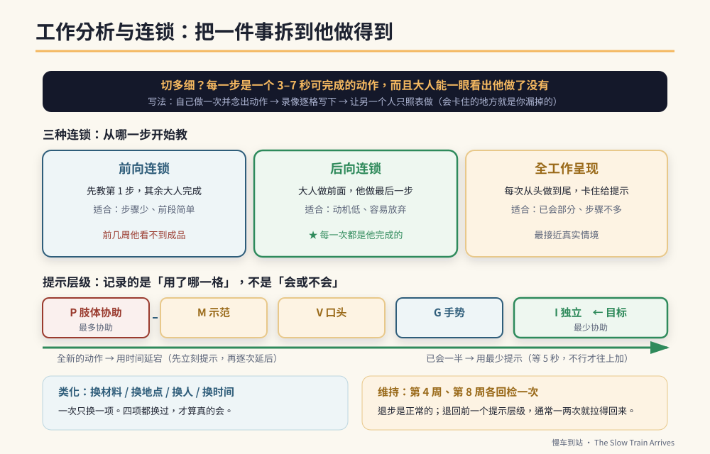

## 背景与痛点

「他学不会折衣服。」

这句话在特教现场出现时，有九成的情况真正的意思是：**「折衣服」对他来说不是一件事，是十一件事，而我们一直把它当成一件事在教。**

这一章补的是本书前面最大的技术缺口。第 9 章的十六级阶梯处理的是「一次记得住几件事」（工作记忆）；但一个**多步骤技能**（折衣服、洗碗、包装代工、方便面、刷牙）要怎么教，前面没有讲。

而那正是特教与职能训练最核心的方法：**工作分析**（Task Analysis, TA）与**连锁**（Chaining）。

小作所与庇护工场的每一份 SOP 图卡，背后都是一份工作分析。你在第 13 章做的三格检核卡，是它的简化版。这一章给的是完整版。

---

## 核心设计

### 一、工作分析：把技能切成他做得到的步骤

工作分析就是把一个技能，拆成一连串**可观察、可独立完成、顺序固定**的小步骤。

**切多细？** 有一个实用的判准：

> **每一步应该是一个 3–7 秒可以完成的动作，而且大人能一眼看出他做了没有。**

太粗（「把衣服折好」）→ 他卡住时你不知道卡在哪。
太细（「右手拇指移动两公分」）→ 步骤表变成三十行，没有人用得起来。

**怎么写？** 不要凭空想，用这三步：

```text
【写一份工作分析的三个步骤】
  ① 自己做一次，一边做一边念出每个动作
  ② 用手机录像，回放时暂停，逐格写下来
  ③ 让另一个人「只照着你的表做」，看他会不会卡住
     → 会卡住的地方，就是你漏掉的步骤

★ 第 ③ 步最容易被跳过，也最有价值。
  你以为的「理所当然」，对他从来不是理所当然。
```

### 二、三种连锁：从哪一步开始教

有了步骤表之后，教学有三种顺序，各有适用时机。

| 方式 | 怎么做 | 适合什么情况 | 心理效果 |
|------|--------|-------------|---------|
| **前向连锁**（Forward） | 先教第 1 步，做完由大人完成其余；第 1 步稳了再加第 2 步 | 步骤少、前面的步骤比较简单 | 一开始就有参与感 |
| **后向连锁**（Backward） | 大人做完前面全部，**只让他做最后一步**；稳了再往前加一步 | 学习动机低、容易半途放弃、需要成就感 | **每一次都是他完成的** |
| **全工作呈现**（Total Task） | 每次都从头做到尾，卡住的步骤给提示 | 已有部分步骤会做、步骤不多 | 最接近真实情境 |

> 🔍 **后向连锁为什么常常是最好的选择**
> 因为它让「完成」这件事，永远挂在他手上。
> 一个孩子折衣服，前面十步是妈妈折的，最后那一下由他压平——衣服折好了，是他折的。他看到了成品，得到了完成的感觉。
> 反过来，前向连锁的前几周，他做完第一步之后就被接手，**他从来没看过成品**。
> 对于学习挫折累积很多、或动机偏低的孩子，**后向连锁经常是唯一推得动的方式。**

### 三、最少提示法与时间延宕

第 9 章讲过提示层级（肢体 → 示范 → 口头 → 手势 → 视觉 → 无提示）。在工作分析里，它有两种标准用法：

**（一）最少提示法（Least-to-Most）**

```text
每一步，都从最少的提示开始，不行才往上加：
  等 5 秒 → 没动作 → 手势提示 → 等 5 秒 → 没动作 → 口头提示
  → 等 5 秒 → 没动作 → 示范 → 没动作 → 肢体协助

★ 适合：已经会一部分、需要练独立的技能
★ 缺点：中间会出现较多错误与等待
```

**（二）时间延宕法（Time Delay）**

```text
一开始每一步都立刻给提示（0 秒延宕），做对就增强；
熟悉之后，把提示往后延：
  第 1–3 次：立刻提示
  第 4–6 次：等 2 秒再提示
  第 7–9 次：等 4 秒再提示
  之后：等 5 秒

★ 适合：全新的技能、容易因为错误而挫折的孩子
★ 优点：错误少、学习曲线平顺
★ 这是教「动作型技能」最常用的一种方式
```

**选哪一种？** 一个实用的原则：**全新的动作用时间延宕，已经会一半的用最少提示。**

### 四、数据怎么记

工作分析的数据记录，记的不是「会／不会」，而是**每一步用到的提示层级**。

```text
【工作分析数据表　技能：折毛巾】
步骤                          3/02  3/03  3/04  3/05  3/06
1 拿起毛巾放在桌上             I     I     I     I     I
2 摊平（四角展开）             G     G     I     I     I
3 左边对齐右边                 V     G     G     G     I
4 压平中线                     M     V     G     G     G
5 下缘对齐上缘                 P     M     V     V     G
6 压平                         P     P     M     V     V
7 放进篮子                     I     I     I     I     I
独立完成步数                   2     2     3     3     4

代号：I 独立　G 手势　V 口头　M 示范　P 肢体协助
```

**这张表的价值：** 你会看到「进步」长什么样子——**不是从不会变成会，而是提示从 P 一格一格降到 I**。这种进步在「会／不会」的记录方式下是完全看不见的，而看不见的进步，家长撑不了三个月。

### 五、类化与维持：别让它只在那条毛巾上成立

一个技能练到独立之后，还有两件事没完成。这是特教实务里最常被忽略、却决定成败的一段。

```text
【类化（Generalization）：换了条件还会吗】
  换材料：换一条不同大小、材质、颜色的毛巾
  换地点：从餐桌换到洗衣间、换到学校
  换人：从妈妈在旁换成爸爸、换成老师
  换时间：从晚上七点换成早上
  ★ 一次只换一项。四项都换过，才算真的会。

【维持（Maintenance）：两个月后还会吗】
  技能达到独立之后，不要立刻停止。
  改成每周检查一次，连续四周；再改成每月一次。
  ★ 退步是正常的。发现退步就回到前一个提示层级，
    通常一两次就能拉回来。
```

> 💡 **一个很值得知道的策略：多重范例训练**
> 不要等到练到完美才开始类化。**从第一天就用两三种不同的毛巾、在两个不同的地方教**——这叫多重范例训练，它能大幅提高类化的成功率。
> 代价是初期学得比较慢；回报是他学会的是「折毛巾」，而不是「折那条蓝色的毛巾」。

---

## 实作：四份现成的工作分析

拿去直接用，或当成你自己写的范本。

### TA-1　折毛巾（家事／代工基础）

```text
1 拿起毛巾放在桌上
2 摊平，四角展开
3 左边对齐右边
4 压平中线
5 下缘对齐上缘
6 压平
7 放进篮子（同一方向）
建议：后向连锁（从第 7 步开始）
```

### TA-2　装袋代工（小作所最常见的作业）

```text
1 从左边料盒拿一个袋子
2 袋口撑开
3 从右边料盒拿 __ 个对象（数量固定）
4 放进袋子
5 压出空气
6 对折袋口
7 粘贴封口贴纸（对齐边缘）
8 放进成品篮（同一方向排列）
9 每完成 10 个，按一下计数器
建议：全工作呈现 + 时间延宕；第 3 步的数量从 1 个起步
对接：第 16 章的产量与良率、第 31 章的撕贴动作
```

### TA-3　洗自己的碗

```text
1 把碗端到水槽
2 倒掉剩菜
3 开水（先冷后温）
4 挤洗碗精在菜瓜布上（压 1 下）
5 内侧刷一圈
6 外侧刷一圈
7 冲水，直到不滑
8 放进沥水架（开口朝下）
9 关水
10 擦手
建议：后向连锁；第 3、9 步（开关水）优先教，因为它涉及安全
```

### TA-4　自己泡一杯饮品（生活自理 + 安全）

```text
1 拿出杯子
2 拿出茶包／冲泡包
3 撕开包装，倒进杯子
4 拿保温壶（★ 热水安全：先确认壶盖锁好）
5 倒水到杯身的线（杯子上贴一条胶带当水位线）
6 放回保温壶
7 搅拌 5 圈
8 等计时器响（3 分钟）才拿起来喝
9 用完把杯子放到水槽
建议：前向连锁；第 4–5 步务必先在冷水下练熟再换热水
★ 第 5 步的「胶带水位线」是这份 TA 的关键：
  把一个抽象判断（倒多少）换成一个视觉标记。
```

**注意第 8 步。** 它把第 26 章的等待耐受（M10）内置进了一个真实技能里——**这才是这些工具最好的用法：不是额外的练习，是嵌在生活里。**

---

## 现场踩雷

**踩雷一：步骤太大。**
「洗碗」写成三步（拿碗、洗、放好），他每次都卡在同一个地方，而你不知道是哪一个地方。

**踩雷二：每次的提示层级不一致。**
今天妈妈用手把手，明天爸爸只用口头——数据就废了，孩子也会混乱。**两个人要先对好用哪一套（最少提示 or 时间延宕）。**

**踩雷三：只记「会／不会」。**
这样记，前三个月的纪录全部是「不会」，然后你会放弃。**记提示层级，你才看得到进步。**

**踩雷四：练到独立就结束。**
没有类化 = 只会在那条毛巾上；没有维持 = 两个月后归零。

**踩雷五：全部用前向连锁。**
对动机低、容易放弃的孩子，前向连锁的前几周是纯粹的挫折累积。**后向连锁经常是那个「终于推得动」的差别。**

**踩雷六：选了一个他其实不需要的技能。**
教一个技能之前先问：**这件事对他二十五岁的生活有没有用？** 若没有，那个时间应该花在别的地方（第 6 章的功能性认知）。

**踩雷七：安全步骤混在一般步骤里教。**
热水、刀具、电器、瓦斯——这些步骤要**单独先教到稳**，再放回完整流程。安全步骤不适用「允许错误学习」。

---

## 效益与验收（DoD）

| 项目 | 验收标准 |
|------|---------|
| 有 TA | 目标技能已写成工作分析，每步 3–7 秒且可观察 |
| 通过旁人测试 | 另一个人只照表做，能完成且不卡住 |
| 连锁方式已选 | 明确选定前向／后向／全工作，并写下理由 |
| 提示法一致 | 两位教学者使用同一套提示法，抽查 3 次一致 |
| 数据可读 | 记录的是每步的提示层级，且能看出提示逐步下降 |
| 独立步数上升 | 四周内独立完成步数增加 ≥ 2 步（或已全部独立） |
| 已类化 | 材料、地点、人、时间至少各换过一项并仍成立 |
| 已维持 | 达独立后，第 4 周与第 8 周各检查一次仍成立 |
| 安全步骤 | 涉及热水／刀具／电器的步骤已单独教到稳定 |

> 💡 君之一席话
> 「『他学不会』这句话，十次有九次的意思是『我没有把它切开』。**一件他做不到的事，拆成七件他做得到的事——这不是降低标准，这就是教学本身。**」

---


# 第37章　增强的技术：代币制之外，你需要知道的

## 背景与痛点

「我给了奖励，他还是不做。」

这句话背后，通常是下面五个问题之一。而每一个都有解法，只是家长很少被告知：

1. **那个奖励他其实没那么想要**（没做过偏好评估）；
2. **奖励给得太晚**（做完到拿到之间隔了太久）；
3. **他已经吃腻了**（饱足效应）；
4. **他不用做也拿得到**（增强物没有被管制）；
5. **不做那件事的好处，比奖励大**（逃避的价值高于奖励）。

第 10 章讲了对话代币制，第 35 章讲了行为功能。这一章补中间那一块：**增强到底怎么运作，以及怎么设计才不会失效。**

---

## 核心设计

### 一、增强的定义：看结果，不看意图

先把最容易误解的一件事讲清楚：

> **一样东西是不是「增强物」，不是由你决定的，是由行为的变化决定的。**
> 给了之后，那个行为**变多了**，它才是增强物。给了之后行为没变，它就只是一样东西。

这个定义有一个残酷的推论：**你可能一直在增强你不想要的行为，而不自知。**

```text
他闹 → 你走过去说「怎么了？不要这样」→ 他得到 3 分钟的注意
      → 隔天他闹得更频繁
  = 你的「劝阻」是增强物。

他抗拒 → 你说「好啦今天先不要做」→ 他成功免除任务
      → 隔天抗拒得更早、更强
  = 「取消任务」是增强物。
```

第 35 章的 ABC 记录，就是用来看见这件事的。

### 二、偏好评估：先弄清楚他真正想要什么

大人挑的奖励，命中率通常不高。有三种由简到严的方法：

```text
【方法一　询问法】（最快，最不准）
  直接问他、问老师、问其他家人。
  ★ 对语言表达受限的孩子，准确度有限。

【方法二　单一刺激呈现】（适合选项少、难以比较的孩子）
  一次拿出一样东西，记录他：
    · 有没有伸手拿？（几秒内）
    · 拿了之后玩多久？
  ★ 每样做 3 次，取平均。

【方法三　配对选择】（最准，也最有用）
  一次拿出两样，让他选一样。
  把 6–8 样东西两两配对，每一对测 2 次，统计各项被选中的次数。
  → 得到一份排序：他最想要的是什么、第二想要的是什么。

★ 偏好会变。每 2–3 个月重做一次，或当你发现「最近好像没效了」时。
```

**清单里一定要放进「非物品」的选项**：一段和爸爸单独相处的时间、帮老师做一件特别的事、播他喜欢的音乐、看一段视频、讲三分钟火车。

> 💡 **一个常被忽略的事实**
> 对「小帮手型」的孩子，**「被交付一个重要任务」本身，往往比任何实体物都更有效**。第 31 章的「利他角色」母模式，本质上就是把社会角色当成增强物在用——而且它不会饱足、不用花钱、也不需要褪除。

### 三、增强时制：从每次都给，到偶尔才给

一开始要**每次都给**（连续增强），因为要让他学会「做这件事会有结果」。但如果一直维持连续增强，会出现两个问题：饱足，以及「没给就不做」。

所以要转成间歇增强——而转换要慢：

```text
【时制转换阶梯】
  阶段 1　连续增强（每 1 次都给）        ← 创建阶段
  阶段 2　固定比率 2（每 2 次给 1 次）
  阶段 3　固定比率 5
  阶段 4　变动比率 5（平均 5 次，有时 3 次有时 7 次）★ 最耐久
  阶段 5　自然增强（做完事情本身的结果就是回馈）

★ 每一阶至少维持 2 周再往下走。
★ 退步时往回退一阶，不是加码。
```

**为什么「变动比率」最耐久？** 因为他无法预测下一次会不会有——所以他会持续做下去。这也是为什么吃角子老虎会让人上瘾：**变动比率是所有时制里最抗消退的一种。**

### 四、饱足与剥夺

```text
【饱足（Satiation）】
  一样东西给太多，就失去效力。
  · 贴纸每天给 20 张 → 贴纸变成废纸
  · 每天都看火车视频 → 「看视频」不再是奖励

  对策：① 轮替增强物（三种轮流用）
        ② 控制取得管道（只在该情境给）
        ③ 缩小单位（给 1 张，不是 5 张）

【剥夺（Deprivation）】
  一样东西平常拿不到，它的价值就高。
  ★ 这里有一条伦理界线：
    可以管制的是「额外的、非必要的」东西（特定玩具、特定视频）；
    **不可以**拿食物、喝水、上厕所、基本活动当筹码。
    那不是行为介入，那是剥夺基本需求。
```

### 五、普里马克原则：用他爱做的事，带他不爱做的事

```text
「先做 A（低频／不爱做），才能做 B（高频／爱做）」

  · 先收玩具，才能聊火车
  · 先折完这叠衣服，才去车站
  · 先做完三格检核卡，才有下课时间

★ 顺序不能反。先给了 B，A 就永远不会发生。
★ 这也是第 10 章「酬赏式」的正当用法——
  它适合用在「本来就必须做的例行事务」，
  而不适合用在「你希望他喜欢的学习活动」。
```

### 六、代币经济的完整设计

第 10 章的聊天券是代币经济的一个特例。完整版有六个要素，缺一个就会垮：

```text
① 代币是什么          贴纸、章、点数卡、计数器上的数字
② 用什么行为换代币    ★ 必须具体、可观察、他做得到
③ 换取比率            几个代币换一次兑换？（起步要低！）
④ 兑换清单            至少 3 种选项，价格不同
⑤ 兑换时机            固定（每天放学后、每周五）
⑥ 通膨控制            不可额外赠送、不可预支、不可讨价还价

【起步的关键：比率要低到他第一天就能成功】
  ✗ 集满 20 个换一次 → 他第三天就放弃了
  ✓ 集满 3 个换一次 → 成功经验先创建，之后再慢慢加到 5、8、10

【兑换清单范例】
   3 点 → 听一首他喜欢的歌
   5 点 → 15 分钟火车时间
  10 点 → 周末去车站一次
  20 点 → 买一个小纪念品
  ★ 清单要有「便宜的」选项，否则等于没有代币制。
```

### 七、褪除：让它最后不需要你

所有外部增强最终都要往「自然增强」走，否则他离开你就不会做。

```text
【褪除的四个方向，一次动一个】
  ① 时制：连续 → 间歇 →  变动比率
  ② 大小：实体物 → 代币 → 口头肯定
  ③ 给予者：妈妈 → 老师 → 同事 → 自己（自我增强）
  ④ 种类：外加的东西 → 事情本身的结果
       （衣服真的折好了、桌子真的干净了、薪水真的入帐了）

★ 第 ④ 个方向是终点。工作本身的成果，
  是他成年后唯一稳定存在的增强物。
```

---

## 实作

### 一、偏好评估记录表

```text
【配对选择评估　日期：______】
候选项目：A 火车视频　B 贴纸　C 音乐　D 帮老师发簿子
         E 小点心　F 和爸爸散步

配对         选了      配对         选了
A vs B  ____________   B vs D  ____________
A vs C  ____________   B vs E  ____________
A vs D  ____________   B vs F  ____________
A vs E  ____________   C vs D  ____________
A vs F  ____________   C vs E  ____________
B vs C  ____________   ……（全部两两配对）

被选次数统计：A __　B __　C __　D __　E __　F __
→ 前三名（本季主要增强物）：______、______、______
→ 下次重评日期：______（建议 2–3 个月）
```

### 二、把增强接回前面的章节

| 前面的做法 | 增强的角色 | 这一章补了什么 |
|-----------|-----------|--------------|
| 聊天券（第 10 章） | 代币经济的特例 | 换取比率、通膨控制、兑换清单 |
| 计数器（第 16 章） | 代币 + 自我记录 | 时制转换：从每 10 个 → 变动比率 |
| 职务／角色（第 31 章） | **社会性增强** | 它不会饱足，是最好的长期增强物 |
| 具体称赞（全书） | 社会性增强 | 要具体（「你自己停下来了」）＞ 笼统（「好棒」） |
| 求助台词（第 8、16 章） | **FCT 的增强** | 说了要有效——那就是它的增强物，跳票即失效 |

### 三、称赞怎么给才有用

```text
✗ 「好棒！」「好乖！」
   → 没有信息，他不知道你在赞什么；用久了会钝化。

✓ 「你自己停下来了。」
✓ 「三个都打勾了，你自己做完的。」
✓ 「有火车声音你也没有停下来，很棒。」
   → 具体描述他做了什么 = 同时是增强，也是教学。

★ 给的时机：越快越好。3 秒内 > 3 分钟后 > 晚上再说（几乎无效）。
```

---

## 现场踩雷

**踩雷一：用食物当主力增强物。**
方便、有效，但有三个问题：容易饱足、影响体重（部分用药本就伴随食欲增加，见第 11 章）、以及难以在职场褪除。**可以用，但不要当主力。**

**踩雷二：拿基本需求当筹码。**
食物、水、如厕、休息不是增强物，是权利。**这条界线不能跨。**

**踩雷三：换取比率一开始就订太高。**
「集满 20 个」的代币制，多数孩子在第三天就放弃了。

**踩雷四：讨价还价。**
「差一点点啦，算你有」——一次通融，整套规则的可信度就垮了。**与第 8 章「说了要算数」是同一条原则。**

**踩雷五：无意中增强了问题行为。**
最常见的形式：孩子闹 → 大人靠近、讲道理、给关注。**如果功能是注意，那就是增强。**（第 35 章）

**踩雷六：只有外部增强，没有规划褪除。**
结果是他在你面前做得很好，在机构完全不做。**从第一天就要想「这个最后怎么收掉」。**

**踩雷七：两位大人的增强标准不同。**
爸爸给得松、妈妈给得严 → 他学会选人要奖励。**规则写下来，贴冰箱。**

---

## 效益与验收（DoD）

| 项目 | 验收标准 |
|------|---------|
| 偏好评估 | 完成一次配对选择评估，得到前三名增强物 |
| 非物品选项 | 增强物清单中至少有 2 项是活动或社会性增强 |
| 代币六要素 | 代币、目标行为、换取比率、兑换清单、兑换时机、通膨规则全部成文 |
| 起步比率 | 换取比率低到他**第一天就能成功兑换一次** |
| 时制有规划 | 写下从连续 → 间歇 → 变动比率的转换时程 |
| 称赞具体 | 抽查 5 次称赞，≥ 4 次是具体描述而非「好棒」 |
| 未跨界线 | 没有把食物、水、如厕、休息当成筹码 |
| 已规划褪除 | 对每一项增强，写下「最后要怎么收掉」 |

> 💡 君之一席话
> 「你以为增强物是你给的东西，其实增强物是**行为变多的那个原因**。所以最该问的问题不是『我该给他什么奖励』，而是——**他现在做的那些让你头痛的事，是谁在增强？**」

---


# 第38章　青春期与身体界线：最该教、也最常被回避的一课

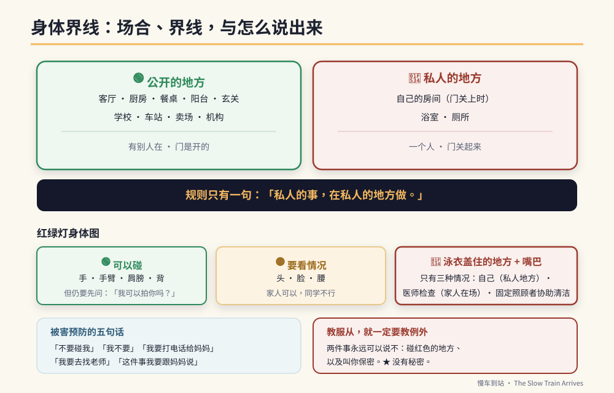

## 背景与痛点

这一章在特教现场有一个共同的处境：**每个人都知道要教，每个人都希望是别人来教。**

家长觉得学校应该教，学校觉得那是家庭的事，治疗师说这超出我的范围。而在所有人互相等待的期间，事情已经在发生了——只是没有人谈。

必须先说清楚三件事，否则这一章读不下去。

**第一，青春期的身体发展不会因为认知落后而延后。** 他的荷尔蒙、体型、性冲动，都会按照生理时钟走。认知落后影响的是**理解与判断**，不是发育。

**第二，回避不教的代价，全部由孩子承担。** 没有教过场合概念的孩子，会在客厅、在教室、在公车上做出私人的行为——然后被当成问题行为处理、被通报、被粘贴标签。**他不是不懂规矩，是从来没有人告诉他规矩是什么。**

**第三，这个族群是性侵害的高风险群。** 原因很具体：沟通表达受限（说不出发生了什么）、社会判断力弱（分不出善意与恶意）、被训练成听话（习惯服从指令）、以及照顾者众多（生活中有大量的身体接触是被允许的）。**一个从来没学过「哪些触碰不可以」的孩子，没有任何防线。**

这一章不谈道德，只谈三件事：**场合、界线、与怎么说出来。**

---

## 核心设计：三个层次

| 层次 | 教什么 | 核心问句 |
|------|--------|---------|
| **① 我的身体** | 身体是我的；哪些部位是私人的；私人的事在私人的地方做 | 「这件事可以在哪里做？」 |
| **② 别人的身体** | 别人的身体不是我的；碰之前要问；被拒绝要停 | 「他说可以吗？」 |
| **③ 场合** | 同一件事，在不同地方是不同的结果 | 「这里是公开的还是私人的？」 |

**第 ③ 层是这三层里最实用、也最容易教会的一层。** 因为它不需要抽象的道德理解，只需要可视化的分类——而那正是他擅长的（第 8 章）。

### 一、把「私人」变成看得见的东西

抽象的「隐私」他学不会。但**「哪个房间」他学得会**。

```text
【家里的场合图】（做成一张图，贴在他看得到的地方）

  🟢 公开的地方（有别人在、门是开的）
     客厅 · 厨房 · 餐桌 · 阳台 · 玄关

  🔴 私人的地方（一个人、门关起来）
     自己的房间（门关上时）· 浴室 · 厕所

  【规则，只有一句】
    「私人的事，在私人的地方做。」
```

同一套图要延伸到外面：**学校、车站、卖场、机构——全部是绿色。**

### 二、红绿灯身体图

```text
【身体的三种区域】（用一张人形图，涂上颜色）

  🟢 绿色（可以碰）：手、手臂、肩膀、背
     → 但仍然要先问：「我可以拍你的肩膀吗？」

  🟡 黄色（要看情况）：头、脸、腰
     → 家人可以，同学不行；医师检查时可以

  🔴 红色（泳衣盖住的地方 + 嘴巴）
     → 只有三种情况：
        ① 自己（在私人的地方）
        ② 医师检查（而且要有家人在场）
        ③ 需要协助清洁时，由固定的照顾者

★ 「泳衣盖住的地方」是这个领域公认最好用的一个说法：
  它具体、可可视化，而且不需要解剖学名词。
```

---

## 实作

### 一、自慰行为：导向，不是禁止

这是最常被处理错误的一件事，而错误的处理会造成长期后果。

```text
【要先创建的认知】
  · 自慰是青春期正常的发展行为，不是问题行为，不是道德问题
  · 需要教的**不是不可以**，而是**在哪里可以、怎么做才安全**
  · 用羞辱、处罚、恐吓处理，会造成三种后果：
      ① 行为转入更隐密但更不安全的场合
      ② 他学到「我的身体是坏的」
      ③ 未来遭遇侵害时，他更不敢说

【正确的处理：三步骤】

  第一步　当场，最少语言、不责备
    平静地说一句固定的话，然后带他移动：
      「这是私人的事。我们去房间，把门关起来。」
    ★ 不要惊呼、不要在其他人面前处理、不要事后开检讨会。

  第二步　事后（在他平静时），教场合
    拿出场合图：
      「这件事，在这里（指红色区域）可以。
       在这里（指绿色区域）不可以。」
    重复几次，就像教任何一个场合规则一样。

  第三步　教卫生与安全
    · 之后要洗手
    · 不要用会受伤的方式（若已出现，需请教医师或治疗师）
    · 不在别人面前、不对着别人

【什么情况要寻求专业协助】
  □ 出现自伤或造成身体损伤的方式
  □ 频率高到影响日常作息与学习
  □ 在被明确教过场合之后，仍持续在公开场合发生
  □ 伴随明显的焦虑、强迫特质
  → 请咨询儿童青少年精神科、复健科或行为治疗专业。
     这时候要做的是第 35 章的功能评估——
     有些看起来像性行为的动作，功能其实是**感官调节或焦虑缓解**，
     那需要完全不同的处理方式。
```

### 二、被害预防：五句话，和三个可以说的人

```text
【五句话】（练到不用想，就像第 8 章的求助台词）

  1.「不要碰我。」
  2.「我不要。」
  3.「我要打电话给妈妈。」
  4.「我要去找老师。」
  5.「这件事我要跟妈妈说。」

【三个可以说的人】（写在卡片上，放书包）
  ① ______（家长）　电话 ______
  ② ______（老师／就服员）　电话 ______
  ③ ______（另一位信任的成人）　电话 ______

【三条规则，用他听得懂的话】

  规则一：红色的地方，只有医师检查的时候可以看、可以碰，
         而且**妈妈（或爸爸）要在旁边**。

  规则二：**没有秘密。**
         如果有人叫你「不要跟妈妈说」，那你一定要跟妈妈说。
         ★ 这一条最重要。加害者最常用的手法就是要求保密，
           而一个被教「要听话」的孩子非常容易照做。

  规则三：任何人叫你做你不想做的事，你可以说「我不要」。
         **就算他是大人、老师、医生、或你认识的人。**
```

> ⚠️ **关于规则三，必须说的一段话**
> 这条规则会与我们平常教的「要听话、要配合、要当小帮手」直接冲突。而那个冲突是真的，不能假装不存在。
> 处理方式是**明确地画出例外**：「听话是对的，但是有两件事你永远可以说不——碰你红色的地方，和叫你保密。」
> 一个从小被训练成完全服从的孩子，是最没有防线的。**教他服从的同时，必须教他这个例外。**

### 三、加害预防：他也可能是越界的那一方

这一段同样重要，而且更常被忽略。

一个热情、社交动机强、缺乏界线概念的青少年，很容易做出被误解为骚扰的行为：拥抱不熟的人、摸别人的头发、盯着看、反复靠近同一个人、跟着人走。

**他没有恶意——但后果不会因此不同。**

```text
【要教的三件事】

  ① 碰之前要问
     固定脚本：「我可以拍你的肩膀吗？」
     → 对方说可以才碰；对方没有回答 = 不可以。

  ② 被拒绝要停，而且不生气
     脚本：「好，那我不碰。」
     → 这需要练习，因为它同时是 C1 的训练（第 8 章）。

  ③ 距离
     用一个具体的量：「一只手臂那么远。」
     练法：实际伸手比，站到刚好碰不到的位置。

【要特别留意的高风险情境】
  □ 对某位同学／同事表现出过度的关注（每天找、一直看、跟着走）
  □ 用他的固着主题强迫别人听（第 10 章的边界问题在这里会放大）
  □ 误解友善为特殊关系
  → 这些都要早期介入，用第 31 章的社交自控脚本处理，
    而不是等到有人正式反映。
```

### 四、生理自理：用工作分析教（接第 36 章）

```text
【TA-5　男性青春期的日常清洁】
  1 洗澡时，用清水清洁私处（不用刺激性肥皂）
  2 内裤每天换
  3 换下的内裤放进洗衣篮（不放地上、不藏起来）
  4 有污渍的内裤直接放洗衣篮 —— ★ 这件事要明讲
  5 洗完澡把浴室的东西归位

【梦遗 / 遗精的正常化】（在它发生之前就要说）
  「这是长大的正常现象，每个男生都会。
   床单湿了不是你的错，也不是尿床。
   把内裤和床单放进洗衣篮就好，可以告诉妈妈，
   也可以不说。」
  ★ 事前说过一次，可以省下事后的恐慌与羞耻。

【若为女性：月经照顾】
  这是一份完整的工作分析（更换、包装、丢弃、清洁、记录周期），
  需要同性别照顾者实地教学，并依认知程度决定支持等级。
  ★ 用第 36 章的方法拆步骤；周期记录可用第 26 章的视觉月历。
  ★ 经痛、经前情绪变化与癫痫的关系（部分女性在月经前后
    发作阈值会改变），**应主动向主治医师提出**。
```

### 五、就医时的身体检查：事前减敏

```text
【就医前的三步骤】
  ① 预告（第 8 章）：「医生要看你的肚子，妈妈会在旁边。」
  ② 演练：在家用同样的姿势躺一次，让他知道会发生什么
  ③ 现场：家长在场；每一个动作前请医护说一句
     「我现在要摸你的肚子，可以吗？」

★ 第 ③ 点也在教他一件事：**即使是医师，也要先问。**
  这与规则一、规则三是一致的，不会互相矛盾。
```

### 六、手机与网络

```text
【三条规则】
  ① 不加不认识的人
  ② 不传自己的照片给别人（尤其是没有穿衣服的）
  ③ 有人跟你要照片、跟你说「不要告诉别人」→ 立刻给爸妈看

【家长端】
  · 定期一起看他的手机（用「我们一起看」而不是「我要检查」）
  · 打开设备的家长监护功能
  · 一起约定使用时段（用第 8 章的计时器）

★ 这一段的重点与规则二完全一样：**没有秘密。**
```

---

## 谁来教，以及怎么开始

```text
【原则】
  · 同性别的照顾者优先教身体自理
  · 家庭与学校要用同一套说法（把场合图与五句话复印给老师）
  · 一次教一件事，用他熟悉的方式：视觉图、固定脚本、重复

【第一周只做两件事】
  ① 贴出场合图（公开／私人）
  ② 练「不要碰我」和「我不要」这两句

【什么时候找专业】
  · 学校辅导室、特教老师（多数学校有性别平等教育资源）
  · 心理师、行为治疗师
  · 若涉及疑似侵害 → 立即联系学校与相关保护专线，
    并保留纪录。★ 不要先自己查证。
```

---

## 现场踩雷

**踩雷一：回避不教。**
最常见，也是代价最高的一种。**没教过的规则，他不会自己长出来。**

**踩雷二：只教「不可以」，不教「可以在哪里」。**
禁止而没有出口，行为只会转到更隐密、更不安全的地方。

**踩雷三：用羞辱或恐吓处理。**
短期有效，长期造成三个后果（见上）。其中最严重的是：**未来他遭遇侵害时，会不敢说。**

**踩雷四：教服从，却没教例外。**
「要听大人的话」＋没有例外＝没有防线。

**踩雷五：在公开场合处理。**
当场只做两件事：最少语言、移动到私人空间。**教学在事后、在平静时、在私下。**

**踩雷六：假设他不会有性需求。**
「他心智像小孩」——心智年龄不影响生理发育。这个假设会让所有预备都不会发生。

**踩雷七：只做被害预防，不做加害预防。**
两边都要。而且加害预防往往更早需要——因为热情越界比被侵害更早出现。

---

## 效益与验收（DoD）

| 项目 | 验收标准 |
|------|---------|
| 场合图 | 公开／私人场合图已张贴，孩子能正确指认 ≥ 80% |
| 身体图 | 红绿灯身体图已教过，能指出「红色的地方」 |
| 五句话 | 五句话中至少 3 句能在角色扮演中说出 |
| 三个人 | 卡片已制作并放在书包／皮夹；他能说出至少 2 个名字 |
| 没有秘密 | 「有人叫你保密就要告诉妈妈」已教过并演练 ≥ 3 次 |
| 例外已创建 | 他知道「听话」有两个例外（红色区域、保密要求） |
| 加害预防 | 「我可以碰你吗」与「一只手臂的距离」已练习 |
| 生理自理 | 清洁流程已写成工作分析并在运行；换洗规则已明讲 |
| 就医预备 | 最近一次身体检查有做预告与演练 |
| 学校同步 | 场合图与五句话已提供给导师或特教老师 |
| 网络 | 三条网络规则已约定；家长监护已设置 |

> 💡 君之一席话
> 「我们花十六年教他听话、配合、当个小帮手——**然后在他最需要说『不』的那一刻，他手上没有那个字。** 这一章要补的，就是把那个字放回他手里，而且要在需要用到之前。」

---


# 第39章　危机处理：当「勉强可控」失守的那一天

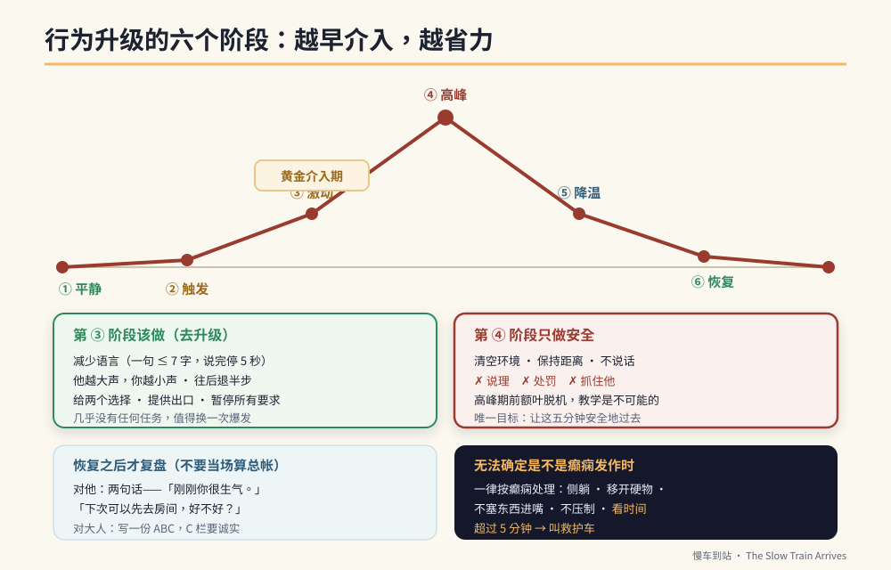

## 背景与痛点

这整本书创建在一个前提上：**他会生气，但勉强控制得住。**

那是这个孩子最珍贵的资产之一，也是所有训练得以进行的基础。但它不是保证。

累积的疲劳、环境的剧变、身体的不适、一次没有预告的改变、或只是青春期荷尔蒙的一个坏日子——**总会有一天，那个「勉强」失守。**

而那一天会发生什么，取决于一件事：**家里的大人有没有事先想过。**

没有想过的人，会在现场做出三件事：提高音量、讲道理、抓住他。这三件事全部都会让情况升级。

这一章要做的，是给你一份在那一刻能用的东西。它不需要你临场冷静——它只需要你**事先读过一次**。

> ⚠️ **医疗免责**
> 本章讨论的是**行为危机**的预防与处理。它不能取代任何医疗处置。
> 若出现疑似癫痫发作、意识改变、抽搐、或任何无法确定是否为医疗事件的状况，**一律先按医疗处理**（见本章第五节与第 3 章红旗）。任何紧急用药的使用与剂量，必须事先由主治医师书面交代，家长不可自行决定。

---

## 核心设计：行为升级的六个阶段

行为危机不是一瞬间发生的。它有一条可预测的曲线，而**越早介入，需要的力气越小**。

| 阶段 | 他的样子 | 大人该做 | **绝对不要做** |
|------|---------|---------|--------------|
| **① 平静** | 正常状态 | 预防：作息、预告、地基（第 11 章） | — |
| **② 触发** | 遇到压力事件（被打断、变动、噪音、疲劳） | 移除或降低触发源；提早给预告 | 忽略、假装没事 |
| **③ 激动** | 音量提高、重复同一句、来回走动、坐不住 | **这是黄金介入期**：减少语言、给空间、给选择 | 讲道理、下更多指令 |
| **④ 高峰** | 失控：大吼、摔东西、攻击、自伤 | **只做安全**：清空环境、保持距离、不说话 | 说理、处罚、抓住他 |
| **⑤ 降温** | 强度下降、开始喘、安静下来 | 保持安静的陪伴；不提刚才的事 | 「你看你刚刚」 |
| **⑥ 恢复** | 回到平静，可能疲惫或愧疚 | 给水、给休息；**之后**才复盘 | 立刻算总帐 |

> 🔍 **整条曲线最关键的一个判断**
> **在第 ④ 阶段（高峰期），教学是不可能的。**
> 前额叶在那个状态下基本上是脱机的。你说的每一句话都不会进去，而任何要求都会延长高峰。
> 所以高峰期的唯一目标是：**让这几分钟安全地过去。** 不是赢，不是纠正，不是让他认错——只是安全。

---

## 实作

### 一、预防：把力气花在第 ①② 阶段

危机处理最有效的部分，全部发生在危机之前。

```text
【降低基准压力】
  □ 睡眠（第 11 章）—— 睡不足的日子，训练强度自动减半
  □ 身体不适：头痛、牙痛、便秘、生理期——先排除
  □ 环境：噪音、人多、光线、温度
  □ 饥饿：长时间空腹（第 4 章）
  □ 预告：所有变动提前说（第 8 章的三层预告）

【创建他的「个人化前兆清单」】★ 这是本章最实用的一件事
  观察 2–4 周，记下他在爆发前 5–15 分钟会出现什么：

  □ 重复同一句话的频率增加        □ 音量比平常高
  □ 来回走动 / 抖脚 / 坐不住      □ 咬手 / 抓头发 / 抠手指
  □ 脸红、呼吸变快                □ 忽然安静、眼神不看人
  □ 反复确认同一件事              □ 开始翻找特定物品
  □ 其他：________________________

★ 这份清单一旦创建，多数危机可以在第 ③ 阶段就被拦下来。
  把它复印给老师、就服员、以及会单独照顾他的亲人。
```

### 二、第 ③ 阶段：去升级的六个技巧

这是黄金介入期。做对了，曲线会在这里转回去。

```text
【1】减少语言
  一句话 ≤ 7 个字，说完停 5 秒。
  ✗「你怎么又这样，我刚刚不是说过了吗，你要冷静下来」
  ✓「我知道。」（停）「我们去那边。」

【2】降低音量与语速
  他越大声，你越小声。这比提高音量有效得多。

【3】给空间
  往后退半步。不要正面站、不要围着他、不要挡门。
  站在他的侧前方，比正对面压迫感低。

【4】给选择（两个，都可以接受）
  「你要先喝水，还是先去房间？」
  → 选择会把控制感还给他，而失控感正是升级的燃料。

【5】提供出口，而不是要求
  ✗「你冷静一点！」（这是要求，而且他做不到）
  ✓「我们去外面走一下。」（这是出口）

【6】暂停所有要求
  这时候的任何指令都会加压。
  未完成的任务可以晚点回来——**几乎没有任何任务值得换一次爆发。**
```

### 三、第 ④ 阶段：高峰期只做安全

```text
【三件事，只有三件】
  ① 环境安全：把周围的硬物、尖锐物、热的东西移开；
              请其他人（尤其是弟妹）离开现场
  ② 保持距离：站在他伸手碰不到的地方，但看得见他
  ③ 不说话：不下指令、不说理、不喊他名字要求他停

【关于身体约束】★ 必读
  · 身体约束有明确的受伤与窒息风险，且在法规与机构规范上
    有严格限制。
  · **只有在他即将伤害自己或他人、且没有其他方式时**，
    才由受过训练的人运行。
  · 家长没有受过训练 → 优先做的是「移开环境、拉开距离、
    请求协助」，不是压制。
  · 若孩子的体型已接近或超过成人，家长更不应尝试压制——
    受伤的通常是双方。

【什么时候打电话求助】
  □ 他或别人已经受伤、或即将受伤而你无法阻止
  □ 你自己已经无法安全处理
  □ 出现疑似癫痫发作或意识改变 → 见第五节
  → 打给：另一位家人 / 学校 / 119
```

### 四、第 ⑤⑥ 阶段：降温与复盘

```text
【降温期（他开始安静）】
  · 保持在附近，但不主动说话
  · 不要问「你为什么要这样」
  · 可以递水、递毛巾——动作比语言好

【恢复期（回到平静）】
  · 给休息时间（通常需要 20–60 分钟）
  · 不要立刻回到原本的任务
  · **不要在这时候算总帐**

【复盘：至少等到当天稍晚，或隔天】
  用两句话就好，不要开检讨大会：
    「刚刚你很生气。」（描述，不评价）
    「下次生气的时候，我们可以先去房间，好不好？」
  → 给一个具体的替代行为，而不是要求「下次不要生气」。

【大人的复盘（★ 这一段比孩子的复盘重要）】
  当晚或隔天，用 ABC 记录（第 35 章）把整件事写下来：
    A 前事：那之前发生了什么？前兆出现在几分钟前？
    B 行为：实际发生了什么？持续多久？
    C 后果：最后怎么结束的？他因此得到了什么？

  ★ C 栏要诚实。如果结局是「所以那件事就不用做了」，
    那你刚刚增强了一次爆发（第 35、37 章）——
    这不是要你自责，是要你知道下一次该怎么安排。
```

### 五、与癫痫发作的区分

这一节对有癫痫病史的孩子特别重要，而且必须非常明确。

```text
【偏向行为危机的特征】
  · 有明确的前事（被拒绝、被打断、环境变动）
  · 过程中有目标导向的行为（去拿特定的东西、避开特定的人）
  · 对环境有反应（你移动，他的视线会跟）
  · 结束后能沟通、记得发生的事

【偏向癫痫发作的特征】
  · 没有明显前事，突然发生
  · 意识改变、叫不回应
  · 刻板、重复、无目的的动作
  · 眼神固定或上吊、口吐白沫、失禁
  · 结束后意识混乱、极度疲倦、完全不记得

【★ 无法确定的时候，一律按癫痫处理】
  · 让他侧躺，移开周围硬物
  · 不要塞任何东西进嘴巴
  · 不要压制肢体
  · 看时间（★ 这是最重要的一件事）
  · 超过 5 分钟，或连续发作之间意识没有恢复 → 叫救护车
  · 若能安全拍摄，录像对医师判读极有帮助

【事先要备好的】
  · 医师书面交代的紧急处置流程（若有紧急用药，含使用时机）
  · 第 4 章的急诊卡（皮夹、书包各一张）
  · 学校 / 机构已收到同一份流程
```

### 六、给学校与机构的一页

```text
【危机处理一页摘要　—— 复印给导师、特教老师、就服员】

  他的前兆是：______________________________________
  （出现这些时，请提早介入）

  有效的做法：
    · 减少说话，一句话不超过 7 个字
    · 给两个选择，不要下指令
    · 让他去 ______（指定的安静地点）
    · 拿 ______（他的安抚物 / 主题卡片）给他

  无效或会恶化的做法：
    · 大声说话、多人围上来、挡住去路
    · 讲道理、要求他道歉、当场处罚

  什么时候打电话给我：______________________________
  紧急联系：______________  医疗处置流程：见附件
```

---

## 现场踩雷

**踩雷一：在高峰期讲道理。**
最常见。前额叶脱机时，语言是加压，不是帮助。

**踩雷二：在恢复期算总帐。**
「你看你刚刚做了什么」——会直接把刚降下来的曲线再推上去，而且他学到的是「冷静下来会被骂」。

**踩雷三：家长试图压制。**
风险高、常造成双方受伤，而且会破坏信任。**移开环境、拉开距离、请求协助。**

**踩雷四：事后不复盘。**
复盘是唯一能让下一次变少的动作。而多数家庭在事件结束后只想赶快忘掉。

**踩雷五：让爆发成功。**
「好啦好啦不用做了」——如果每次爆发都能免除任务，爆发会变成他最有效的沟通方式（第 35 章）。
**正确做法：等他平静后，回来完成一个**最小版本**的任务**（哪怕只做一步），然后结束。

**踩雷六：没有事先写下前兆清单。**
临场才想，来不及。

**踩雷七：把每一次失控都当成退步。**
在青春期、环境转换期、身体不适时，失控会变多。**那是状态，不是能力的倒退**——但如果同时出现「原本会的东西不见了」，那是红旗，见第 3 章。

---

## 效益与验收（DoD）

| 项目 | 验收标准 |
|------|---------|
| 前兆清单 | 观察 2–4 周后完成，且已复印给学校／机构 |
| 六阶段已认知 | 两位照顾者都知道「高峰期只做安全，不教学」 |
| 去升级技巧 | 最近一次第 ③ 阶段时，实际使用了减少语言与给选择 |
| 安全计划 | 已写下「哪里是安全地点、谁来支持、什么时候打电话」 |
| 未使用压制 | 最近三个月未由未受训者运行身体约束 |
| 医疗区分 | 两位照顾者都能说出行为危机与癫痫发作的区分要点 |
| 紧急流程 | 医师书面的紧急处置流程已备妥，学校／机构各有一份 |
| 复盘 | 最近一次事件后有完成 ABC 记录，含诚实的 C 栏 |
| 一页摘要 | 危机处理一页已交给导师或就服员 |

> 💡 君之一席话
> 「那一刻你唯一的工作，不是让他认错，也不是把事情做完——**是让接下来这五分钟安全地过去。** 而你能为那五分钟做的准备，全部都在前面那几天。」

---


# 第40章　十八岁的法律断崖：监护、财产与医疗决定

## 背景与痛点

十八岁生日那天，会发生一件没有人通知你的事：**在法律上，你不再是他的代理人。**

在那之前，你是他的法定代理人，可以替他签同意书、开户、决定医疗处置。在那之后，他是一个具有完全行为能力的成年人——**即使他无法理解合约、无法管理金钱、无法为医疗决定负责。**

这会在几个具体的时刻突然变成问题：

- 医院要求「本人签署」手术同意书；
- 银行说帐户要「本人亲自办理」；
- 有人拿了一份合约给他签，而他签了；
- 他名下有一笔保险金或遗产，却没有人能替他管理。

而多数家庭是在**第一次撞到墙的那一天**才知道有这件事。

这一章要做的是：把这面墙提前四年画给你看，并说明每一格该问谁。

> ⚠️ **法律免责**
> **本章不是法律意见。** 法律制度会修正、各地法院实务见解不同、每个家庭的状况也不同。
> 本章只做三件事：说明**有哪些方向**、**该找谁谈**、以及**什么时候开始准备**。任何实际的声请、文档与决定，请咨询律师、法律扶助机构、或社会局（处）的社工。
>
> **一个必须先讲的重点**：民法的成年年龄近年已有修正，而各项制度的名称与要件也可能调整。**请以你办理当年的现行法令为准**，不要拿这一章去对条文。

---

## 核心设计：四件事，四个时程

| 要处理的 | 核心问题 | 什么时候开始 | 找谁 |
|---------|---------|-------------|------|
| **① 行为能力** | 他成年后，谁能替他做决定？做到什么程度？ | 成年前 1 年 | 律师／法扶／社工 |
| **② 财产** | 他名下的钱，谁管、怎么管、他百年后归谁？ | 成年前 1–2 年 | 律师／信托业者／社工 |
| **③ 医疗决定** | 谁签同意书？紧急时怎么办？ | 成年前半年 | 主治医师／医院社工 |
| **④ 长期照顾** | 「我走了以后」谁接手？ | **越早越好** | 社工／家族会议 |

---

## 一、行为能力：先问「需不需要」，再问「怎么办」

这是本章最重要、也最常被草率决定的一格。

家长听到「成年后不能替他签名」，第一个反应通常是「那我去办监护声明」。但在动作之前，有一个问题必须先问：

> **他真正需要被协助的，是所有的事，还是某几件事？**

### 两种声明的差别（概念性说明）

| | **监护声明** | **辅助声明** |
|---|---|---|
| 适用情况 | 因心智状况，**不能**为意思表示或受意思表示、或不能辨识效果 | 上述能力**显有不足**，但未达完全不能 |
| 效果 | 受监护人成为无行为能力人，由监护人代理 | 特定重要行为（如借贷、诉讼、重大财产处分）需辅助人同意 |
| 自主权 | 影响范围大 | 保留较多自主 |

**两者都需要向法院声请，并经鉴定进程。** 具体要件、进程与所需文档，请以现行法令并咨询专业为准。

### 为什么「不是每个人都需要监护声明」

这一段是这一章最需要说出口的专业立场。

身心障碍者权利公约（CRPD）已在台湾国内法化，其核心精神之一是**支持决策**（supported decision-making）优先于**代理决策**（substituted decision-making）——也就是：**能自己决定的部分，要尽量让他自己决定；只在真正需要的范围内提供协助。**

监护声明会影响的不只是「签合约」。它可能同时影响：

```text
□ 自己开立与使用银行帐户
□ 签订任何契约（包含工作契约）
□ 部分公民权利的行使
□ 婚姻与其他身分行为
□ 自己决定要不要接受某项医疗
```

对一个**能自理、能简单沟通、能在小作所稳定工作**的年轻人来说，全面剥夺行为能力可能超出他实际的需要——而那些被剥夺的，是他二十岁到六十岁的自主空间。

```text
【决定之前，先做这四件事】
  ① 列出「他实际上会遇到、且需要协助的决定」有哪些
     （通常是：大额金钱、签约、医疗同意——而不是全部）
  ② 问社工：以他的功能程度，实务上多数家庭怎么处理？
  ③ 问律师或法扶：辅助声明是否足以涵盖你列出的那几件事？
  ④ 想清楚：需要协助的是他，还是我们办事的方便？

★ 没有标准答案。有些孩子确实需要监护声明，那是合适的保护。
  这一节要求的只有一件事：**那必须是评估后的结论，不是缺省。**
```

---

## 二、财产：他的钱，以及你的钱

```text
【要处理的三笔钱】
  ① 他自己赚的（作业奖励金、薪资）
  ② 你留给他的（存款、保险金、不动产、遗产）
  ③ 政府给付与补助

【常见的方向（请与专业讨论适合哪一种）】

  · 安养信托 / 身心障碍者财产信托
      把钱交付信托，由受托机构依约定按月给付，
      避免一次性大额落在无法管理的人手上，
      也降低被诈骗或被亲友挪用的风险。
      → 问谁：银行信托部门、社会局、身心障碍者相关基金会

  · 保险金信托
      避免保险理赔金一次入帐后无人管理。

  · 遗嘱与继承规划
      ★ 台湾民法有特留分规定，
        「把财产全部留给某一个手足代为照顾」通常无法完全如愿。
      → 问谁：律师

  · 手足的角色要「讲清楚」，不要「默认」
      见第四节。
```

> 💡 **一个很多家庭忽略的风险**
> 最常见的财产损失，不是诈骗集团，是**熟人**——亲戚、邻居、同事、网友。
> 一个对人友善、社会判断力弱、又刚拿到一笔钱的年轻人，是高风险对象。
> 第 30 章的「先问人」脚本与第 38 章的界线教育，在这里是同一道防线的两端。

---

## 三、医疗决定

```text
【成年前半年要做的事】
  □ 问主治医师：他成年后，同意书的签署实务上怎么处理？
  □ 问医院社工：这家医院对心智障碍成人的作业方式为何？
  □ 更新第 4 章的急诊卡（成人版）
  □ 若已完成监护／辅助声明，把裁定文档影本备妥

【紧急状况的预备】
  · 医疗机构在紧急情况下有其处置原则，
    但事先把「谁是联系人、谁能提供病史」讲清楚，
    永远比临场快。
  · 病史摘要、用药清单、过敏史 → 随身一份、家里一份、
    机构一份（第 18 章的交接手册）。
```

> ⚠️ **医疗免责**
> 同意权的实务作法涉及法规与各医疗机构的规定，**请直接向主治医师与医院社工确认**，不要依据本章推论。任何用药与治疗决定，一律由医师依当时状况判断。

---

## 四、「我走了以后」：最难、也最该早做的一格

这一节通常会让人不想读完。但它是这一章存在的真正理由。

```text
【一份「如果我不在了」的文档，至少要有这七项】

  ① 他是谁
     第 18 章的交接手册、附录 D 的「他的使用说明」

  ② 谁接手
     · 主要接手人：______（已经谈过并同意 ★）
     · 备位接手人：______
     · 若无人接手，希望的安置方向：______

  ③ 钱在哪里、怎么给
     帐户、保单、信托契约的位置与联系窗口

  ④ 医疗
     主治医院／科别、用药、病史摘要的位置

  ⑤ 服务资源
     目前使用的机构、社工、联系人

  ⑥ 法律文档
     监护／辅助声明裁定、遗嘱、信托契约的位置

  ⑦ 他喜欢什么、怕什么
     ★ 这一项不会出现在任何官方表格上，
       但它决定了他在新环境里过得好不好。

【放在哪里】
  · 纸本一份，放在家人找得到的地方（并告诉他们在哪）
  · 电子档一份，至少两个人知道位置
  · 每年更新一次（可与附录 D 的年度维护一起做）
```

### 关于手足

```text
【三个必须被说出口的问题】
  ① 手足知不知道有一天可能要接手？
  ② 手足**愿不愿意**？（愿意的程度，可能不是全有或全无）
  ③ 如果愿意，是哪一种程度的接手？
     （同住／经济支持／定期探视／担任监护人／只担任紧急联系人）

【原则】
  · 不要默认。默认会在最坏的时间点变成冲突。
  · 手足有权说「我做不到全部」，而那不是不孝。
  · **把角色写清楚，比把责任压上去有用。**
  · 手足自己也需要支持——各地有手足支持团体与相关资源。
```

---

## 实作：时程表

```text
【成年前 2 年（约高职二年级）】
  □ 与社工谈一次：以他的功能，通常怎么处理行为能力？
  □ 开始了解财产保护的选项（信托、保险）
  □ 开一次家族会议，谈手足的角色（不做决定，只把话说开）

【成年前 1 年（高职三年级）】
  □ 咨询律师或法律扶助：监护 vs 辅助，哪一种符合他的实际需要
  □ 若决定声请，准备所需文档（诊断证明、鉴定、户籍数据等，
    实际清单请依当年规定）
  □ 问医师：成年后的医疗同意实务

【成年前半年】
  □ 更新急诊卡与交接手册（成人版）
  □ 确认银行帐户的处理方式
  □ 完成「如果我不在了」文档的第一版

【成年后每年】
  □ 更新一次文档
  □ 检查身心障碍证明效期与重新鉴定时程
  □ 查看信托或财产安排是否仍合适
```

---

## 现场踩雷

**踩雷一：等到撞墙才处理。**
第一次被医院或银行挡下来的那天，通常没有时间慢慢办。**法院进程需要时间。**

**踩雷二：缺省一定要监护声明。**
先评估辅助声明是否足够。**被剥夺的自主权，之后要拿回来很不容易。**

**踩雷三：把一笔钱直接留在他名下。**
没有管理机制的钱，是风险而不是保障。

**踩雷四：默认手足会接手。**
没有谈过的责任，会在最坏的时间点变成家庭冲突。

**踩雷五：所有文档只有一个人知道在哪里。**
如果那个人就是出事的那一个，文档等于不存在。

**踩雷六：拿这一章去对法条。**
制度会变。**这一章给的是方向与问题清单，不是答案。**

**踩雷七：只做法律准备，不做能力准备。**
最好的保护不是文档，是**他自己会的那些事**——会说「我要先问我妈妈」、会收好零钱、会求助、在机构有人缘。前面三十九章讲的全部都是这件事。

---

## 效益与验收（DoD）

| 项目 | 验收标准 |
|------|---------|
| 已咨询 | 至少与社工或律师／法扶谈过一次行为能力的选项 |
| 已评估必要性 | 已列出「实际需要协助的决定清单」，并据此讨论监护 vs 辅助 |
| 财产方向已定 | 已了解至少一种财产保护工具，并知道下一步找谁 |
| 医疗已确认 | 已向主治医师或医院社工确认成年后同意书的实务作法 |
| 急诊卡已更新 | 成人版急诊卡已就位（皮夹、书包、两位照顾者手机） |
| 家族会议已开 | 手足的角色已被明确讨论过，且记录下来 |
| 文档已成形 | 「如果我不在了」七项文档完成第一版，且至少两人知道位置 |
| 已排年度更新 | 下一次更新日期已写进行事历 |

> 💡 君之一席话
> 「这一章写的是文档，但它真正在处理的是一个没有人愿意讲出口的问题——**如果有一天我不在了，他会怎么样。** 你没办法回答那个问题，但你可以让答案不是『没有人知道』。」

---


# 第七篇　情境百景：那件事发生的当下

# 第41章　家庭日常十景

前面四十章讲的是**方法**。这一篇讲的是**那一刻**。

一个家长真正的处境不是「我想学习行为介入」，而是「他现在站在超商门口不肯走，后面排了五个人，我该怎么办」。方法书要求你先读完三章再自己组合；情境不给你这个时间。

这一篇的五十个场景，每一景都用同一副骨架拆开：**背景 → 问题 → 需要的技能 → 可用工具 → 这本书怎么做 → 没有这套方法的窘境 → 效益**，末附一句「君之一席话」与一段「高端点评」。

每一景都标了对应章节。**你可以只读那一景，然后在需要时才翻回正文。**

---

## 情境 1　早上七点半，他不肯换衣服

**背景**：上学日的早晨，你还要出门上班，时间表是压死的。他坐在床边，衣服放在旁边，人没有动。

**问题**：你说「快换衣服」。三十秒后他还坐着。你再说一次，音量提高一格。他开始讲火车。你说「先换衣服再讲」。他继续讲。七点三十五分，你已经说了六遍，开始生气；他也开始生气。最后你动手替他套上衣服，两个人都带着怒气出门——而这个循环，一周会发生四次。

**需要的技能**：可视化例行流程（第 8、13 章）、提示褪除（第 9 章）、行为功能判读（第 35 章）。

**可用工具**：出门流程图卡（四格）、视觉计时器、`railway assets` 产出的检核卡。

**这本书怎么做**：把「快换衣服」从嘴巴移到墙上。前一晚把衣服照顺序叠好、放在固定位置；早上把四格图卡（换衣服 → 穿袜子 → 吃早餐 → 穿鞋）交到他手上，手指第一格，然后**转身去做自己的事**。他卡住时等 5–10 秒，不行才给手势（第 9 章的提示褪除）。同时计时器转到 20 分钟，红色消失＝出门。若三周后仍然卡在同一格，做两周 ABC——多数这类「早晨僵局」的功能是逃避（他还没醒、或不想去学校），而不是对抗。

**没有这套方法的窘境**：口头催促一天二十次、一年七千次。孩子学会的是「等妈妈说第六遍才动」，因为前五遍都没有真正的后果；而家长学会的是提高音量——这两件事会一起恶化。

**效益**：出门准备时间从 35 分钟压到 20 分钟；口头催促次数从每天 20 次降到 3 次以下；最重要的是，早晨不再以怒气开场——**而一天的地基就是从那一刻铺下去的**。

> 💡 君之一席话
> 「你以为早上在赶时间，其实你在跟一个听不进语言的大脑抢那二十分钟。**把话变成图，你就把二十分钟赚回来了。**」

> 🔍 高端点评──道路在哪里
> 早晨是所有家庭最脆弱的时段，因为它同时具备三个恶化条件：时间压力、刚醒的低唤起状态、以及大人自己也在赶。这一景真正的难题不在孩子，在**大人愿不愿意提前一晚做那三分钟的准备**。往前看，这一类「例行流程可视化」最终要走向他自己维护——高职阶段可以让他自己在前一晚排好隔天的图卡顺序（第 19 章的加值），成年后换成手机提醒（第 18 章）。而那条路的起点，就是今天早上这四张卡片。

---

## 情境 2　晚餐时间到，火车话题停不下来

**背景**：放学后的固着时间已经聊了十五分钟，计时器响了。晚餐在桌上。

**问题**：他停了半秒，然后说「自强号比较快」。你说「时间到了」。他说「自强号比较快，区间车比较慢」。你说「我知道，去洗手」。他的音量提高一格。接下来十分钟，你们在餐桌旁进行一场没有赢家的口语角力，饭菜冷掉，你的耐心也是。

**需要的技能**：抑制控制三阶梯（第 8 章）、消退爆发的认知（第 8 章）、不进入口语角力。

**可用工具**：视觉计时器、五指并拢的制止手势、`railway assets` 的代币板。

**这本书怎么做**：第五步是整套 SOP 的关键——**一个字都不要说**。闹钟响、红色消失，你站起来，右手五指并拢掌心向前，左手食指指向那个全白的计时器，眼神中立，维持动作。他继续讲，你就重复同一个动作，不加码、不解释、不生气。前一到两周抗拒会**上升**，那叫消退爆发，是介入生效的信号——这时候妥协一次，比从来没开始还糟。

**没有这套方法的窘境**：每一次口语争辩都在教他「只要我够坚持，规则就会松动」；而每一次大人爆发，都在教他「规则是靠情绪强度决定的」。两种结局都在把 C1 往反方向练。

**效益**：情绪回复时间中位数从 5 分钟降到 2 分钟内（多数家庭在 4–8 周看到）；晚餐时间回复正常；而「他自己站起来去洗手」的那一次，是整个计划的第一个里程碑。

> 💡 君之一席话
> 「你以为你在讲道理，其实你在用他最弱的那条线路，要求他做最难的事。**把嘴巴闭上，把手指向计时器**——那不是冷漠，那是你能给他最温柔的一种帮忙。」

> 🔍 高端点评──道路在哪里
> 这一景是全书的缩影，也是最多家庭在第二周放弃的地方。难的从来不是孩子那一关（通常两周就过），是大人那一关——要练两个月。往前看，这套「限时＋手势」最终要褪除成他自己看时间、自己收尾（第 8 章的第三阶）。但要留意一个常见的误判：**进步了就把计时器收起来，两周后全部打回原形**。工具的撤除必须渐进，而且退步时要能毫无羞耻地放回去。

---

## 情境 3　手机被收走的那一分钟

**背景**：约定的屏幕时间到了。他手上还有五分钟的视频没看完。

**问题**：你伸手去拿手机。他往后缩，手抓得更紧，音量瞬间提高。你说「说好的」，他说「还没好」。你把手机抽走，他站起来、跺脚、开始重复同一句话。从平静到激动，只花了十五秒。

**需要的技能**：行为升级六阶段（第 39 章）、预告（第 8 章）、增强的时机（第 37 章）。

**可用工具**：计时器、两层预告、「还有五分钟」的固定台词。

**这本书怎么做**：问题发生在**收手机之前**。正确的流程是：开始前就约定时长并让他自己转计时器；剩两分钟给一次预告（只一次，不要倒数）；时间到，**不要伸手去拿**——请他自己交过来，并立刻接上一个明确的下一件事（「拿过来，我们去洗手，然后有火车时间」）。若他已经进入第 ③ 阶段（音量提高、来回走动），就切换到去升级：减少语言（一句 ≤ 7 个字）、你越小声、退半步、给两个选择。**这时候绝对不要伸手抢。**

**没有这套方法的窘境**：直接抽走 = 在第 ③ 阶段点火，而且教他「东西会被抢走」——下一次他会抓得更紧、更早戒备。若最后因为他闹而让他多看五分钟，那就更糟：你刚刚增强了一次爆发（第 35、37 章）。

**效益**：交还手机的冲突从每次都发生，降到每周一次以下；更关键的是他学会了「时间到我自己交」——那是自我启动（第 8 章第三阶），而不是被没收。

> 💡 君之一席话
> 「被抢走的东西，会被抓得更紧。**让他自己交出来，那五秒钟的差别，是往后几年的差别。**」

> 🔍 高端点评──道路在哪里
> 屏幕在这个族群身上是一个特殊的增强物：它强度极高、几乎不会饱足、而且随手可得——这三个性质加起来，让它非常容易变成家庭里最大的冲突源。往前看，真正的解方不在「怎么收走」，而在**创建不依赖屏幕的替代活动**（第 37 章的偏好评估），并在成年后把时间管理交给客观的设备（第 18 章）。一个实务上的警讯：如果孩子在没有屏幕的情况下完全无事可做，那代表增强物清单太窄，这件事要在转衔期之前处理。

---

## 情境 4　「顺便帮我拿」永远失败

**背景**：晚餐后，你要他把碗拿到厨房，顺便带客厅的卫生纸过来。

**问题**：他把碗放进厨房，然后站在那里，或者直接回房间了。你走过去说「卫生纸呢？我刚刚不是说要拿卫生纸？」他一脸茫然。这个场景每天发生，而你开始怀疑他是不是故意的。

**需要的技能**：工作记忆链的四个难度维度（第 9 章）、覆诵、提示褪除。

**可用工具**：十六级阶梯、三格检核卡、`railway` 的 `chain_level` 字段。

**这本书怎么做**：先确认一件事——**他不是忘了，是根本没装进去**。暂存区被「碗、厨房、拿过去」占满后，「卫生纸」在他开始移动的那一刻就掉出去了。做法：① 把「顺便」换成「然后」（顺便缺省了他没有的规划能力）；② 交办后加一句「你说一次」，能覆诵关键名词就算通过；③ 交办完**转身去做自己的事**，不要站着看；④ 他卡住时，先等 5–10 秒——那五秒的沉默，就是工作记忆真正在运作的时刻。

**没有这套方法的窘境**：大人一开口提醒，就替他做完了那一次的运算。替他做完一百次，他就永远停在一步——而「他做得到啊，只是我要在旁边提醒」这句话，会在毕业那年变成机构的收案疑虑。

**效益**：四到八周内，跨室两步指令的独立完成率从 3 成升到 7 成以上；`chain_level` 从第 1 级推到第 6 级——那正好是小作所日常交办的门槛。

> 💡 君之一席话
> 「他站在厨房不动的那五秒钟，是你最想开口的五秒钟，也是他大脑唯一在锻炼的五秒钟。」

> 🔍 高端点评──道路在哪里
> 这一景背后有一个容易被忽略的取舍：**今天的目的是「把事情完成」还是「训练」？** 两者不可兼得。赶时间的日子就自己做，那完全没问题；但要训练的那一次，就得忍住不提醒。真正的风险是「两者都想要」——结果每次都在最后一刻救援，于是数据永远停在同一级。往前看，这条线的终点是第 16 级的跨日任务（「明天早上记得带回条」），而多数孩子四年能走到第 10–12 级，那已经足够。

---

## 情境 5　弟弟的玩具被他拿走

**背景**：客厅里，弟弟正在玩一台玩具车。他走过去，直接拿走。

**问题**：弟弟大哭。你的第一反应是「还给弟弟」，他不放；你把玩具拿回来给弟弟，他开始生气。而弟弟学到的是「哥哥拿东西不用问，妈妈只会叫我让」——这一句话会在往后十年慢慢发酵。

**需要的技能**：物权边界的**双向**教学（第 31、38 章）、社交自控脚本、手足议题（第 40 章）。

**可用工具**：两句固定台词、可视化的「这是谁的」标记。

**这本书怎么做**：这一景要教的是**两个人**。对他：「这是弟弟的。你要先问。」并教固定脚本——「我可以玩吗？」对方说可以才拿；被拒绝时说「好，那我不玩」。对弟弟：教他也可以说「不可以，这是我的」，并且**大人要支持这句话**。同时做环境设计：每个人有一个明确标记的收纳箱，共用的玩具放中间。物权概念在这个族群身上不会自然长出来，但它是可以被具体化的——用箱子、用标签、用颜色。

**没有这套方法的窘境**：长期要求手足「让一下」，会造成两个后果：他学不会问，而手足学会的是自己的需求不重要。第 40 章讲手足接手时提过——**没有谈过的责任，会在最坏的时间点变成冲突**，而那个帐户从童年就开始扣款。

**效益**：拿东西前会问的比率四到八周内明显上升；更重要的是手足关系的长期存续——那是他成年后最可能的支持来源。

> 💡 君之一席话
> 「你每叫弟弟让一次，就从他们兄弟未来的关系里，预支了一点额度。**教哥哥问，比叫弟弟让，划算得多。**」

> 🔍 高端点评──道路在哪里
> 手足是特教家庭里最沉默的一群。他们常被期待成熟、被要求体谅、却很少被问「你还好吗」。往前看，这一景要走向两件事：一是他学会问与接受拒绝（那是他未来在机构里的生存技能，见第 31 章的物权边界）；二是手足获得属于自己的空间与支持资源（附录 B）。而在第 40 章的长期规划里，一个从小被公平对待的手足，远比一个从小被要求牺牲的手足，更可能在二十年后主动接手。

---

## 情境 6　两个月来第一次，他自己说「我想休息」

**背景**：家庭产线第 28 分钟。他开始分心，手速变慢，眼神飘。

**问题**：这不是问题，这是**成果**——但它极度脆弱。他放下手上的东西，双手在肚脐前交叠，看着你说：「我太累了，我想休息一下。」而你正好在赶晚餐，心里第一个念头是「再做十个就好」。

**需要的技能**：功能等值沟通训练的铁律（第 35 章）、增强的即时性（第 37 章）。

**可用工具**：三句台词、计时器。

**这本书怎么做**：**立刻准他休息。** 不是「再做五个」，不是「等一下」，是现在。并且给一句具体的称赞：「你自己说你累了，很棒。休息五分钟。」FCT 有两个条件——更省力、且**同样有效**。他放弃了原本最有效的方式（发脾气），改用一句话；如果这句话换不到结果，他明天就会换回去，而且更强烈。这一刻你付出的是五分钟，换到的是一个他往后三十年都能用的技能。

**没有这套方法的窘境**：「再做十个就好」——这句话会杀死那句台词。而更糟的是它教了他一件事：**说出来没有用，还是要闹。**

**效益**：无提示求助从每周 0 次到每周 2–3 次；疲劳时的爆发次数同步下降。这一项在机构评估中的权重，远高于他做得多快。

> 💡 君之一席话
> 「他说了那句话的那一刻，你只有一个选择：让它有效，或者让它死掉。**没有第三个选项，也没有『这次先例外』。**」

> 🔍 高端点评──道路在哪里
> 这一景是全书投报率最高的一刻。在庇护工场与小作所的现场，决定去留的往往不是产量，是「累的时候会怎样」——会说的人可以被管理，僵住或发脾气的人会被判定为情绪风险。往前看，这句台词要类化到三个地方：老师面前、陌生主管面前、以及没有人主动问他的时候。而它最大的敌人不是孩子的能力，是大人在忙碌时的那句「再一下」。

---

## 情境 7　周末的崩溃：整周忍耐的帐单

**背景**：实习期或高职期的周六早上。这一周他在外面表现得很好，老师还特别称赞。

**问题**：周六八点，他为了一件小事（汤匙放错位置）大爆发，强度是这个月最高的一次。你完全找不到原因——「他这礼拜明明很好啊」。而接下来整个周末，他都在疯狂碎念，谁都碰不得。

**需要的技能**：环境重载与前额叶能量耗竭（第 17 章）、周末减压、地基排查（第 11 章）。

**可用工具**：高墙式作息、周末不运行代币制、真正的火车小旅行。

**这本书怎么做**：把它读成**帐单**，不是退步。他在周一到周五为了「勉强控制」耗尽了所有前额叶能量，周末是结帐日。做法：周末两天不安排任何训练、不谈实习、**不运行代币制**，完全接纳碎念与疲惫；可安排一次真正的火车小旅行当作兑现；周日晚上确保充足睡眠。而在平日这一端，要往回检查强度是不是排太满（第 12 章：平日每天 ≤ 45 分钟）。

**没有这套方法的窘境**：把周末的崩溃当成能力退步，于是周末加强训练——那会让下一周的平日更难撑。这是实习期最常见的翻车原因。

**效益**：周末崩溃从每周一次降到每月一次以下；平日的表现反而更稳定。**修复不是浪费时间，它是下一周的燃料。**

> 💡 君之一席话
> 「他不是周末变坏了，他是**在外面撑了五天**。那些没有崩溃的日子，是有代价的，而周末就是缴费的地方。」

> 🔍 高端点评──道路在哪里
> 这一景指向一个常被低估的事实：**克制是有成本的**，而且这个族群的成本比一般人高得多。往前看，成年后的工作生活里，这条帐单会变成「周一症候群」或「连假后的三天不稳」——而处理方式完全一样：给修复留空间、不要在低谷加码。长期而言，真正该优化的是降低平日的克制成本（更好的环境适配、更明确的预告、更多的自主选择），而不是提高他的忍耐上限。

---

## 情境 8　深夜十一点半，他还没睡

**背景**：连续四天，他都在十一点半以后才睡着。白天的表现肉眼可见地变差。

**问题**：第六周的纪录整个垮掉：情绪回复时间从 145 秒回到 300 秒，检核卡不理，固着碎念变多。你的第一个念头是「这套方法是不是失效了」，第二个念头是「是不是要换方法」。

**需要的技能**：地基优先于方法（第 11 章）、五块地基的排查顺序、数据的正确读法（第 20 章）。

**可用工具**：睡眠日志、`railway report`（会自动标出近七天睡眠不足的天数）。

**这本书怎么做**：**先查地基，再检讨方法。** 把睡眠日志与情绪回复时间画在同一条时间轴上，相关性通常两周内就看得出来。处理顺序：固定起床时间（比固定就寝更有效）→ 睡前 30–60 分钟无屏幕 → 睡前流程可视化 → 白天有足够的身体活动。同时要排除医疗信号：打鼾严重、睡眠中反复抽动或大量流口水 → 回诊询问（那可能是夜间发作）。**这段期间的训练数据不宜当作能力判断的依据。**

**没有这套方法的窘境**：把生理问题误读成方法问题，于是把有效的方法改掉；或误读成态度问题，于是要求他「更努力」——而他其实只是没睡饱。

**效益**：睡眠稳定后，多数家庭在一到两周内看到指针回到原本的水位。**那不是方法重新生效，是地基被补回去了。**

> 💡 君之一席话
> 「你在第六周觉得方法失效了，其实是他连续五天十一点半才睡。**这条路上最有效的『教材』常常不是教材——是一张床。**」

> 🔍 高端点评──道路在哪里
> 这一景的价值不在睡眠本身，在**归因的习惯**。训练出问题时，多数家长的第一反应是检讨方法或检讨孩子，而正确的顺序是：放电与用药 → 睡眠 → 饮食与血糖 → 肠道 → 照顾者状态 → 然后才是方法。往前看，这个排查习惯一旦养成，能省下的力气可能比这本书其他所有内容加起来还多。而它也有一个医疗上的重要用途：**当地基都排除了、行为仍持续恶化，那就是回诊的信号**（第 3 章红旗）。

---

## 情境 9　他把找零丢在桌上就走了

**背景**：便利商店。他自己拿了商品、自己递了钱，你站在后面两公尺。

**问题**：店员找了他 55 元。他右手接过饮料，左手没有伸出来，硬币被放在柜台上——然后他转身就走。你在后面看着那 55 元躺在柜台上，而后面还有人在排队。桌上练了三个月的「付钱大作战」，在真实柜台前只完成了一半。

**需要的技能**：动作链的完整性（第 25 章）、类化（第 36 章）、现场的最少介入。

**可用工具**：M07 的口诀、手势提示、`railway drill M07`。

**这本书怎么做**：**现场不要用嘴巴，用手势**——轻拍他的左手臂，并用眼神指向硬币。他若没反应，才用口诀：「等一下，钱还没拿完。」回家后不要检讨，而是回去补**类化的维度**：桌上版练得再好，如果从没在「有店员、有排队、有噪音」的条件下练过，那就是还没学会。做法：从人少的时段开始，每练四次桌上版，就要有一次真实情境。

**没有这套方法的窘境**：在柜台前大声提醒「零钱！零钱！」——他会慌，后面的人会看，而下一次他不想去了。或者家长顺手把硬币收走——那一收，整条动作链就断了。

**效益**：真实情境下「拿到商品的同时左手等零钱」的比率，通常在 3–5 次实地练习后明显上升。而这一件小事，会替他挡掉往后几十年里那些不老实的柜台。

> 💡 君之一席话
> 「他不必算得出五百减四百五十等于多少。他只要记得**手还没收回来，交易就还没结束**。」

> 🔍 高端点评──道路在哪里
> 这一景是「桌上专家、现场文盲」的典型。类化失败不是孩子的问题，是训练设计的问题——**只在一种条件下练成的能力，本来就不会自己长脚走到别的地方**。往前看，这条线要延伸到自助结帐机、行动支付与提款机（第 30 章的机台四步骤），而每一种新接口都要重走一次类化。一个实务建议：**每学会一种支付方式，就固定去用它三次**，否则两个月后会退回原点。

---

## 情境 10　妈妈在讲电话的十五分钟

**背景**：晚上八点，你在讲一通重要的电话。他原本在客厅看书。

**问题**：电话接通两分钟后，他走过来说「自强号比较快」。你比手势请他等一下。他又说一次，音量提高。你摀住话筒说「等一下」。他开始重复、走来走去、拿东西弄出声音。十五分钟的电话，你被打断了九次——而他平常一个人可以安静看书半小时。

**需要的技能**：行为功能判读（第 35 章）、ABC 记录、教适当的要求注意方式。

**可用工具**：`railway abc` 记录、计时器、「等一下」的视觉卡。

**这本书怎么做**：这一景的功能几乎可以确定是**获得注意**——判断线索很清楚：只在你忙的时候发生、你回应之后暂时停止、而且他不需要任何东西。处置与「逃避」完全相反：① 行为发生时给予**最少反应**（一个手势，不对话）；② **在他没有出现该行为的时段主动给注意**——这一点才是关键，例如讲电话前先陪他三分钟、中途每五分钟走过去拍他肩膀一次；③ 教他一个适当的要求方式（拍你的手臂＋「妈妈，等一下可以听我说吗」）。并准备一张「我在讲电话，红色不见就好」的计时器＋视觉卡。

**没有这套方法的窘境**：每次被打断都回应一句，等于每五分钟给他一次增强——行为只会变密。而如果你最后爆发骂他，那仍然是注意，甚至是强度更高的注意。

**效益**：ABC 记录两周 + 前置的主动注意，多数家庭在三到四周看到打断次数明显下降。而它的副产品是一句可以用一辈子的话：「等一下可以听我说吗。」

> 💡 君之一席话
> 「他不是要吵你，他是要你。**与其等他来讨，不如提前给——提前给的那三分钟，会替你省下十五分钟。**」

> 🔍 高端点评──道路在哪里
> 「获得注意」是四大功能里最容易被误判成恶意的一种（「他就是欠骂」），也是最容易被无意增强的一种。往前看，这一景要走向两个方向：一是他学会用语言而非行为要求注意；二是家庭创建「可预期的专属时间」——当注意是可预期的，用行为去抢的必要性就下降了。而在机构环境里，这一条同样成立：一个会用语言要求关注的成年人，比一个用行为抢关注的成年人，人缘好上非常多。

---

> 📌 **这一章的十景对应**
> 情境 1、4：第 8、9、13 章｜情境 2、3：第 8、37、39 章｜情境 5：第 31、38、40 章
> 情境 6：第 35、37 章｜情境 7：第 11、17 章｜情境 8：第 11、20 章
> 情境 9：第 25、36 章｜情境 10：第 35 章

---


# 第42章　学校与班级十景

## 情境 11　IEP 会议上，老师说「他这方面比较弱」

**背景**：学期初的 IEP 会议，四十分钟，桌边坐了六个人。前三十分钟在讲行政流程。轮到你的时候，只剩五分钟。

**问题**：你提出希望学校用视觉检核表，老师说「他这方面就是比较弱，不用太勉强」。这句话刺到你了——你知道他在家做得到。你的情绪上来，话开始说得快而急，而对方的表情从专业变成防卫。会议结束，纪录上什么都没有写。

**需要的技能**：可评量目标的写法（第 20、34 章）、被拒绝时的回应、一页摘要。

**可用工具**：一页摘要、三张能力证据照片、给老师的备忘录。

**这本书怎么做**：把情绪换成证据。回应的句型是：「他在家的纪录是这样（拿出照片与纪录），所以我想试试看在学校能不能也做到。如果一个学期后没有进展，我们再调整目标。」——**用「试一个学期」降低对方的承诺成本。** 并且只要求三项，用可评量的写法：「看着三格检核表连续完成 2 项班务，中途无额外口头提醒，达成率 70%」。会议前十分钟，把要说的三件事写在纸上，照着念。

**没有这套方法的窘境**：带着情绪争辩 → 对方进入防卫 → 你要的东西一项都没进纪录 → 而口头承诺「我们会多注意他」，换一个老师就消失了。

**效益**：三项目标进纪录的比率大幅提高；更关键的是关系没有破裂——**你要的是往后几年的合作，不是这四十分钟的胜负。**

> 💡 君之一席话
> 「你在那张桌子上唯一的优势，是你比任何人都了解他。但**了解不会自动变成资源——它要先被翻译成一句可以验收的话。**」

> 🔍 高端点评──道路在哪里
> 「他这方面比较弱」这句话通常不是恶意，是经验判断——老师看过太多孩子在某一项卡住。真正的问题是：这个判断往往创建在**没有结构化支持下的表现**上。往前看，家长最有效的动作不是争论，而是持续累积证据（第 6 章的能力证据文件夹），让下一次会议的起点不同。四年后，那本文件夹在鉴辅会与职评现场的说服力，会远超过任何形容词。

---

## 情境 12　换了代课老师的那一周

**背景**：导师请产假，代课老师接手三个月。学校在开学第三周通知你。

**问题**：第一天他就回家崩溃。之后一周，情绪回复时间从 2 分钟拉回 6 分钟，检核卡不见了（新老师不知道那是什么），聊天券也没有人在管。你打电话去问，代课老师很客气，但她说「没有人跟我交接这些」。

**需要的技能**：交接的可携性（第 15、18 章）、环境变动的预期管理、危机的一页摘要（第 39 章）。

**可用工具**：给老师的备忘录、危机处理一页、检核卡样张。

**这本书怎么做**：把交接文档做成**随时可交出去的一份**，而不是只在开学时给一次。内容三页就够：① 医疗与紧急处置；② 怎么交办事情给他（一次一到两件、交办后请他覆诵、给检核卡让他打勾、卡住先等 5–10 秒）；③ 他的三句话与固着的处理方式。同时降低这三个月的训练强度到六到七成，不导入任何新项目——**熟悉的工具在陌生环境中是定锚**。

**没有这套方法的窘境**：每一次人员异动就重启一次适应期，而孩子的行为纪录看起来像「不断退步」。更麻烦的是，新老师会从零开始摸索，而摸索期通常会用错策略（例如口头催促），把原本练好的东西推回去。

**效益**：交接文档到位的家庭，代课期的退步幅度明显较小，且恢复时间从数周缩短到数天。

> 💡 君之一席话
> 「你脑子里的那些知识，只有写下来，才会跟着他走。**而它要写成三页，不是三十页——三十页没有人会读。**」

> 🔍 高端点评──道路在哪里
> 人员异动在这个族群的教育生涯里是常态，不是意外——导师、助理员、治疗师、就服员，每一次换人都是一次重启。往前看，真正的解方不是期待学校做好交接，而是**家庭端持有一份权威版本，并主动交出去**。这份文档在第 18 章会长成七页的机构交接手册；而它的第一版，就是今天这三页。

---

## 情境 13　他跑去帮 B 组，被推开了

**背景**：高职一年级的分组实作课。他是 A 组的材料清点长。

**问题**：他看到 B 组的同学东西掉了，热心地跑过去帮忙捡。那位同学有情绪行为，被靠近时反射性地推了他一把。他愣住、脸红、开始重复同一句话，接着跺脚。老师来处理的时候，看到的是「他跟同学起冲突」。

**需要的技能**：工作边界（第 15 章）、加害预防的双向教学（第 38 章）、去升级（第 39 章）。

**可用工具**：物理边界的说法、「我可以帮你吗」脚本、一只手臂的距离。

**这本书怎么做**：这一景要处理的不是冲突，是**保护他的热情**。做法：① 用物理边界界定范围——「你今天是 A 组的清点长，你只要看好 A 组的工具。B 组有 B 老师会帮忙，你不用过去」；② 教「帮忙之前要问」的脚本——「我可以帮你吗？」对方没回答＝不可以；③ 教「一只手臂的距离」，实际伸手比一次。这三件事要同时给老师，因为它在学校发生的次数远比在家多。

**没有这套方法的窘境**：因为人缘好、利他动机强，他会反复尝试、反复被拒绝。一年下来累积的挫折，会让他从「最受欢迎的孩子」变成「容易起冲突的孩子」——而那个标签会跟着他进入高职三年的纪录。

**效益**：越界事件下降；更重要的是他保住了那项最宝贵的资产——在机构里待十年二十年，保护他的不是能力，是人缘。

> 💡 君之一席话
> 「他不是鸡婆，他是**没有人告诉他线画在哪里**。边界不是限制，是保护。」

> 🔍 高端点评──道路在哪里
> 这一景指向一个容易被忽略的风险：**利他特质在没有边界时会变成人际风险**。往前看，同样的模式会在成人职场重演——过度热心地整理别人的桌子、替别人做他的工作、对某位同事表现出过度关注（第 38 章的加害预防）。而处理方式从国中到成年都一样：**用具体的物理边界，而不是抽象的「不要太鸡婆」**。

---

## 情境 14　检核卡做得很好，但老师还是一直催

**背景**：三格检核卡在学校用了六周。老师很配合，卡片也护贝好了。

**问题**：你去参观教学那天发现：老师把卡片给他，然后站在旁边说「第一格喔」「快一点」「还有一个」。他确实完成了三项——但整个过程被口头提示包住。独立完成率的纪录写着 70%，实际上接近 0。

**需要的技能**：提示褪除（第 9 章）、DoD 的定义精确度（第 20 章）、与老师的沟通方式。

**可用工具**：提示层级表、备忘录里的那一句「卡住时先等 5–10 秒」。

**这本书怎么做**：不要纠正老师，**给她一个更省力的做法**。备忘录的措辞是：「他卡住时，如果我们立刻再说一次，他会改成等待提醒，反而更慢。等 5–10 秒不行的话，用手指方向通常就够了——这样老师也省事。」同时把记录方式改成**记提示层级**（I/G/V/M/P）而不是「有没有完成」——一旦开始记层级，口头提示的比例会自然被看见。

**没有这套方法的窘境**：卡片变成装饰。而更隐蔽的损失是数据被污染：DoD 显示达标，于是推进到下一站，然后在更难的阶段崩盘——而没有人知道为什么。

**效益**：改记提示层级后，真实独立率会先「掉下来」（因为终于被看见），但四到八周后爬升的那一段，才是真的。

> 💡 君之一席话
> 「卡片不会取代催促，**除非大人真的闭嘴**。孩子那一关两周就过了，大人那一关要练两个月。」

> 🔍 高端点评──道路在哪里
> 这一景暴露的是「假达标」的第二种形式：大人不自觉地提示（第 20 章）。检查方法很简单——请第三个人在旁边看一次，或录像回放。往前看，这件事在职场现场会变成关键：就服员不可能全程站在他旁边提示，**能不能在无提示下启动，决定他是被安排在有支持的岗位，还是需要一对一陪同**。

---

## 情境 15　校外教学前一晚

**背景**：明天全班要去校外教学，行程与平常完全不同。

**问题**：晚上九点，他忽然开始反复问「明天要去哪里」「几点回来」「谁会去」。问了十七次。你回答了十七次，而他的焦虑没有下降，反而越问越急。你开始不耐烦，他开始生气。

**需要的技能**：三层预告（第 8 章）、惊喜减敏（第 32 章）、反复确认的功能判读（第 35 章）。

**可用工具**：视觉行程卡、时间轴图、`railway assets` 的检核卡（改成行程版）。

**这本书怎么做**：反复确认的功能通常是**降低不确定性的焦虑**，而口头回答（听觉）几乎无法缓解它——因为那句话说完就消失了。做法：把明天的行程画成一张**看得见的时间轴**（几点集合 → 搭什么车 → 到哪里 → 吃饭 → 几点回到学校 → 谁来接），贴在他看得到的地方。之后每次他问，**不回答，只指那张卡**。若行程有不确定的部分，诚实标上问号并说明「这一格还不知道，明天早上会知道」——**不确定被标示出来，比假装确定更能安抚**。

**没有这套方法的窘境**：十七次口头回答＝十七次注意的增强，同时焦虑并未下降。而如果最后大人爆发「不要再问了」，他的焦虑会直接翻倍。

**效益**：反复确认次数通常在导入视觉行程后降到个位数；更关键的是他学会了一件事——**不确定的时候，去看那张卡**。

> 💡 君之一席话
> 「你回答十七次，都不如那张贴在墙上的纸。**因为说出口的话会消失，而纸不会。**」

> 🔍 高端点评──道路在哪里
> 反复确认是这个族群最常见、也最消耗照顾者的行为之一。它的核心不是「他记不住」，而是「不确定感无法被口语安抚」。往前看，这条线会延伸成第 17 章的实习路线图、第 18 章的视觉月历，最终在成年后变成手机行事历——**同一个机转，换三种载体**。而在它成熟之前，墙上那张纸就是他的行事历。

---

## 情境 16　实作课的噪音

**背景**：高职二年级的职业实作教室，二十个同学，机器声、广播、隔壁组讲话。

**问题**：他在家可以折衣服折三十分钟，在实作教室做五分钟就擡头、发呆、开始讲火车。老师的评语是「专注力不足」。而你知道他在家不是这样。

**需要的技能**：抗干扰的分级训练（第 16、19 章）、感官功能的辨识（第 35 章）、类化。

**可用工具**：干扰分级表、耳罩或减噪耳机（需与老师讨论）、定格站姿台词。

**这本书怎么做**：先做一个判断——**这是专注力问题，还是感官负荷问题？** 判断方式：如果他在安静环境可以持续 30 分钟、在吵杂环境 5 分钟就撑不住，而且离座后会去找安静的角落，那更像感官。感官功能的处置与代币完全不同（第 35 章）：先做环境调整（座位远离噪音源、允许使用耳罩），再做分级的抗干扰训练——从背景音乐开始，逐级到他喜欢的声音、有人对话、被直接搭话。**在家练干扰，是为了让学校的干扰变得可承受。**

**没有这套方法的窘境**：把感官负荷当成专注力不足，于是用代币奖励「坐好」——对感官功能几乎完全无效，而失败会被解读成「他就是坐不住」，进而影响安置与职场媒合。

**效益**：环境调整＋分级训练后，干扰下的持续工作时间通常能推到 25 分钟以上——那正是庇护工场评估的参考门槛。

> 💡 君之一席话
> 「在安静书桌前练出来的专注力，到吵杂的工场会全部归零。**而他未来要去的地方，全部都是吵的。**」

> 🔍 高端点评──道路在哪里
> 这一景牵涉一个实务上的两难：职场适配 vs 能力训练。过度强调「他要学会忍受」会变成折磨；完全靠环境调整则会限缩他能去的地方。往前看，合理的路径是两端并进——**训练到能承受一般职场的噪音水准，同时在合理范围内争取环境调整**（耳罩、座位、时段）。而这两件事都需要在职评与 IEP 上被明确记录，否则到了现场没有人知道。

---

## 情境 17　同学开始躲他

**背景**：国三下学期。他在班上一直很受欢迎，但最近两个月，下课时同学会走开。

**问题**：导师委婉地说：「他最近比较常一直讲火车，有几个同学反映会有点困扰。」你听了心里一沉——那是他最珍贵的资产正在被消耗。

**需要的技能**：固着的限时与结构化（第 10 章）、社交化（第 10、19 章）、学校端的一致做法。

**可用工具**：一天三张聊天券（学校版）、「一张照片」规则、固定的边界台词。

**这本书怎么做**：**不要压抑，改成限时＋社交化。** ① 学校版代币：一天 3 张券，限下课时间、对方同意时使用；非约定时段老师温和但固定地说「现在不是火车时间，请把券收好」（同一句话，每次一样）。② 把单向的讲述换成双向的分享——每周带一张自己选的照片，练习说「这是我最喜欢的自强号，给你看」，重点是「给你看」而不是「听我讲」。③ 教一句「你呢？」，让对话有轮流。

**没有这套方法的窘境**：两种极端都会出事。高压禁止 → 固着转入私下、焦虑升高、而人缘仍在流失；完全放任 → 到高职与成年，包容度会急速下降，而他最大的保护网会消失。

**效益**：导入代币与分享规则后，同侪交互的品质通常比数量先改善——从「被听讲」变成「被邀请看照片」。

> 💡 君之一席话
> 「他最强的特质，正在吃掉他最重要的资产。**你的工作不是拆掉引擎，是给它装一个离合器。**」

> 🔍 高端点评──道路在哪里
> 这一景是全书核心命题最实际的一次考验：固着既是动机引擎，也是人际成本。往前看，成人机构里的同一个问题会更严峻——同事没有义务包容，而人缘一旦流失，出状况时就没有人替他说话。因此第 32 章把「每周一次的同侪分享」列为长期维护项目，而不是可有可无的加值。**在他可能待十年二十年的地方，人缘是需要每周维护的基础设施。**

---

## 情境 18　老师说「他今天情绪不好」

**背景**：联系簿上写着这一行，这个月第四次。

**问题**：你想知道发生了什么，但「情绪不好」不告诉你任何事——是被打断？被拒绝？太累？太吵？还是身体不舒服？你问老师，老师说「就是不太稳定」。两个月过去，你手上累积的是十二行「情绪不好」，而你完全无法从中看出任何模式。

**需要的技能**：行为定义的具体化（第 1、35 章）、ABC 三联式、与老师的数据协作。

**可用工具**：ABC 记录表（一张 A5 贴在联系簿里）、`railway abc`。

**这本书怎么做**：把「情绪不好」换成三栏。给老师一张极简的 ABC 小卡，只要求填三格：**之前在做什么（A）／他做了什么（B）／后来怎么结束的（C）**。并先与老师约定行为定义——「音量提高、重复同一句话三次以上」，具体到「两个人分别记会记成同一件事」。两周后把十笔摊开读 C 栏，模式通常会自己浮出来。

**没有这套方法的窘境**：形容词式的纪录无法产生任何结论，而两个月后的检讨会议上，家长与老师会各自凭印象争论，最后不了了之——**而孩子继续每周经历四次没有人理解的崩溃**。

**效益**：两周的 ABC 通常足以判断功能，而功能一旦确定，介入方向就从「试试看」变成「有依据」。

> 💡 君之一席话
> 「『情绪不好』是一个没有出口的句子。**换成三栏字，它就会变成一张有方向的地图。**」

> 🔍 高端点评──道路在哪里
> 要老师多填一张表，需要一个很好的理由——而最好的理由是**替她省事**：「填两周，我们就知道该怎么调整，之后她就不用一直处理了。」往前看，这份 ABC 的价值不只在当下：它是行为功能介入方案的依据，也是未来职评与机构收案时最有说服力的数据。**形容词说服不了任何人，三栏字可以。**

---

## 情境 19　安置评估的仿真施测

**背景**：国三下学期，学校安排了一次仿真的职业实作评估。

**问题**：他把抹布折了，但边角没对齐；十个袋子装了八个就转身要走（忘了贴标签）；委员故意打断他换任务时，他愣住、跺脚三秒。老师回报：「大致可以，但工作人格的部分要再加强。」

**需要的技能**：五大扣分地雷与四大应考技巧（第 27 章）、定格站姿、覆诵。

**可用工具**：居家仿真、陌生大人扮演委员、录像回放。

**这本书怎么做**：针对三个地雷各做一件事。① 对齐：所有练习都加一句「要对齐」，并在收尾时检查一次。② 指令没做完就起身：用覆诵（「好，装袋、贴标签」）＋三格检核卡的打勾习惯，把「完工信号」绑在打勾而不是感觉上。③ 被打断：练定格站姿——双手在肚脐前交叠、深吸一口气、说「好，没关系，我换做这一个」。考前一周每天 20 分钟，**请一位陌生的亲友扮演委员**，录像回放时只看三件事：有没有中途停顿、成品有没有对齐、被打断时的反应。

**没有这套方法的窘境**：在熟人面前做得到不代表在陌生人面前做得到；而「情绪行为风险」这个判定，影响的不只是安置，是往后四年他能拿到什么样的实习机会。

**效益**：三个地雷各练两周，多数孩子在正式评估时的表现会与家中水准接近——**而那个落差，本来才是失分的主因**。

> 💡 君之一席话
> 「他们考的不是他多聪明，是**他坏掉的时候会怎样**。一句『请老师指导我』，比多做十个包装值钱。」

> 🔍 高端点评──道路在哪里
> 评估现场真正在测的是「可指导性」——这个人卡住时，我能不能把他带回来。往前看，同一个判准会在职评、机构收案、乃至于职场试用期反复出现。因此第 27 章的四个技巧不是应试技巧，而是**职场生存技能的提前预演**；它们在考完之后不该收起来，而应该变成日常。

---

## 情境 20　学期末，三个指针都没有动

**背景**：这学期照着计划做了十六周。你每周记录，没有中断。

**问题**：期末拿出数据，三个指针几乎一模一样。情绪回复时间中位数 180 秒 → 175 秒；独立完成率 0.42 → 0.44；指令链还在第 5 级。你的第一个念头是：这半年白费了。第二个念头是：是不是该换一套方法。

**需要的技能**：趋势 vs 门槛的读法（第 20 章）、卡住的三种读法（第 12 章）、地基排查（第 11 章）。

**可用工具**：`railway report`、`railway gate`、ABC 记录。

**这本书怎么做**：先分辨这是三种卡法中的哪一种。**能力卡**（练了六周指针完全没动）→ 把任务降一阶，并检查是不是一次动了两个维度。**动机卡**（做得到但开始逃避）→ 回到 C3，重新包装外壳。**地基卡**（全面退步）→ 停止推进，回第 11 章排查，并确认有无技能倒退（那是红旗）。同时要检查一件更根本的事：**标准是不是订错了**——如果连续三次查看都没过、而且指针也没在动，该调整的是计划，不是孩子。

**没有这套方法的窘境**：把「没有进步」直接读成「方法无效」，于是换一套全新的方法，然后从零开始——而换方法本身会再消耗两到三个月的适应期。多数家庭在第三次换方法之后就停止了。

**效益**：正确归因之后，最常见的结果是「原来是一次动了两个维度」或「原来睡眠早就乱了」——**而这两者都不需要换方法，只需要调整一格**。

> 💡 君之一席话
> 「留在原地半年不是失败，**把半年的数据丢掉、从头再来一次，才是。**」

> 🔍 高端点评──道路在哪里
> 这一景是所有长期计划的分水岭。真正决定四年后结果的，不是前六个月跑得多快，而是**在第一次没有进展时，家庭选择了什么**。往前看，这里有一个值得创建的习惯：每学期末的查看，先看趋势（有没有在动）、再看门槛（有没有达标）、最后才看要不要调整计划。趋势比门槛更早告诉你方法对不对——而那也是为什么这本书要求每周记三个数字，而不是每学期评估一次。

---

> 📌 **这一章的十景对应**
> 情境 11、14：第 20、34 章｜情境 12：第 15、18、39 章｜情境 13：第 15、38 章
> 情境 15：第 8、32 章｜情境 16：第 16、19、35 章｜情境 17：第 10、19 章
> 情境 18：第 1、35 章｜情境 19：第 27 章｜情境 20：第 11、12、20 章

---


# 第43章　社区与交通十景

## 情境 21　超商柜台前，后面排了五个人

**背景**：周六下午的便利商店，他要自己结帐买一瓶饮料。这是第三次真实情境练习。

**问题**：他把饮料放上柜台，然后开始翻钱包。第一张抽出来是 500 元，犹豫了一下又放回去。后面排了五个人，有人开始换另一条队伍。你站在他后方两公尺，感觉到店员的眼神和背后的压力，脱口而出：「拿那张红色的！」——他一慌，整个钱包直接推给店员。

**需要的技能**：M04/M05 的等值提取（第 23、24 章）、现场的最少介入、类化条件的控制。

**可用工具**：真钞、他自己的钱包、手势提示。

**这本书怎么做**：**条件要先设计，不要在现场补救。** ① 挑人少的时段（周间下午、或早上），挑他熟悉的店。② 事前在家演练同一笔金额，让他知道「今天要付一张红色的」。③ 现场**不要用嘴巴**——需要提示时，用手指轻点钱包里那张纸钞的位置。④ 若他慌了，接手完成这一次，不要当场教学；回家后降一阶重练。⑤ 给店员一句话也有帮助：「他在练习，可能会慢一点，谢谢。」多数店员会很配合。

**没有这套方法的窘境**：在柜台前提高音量指导 → 他慌 → 把钱包推出去 → 下一次他不想去。而「把整个钱包递出去」正是这一课要防的那件事，却在练习中被自己教会了。

**效益**：条件控制后，多数孩子在 3–5 次实地练习内能完成完整流程；而「他自己买了一瓶饮料」这件事，对他的自我认同影响超乎预期。

> 💡 君之一席话
> 「你越急，他越慌。**后面那五个人只会多等九十秒，而他这一次的经验会留十年。**」

> 🔍 高端点评──道路在哪里
> 社区练习最大的敌人不是孩子的能力，是**旁人的目光加在家长身上的压力**。往前看，这条线的关键不在柜台，而在家长能不能忍受那九十秒的尴尬——因为每一次接手，都是一次少掉的独立经验。实务上有一个有效的做法：**固定去同一家店**。熟悉的店员会认得他，而那份熟悉会让后续的每一次都更容易。

---

## 情境 22　闸门口他不肯往前走

**背景**：火车站进站闸门。他刷了卡，闸门打开，「逼」的一声。

**问题**：他停在闸门中间，反复学那个「逼」的声音，盯着闸门开合。后面的人开始挤。你说「快走」，他没反应；你拉他，他甩开手、音量提高。这是这个月第三次，而每一次都在人潮里。

**需要的技能**：利他动机的引导（第 24 章）、公共场所的原则、兴奋状态下的去升级（第 39 章）。

**可用工具**：固定的引导台词、回家后的火车时间（出口）。

**这本书怎么做**：**不要用「快走」，用「后面还有人」。** 身体保持中立，轻轻牵着他的手往前，温和而坚定地说：「维修长，后面还有很多乘客要进站。为了安全，我们要往前走去月台等车。」——把「催他走」转成「为了后面的人」，启动的是他最强的那条回路（利他），而不是最脆弱的那条（被强迫）。回家后补一句：「今天你在闸门那边有往前走，做得很好。现在是火车时间，你可以讲。」**现场克制，回家给出口。**

**没有这套方法的窘境**：在公共场所提高音量或拉扯，会同时触发他的对立情绪与周围的注视，情况只会更糟；而如果最后你放弃练习、改成开车接送，他就失去了通勤独立的机会。

**效益**：多数家庭在导入「利他式引导」后两到三次就见效；滞留时间从数分钟降到十几秒。

> 💡 君之一席话
> 「他不是故意挡路，他是**被那一声『逼』抓住了**。你要做的不是把他拉开，是给他一个更值得往前走的理由。」

> 🔍 高端点评──道路在哪里
> 这一景示范了本书最核心的一个技巧：**用他的强项去驱动他的弱项**。利他动机是这类孩子最常见、也最被低估的资产。往前看，同一招会在通勤训练、机构工作、甚至医疗配合上反复使用（「你先做，后面的人才能用」）。但要注意一个界线：**不要滥用到让他觉得自己永远要为别人让步**——利他引导是工具，不是价值观灌输。

---

## 情境 23　火车误点二十分钟

**背景**：周末的火车行程，他期待了一整周。月台上的跑马灯显示：误点 20 分钟。

**问题**：他反复确认跑马灯，开始说「自强号怎么还不来」，音量逐级上升，身体开始前后晃。第八分钟他想跨过黄线去看，你拉住他，他甩开。整个月台的人都在看。

**需要的技能**：等待耐受（第 26 章）、惊喜减敏（第 32 章）、天候与月台安全（第 32 章）。

**可用工具**：计时器（手机也行）、「等待＝任务」的话术、替代台词。

**这本书怎么做**：三步。① **把等待变成看得见的量**：手机计时器转 20 分钟给他看，并指跑马灯上的新时间，让「不确定」变成「确定的 20 分钟」。② **把等待变成任务**：「你是站长的小帮手。红色还没不见，代表黄线后面很危险，请你陪站长一起顾着月台的安全。」——无聊的等待变成有意义的工作，焦虑会明显下降。③ **给替代台词**：「没关系，火车会来，我们等 20 分钟。」让他自己说一次。安全上，黄线是不可妥协的规则；若他无法在黄线后方稳定等待，**离开月台到候车室**，那不是失败。

**没有这套方法的窘境**：口头安抚（「快来了、再等一下」）几乎无效，因为「一下」不是一个他能理解的量；而在月台上拉扯有真实的安全风险。

**效益**：导入「量化＋任务化」之后，多数孩子能把可承受的等待从三五分钟推到十五分钟以上——那足以应付误点、候诊与排队。

> 💡 君之一席话
> 「他不是不会等，是**不知道要等到什么时候**。把终点画出来，二十分钟就变成一件可以做的事。」

> 🔍 高端点评──道路在哪里
> 误点是免费的惊喜减敏演练——**真实发生的变故，比家里假装的有效十倍**。往前看，这一景要走向的是「计划变更不等于世界毁灭」的认知弹性（第 32 章）：从火车误点，到停班停课、到机构活动临时更改、到成年后的各种变动。而每一次事后的复盘（「今天火车误点，我们等了 20 分钟，然后就搭到了」）都是在为下一次存款。

---

## 情境 24　有人在月台跟他搭话

**背景**：他独自站在月台等车，你在十公尺外的柱子后观察（通勤梯度 4）。

**问题**：一位陌生中年男子走过来跟他攀谈，聊了两句火车，然后拿出手机说「我帮你拍张照，加个 LINE 好不好」。他点头了——因为对方在讲火车，而且对他很友善。

**需要的技能**：陌生人脚本（第 30、38 章）、「先问人」规则、加害情境的辨识。

**可用工具**：三句话（我不要／我要先问我妈妈／我要去找站务员）、紧急联系卡。

**这本书怎么做**：**不要教他判断好人坏人**——那需要的社会推理是他最弱的一环，而且手法会变。教的是一条不会过期的规则：**任何陌生人的任何要求，一律「我要先问我妈妈」，然后离开，走向人多的地方或站务员。** 这一景发生后，处理方式是：当下立刻靠近、平静地带他离开（不要当场对那位路人发作）；回家后不要责备他，而是把这个真实情境当成教材演练三次——「他问你要不要加 LINE，你要说什么？」

**没有这套方法的窘境**：「不要跟陌生人讲话」这条规则对他不管用——因为他分不出谁是陌生人（每天都有新的同学、新的老师、新的店员）。而「他人很好」正是最危险的判准。

**效益**：固定脚本演练 5–10 次后，多数孩子能在真实情境中说出那一句；而那一句就是整条防线。

> 💡 君之一席话
> 「他分不出好人坏人，也不需要分。**他只需要记得一句话：我要先问我妈妈。**」

> 🔍 高端点评──道路在哪里
> 这一景把第 38 章与第 30 章接了起来：身体界线的预防与金钱防卫，本质上是同一条防线的两端。往前看，成年后的风险会从「加 LINE」变成「借钱」「帮我签名」「介绍你一个工作」，而规则完全一样。这里有一个实务上的关键配套：**家人接到这种电话时绝对不能责备他**——骂过一次，下一次他就不打了，而那正是防线失守的时刻。

---

## 情境 25　卖场走失的八分钟

**背景**：周末的大卖场，人多。你在挑东西，一转头他不见了。

**问题**：八分钟。你喊他的名字，人声太吵；你去服务台广播，而他听到广播也未必知道那是在叫他。八分钟后，你在饮料区找到他——他正盯着冷藏柜的灯。他完全不知道发生了什么事，而你的手在抖。

**需要的技能**：空间定向（第 17、19 章）、紧急卡与三个可以说的人（第 38 章）、走失的预防设计。

**可用工具**：紧急卡（放口袋，不是书包）、固定的集合点、手机定位、「找穿制服的人」规则。

**这本书怎么做**：走失是**设计问题**，不是注意力问题。四项配套：① 出门前约定并实地走一次「集合点」（服务台／出入口），并拍照存在他手机里；② 紧急卡放**口袋**（书包会被放下），内容含姓名、家长电话、一句「我不太会说话，请帮我打这个电话」；③ 教一条规则——**找不到妈妈时，去找穿制服的人**（比「找警察」更容易辨认）；④ 进卖场前先说一次今天的路线与时间。若已配戴智能手表，定位功能是很值得的投资。

**没有这套方法的窘境**：走失当下的处理完全依赖他的判断，而那正是最弱的一环。更长远的损失是家长从此不敢带他出门——社区适应的机会就此关闭。

**效益**：有集合点与紧急卡的家庭，走失的平均寻回时间显著缩短；而更重要的是家长敢继续带他出门。

> 💡 君之一席话
> 「你找不到他的那八分钟，会让你想再也不带他出门。**但关在家里的代价，会在四年后全部回来。**」

> 🔍 高端点评──道路在哪里
> 走失的风险与社区独立的训练是直接冲突的——而多数家庭在一次惊吓之后选择了完全退回。往前看，正确的方向不是二选一，而是**逐级放手＋逐级加固**（第 17 章的通勤五梯度）：每往前一梯度，就补一项安全配套。而在配套齐全之前，停在较低的梯度完全没有问题——**独立通勤是选项，不是必须。**

---

## 情境 26　大雨天的月台

**背景**：梅雨季，下班时间，月台湿滑、人多、伞全部撑开。

**问题**：他一手拿伞、一手抓包包，走路重心不稳；靠近黄线时被人潮往前推了一下。你在后面看得心脏停跳。而他完全没有察觉刚才发生了什么。

**需要的技能**：天候与环境安全的四要点（第 32 章）、双手可用原则、去升级前的预防。

**可用工具**：连帽外套（取代伞）、后背包（取代手提）、固定的候车位置。

**这本书怎么做**：把安全变成**装备问题**，不要变成注意力问题。四要点：① **站位**——永远在黄线后方两步，远离边缘，并固定站在某根柱子旁（有实体参照物）；② **重心**——风大、地滑时脚步放大、重心放低；③ **视线**——眩光或反光时先停下来看清楚再走；④ **装备**——雨天用连帽外套而不是伞，包包用后背式，**确保双手是空的**。这四项不必特地在台风天练——**天气本来就会来**，下雨那天就练下雨的版本。

**没有这套方法的窘境**：靠「小心一点」这句话维持安全，而它在人潮与噪音中完全失效。

**效益**：装备调整通常立刻见效；而固定站位让他在任何车站都有一个「我的位置」，同时降低了空间焦虑。

> 💡 君之一席话
> 「『小心一点』不是安全措施，**一件连帽外套才是。**」

> 🔍 高端点评──道路在哪里
> 这一景体现了一条通用原则：**能用环境设计解决的，不要用行为要求解决**。行为要靠注意力维持，而注意力在疲劳、噪音、兴奋时最先失效——偏偏那正是最危险的时刻。往前看，成年后的安全策略也应该遵循同一条原则：固定路线、固定车厢、固定站位、固定装备。**可预测性既是他的需求，也是他的保护。**

---

## 情境 27　他在电梯里一直按按钮

**背景**：医院电梯，人很多。他伸手把所有楼层都按亮了。

**问题**：旁边的人明显不悦。你把他的手拉下来，他立刻又伸出去，并开始重复按同一颗。你说「不可以」，他更用力按。这件事在电梯、在自动门、在收银机前反复发生。

**需要的技能**：感官功能的辨识（第 35 章）、替代感官输入、环境调整。

**可用工具**：可携的替代物（按压计数器、有声玩具）、事前的位置安排。

**这本书怎么做**：先判断功能。线索是：**没有人在旁边他也会做、被制止后仍持续、按下去本身就舒服（灯亮、声音、触感回馈）**——那是感官／自动增强，而代币与处罚对它几乎无效。正确处置是**提供功能等值的替代**：口袋里放一个按压计数器（正好是第 16 章的产量计数器），进电梯前先把它交到他手上，并让他负责按**一颗**目标楼层（给他一个合法的按钮）。同时做环境安排：站在远离按钮面板的位置。

**没有这套方法的窘境**：用制止与斥责处理感官行为，会得到「越禁止越强烈」的结果，而大人会得出「他故意跟我作对」的错误结论——那个结论会污染往后所有的介入。

**效益**：替代物到位后，多数家庭在一到两周内看到明显下降；而更大的收获是家长学会了辨识感官功能——那会改变他对很多其他行为的解读。

> 💡 君之一席话
> 「他不是在挑衅，他是**在找那个感觉**。与其禁止，不如给他一个可以按的东西。」

> 🔍 高端点评──道路在哪里
> 感官功能是四大功能里最常被误判的一种，也是「所有方法都试过就是没用」最常见的答案（第 35 章）。往前看，成年后的感官需求不会消失，只会换形式——摇晃、抠手、哼声、开关灯。真正的长期策略不是消除，而是**安排规律的、可接受的感官活动时段**，让需求有出口。而在职场现场，这一点会直接影响他能不能待得住。

---

## 情境 28　悠游卡余额不足的红灯

**背景**：早上通勤，闸门前。他刷卡，机器发出不同的声音，灯是红的，闸门没开。

**问题**：他愣住，又刷了一次，还是红灯。他开始重复刷、音量提高、后面的人开始绕道。他不知道发生了什么，而「余额不足」这四个字对他没有意义。

**需要的技能**：M06 余额递减（第 24 章）、机台四步骤（第 30 章）、突发状况脚本（第 32 章）。

**可用工具**：加值机的四步骤、「钱不够了」的固定说法、备用零钱。

**这本书怎么做**：这一景要提前准备，而不是现场处理。① **平常就练「看屏幕」**——每次刷卡让他看余额数字，内化「逼一声，钱变少」。② 设一条**可视化的底线**：余额低于 100 元时卡片会显示，教他「看到这个数字就要加值」，或家长每周固定日检查。③ 教加值机的四步骤（看屏幕 → 按对按键 → 放入钞票 → 确认数字、收好卡片），并实地练 3 次。④ 现场的脚本：「钱不够了，我们去加值。」——一句话，然后移动离开闸门。

**没有这套方法的窘境**：现场才第一次遇到，他会用唯一会的方式反应（重复尝试 + 情绪升高）；而在通勤独立阶段，这一次经验可能让他往后拒绝自己刷卡。

**效益**：练过加值流程的孩子，遇到红灯时会「转身去加值机」而不是原地卡住——那是从被动到自主的一大步。

> 💡 君之一席话
> 「红灯那一刻他不是在闹，他是**没有下一步可以走**。你要给他的不是安抚，是一个动作。」

> 🔍 高端点评──道路在哪里
> 这一景属于「例外情境」的训练，而例外情境正是自主生活最容易崩溃的地方。往前看，同类的例外还有很多：车票买错、车门关太快、电梯故障、店家没开。**每一个例外都值得被当成一次教学**，而处理原则相同：给一句话 + 一个动作 + 一个可以求助的人。做过三种例外之后，第四种通常就能类推。

---

## 情境 29　通勤梯度三：妈妈在后面看着

**背景**：高职三年级，实习通勤训练。今天是第一次「同车厢但保持距离、不介入」。

**问题**：他上车后坐下，一切正常。到站前一站，车厢广播改了月台。他站起来看着门，犹豫，又坐下——他不确定该不该下车。你在五公尺外，手心冒汗，不知道该不该走过去。

**需要的技能**：通勤五梯度（第 17 章）、不介入的纪律、安全的判准。

**可用工具**：路线卡（放口袋）、手机、事前约定的求助对象。

**这本书怎么做**：**先设置介入门槛，再开始练。** 例如：「除非他下错站、走向危险区域、或超过三分钟完全没有动作，否则我不介入。」这一景属于「犹豫但安全」，正确做法是**继续等**——犹豫本身就是他在判断，而判断需要时间。若他真的错过站，那也是一次极有价值的学习（下一站下车、走回来、或打电话）。事后的复盘只讲两句：「你今天有自己看广播，很好。下次不确定的时候，可以问站务员。」

**没有这套方法的窘境**：家长在第一次犹豫时就冲过去 → 梯度永远停在 2；而更隐蔽的损失是他学到「不确定时等妈妈出现」，那正是独立通勤最致命的一课。

**效益**：明确的介入门槛让家长撑得住那三分钟；而多数孩子在 4–6 次之后能稳定完成梯度 3。

> 💡 君之一席话
> 「他犹豫的那三分钟，是他这辈子第一次自己做决定。**你走过去，那三分钟就白过了。**」

> 🔍 高端点评──道路在哪里
> 通勤训练的核心矛盾是安全与自主。这里的关键不是「要不要放手」，而是**放手之前把门槛写下来**——写下来，家长在现场才不会凭焦虑决定。往前看，梯度 5（完全独立）是否运行，取决于路线条件、他的判断力与当地环境；**停在梯度 3 或 4 完全没有问题**，很多成年身障者终生使用陪同或接送，那不影响机构收案，也不代表训练失败。

---

## 情境 30　有人要他帮忙签名

**背景**：他二十岁，周末自己在社区走动。一名推销员在骑楼拦住他。

**问题**：对方说「先生你好，这里签个名支持一下就好，不用钱」，并把板夹递过来。他看着那支笔——那是一个明确的指令，而他一辈子被教的是配合指令。

**需要的技能**：诈骗防卫的「先问人」（第 30 章）、法律行为能力的现实（第 40 章）、社会判断的替代规则。

**可用工具**：一句话脚本、手机一键拨号、（若已办理）辅助声明的相关文档。

**这本书怎么做**：规则只有一条，而且不会过期：**任何陌生人的任何要求，一律「我要先问我妈妈」，然后转身离开。** 不教判断、不教辨识话术——教一个不需要判断的动作。配套三项：① 手机首页一键拨号给家长；② 家人接到电话时**绝对不责备**（骂一次，下次他就不打了）；③ 第 40 章的行为能力安排——若他已办理辅助声明，某些重要行为需辅助人同意，那是最后一道法律防线（实际效力请咨询专业）。

**没有这套方法的窘境**：一个被训练成听话、又想帮忙的人，是推销与诈骗最理想的对象。而一旦签了名或办了门号，后续的处理成本极高。

**效益**：这一句话能挡掉绝大多数的街头与电话情境；而它与第 38 章的「没有秘密」是同一道防线的两端。

> 💡 君之一席话
> 「我们花十六年教他听话。**现在要教他，有一种指令永远可以拒绝。**」

> 🔍 高端点评──道路在哪里
> 这一景把第 30、38、40 章绑在一起：行为的防线（先问人）、身体与界线的防线（没有秘密）、法律的防线（行为能力安排）。三者缺一都会有破口。往前看，最大的风险其实不是街头陌生人，是**熟人**——亲戚、邻居、同事、网友。因此「先问人」不能只针对陌生人，而要涵盖「任何人要我做我不确定的事」。这条规则的普遍性，正是它能撑三十年的原因。

---

> 📌 **这一章的十景对应**
> 情境 21：第 23、24 章｜情境 22：第 24、39 章｜情境 23：第 26、32 章
> 情境 24、30：第 30、38、40 章｜情境 25：第 17、38 章｜情境 26：第 32 章
> 情境 27：第 35 章｜情境 28：第 24、30 章｜情境 29：第 17 章

---


# 第44章　医疗与身体十景

> ⚠️ **医疗免责**
> 这一章的十个场景涉及回诊、发作处置、用药、剂量与麻醉同意。**全部都是医疗决策，一律由主治医师判断。**
> 本章只做一件事：让你在那个当下**知道要做什么、要说什么、要问什么**。任何情况下都不要自行停药、调药或改变剂量；抗癫痫药物突然停用可能诱发癫痫重积状态。

---

## 情境 31　抽血的那五分钟

**背景**：定期回诊要抽血。候诊区人多，他已经等了四十分钟。

**问题**：叫到号的那一刻他开始后退。进了抽血室看到针，他把手抽回去、身体僵住、声音开始高。护理师很有经验地说「一下下就好」，但他听不进去。你和护理师各拉一只手——而下一次回诊，他从进医院大门就开始抗拒。

**需要的技能**：固着兴趣当镇定工具（第 10 章）、预告与演练（第 8 章）、身体检查的界线说明（第 38 章）。

**可用工具**：火车照片或玩具、计时器、事前演练、「医生要看／要碰哪里」的预告。

**这本书怎么做**：把抽血拆成**三个时段**分别处理。① **事前（前一天）**：明确预告——「明天要抽血，护理师会用针碰你的手臂，会有一点痛，大概数到十就好。妈妈会在旁边。」并在家用同样姿势演练一次。② **候诊**：把等待量化（计时器）并任务化；手上握着火车卡片。③ **现场**：请护理师在动作前说一句「我现在要碰你的手臂，可以吗」——这同时满足第 38 章的界线教育（**即使是医护，也要先问**）；抽血当下引导他数车厢或看照片。结束后**立刻兑现承诺**（去看火车、买他喜欢的饮料）——一次不兑现，往后所有预告都会失效。

**没有这套方法的窘境**：突袭式的处置会让恐惧累积，最后演变成「进医院就崩溃」——而他往后三十年都需要定期抽血追踪。

**效益**：多数家庭在两到三次结构化准备后，抽血从「三个人压着」变成「握着卡片撑过去」。

> 💡 君之一席话
> 「他怕的不是针，是**不知道接下来会发生什么**。把那五分钟画出来，痛就只是痛，不是恐惧。」

> 🔍 高端点评──道路在哪里
> 医疗配合度是长期照顾里最容易被低估的能力。一个能配合抽血、看牙、照 X 光的成年人，与一个每次都需要镇静的成年人，往后三十年的医疗品质天差地远。往前看，这条线要走向「他自己知道流程」——把就医三步骤（挂号、候诊、领药）逐年交给他（第 30 章）。而每一次成功的配合，都在替下一次存款。

---

## 情境 32　回诊十分钟，你只能说三件事

**背景**：三个月一次的回诊。诊间外还有二十个人在等。

**问题**：医师问「最近还好吗」，你脑中闪过这三个月的一百件事——睡眠、情绪、学校、那次疑似失神、体重、还有一直没问的那个问题。你张口说了「还好，就是有时候比较不稳」。医师点头、开药、下一位。走出诊间你才想起：**最重要的那件事忘了说**。

**需要的技能**：回诊四段信息（第 11 章）、观察纪录的整理、优先序。

**可用工具**：`railway report` 的周报、四段信息清单、写在纸上的三个问题。

**这本书怎么做**：进诊间前，把要说的整理成四段，写在一张纸上照着念：① **发作纪录**（有无、型态、频率、持续多久；若有录像更好）；② **「像发作但不确定」的事件**（短暂失神、忽然停顿、眼神空掉几秒——这些最容易漏报）；③ **认知与行为的变化**（★ 最重要：有没有「原本会的东西不见了」、注意力明显变差、情绪突然暴躁）；④ **疑似药物不良反应**（体重、掉发、手抖、白天嗜睡）。并准备**三个要问的问题**，按重要性排序——时间不够时至少问到第一个。

**没有这套方法的窘境**：凭印象回答，最容易漏掉的正好是最关键的第 ③ 段——而「认知退步」是需要主动安排睡眠脑电图的信号。

**效益**：带纸进诊间的家长，医师能取得的信息量与品质明显不同；而「需不需要安排睡眠脑电图」这个问题，往往就是靠第 ③ 段问出来的。

> 💡 君之一席话
> 「十分钟不够讲一百件事，但**足够讲对三件事**。差别在你有没有在前一晚写下来。」

> 🔍 高端点评──道路在哪里
> 家长在医疗系统里最有价值的角色，是**唯一持续在场的观察者**。医师一年见他四次，你天天见他。往前看，这份观察要逐步系统化：从纸条到周报，从印象到数据。而有一件事要特别提醒——**带观察纪录去，不要带检查清单去**（第 32 章）。前者帮助判断，后者妨碍判断。

---

## 情境 33　半夜两点的发作

**背景**：多年未发作。凌晨两点，你被隔壁房间的声音吵醒。

**问题**：他在床上抽动，眼神上吊，口角有泡沫，叫不回应。你的第一个念头是「怎么会」，第二个念头是「要不要送医」，第三个念头是手机在哪里。而你完全不记得该做什么。

**需要的技能**：发作的第一时间处置（第 39 章）、与行为危机的区分、急诊卡（第 4 章）。

**可用工具**：急诊卡、手机（看时间、录像）、医师书面的紧急处置流程。

**这本书怎么做**：五个动作，按顺序。① **看时间**（★ 最重要的一件事——超过 5 分钟、或连续发作间意识未恢复 → 叫救护车）；② 让他**侧躺**，移开周围硬物；③ **不要塞任何东西进嘴巴、不要压制肢体**；④ 若能安全操作，**录像**（对医师判读极有帮助）；⑤ 结束后保持侧躺、陪着他，等意识恢复——之后通常会极度疲倦与混乱，那是正常的。事后：记录时间、型态、持续多久、当天有无诱因（睡眠不足、发烧、疲劳、漏药），并尽速回诊。**急诊卡放皮夹与书包各一张，两位照顾者手机各一张照片。**

**没有这套方法的窘境**：在最需要冷静的三分钟里上网搜索；或做了两件会造成伤害的事（塞东西、压制）；或没有看时间——而「超过五分钟」正是唯一那个明确的判准。

**效益**：事先读过一次的家庭，在那三分钟的处置正确率完全不同。**这一景不需要你临场冷静，只需要你事先读过。**

> 💡 君之一席话
> 「那一刻你唯一要做对的事是**看时间**。其他的，让他侧躺，然后陪着他。」

> 🔍 高端点评──道路在哪里
> 多年未发作的家庭最容易失去准备——急诊卡过期、紧急流程忘记、药物清单没更新。往前看，这一景的关键是**定期演练与更新**：每年至少更新一次急诊卡，并在每次用药调整后同步更新学校与机构的那一份。而在成年转衔时（第 18 章），这份流程要跟着交到新机构手上。

---

## 情境 34　他不肯刷牙

**背景**：睡前流程的最后一项。这件事卡了两年。

**问题**：他会拿起牙刷、挤牙膏、在嘴里刷两下就吐掉，然后说「好了」。牙医已经说过两次有蛀牙。你试过奖励、试过陪他一起刷、试过骂——都没用。

**需要的技能**：工作分析与连锁（第 36 章）、提示褪除、感官因素的排除（第 35 章）。

**可用工具**：TA 步骤卡（`railway assets` 产出）、计时器、电动牙刷（可选）。

**这本书怎么做**：先排除感官因素——牙膏的味道、泡沫的触感、牙刷的硬度，任何一项不舒服都会让「快速结束」变成合理策略。换无味牙膏、换软毛或电动牙刷，先试两周。若非感官问题，就把「刷牙」拆成工作分析：**挤牙膏 → 上排外侧左／中／右 → 上排内侧 → 下排外侧 → 下排内侧 → 咬合面 → 漱口 → 冲牙刷 → 归位**。用计时器分段（每一区 15 秒），并记录每一步的**提示层级**。建议**后向连锁**：前面由大人带，最后两步由他做，逐步往前加。

**没有这套方法的窘境**：用奖励处理一个「他其实不知道怎么做完整」的技能——奖励无法补足步骤的缺失，而反复失败会让他更抗拒。

**效益**：拆成九步之后，多数家庭在四到八周内看到刷牙时间从 20 秒延长到 90 秒以上，且能看出卡在哪一区。

> 💡 君之一席话
> 「『他不肯刷牙』十次有九次的意思是——**他不知道刷牙有九个步骤，而我们一直当成一件事在教。**」

> 🔍 高端点评──道路在哪里
> 口腔照护是智能障碍者长期健康里最常被忽视的一块，而牙科治疗的配合难度又特别高（第 31 景）。往前看，这一景的价值不只在牙齿：它是工作分析最好的练习题——步骤明确、每天都做、成效看得见。**把刷牙拆对了，你就学会了怎么拆所有其他技能。**

---

## 情境 35　他两个月来只排便过几次

**背景**：你在整理纪录时发现，这两个月的排便纪录异常稀疏。而他从来没有喊过不舒服。

**问题**：他坐不住、脾气变差、食欲下降，而你一直把它读成「最近状况不好」。直到你翻回纪录才发现：**他可能已经腹胀不适很久了，只是不会说。**

**需要的技能**：肠道地基（第 11 章）、感觉低反应的认知（第 5 章）、红旗辨识（第 3 章）。

**可用工具**：排便纪录（打勾即可）、定时如厕制约、视觉图卡。

**这本书怎么做**：① **就医**——超过三到四天完全未排便且合并腹胀、呕吐或食欲全失是红旗；任何软便剂、浣肠、益生菌的使用都要先问医师或药师。② **定时排便制约**：每天固定时间（早餐后或晚餐后 20–30 分钟，利用胃结肠反射），不论有没有便意都坐上马桶 5–10 分钟；脚要踩得到地（矮凳垫脚）；**不要给 3C**；记录的是「有没有坐满 5 分钟」，不是「有没有解出来」——可控的行为才适合当训练目标。③ 每日基本盘：规律分次补水、增加纤维时同步增加水分、有足够的身体活动。

**没有这套方法的窘境**：对便意感觉迟钝的孩子，如果采取「他不舒服会说」的被动策略，问题会累积到相当程度才被发现；而腹胀造成的坐不住与易怒，会被完全误读成行为问题。

**效益**：定时制约通常在二到四周内置立规律；而伴随而来的是情绪与专注的改善——**那些「行为问题」原来是肚子的问题**。

> 💡 君之一席话
> 「他不会说他不舒服。**所以排便纪录，是最便宜的行为问题排查工具。**」

> 🔍 高端点评──道路在哪里
> 感觉低反应（第 5 章的「不哭闹」）在成年后会持续存在——他可能不会喊痛、不会说不舒服、不会反映牙痛或胃痛。往前看，家庭与机构都需要创建**主动的健康监测**，而不是等他表达：固定的排便纪录、体重、食欲、睡眠。这四项的变化，往往比他的口语更早告诉你身体出了什么事。

---

## 情境 36　药快吃完了才发现

**背景**：周六晚上，你打开药盒，发现只剩两天的量。而下次回诊在十天后。

**问题**：你打电话到医院，门诊已结束；急诊可以拿，但要挂号等三小时。你开始盘算：能不能减半撑过去？——**而这个念头本身，就是这一景要处理的问题。**

**需要的技能**：服药规律化（第 13 章）、地基维护、绝不自行调整的铁律。

**可用工具**：周药盒、手机提醒、「剩七天就挂号」的固定规则。

**这本书怎么做**：**任何情况下都不要自行减量或停药**——抗癫痫药物突然停用或减量可能诱发癫痫重积状态，那是会致命的。正确做法：① 立即联系医院（多数医院有夜间咨询或急诊管道），说明状况并依医师指示处理；② 创建预防机制——把「药剩七天」设成手机提醒，或固定在每月同一天检查；③ 用周药盒（分格分早晚），一眼就能看出剩几天；④ 把服药绑在固定事件上（早餐后、洗澡后），而不是靠记忆。

**没有这套方法的窘境**：断药的风险远高于挂急诊的麻烦。而更常见的隐形问题是**服药时间不规律**——那会让血中浓度起伏，而浓度不稳定的后果可能要几周后才在行为上显现。

**效益**：周药盒＋提醒的家庭，断药事件几乎归零；而规律服药是家庭端唯一能贡献、且贡献很大的一环——它不需要任何医疗知识，只需要一个闹钟和一个习惯。

> 💡 君之一席话
> 「『减半撑一下』这个念头，是这条路上最危险的一个。**宁可挂三小时急诊。**」

> 🔍 高端点评──道路在哪里
> 用药管理在成年转衔时会出现一个断点：从家长全权管理，到机构或他自己部分参与。往前看，这条线要逐步移转——先让他认得自己的药袋、再让他在提醒下自己拿药、最后在有监督的情况下自己服用（第 30 章的医院领药脚本）。而在移转的每一阶段，**「谁负责确认今天吃了没有」必须明确到只有一个人**。

---

## 情境 37　他在客厅做私人的事

**背景**：周日下午，客厅，家人都在。他坐在沙发上，手放进裤子里。

**问题**：你的第一反应是尴尬，第二反应是想大声制止。奶奶在场，弟弟也在。你脱口说了「你在干嘛！不可以！」——他愣住，脸红，然后跑回房间。这件事之后两个月，他变得退缩，而行为并没有消失，只是换了时间。

**需要的技能**：场合教育而非禁止（第 38 章）、当场最少语言、事后在平静时教。

**可用工具**：公开／私人场合图、固定的一句话。

**这本书怎么做**：**当场只做两件事**：平静地说一句固定的话，然后带他移动——「这是私人的事。我们去房间，把门关起来。」不要惊呼、不要在其他人面前处理、不要事后开检讨会。**事后（在他平静时）**拿出场合图：「这件事，在这里（指红色区域）可以。在这里（指绿色区域）不可以。」重复几次，就像教任何一个场合规则。同时教卫生（之后要洗手）与安全（不用会受伤的方式、不对着别人）。

**没有这套方法的窘境**：用羞辱或恐吓处理，会造成三个后果：行为转入更隐密但更不安全的场合、他学到「我的身体是坏的」、以及**未来遭遇侵害时他更不敢说**。第三项是最严重的。

**效益**：场合教育通常在数周内见效——他学会的是「换地方」，而不是「不可以」。

> 💡 君之一席话
> 「需要教的不是『不可以』，是『**在哪里可以**』。禁止而没有出口，只会让它躲到更不安全的地方。」

> 🔍 高端点评──道路在哪里
> 这是全书最容易被回避的一景，而回避的代价全部由孩子承担——被当成问题行为处理、被通报、被贴标签。往前看，这条线要延伸到机构环境：新的照顾者未必知道怎么处理，所以场合图与处理方式要写进第 18 章的交接手册。**这件事不写下来，他到了新环境会被重新误解一次。**

---

## 情境 38　牙医说「要拔智齿，需要全身麻醉」

**背景**：他二十岁。牙医评估后认为配合度不足，建议在全身麻醉下处置。

**问题**：诊所把同意书递过来说「请本人签名」。你说「他没办法签」，对方说「那要看有没有监护声明」。你手上什么都没有——而手术排期在两周后。

**需要的技能**：成年后的医疗同意实务（第 40 章）、行为能力的预先安排、医疗转衔。

**可用工具**：诊断证明、病历摘要、（若已办理）法院裁定文档、医院社工。

**这本书怎么做**：这一景要在**成年前半年**就处理完。① 向主治医师与**医院社工**确认：他成年后，同意书的签署实务上怎么处理（各院所作法可能不同，这是必须直接问的事）。② 若已完成监护或辅助声明，把裁定文档影本备妥、随身一份。③ 若尚未办理，先咨询律师或法律扶助：以他实际需要协助的决定范围，辅助声明是否足够（第 40 章明确反对缺省办理监护声明——那可能超出实际需要）。④ 当下的处理：请医院社工介入协助，多数医院有处理类似情况的既定流程。

**没有这套方法的窘境**：在需要手术的当下才开始跑法院进程——而声请进程需要时间，包含鉴定。

**效益**：提前处理的家庭，在医疗决策时不会被卡住；而更重要的是那个决定是**评估后的结论，不是被逼出来的**。

> 💡 君之一席话
> 「第一次撞到那面墙的那天，通常没有时间慢慢办。**而那面墙的位置，四年前就已经画好了。**」

> 🔍 高端点评──道路在哪里
> 医疗同意只是行为能力议题的一个切面，其他还有金融、契约、身分行为。往前看，关键是**先列出「他实际会遇到、且需要协助的决定」有哪些**（通常是大额金钱、签约、医疗同意——而不是全部），再据此决定要不要、以及要办哪一种。CRPD 的精神是支持决策优先于代理决策：**能自己决定的部分，要尽量让他自己决定。**

---

## 情境 39　换成人科的第一次回诊

**背景**：高职毕业前，儿童神经科的最后一次回诊。医师建议转诊到成人神经内科。

**问题**：新的医师不认识他，病历摘要只有两页，而过去十五年的发作史、用药调整史、检查结果全部在你脑子里。第一次回诊十分钟，你不知道从哪里讲起，而新医师的问题是「他之前发作是什么样子」。

**需要的技能**：医疗转衔（第 18、40 章）、病史摘要的整理、四段信息。

**可用工具**：完整病历摘要、时间轴表、急诊卡（成人版）、过去检查报告影本。

**这本书怎么做**：转诊前向原主治医师索取**完整的病历摘要**，内容含：诊断与发病经过、目前用药与稳定状况、过去重要检查结果（EEG／MRI／基因，含日期）、追踪频率与监测项目。并自己整理一页**时间轴**：几岁发病、什么型态、换过哪些药、最近一次发作是何时。第一次回诊时把两份都交出去，并用四段信息报告近三个月的状况。同时更新急诊卡（新科别、新医师、新用药）。

**没有这套方法的窘境**：新医师在信息不足的情况下接手，可能需要重新做检查、重新摸索用药反应——而那段时间的风险由孩子承担。

**效益**：带着完整摘要与时间轴转诊的家庭，衔接期明显平顺；而那份时间轴在往后三十年的每一次换医师时都用得上。

> 💡 君之一席话
> 「十五年的病史在你脑子里，**而你脑子里的东西，换一个医师就归零。写下来，它才会跟着他走。**」

> 🔍 高端点评──道路在哪里
> 儿童科到成人科的转衔，是整个医疗照护体系里最容易掉东西的一段。往前看，这份文档要与第 18 章的机构交接手册、附录 D 的个案化附录集成成同一套——**同一份数据，三个地方用**。而它的维护频率是每年一次，与身心障碍证明效期检查一起做。

---

## 情境 40　他说「我头痛」——第一次

**背景**：晚餐后，他忽然说了一句从来没说过的话：「我头痛。」

**问题**：你愣了一下——他从小很少表达身体不适（第 5 章的感觉低反应）。你不知道这是真的痛，还是他新学到的一句话；不知道该不该吃药、该不该就医；也不知道他说的「头痛」是不是真的指头。

**需要的技能**：疼痛表达的创建、感觉低反应的认知（第 5 章）、红旗辨识（第 3 章）。

**可用工具**：疼痛部位图（人形图）、0–3 级的视觉量表、身体不适的固定问句。

**这本书怎么做**：**先当真。** 对一个很少表达不适的人来说，第一次说出口通常代表已经相当不舒服。做法：① 用**人形图**确认部位——「你指给我看，哪里痛？」；② 用三格量表确认程度（一点点／很痛／非常痛，配图标）；③ 检查可见原因（发烧、外伤、便秘、牙齿）；④ 对照红旗清单——若合并意识改变、呕吐、步态不稳、或近期有头部撞击，立即就医；⑤ 用药（含止痛药）**一律依医嘱**，不要自行给。最后也是最重要的：**大力肯定他说出来这件事**——「你有跟妈妈说，很棒。」那是在为往后三十年的健康监测打地基。

**没有这套方法的窘境**：因为「他以前不会这样说」而怀疑真实性，或直接给成药。前者会让他不再表达，后者可能遮盖真正的信号。

**效益**：创建疼痛表达的家庭，能更早发现牙痛、中耳炎、便秘、经痛等问题；而这对一个不会主动喊痛的人，是实质的健康保护。

> 💡 君之一席话
> 「他第一次说『我痛』的那一刻，你只有一个任务：**让那句话有用。** 那比任何一次训练都重要。」

> 🔍 高端点评──道路在哪里
> 疼痛表达是功能性沟通里最被低估的一项，也是感觉低反应族群最缺的一块。往前看，这条线要往两个方向走：一是**扩充身体词汇**（头、肚子、牙齿、耳朵、喉咙——配图卡），二是把它纳入 AAC 的六格之一（第 6 章的「我不舒服」）。而在机构环境里，这一句话的价值更高——因为那里没有一个从小看着他长大、能从表情读出异状的人。

---

> 📌 **这一章的十景对应**
> 情境 31、40：第 10、38、5 章｜情境 32、36：第 11、13 章｜情境 33：第 4、39 章
> 情境 34：第 36 章｜情境 35：第 11 章｜情境 37：第 38 章
> 情境 38：第 40 章｜情境 39：第 18、40 章

---


# 第45章　职场与转衔十景

## 情境 41　实习第一天的地图

**背景**：高职三年级上学期，校外实习第一天。地点是社区的一家卖场，他从来没去过。

**问题**：早上九点报到，主管交代完就去忙了。十点，他站在货架旁没有动——他想上厕所，但不知道在哪里，也不知道该问谁。他不敢走动，于是站着。到十一点，他开始重复同一句话，主管以为他在闹脾气。

**需要的技能**：陌生空间的内化（第 17 章）、四个点的地图、求助台词。

**可用工具**：A6 护贝小地图（放口袋）、紧急卡、三句台词。

**这本书怎么做**：**第一天要做的第一件事不是工作，是画地图。** 陪他把四个关键点画下来：我的工作桌 → 洗手间 → 饮水机 → 主管在哪里。每个点贴一张实际拍的照片更好。护贝、放口袋，并明确告诉他：「不知道怎么办的时候，把它拿出来看。」同时背面写三句话（请老师教我／我太累了想休息／我做好了请检查）与紧急联系电话——**他自己看得懂，别人也看得懂**。

**没有这套方法的窘境**：他不是不会工作，他是不知道厕所在哪里。而那个困境在外人眼中会被读成「情绪不稳」或「不配合」——那个第一印象会跟着他整个实习期。

**效益**：有地图的孩子，第一天的焦虑明显较低；而「迷惘时把卡片拿出来看」这个动作，会延续到他往后每一次换环境。

> 💡 君之一席话
> 「他站在那里一小时，不是因为不想做事，**是因为他不知道厕所在哪里。**」

> 🔍 高端点评──道路在哪里
> 陌生空间的焦虑，是这个族群在新环境中第一周最大的隐形成本。往前看，这条线要从「大人帮他画」进化到「他自己画」（第 19 章的加值）——到一个新地方，能自己找出四个点并画下来，是他往后换工作、换机构时最实用的一项能力。

---

## 情境 42　组长说「这个先不要做，改做那个」

**背景**：实习第三周。他正在包装，做得顺、节奏稳。

**问题**：组长走过来说：「这个先放着，改去帮我把那箱货拆开。」他的手停住，脸部僵硬，站在原地不动三秒，然后开始跺脚。组长愣住，不知道发生了什么。

**需要的技能**：认知弹性与惊喜减敏（第 32 章）、定格站姿与台词（第 27 章）、去升级（第 39 章）。

**可用工具**：制式台词、事前的减敏演练、给主管的一页摘要。

**这本书怎么做**：这一景要**提前两年准备**。在家的做法：每两周一次刻意打断——「这个先不要做，改做这个」，并教他一句台词：「好，没关系，我换做这一个。」练到不用想。在现场的做法：交接时就告诉主管「他遇到临时换任务时需要三秒钟，如果他停住，请等一下、或说一次『先做这个』就好」。这一句写进第 39 章的危机一页摘要，交给现场。

**没有这套方法的窘境**：职评与职场最爱测的就是这一项（第 27 章的地雷四）。而「被打断就僵住或跺脚」会被判定为情绪行为风险——那会直接影响他被媒合到什么样的位置。

**效益**：练过减敏的孩子，在真实现场的反应会从「僵住三十秒」变成「停三秒然后说好」；而那个差别，在主管眼中是天壤之别。

> 💡 君之一席话
> 「职场不会照着他的顺序走。**『好，没关系，我换做这一个』这一句，值得练两年。**」

> 🔍 高端点评──道路在哪里
> 认知弹性是自闭特质最核心的挑战，也是职场适应最关键的变项。往前看，训练的逻辑不是「让他习惯混乱」，而是**让「变动」本身变成一件练习过的事**——用固定的脚本去接住不固定的状况。这也是为什么第 32 章把惊喜减敏设计成每两周一次的常态项目，而不是等到出事才处理。

---

## 情境 43　产在线的贴纸用完了

**背景**：小作所的代工作业。他负责装袋、封口、贴标签。

**问题**：贴纸用完了。他停下来，坐在那里，一动不动。二十分钟后就服员经过才发现。就服员问他为什么不说，他说不出来——**他不知道「东西没了」是一件需要告诉别人的事。**

**需要的技能**：异常回报的母模式（第 31 章）、刻意制造异常的练习。

**可用工具**：统一脚本（停手 → 走过去 → 报告 → 等指示）、家庭产线的刻意设计。

**这本书怎么做**：在家练，方法是**刻意制造异常**。在家庭产线中，故意放一个坏掉的、少给一个、或印错一张，等他发现。他发现了就大力称赞；没发现就下次做得更明显。脚本统一成四步：① 停手（不要继续做坏的）；② 走到组长／老师面前；③ 说「报告组长，贴纸不够了」；④ 等待指示。八种不同的异常（没了、坏了、湿了、印错了、机器停了…）**练的是同一句话**。

**没有这套方法的窘境**：在机构现场，「发现问题会说」与「发现问题继续做」是两种完全不同的员工——后者可能造成整批报废。而这一项几乎不需要认知能力，纯粹是习惯。

**效益**：刻意练习过的孩子，异常回报的比率通常在四到八周内明显上升；而这一项在就服员眼中是「可以放手交办」的关键指针。

> 💡 君之一席话
> 「决定他能不能待在那间工场的，往往是最不起眼的一条：**东西坏了，他会不会走过去说一声。**」

> 🔍 高端点评──道路在哪里
> 这一景示范了「母模式 × 情境变体」的训练方式（第 28 章）：一句话，八个情境。往前看，同一个结构可以延伸到安全通报（我受伤了／有人跌倒了／有烟）与身体不适（我不舒服）。**而它们的共同前提是：他说了，要有人回应。** 若回报过几次都没有下文，这个行为会自己消退。

---

## 情境 44　第一次领到奖励金

**背景**：进小作所满一个月。今天发放作业奖励金，一个信封，里面是几百元。

**问题**：他拿到信封，很开心，然后直接把钱塞进口袋。回家路上经过超商，他买了三瓶饮料和两包饼干——一次花掉三分之一。你不知道该不该阻止：那是他自己赚的钱。

**需要的技能**：金钱十级阶梯（第 30 章）、预算概念、财产保护的长期规划（第 40 章）。

**可用工具**：两个信封（花用／存起来）、可视化的存钱罐、月历标记。

**这本书怎么做**：**先肯定，再结构化。** 这是他人生第一份收入，那件事本身值得庆祝——先说「这是你自己赚的钱，很棒」。然后创建一个简单到他能懂的规则：**两个信封**。一个写「可以花」（固定金额，例如三分之一）、一个写「存起来」（贴在存钱罐上，并用可视化方式让他看到累积）。并给存款一个他在乎的目标——例如「存到 XXX 元，我们去搭一次高铁」。至于较大额的金钱与长期资产，那是第 40 章的信托与财产规划范围，与这个信封无关。

**没有这套方法的窘境**：两个极端都有代价。完全不管 → 他学到「钱是拿来立刻花掉的」；完全代管 → 他失去唯一一次学习管理金钱的真实机会，而那正是他一辈子最需要的功能性数学。

**效益**：两信封制度通常在二到三个月内置立习惯；而「存到目标」的那一次兑现，是金钱概念真正落地的时刻。

> 💡 君之一席话
> 「这是他人生第一份薪水。**先让他觉得光荣，再让他学会分配——顺序不能反。**」

> 🔍 高端点评──道路在哪里
> 这一景衔接了功能性数学（第 30 章）与法律财产规划（第 40 章）：小额的日常金钱由他自己管理与学习，大额的资产由信托与监护安排保护。往前看，最需要注意的风险不是他乱花钱，是**熟人的挪用**——亲戚、同事、网友。因此第 30 章的「先问人」脚本必须涵盖「有人跟我借钱」这个情境。

---

## 情境 45　同事一直翻他的包包

**背景**：小作所的休息时间。同组有一位学员习惯翻别人的东西。

**问题**：他的包包被翻了三次。前两次他没说话，第三次他推了对方一把。就服员看到的是「他动手推人」。

**需要的技能**：物权边界的成人版（第 31 章）、社交自控脚本、求助管道。

**可用工具**：两句台词、置物柜或固定收纳位置、就服员的协助。

**这本书怎么做**：教两句话，并确保它们**有效**：① 「这是我的，请你还我。」② 「老师，我需要帮忙。」——第二句是关键，因为对方是同侪，而同侪不一定会停。同时做环境设计：申请置物柜或固定的收纳位置，把「东西被翻」的机会降低。并与就服员沟通：他会先说，说了没用才会需要协助——**请在他说第一句之后就介入**，而不是等到推人才处理。

**没有这套方法的窘境**：忍到第三次才爆发，看起来就是「他动手推人」——没有人看到前两次的忍耐。而这个标签在机构里会影响往后的分组与评价。

**效益**：教会两句台词并取得就服员配合的家庭，冲突事件明显下降；更重要的是他学到「用嘴巴处理」是有效的。

> 💡 君之一席话
> 「别人只看到他推人的那一次，**没有人看到他忍住的那两次。** 你的工作是让那两次被听见。」

> 🔍 高端点评──道路在哪里
> 这一景同时是被害预防与加害预防的交会点（第 38 章）：他要学会保护自己的物权，也要学会不越界。往前看，成人机构里的人际摩擦是常态，而处理的关键在**他有没有一条在爆发之前就能走的路**。若没有，忍耐只会累积到某一次失控——而那一次会定义他在机构里的形象。

---

## 情境 46　机构报到的第一周

**背景**：毕业后第二周，正式到小作所报到。

**问题**：第一天回家就崩溃。第三天早上不肯出门。第五天固着话题暴增到平常的三倍，睡眠也乱了。你开始怀疑：**是不是选错机构了？**

**需要的技能**：转衔期的行为倒退（第 18 章）、渐进式报到、家庭端的定锚。

**可用工具**：交接手册、渐进报到安排、家中结构的维持。

**这本书怎么做**：**先预期它会发生。** 离开待了三年的学校、告别熟悉的老师，对固着特质强的孩子是巨大冲击；头一个月出现固着暴增、不愿出门、生气频率上升、睡眠变差，是**适应反应，不是失败**。处理方式：① 增加预告（「明天还是要去，去五个小时，然后回家」）；② **维持家中的既有结构不变**——外面越乱，家里越要固定；③ 增加固着时间作为缓冲；④ 若机构允许，采渐进式报到（第一周半天、第二周全天）；⑤ 若持续超过六到八周未改善，才与就服员、社工讨论调整。

**没有这套方法的窘境**：太早判定「选错机构」而更换，会让孩子重新经历一次完整的适应期——而第二次通常更难。

**效益**：预期到这件事的家庭，撑过头六周的比率明显较高；而多数孩子在第四到第八周开始稳定。

> 💡 君之一席话
> 「头一个月的倒退不是判决，是**适应**。给它六到八周，再决定。」

> 🔍 高端点评──道路在哪里
> 转衔期的行为倒退几乎是必然的，而它的强度与「事前准备」成反比。往前看，能降低这段阵痛的三件事都在毕业前：实地参观三次以上、交接手册当面交付、以及渐进式报到。**这三件事做了，六周的阵痛可能缩成两周。**

---

## 情境 47　毕业后第三个月，他不想去了

**背景**：报到满三个月。前两个月已经稳定下来，这两周又开始抗拒。

**问题**：与第 46 景不同的是——这一次不是适应问题，因为他已经稳定过。你问他，他说不出来。就服员说「他最近比较安静」。你不知道是身体不舒服、被欺负、工作内容改变、还是单纯不想去。

**需要的技能**：ABC 记录（第 35 章）、地基排查（第 11 章）、与就服员的协作。

**可用工具**：`railway abc`、身体检查、就服员的观察、他的三句台词。

**这本书怎么做**：按顺序排查，不要跳过任何一层。① **地基**——睡眠、身体不适（牙痛、便秘、经期）、用药变动、近期有无疑似发作；② **环境**——工作内容或组别有没有改变？有没有新来的学员？座位有没有换？③ **人际**——请就服员特别留意休息时间的交互；④ **ABC 记录两周**——记录「不想去」发生的前事与后果（例如：只有星期二特别抗拒 → 星期二是什么不一样？）。同时检查一件事：**他有没有用过那三句台词？** 若他曾说「我太累了」而没有被回应，那可能就是原因。

**没有这套方法的窘境**：把「不想去」读成闹脾气而强迫他去，可能会错过真正的原因（身体不适或人际问题），并让抗拒转为更强烈的形式。

**效益**：系统性排查的家庭，多数能在二到四周内找到原因；而最常见的答案是三个：牙痛、被同侪骚扰、以及工作内容改变没有预告。

> 💡 君之一席话
> 「他说不出原因，不代表没有原因。**你的工作不是问他为什么，是替他把原因找出来。**」

> 🔍 高端点评──道路在哪里
> 这一景是成年期最常见的求助情境，而它的难点在于：他已经离开家庭视线八小时，而你失去了直接观察。往前看，这件事要靠**三方协作**：家庭的地基观察、就服员的现场观察、以及他自己的表达能力。三者缺一，排查就会停在猜测——而这也是为什么那三句台词值得从国三练到成年。

---

## 情境 48　就服员打电话来：「他今天说太累了」

**背景**：周三下午三点。你在上班，手机响了。

**问题**：就服员说：「他今天下午跟我说『我太累了，我想休息』，我让他休息了二十分钟，之后有回去工作。我想跟你确认一下这样处理对不对。」

**需要的技能**：辨识这是成果而非问题、FCT 的维护（第 35 章）、跨场域的一致性。

**可用工具**：交接手册第 5 页（他的三句话）。

**这本书怎么做**：这一景要做的事只有一件：**告诉就服员，她做对了，而且请她继续这样做。** 具体回复：「太好了，这句话是我们从国中练到现在的。他说了通常是真的累，麻烦让他休息，休息完他会自己回去。这三句话的说明在交接手册第五页。」——这通电话是四年训练的验收：他在陌生环境、对非家人、在无提示的情况下，用一句话取代了一次爆发。

**没有这套方法的窘境**：如果家长回答「他会不会是在偷懒？你不用理他」，那句台词会在两周内消失——而下一次他会用发脾气表达疲劳。**FCT 没有「这次先不要」的空间，跨场域也一样。**

**效益**：跨场域一致的回应，让这句台词在机构里稳定下来；而它是他往后三十年最重要的一项自我保护。

> 💡 君之一席话
> 「这通电话是四年的验收。**你唯一该说的是：她做对了。**」

> 🔍 高端点评──道路在哪里
> 这一景值得被写进交接手册的第一页，因为新的就服员通常不知道那句话的份量——它听起来像客套，实际上是求救信号的替代品。往前看，机构的人员也会流动，因此这份说明需要**每次换人就重新交一次**。而每一次成功的回应，都在延长这句话的寿命。

---

## 情境 49　二十岁生日：银行说要本人办理

**背景**：他满二十岁。你想帮他开一个薪资帐户，把每月的奖励金存进去。

**问题**：柜台说「他已经成年，要本人亲自办理并签名」。你说他无法理解契约内容，对方说「那可能需要监护或辅助声明的相关文档」。你手上什么都没有，而下个月的奖励金就要发了。

**需要的技能**：行为能力的预先安排（第 40 章）、财产保护、实务流程。

**可用工具**：诊断证明、（若已办理）法院裁定、社工协助。

**这本书怎么做**：这一景与第 38 景是同一面墙的两个切面，而处理方式也一样——**要在成年前一年就开始**。① 与社工或律师／法扶谈一次：以他的功能程度，实务上多数家庭怎么处理？辅助声明是否足以涵盖你列出的那几件事（大额金钱、签约、医疗同意）？② 若决定声请，备妥所需文档并预留时间（含鉴定进程）。③ 财产面同步规划：安养信托或身心障碍者财产信托，避免大额款项一次落在无法管理的人手上。④ 当下的处理：请机构社工协助，并向银行确认在现行法令下的具体作法。**本书不提供法律意见，实际流程请咨询专业。**

**没有这套方法的窘境**：撞到墙才开始跑进程，而法院进程需要时间。更常见的替代做法是「用家长的帐户代收」——那在短期可行，但长期会造成财产归属与税务上的模糊。

**效益**：提前处理的家庭，在成年后的金融、医疗、契约场合不会被卡住；而那个决定是评估后的结论，不是被逼出来的。

> 💡 君之一席话
> 「十八岁那天，法律上你不再是他的代理人。**这件事没有人会通知你——所以要自己在四年前画上那条线。**」

> 🔍 高端点评──道路在哪里
> 这一景最需要提醒的是：**不要缺省一定要办监护声明**。监护声明影响的不只是签合约，还包括开户、工作契约、婚姻等身分行为——对一个能自理、能工作、情绪可控的年轻人，全面剥夺行为能力可能超出他实际的需要。往前看，正确的顺序是：先列出他实际需要协助的决定清单，再问专业「辅助声明够不够」。**那必须是评估后的结论，不是缺省。**

---

## 情境 50　一个普通的星期三

**背景**：他二十三岁。这是一个没有任何特别事情发生的星期三。

**问题**：没有问题。

早上七点三十分，手表震动，他自己起床。八点，换上工作围裙，带着悠游卡出门。他搭固定的那班区间车，站在黄线后方，在车上不大声说话。八点五十分到小作所，跟就服员打招呼，看白板上今天的三项任务，拿起笔——第一格打勾。

中午他自己去便利商店买便当，拿一张红色的一百元，接过找零，放进钱包，拉上拉链。下午三点他有点累，走到就服员面前说：「老师，我太累了，我想休息一下。」休息了十分钟，回去继续。

五点下班。回家的火车上，他看着窗外，数着经过的月台。晚餐后有十五分钟的火车时间，他跟妈妈介绍了三款车，第一个是自强号，第二个是普悠玛，第三个是他今天在月台上看到的一列货车。时间到了，闹钟响，红色不见了。他站起来，去洗手。

晚上九点半，睡前流程：洗澡、刷牙、换衣服、关灯。

**需要的技能**：全部。

**可用工具**：全部。

**这本书怎么做**：这一景不需要做什么。**它就是前面四十九景的总和。**

**没有这套方法的窘境**：同样一个星期三，可能是这样的——十点才起床，没有地方要去，看电视到中午，晚餐时因为一句话爆发，深夜不睡。而那个版本的星期三，会重复三十年。

**效益**：他有一个地方要去。他有一件事会做。他有一句话可以说出口。他身边有人认得他，知道他喜欢火车。

> 💡 君之一席话
> 「你花了四年，换到的不是奇迹，是**一个普通的星期三**。而对这个家庭来说，一个普通的星期三，就是全部。」

> 🔍 高端点评──道路在哪里
> 这本书从头到尾在讲「把固着变成技能」，但真正的命题比这句话再深一层：这套计划换到的不是「正常」，是**尊严**。往前看，这个星期三要能重复三十年，靠的不是他一个人——靠的是机构的稳定、社会资源的延续、手足与家人的支持网，以及第 40 章那份「如果我不在了」的文档。
> 而在那一天到来之前，你能做的，就是让这样的星期三，多一个、再多一个。

---

> 📌 **这一章的十景对应**
> 情境 41：第 17、19 章｜情境 42：第 27、32、39 章｜情境 43：第 31 章
> 情境 44：第 30、40 章｜情境 45：第 31、38 章｜情境 46：第 18 章
> 情境 47：第 11、35 章｜情境 48：第 35 章｜情境 49：第 40 章｜情境 50：全书

---


# 第八篇　更复杂的情况：不在主在线的那些家庭

# 第46章　共病：当「怎么做都没用」有第二个原因

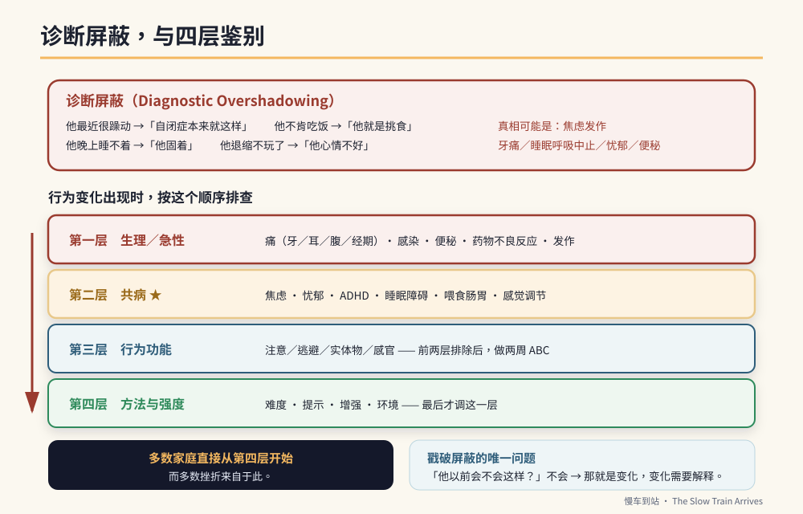

## 背景与痛点

第 35 章说过：「所有方法都试过就是没用」，通常代表**行为功能判断错了**。

那句话是对的，但它不完整。因为还有第三种可能，而且它在实务上非常常见：

> **他身上有第二个问题，而那个问题从来没有被诊断。**

一个十六岁的孩子，如果同时有未被辨识的焦虑症、注意力缺损、忧郁、或睡眠呼吸中止，那么你在第 35 章做的功能评估会得到一堆互相矛盾的数据——因为每一天的他，其实不是同一个大脑状态。

而这件事有一个专有名称，它是本章最重要的一个词：

### 诊断屏蔽（Diagnostic Overshadowing）

**一旦一个人有了智能障碍或自闭症的诊断，他往后的每一个症状，都容易被归因到那个诊断上。**

- 他最近很躁动 → 「自闭症本来就这样」
- 他不肯吃饭 → 「他就是挑食」
- 他晚上睡不着 → 「他固着」
- 他退缩、不玩了 → 「他心情不好」
- 他一直摸肚子 → 「刻板行为」

而真相可能是：焦虑发作、牙痛、睡眠呼吸中止、忧郁、便秘。

**诊断屏蔽是这个族群健康照护里最大的系统性风险**，因为它让可治疗的问题长年不被治疗。而最容易被屏蔽的，正好是最痛苦的那几种：疼痛、焦虑、忧郁。

> ⚠️ **医疗免责**
> 本章列出的是**就医时该提出的观察**，不是诊断准则，更不是自我诊断工具。共病的诊断需要精神科／小儿神经科／复健科等专业评估；此族群的诊断本身就困难（表达受限、症状非典型），更不可能靠一份清单完成。
> 任何用药的开始、调整或停止，一律由医师决定。**特别提醒：这个族群常见多重用药，任何添加药物都应与现有用药一并评估交互作用。**

---

## 核心设计：四层鉴别

行为变化出现时，按这个顺序排查。第 11 章的五块地基是第一层，这一章把第二层补上。

```text
第一层　生理／急性
  痛（牙、耳、腹、经期）· 感染 · 便秘 · 药物不良反应 · 发作
  → 最先排除，因为最快、最可逆、代价最大（第 11、44 章）

第二层　共病 ★ 本章
  焦虑 · 忧郁 · ADHD · 睡眠障碍 · 喂食与肠胃 · 感觉调节（第 47 章）
  → 需要专业评估，时间尺度以「数周到数月的改变」为线索

第三层　行为功能
  注意／逃避／实体物／感官（第 35 章）
  → 前两层排除后，做两周 ABC

第四层　方法与强度
  难度、提示、增强、环境（第 36、37 章）
  → 最后才调这一层
```

**多数家庭直接从第四层开始，而多数挫折来自于此。**

---

## 六类共病：在这个族群长什么样

关键不在于认识这些诊断，而在于认识它们在**表达受限的人身上**的样子——那与教科书上的描述经常不同。

### 一、焦虑

| 一般人的样子 | 在这个族群的样子 |
|---|---|
| 说「我很紧张」 | **固着行为暴增**、反复确认、拒绝出门 |
| 担忧、反刍思考 | 睡不着、易怒、攻击或自伤增加 |
| 回避特定情境 | 对「改变」的耐受度突然下降 |
| 心悸、手抖 | 腹痛、频尿、想吐（身体化） |

**最关键的线索：** 固着与反复确认**忽然变多**，而环境没有明显变化。第 42 章情境 15（校外教学前反复问十七次）就是焦虑的典型表现——而它非常容易被读成「他很番」。

### 二、忧郁

这一项最容易被屏蔽，因为在认知障碍者身上，忧郁**不长成悲伤的样子**。

```text
【该注意的信号】
  □ 原本喜欢的事物失去兴趣（★ 最重要的一条）
    —— 他不想聊火车了、不想去车站了
  □ 技能退化：原本会做的事变得不会、不肯做
  □ 易怒、攻击行为增加（忧郁在此族群常表现为易怒）
  □ 食欲与体重改变
  □ 睡眠改变（早醒或睡不饱）
  □ 动作变慢、表情变少、社交退缩
  □ 新出现的自伤

★ 「他不想讲火车了」在这本书的脉络里是一个大红旗——
  那是动机引擎熄火，而不是固着改善。
```

**常见的触发事件：** 毕业、换机构、换就服员、失去某位重要的人、失去某个角色（第 45 章情境 47）。

### 三、注意力缺损／过动（ADHD）

在此族群相当常见，但常被归入「他就是智能障碍」。

```text
【与智能障碍本身的区分线索】
  · 注意力问题与难度不成比例
    —— 连他很有兴趣、很简单的事也撑不到 5 分钟
  · 冲动：话说完之前就冲出去、危险行为
  · 坐不住的程度在**所有情境**都一样（不只是难的任务）
  · 家族史

【为什么值得辨识】
  ADHD 是**可处置**的（行为介入＋必要时药物）。
  未辨识的 ADHD 会让第 9 章的工作记忆训练、
  第 16 章的抗干扰训练事倍功半——
  你以为在练耐受，其实在练一个没有煞车的引擎。
```

### 四、睡眠障碍

第 11 章讲了睡眠卫生，这里讲的是**需要医疗处置的那一类**。

```text
【要主动告诉医师的】
  □ 打鼾严重、睡眠中呼吸停顿、白天嗜睡
    → 可能是睡眠呼吸中止（在低张力、肥胖、扁桃腺肥大者更常见）
  □ 睡眠中反复抽动、异常姿势、大量流口水
    → ★ 可能是夜间发作，不是睡不好
  □ 睡眠时相明显延后（怎么调都是凌晨才睡着）
  □ 睡眠品质差且已排除环境因素

【为什么重要】
  睡眠呼吸中止会直接造成白天嗜睡、注意力差、易怒——
  而这三项会被完整地误读成「行为问题」或「退步」。
```

### 五、喂食与肠胃

```text
□ 极度挑食（食物种类 < 20 种、拒绝整类质地）
  → 常与感觉调节有关（第 47 章），也可能是吞咽或胃食道逆流
□ 异食（吃非食物的东西）→ 需要评估，含缺铁等生理因素
□ 反复呕吐、进食后不适、夜间咳嗽 → 胃食道逆流
□ 便秘（第 11、44 章）
□ 体重过重或过轻

★ 进食问题在这个族群常被当成「习惯」，
  但它经常有生理基础，而且会直接影响营养与用药吸收。
```

### 六、感觉调节

单独在第 47 章处理。

---

## 实作

### 一、共病筛检清单（家长版）

**这不是诊断工具，是就医时的提问清单。** 勾到任何一项，就在下次回诊时提出。

```text
【变化的时间尺度是关键】
  几小时到几天的变化 → 先想第一层（痛、感染、发作）
  数周到数月的变化   → 想第二层（共病）
  以年为单位的缓慢变化 → 想发展、老化或环境（附录E）

【焦虑】
  □ 固着或反复确认忽然变多，但环境没变
  □ 对改变的耐受度明显下降
  □ 新出现的拒绝出门、拒绝某个场所
  □ 反复腹痛／频尿／想吐，检查无异常

【忧郁】
  □ 对原本最喜欢的事失去兴趣 ★
  □ 技能退化（同时请对照第 3 章红旗：这也可能是神经事件）
  □ 易怒、攻击或自伤增加
  □ 食欲、体重、睡眠改变
  □ 近期有失落事件（毕业、换机构、失去重要的人）

【ADHD】
  □ 连他有兴趣的事也撑不到 5 分钟
  □ 冲动行为（冲出去、抢东西、危险动作）
  □ 所有情境都坐不住，不分难易

【睡眠】
  □ 打鼾严重／呼吸停顿／白天嗜睡
  □ 睡眠中反复抽动或异常姿势 ★
  □ 怎么调都是凌晨才睡着

【喂食与肠胃】
  □ 食物种类极少、拒绝整类质地
  □ 反复呕吐、进食后不适、夜间咳嗽
  □ 吃非食物的东西
  □ 排便异常（第 11 章）
```

### 二、回诊时怎么说

共病评估最大的障碍是**时间**与**表达**。用这个结构，三十秒讲完重点：

```text
【三句话结构】
  1. 什么变了：「他这两个月，原本每天讲火车，现在完全不讲了。」
  2. 时间尺度：「大概从换机构之后开始，两个月，没有好转。」
  3. 已排除什么：「牙齿看过了、排便正常、睡眠时间没变、
                  药没有调整过。」

  → 然后直接问：「这样需不需要评估情绪方面的问题？」

★ 第 3 句是关键。它让医师知道你已经排除了第一层，
  对话可以直接从第二层开始。
```

### 三、如果医师说「他就是这样」

这句话会遇到，而它通常不是敷衍，是**诊断屏蔽的日常版本**。

```text
【有效的回应方式】
  不要争辩诊断，改成描述「变化」：
    「我知道他本来就有这些特质。
     但这件事是这两个月才出现的，而且和他以前不一样。
     以前他不会这样。」

  → 「变化」比「症状」有说服力，因为变化排除了「他本来就这样」。

【还可以做的】
  · 带视频（行为的前后对比）
  · 带纪录（第 1 章的三个指针、ABC）
  · 请学校或机构写一段观察（第三方的描述份量不同）
  · 询问转介：这个族群的情绪与行为评估，
    部分医院有身心障碍者的专门门诊或团队
```

### 四、用药的四个提醒

```text
① 这个族群常见多重用药。添加任何药物前，
   请医师一并查看现有用药的交互作用。

② 部分精神科用药可能影响癫痫发作阈值——
   有癫痫病史者，这件事必须主动提出。

③ 行为介入与药物不是二选一。
   多数情况下，药物处理的是「让他能学」的状态，
   而学什么仍然要靠第 36、37 章。

④ 开始新药后，用第 1 章的三个指针记录两周。
   ★ 你是唯一能提供「用药后行为变化」数据的人。
```

---

## 现场踩雷

**踩雷一：诊断屏蔽。**
把所有变化都归因到原诊断。**判准很简单：他以前会不会这样？如果不会，那就是变化，变化需要解释。**

**踩雷二：把忧郁当固着改善。**
「他最近比较安静，不太讲火车了，是不是进步了？」——**在这本书的脉络里，那是红旗。**

**踩雷三：把焦虑当番。**
反复确认、拒绝出门、固着暴增——这些是焦虑最常见的外显，而处罚它们会让焦虑恶化。

**踩雷四：跳过第一层。**
情绪与行为的变化，最常见的原因仍然是**痛**。牙痛、耳朵发炎、便秘、经期不适——这四项要先排除。

**踩雷五：认为「反正他有智能障碍，治疗也没用」。**
焦虑、忧郁、ADHD、睡眠呼吸中止在这个族群同样**可以治疗**，而治疗后行为表现的改善经常超乎预期。

**踩雷六：自行判读并要求特定药物。**
带观察去，不要带结论去（第 32 章的同一条原则）。

---

## 效益与验收（DoD）

| 项目 | 验收标准 |
|------|---------|
| 认识诊断屏蔽 | 两位照顾者都能说出「他以前会不会这样」这个判准 |
| 四层鉴别已内化 | 行为变化时，能依「生理 → 共病 → 功能 → 方法」排查 |
| 筛检清单已用 | 完成一次共病筛检，勾选项目已在回诊时提出 |
| 三句话 | 能用「什么变了／时间尺度／已排除什么」向医师描述 |
| 红旗区分 | 知道「技能退化」同时可能是神经事件（第 3 章）与忧郁，两者都要就医 |
| 用药安全 | 若已添加精神科用药，已确认与癫痫及现有用药的交互作用 |
| 有记录 | 新药开始后两周的三个指针记录完成 |

> 💡 君之一席话
> 「『他就是这样』这五个字，会让一个可以治疗的痛苦，变成一个没有人处理的日常。**唯一能戳破它的问题只有一个：他以前会不会这样？**」

---


# 第47章　感官：看不见的那个维度

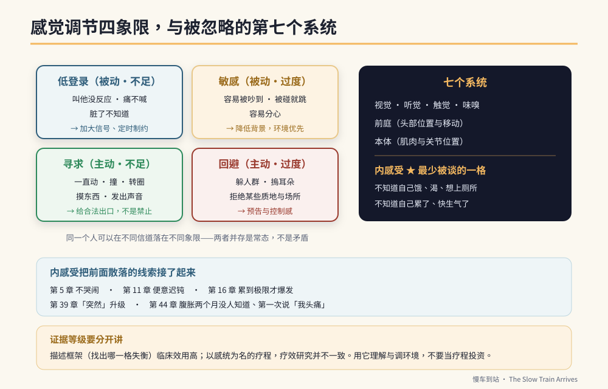

## 背景与痛点

同一间实作教室，对你来说是「有点吵」，对他来说可能是「有人在耳边敲铁板」。

这一章要补的，是全书一直绕着走、却没有正面处理的一个维度：**他接收到的世界，和你接收到的不是同一个。**

它为什么重要，可以用前面章节的三个未解之处来说明：

- 第 16 章：他在家能专注三十分钟，在教室五分钟就撑不住——你以为是专注力，可能是**听觉负荷**。
- 第 35 章：功能是「感官」的行为，代币与处罚完全无效——但书中只说了「找替代」，没说怎么找。
- 第 5 章：婴儿期「不哭不闹」的感觉低反应，十六年后仍然存在——**他到现在还是不知道自己饿了、要上厕所、快生气了。**

第三点是这一章的核心，而它有一个名字，多数家长从来没听过：**内感受**。

> 💡 **先讲证据等级**
> 感觉调节的**描述性框架**（辨识一个人在哪些信道上过度反应或反应不足）在职能治疗与特教实务中被广泛使用，临床效用高。
> 但**以感觉统合为名的疗程**，其疗效研究结果并不一致——这一点第 33 章已经标注过。
> 本章的立场：**用它来理解与调整环境（证据较稳），不要把它当成治疗课程来投资（证据不足）。**

---

## 核心设计

### 一、七种感觉系统

前五种大家都知道，后两种才是关键。

| 系统 | 接收什么 | 失调时的样子 |
|------|---------|-------------|
| 视觉 | 光、动态、颜色 | 怕日光灯闪烁、盯着旋转物、在杂乱环境找不到东西 |
| 听觉 | 声音 | 摀耳朵、对特定声音极度反应、吵杂中无法听指令 |
| 触觉 | 碰触、质地 | 讨厌衣服标签、不喜欢被轻触、却喜欢用力拥抱 |
| 味嗅 | 味道、气味 | 极度挑食、对某些气味反应强烈 |
| **前庭** | 头部位置与移动 | 一直摇晃／转圈，或极度害怕脚离地、怕电梯 |
| **本体** | 肌肉与关节的位置 | 动作笨拙、力道控制差、喜欢推拉重物、撞人 |
| **内感受** | **身体内部信号** | **不知道自己饿、渴、想上厕所、累、生气** |

### 二、内感受：这本书一直在讲、却没有命名的那一块

把前面散落的线索接起来：

```text
第 5 章　婴儿期不哭闹、尿布湿了不吵
第 11 章　对便意的感觉迟钝，需要「定时排便制约」
第 16 章　累到极限才发脾气，因为不知道自己累了
第 39 章　情绪升级到第 ④ 阶段才被发现，因为他察觉不到自己在生气
第 44 章　情境 35（腹胀两个月没人知道）、情境 40（第一次说「我头痛」）

→ 全部都是同一件事：**内部信号传得慢、传得弱、或解读不出来。**
```

这解释了一个长年的困惑：**为什么他总是「突然」爆发？**

因为对他而言，那可能真的是突然的。一般人会经历「有点烦 → 越来越烦 → 快受不了 → 爆发」的渐进，而内感受弱的人可能直接从「还好」跳到「爆发」——中间那几格他读不到。

**这也意味着：第 16 章的「疲劳求助」与第 39 章的「早期前兆」，本质上是在教内感受。**

```text
【内感受训练：三个可以做的】

① 命名身体信号（把内在状态外显化）
   在他明显有生理状态时，替他说出来：
     「你的手在抖，你可能累了。」
     「你一直摸肚子，是不是想上厕所？」
   → 大人先做「翻译」，他才可能学会自己读。

② 身体检查三问（接第 19 章的疲劳自我侦测）
   固定在工作 25 分钟时问一次：
     「手会不会抖？眼睛会不会酸？想不想坐下？」
   → 三个有一个 → 举手说「我想休息一下」。

③ 情绪温度计（0–3 级，配图标）
   平静 / 有点烦 / 很烦 / 受不了
   在他平静时教，在第 ② 阶段用（第 39 章）。
   → 目标不是让他描述情绪，是让他**在爆发前指出一个数字**。
```

### 三、四象限：他是哪一种

同一个人可以在不同信道上落在不同象限——这是最常被误解的一点。

| | **反应不足** | **反应过度** |
|---|---|---|
| **被动（不主动调节）** | **低登录**：叫他没反应、痛不喊、脏了不知道 | **敏感**：容易被吵到、被碰到就跳起来、分心 |
| **主动（会去调节）** | **寻求**：一直动、撞、转圈、摸东西、大声 | **回避**：躲人群、摀耳朵、拒绝某些质地与场所 |

```text
【怎么用这张表】
  · 低登录 → 需要「加大信号」：更明确的提示、更强的对比、
    定时制约（不能等他自己感觉到）
  · 寻求   → 需要「合法出口」：规律的感官活动时段，
    而不是禁止（第 35 章的替代感官输入）
  · 敏感   → 需要「降低背景」：环境调整优先于训练
  · 回避   → 需要「可预测与控制感」：预告、给他一个离开的方式

★ 本书主线的个案在多数信道上偏「低登录」（第 5 章），
  但在听觉上可能偏敏感（第 42 章情境 16）。
  **两者并存是常态，不是矛盾。**
```

---

## 实作

### 一、感官剖析观察表（两周）

不需要专业工具，观察并勾选即可。**目的是找出「哪一个信道、哪一个方向」，不是分类他。**

```text
【视觉】
  □ 在明亮或闪烁的灯下不舒服　□ 喜欢盯着旋转／闪烁的东西
  □ 在杂乱的桌面找不到东西　　□ 对特定颜色或图案强烈偏好

【听觉】
  □ 对特定声音摀耳朵（吸尘器、烘手机、警报）
  □ 在吵杂环境听不懂指令　　　□ 自己会制造声音（哼、敲、学声音）

【触觉】
  □ 讨厌标签、某些布料、剪指甲、洗头
  □ 不喜欢被轻触，但喜欢用力抱　□ 喜欢摸特定质地

【味嗅】
  □ 食物种类极少　□ 拒绝整类质地（湿、糊、脆）
  □ 对气味反应强烈（厕所、油烟、香水）

【前庭】
  □ 一直摇晃、转圈、跑跳　□ 怕脚离地、怕电梯、怕溜滑梯
  □ 坐不住，需要一直动

【本体】
  □ 力道控制差（太用力／太轻）　□ 喜欢推拉重物、钻被子
  □ 动作笨拙、常撞到东西

【内感受】★ 最容易被忽略
  □ 不说饿、不说渴　　□ 不知道要上厕所，或忍到最后一刻
  □ 累到极限才爆发　　□ 痛不喊、生病不说
  □ 情绪像「突然」发生，没有渐进

→ 每一项勾选后，标注方向：不足（↓）或过度（↑）
```

### 二、环境适配清单（比训练更快见效）

**这一段是本章投报率最高的部分。** 环境调整不需要孩子改变任何事，而且当天就能做。

```text
【家】
  □ 固定的低刺激角落（他可以自己去的地方）
  □ 睡前降低照明与噪音
  □ 收纳可视化但不杂乱（开放层架反而更乱 → 用有盖收纳）
  □ 衣物：剪掉标签、选他能接受的材质（这不是宠，是降负荷）

【教室／机构】（写进 IEP 或交接手册）
  □ 座位远离噪音源（门、走廊、机器）
  □ 允许使用降噪耳罩或耳塞（需与老师讨论规则）
  □ 给一个「可以去冷静」的指定位置
  □ 工作区视觉单纯（一次只放当前任务的材料）
  □ 转换时段给预告（第 8 章）

【职场】
  □ 固定工位、固定路线
  □ 高噪音时段的替代任务
  □ 明确的休息时机（不是「累了再说」——他读不到，见内感受）

★ 这些调整不是特权，是**让他能工作的条件**。
  就像近视的人需要眼镜——没有人会说那是特殊待遇。
```

### 三、感官活动时段（给「寻求」型）

```text
【原则】
  · 规律安排，不是等他失控才用
  · 放在需要专注之前（例如：作业前 10 分钟的大动作活动）
  · 选他真的喜欢、且安全的形式

【常见的形式】
  本体觉（多数人接受度最高）：推墙、提重物、搬椅子、
      钻被子、按摩球、咀嚼有嚼劲的食物
  前庭：荡秋千、旋转（★ 有癫痫病史者，
      任何剧烈或长时间的前庭刺激应先问医师）
  触觉：捏黏土、豆子箱、深压（用被子包）

⚠️ 诚实标注：这一类安排在实务上被广泛使用，家长回馈常是正面的，
   但研究证据不一致。**可以做，不要当成主要投资，也不要付高价
   购买「疗程」**——多数形式在家就能做（第 33 章的同一立场）。
```

### 四、把感官接回前面的章节

| 前面的困难 | 感官视角的重新解读 | 该做的 |
|---|---|---|
| 教室待不住（第 42 章情境 16） | 听觉敏感 + 视觉杂乱 | 环境调整优先于抗干扰训练 |
| 电梯一直按按钮（第 43 章情境 27） | 寻求（视觉 + 触觉回馈） | 替代物（计数器） |
| 极度挑食 | 味嗅／触觉敏感 | 质地渐进、与喂食专业合作 |
| 累到爆发（第 16 章） | 内感受不足 | 定时检查 + 身体三问 |
| 便意迟钝（第 11 章） | 内感受不足 | 定时制约，不等感觉 |
| 「突然」爆发（第 39 章） | 内感受不足 | 前兆清单由**大人**创建，不靠他自述 |

**这张表的意思是：** 第 47 章不是添加一堆训练，而是替前面的困难**换一副眼镜**。有些原本要靠训练解决的，换上这副眼镜后会发现——调环境更快。

---

## 现场踩雷

**踩雷一：把感官需求当成问题行为处罚。**
摇晃、摸东西、哼声、撞——这些若是寻求行为，处罚只会压抑而不会消失，而且会增加焦虑。

**踩雷二：花大钱买感统疗程。**
证据不一致。**先做环境调整（免费、当天见效），再谈其他。**

**踩雷三：只看外显的五感，忽略内感受。**
内感受是这一章最重要的一格，也是最少被谈的一格——而它直接连着疲劳、疼痛、情绪、如厕。

**踩雷四：把环境调整当成宠溺。**
耳罩、座位、固定路线——这些是**工作条件**，不是特权。而且它们通常比训练更省力、更快见效。

**踩雷五：贴标签而不行动。**
「他是感觉寻求型」——然后呢？剖析的目的是**找出要调哪一格**，不是分类他。

**踩雷六：前庭活动不问医师。**
有癫痫病史者，剧烈或长时间的旋转、跳跃等活动应先确认。

---

## 效益与验收（DoD）

| 项目 | 验收标准 |
|------|---------|
| 剖析完成 | 七个系统的观察表完成，并标注不足／过度 |
| 环境已调整 | 家庭与学校（或机构）各至少完成 2 项环境调整 |
| 内感受已命名 | 每天至少 1 次替他说出身体信号（「你的手在抖，你可能累了」） |
| 身体三问 | 工作 25 分钟的定时检查已实施满 4 周 |
| 情绪温度计 | 0–3 级的图标已制作，且在平静时教过 ≥ 5 次 |
| 感官时段 | 若为寻求型，已安排规律的感官活动时段（而非危机时才用） |
| 未过度投资 | 没有购买高价疗程；优先做的是环境调整 |
| 已写进文档 | 环境需求已写进 IEP 或第 18 章的交接手册 |

> 💡 君之一席话
> 「他不是突然爆发的。**是他和你，读到的不是同一份信号**——你看到的是十分钟的渐进，他读到的只有最后那一秒。」

---


# 第48章　另一条路径：重度、无口语与多重障碍

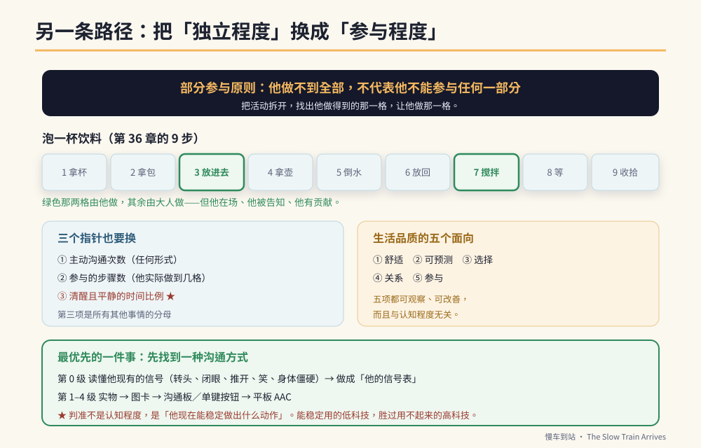

## 背景与痛点

这本书的主线，写的是一个**条件相当好**的孩子。

生活自理完全独立、能简单沟通、情绪勉强可控、有明确且稳定的固着兴趣、人缘好。附录 C 已经诚实承认过：这样的组合在特教族群里属于前段。

而现场的真实分布不是这样。更多的家庭是这样的：

- 完全无口语，或只有几个发音；
- 自理需要大量协助，甚至全部依赖；
- 有严重的自伤或攻击行为；
- 癫痫未受控，每周都有发作；
- 使用轮椅、管灌、或有其他医疗需求；
- 没有明显的、可以拿来当引擎的固着兴趣。

如果你的孩子在这一群，前面四十七章读起来会很刺——**它们缺省的起点，你没有。**

这一章要做的，是把整本书翻译成另一条路径。而翻译的关键只有一个概念：

> **把「独立程度」换成「参与程度」。**

---

## 核心设计

### 一、部分参与原则

这是重度障碍教育领域最重要的一条原则，而它推翻了一个很常见的缺省：

> **「他做不到全部，不代表他不能参与任何一部分。」**

过去的做法是：他做不到，就由大人代劳，他在旁边看（或不在场）。而部分参与原则说：**把活动拆开，找出他做得到的那一格，让他做那一格。**

```text
【范例：泡一杯饮料（第 36 章的 TA-4，共 9 步）】

  主线版本：他自己做完 9 步
  部分参与：他做第 3 步（把茶包放进杯子）与第 7 步（搅拌）
           其余由大人做，但他在场、他被告知、他有贡献

【范例：家庭洗衣】
  他做不到分类与操作机器，但他可以：
    把衣服放进洗衣篮 · 按下开始键 · 把烘好的衣服拿给每个人

【范例：用餐】
  他无法自行进食，但他可以：
    用眼神或图卡选今天要吃哪一道 · 把餐具放上桌 ·
    在喂食时自己握着杯子的一侧
```

**为什么这件事重要，而不只是「安慰」：**

- 参与本身会维持动作与认知功能（不用就会退）；
- 它创造了沟通机会（选择、拒绝、要求）；
- 它给他一个角色，而角色是尊严的基础；
- 对照顾者而言，它把「全部代劳」变成「一起做」——这在三十年的尺度上，差别很大。

### 二、六阶段的替代版

主线的六阶段以「独立完成」为轴。替代版换一个轴：

| 站 | 主线目标（独立） | **替代版目标（参与与沟通）** |
|----|----------------|---------------------------|
| **S1** | 看检核卡完成 2 项 | 创建**可预测的一日结构**与**一种可用的沟通方式**（哪怕只是「是／不是」） |
| **S2** | 两步指令、认面额 | 扩充**选择的机会**：每天至少 10 次「你要 A 还是 B」 |
| **S3** | 三种工具、职场台词 | 扩充**参与的活动种类**：每周有 3 种他能参与一格的家务或活动 |
| **S4** | 干扰下 25 分钟 | 扩充**耐受的时间与情境**：能在有他人的环境中待多久、做多久 |
| **S5** | 陌生主管指令 80% | **场所的类化**：能在家以外的 2 个场所参与同样的活动 |
| **S6** | 每日在岗 4 小时 | **衔接日间服务**：能稳定出席、有喜欢的活动、有人认得他 |

**三个指针也要换：**

```text
主线：情绪回复时间 · 独立完成率 · 指令链长度
替代：
  ① 主动沟通次数（任何形式：眼神、手势、图卡、发声、按钮）
  ② 参与的步骤数（一个活动中他实际做到的格数）
  ③ 清醒且平静的时间比例（★ 对医疗复杂个案，这是最重要的一项）
```

第三项需要解释：对一个癫痫未控制、或有慢性疼痛、或睡眠严重不足的孩子来说，「今天有几小时是清醒而且平静的」比任何技能指针都重要——**因为那是所有其他事情的分母**。

### 三、生活品质作为目标

当独立不是可达成的目标时，该用什么取代？这个领域的共识是**生活品质**，而它可以被拆成可观察的面向：

```text
① 舒适　　　　疼痛、姿势、饥饿、如厕被适时处理
② 可预测　　　他知道接下来会发生什么
③ 选择　　　　他每天有机会决定一些事（哪怕只是二选一）
④ 关系　　　　有人认得他、叫他的名字、知道他喜欢什么
⑤ 参与　　　　他有事可做，而且那件事有真实的结果

★ 这五项每一项都可以观察、可以改善，
  而且**与认知程度无关**——最重度的孩子同样适用。
```

---

## 实作

### 一、先找到一种沟通方式（最优先）

**没有任何事比这件事更重要。** 一个无法表达「不要」「痛」「还要」的人，所有的行为问题都有可能是沟通问题。

```text
【AAC 的分级：从最低科技开始，不要跳级】

  第 0 级　读懂他现有的信号
    ★ 先做这一步：他现在已经在用什么表达？
      转头、闭眼、推开、笑、发某个声音、身体僵硬
    → 把它列成一张「他的信号表」，让所有照顾者用同一套解读
      这一步不需要任何工具，而且立刻有效

  第 1 级　实物选择
    拿出两样真实物品，让他看／碰／拿。
    （对视觉障碍或认知极低者，实物比图卡更容易）

  第 2 级　照片／图卡
    从 2 张开始，不要一次给一整本

  第 3 级　沟通板（多格）／单键语音按钮
    一个按钮先只放一句最有用的话（「还要」或「不要」）

  第 4 级　平板 AAC 软件
    ★ 需专业评估。不是越高科技越好——
      能稳定使用的低科技，胜过用不起来的高科技。

【选哪一级的判准】
  不是「他的认知程度」，是**他现在能稳定做出什么动作**：
    能伸手拿 → 实物或图卡
    只能眼神 → 眼神指向的双选
    只能一个动作（按、挥手）→ 单键按钮
```

### 二、沟通伙伴训练：训练环境，不是训练他

这是重度个案最关键、却最常被忽略的一步。

```text
【核心观念】
  沟通是双向的。若周围的人不知道怎么给他机会、
  不知道怎么读他的信号、不等他反应——
  那么他学会什么都没有用。

【沟通伙伴的五个动作】（训练所有照顾者）
  ① 等　　　　说完后等 10–15 秒（★ 多数人只等 2 秒）
  ② 给选择　　把「要不要吃」换成「要 A 还是 B」（拿出两样）
  ③ 读信号　　依「他的信号表」回应，并说出来：「你看那个，你要那个对不对？」
  ④ 给后果　　他表达了，就给结果——一次没效，信号就会消失（FCT 的同一条铁律）
  ⑤ 制造机会　刻意把东西放在他拿不到的地方、故意漏给一样，
              让他有理由表达（★ 这叫沟通诱发）

【最常见的错误】
  照顾者太熟练了——他还没表达，需求就被满足了。
  「我看他的表情就知道他要什么」——这句话听起来很温暖，
  但它会让他失去所有练习表达的机会。
```

### 三、行为问题：先假设它是沟通

```text
【重度个案的行为处理，顺序与主线相同，但权重不同】

  第一层　痛与医疗（第 46 章）★ 权重最高
    无法表达疼痛的人，行为就是他唯一的表达。
    自伤、攻击、拒食的突然出现，先当成医疗事件。
    特别检查：牙齿、耳朵、便秘、经期、胃食道逆流、姿势不适

  第二层　感官（第 47 章）
    低登录与寻求在此族群更常见；环境调整优先

  第三层　沟通（本章）
    他想说什么？给他一个更省力的方式（FCT）

  第四层　功能与方法（第 35–37 章）

★ 自伤行为若有立即伤害风险（撞头、咬手至破皮），
  **不要自行处理**——需要跨专业团队（医疗＋行为＋职能）介入。
  这是本书明确超出范围的一项。
```

### 四、医疗复杂个案的调整

```text
【癫痫未控制】
  · 训练强度以「发作后的恢复期」为准，不是以「好的那几天」为准
  · 每一项活动都要有中断后的续接方式
  · 三个指针中，「清醒且平静的时间比例」是主指针
  · 学校与机构必须有书面的紧急处置流程（第 39 章）

【管灌／进食困难】
  · 进食时间本身就是沟通与参与的机会（选择口味、按开始）
  · 口腔照护不能省（第 44 章情境 34 的 TA 仍适用，只是由大人运行）

【轮椅／姿势摆位】
  · 姿势不适是行为问题的常见隐形原因
  · 定时变换姿势，并把「不舒服」的信号列进他的信号表

【多重用药】
  · 第 46 章的四个提醒同样适用，而且风险更高
```

### 五、路径的终点：日间服务，而不是就业

```text
【现实的说法】
  主线的终点是小作所或庇护工场。
  这一条路径的终点，多半是**身心障碍者日间照顾中心**——
  以生活自理维持、体能活动、休闲文娱为主。

  **那不是次一等的结果。** 它的目标本来就不同：
  不是产能，是**维持功能、社会参与与生活品质**。

【提前准备的事（与主线相同）】
  □ 提早参访与登记（候补时间可能更长）
  □ 交接手册（第 18 章）——重度个案的交接更关键，
    因为新照顾者无法从他口中得知任何事
  □ 「他的信号表」必须附在手册第一页 ★
  □ 医疗流程、姿势摆位、进食方式、过敏，全部书面化
```

---

## 现场踩雷

**踩雷一：拿主线的标准套用。**
用「独立完成率」评估一个需要全面协助的孩子，只会得到一整年的零——而那会摧毁家长。**换指针，不是降低期待。**

**踩雷二：放弃沟通。**
「他听不懂」「他不会表达」——这两句话一旦成立，往后三十年他就没有声音了。**先从第 0 级开始：他现在已经在用什么表达？**

**踩雷三：太熟练的照顾者。**
需求在表达之前就被满足，是重度个案失去沟通机会的头号原因。

**踩雷四：把自伤当行为问题直接处理。**
先当医疗事件；有立即伤害风险时，需要跨专业团队，不是靠一本书。

**踩雷五：忽略姿势与疼痛。**
不会喊痛的人，用行为喊痛。

**踩雷六：把日照中心当成失败。**
目标不同而已。生活品质的五个面向，在日照中心同样可以全部达成。

---

## 效益与验收（DoD）

| 项目 | 验收标准 |
|------|---------|
| 信号表 | 完成「他的信号表」，所有照顾者用同一套解读 |
| 沟通方式 | 至少一种可稳定使用的表达方式（任何级别） |
| 主动沟通 | 每日主动沟通次数有记录，且四周内呈上升趋势 |
| 选择机会 | 每天 ≥ 10 次二选一的机会 |
| 沟通伙伴 | 主要照顾者都做到「等 10–15 秒」与「刻意制造机会」 |
| 部分参与 | 每周 ≥ 3 个活动，他实际参与其中至少一格 |
| 医疗优先 | 行为变化时，先排除痛与医疗（第 46 章） |
| 生活品质 | 五个面向各有一项具体的观察指针 |
| 交接就绪 | 交接手册完成，且信号表在第一页 |

> 💡 君之一席话
> 「他做不到全部，不代表他不能做那一格。**而那一格——把茶包放进杯子的那三秒——就是他今天在这个家里的位置。**」

---


# 第49章　女儿：被忽略的那一半

## 背景与痛点

这本书从第一页开始，主角就是一个男孩。

那不是刻意的选择，但它反映了一个真实的偏斜：**特殊教育的文献、量表、服务设计与教养书，长期以男性为缺省。** 而这个偏斜造成三个具体的后果，每一个都由女孩承担：

**第一，诊断延迟。** 女性的自闭特质经常长得不一样——固着的主题较「社会可接受」（动物、明星、书），社交上更擅长模仿与伪装，行为问题较少外显。结果是：她撑得住、看起来还好、于是没有人转介，直到青春期崩溃。

**第二，青春期的照护被回避得更彻底。** 第 38 章讲的每一件事，在女儿身上都多了一层——月经、妇科检查、以及更高的侵害风险。而这些是最多家长不知道从何开始的一块。

**第三，性侵害风险更高。** 身心障碍女性遭受性侵害的风险，在多份统计中都明显高于一般人口，也高于身心障碍男性。原因与第 38 章讲过的一样（表达受限、判断力弱、被训练成服从、身体被频繁碰触是日常），只是叠加了性别因素。

这一章不是把前面重写一遍，而是补上**只有女儿会遇到的那几格**。

> ⚠️ **医疗免责**
> 本章涉及月经、经期与癫痫的关联、妇科检查、避孕与生育相关医疗。**全部都是医疗决策，一律由妇产科、小儿科或神经科医师评估。** 任何用药（含调经、避孕、经期用药）的使用与剂量，都必须由医师决定，不可自行处置或参考他人经验。

---

## 一、伪装与诊断延迟

```text
【女孩身上常见、却不被辨识的样子】
  · 固着的主题较「正常」：动物、偶像、书籍、特定朋友
    → 不像火车或旋转物那么显眼，所以没有人觉得奇怪
  · 社交上模仿而非理解：她会照着别人做，看起来合群，
    但代价是**极高的认知负荷**
  · 行为问题内化而非外显：焦虑、退缩、身体不适，
    而不是攻击或破坏
  · 在学校撑住，回家崩溃（★ 最典型的一条）

【后果】
  转介晚、支持少、而她在「看起来还好」的表象下，
  已经消耗了非常多年。
  到青春期一旦撑不住，会被误读为「突然变了」。
```

**这对本书的意义是：** 如果你的女儿符合上面的描述，那么第 17 章的「环境重载与周末崩溃」、第 46 章的焦虑与忧郁，很可能是主戏，而不是配角。

---

## 二、月经照顾：一份完整的工作分析

这是最多家长不知道从何开始、也最常被外部服务忽略的一件事。用第 36 章的方法拆。

```text
【TA-6　月经自我照顾（依认知程度选择支持等级）】

  前置（在初经之前就要教，不是之后）
  1 认识卫生用品：让她摸、拆、看，不带羞耻地命名
  2 认识「血」不等于受伤：用图卡与简单说法先讲一次
  3 创建「私人的地方」概念（第 38 章的场合图）

  更换流程（每一步都要示范，且由同性别照顾者教）
  4 到厕所，关门
  5 脱下裤子，坐下
  6 撕开新的卫生用品包装
  7 取下旧的，对折卷起
  8 用包装纸／卫生纸包好
  9 丢进垃圾桶（★ 不是马桶——这一步要单独教到稳）
  10 粘贴新的（位置：用内裤上的中线对齐）
  11 穿好裤子
  12 洗手

  周期管理
  13 在视觉月历上贴标记（接第 26 章的月历）
  14 出门时包包里固定放 2 片（固定位置，第 25 章的对象管理）
  15 弄脏衣物的处理：换下 → 放进指定的袋子 → 告诉大人

【支持等级】
  完全独立 / 需口头提示 / 需部分协助 / 需完全协助
  ★ 每一级都是合理的结果。目标不是独立，是**有尊严地被处理**。
```

```text
【教学的三个原则】
  ① 提前教：初经之前就开始，不要等到当天
  ② 不带羞耻：用平常的语气，就像教刷牙
  ③ 同性别照顾者优先；若家中无合适人选，
     可请学校护理师、女性亲属或治疗师协助
```

### 经期与情绪、与癫痫

```text
【经期相关的情绪与行为变化】
  · 经前的易怒、疲倦、疼痛，在无法表达的人身上
    会直接以行为呈现（第 46 章的第一层）
  · 做法：在月历上同时记录行为纪录（第 1 章的三个指针），
    两三个月后周期性通常会浮现
  · ★ 一旦看出周期性，那些「莫名其妙的坏日子」就有了解释，
    也可以提前调整训练强度

【经期与癫痫】
  部分女性的发作频率会随月经周期改变（临床上称为
  月经性癫痫 catamenial epilepsy）。
  · 若你在纪录中看到「发作集中在某几天」，**这是必须告诉医师的信息**
  · 处置方式由神经科医师决定，不可自行调整用药

【疼痛】
  经痛在不会表达的人身上，可能表现为蜷曲、拒绝活动、
  易怒、拒食。**先当成痛来处理**（第 44 章情境 40）。
```

---

## 三、妇科照护

这一段的目的不是要求每个人都完成所有检查，而是**让它成为可以被讨论的事**。

```text
【原则】
  · 妇科照护的必要性与一般女性相同，
    但**运行方式需要调整**（减敏、预告、支持）
  · 检查项目与频率由医师依年龄与状况决定
  · 若配合度确实无法达成，与医师讨论替代方案，
    而不是直接放弃追踪

【减敏与准备（接第 44 章情境 31 的做法）】
  1 事前预告：用图卡或简单的话说明会发生什么
  2 在家演练姿势（穿着衣服）
  3 挑选对身心障碍者友善、愿意配合的医疗院所（可请社工协助寻找）
  4 现场：家长或熟悉的照顾者在场；
    请医护在每个动作前说一句「我现在要碰你的 ___，可以吗」
    ★ 这同时在教她第 38 章的界线：即使是医师，也要先问
  5 结束后立刻兑现承诺的奖励

【一件必须说清楚的事】
  妇科检查涉及第 38 章的「红色区域」。
  在教规则时就要把这个例外讲明白：
    「医生检查的时候可以，而且妈妈会在旁边。」
  → 没有事先讲明，会造成两种伤害之一：
    她把检查当成侵害而恐慌，或她学到「医生可以，所以任何人都可以」。
```

---

## 四、风险防护：三层

第 38 章的内容全部适用，这里补上叠加的部分。

```text
【第一层　她自己】
  · 第 38 章的五句话与「没有秘密」规则
  · 特别强化：**任何人都不可以看或碰红色区域**，
    医师检查除外，而且家人要在场
  · 教她辨识「不舒服的感觉」并说出来——
    这需要内感受的支持（第 47 章）

【第二层　照顾的环境】
  · 谁替她洗澡、换衣、如厕协助——**明确、固定、可问责**
  · 随着年龄增长，逐步减少他人协助的必要（教到能自己做的部分）
  · 在机构与学校：明确询问「谁负责如厕协助、在什么空间进行」
  · 任何协助都应在**可被知悉**的安排下进行（不是密室）

【第三层　监测】
  · 突然出现的行为改变、拒绝某个人／某个场所、
    退化、自伤、睡眠剧变 → 都要当成信号查证
  · 身体检查时留意不明伤痕
  · ★ 若怀疑侵害：立即联系学校、社工与相关保护专线并保留纪录，
    **不要先自己查证、不要质问孩子细节**（那会影响后续调查）
```

---

## 五、避孕与生育：一个必须诚实面对的伦理界线

这一节不给答案，但它必须被写出来，因为回避它的代价是——**别人替她决定。**

```text
【历史脉络（不能不知道）】
  身心障碍女性在许多国家曾被系统性地施行绝育手术，
  而那段历史今天仍在影响相关的医疗与法律态度。
  这是为什么所有涉及生育能力的处置，
  在伦理与法律上都需要极其谨慎的进程。

【现实中家庭会面临的问题】
  · 经期照护困难 → 有些家庭会询问「能不能让她不要来」
  · 侵害风险 → 有些家庭会询问避孕
  · 这些提问本身不是错的，但它们涉及她的身体自主权

【本书的立场】
  ① 任何以「照护方便」为主要理由的不可逆处置，都应被高度审慎看待
  ② 涉及生育能力的医疗处置，需要医师、伦理与法律进程共同判断，
     并在可能范围内纳入**她本人的意愿**
  ③ 若她具备部分理解能力，应以她能懂的方式说明并征询
     （这正是第 40 章「支持决策优先于代理决策」的精神）
  ④ 先穷尽侵入性较低的选项：照护技巧训练、环境防护、
     以医师评估的方式处理经期困扰

★ 这一节不会给你答案。它只要求一件事：
  **在做任何决定之前，先问「这是为了她，还是为了我们比较好照顾」。**
  两者都可能是正当的考量，但把它们分开想，决定会不一样。
```

### 更年期

```text
· 智能障碍女性的更年期可能较早出现，且症状常被误读为
  「行为问题」或「退化」
· 热潮红、睡眠改变、情绪波动、骨质健康——
  这些在无法表达的人身上，全部会以行为呈现
· 这是附录 E「三十年」的一部分，值得提前知道
```

---

## 实作：这一章的优先级

```text
【现在就可以做的三件事】
  ① 月经 TA：不论初经来了没有，先把前置的三步教起来
  ② 场合图与五句话（第 38 章）：加上「红色区域」的医疗例外
  ③ 在月历上同时记录周期与行为——两三个月后看有没有周期性

【接下来三个月】
  □ 找到一位愿意配合、对身心障碍者友善的妇科医疗资源
  □ 清点「谁在提供身体协助」，并确认安排是可被知悉的
  □ 若有伪装／在校撑住回家崩溃的模式，
    与老师讨论在校的支持（第 34 章）

【不要急着做的】
  · 任何不可逆的医疗处置
  · 在没有穷尽其他选项前的重大决定
```

---

## 现场踩雷

**踩雷一：因为她「看起来还好」而延后支持。**
伪装的代价是内化的焦虑与忧郁。**在校撑住、回家崩溃，就是需要支持的信号。**

**踩雷二：初经之后才开始教。**
恐慌、羞耻、以及往后每个月的抗拒，多半来自没有预告。**提前教。**

**踩雷三：把经前的行为变化当成退步。**
先看月历。周期性一旦浮现，那些「莫名其妙的坏日子」就有了名字。

**踩雷四：完全放弃妇科追踪。**
配合困难是可以处理的（减敏、友善院所、支持）。**放弃追踪的代价会在很多年后出现。**

**踩雷五：身体协助没有明确安排。**
谁、在哪里、什么情况——这三件事若不清楚，防护的第二层就是空的。

**踩雷六：为了照护方便而做不可逆的决定。**
先问那个问题：这是为了她，还是为了我们比较好照顾。

---

## 效益与验收（DoD）

| 项目 | 验收标准 |
|------|---------|
| 前置教学 | 月经前置三步（认识用品、认识血、私人场合）已教过 |
| 月经 TA | 已写成工作分析，并确定目前的支持等级 |
| 周期记录 | 月历同时记录周期与行为，≥ 2 个月 |
| 医疗已提出 | 若有发作，已向医师报告「发作与周期的关联」 |
| 妇科资源 | 已找到愿意配合的医疗资源，或已请社工协助寻找 |
| 界线例外 | 「医师检查可以、家人在场」的例外已明确教过 |
| 协助可问责 | 家中与机构的身体协助安排明确、固定、可被知悉 |
| 伦理界线 | 未在穷尽低侵入性选项前做出不可逆决定 |

> 💡 君之一席话
> 「她从小就很乖、在学校撑得住、没有人担心过她——**而那正是最该担心的事。** 撑住是有代价的，只是帐单晚几年才寄来。」

---


# 附录A　速查索引

需要用的时候翻这一页。

---

## 一、我现在该读哪一章

| 你的情况 | 直接翻 |
|---------|--------|
| 刚拿到诊断，孩子还小 | 第 33 章（三十个方向）→ 第一年六件事 |
| 孩子十六岁上下，不知从何开始 | 第 1 章（创建基线）→ 第 11 章（地基）→ 第 13 章（S1） |
| 训练做了几周，忽然全面退步 | 第 11 章（五块地基，由下往上查） |
| 孩子出现「原本会的不见了」 | **第 3 章红旗清单 → 当天就医** |
| 他一直讲同一个话题，人缘快被消耗光 | 第 10 章（固着功能化）＋ 第 8 章（计时器） |
| 交办两件事永远只做一件 | 第 9 章（工作记忆链，十六级阶梯） |
| 要准备高职安置或职业评估 | 第 27 章（面试评估） |
| 下周要开 IEP 会议 | 第 34 章（三份文档 + 可评量目标） |
| 孩子快毕业了，还没有着落 | 第 6 章（四条战线）＋ 第 18 章（转衔期） |
| 已经毕业在家 | 第 18 章（朝九晚五的家庭版），今天就开始 |
| 觉得自己快撑不住了 | 第 11 章地基⑤ → **附录 E（家庭与三十年）** → 附录 B（喘息资源） |
| **他最近不太对，但说不出哪里不对** | **第 46 章（共病与诊断屏蔽）——他以前会不会这样？** |
| 他在家可以，在教室就不行 | 第 47 章（感官与环境适配） |
| 孩子无口语／需要大量协助 | **第 48 章（另一条路径）** |
| 孩子是女儿 | 第 38 章 ＋ **第 49 章** |
| 看到不懂的缩写 | 附录 F（术语表） |
| 想知道这本书的依据是什么 | 附录 G（来源与已知限制） |
| **所有方法都试过，就是没用** | **第 35 章（行为功能）——通常是方向选错，不是方法用完** |
| 某个技能怎么教都学不会 | 第 36 章（工作分析：那不是一件事，是十一件事） |
| 给了奖励他还是不做 | 第 37 章（偏好评估、时制、饱足） |
| 他开始有青春期行为，我不知道怎么讲 | **第 38 章（场合、界线、五句话）** |
| 他失控了，我不知道当下该怎么办 | **第 39 章（高峰期只做安全）** |
| 他快十八岁了 | **第 40 章（监护、财产、医疗决定）** |

---

## 二、三个核心指针

| 指针 | 怎么测 | 进步的方向 |
|------|--------|-----------|
| `emotion_recovery_seconds` | 被打断 → 配合下一件事的秒数 | 变小 |
| `independent_task_rate` | 无额外提醒完成的比率 | 变大 |
| `chain_length_max` | 稳定完成的指令步数 | 1 → 2 → 3 |
| `fixation_talk_minutes` | 固着话题总时长 | **不追求变小**，追求在时间框内 |
| `fixation_structured_ratio` | 固着叙述中有结构的比率 | 变大 |

---

## 三、六站与离站标准（摘要，完整版见第 20 章）

| 站 | 一句话标准 |
|----|-----------|
| **S1 奠基期** | 情绪回复 ≤ 2 分；看卡无提示完成 2 项 |
| **S2 转化期** | 跨室两步指令稳定；认得三种面额 |
| **S3 职业探索** | 三种工具可操作；岗位稳定 20 分；两句台词自发 |
| **S4 职场耐受** | 干扰下 25 分；良率 90%；累了会说 |
| **S5 实习期** | 陌生主管 2–3 步指令 80%；工作时段固着抑制 |
| **S6 转衔期** | 每日在岗 4 小时；交接手册已交付 |

**三道门：** 能力门（连续两周）→ 地基门（五块没亮红灯）→ 照顾者门（自检 < 3 项）。

---

## 四、十组教材

| 编号 | 名称 | 练什么 | 章 |
|------|------|--------|---|
| M01 | 谁比较贵 | 比大小 | 22 |
| M02 | 身高检查员 | 比小与规则 | 22 |
| M03 | 车厢点名 | 指物数数与序数 | 22 |
| M04 | 付钱大作战 | 面额与「够不够」 | 23 |
| M05 | 火车便当 | 等值提取 | 24 |
| M06 | 逼逼看余额 | 数值递减 | 24 |
| M07 | 纪念品找零 | 找零动作链 | 25 |
| M08 | 时刻表 | 数字比对 | 26 |
| M09 | 先…然后… | 先后顺序 | 26 |
| M10 | 进站计时器 | 等待耐受 | 26 |

**金钱十级阶梯：** 见第 30 章。**走到第 5 级（找零动作链），社区生活的安全网就有了。**

---

## 四之二、行为功能四选一（第 35 章）

介入之前，先用 ABC 记录两周，然后对这张表：

| 功能 | 判断线索 | 该做 | **不该做** |
|------|---------|------|-----------|
| **① 注意** | 大人一忙就开始；被骂之后更频繁 | 行为时最少反应；没发生时主动给注意 | 斥责、长篇说理（那都是注意） |
| **② 逃避** | 一交办就开始；成功免除任务后停止 | 拆步骤、给选择、教他说「我想休息」 | 「那先不要做了」 |
| **③ 实体物** | 想要就吵；给了就停 | 明确规则、代币制、教他适当要求 | 吵到受不了才给 |
| **④ 感官** | 没有人在也会做；本身就舒服 | 替代感官输入、调整环境 | **代币与处罚几乎完全无效** |

**功能等值沟通（FCT）的两个条件：更省力、且同样有效。** 说了没被回应，这套就死了。

---

## 四之三、危机的六个阶段（第 39 章）

```text
① 平静 → ② 触发 → ③ 激动 ← 黄金介入期 → ④ 高峰 → ⑤ 降温 → ⑥ 恢复

第 ③ 阶段：减少语言（一句 ≤ 7 字）· 你越小声 · 退半步 · 给两个选择 · 暂停要求
第 ④ 阶段：只做三件事 —— 清空环境、保持距离、不说话
          ✗ 说理　✗ 处罚　✗ 抓住他
第 ⑥ 阶段：不要当场算总帐。复盘等到当天稍晚或隔天。

★ 无法确定是不是癫痫发作 → 一律按癫痫处理：
  侧躺 · 移开硬物 · 不塞东西进嘴 · 不压制 · 看时间 · 超过 5 分钟叫救护车
```

---

## 五、必背台词

```text
【给孩子的三句】
  卡住 →「请老师教我，谢谢。」
  太累 →「我太累了，我想休息一下。」
  完成 →「报告老师，我做好了，请检查。」

【异常回报】
  「报告组长，___ 坏了 / 不够了 / 印错了。」

【边界与防卫】
  「这是我的，请你还我。」
  「请不要碰我，谢谢。」
  「我不要，谢谢。」→ 转身离开 → 打电话
  「我要先问我妈妈。」（面对任何陌生人的要求）

【身体界线的五句话】（第 38 章）
  「不要碰我。」
  「我不要。」
  「我要打电话给妈妈。」
  「我要去找老师。」
  「这件事我要跟妈妈说。」
  ★ 两个永远可以说不的例外：碰红色的地方、以及叫你保密。
  ★ 没有秘密——有人叫你不要说，那就一定要说。

【碰别人之前】（第 38 章）
  「我可以拍你的肩膀吗？」→ 对方没回答 = 不可以
  被拒绝时：「好，那我不碰。」
  距离：一只手臂那么远

【给大人的三句】
  结束固着时间 → 一个字都不说，手势 + 指向计时器
  他拿错钱时   →「一百元太小了，买不到门票。我们要拿蓝色的一千元。」
  他等不到时   →「维修长，收银机正在数钱。请你深呼吸，手放好。」
  他等待焦虑时 →「你是站长的小帮手，陪站长一起顾着月台的安全。」
```

---

## 六、四年关键时程

```text
国三上　□ IEP 提出高职方向并列入纪录　□ 留意安置简章
国三下　□ 安置报名与分发　□ 回诊取得最新诊断证明
高职一　□ 参与各项实作课　□ 参访 1 家机构　□ 累积能力证据
高职二　□ 观察最擅长的动手能力　□ 参访第 2 家机构
高职三　□ 职业重建评估与媒合　□ 提早登记候补　□ 转衔会议
毕业前　□ 医疗转衔　□ 交接手册　□ 渐进式报到安排
```

---

## 七、红旗（出现任一项，当天就医）

```text
★ 技能倒退：原本会的忽然不会了
  发作型态改变、频率增加
  单次发作 > 5 分钟 → 叫救护车
  白天异常嗜睡、叫不太醒
  情绪剧变且找不到环境原因
  新出现的步态不稳、手抖
  皮肤红疹（尤其合并发烧或黏膜溃疡）、异常瘀青
  持续呕吐、食欲全失、眼白或皮肤变黄
```

### 永远不要

```text
不要自行停药、调药或改变剂量
不要长时间完全不进食
不要自行运行生酮或蛋白质限制
不要在未经医师确认下加入补充剂
```

> ⚠️ **医疗免责**
> 这份红旗清单是**就医时机的提醒**，不是诊断依据。抗癫痫药物突然停用可能诱发癫痫重积状态。用药的一切决定，请依主治医师。
> 上面这四句与工具包 `railway redflags` 印出来的一字不差——`scripts/check_assets.py` 会比对，让书与工具永远说同一句话。

---

## 七之二、五十情境总索引（第七篇）

> 五十个实战场景的速查表。**先在这里找到最像你现在处境的那一景，再翻回正文。**
> 每一景都附七段拆解（背景／问题／需要的技能／可用工具／这本书怎么做／没有这套方法的窘境／效益）、
> 一句君之一席话，以及一段 🔍 高端点评。

### 第41章　家庭日常十景

| # | 情境 | 主要对应 |
|---|------|---------|
| 1 | 早上七点半，他不肯换衣服 | 8、9、13 |
| 2 | 晚餐时间到，火车话题停不下来 | 8、10 |
| 3 | 手机被收走的那一分钟 | 37、39 |
| 4 | 「顺便帮我拿」永远失败 | 9 |
| 5 | 弟弟的玩具被他拿走 | 31、38、40 |
| 6 | 两个月来第一次，他自己说「我想休息」 | 35、37 |
| 7 | 周末的崩溃：整周忍耐的帐单 | 11、17 |
| 8 | 深夜十一点半，他还没睡 | 11、20 |
| 9 | 他把找零丢在桌上就走了 | 25、36 |
| 10 | 妈妈在讲电话的十五分钟 | 35 |

### 第42章　学校与班级十景

| # | 情境 | 主要对应 |
|---|------|---------|
| 11 | IEP 会议上，老师说「他这方面比较弱」 | 20、34 |
| 12 | 换了代课老师的那一周 | 15、18、39 |
| 13 | 他跑去帮 B 组，被推开了 | 15、38 |
| 14 | 检核卡做得很好，但老师还是一直催 | 9、20 |
| 15 | 校外教学前一晚 | 8、32 |
| 16 | 实作课的噪音 | 16、19、35 |
| 17 | 同学开始躲他 | 10、19 |
| 18 | 老师说「他今天情绪不好」 | 1、35 |
| 19 | 安置评估的仿真施测 | 27 |
| 20 | 学期末，三个指针都没有动 | 11、12、20 |

### 第43章　社区与交通十景

| # | 情境 | 主要对应 |
|---|------|---------|
| 21 | 超商柜台前，后面排了五个人 | 23、24 |
| 22 | 闸门口他不肯往前走 | 24、39 |
| 23 | 火车误点二十分钟 | 26、32 |
| 24 | 有人在月台跟他搭话 | 30、38 |
| 25 | 卖场走失的八分钟 | 17、38 |
| 26 | 大雨天的月台 | 32 |
| 27 | 他在电梯里一直按按钮 | 35 |
| 28 | 悠游卡余额不足的红灯 | 24、30 |
| 29 | 通勤梯度三：妈妈在后面看着 | 17 |
| 30 | 有人要他帮忙签名 | 30、38、40 |

### 第44章　医疗与身体十景

| # | 情境 | 主要对应 |
|---|------|---------|
| 31 | 抽血的那五分钟 | 10、38 |
| 32 | 回诊十分钟，你只能说三件事 | 11 |
| 33 | 半夜两点的发作 | 4、39 |
| 34 | 他不肯刷牙 | 36 |
| 35 | 他两个月来只排便过几次 | 11 |
| 36 | 药快吃完了才发现 | 13 |
| 37 | 他在客厅做私人的事 | 38 |
| 38 | 牙医说「要拔智齿，需要全身麻醉」 | 40 |
| 39 | 换成人科的第一次回诊 | 18、40 |
| 40 | 他说「我头痛」——第一次 | 5、38 |

### 第45章　职场与转衔十景

| # | 情境 | 主要对应 |
|---|------|---------|
| 41 | 实习第一天的地图 | 17、19 |
| 42 | 组长说「这个先不要做，改做那个」 | 27、32、39 |
| 43 | 产在线的贴纸用完了 | 31 |
| 44 | 第一次领到奖励金 | 30、40 |
| 45 | 同事一直翻他的包包 | 31、38 |
| 46 | 机构报到的第一周 | 18 |
| 47 | 毕业后第三个月，他不想去了 | 11、35 |
| 48 | 就服员打电话来：「他今天说太累了」 | 35 |
| 49 | 二十岁生日：银行说要本人办理 | 40 |
| 50 | 一个普通的星期三 | 全书 |

---

## 八、每一章的一句话

| 章 | 一句话 |
|----|--------|
| 1 | 先创建基线，再谈努力 |
| 2 | 基因报告回答「为什么」，不回答「现在怎么办」 |
| 3 | 越上层的漏斗，漏掉的代价越大 |
| 4 | 几率低，但漏掉的代价是一个大脑 |
| 5 | 时序不是因果 |
| 6 | 开发期结束了，转衔期开始了 |
| 7 | 三条核心；标不出核心的活动就不做 |
| 8 | 把嘴巴闭上，把手指向计时器 |
| 9 | 那五秒的沉默，是他大脑唯一在锻炼的时候 |
| 10 | 火车不是症状，是动机引擎 |
| 11 | 训练失效时，先查地基，再检讨方法 |
| 12 | 阶段对应能力，不对应年级 |
| 13 | 把规则从嘴巴移到墙上 |
| 14 | 一句话装两件事，一张票学会付钱 |
| 15 | 给他一个职称，和一条明确的工作边界 |
| 16 | 累的时候会说，比做得快值钱 |
| 17 | 把他最没用的执着，兑现成最有用的能力 |
| 18 | 结构要在毕业当周就接上 |
| 19 | 加值不是踩深油门，是换宽轮胎 |
| 20 | 「算不算会了」是一个有定义的问题 |
| 21 | 不要教数学，教他二十五岁会用到的那几件事 |
| 22 | 你教比大小，他学的是「我付得起哪一个」 |
| 23 | 别把整个钱包递出去 |
| 24 | 让他相信一件看不见的事 |
| 25 | 手还没收回来，交易就还没结束 |
| 26 | 等待要有看得见的终点 |
| 27 | 考的不是他多聪明，是他坏掉的时候会怎样 |
| 28 | 三百条的真相是六十几种方法加上换装 |
| 29 | 「请教我」三个字，比一百个词汇有用 |
| 30 | 走到第五级，他就安全了 |
| 31 | 最不起眼的一条：东西坏了会不会说一声 |
| 32 | 八条华丽的生化防线，说穿了是「不要缺诊」 |
| 33 | 这不是后照镜，是给下一台车的头灯 |
| 34 | 了解要先翻译成可验收的一句话，才会变成资源 |
| 35 | 「什么方法都试过了」通常是方向错了，不是方法用完了 |
| 36 | 「他学不会」十次有九次是「我没有把它切开」 |
| 37 | 增强物不是你给的东西，是行为变多的那个原因 |
| 38 | 我们教了十六年听话，却没把「不」放进他手里 |
| 39 | 那一刻的工作不是让他认错，是让五分钟安全过去 |
| 40 | 你无法回答「我不在了怎么办」，但可以让答案不是「没人知道」 |
| 41 | 把话变成图，你就把那二十分钟赚回来了 |
| 42 | 「情绪不好」是一个没有出口的句子，换成三栏字就有方向 |
| 43 | 「小心一点」不是安全措施，一件连帽外套才是 |
| 44 | 他不会说他不舒服，所以纪录是最便宜的排查工具 |
| 45 | 你花四年换到的不是奇迹，是一个普通的星期三 |
| 46 | 「他就是这样」会让可治疗的痛苦变成没人处理的日常 |
| 47 | 他不是突然爆发，是你们读到的不是同一份信号 |
| 48 | 他做不到全部，不代表他不能做那一格 |
| 49 | 她从小很乖、在学校撑得住——那正是最该担心的事 |

---


# 附录B　台湾资源与工具速查

> ⚠️ **这一页的使用方式**
> 台湾的身心障碍与特教服务，**制度名称、申请条件、评估工具与承办单位会随法规调整，且各县市不同**。这份速查给的是「有哪些方向、该问谁、用什么关键字查」，**不是最新的办法条文**。
> 每一项在实际申请前，都请向**学校转衔老师**或**户籍地社会局（处）身心障碍福利科**确认。

---

## 一、毕业后的四种主要去向

| | **社区日间作业设施（小作所）** | **庇护工场** | **日间照顾中心** | **支持性就业** |
|---|---|---|---|---|
| 本质 | 具作业活动的日间服务 | 具庇护性质的**就业场所** | 生活照顾为主的日间服务 | 一般职场 + 就业服务员支持 |
| 身分 | 学员 | **劳工**（签订劳动契约） | 服务用户 | 受雇者 |
| 劳健保 | 无（多依附家属或国民年金） | **有** | 无 | 有 |
| 收入 | 作业奖励金（金额有限） | 依产能核薪的薪资 | 无 | 薪资 |
| 每日压力 | 较低，活动多元 | 中至高，有产量与出货压力 | 低 | 视职场而定 |
| 费用 | 通常需负担部分费用（依规定可能有补助） | 不需缴费（是去上班） | 通常需负担部分费用 | 不需缴费 |
| 适合谁 | 能简单沟通、自理佳、情绪大致可控 | 具一定作业能力与产能耐受 | 自理或认知较需协助 | 能力较佳，可适应一般职场 |

**现实的建议顺序：** 多数具备「自理独立 + 情绪可控 + 能简单沟通」条件的孩子，小作所是最稳定的起点；能力较好的可在高三由职业重建人员评估是否尝试庇护工场或支持性就业。

**都要提早看。** 名额经常需要候补，而候补不会照你的毕业日期排。

---

## 二、关键角色：谁能帮你

| 角色 | 在哪里 | 能帮你什么 |
|------|--------|-----------|
| **特教老师 / 导师** | 学校 | IEP、日常教学调整、行为策略 |
| **转衔老师** | 学校（高中职阶段） | 毕业去向、转衔通报、与校外单位联系 |
| **学校社工 / 辅导老师** | 学校 | 家庭支持、资源转介 |
| **职业重建个案管理员** | 县市劳工主管机关 | 职业评量、就业方向媒合 |
| **就业服务员（就服员）** | 机构 / 就业服务单位 | 职场适应、现场支持 |
| **机构社工 / 个管员** | 小作所、日照、庇护工场 | 收案评估、日常服务规划 |
| **医院个管师 / 社工** | 医院 | 就医协助、资源转介、诊断证明流程 |
| **辅具中心人员** | 各县市辅具资源中心 | 沟通辅具、生活辅具的评估与补助 |

**一个实用的做法：** 把这些人的联系方式建成一个清单，存在手机里。**在需要的那一天，你不会有时间去查谁是谁。**

---

## 三、证明、鉴定与申请（查找关键字）

```text
【身心障碍证明】
  · 承办：户籍地公所 / 社会局（处）
  · 流程概要：先至公所提出申请 → 至指定医院鉴定 →
    需求评估 → 核发证明
  · ★ 注意「效期」与「重新鉴定」时程，过期会影响服务资格
  · 查找关键字：身心障碍鉴定 需求评估 + 县市名

【特殊教育鉴定与安置】
  · 承办：县市教育局（处）特殊教育科 / 鉴辅会
  · 高中职阶段：留意每年公告的「身心障碍学生适性辅导安置」简章
  · 查找关键字：适性辅导安置 简章 + 年度 + 县市名

【毕业转衔】
  · 学校端会进行转衔通报，衔接成人服务
  · ★ 主动确认：转衔数据有没有送出、送到哪里、谁承接

【预防接种受害救济】
  · 承办：卫生福利部相关审议机制
  · 性质：属于「无法排除关联」的社会补偿，
    不等同科学因果认定（第 5 章）
  · 查找关键字：预防接种受害救济

【经济与照顾支持】
  · 身心障碍者生活补助、辅具补助、交通补助
  · 临时及短期照顾（喘息服务）
  · 查找关键字：身心障碍 福利 + 县市名
```

---

## 四、沟通辅具（AAC）与视觉工具

```text
【最低成本的起点：自制图卡】
  · 六格需求图卡：我要喝水 / 我要上厕所 / 我不舒服 /
    我想休息 / 我做完了 / 我需要帮忙
  · 材料：打印 + 护贝 + 魔鬼毡（文具店都有）
  · ★ 用「实物照片」，不要用插图

【高端：平板沟通软件】
  · 市面上有多款中文 AAC 应用程序，功能与价格差异大
  · ★ 建议先由语言治疗师或辅具中心评估再购买
  · 免费替代方案：用图库创建「需求照片文件夹」也可以起步

【辅具补助】
  · 各县市辅具资源中心可协助评估与申请
  · 查找关键字：辅具资源中心 + 县市名

【视觉计时器】
  · 红色区块随时间消失的物理计时器
  · 网络可购得，价格不高，是本书最常用的单一工具
  · 替代方案：手机 App（但会伴随屏幕诱惑，实体较佳）
```

---

## 五、教具采购清单（对应第 21 章）

```text
【一定要有】
  □ 视觉计时器（实体）　　　　　　　□ 护贝机 + 护贝膜
  □ 真钞（家中循环使用）　　　　　　□ 各种硬币
  □ 孩子自己的钱包（有拉链）　　　　□ 悠游卡或一卡通
  □ 魔鬼毡、可擦拭彩色笔　　　　　　□ A4 / A6 卡纸
  □ 按压计数器

【印刷品（自行打印）】
  □ 台铁票价表（他常搭的区间）　　　□ 游乐园票价表
  □ 简化时刻表（3–5 班）　　　　　　□ 便当 / 商品价格卡
  □ 设施身高限制卡　　　　　　　　　□ 需求图卡（六格）

【手部练习】
  □ 安全剪刀（圆头起步）　　　　　　□ 各种抹布
  □ 喷雾瓶　　　　　　　　　　　　　□ 夹链袋
  □ 纸胶带、双面胶　　　　　　　　　□ 夹子

【记录】
  □ 一本笔记本或月历（三个指针，每天不超过三分钟）

★ 全部加起来约一至两千元。不需要专业教材、
  不需要订阅课程、不需要买任何一套「疗育系统」。
```

---

## 六、照顾者的资源

```text
【喘息】
  · 身心障碍者临时及短期照顾服务
  · 查找关键字：临时短期照顾 + 县市名

【心理支持】
  · 学校辅导室、医院社工
  · 各县市社区心理卫生中心
  · 若情绪困扰持续，身心科或心理咨商
  ★ 照顾者的忧郁是常见的，而且是可以处理的（第 11 章）

【家长团体】
  · 各障别的家长协会、地区性家长团体、在线社群
  · 价值：信息、经验、以及「不是只有我」这件事
  ★ 提醒：社群里分享得最多的通常是状况最严重的个案，
    那是社群的功能，不是母体的分布（第 2 章）
```

---

## 七、判断信息可信度的四个问题

网络上关于这个领域的信息极多，品质差异极大。用这四个问题筛：

```text
① 它有没有告诉你「这件事的证据强度」？
   → 把所有建议讲得同样肯定的，通常不可靠。

② 它的机转解释是不是过度精确？
   → 「补充 X 能提高 Y 的穿透率 Z%」这种说法，
     在缺乏引用时要打折。

③ 它会不会叫你不要看医生？
   → 任何暗示「这个方法可以取代医疗」的内容，直接关掉。

④ 它有没有在卖东西？
   → 不是说卖东西就不可信，但要知道那会影响论述。
```

**这四个问题，也适用于检验这本书。**

---


# 附录C　现实校准：这本书不能做到的事

这一份附录的功能，是把整本书往回拉一点。

前面三十四章写的是「怎么做」，语气是肯定的——因为一份充满「可能」「或许」「视情况而定」的操作手册，没有人运行得下去。但肯定的语气有代价：它会让读者以为这一切比实际上更确定。

这一份附录还债。

> ⚠️ **医疗免责**
> 本附录检讨的内容包含用药、营养与检查相关的宣称。所有医疗决策——包含要不要验、验什么、用什么药、剂量多少——一律由主治医师依实际状况判断。本书指出某些流传说法证据不足，**不代表可以据此改变任何医嘱**。

---

## 一、先承认四件事

### 承认一：这套计划改变的是功能，不是诊断

它不会提升智商，不会让诊断消失，不会让语言迟缓「赶上」。

它改变的是**功能**：他能自己做到什么、能撑多久、能不能求助、能不能在一个地方待下来。

这个区别很重要，因为它决定了你怎么衡量成败。如果你期待的是「他变得比较聪明」，四年后你会觉得失败；如果你要的是「他早上七点半会自己起床、搭车去一个有人等他的地方、做四小时的事、累了会说、下班回家」——那四年是够的。

### 承认二：这套六阶段没有实证研究支持

必须说得很清楚：**本书的六阶段架构、三大核心、十六级指令阶梯、十组教材，都不是经过对照试验验证的疗程。**

它们是：一个家庭四年培育计划的完整规划，加上临床实务与特教现场的常见做法，经过整理、校准、补上检核标准之后的产物。

其中的个别元素（视觉结构化、代币制、提示褪除、AAC、社交脚本、功能性数学）**在特教与行为介入领域有相当程度的实务基础**；但把它们组成这样一套四年计划、并宣称这个顺序有效——**那是编排，不是证据**。

**你可以把它当成一份有结构的起点，不要把它当成保证。**

> 🔍 **第六篇是个例外，而这个例外值得说清楚**
> 第 35–37 章的内容——**功能性行为评估、功能等值沟通训练、工作分析与连锁、提示褪除、增强时制**——与前五篇的地位不同。
> 它们是应用行为分析与特殊教育领域**发展数十年、有大量研究支持、且被广泛纳入专业训练与实务指引**的核心方法。它们不是这本书的发明，也不是某一次咨询的产物。
> 相对地，第 38–40 章（身体界线、危机处理、法律转衔）属于**实务共识与制度说明**：做法有专业依据，但具体形式因地区、法规与个别状况而异——特别是第 40 章，**制度会修正，请以你办理当年的现行法令为准**。
> 一句话：**第六篇的前三章，是这本书里证据最强的部分；而它们被放在最后，只是因为方法学在没有情境时读不进去。**

### 承认三：这是 n = 1

书中的个案是一个人。他的特质组合——外观正常、自理独立、情绪可控、人缘好、有强烈且稳定的固着兴趣——**在特教族群里属于条件相当好的一群。**

如果你的孩子是完全无口语、有严重自伤行为、癫痫未受控、或自理仍需大量协助，这本书的**方法学总则**（三核心、地基优先、可评量标准）依然适用，但**六阶段的时程与教材难度需要整组往后调**，而且必须与治疗团队一起调。

### 承认四：时程一定会不准

四年跑完六站，是理想值。实务上：

- 卡在 S1 半年很常见；
- 卡在 S2 一年也不算异常；
- 环境转换（新学校、新机构）通常会让进度暂停一到三个月；
- 一次生病、一次用药调整、一段睡眠混乱，都可能吃掉一整个月。

**如果你把时程当成承诺，你会在第二年就觉得自己失败了。**

---

## 二、六条让训练不伤人的铁律

这六条的共同点是：**违反它们的代价，通常由孩子承担。**

### 铁律一　地基优先于方法

训练失效时，排查顺序是：放电与用药 → 睡眠 → 饮食与血糖 → 肠道 → 照顾者状态 → **然后才是方法**。

违反的后果：把生理问题当成行为问题，孩子被要求「更努力」，而他其实是累的、痛的、或大脑正在放电。

### 铁律二　一次只有一个主战场

每学期只主推一条核心，其他两条维持不加难度。

违反的后果：三条同时推，通常三条都退，而家长会归因为「这套方法没用」。

### 铁律三　停损规则要写在开始之前

每一项训练都要有 `stop_rule`：什么情况降阶、什么情况暂停。

违反的后果：孩子已经在明显抗拒了，大人还在推——那是「训练变成创伤」的标准路径，而且会伤到往后所有的训练。

### 铁律四　说了要算数

他说「我太累了」，就要真的让他休息。
你说「等一下去看火车」，就要真的去。
你说「红色不见就结束」，就不能延长。

违反的后果：预告失效、求助句死亡、代币制崩溃。**这一类信用一旦破产，重建要花的时间远超过你当初省下的那五分钟。**

### 铁律五　安全永远优先于训练

月台、马路、闸门、机具、陌生环境——这些场合的规则是安全规则，不是训练项目。

孩子在现场失控时，正确的处理是**立刻离开现场**，不是坚持完成流程。

违反的后果：不需要解释。

### 铁律六　照顾者的续航力是计划的上限

一份需要完美父母才能运行的计划，不是好计划——它只是把失败的责任转嫁给家庭。

所有强度设计都以「能持续两年」为上限。**宁可少，不要断。**

---

## 三、我在整理时删掉了什么

这一节是这本书最不像书的一节，但它可能是最有用的一节——因为你未来还会遇到很多类似的数据，而这一节示范的是**怎么读它们**。

### 删掉的第一类：过度精确的机转解释

| 早期草稿的说法 | 问题 | 本书的处理 |
|---------------|------|-----------|
| 「反式脂肪使细胞膜僵硬，降低神经元对抗癫痫药物的敏感度」 | 机转推论跨了太多层，缺乏支持 | 删除。减少油炸与加工食品的理由已经够多 |
| 「加工食品的磷酸盐会加速水分流失，增加神经元不稳定性」 | 同上 | 删除 |
| 「高蛋白粉会使血氨短暂升高，加剧前额叶固着焦虑」 | 把生化指针与行为直接连接，跨度过大 | 删除 |
| 「长期便秘 → 毒素吸收 → 血氨升高 → 加剧癫痫风险」 | 在肝功能正常者身上不成立 | **改写**：监测血氨的理由来自**药物本身**，不是便秘（第 11 章） |
| 「手部精细动作区与布洛卡区高度重叠，练手能练语言」 | 相邻不等于重叠；共演化假说不能直接推论 | **改写**为保守版本（第 27 章） |
| 「水中加微量电解质可提高药物在血脑屏障的穿透良率」 | 无支持 | 删除 |
| 「连续 1000 天无放电，髓鞘化才能顺畅进行」 | 数字没有来源 | **改写**为「规律服药、依医嘱追踪」 |

**共同特征：** 这些说法都**方向未必错**（少吃油炸、规律服药、练手部动作，本来就该做），但它们用了一个站不住的理由。

而用错的理由做对的事，有一个隐藏成本：**下一次你会用同样的推理方式，做出错的决定。**

### 删掉的第二类：看起来精确、但没有来源的数字

| 早期草稿 | 本书的处理 |
|---------|-----------|
| 「病因分配：先天基因触发 65%、微观结构 20%、代谢 10%、疫苗 <5%」 | 保留**排序**，明确标示这是临床推论式的分配，**不是流行病学统计**（第 5 章） |
| 「同水平个案中具备完全自理 + 情绪可控 + 好人缘的比例 < 5%」 | 删除数字，改为质性描述：「这个组合并不常见」 |
| 「这 30 个方向的终极能力，他已经达成 80% 以上」 | 删除百分比，改为「拿这张清单当镜子照」 |

**原则：** 数字会被记住、会被引用、会被写进 IEP。**没有来源的数字，杀伤力比没有数字更大。**

### 删掉的第三类：清单的重复

第 28 章已经完整说明：三百个编号 → 291 条有内容 → 237 条唯一 → 实质约六十到八十种。

**这不是谁的失误，是「分十几次逐段扩充」这种格式的必然结果。** 而理解这一点，才能把清单用对——把它当变体产生器，不当待办清单。

### 保留但降级的：感觉统合类介入

前庭刺激、深压、触觉输入这一类方法，在职能治疗实务中被广泛使用，家长回馈也常是正面的。但研究证据并不一致。

本书的处理：**保留，标注「强度：低到中」，并明确说「可以做，不要当成主要投资」**（第 33 章）。

---

## 四、九十天务实导入路线

如果你今天才拿到这本书，接下来三个月这样走。

```text
【第 1–14 天　只做基线】
  □ 每天记三个数字（第 1 章），不超过三分钟
  □ 两位大人先对「起点事件」的定义
  □ ★ 这两周什么都不改——它是你未来两年唯一的对照组

【第 15–30 天　只补地基】
  □ 挂号回诊，带「四段信息」（第 11 章）
  □ 固定起床时间；睡前 30–60 分钟无屏幕
  □ 拿掉日常含糖饮料
  □ 完成两周睡眠日志
  □ 照顾者自检；若达 3 项，先找喘息
  ★ 这一段不做任何行为训练

【第 31–60 天　S1 三步骤】
  □ 三格视觉检核卡上线（第 13 章）
  □ 视觉计时器五步骤 SOP（第 8 章）
  □ 消退爆发预告：前两周会变糟，不改规则
  □ 每周回顾一次三个指针的趋势

【第 61–90 天　第一次判定 + 加一组教材】
  □ 对照 S1 离站标准（第 20 章），做第一次判定
  □ 不论过或没过，加入 M01（谁比较贵）一组教材
  □ 准备下学期的 IEP：写三个可评量目标（第 34 章）

【九十天后你会有的东西】
  · 一条基线与 12 周的趋势
  · 一份回诊纪录与睡眠日志
  · 一张真的在用的检核卡
  · 三个可以写进 IEP 的目标
  · 以及一个知道「红色不见就结束」的孩子
```

**九十天不够改变一个孩子，但足够改变一个家庭的运作方式。** 而后者才是四年计划真正的载体。

---

## 五、反模式清单

出现以下任何一项，停下来重看对应章节。

| 反模式 | 为什么有害 | 对应章 |
|--------|-----------|--------|
| 用嘴巴煞车（一直说「不要再讲了」） | 加重他最弱信道的负荷，让固着更难停 | 8 |
| 把固着当人质（「不乖就不准讲火车」） | 拆掉唯一运转中的引擎 | 10 |
| 用提醒把任务救回来 | 救了这一次的家事，赔了这一次的训练 | 9 |
| 为了进度放宽标准 | 会在下一站以更大的代价回来 | 20 |
| 带着检查清单去门诊 | 妨碍临床判断；该带的是观察纪录 | 11、32 |
| 只在家里练 | 情境数 = 1，乘积永远上不去 | 28 |
| 周末继续加训 | 周末的功能是修复；违反它，周一会更差 | 17 |
| 一次改十件事 | 全部撑不过三周 | 13 |
| 把技能倒退当成叛逆 | 错过医疗事件 | 3 |
| 用年级决定阶段 | 地基没补就推进，必然崩盘 | 12 |
| 自行加补充品或改饮食疗法 | 交互作用与检验干扰 | 4、11 |
| 只讲困难、不讲优势 | 孩子被安置到支持等级过高的组别 | 34 |
| 没做功能评估就一直换方法 | 功能若是感官，代币与处罚永远无效 | 35 |
| 把多步骤技能当成一件事教 | 他卡在哪一步，你永远不会知道 | 36 |
| 拿食物、水、如厕当筹码 | 那不是行为介入，是剥夺基本需求 | 37 |
| 回避青春期与身体界线 | 代价全部由孩子承担；也是被害风险的来源 | 38 |
| 在高峰期讲道理或压制 | 延长高峰、造成受伤、破坏信任 | 39 |
| 缺省一定要办监护声明 | 可能超出实际需要，剥夺的是他数十年的自主 | 40 |

---

## 六、回到那个核心命题

这本书从头到尾在讲一件事：**把固着变成技能。**

但真正的命题比这句话再深一层。

一个十六岁、智力落后、语言迟缓的孩子，不会因为这四年变成另一个人。他二十岁的时候，仍然会讲火车，仍然听不懂复杂的句子，仍然需要别人替他处理很多事。

这套计划要换到的，不是「正常」。是**尊严**——

他有一个地方要去。
他有一件事会做。
他有一句话可以说出口。
他身边有人认得他，知道他喜欢火车。

而这四件事，加起来就是一个成年人的生活。

> 💡 君之一席话
> 「你不是在把他变成别人。**你是在确保，当有一天你不在的时候，他仍然有一班车可以搭，有一个地方会等他，有一句话能替自己说。**慢车开得慢，但慢车会到站——而到站的意思，从来就不是变成快车。」

---


# 附录D　个案化附录：把这本书变成「他的」那一本

## 这一份是什么

前面所有章节都是通用的：孩子叫 J，药名写成「抗癫痫药物」，学校写成「特教班」，时程写成「国三上」。

**因为那些章节会被别人看到。**

而你需要的是另一种东西：一份写着他的名字、他的药、他的老师、他的时刻表的手册。这一份附录就是那个东西的**模板**。

> 🔍 **为什么要分成两份**
> 这本书的主角没有同意过任何一份出版品，而他目前也不具备同意的能力。在他能替自己决定之前，把可识别的部分留在家里，是写这本书的人唯一能做的补偿。
> 技术上这件事是被强制运行的：`scripts/check_book.py` 会检查主线章节有没有出现可识别词，出现就让建置失败。名单放在 `.privacy_terms`（已排除于版控之外），一行一个。

---

## 怎么使用这一份

```text
【方式一：手写（推荐给多数家庭）】
  把这一份打印出来，用手写填。放在家里固定的位置。
  ★ 手写版不会外流、不会被同步到云端、不会被误传。

【方式二：另存私人档】
  拷贝这一份，另存为  附录D_个案化.private.md
  （仓库的 .gitignore 已排除 *.private.md，不会进版控）
  ★ 真实姓名、校名、医师名一并写进 .privacy_terms，
    让检查脚本替你守住主线章节。
```

---

## 一、基本数据

```text
姓名：____________________　　小名／他喜欢被叫的称呼：____________
生日：______年___月___日　　　目前年龄：____岁
角色称号（第 15 章）：________________（家庭与学校共用同一个）

身心障碍证明
  类别：__________　等级：__________　证号：__________
  核发日期：__________　　★ 效期／重新鉴定时程：__________

就学
  学校：__________　年级：______　班别：__________
  导师：__________　电话：__________
  特教老师：__________　电话：__________
  转衔老师（高中职阶段）：__________　电话：__________
```

---

## 二、医疗（以医师书面数据为准）

> ⚠️ **医疗免责**
> 这一节填写的是**医师已经给你的信息**（诊断证明、病历摘要、药袋、回诊单），目的是让它们集中在一处、随时可取用。**不要自行填入你推测的内容**，也不要依据这份表格做任何用药判断。剂量、服药时间与任何调整，一律以医嘱为准。

```text
诊断：________________________________
发病经过（一句话）：____________________________________

主治医院／科别：________________　医师：____________
回诊频率：____________　下次回诊：______年___月___日

目前用药
  药名 __________　剂量 __________　服药时间 __________
  药名 __________　剂量 __________　服药时间 __________
  ★ 一律依医嘱，不可自行增减或停用

已知过敏／禁忌：________________________________

重要检查纪录
  脑电图（EEG）：______年___月，类型：常规／睡眠，结论：__________
  脑部影像（MRI）：______年___月，结论：__________
  基因检测：______年___月，方法：__________，结论：__________
  ★ 是否有 VUS 需要重新判读：□ 是（下次询问日期：______）□ 否 □ 不清楚

发作信息
  平常的发作型态：________________________________
  平常持续时间：约 ____ 分钟
  叫救护车的判准：发作超过 5 分钟，或连续发作间意识未恢复
  已知的诱发因子：□ 睡眠不足　□ 发烧　□ 疲劳　□ 其他：________

生病时的处置（回诊时问医师，把答案写在这里）
  可以用的退烧药：________________
  吐掉药要不要补、怎么补：________________
  什么情况直接送急诊：________________
```

---

## 三、目前位置（每学期更新一次）

```text
更新日期：______年___月___日

三核心快筛（第 7 章）
  C1 神经控制力：___ / 5
  C2 工作记忆链：___ / 5
  C3 固着功能化：___ / 5
  → 这学期的主战场：__________（只能一个）

目前站别（第 12 章）：S___　　进站日期：______年___月

三个指针（第 1 章）
  emotion_recovery_seconds　中位数：______ 秒
  independent_task_rate　　　　　　：______
  chain_length_max（十六级的第几级）：第 ___ 级

固着
  主题：________________________
  每日总时长：约 ______ 分钟
  结构化比率：______

教材进度（第四篇）
  已上线：□M01 □M02 □M03 □M04 □M05 □M06 □M07 □M08 □M09 □M10
  金钱十级阶梯（第 30 章）：目前第 ___ 级
```

---

## 四、他的使用说明（给任何要照顾他的人）

**这一段是整份附录最有价值的部分。** 它就是第 18 章交接手册的家庭版——写好之后，任何代班的亲戚、新来的老师、机构的就服员，都能在五分钟内知道怎么跟他相处。

```text
【他最擅长的三件事】
  1. ________________________________
  2. ________________________________
  3. ________________________________

【怎么交办事情给他】
  · 一次 ___ 件事
  · 说完请他覆诵：「你说一次。」
  · 给视觉检核卡，让他自己打勾
  · 卡住时先等 5–10 秒，再用手势指方向
  · 不要连续口头催促

【他的固着，以及怎么处理】
  主题：____________
  工作时间他会克制；休息时间可以聊
  他碎念时：五指并拢向前的手势 + 指向检核表
  ★ 不要跟他口头争辩
  他焦虑时，这个主题反而是最好的安抚工具

【他的三句话】
  「____________________」＝ 他卡住了
  「____________________」＝ 请让他休息（说了要真的准）
  「____________________」＝ 他完成了

【什么情况要打电话给我】
  · 疑似发作、意识改变
  · 连续两天以上明显的行为改变或退步
  · 他说了「我太累了」但休息后仍无法回到工作
  · ________________________________

【紧急联系】
  家长：__________　电话：__________
  备用：__________　电话：__________
```

---

## 五、资源清单（第 6 章开始创建）

```text
【已参访的机构】
  名称 __________　类型 __________　距离 ______ 分钟
    收案条件：____________　候补状况：____________
    联系人：__________　电话：__________　参访日期：______

  名称 __________　类型 __________　距离 ______ 分钟
    收案条件：____________　候补状况：____________
    联系人：__________　电话：__________　参访日期：______

【关键联系人】（附录 B 的角色表）
  转衔老师：__________　　　　职业重建个管员：__________
  机构社工：__________　　　　医院个管／社工：__________
  辅具中心：__________

【过渡方案】（如果毕业时还没排到）
  ________________________________________________
```

---

## 六、能力证据索引

```text
文件夹位置（实体或手机图库）：________________

已收录的证据
  □ 使用视觉检核卡（日期：______）
  □ 完成家事／代工（日期：______）
  □ 在超商独立结帐（日期：______）
  □ 操作工具（日期：______）
  □ 通勤／搭车（日期：______）
  □ 与同侪交互（日期：______）
  □ 老师的正面评语（日期：______）

★ 每学期至少添加 3 项。四年后这本文件夹在会议桌上的
  说服力，远超过任何形容词（第 34 章）。
```

---

## 七、时间轴（每年更新）

```text
______年　　　　　　　　目前：S___
  □ 上学期 IEP 会议日期：______　提出的三个目标：________________
  □ 下学期 IEP 会议日期：______
  □ 回诊：______ / ______ / ______
  □ 机构参访：______
  □ 重新鉴定／证明效期检查：______

【下一个关键时间点】
  ________________________________（日期：______）
  要做的准备：____________________________________
```

---

## 八、维护这份附录

```text
每月　□ 更新用药观察表　□ 补一张能力证据
每学期　□ 更新第三节（目前位置）　□ 更新 IEP 目标
每年　□ 检查身心障碍证明效期　□ 更新第五节资源清单
      □ 更新「他的使用说明」（他会变，说明也要跟着变）

★ 更新之后，把「他的使用说明」那一页重印一份，
  给学校、给机构、给常照顾他的亲戚各一份。
```

> 💡 君之一席话
> 「这份附录不是纪录，是**交接文档**——交给老师、交给机构、交给有一天你不在时，那个要接手照顾他的人。**你脑子里的那些知识，只有写下来，才会跟着他走。**」

---


# 附录E　家庭与三十年：手足、照顾者，与老化

这本书讲了四年。但这个家庭要走的是三十年。

前面所有章节的主词都是孩子。这一份附录的主词换成**家庭**——因为所有的训练、所有的阶段、所有的工具，最后都要由一组会累、会老、会生病、会有自己人生的人来运行。

而这件事，在多数教养书里是一句「家长要照顾好自己」就带过的。

---

## 一、慢性悲伤：那个不会结束的东西

有一个概念，多数特教家长没有听过，但听到的当下通常会松一口气，因为它替一种说不出口的感受命名了：

> **慢性悲伤（chronic sorrow）**：一种周期性回来、不会真正结束的哀伤。

它与一般的哀伤不同——一般的哀伤有个终点，时间会冲淡；而慢性悲伤会在特定时刻**重新回来**：

```text
【它通常在这些时候回来】
  · 同龄孩子的里程碑（毕业典礼、上大学、结婚、生孩子）
  · 每一次诊断或评估报告
  · 每一次转衔（换学校、毕业、进机构）
  · 弟妹超越了他
  · 过年、家族聚会、亲戚问「他现在怎么样了」
  · 深夜，没有原因的时候
```

**重要的是：这不是「还没走出来」，也不是心理不健康。** 它是一种对持续存在的失落的正常反应。知道它有名字、知道它会周期性回来、知道它回来不代表你失败了——这件事本身就有帮助。

```text
【可以做的】
  · 预期它：在里程碑季节（毕业季、开学、过年）提前知道自己会不好过
  · 说出来：对伴侣、对朋友、对同侪团体
  · 不要在那几天做重大决定
  · 若持续影响生活功能（睡眠、食欲、工作、对孩子的耐性），
    那已经超出慢性悲伤的范围 → 见下一节
```

---

## 二、照顾者的心理健康

第 11 章把「照顾者状态」列为第五块地基，并给了一份自检。这里把它展开。

```text
【自检（每月一次，诚实作答）】
  □ 最近两周，我平均每天睡不到 6 小时
  □ 最近两周，我曾经对孩子大吼或失控
  □ 最近一个月，我没有任何一段完全属于自己的时间（≥ 2 小时）
  □ 我很久没有跟朋友见面或讲电话了
  □ 我觉得只有我一个人在做这些事
  □ 我对以前喜欢的事失去兴趣
  □ 我常常觉得没有希望
  □ 我有时候希望这一切结束

  勾到 3 项以上 → 这个月的第一优先不是加强训练，是找喘息
  勾到最后两项的任何一项 → 请与医疗或心理专业人员谈谈。
  ★ 照顾者的忧郁在这个族群的家庭中并不罕见，而且是可以处理的。
```

**两件必须说清楚的事：**

**第一，求助不是失能。** 一个接受治疗的照顾者，比一个硬撑的照顾者，能照顾得更久、更好。这不是鸡汤，是算术：三十年的尺度上，续航力比爆发力重要。

**第二，这本书的强度设计以「照顾者能持续」为上限。** 第 12 章的三道门里有一道是照顾者门；那不是客套，是设计。**一份需要完美父母才能运行的计划，不是好计划——它只是把失败的责任转嫁给家庭。**

```text
【喘息：把它当成必需品，不是奢侈品】
  · 各县市的身心障碍者临时及短期照顾服务（附录 B）
  · 家族内的轮替（★ 需要明确排班，不能靠「有空再说」）
  · 机构的日间服务本身就是喘息
  · 每周固定的一小段时间（哪怕只有两小时），比一年一次的长假有用

【一个实务建议】
  把喘息**排进行事历**，像回诊一样。
  没有排进去的休息，永远不会发生。
```

---

## 三、伴侣与婚姻

```text
【三个常见的裂缝】
  ① 分工不均：多数家庭中，主要照顾者是同一个人，
     而另一人的参与被视为「帮忙」而不是「责任」
  ② 因应方式不同：一方想查数据、找方法、做计划；
     另一方想暂时不谈。两者都是正常的因应，
     但互相会被读成「你不在乎」或「你太执着」
  ③ 对孩子未来的想像不同：一方觉得要争取独立，
     另一方觉得不要太勉强他

【可以做的】
  · 把分工写下来（谁负责回诊、谁负责联系学校、谁负责记录）
  · 每个月有一次「不谈孩子」的时间 ★
  · 对规则的不一致，在孩子不在场时处理（第 8 章）
  · 若冲突持续，伴侣咨商不是最后手段，是合理选项
```

---

## 四、手足

第 41 章情境 5 已经触及，这里完整处理。

```text
【手足的三种常见处境】
  ① 过早成熟：被期待懂事、体谅、帮忙，而自己的需求排后面
  ② 隐形：家庭的注意力长期集中在一边
  ③ 对未来的沉默恐惧：「以后是不是我要照顾他？」
     —— 这个问题多数手足很早就在想，但很少有人问他们

【要做的三件事】
  ① 给他专属时间
     不必多，但要固定、要可预期、而且不被取消。

  ② 诚实回答那个问题
     不要说「你不用担心」（那不是真的，他也知道不是真的）。
     可以说：「以后的事我们会安排好，会有机构、会有钱的安排，
     不会全部丢给你。等你长大一点，我们会一起讨论你愿意做多少。」
     → 见第 40 章的「如果我不在了」文档。

  ③ 让他有拒绝的空间
     手足有权说「我做不到全部」，而那不是不孝。
     **把角色写清楚，比把责任压上去有用。**

【手足自己的资源】
  · 各地有手足支持团体（在线与实体）
  · 学校辅导室
  · ★ 手足的心理健康同样值得被关注，而且经常被漏掉
```

---

## 五、长辈与家族

```text
【最常见的三种压力】
  ① 归因与指责：「是不是那时候……」「都是你们……」
  ② 否认：「他只是比较慢，长大就好了」「不要什么都说是病」
  ③ 过度介入：不同的规则、偷偷给零食、觉得你太严格

【处理原则】
  · 对长辈的目标是**让话题结束**，不是让他理解神经学（第 5 章）
  · 给一句固定的、简短的说法，重复使用
  · 规则的一致性优先：可以请长辈「不运行」，
    但不要让他「运行相反的」
  · 家族聚会前先预告与安排（对孩子与对自己都是）
```

---

## 六、三十岁以后：老化与退化

这一段是全书时间轴最远的一段，也是最少被谈的。

```text
【要知道的三件事】

① 智能障碍者的老化可能提早
   健康问题、体能下降、认知变化可能比一般人更早出现。
   这不代表每个人都会，但**规划时要把它算进去**。

② 退化不是必然，但要能分辨
   40 岁之后出现的技能下降，可能是：
     · 感官退化（视力、听力）→ 可矫正 ★ 先查这个
     · 甲状腺功能、维生素缺乏、忧郁 → 可治疗
     · 药物累积影响 → 可调整
     · 疼痛（关节、牙齿）→ 可处理
     · 失智 → 需要评估与长期规划
   ★ 顺序与第 46 章相同：先排除可逆的。

③ 特定族群的失智风险较高
   例如唐氏症族群的早发性阿兹海默症风险明显较高，
   临床上有既定的追踪建议。
   **若你的孩子属于已知的高风险族群，这件事要主动问医师。**

【要创建的一件事：功能基线】
  在他状况最好的时候（例如 25–30 岁），
  记录一份完整的功能描述：
    他会做哪些事、怎么沟通、日常作息、喜欢什么
  → 这份基线是往后判断「他是不是退化了」的唯一参照。
    没有基线，退化通常要到很严重才会被发现。
```

### 双老家庭

```text
【现实】
  当他 40 岁，你 70 岁。
  照顾者的体力、健康与经济能力都在下降，
  而被照顾者的需求可能在上升。

【要提前处理的四件事】
  ① 居住：他能不能在你无法照顾时，仍住在熟悉的地方？
     或者需要提前衔接住宿型服务（而那通常需要排队很久）
  ② 财务：第 40 章的信托与财产规划
  ③ 医疗决定：谁能代为决定（第 40 章）
  ④ 信息：所有的数据写下来，并且至少两个人知道在哪里

★ 这四件事的共同点是：**都需要在你还健康的时候做。**
```

---

## 七、一份给家庭的年度查看

每年做一次，建议与身心障碍证明效期检查一起做。

```text
【孩子】
  □ 目前站别与三个指针的年度趋势
  □ 功能基线是否需要更新
  □ 医疗：回诊、检查、用药查看
  □ 服务：目前的机构是否仍合适

【照顾者】
  □ 自检（本附录第二节）
  □ 今年有没有真的休息过
  □ 自己的健康检查做了吗 ★（最常被跳过的一项）

【家庭】
  □ 分工是否需要调整
  □ 手足的状况与意愿
  □ 「如果我不在了」文档是否更新（第 40 章）
  □ 财务与法律安排是否仍合适

【最后一题】
  □ 这一年，我们家有没有做过一件与障碍无关的、快乐的事？
```

> 💡 君之一席话
> 「你把所有的力气都用在让他撑到二十岁，然后发现真正的问题是——**你要撑到七十岁。** 而这件事，没有任何一份 IEP 会替你规划。」

---


# 附录F　术语表

全书用到的缩写与专有名词，按类别排列。**每一条都标了第一次出现的章节**，想看完整说明就翻回去。

> ⚠️ **医疗免责**
> 表中的医疗名词只是**词汇解释**，不是诊断准则、不是治疗建议。任何诊断、检查与用药（含表中提到的生酮饮食等处置）都必须由医师评估决定。

---

## 一、本书自订的代号

| 代号 | 意思 | 章 |
|------|------|---|
| **C1** | 神经控制力（抑制控制）——三大核心之一 | 7、8 |
| **C2** | 工作记忆链——三大核心之一 | 7、9 |
| **C3** | 固着功能化——三大核心之一 | 7、10 |
| **S1–S6** | 六大阶段：奠基／转化／职业探索／职场耐受／实习／转衔 | 12–18 |
| **M01–M10** | 十组功能性数学教材 | 21–26 |
| **D1–D3** | 教材的三个维度：数值与大小／金钱与等价／时间与串行 | 21 |
| **DoD** | Definition of Done，离站标准——本书指「可评量的完成定义」 | 20 |
| **三道门** | 离站判定：能力门／地基门／照顾者门 | 12、20 |
| **五块地基** | 放电与用药／睡眠／饮食与血糖／肠道／照顾者 | 11 |

---

## 二、行为与教学方法

| 词 | 意思 | 章 |
|----|------|---|
| **FBA**（功能性行为评估） | 找出行为为谁服务的评估方法 | 35 |
| **ABC**（前事—行为—后果） | 行为记录的三联式 | 35 |
| **行为的四大功能** | 获得注意／逃避回避／获得实体物／感官自动增强 | 35 |
| **FCT**（功能等值沟通训练） | 用更省力且同样有效的说法，取代问题行为 | 35 |
| **诊断屏蔽** | 症状被归因到原诊断，导致可治疗的问题不被治疗 | 46 |
| **TA**（工作分析） | 把技能拆成可观察、顺序固定的小步骤 | 36 |
| **连锁** | 前向／后向／全工作呈现三种教学顺序 | 36 |
| **提示褪除** | 从肢体协助逐级退到无提示（P→M→V→G→I） | 9、36 |
| **时间延宕** | 先立刻给提示，再逐次延后 | 36 |
| **最少提示法** | 从最少的提示开始，不行才往上加 | 36 |
| **消退爆发** | 介入初期行为短暂恶化，是生效的信号 | 8 |
| **增强时制** | 连续→固定比率→变动比率 | 37 |
| **变动比率** | 平均 N 次给一次，最抗消退的时制 | 37 |
| **饱足／剥夺** | 增强物给太多会失效；平常拿不到则价值升高 | 37 |
| **普里马克原则** | 先做低频的事，才能做高频的事 | 37 |
| **偏好评估** | 找出真正的增强物（询问／单一刺激／配对选择） | 37 |
| **代币经济** | 代币＋兑换清单＋换取比率的完整制度 | 10、37 |
| **类化** | 换材料、地点、人、时间仍然成立 | 36 |
| **维持** | 停止教学后，一段时间仍然保有 | 36 |
| **多重范例训练** | 从一开始就用多种材料／场所教，提高类化 | 36 |
| **部分参与原则** | 做不到全部，仍可参与其中一格 | 48 |
| **沟通伙伴训练** | 训练环境中的人，而不只是训练当事人 | 48 |
| **行为升级六阶段** | 平静→触发→激动→高峰→降温→恢复 | 39 |
| **去升级** | 在激动期降低刺激与要求，让曲线转回 | 39 |

---

## 三、沟通与感官

| 词 | 意思 | 章 |
|----|------|---|
| **AAC**（扩大与替代沟通） | 图卡、沟通板、语音输出等替代口语的方式 | 6、48 |
| **PECS**（图片兑换沟通系统） | 以交换图卡进行沟通的系统化方法 | 33 |
| **共同注意** | 与他人共享对同一事物的注意 | 33 |
| **社交脚本** | 把社交场合写成固定的 1-2-3 步骤 | 15、29 |
| **感觉调节四象限** | 低登录／寻求／敏感／回避 | 47 |
| **内感受** | 对身体内部信号的觉察（饿、渴、尿意、疲劳、情绪） | 47 |
| **前庭觉** | 头部位置与移动的感觉 | 33、47 |
| **本体觉** | 肌肉与关节位置的感觉 | 33、47 |
| **伪装**（camouflaging） | 以模仿掩盖社交困难，女性较常见 | 49 |

---

## 四、医疗与诊断

| 词 | 意思 | 章 |
|----|------|---|
| **ASD**（自闭症类群障碍） | — | 3 |
| **ADHD**（注意力不足／过动症） | — | 46 |
| **DLD／SLI**（发展性／特异性语言障碍） | 智力正常但语言明显落后 | 3 |
| **CAS**（童年言语失用症） | 知道要说什么，但无法协调发音动作 | 2 |
| **DEE**（发育性及癫痫性脑病） | 基因异常同时造成发育迟缓与癫痫 | 3 |
| **LKS**（兰道-克莱夫纳症候群） | 癫痫-失语谱系，常伴夜间放电与语言倒退 | 3 |
| **CSWS** | 睡眠期癫痫电状态 | 3、11 |
| **EEG**（脑电图） | 常规与**睡眠**脑电图不是同一件事 | 3、11 |
| **MRI**（磁振造影） | — | 3 |
| **CMA**（染色体芯片分析） | 侦测较大片段的重复／缺失 | 2、3 |
| **WES／WGS**（全外显子／全基因组定序） | 侦测单点突变 | 2、3 |
| **VUS**（意义未明变异） | 不是「有病」也不是「没事」，是证据不足 | 2 |
| **de novo**（新发突变） | 父母基因正常，生殖细胞拷贝时的随机错误 | 2、5 |
| **IEM**（先天性代谢异常） | 酵素或运输缺陷造成毒素累积 | 4 |
| **GLUT1 缺乏症** | 大脑葡萄糖运输障碍，生酮饮食为正式治疗 | 4 |
| **ADEM**（急性弥漫性脑脊髓炎） | 免疫反应引发的中枢神经发炎 | 5 |
| **癫痫重积状态** | 发作过久或连续发作间意识未恢复——医疗急症 | 39、44 |
| **月经性癫痫** | 发作频率随月经周期改变 | 49 |
| **慢性悲伤** | 周期性回来、不会真正结束的哀伤 | 附录E |

---

## 五、制度与服务（台湾）

| 词 | 意思 | 章 |
|----|------|---|
| **IEP**（个别化教育计划） | 学校为身心障碍学生拟定的个别化计划 | 34 |
| **鉴辅会** | 特殊教育学生鉴定及就学辅导会 | 6、34 |
| **适性辅导安置** | 高中职阶段的身心障碍学生安置管道 | 6、34 |
| **转衔** | 从教育体系衔接到成人服务的过程 | 6、18 |
| **小作所** | 社区日间作业设施——有作业活动的日间服务 | 6、18 |
| **庇护工场** | 具庇护性质的就业场所，适用劳基法 | 6、18 |
| **日间照顾中心** | 以生活自理、体能、休闲为主的日间服务 | 6、48 |
| **支持性就业** | 一般职场 + 就业服务员支持 | 6 |
| **职管员** | 职业重建个案管理员 | 17、附录B |
| **就服员** | 就业服务员 | 18、附录B |
| **身心障碍证明** | 需注意效期与重新鉴定时程 | 6、附录B |
| **监护声明** | 使受监护人成为无行为能力人，由监护人代理 | 40 |
| **辅助声明** | 特定重要行为需辅助人同意，保留较多自主 | 40 |
| **CRPD** | 身心障碍者权利公约；核心精神之一为**支持决策优先于代理决策** | 40、49 |
| **安养信托** | 由受托机构依约定分期给付，避免大额一次入帐 | 40 |
| **喘息服务** | 身心障碍者临时及短期照顾 | 11、附录B |
| **双老家庭** | 照顾者与被照顾者同时老化 | 附录E |

---

## 六、工具包（`impl/`）

| 词 | 意思 |
|----|------|
| `railway` | 本书的零依赖 CLI 工具 |
| `record` / `report` | 每日三指针记录与周报 |
| `gate` | 离站判定（三道门） |
| `drill` | 教材题目产生器（seed 可重现） |
| `abc` / `function` | ABC 记录与行为功能统计 |
| `assets` | 产生打印用 SVG（检核卡、代币板、价格卡、时刻表、工作分析卡） |
| `redflags` | 红旗清单与「永远不要」 |

---

> 💡 **一个使用建议**
> 这份表最实用的时机，是**开会之前**。IEP 会议、职评、跨专业讨论——当对方用了一个你不确定的词，能立刻查到，会让整场对话的位置完全不同。

---


# 附录G　来源与延伸阅读

## 为什么需要这一份

这本书花了整个附录 C 谈证据等级，批评「看起来精确但没有来源的数字」，并示范了「做对的事，用对的理由」。

**然后它自己没有给出任何一条可追溯的来源。**

那是一个内在矛盾，而这一份附录要处理它——用它做得到的方式。

---

## 一、先说清楚这份附录不是什么

**它不是文献回顾，也不是引用清单。** 这本书的写作方式不是从研究文献出发，而是从一个家庭的实际处境出发，再对照专业领域的共识加以校准。因此：

- 我**不会**在这里列出我没有逐条查证过的期刊、卷期与页码——那正是这本书批评过的行为；
- 我**会**逐章标明「这一章的内容属于哪一类依据」，以及**你该去哪里查证**。

> 💡 **给要拿这本书去谈事情的人**
> 如果你要把书中的内容用在正式场合（IEP 会议、鉴定、医疗沟通、专业报告），**请不要引用这本书**。
> 请用它当作**问题清单**：带着它去问医师、问治疗师、问特教老师、查官方数据。这本书的价值在于帮你问对问题，不在于当作依据。

---

## 二、四种依据等级

全书的内容可分成四类。往下每一章都会标。

| 等级 | 意思 | 可信度与使用方式 |
|------|------|----------------|
| **A　领域共识** | 在特殊教育、应用行为分析、职能治疗的专业训练与教科书中被广泛教授的方法 | 可放心使用；细节仍应与治疗师确认 |
| **B　官方制度** | 法规、政府服务、申请流程 | **必须以你办理当年的官方公告为准**（会变动） |
| **C　临床／实务常见做法** | 现场广泛使用、专业人员普遍接受，但研究证据强度不一 | 可以做，但不要当成保证 |
| **D　本书的编排与推论** | 阶段顺序、指针设计、教材外壳、比喻 | **这是编排，不是证据**（附录 C 已声明） |

---

## 三、逐章的依据类型

| 章 | 主要依据 | 特别说明 |
|----|---------|---------|
| 1 基线 | D（记录方式）＋ A（数据本位决策的精神） | 三个指针的选择是本书的编排 |
| 2 基因地图 | C（科普层级整理） | **基因清单为文献能见度排序，非盛行率**；已在章内声明 |
| 3 鉴别诊断漏斗 | C＋A | 红旗清单属临床常识；漏斗顺序是本书的整理 |
| 4 代谢异常 | C | 新生儿筛检与特定疗法属既定医疗，细节依医师 |
| 5 疫苗与因果 | C＋D | **几率分配为临床推论式，非流行病学统计**；已在章内声明 |
| 6 十六岁定位 | B（服务制度）＋ A（转衔概念） | 制度细节请依当年官方 |
| 7–10 三大核心 | **D**（架构）＋ A（各项技术） | 三核心的分法是本书编排；底下的技术是领域共识 |
| 11 神经地基 | C＋A | 各项营养建议已逐项标注强度 |
| 12–20 六阶段 | **D** | 时程与顺序是编排，不是实证疗程 |
| 21–27 教材 | D（外壳与编号）＋ A（功能性数学的概念） | 教材设计是本书的；功能性课程是领域共识 |
| 27 面试评估 | C | 评分向度依各县市与年度不同 |
| 28 方法学总则 | D | 强度公式是本书的整理 |
| 29–32 三百法 | D（归类）＋ C（各条方法） | 清单本身的分析在章内已完整说明 |
| 33 三岁三十向 | C，并逐项标注强度 | 感统类已标为低到中 |
| 34 说服体系 | B＋C | 会议策略属实务；制度依官方 |
| **35 行为功能** | **A** | FBA／FCT 是应用行为分析的核心方法 |
| **36 工作分析** | **A** | TA／连锁／提示褪除／类化是特教核心方法 |
| **37 增强** | **A** | 增强时制、偏好评估属行为分析基础 |
| 38 身体界线 | A（教学方法）＋ C（性教育实务） | 风险陈述属领域共识，未逐条引用统计 |
| 39 危机处理 | C＋A | 升级曲线属实务框架；癫痫处置属医疗常识 |
| 40 法律 | **B** | **制度会修正，务必以当年法令为准；本书非法律意见** |
| 41–45 情境百景 | D（情境）＋ 各章依据 | 情境为叙事化呈现，方法回到对应章 |
| **46 共病** | **A**（诊断屏蔽概念）＋ C | 盛行率未给数字，仅给「常见」的定性描述 |
| 47 感官 | C，并已声明疗效证据不一致 | 描述框架可用；疗程投资需谨慎 |
| **48 另一条路径** | **A** | 部分参与原则是重度障碍教育的核心原则 |
| 49 女儿 | C＋B | 风险陈述属领域共识；医疗与伦理进程依专业 |
| 附录 A–D | D | 索引、资源、校准、模板 |
| 附录 E | C | 慢性悲伤为既有概念；老化风险依个别诊断 |

---

## 四、该去哪里查（比书单更有用）

### 制度与服务（台湾）

```text
【身心障碍服务】
  · 卫生福利部社会及家庭署（身心障碍福利、服务类型）
  · 各县市社会局（处）身心障碍福利科
  · 关键词：身心障碍 需求评估／社区日间作业设施／庇护工场

【特殊教育】
  · 教育部特殊教育通报网（全国性信息、转衔通报）
  · 各县市教育局（处）特殊教育科 / 鉴辅会
  · 关键词：适性辅导安置 + 年度 + 县市名／IEP

【就业】
  · 劳动部劳动力发展署（职业重建、支持性就业、庇护性就业）
  · 各县市劳工局（处）
  · 关键词：职业重建个案管理／庇护性就业服务

【辅具与 AAC】
  · 各县市辅具资源中心
  · 关键词：辅具评估 补助 + 县市名

【法律】
  · 法律扶助基金会
  · 关键词：监护声明／辅助声明／安养信托／身心障碍者财产信托

【权利框架】
  · 身心障碍者权利公约（CRPD）中文版与国家报告
  · 关键词：CRPD 支持决策／合理调整
```

### 专业方法（要找专业人员，不是找书）

```text
【行为介入】
  找谁：行为治疗背景的心理师、受过行为分析训练的特教教师
  关键词（中）：功能性行为评估／正向行为支持／行为功能介入方案
  关键词（英）：functional behavior assessment、
               functional communication training、
               positive behavior support

【教学设计】
  找谁：特教教师、职能治疗师
  关键词（英）：task analysis、chaining、prompt fading、
               time delay、generalization、partial participation

【沟通】
  找谁：语言治疗师（AAC 评估）
  关键词（英）：AAC、communication partner training、
               aided language stimulation

【感觉】
  找谁：职能治疗师
  关键词（英）：sensory processing、interoception
  ★ 查的时候一并看「疗效证据」的讨论，不要只看方法介绍

【共病】
  找谁：儿童青少年精神科、小儿神经科、复健科
  关键词（英）：diagnostic overshadowing、
               intellectual disability mental health
```

---

## 五、判断你查到的东西可不可信

附录 B 给过四个问题，这里再放一次——因为它同样适用于**检验这本书**：

```text
① 它有没有告诉你「这件事的证据强度」？
   → 把所有建议讲得同样肯定的，通常不可靠。

② 它的机转解释是不是过度精确？
   → 「补充 X 能提高 Y 的穿透率 Z%」这种说法，在缺乏引用时要打折。

③ 它会不会叫你不要看医生？
   → 任何暗示「这个方法可以取代医疗」的内容，直接关掉。

④ 它有没有在卖东西？
   → 不是说卖东西就不可信，但要知道那会影响论述。
```

---

## 六、这本书已知的限制（一次列清）

```text
□ 未逐条引用原始研究——本附录的存在就是为了承认这件事
□ 未经医师、律师、行为分析师或特教教师的正式审阅
□ 未经家长试读验证
□ 主线个案为单一男性青少年，条件优于族群平均（附录 C）
□ 制度信息以撰写时的台湾为准，会过期
□ 第 46–49 章为补强，深度不及专门书籍
□ （已解除）工具包 impl/ 的完整测试已实际运行：
   pytest 160 项全过、覆盖率 95.3%、mypy strict 零错误、ruff 零警告、
   零依赖 selftest 35 项、变异测试 26/26。
   —— WSL 端没有 pip，但 Windows 端有；通过 cmd.exe 跑完了整套。
```

**把限制写下来，不是为了免责，是为了让你知道这本书能承受多少重量。**

> 💡 君之一席话
> 「一本要求别人标注证据等级的书，自己却没有来源——那是这本书最大的一个矛盾。**这份附录不能完全解决它，但至少让它变成一个公开的、可以被检查的矛盾。**」

---
